                 

### 文章标题

《领导力法则：打造卓越团队的领导智慧》

### 文章关键词

领导力、团队建设、沟通、目标管理、影响力、领导力法则、数字化领导力、全球领导力。

### 文章摘要

本文将深入探讨领导力的核心法则，以及如何运用这些法则打造一支卓越的团队。通过分析领导力的定义、作用和理论基础，结合实际案例和项目实战，我们将理解并掌握数字化和全球背景下领导力的应用与提升。文章旨在为IT行业领导者提供实用的指导，以实现团队的高效运作和持续成长。

## 第一部分：领导力的核心概念

### 第1章：领导力概述

#### 1.1 领导力的定义与作用

领导力是一种激励和影响他人以实现共同目标的能力。它不仅仅是管理者的专利，每个人都可以通过学习和实践提升自己的领导力。

- **背景介绍**：领导力在企业发展中起着至关重要的作用，它能够促进组织变革、提高团队效率和推动创新。

- **核心概念与联系**：领导力包含多个核心概念，如影响力、沟通、愿景等。这些概念相互关联，共同构成了领导力的理论体系。以下是一个简单的 Mermaid 流程图，展示这些概念之间的联系：

  ```mermaid
  graph TB
    A[影响力] --> B[沟通]
    A --> C[愿景]
    B --> D[目标管理]
    C --> D
  ```

- **核心算法原理讲解**：领导力的核心算法可以理解为一系列的行为准则和决策模型。以下是一个简化的伪代码，描述了领导力决策的基本步骤：

  ```python
  function lead(team, goal):
      define vision
      communicate vision to team
      set goals
      adjust goals based on feedback
      motivate team members
      resolve conflicts
      measure progress
      iterate
  ```

- **数学模型和数学公式**：领导力中涉及的一些数学模型，如团队绩效评估模型，可以用来量化领导力的效果。以下是一个简化的数学公式示例：

  $$ 
  T = \frac{G + M + C}{3}
  $$

  其中，T代表团队绩效（Team Performance），G代表目标达成率（Goal Achievement），M代表成员满意度（Member Satisfaction），C代表团队协作度（Collaboration）。

- **项目实战**：在实际项目中，领导力法则的应用至关重要。以下是一个简单的项目实战案例：

  - **开发环境搭建**：项目经理负责搭建开发环境，包括安装必要的软件和配置开发工具。
  - **源代码详细实现和代码解读**：项目成员按照项目经理设定的目标和愿景，分工合作，共同实现项目的代码部分。
  - **代码应用解读与分析**：项目经理定期检查代码质量，提供反馈，帮助团队成员改进代码，提高整体开发效率。
  - **实际案例分析和详细讲解剖析**：通过实际案例，项目经理展示了如何运用领导力法则解决项目中遇到的问题，如团队协作不畅、目标偏离等。
  - **项目小结**：在项目完成后，项目经理总结经验教训，为团队提供反馈和成长建议。

#### 1.2 领导力的核心要素

领导力的核心要素包括自我认知、沟通能力、团队建设和影响力等。

- **自我认知**：领导者需要清楚地了解自己的优势和劣势，以便更好地发挥领导作用。
- **沟通能力**：有效的沟通是领导力的关键，它包括倾听、表达和反馈等方面。
- **团队建设**：领导者需要构建一个有凝聚力和高绩效的团队，这需要关注团队成员的个性、技能和需求。
- **影响力**：领导者通过自己的行为和决策影响他人，推动团队实现共同目标。

#### 1.3 领导力的发展趋势

随着数字化和全球化的发展，领导力也在不断演变。

- **数字化领导力**：在数字化时代，领导者需要具备数据分析、创新思维和敏捷管理等能力。
- **全球领导力**：全球化要求领导者具备跨文化沟通和管理能力，能够适应多元文化背景下的工作环境。

### 第2章：领导力的理论体系

在本章中，我们将探讨领导力的经典理论，包括X理论和Y理论、领导行为理论、领导风格理论等。

#### 2.1 经典领导理论

- **X理论和Y理论**：X理论认为人们天生懒惰，需要外部激励；Y理论则认为人们天生具有内在动机，愿意为实现目标付出努力。
- **领导行为理论**：领导行为理论认为领导行为可以分为任务导向行为和关系导向行为，不同的领导行为适用于不同的情境。
- **领导风格理论**：领导风格理论包括独裁式领导、民主式领导和放任式领导，不同的领导风格对团队绩效产生不同的影响。

#### 2.2 领导力的发展趋势

- **变革型领导**：变革型领导鼓励创新和变革，推动团队超越传统思维，实现持续成长。
- **服务型领导**：服务型领导关注团队成员的需求，致力于为团队成员提供支持和资源，以实现共同目标。

### 第3章：领导力的核心法则

在本章中，我们将详细探讨领导力的核心法则，包括目标导向法则、沟通法则、团队建设法则和影响力法则。

#### 3.1 目标导向法则

目标导向法则强调领导者需要设定明确的目标，并确保团队成员了解和接受这些目标。

- **设定明确的目标**：领导者需要明确目标，并确保团队成员理解目标的重要性和可实现性。
- **保持目标的灵活性**：在实现目标的过程中，领导者需要根据实际情况调整目标，以保持目标的可行性。
- **目标激励与反馈**：领导者通过设定奖励机制，激励团队成员为实现目标而努力。同时，领导者需要提供及时的反馈，帮助团队成员了解自己的表现和改进方向。

#### 3.2 沟通法则

沟通法则是领导力的关键，它包括有效沟通的要素、非言语沟通的技巧和情绪管理。

- **有效沟通的要素**：领导者需要确保沟通信息的准确性、及时性和完整性。
- **非言语沟通的技巧**：领导者需要通过肢体语言、面部表情和语音语调等非言语沟通方式，增强沟通效果。
- **情绪管理**：领导者需要学会控制自己的情绪，以避免负面情绪对沟通和团队氛围的影响。

#### 3.3 团队建设法则

团队建设法则强调领导者需要关注团队的整体表现，提升团队的凝聚力和协作能力。

- **团队的定义与类型**：领导者需要明确团队的定义和类型，以了解不同类型团队的特点和需求。
- **建立高绩效团队**：领导者需要通过选拔合适的团队成员、设定明确的团队目标、提供必要的资源和支持等手段，建立高绩效团队。
- **团队冲突的管理**：领导者需要学会识别和处理团队冲突，以维护团队的稳定和和谐。

#### 3.4 影响力法则

影响力法则强调领导者需要通过自己的行为和决策影响他人，推动团队实现共同目标。

- **个人影响力来源**：领导者需要明确个人影响力的来源，如专业知识、领导魅力和道德品质等。
- **影响力策略**：领导者需要运用合适的影响力策略，如说服、激励和榜样作用等，影响团队成员。
- **提升个人影响力**：领导者需要通过不断学习和实践，提升自己的专业能力和领导力，从而增强个人影响力。

### 第4章：领导力的应用与实践

在本章中，我们将探讨领导力在项目管理、团队协作和危机管理中的应用。

#### 4.1 领导力在项目管理中的应用

领导力在项目管理中的应用至关重要，它包括项目管理中的领导力、项目管理工具与技术以及项目管理案例分析。

- **项目管理中的领导力**：项目经理需要具备领导力，以推动项目进展和实现项目目标。
- **项目管理工具与技术**：项目经理需要运用项目管理工具和技术，如甘特图、风险管理等，提高项目管理效率。
- **项目管理案例分析**：通过实际案例，展示如何运用领导力法则进行项目管理。

#### 4.2 领导力在团队协作中的应用

领导力在团队协作中的应用包括团队协作的关键因素、提升团队协作的技巧和团队协作案例分析。

- **团队协作的关键因素**：领导者需要关注团队协作的关键因素，如信任、沟通和目标一致性等。
- **提升团队协作的技巧**：领导者需要运用各种技巧，如激励、反馈和团队建设活动等，提升团队协作效率。
- **团队协作案例分析**：通过实际案例，展示如何提升团队协作效果。

#### 4.3 领导力在危机管理中的应用

领导力在危机管理中的应用包括危机管理的领导角色、危机管理策略和危机管理案例分析。

- **危机管理的领导角色**：领导者需要扮演危机管理的关键角色，制定危机应对策略。
- **危机管理策略**：领导者需要制定有效的危机管理策略，包括风险识别、应急响应和恢复计划等。
- **危机管理案例分析**：通过实际案例，展示如何应对和管理危机。

### 第二部分：领导力的提升与成长

#### 第5章：领导力的自我提升

在本章中，我们将探讨如何通过自我认知与反思、自我成长与学习来提升领导力。

#### 5.1 自我认知与反思

- **自我认知的重要性**：领导者需要了解自己的优势和劣势，以便更好地发挥领导作用。
- **反思与成长**：领导者需要通过反思自己的行为和决策，不断学习和改进，实现自我成长。

#### 5.2 自我成长与学习

- **持续学习的重要性**：领导者需要持续学习，以适应快速变化的工作环境。
- **学习方法与技巧**：领导者需要掌握有效的学习方法，如阅读、实践和反思等。
- **自我成长的案例分析**：通过实际案例，展示如何通过自我成长提升领导力。

#### 第6章：领导力的领导力

在本章中，我们将探讨领导者的角色转变、领导力的培养以及领导力发展的途径。

#### 6.1 领导者的角色转变

- **从执行者到领导者**：领导者需要从执行者角色转变为领导者角色，关注团队整体发展和目标实现。
- **领导者的职责与权限**：领导者需要明确自己的职责和权限，以确保团队高效运作。
- **领导者的角色模型**：领导者可以借鉴成功领导者的角色模型，提升自己的领导能力。

#### 6.2 领导力的培养

- **领导力培养的方法**：领导者需要通过培训、实践和反思等方法培养自己的领导能力。
- **领导力发展的途径**：领导者可以通过阅读书籍、参加培训和交流等方式，提升自己的领导力。
- **领导力培养案例分析**：通过实际案例，展示如何培养和提升领导力。

#### 第7章：领导力的未来趋势

在本章中，我们将探讨数字化领导力和全球领导力的趋势及其应用。

#### 7.1 数字化领导力

- **数字化时代的领导力挑战**：领导者需要面对数字化时代带来的挑战，如信息过载、技术变革等。
- **数字化领导力的要素**：领导者需要具备数字化领导力的要素，如数据分析能力、创新思维等。
- **数字化领导力的实践案例**：通过实际案例，展示如何运用数字化领导力推动团队发展。

#### 7.2 全球领导力

- **全球化的领导力需求**：全球化要求领导者具备跨文化沟通和管理能力。
- **全球领导力的特点**：领导者需要了解全球领导力的特点，如多元文化适应、国际化视野等。
- **全球领导力的实践案例**：通过实际案例，展示如何在全球环境中运用领导力。

### 附录

#### 附录A：领导力法则思维导图

在本附录中，我们将提供一个详细的领导力法则思维导图，以帮助读者更好地理解和掌握领导力的核心概念和法则。

## 结语

领导力是一门艺术，也是一门科学。通过本文的探讨，我们希望能够为读者提供对领导力的深入理解，以及实际操作的方法和技巧。希望每一位读者都能在学习和实践中，不断提升自己的领导力，成为卓越的领导者。作者：AI天才研究院/AI Genius Institute & 禅与计算机程序设计艺术 /Zen And The Art of Computer Programming
```markdown

## 第一部分：领导力的核心概念

### 第1章：领导力概述

#### 1.1 领导力的定义与作用

领导力是指一种激励和影响他人以实现共同目标的能力。它不仅仅是管理者的专利，每个人都可以通过学习和实践提升自己的领导力。

- **背景介绍**：领导力在企业发展中起着至关重要的作用，它能够促进组织变革、提高团队效率和推动创新。

- **核心概念与联系**：领导力包含多个核心概念，如影响力、沟通、愿景等。这些概念相互关联，共同构成了领导力的理论体系。以下是一个简单的 Mermaid 流程图，展示这些概念之间的联系：

  ```mermaid
  graph TB
    A[影响力] --> B[沟通]
    A --> C[愿景]
    B --> D[目标管理]
    C --> D
  ```

- **核心算法原理讲解**：领导力的核心算法可以理解为一系列的行为准则和决策模型。以下是一个简化的伪代码，描述了领导力决策的基本步骤：

  ```python
  function lead(team, goal):
      define vision
      communicate vision to team
      set goals
      adjust goals based on feedback
      motivate team members
      resolve conflicts
      measure progress
      iterate
  ```

- **数学模型和数学公式**：领导力中涉及的一些数学模型，如团队绩效评估模型，可以用来量化领导力的效果。以下是一个简化的数学公式示例：

  $$ 
  T = \frac{G + M + C}{3}
  $$

  其中，T代表团队绩效（Team Performance），G代表目标达成率（Goal Achievement），M代表成员满意度（Member Satisfaction），C代表团队协作度（Collaboration）。

- **项目实战**：在实际项目中，领导力法则的应用至关重要。以下是一个简单的项目实战案例：

  - **开发环境搭建**：项目经理负责搭建开发环境，包括安装必要的软件和配置开发工具。

  - **源代码详细实现和代码解读**：项目成员按照项目经理设定的目标和愿景，分工合作，共同实现项目的代码部分。

  - **代码应用解读与分析**：项目经理定期检查代码质量，提供反馈，帮助团队成员改进代码，提高整体开发效率。

  - **实际案例分析和详细讲解剖析**：通过实际案例，项目经理展示了如何运用领导力法则解决项目中遇到的问题，如团队协作不畅、目标偏离等。

  - **项目小结**：在项目完成后，项目经理总结经验教训，为团队提供反馈和成长建议。

#### 1.2 领导力的核心要素

领导力的核心要素包括自我认知、沟通能力、团队建设和影响力等。

- **自我认知**：领导者需要清楚地了解自己的优势和劣势，以便更好地发挥领导作用。

- **沟通能力**：有效的沟通是领导力的关键，它包括倾听、表达和反馈等方面。

- **团队建设**：领导者需要构建一个有凝聚力和高绩效的团队，这需要关注团队成员的个性、技能和需求。

- **影响力**：领导者通过自己的行为和决策影响他人，推动团队实现共同目标。

#### 1.3 领导力的发展趋势

随着数字化和全球化的发展，领导力也在不断演变。

- **数字化领导力**：在数字化时代，领导者需要具备数据分析、创新思维和敏捷管理等能力。

- **全球领导力**：全球化要求领导者具备跨文化沟通和管理能力，能够适应多元文化背景下的工作环境。

### 第2章：领导力的理论体系

在本章中，我们将探讨领导力的经典理论，包括X理论和Y理论、领导行为理论、领导风格理论等。

#### 2.1 经典领导理论

- **X理论和Y理论**：X理论认为人们天生懒惰，需要外部激励；Y理论则认为人们天生具有内在动机，愿意为实现目标付出努力。

- **领导行为理论**：领导行为理论认为领导行为可以分为任务导向行为和关系导向行为，不同的领导行为适用于不同的情境。

- **领导风格理论**：领导风格理论包括独裁式领导、民主式领导和放任式领导，不同的领导风格对团队绩效产生不同的影响。

#### 2.2 领导力的发展趋势

- **变革型领导**：变革型领导鼓励创新和变革，推动团队超越传统思维，实现持续成长。

- **服务型领导**：服务型领导关注团队成员的需求，致力于为团队成员提供支持和资源，以实现共同目标。

### 第3章：领导力的核心法则

在本章中，我们将详细探讨领导力的核心法则，包括目标导向法则、沟通法则、团队建设法则和影响力法则。

#### 3.1 目标导向法则

目标导向法则强调领导者需要设定明确的目标，并确保团队成员了解和接受这些目标。

- **设定明确的目标**：领导者需要明确目标，并确保团队成员理解目标的重要性和可实现性。

- **保持目标的灵活性**：在实现目标的过程中，领导者需要根据实际情况调整目标，以保持目标的可行性。

- **目标激励与反馈**：领导者通过设定奖励机制，激励团队成员为实现目标而努力。同时，领导者需要提供及时的反馈，帮助团队成员了解自己的表现和改进方向。

#### 3.2 沟通法则

沟通法则是领导力的关键，它包括有效沟通的要素、非言语沟通的技巧和情绪管理。

- **有效沟通的要素**：领导者需要确保沟通信息的准确性、及时性和完整性。

- **非言语沟通的技巧**：领导者需要通过肢体语言、面部表情和语音语调等非言语沟通方式，增强沟通效果。

- **情绪管理**：领导者需要学会控制自己的情绪，以避免负面情绪对沟通和团队氛围的影响。

#### 3.3 团队建设法则

团队建设法则强调领导者需要关注团队的整体表现，提升团队的凝聚力和协作能力。

- **团队的定义与类型**：领导者需要明确团队的定义和类型，以了解不同类型团队的特点和需求。

- **建立高绩效团队**：领导者需要通过选拔合适的团队成员、设定明确的团队目标、提供必要的资源和支持等手段，建立高绩效团队。

- **团队冲突的管理**：领导者需要学会识别和处理团队冲突，以维护团队的稳定和和谐。

#### 3.4 影响力法则

影响力法则强调领导者需要通过自己的行为和决策影响他人，推动团队实现共同目标。

- **个人影响力来源**：领导者需要明确个人影响力的来源，如专业知识、领导魅力和道德品质等。

- **影响力策略**：领导者需要运用合适的影响力策略，如说服、激励和榜样作用等，影响团队成员。

- **提升个人影响力**：领导者需要通过不断学习和实践，提升自己的专业能力和领导力，从而增强个人影响力。

### 第4章：领导力的应用与实践

在本章中，我们将探讨领导力在项目管理、团队协作和危机管理中的应用。

#### 4.1 领导力在项目管理中的应用

领导力在项目管理中的应用至关重要，它包括项目管理中的领导力、项目管理工具与技术以及项目管理案例分析。

- **项目管理中的领导力**：项目经理需要具备领导力，以推动项目进展和实现项目目标。

- **项目管理工具与技术**：项目经理需要运用项目管理工具和技术，如甘特图、风险管理等，提高项目管理效率。

- **项目管理案例分析**：通过实际案例，展示如何运用领导力法则进行项目管理。

#### 4.2 领导力在团队协作中的应用

领导力在团队协作中的应用包括团队协作的关键因素、提升团队协作的技巧和团队协作案例分析。

- **团队协作的关键因素**：领导者需要关注团队协作的关键因素，如信任、沟通和目标一致性等。

- **提升团队协作的技巧**：领导者需要运用各种技巧，如激励、反馈和团队建设活动等，提升团队协作效率。

- **团队协作案例分析**：通过实际案例，展示如何提升团队协作效果。

#### 4.3 领导力在危机管理中的应用

领导力在危机管理中的应用包括危机管理的领导角色、危机管理策略和危机管理案例分析。

- **危机管理的领导角色**：领导者需要扮演危机管理的关键角色，制定危机应对策略。

- **危机管理策略**：领导者需要制定有效的危机管理策略，包括风险识别、应急响应和恢复计划等。

- **危机管理案例分析**：通过实际案例，展示如何应对和管理危机。

### 第二部分：领导力的提升与成长

#### 第5章：领导力的自我提升

在本章中，我们将探讨如何通过自我认知与反思、自我成长与学习来提升领导力。

#### 5.1 自我认知与反思

- **自我认知的重要性**：领导者需要了解自己的优势和劣势，以便更好地发挥领导作用。

- **反思与成长**：领导者需要通过反思自己的行为和决策，不断学习和改进，实现自我成长。

#### 5.2 自我成长与学习

- **持续学习的重要性**：领导者需要持续学习，以适应快速变化的工作环境。

- **学习方法与技巧**：领导者需要掌握有效的学习方法，如阅读、实践和反思等。

- **自我成长的案例分析**：通过实际案例，展示如何通过自我成长提升领导力。

#### 第6章：领导力的领导力

在本章中，我们将探讨领导者的角色转变、领导力的培养以及领导力发展的途径。

#### 6.1 领导者的角色转变

- **从执行者到领导者**：领导者需要从执行者角色转变为领导者角色，关注团队整体发展和目标实现。

- **领导者的职责与权限**：领导者需要明确自己的职责和权限，以确保团队高效运作。

- **领导者的角色模型**：领导者可以借鉴成功领导者的角色模型，提升自己的领导能力。

#### 6.2 领导力的培养

- **领导力培养的方法**：领导者需要通过培训、实践和反思等方法培养自己的领导能力。

- **领导力发展的途径**：领导者可以通过阅读书籍、参加培训和交流等方式，提升自己的领导力。

- **领导力培养案例分析**：通过实际案例，展示如何培养和提升领导力。

#### 第7章：领导力的未来趋势

在本章中，我们将探讨数字化领导力和全球领导力的趋势及其应用。

#### 7.1 数字化领导力

- **数字化时代的领导力挑战**：领导者需要面对数字化时代带来的挑战，如信息过载、技术变革等。

- **数字化领导力的要素**：领导者需要具备数字化领导力的要素，如数据分析能力、创新思维等。

- **数字化领导力的实践案例**：通过实际案例，展示如何运用数字化领导力推动团队发展。

#### 7.2 全球领导力

- **全球化的领导力需求**：全球化要求领导者具备跨文化沟通和管理能力。

- **全球领导力的特点**：领导者需要了解全球领导力的特点，如多元文化适应、国际化视野等。

- **全球领导力的实践案例**：通过实际案例，展示如何在全球环境中运用领导力。

### 附录

#### 附录A：领导力法则思维导图

在本附录中，我们将提供一个详细的领导力法则思维导图，以帮助读者更好地理解和掌握领导力的核心概念和法则。

## 结语

领导力是一门艺术，也是一门科学。通过本文的探讨，我们希望能够为读者提供对领导力的深入理解，以及实际操作的方法和技巧。希望每一位读者都能在学习和实践中，不断提升自己的领导力，成为卓越的领导者。作者：AI天才研究院/AI Genius Institute & 禅与计算机程序设计艺术 /Zen And The Art of Computer Programming
``` 

---

### 详细内容 - 第2章：领导力的理论体系

在第2章“领导力的理论体系”中，我们将探讨领导力的经典理论，包括X理论和Y理论、领导行为理论、领导风格理论等。这些理论为理解领导力提供了不同的视角和方法。

#### 2.1 经典领导理论

- **X理论和Y理论**

  X理论和Y理论是两种对立的管理假设。X理论认为人们天生懒惰，需要外部激励（如奖赏和惩罚）来推动他们工作。Y理论则认为人们具有内在的动机，愿意为实现组织目标而努力，不需要过多的外部激励。

  - **X理论的特点**：强调外部控制、严格的管理制度和明确的监督。
  - **Y理论的特点**：强调自我管理、自我激励和内在动机。

  X理论和Y理论对领导风格和实践产生了深远的影响。许多现代领导力理论都试图在X理论和Y理论之间找到平衡点。

- **领导行为理论**

  领导行为理论关注领导者的行为和行动如何影响团队和组织。这种理论将领导行为分为任务导向行为和关系导向行为。

  - **任务导向行为**：领导者关注任务的完成，强调效率和目标达成。
  - **关系导向行为**：领导者关注团队成员的关系和团队氛围，强调团队合作和成员满意度。

  领导行为理论认为，不同的情境和团队需要不同的领导行为。例如，在任务紧急、目标明确的情况下，任务导向行为可能更有效；而在团队需要建立信任和合作精神时，关系导向行为可能更有助于团队绩效。

- **领导风格理论**

  领导风格理论探讨领导者如何根据自身的性格、价值观和组织环境选择合适的领导方式。常见的领导风格包括独裁式领导、民主式领导和放任式领导。

  - **独裁式领导**：领导者做决策，团队成员执行命令。
  - **民主式领导**：领导者与团队成员共同参与决策，团队成员有更多的参与感和责任感。
  - **放任式领导**：领导者给予团队成员最大程度的自由，让他们自主决策和执行。

  每种领导风格都有其适用的情境和局限性。领导者需要根据具体情况选择合适的领导风格，以达到最佳的管理效果。

#### 2.2 领导力的发展趋势

- **变革型领导**

  变革型领导是一种鼓励创新和变革的领导方式。变革型领导者关注团队的长期发展，鼓励团队成员挑战现状，寻找新的解决方案。

  - **特点**：激励团队成员、提供愿景和指导、鼓励冒险和创新。
  - **应用**：适用于组织变革、新项目启动和团队激励等情境。

- **服务型领导**

  服务型领导强调领导者为团队成员提供服务和支持，帮助他们实现个人和团队目标。

  - **特点**：关注团队成员的需求、提供资源和支持、促进团队成员的自主发展。
  - **应用**：适用于团队建设、员工培训和团队凝聚力提升等情境。

领导力理论的发展不断适应社会和技术的变革。现代领导力理论更加关注个体的需求和组织的长远发展，强调领导者的服务精神和变革能力。

---

### 详细内容 - 第3章：领导力的核心法则

在第3章“领导力的核心法则”中，我们将详细探讨领导力的核心法则，包括目标导向法则、沟通法则、团队建设法则和影响力法则。这些法则为领导者提供了一系列指导，帮助他们更好地管理和激励团队。

#### 3.1 目标导向法则

目标导向法则强调领导者需要设定明确的目标，并确保团队成员了解和接受这些目标。

- **设定明确的目标**

  领导者需要明确目标，并确保团队成员理解目标的重要性和可实现性。明确的目标可以帮助团队集中精力，提高工作效率。

  - **步骤**：确定目标、明确目标的具体指标、与团队成员沟通目标。

- **保持目标的灵活性**

  在实现目标的过程中，领导者需要根据实际情况调整目标，以保持目标的可行性。灵活的目标管理可以帮助团队适应变化，保持前进的动力。

  - **步骤**：定期评估目标进度、根据实际情况调整目标、与团队成员沟通调整。

- **目标激励与反馈**

  领导者通过设定奖励机制，激励团队成员为实现目标而努力。同时，领导者需要提供及时的反馈，帮助团队成员了解自己的表现和改进方向。

  - **步骤**：设定奖励机制、提供反馈、鼓励团队成员改进。

#### 3.2 沟通法则

沟通法则是领导力的关键，它包括有效沟通的要素、非言语沟通的技巧和情绪管理。

- **有效沟通的要素**

  领导者需要确保沟通信息的准确性、及时性和完整性。

  - **步骤**：明确沟通目的、选择适当的沟通方式、确保信息准确传达。

- **非言语沟通的技巧**

  非言语沟通包括肢体语言、面部表情和语音语调等。领导者需要通过这些非言语方式增强沟通效果。

  - **步骤**：保持眼神接触、使用开放的身体姿势、控制语音语调。

- **情绪管理**

  领导者需要学会控制自己的情绪，以避免负面情绪对沟通和团队氛围的影响。

  - **步骤**：自我认知、情绪调节、积极沟通。

#### 3.3 团队建设法则

团队建设法则强调领导者需要关注团队的整体表现，提升团队的凝聚力和协作能力。

- **团队的定义与类型**

  领导者需要明确团队的定义和类型，以了解不同类型团队的特点和需求。

  - **步骤**：确定团队目标、了解团队成员的个性、识别团队类型。

- **建立高绩效团队**

  领导者需要通过选拔合适的团队成员、设定明确的团队目标、提供必要的资源和支持等手段，建立高绩效团队。

  - **步骤**：选拔团队成员、设定团队目标、提供支持。

- **团队冲突的管理**

  领导者需要学会识别和处理团队冲突，以维护团队的稳定和和谐。

  - **步骤**：了解冲突类型、及时干预、寻求解决方案。

#### 3.4 影响力法则

影响力法则强调领导者需要通过自己的行为和决策影响他人，推动团队实现共同目标。

- **个人影响力来源**

  领导者需要明确个人影响力的来源，如专业知识、领导魅力和道德品质等。

  - **步骤**：了解个人影响力来源、提升专业知识、展现领导魅力。

- **影响力策略**

  领导者需要运用合适的影响力策略，如说服、激励和榜样作用等，影响团队成员。

  - **步骤**：选择合适的影响力策略、实践影响力策略。

- **提升个人影响力**

  领导者需要通过不断学习和实践，提升自己的专业能力和领导力，从而增强个人影响力。

  - **步骤**：持续学习、实践领导力、反馈和改进。

这些核心法则为领导者提供了实用的指导，帮助他们更好地管理团队，实现组织目标。通过不断地实践和应用，领导者可以不断提升自己的领导能力，成为卓越的领导者。

---

### 详细内容 - 第4章：领导力的应用与实践

在第4章“领导力的应用与实践”中，我们将探讨领导力在项目管理、团队协作和危机管理中的应用。通过实际案例，我们将展示如何运用领导力法则来提高项目效率、促进团队协作和应对危机。

#### 4.1 领导力在项目管理中的应用

领导力在项目管理中的应用至关重要，它涉及到领导者在项目规划、执行和控制过程中的作用。

- **项目管理中的领导力**

  项目经理需要具备领导力，以推动项目进展和实现项目目标。项目经理通过设定明确的目标、分配任务、协调资源和管理风险来确保项目的成功。

  - **案例**：一个IT项目团队在开发新软件时，项目经理通过设定明确的目标，并定期与团队成员沟通项目进展，确保项目按时交付。

- **项目管理工具与技术**

  项目经理需要运用项目管理工具和技术，如甘特图、风险管理等，来提高项目管理效率。这些工具可以帮助项目经理更好地规划项目、监控进度和控制风险。

  - **案例**：项目经理使用甘特图来可视化项目的进度，并使用风险管理工具来识别和应对项目中的潜在风险。

- **项目管理案例分析**

  通过实际案例，我们可以看到如何运用领导力法则来管理项目。例如，一个成功的项目团队在面对时间压力和资源限制时，项目经理通过有效的沟通和团队协作，成功完成了项目目标。

#### 4.2 领导力在团队协作中的应用

领导力在团队协作中的应用有助于提升团队的整体绩效和协作效率。

- **团队协作的关键因素**

  领导者需要关注团队协作的关键因素，如信任、沟通和目标一致性等。这些因素是团队协作成功的基础。

  - **案例**：一个跨部门团队在开发新产品时，通过建立信任关系和明确沟通渠道，成功实现了产品的快速开发。

- **提升团队协作的技巧**

  领导者需要运用各种技巧，如激励、反馈和团队建设活动等，来提升团队协作效率。

  - **案例**：项目经理组织定期的团队建设活动，如团队拓展训练和团队会议，以增强团队成员之间的沟通和协作。

- **团队协作案例分析**

  通过实际案例，我们可以看到如何运用领导力法则来提升团队协作效果。例如，一个高绩效的团队在面对挑战时，领导者通过有效的沟通和激励，使团队成员能够克服困难，共同实现团队目标。

#### 4.3 领导力在危机管理中的应用

领导力在危机管理中的应用有助于领导者应对突发事件，保护组织的利益。

- **危机管理的领导角色**

  领导者需要扮演危机管理的领导角色，制定危机应对策略，确保组织能够迅速、有效地应对危机。

  - **案例**：一个公司面临供应链中断的危机时，CEO立即组织团队制定应急计划，确保业务的连续性。

- **危机管理策略**

  领导者需要制定有效的危机管理策略，包括风险识别、应急响应和恢复计划等。

  - **案例**：在一场突发的自然灾害中，一家大型企业通过提前制定应急预案，成功保护了员工的安全和企业的资产。

- **危机管理案例分析**

  通过实际案例，我们可以看到如何运用领导力法则来管理危机。例如，一个成功的危机应对团队在面临危机时，领导者通过冷静的决策和有效的沟通，使团队能够迅速采取行动，缓解危机的影响。

通过这些实际案例，我们可以看到领导力在项目管理、团队协作和危机管理中的应用。领导者通过运用这些领导力法则，可以有效地提高项目效率、促进团队协作和应对危机，确保组织的长期发展。

---

### 详细内容 - 第5章：领导力的自我提升

在第5章“领导力的自我提升”中，我们将探讨如何通过自我认知与反思、自我成长与学习来提升领导力。自我提升是领导者不断进步的重要途径，它有助于领导者更好地理解自己、发展自己的领导能力。

#### 5.1 自我认知与反思

自我认知与反思是领导者自我提升的基石。领导者需要清楚地了解自己的优势和劣势，以便更好地发挥领导作用。

- **自我认知的重要性**

  领导者需要了解自己的优势和劣势，这有助于他们更好地理解自己的行为和决策，并找到改进的方法。

  - **步骤**：通过自我评估、寻求反馈和反思自己的行为来提高自我认知。

- **反思与成长**

  领导者需要通过反思自己的行为和决策，不断学习和改进。反思可以帮助领导者发现自己的不足，并找到改进的机会。

  - **步骤**：定期进行反思、记录反思结果和制定改进计划。

#### 5.2 自我成长与学习

自我成长与学习是领导者提升领导力的关键。领导者需要不断学习新的知识和技能，以适应快速变化的工作环境。

- **持续学习的重要性**

  领导者需要持续学习，以保持专业知识的更新和能力的提升。持续学习可以帮助领导者更好地应对挑战和机遇。

  - **步骤**：设定学习目标、选择合适的学习资源和方法。

- **学习方法与技巧**

  领导者需要掌握有效的学习方法，如阅读、实践和反思等。这些方法可以帮助领导者快速吸收新的知识，并将其应用到实践中。

  - **步骤**：制定学习计划、选择高质量的教材和积极参与实践。

- **自我成长的案例分析**

  通过实际案例，我们可以看到领导者如何通过自我成长提升领导力。例如，一位领导者通过参加领导力培训课程和阅读相关书籍，成功地提高了自己的领导能力。

#### 5.3 领导力的自我发展

领导力的自我发展是一个持续的过程，它需要领导者不断地学习、实践和反思。领导者可以通过以下步骤来发展自己的领导力：

- **识别领导力发展的需求**

  领导者需要明确自己需要发展的领导力领域，如沟通能力、团队建设能力或变革管理能力。

  - **步骤**：通过自我评估和寻求反馈来识别自己的发展需求。

- **制定发展计划**

  领导者需要制定具体的自我发展计划，包括学习目标、行动计划和时间表。

  - **步骤**：设定明确的自我发展目标、制定可行的行动计划和确定完成时间。

- **实施发展计划**

  领导者需要按照自我发展计划，积极实施学习和发展活动。

  - **步骤**：积极参与培训和学习活动、实践新的领导力技能和反思学习成果。

- **持续反馈与改进**

  领导者需要通过持续的反馈和改进来评估自己的领导力发展。

  - **步骤**：定期进行自我评估、寻求他人的反馈和建议，并根据反馈进行调整和改进。

通过自我认知与反思、自我成长与学习和领导力的自我发展，领导者可以不断提升自己的领导能力，成为更加出色的领导者。

---

### 详细内容 - 第6章：领导力的领导力

在第6章“领导力的领导力”中，我们将探讨领导者的角色转变、领导力的培养以及领导力发展的途径。领导者不仅是团队的管理者，更是团队的精神领袖。在这一章节中，我们将深入探讨领导者如何通过角色转变、培养和持续发展来提升自己的领导能力。

#### 6.1 领导者的角色转变

领导者的角色转变是领导力发展的重要一环。从执行者到领导者，领导者需要从关注个体任务转向关注团队的整体发展和目标实现。

- **从执行者到领导者**

  领导者需要从执行者角色转变为领导者角色，关注团队整体发展和目标实现。

  - **步骤**：明确领导者的职责和权限、从关注任务到关注团队、培养团队成员的领导能力。

- **领导者的职责与权限**

  领导者需要明确自己的职责和权限，以确保团队高效运作。

  - **步骤**：设定明确的团队目标、分配任务和责任、提供必要的资源和支持。

- **领导者的角色模型**

  领导者可以借鉴成功领导者的角色模型，提升自己的领导能力。

  - **步骤**：研究成功领导者的领导风格和行为模式、分析其成功的原因、运用到自己的领导实践中。

#### 6.2 领导力的培养

领导力的培养是领导者持续发展的关键。领导者需要通过多种方式来培养和提升自己的领导能力。

- **领导力培养的方法**

  领导者需要通过培训、实践和反思等方法培养自己的领导能力。

  - **步骤**：参加领导力培训课程、参与实际领导实践、定期反思和总结经验。

- **领导力发展的途径**

  领导者可以通过阅读书籍、参加培训和交流等方式，提升自己的领导力。

  - **步骤**：选择高质量的领导力书籍、参加领导力培训和工作坊、与优秀的领导者交流和学习。

- **领导力培养案例分析**

  通过实际案例，我们可以看到领导者如何通过培养和提升自己的领导能力。例如，一位领导者通过参加领导力发展项目，成功地提高了自己的沟通能力、团队协作能力和决策能力。

#### 6.3 领导力的发展趋势

随着社会和技术的不断发展，领导力也在不断演变。领导者需要关注领导力的发展趋势，以适应新的工作环境和挑战。

- **数字化领导力**

  数字化领导力是领导者在新数字时代所需的关键能力。领导者需要具备数据分析、创新思维和敏捷管理等能力。

  - **步骤**：学习数据分析技能、培养创新思维、提高敏捷管理的实践能力。

- **全球领导力**

  全球领导力是领导者在全球环境下所需的关键能力。领导者需要具备跨文化沟通和管理能力，能够适应多元文化背景下的工作环境。

  - **步骤**：学习跨文化沟通技巧、了解全球化的趋势和挑战、培养国际化视野。

- **领导力的发展趋势**

  领导力的发展趋势包括变革型领导和服务型领导等。领导者需要关注这些趋势，以提升自己的领导能力。

  - **步骤**：研究变革型领导和服务型领导的理论和实践、了解这些领导方式的适用场景。

通过领导者的角色转变、领导力的培养和领导力的发展趋势，领导者可以不断提升自己的领导能力，成为更加出色的领导者。

---

### 详细内容 - 第7章：领导力的未来趋势

在第7章“领导力的未来趋势”中，我们将探讨数字化领导力和全球领导力的发展趋势，以及它们对领导者能力的要求和影响。

#### 7.1 数字化领导力

数字化领导力是领导者在新数字时代所需的关键能力。随着技术的迅猛发展，领导者需要具备以下能力：

- **数据分析能力**

  数据分析能力是数字化领导力的核心。领导者需要能够理解数据、分析数据，并利用数据进行决策。

  - **步骤**：学习数据分析的基本概念、掌握数据分析工具（如Excel、Python等）、培养数据敏感度。

- **创新思维**

  领导者需要具备创新思维，以推动团队在数字化时代中不断进步。

  - **步骤**：学习创新思维的方法（如头脑风暴、设计思维等）、实践创新思维，尝试解决实际问题。

- **敏捷管理**

  数字化时代要求领导者具备敏捷管理的实践能力，以适应快速变化的环境。

  - **步骤**：了解敏捷管理的基本原则（如Scrum、Kanban等）、实践敏捷管理，提高团队响应速度。

#### 7.2 全球领导力

全球领导力是领导者在全球环境下所需的关键能力。全球化使得领导者需要具备跨文化沟通和管理能力，以适应多元文化背景下的工作环境。

- **跨文化沟通**

  跨文化沟通是全球化领导力的核心。领导者需要了解不同文化的差异，并学会有效沟通。

  - **步骤**：学习跨文化沟通的基本原则（如尊重、适应性等）、实践跨文化沟通，提高跨文化理解。

- **国际化视野**

  国际化视野是全球化领导力的基础。领导者需要具备全球视角，能够理解全球市场和发展趋势。

  - **步骤**：了解全球市场的基本知识、关注全球发展趋势、培养全球化思维。

#### 7.3 领导力的未来趋势

随着数字化和全球化的发展，领导力也在不断演变。未来的领导力将更加注重创新、敏捷和国际化。

- **变革型领导**

  变革型领导是一种鼓励创新和变革的领导方式。领导者需要具备变革型领导能力，以推动团队和组织不断进步。

  - **步骤**：学习变革型领导的理论和实践、培养变革型思维，勇于面对挑战。

- **服务型领导**

  服务型领导是一种关注团队成员需求和发展的领导方式。领导者需要以团队成员为中心，提供支持和资源。

  - **步骤**：了解服务型领导的理论和实践、培养服务型思维，关注团队成员的成长。

通过关注数字化领导力和全球领导力的发展趋势，领导者可以不断提升自己的领导能力，适应未来工作环境的变化。

---

### 附录A：领导力法则思维导图

在本附录中，我们将提供一个详细的领导力法则思维导图，以帮助读者更好地理解和掌握领导力的核心概念和法则。以下是一个简单的 Mermaid 流程图，展示了领导力法则的各个组成部分及其相互关系：

```mermaid
graph TD
    A[目标导向法则] --> B[沟通法则]
    A --> C[团队建设法则]
    A --> D[影响力法则]
    B --> E[目标管理]
    B --> F[团队协作]
    B --> G[情绪管理]
    C --> H[团队协作]
    C --> I[团队冲突管理]
    D --> J[个人影响力]
    D --> K[影响力策略]
    D --> L[提升个人影响力]
    B --> M[有效沟通]
    B --> N[非言语沟通]
    B --> O[情绪管理]
    C --> P[团队建设]
    C --> Q[团队绩效评估]
    C --> R[团队冲突管理]
    D --> S[变革型领导]
    D --> T[服务型领导]
    D --> U[领导力发展]
    A --> V[目标设定]
    A --> W[目标调整]
    A --> X[目标激励]
    A --> Y[目标反馈]
    B --> Z[信息传递]
    B --> AA[沟通技巧]
    B --> BB[情绪管理]
    C --> CC[团队目标]
    C --> DD[团队协作]
    C --> EE[团队绩效]
    D --> FF[个人魅力]
    D --> GG[领导风格]
    D --> HH[领导力发展]
```



通过这个思维导图，读者可以清晰地看到领导力法则的各个组成部分及其相互关系。这有助于读者更好地理解和应用领导力法则，提升自己的领导能力。

## 结语

领导力是一门艺术，也是一门科学。通过本文的探讨，我们希望能够为读者提供对领导力的深入理解，以及实际操作的方法和技巧。希望每一位读者都能在学习和实践中，不断提升自己的领导力，成为卓越的领导者。

---

### 完整文章

```markdown
# 《领导力法则：打造卓越团队的领导智慧》

## 关键词
领导力、团队建设、沟通、目标管理、影响力、领导力法则、数字化领导力、全球领导力。

## 摘要
本文将深入探讨领导力的核心法则，以及如何运用这些法则打造一支卓越的团队。通过分析领导力的定义、作用和理论基础，结合实际案例和项目实战，我们将理解并掌握数字化和全球背景下领导力的应用与提升。文章旨在为IT行业领导者提供实用的指导，以实现团队的高效运作和持续成长。

## 目录

1. **领导力的核心概念**
   1.1 领导力的定义与作用
   1.2 领导力的核心要素
   1.3 领导力的发展趋势

2. **领导力的理论体系**
   2.1 经典领导理论
   2.2 领导力的发展趋势

3. **领导力的核心法则**
   3.1 目标导向法则
   3.2 沟通法则
   3.3 团队建设法则
   3.4 影响力法则

4. **领导力的应用与实践**
   4.1 领导力在项目管理中的应用
   4.2 领导力在团队协作中的应用
   4.3 领导力在危机管理中的应用

5. **领导力的提升与成长**
   5.1 自我认知与反思
   5.2 自我成长与学习

6. **领导力的领导力**
   6.1 领导者的角色转变
   6.2 领导力的培养
   6.3 领导力的发展趋势

7. **领导力的未来趋势**
   7.1 数字化领导力
   7.2 全球领导力

## 第一部分：领导力的核心概念

### 第1章：领导力概述

#### 1.1 领导力的定义与作用

领导力是一种激励和影响他人以实现共同目标的能力。它不仅仅是管理者的专利，每个人都可以通过学习和实践提升自己的领导力。

- **背景介绍**：领导力在企业发展中起着至关重要的作用，它能够促进组织变革、提高团队效率和推动创新。
- **核心概念与联系**：领导力包含多个核心概念，如影响力、沟通、愿景等。这些概念相互关联，共同构成了领导力的理论体系。以下是一个简单的 Mermaid 流程图，展示这些概念之间的联系：

  ```mermaid
  graph TB
    A[影响力] --> B[沟通]
    A --> C[愿景]
    B --> D[目标管理]
    C --> D
  ```

- **核心算法原理讲解**：领导力的核心算法可以理解为一系列的行为准则和决策模型。以下是一个简化的伪代码，描述了领导力决策的基本步骤：

  ```python
  function lead(team, goal):
      define vision
      communicate vision to team
      set goals
      adjust goals based on feedback
      motivate team members
      resolve conflicts
      measure progress
      iterate
  ```

- **数学模型和数学公式**：领导力中涉及的一些数学模型，如团队绩效评估模型，可以用来量化领导力的效果。以下是一个简化的数学公式示例：

  $$ 
  T = \frac{G + M + C}{3}
  $$

  其中，T代表团队绩效（Team Performance），G代表目标达成率（Goal Achievement），M代表成员满意度（Member Satisfaction），C代表团队协作度（Collaboration）。

- **项目实战**：在实际项目中，领导力法则的应用至关重要。以下是一个简单的项目实战案例：

  - **开发环境搭建**：项目经理负责搭建开发环境，包括安装必要的软件和配置开发工具。
  - **源代码详细实现和代码解读**：项目成员按照项目经理设定的目标和愿景，分工合作，共同实现项目的代码部分。
  - **代码应用解读与分析**：项目经理定期检查代码质量，提供反馈，帮助团队成员改进代码，提高整体开发效率。
  - **实际案例分析和详细讲解剖析**：通过实际案例，项目经理展示了如何运用领导力法则解决项目中遇到的问题，如团队协作不畅、目标偏离等。
  - **项目小结**：在项目完成后，项目经理总结经验教训，为团队提供反馈和成长建议。

#### 1.2 领导力的核心要素

领导力的核心要素包括自我认知、沟通能力、团队建设和影响力等。

- **自我认知**：领导者需要清楚地了解自己的优势和劣势，以便更好地发挥领导作用。
- **沟通能力**：有效的沟通是领导力的关键，它包括倾听、表达和反馈等方面。
- **团队建设**：领导者需要构建一个有凝聚力和高绩效的团队，这需要关注团队成员的个性、技能和需求。
- **影响力**：领导者通过自己的行为和决策影响他人，推动团队实现共同目标。

#### 1.3 领导力的发展趋势

随着数字化和全球化的发展，领导力也在不断演变。

- **数字化领导力**：在数字化时代，领导者需要具备数据分析、创新思维和敏捷管理等能力。
- **全球领导力**：全球化要求领导者具备跨文化沟通和管理能力，能够适应多元文化背景下的工作环境。

### 第2章：领导力的理论体系

在本章中，我们将探讨领导力的经典理论，包括X理论和Y理论、领导行为理论、领导风格理论等。

#### 2.1 经典领导理论

- **X理论和Y理论**：X理论认为人们天生懒惰，需要外部激励；Y理论则认为人们天生具有内在动机，愿意为实现目标付出努力。
- **领导行为理论**：领导行为理论认为领导行为可以分为任务导向行为和关系导向行为，不同的领导行为适用于不同的情境。
- **领导风格理论**：领导风格理论包括独裁式领导、民主式领导和放任式领导，不同的领导风格对团队绩效产生不同的影响。

#### 2.2 领导力的发展趋势

- **变革型领导**：变革型领导鼓励创新和变革，推动团队超越传统思维，实现持续成长。
- **服务型领导**：服务型领导关注团队成员的需求，致力于为团队成员提供支持和资源，以实现共同目标。

### 第3章：领导力的核心法则

在本章中，我们将详细探讨领导力的核心法则，包括目标导向法则、沟通法则、团队建设法则和影响力法则。

#### 3.1 目标导向法则

目标导向法则强调领导者需要设定明确的目标，并确保团队成员了解和接受这些目标。

- **设定明确的目标**：领导者需要明确目标，并确保团队成员理解目标的重要性和可实现性。
- **保持目标的灵活性**：在实现目标的过程中，领导者需要根据实际情况调整目标，以保持目标的可行性。
- **目标激励与反馈**：领导者通过设定奖励机制，激励团队成员为实现目标而努力。同时，领导者需要提供及时的反馈，帮助团队成员了解自己的表现和改进方向。

#### 3.2 沟通法则

沟通法则是领导力的关键，它包括有效沟通的要素、非言语沟通的技巧和情绪管理。

- **有效沟通的要素**：领导者需要确保沟通信息的准确性、及时性和完整性。
- **非言语沟通的技巧**：领导者需要通过肢体语言、面部表情和语音语调等非言语沟通方式，增强沟通效果。
- **情绪管理**：领导者需要学会控制自己的情绪，以避免负面情绪对沟通和团队氛围的影响。

#### 3.3 团队建设法则

团队建设法则强调领导者需要关注团队的整体表现，提升团队的凝聚力和协作能力。

- **团队的定义与类型**：领导者需要明确团队的定义和类型，以了解不同类型团队的特点和需求。
- **建立高绩效团队**：领导者需要通过选拔合适的团队成员、设定明确的团队目标、提供必要的资源和支持等手段，建立高绩效团队。
- **团队冲突的管理**：领导者需要学会识别和处理团队冲突，以维护团队的稳定和和谐。

#### 3.4 影响力法则

影响力法则强调领导者需要通过自己的行为和决策影响他人，推动团队实现共同目标。

- **个人影响力来源**：领导者需要明确个人影响力的来源，如专业知识、领导魅力和道德品质等。
- **影响力策略**：领导者需要运用合适的影响力策略，如说服、激励和榜样作用等，影响团队成员。
- **提升个人影响力**：领导者需要通过不断学习和实践，提升自己的专业能力和领导力，从而增强个人影响力。

### 第4章：领导力的应用与实践

在本章中，我们将探讨领导力在项目管理、团队协作和危机管理中的应用。

#### 4.1 领导力在项目管理中的应用

领导力在项目管理中的应用至关重要，它包括项目管理中的领导力、项目管理工具与技术以及项目管理案例分析。

- **项目管理中的领导力**：项目经理需要具备领导力，以推动项目进展和实现项目目标。
- **项目管理工具与技术**：项目经理需要运用项目管理工具和技术，如甘特图、风险管理等，提高项目管理效率。
- **项目管理案例分析**：通过实际案例，展示如何运用领导力法则进行项目管理。

#### 4.2 领导力在团队协作中的应用

领导力在团队协作中的应用包括团队协作的关键因素、提升团队协作的技巧和团队协作案例分析。

- **团队协作的关键因素**：领导者需要关注团队协作的关键因素，如信任、沟通和目标一致性等。
- **提升团队协作的技巧**：领导者需要运用各种技巧，如激励、反馈和团队建设活动等，提升团队协作效率。
- **团队协作案例分析**：通过实际案例，展示如何提升团队协作效果。

#### 4.3 领导力在危机管理中的应用

领导力在危机管理中的应用包括危机管理的领导角色、危机管理策略和危机管理案例分析。

- **危机管理的领导角色**：领导者需要扮演危机管理的关键角色，制定危机应对策略。
- **危机管理策略**：领导者需要制定有效的危机管理策略，包括风险识别、应急响应和恢复计划等。
- **危机管理案例分析**：通过实际案例，展示如何应对和管理危机。

### 第二部分：领导力的提升与成长

#### 第5章：领导力的自我提升

在本章中，我们将探讨如何通过自我认知与反思、自我成长与学习来提升领导力。

#### 5.1 自我认知与反思

- **自我认知的重要性**：领导者需要了解自己的优势和劣势，以便更好地发挥领导作用。
- **反思与成长**：领导者需要通过反思自己的行为和决策，不断学习和改进，实现自我成长。

#### 5.2 自我成长与学习

- **持续学习的重要性**：领导者需要持续学习，以适应快速变化的工作环境。
- **学习方法与技巧**：领导者需要掌握有效的学习方法，如阅读、实践和反思等。
- **自我成长的案例分析**：通过实际案例，展示如何通过自我成长提升领导力。

#### 第6章：领导力的领导力

在本章中，我们将探讨领导者的角色转变、领导力的培养以及领导力发展的途径。

#### 6.1 领导者的角色转变

- **从执行者到领导者**：领导者需要从执行者角色转变为领导者角色，关注团队整体发展和目标实现。
- **领导者的职责与权限**：领导者需要明确自己的职责和权限，以确保团队高效运作。
- **领导者的角色模型**：领导者可以借鉴成功领导者的角色模型，提升自己的领导能力。

#### 6.2 领导力的培养

- **领导力培养的方法**：领导者需要通过培训、实践和反思等方法培养自己的领导能力。
- **领导力发展的途径**：领导者可以通过阅读书籍、参加培训和交流等方式，提升自己的领导力。
- **领导力培养案例分析**：通过实际案例，展示如何培养和提升领导力。

#### 第7章：领导力的未来趋势

在本章中，我们将探讨数字化领导力和全球领导力的趋势及其应用。

#### 7.1 数字化领导力

- **数字化时代的领导力挑战**：领导者需要面对数字化时代带来的挑战，如信息过载、技术变革等。
- **数字化领导力的要素**：领导者需要具备数字化领导力的要素，如数据分析能力、创新思维等。
- **数字化领导力的实践案例**：通过实际案例，展示如何运用数字化领导力推动团队发展。

#### 7.2 全球领导力

- **全球化的领导力需求**：全球化要求领导者具备跨文化沟通和管理能力。
- **全球领导力的特点**：领导者需要了解全球领导力的特点，如多元文化适应、国际化视野等。
- **全球领导力的实践案例**：通过实际案例，展示如何在全球环境中运用领导力。

### 附录

#### 附录A：领导力法则思维导图

在本附录中，我们将提供一个详细的领导力法则思维导图，以帮助读者更好地理解和掌握领导力的核心概念和法则。

## 结语

领导力是一门艺术，也是一门科学。通过本文的探讨，我们希望能够为读者提供对领导力的深入理解，以及实际操作的方法和技巧。希望每一位读者都能在学习和实践中，不断提升自己的领导力，成为卓越的领导者。

作者：AI天才研究院/AI Genius Institute & 禅与计算机程序设计艺术 /Zen And The Art of Computer Programming
```

