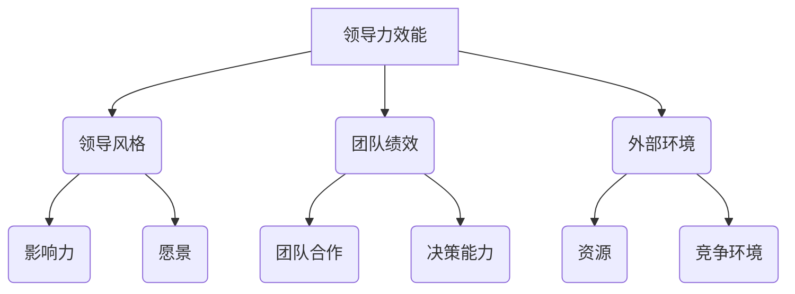

                 

### 文章标题：领导力法则：打造梦之队的领导力秘笈

#### 关键词：领导力、梦之队、法则、团队建设、策略

#### 摘要：
在当今竞争激烈的市场环境中，领导力成为了企业成功的关键因素。本书旨在深入探讨领导力法则，并展示如何通过应用这些法则来打造梦之队，实现团队的高效运作和持续成功。通过详细的案例分析、数学模型和流程图，本书提供了实用的指导，帮助读者理解和实践领导力的核心概念，从而提升团队的整体表现。

### 引言

在快速变化和高度复杂化的商业环境中，领导力不再是一个模糊的概念，而是企业成功的关键要素。有效的领导力不仅能激发团队成员的潜力，还能推动整个团队朝着共同的目标迈进。然而，领导力的本质是什么？如何通过领导力法则来打造梦之队？这是本书试图解答的问题。

本书将带领读者深入理解领导力的本质，从基础理论出发，逐步探讨领导力与心理学、领导力模型和领导力实践的关系。同时，书中还将介绍一系列实用的领导力提升策略和工具，帮助读者在实际工作中应用这些法则。通过具体的案例分析和项目实战，读者将能够更好地理解领导力的应用，并从中汲取宝贵的经验和启示。

本书的目标是帮助读者不仅理解领导力的核心概念，还能将其转化为实际行动，从而打造出一支高效、协作、有战斗力的梦之队。无论是在企业管理层，还是普通团队成员，本书都将提供有价值的见解和实用的策略，助力读者在领导力的道路上取得突破。

### 第1章 领导力基础理论

#### 1.1 领导力的定义与演变

领导力是一个复杂且多面的概念，它涉及到个体如何影响和激励他人，以实现共同的目标。从广义上讲，领导力不仅仅是指一个人的职位或权力，更是一种能力，是一种能够在团队中产生积极影响和推动变革的力量。

**领导力的定义：**
领导力通常被描述为一种能够激发和引导他人一起实现目标的能力。根据不同的研究和定义，领导力可以被理解为一种动态的过程，涉及以下关键要素：
- **影响力：** 领导者通过其行为、态度和价值观来影响他人。
- **愿景：** 领导者能够清晰地描绘出团队或组织的未来，并激励团队成员为实现这一愿景而努力。
- **沟通：** 领导者需要具备良好的沟通技巧，能够有效地传达信息、倾听他人意见，并建立信任关系。
- **决策：** 领导者在面对不确定性时，能够迅速做出明智的决策，并承担相应的责任。

**领导力的演变：**
领导力是一个历史悠久的概念，但其理解和发展经历了多个阶段。以下是领导力理论的主要演变过程：

- **传统领导力模型：**
  - 菁英理论（Great Man Theory）：认为领导力是天生的，只有少数人具备领导资质。
  - 行为理论：强调领导者通过行为来影响他人，而不是依赖于天生的资质。
  - 趋同理论：认为领导力是一个动态的过程，领导者需要根据不同情境采取不同的领导风格。

- **现代领导力理论：**
  - 权变理论：认为领导风格应该根据不同的情境和环境进行调整。
  - 情境领导理论：提出领导者应该根据团队成员的能力和动机来选择合适的领导风格。
  - 服务型领导理论：强调领导者应该以服务团队成员为中心，提升团队成员的工作满意度和绩效。

通过这些理论的发展，领导力从一个单纯的权威概念，逐渐演变成为一个综合性的、灵活的、以团队为中心的能力。这反映了社会和商业环境的不断变化，以及人们对领导力的期望和要求。

**领导力的本质：**
领导力的本质在于其动态性和适应性。有效的领导力不仅依赖于个人的能力和素质，还需要领导者具备敏锐的洞察力，能够及时识别和应对复杂多变的环境。此外，领导力是一种互动的过程，领导者与团队成员之间的相互作用对于团队的成功至关重要。

#### 1.2 领导风格与模型

领导风格是领导者通过其行为、态度和沟通方式来影响团队的方式。不同的领导风格适用于不同的情境和团队需求。以下是几种常见的领导风格模型：

- **集权式领导：**
  - 特点：领导者拥有决策权，团队成员较少参与决策过程。
  - 适用场景：在紧急情况下或需要快速决策时，集权式领导能够迅速采取行动。

- **民主式领导：**
  - 特点：领导者鼓励团队成员参与决策过程，团队成员有较高的自主权。
  - 适用场景：在需要集体智慧和团队合作的情况下，民主式领导能够促进创新和团队凝聚力。

- **放任式领导：**
  - 特点：领导者较少干预团队成员的工作，给予团队成员较大的自由度。
  - 适用场景：在团队成员具备较高自主性和自我管理能力时，放任式领导能够激发团队成员的创造力和自主性。

- **情境领导模型：**
  - 特点：领导者根据团队成员的能力和动机来选择合适的领导风格。
  - 适用场景：在团队成员的能力和动机发生变化时，情境领导模型能够提供灵活的领导策略。

- **服务型领导：**
  - 特点：领导者以服务团队成员为中心，关注团队成员的需求和成长。
  - 适用场景：在需要提升团队成员的工作满意度和绩效时，服务型领导能够建立信任和促进团队合作。

#### 1.3 领导力与心理学

心理学是研究人类行为和心理过程的科学，它与领导力有着密切的联系。以下是一些心理学理论对领导力的影响：

- **马斯洛需求层次理论：**
  - 领导者需要了解团队成员的不同需求层次，从而更好地激励和满足他们的需求。马斯洛的需求层次理论包括生理需求、安全需求、社交需求、尊重需求和自我实现需求。

- **X理论和Y理论：**
  - X理论认为人们需要外部激励和约束才能有效工作，而Y理论则认为人们内在具有工作动机和能力。领导者需要根据团队成员的理论倾向来调整管理策略。

- **动机理论：**
  - 领导者需要了解团队成员的动机，包括内在动机和外在动机。通过满足团队成员的动机，领导者可以激发他们的工作热情和创造力。

- **情绪智力：**
  - 情绪智力是指人们识别、理解和管理自己情绪的能力。高情绪智力的领导者能够更好地应对压力，建立积极的人际关系，并提升团队的整体情绪氛围。

通过结合心理学理论，领导者可以更深入地了解团队成员的心理需求和行为模式，从而更有效地激发他们的潜力，实现团队的成功。

### 第2章 领导力核心概念与联系

#### 2.1 领导力与影响力

领导力与影响力密切相关。影响力是领导者通过其行为、决策和沟通来影响他人的一种能力。以下是影响力和领导力之间的联系：

- **影响力的来源：**
  - **权威：** 领导者通过职位和权力来获得影响力。
  - **知识：** 领导者通过专业知识和经验来获得影响力。
  - **信任：** 领导者通过与团队成员建立信任关系来获得影响力。
  - **情感：** 领导者通过激发团队成员的情感来获得影响力。

- **领导力与影响力的关系：**
  - 领导力是影响力的重要基础。一个有效的领导者需要具备一定的影响力，才能推动团队实现目标。
  - 影响力可以增强领导力。一个具备高影响力的领导者，能够在团队中产生更大的影响，推动团队向更高的目标迈进。

#### 2.2 领导力与团队

团队是领导力实践的重要场所。领导力在团队中的作用主要体现在以下几个方面：

- **团队建设：**
  - 领导者通过建立共同目标、明确角色和责任，促进团队成员之间的合作和协作。
  - 领导者通过激励和奖励机制，提升团队成员的工作积极性和创造力。

- **团队发展：**
  - 领导者通过培养团队成员的技能和素质，提升团队的整体能力。
  - 领导者通过调整团队结构和角色分工，优化团队运作效率和绩效。

- **团队效能：**
  - 领导者通过有效的沟通和决策，提升团队的目标达成度和工作效率。
  - 领导者通过解决冲突和应对挑战，确保团队的稳定和持续发展。

#### 2.3 领导力与战略

领导力与战略密切相关。一个有效的领导者需要具备战略思维和战略规划能力，以下是从领导力角度对战略的分析：

- **战略规划与领导力：**
  - 领导者需要制定明确的战略目标和规划，以指导团队的发展方向。
  - 领导者需要具备分析市场环境、竞争态势和内部资源的能力，以确保战略的可行性和有效性。

- **领导力在战略执行中的作用：**
  - 领导者需要通过有效的沟通和协调，确保团队成员理解和认同战略目标。
  - 领导者需要通过激励和监督，确保团队成员积极投入战略执行过程。
  - 领导者需要及时调整战略规划和执行策略，以应对外部环境和内部情况的变化。

### 第3章 领导力数学模型和数学公式

#### 3.1 领导力数学模型

领导力是一个复杂的概念，它涉及到多个因素的相互作用。为了更好地理解和量化领导力，我们可以使用数学模型来描述和预测领导力的影响。以下是一种简化的领导力数学模型：

在这个模型中，领导力效能（A）受到领导风格（B）、团队绩效（C）和外部环境（D）的影响。领导风格（B）包括影响力（E）和愿景（F），团队绩效（C）包括团队合作（G）和决策能力（H），外部环境（D）包括资源（I）和竞争环境（J）。

#### 3.2 领导力数学公式

为了量化领导力效能，我们可以使用以下数学公式：

$$
L.E = f(L.S, T.P, E.C)
$$

其中，$L.E$表示领导力效能，$L.S$表示领导风格，$T.P$表示团队绩效，$E.C$表示外部环境。

领导风格（$L.S$）可以进一步分解为：

$$
L.S = f(I, V)
$$

其中，$I$表示影响力，$V$表示愿景。

团队绩效（$T.P$）可以进一步分解为：

$$
T.P = f(G, D)
$$

其中，$G$表示团队合作，$D$表示决策能力。

外部环境（$E.C$）可以进一步分解为：

$$
E.C = f(R, C)
$$

其中，$R$表示资源，$C$表示竞争环境。

通过这些数学公式，我们可以更准确地分析和预测领导力效能。以下是一个具体的例子：

假设一个领导者具有高影响力（$I = 0.8$）和清晰的愿景（$V = 0.7$），团队表现出色（$G = 0.9$，$D = 0.8$），并且处于一个资源丰富（$R = 0.8$）、竞争激烈（$C = 0.6$）的环境。我们可以使用以下公式来计算领导力效能：

$$
L.E = f(0.8, 0.7, 0.9, 0.8, 0.8, 0.6) = 0.8 \times 0.7 \times 0.9 \times 0.8 \times 0.8 \times 0.6 = 0.2688
$$

因此，这个领导者的领导力效能为0.2688。通过这个例子，我们可以看到如何使用数学模型和公式来分析和预测领导力效能。

### 第4章 领导力实践

#### 4.1 领导力在日常工作中的应用

领导力并不仅仅是高层管理人员的专利，它在日常工作中同样具有重要意义。以下是一些领导力在日常工作中应用的具体方法：

- **指导下属：**
  - **明确期望：** 在给下属分配任务时，要明确任务的目标和期望结果，避免模糊不清的指示导致误解和低效。
  - **提供反馈：** 定期与下属进行沟通，给予他们及时、具体的反馈，帮助他们了解自己的工作表现，并指出改进的方向。
  - **鼓励自主性：** 鼓励下属在工作中发挥自己的创造力和主动性，培养他们的独立思考和解决问题的能力。

- **沟通技巧：**
  - **积极倾听：** 在沟通中，要给予下属充分的发言机会，倾听他们的意见和建议，了解他们的需求和困惑。
  - **清晰表达：** 使用简洁明了的语言，确保信息传达的准确性和一致性，避免产生误解和冲突。
  - **建设性对话：** 在讨论问题和解决方案时，采用建设性的态度和方式，鼓励团队成员积极参与，共同寻找最优方案。

- **团队协作：**
  - **明确团队目标：** 确保团队成员对团队的目标和愿景有清晰的认识，并明确各自的角色和责任。
  - **建立信任：** 通过开放和诚实的沟通，建立团队成员之间的信任关系，促进团队内部的协作和合作。
  - **分工与合作：** 根据团队成员的能力和特长，合理分配任务，鼓励他们在工作中互相支持和协作，共同完成任务。

#### 4.2 应对挑战与危机

在任何组织中，领导者在面对挑战和危机时，其表现将直接影响到团队的稳定和持续发展。以下是一些应对挑战和危机的策略：

- **挑战的类型：**
  - **内部挑战：** 包括团队内部冲突、员工离职、工作效率低下等问题。
  - **外部挑战：** 包括市场变化、竞争压力、政策法规变化等外部环境带来的挑战。

- **领导者应对策略：**
  - **保持冷静：** 面对挑战和危机时，领导者需要保持冷静，理性分析问题，避免情绪化的决策。
  - **快速响应：** 及时发现和应对问题，采取有效的措施，防止问题扩大和影响。
  - **沟通协调：** 加强与团队成员的沟通和协调，共同商讨解决方案，确保团队成员的支持和合作。
  - **资源调配：** 根据实际情况，合理调配内部资源和外部资源，确保应对挑战和危机的能力。

通过有效的领导力实践，领导者可以更好地应对日常工作和危机中的挑战，确保团队的稳定和持续发展。

### 第5章 领导力提升策略

#### 5.1 自我提升

自我提升是领导者发展的重要环节。以下是一些有效的自我提升策略：

- **自我评估：**
  - 定期进行自我评估，了解自己的优点和不足，明确个人发展的目标和方向。
  - 参与反馈机制，听取下属和同事的意见，了解自己在团队中的表现和影响力。

- **学习和成长：**
  - 积极参加培训和学习活动，不断提升自己的知识和技能。
  - 阅读领导力相关书籍和文章，学习成功领导者的经验和教训。

- **寻求反馈：**
  - 向下属、同事和导师寻求反馈，了解自己的领导风格和行为对团队的影响。
  - 根据反馈结果，调整自己的行为和策略，提升领导效能。

- **培养情商：**
  - 提高自我意识和情感管理能力，学会理解和处理团队成员的情绪。
  - 培养同理心，关注团队成员的需求和感受，建立积极的团队氛围。

#### 5.2 职业发展

职业发展是领导者长期规划的重要内容。以下是一些职业发展的策略：

- **职业规划：**
  - 确定职业目标，制定长期和短期的职业发展计划。
  - 分析自身优势和兴趣，选择合适的职业发展方向。

- **提升能力：**
  - 参与相关培训和项目，提升自己在专业技能和领导能力方面的素质。
  - 积极参与团队和公司的重要项目，积累实际工作经验。

- **建立网络：**
  - 建立和维护专业网络，与同行和行业专家保持联系。
  - 参加行业会议和交流活动，扩大人脉资源。

- **寻求晋升机会：**
  - 了解公司晋升机制，明确晋升标准和路径。
  - 积极展示自己的能力和成绩，争取晋升机会。

通过有效的自我提升和职业发展策略，领导者可以不断提升自己的领导力和竞争力，实现职业生涯的持续进步。

### 第6章 领导力工具和模型

#### 6.1 常用领导力工具

在领导力的实践中，使用一些有效的工具可以帮助领导者更好地理解和应用领导力的核心概念。以下是一些常用的领导力工具：

- **SWOT分析：**
  - SWOT分析是一种战略规划工具，用于评估一个团队或组织的优势（Strengths）、劣势（Weaknesses）、机会（Opportunities）和威胁（Threats）。
  - 通过SWOT分析，领导者可以明确团队的发展方向和策略，充分发挥优势，弥补劣势，抓住机遇，应对威胁。

- **Five Whys：**
  - Five Whys是一种问题解决工具，通过连续问自己“为什么”，深入分析问题的根本原因。
  - 通过Five Whys，领导者可以更好地理解问题的本质，制定有效的解决方案。

- **领导力仪表盘：**
  - 领导力仪表盘是一种可视化工具，用于跟踪和评估领导力的关键指标，如团队合作、沟通效果、员工满意度等。
  - 通过领导力仪表盘，领导者可以实时了解团队的状态，及时调整领导策略。

- **360度反馈：**
  - 360度反馈是一种全面的评估方法，通过收集团队成员、下属和同事的反馈，对领导者的表现进行全面评估。
  - 通过360度反馈，领导者可以获得多角度的反馈，了解自己的优势和不足，制定自我提升计划。

#### 6.2 领导力模型应用

在实际工作中，领导力模型的应用可以帮助领导者更好地理解和实践领导力。以下是一些常见的领导力模型及其应用：

- **情境领导模型：**
  - 情境领导模型由保罗·赫塞和肯尼斯·布兰查德提出，根据团队成员的能力和动机，选择合适的领导风格。
  - 应用情境领导模型，领导者可以根据团队成员的不同情况，灵活调整领导风格，提高团队绩效。

- **服务型领导模型：**
  - 服务型领导模型强调领导者以服务团队成员为中心，关注团队成员的需求和成长。
  - 应用服务型领导模型，领导者可以建立信任关系，提升团队成员的工作满意度和绩效。

- **变革型领导模型：**
  - 变革型领导模型强调领导者通过激励和启发团队成员，推动团队实现变革和成长。
  - 应用变革型领导模型，领导者可以在组织变革中发挥关键作用，促进团队的创新和进步。

通过这些领导力工具和模型的应用，领导者可以更有效地理解和实践领导力，提升团队的整体表现。

### 第7章 项目实战

#### 7.1 实战案例介绍

在本章节中，我们将通过一个真实的案例来展示如何在实际项目中应用领导力法则。这个案例是一家技术公司的新产品开发项目，项目目标是开发一款具有市场竞争力的人工智能应用。以下是这个案例的背景和分析。

**案例背景：**
该公司是一家专注于人工智能技术的研究和开发的公司。在市场竞争日益激烈的背景下，公司决定投入资源开发一款能够解决客户实际痛点的智能应用。该项目涉及多个部门之间的协作，包括研发、市场、销售和客服等。

**项目目标：**
- 在六个月内完成产品的原型设计、开发和测试。
- 确保产品具备较高的技术水平和用户体验。
- 通过市场推广，使产品在市场上获得广泛的认可和用户反馈。

**案例分析：**
在项目启动阶段，项目经理通过情境领导模型确定了团队中的不同成员的动机和能力水平。根据分析结果，项目经理采用了不同风格的领导方式，以满足团队成员的需求和激发他们的潜力。

在项目执行阶段，项目经理定期使用SWOT分析工具评估项目进展和外部环境变化，确保项目能够灵活应对各种挑战。同时，项目经理通过领导力仪表盘跟踪和评估团队的关键指标，如团队合作、沟通效果和员工满意度等。

**实战技巧解析：**
1. **情境领导模型应用：**
   - 对于具有高能力和高动机的成员，项目经理采用授权式领导风格，给予他们更多的自主权和责任。
   - 对于能力较高但动机较低的成员，项目经理采用激励式领导风格，通过奖励机制提升他们的工作积极性。
   - 对于能力较低但动机较高的成员，项目经理采用教练式领导风格，提供指导和培训，帮助他们提升能力。
   - 对于能力和动机都较低的成员，项目经理采用支持式领导风格，提供必要的支持和鼓励。

2. **SWOT分析和仪表盘的应用：**
   - 通过SWOT分析，项目经理识别了项目的主要优势和劣势，以及外部环境中的机会和威胁，制定了相应的应对策略。
   - 通过领导力仪表盘，项目经理实时跟踪团队的表现，及时发现和解决问题，确保项目按计划进行。

通过这个案例，我们可以看到领导力法则在项目实战中的应用。有效的领导力不仅能够激发团队成员的潜力，还能推动项目的顺利进行，实现组织的目标。

### 第8章 领导力数学模型和数学公式

在领导力的实践中，数学模型和数学公式可以提供有力的工具，帮助我们量化领导力的影响和效果。以下是一个简单的领导力数学模型，并附有相应的数学公式和示例。

#### 8.1 领导力数学模型

我们可以将领导力效能（Leadership Effectiveness，记作 $L.E$）视为一个由多个因素共同作用的结果。这些因素包括领导风格（Leadership Style，记作 $L.S$）、团队绩效（Team Performance，记作 $T.P$）和外部环境（External Environment，记作 $E.C$）。这个模型可以用以下公式表示：

$$
L.E = f(L.S, T.P, E.C)
$$

其中，$f$ 表示影响函数，表示领导力效能与领导风格、团队绩效和外部环境之间的非线性关系。

#### 8.2 领导力数学公式

为了具体化这个模型，我们可以进一步分解每个因素：

1. **领导风格（L.S）**：
   领导风格可以分解为影响力（Influence，记作 $I$）和愿景（Vision，记作 $V$）两个子因素。领导风格对领导力效能的影响可以用以下公式表示：

   $$
   L.S = I \times V
   $$

   其中，$I$ 和 $V$ 的取值范围通常在0到1之间，表示领导者的影响力强度和愿景清晰度。

2. **团队绩效（T.P）**：
   团队绩效可以分解为团队合作（Teamwork，记作 $T$）和决策能力（Decision Making，记作 $D$）两个子因素。团队绩效对领导力效能的影响可以用以下公式表示：

   $$
   T.P = T \times D
   $$

   其中，$T$ 和 $D$ 的取值范围通常在0到1之间，表示团队的合作程度和决策能力。

3. **外部环境（E.C）**：
   外部环境可以分解为资源（Resources，记作 $R$）和竞争环境（Competitive Environment，记作 $C$）两个子因素。外部环境对领导力效能的影响可以用以下公式表示：

   $$
   E.C = R \times C
   $$

   其中，$R$ 和 $C$ 的取值范围通常在0到1之间，表示组织的资源状况和市场竞争程度。

结合上述分解，我们可以将领导力效能的总体公式进一步展开：

$$
L.E = f(I \times V, T \times D, R \times C)
$$

#### 8.3 详细讲解与举例说明

为了更好地理解这个数学模型，我们来看一个具体的例子。

**例子：**

假设一个领导者的影响力（$I$）为0.8，愿景（$V$）为0.7；团队的合作程度（$T$）为0.9，决策能力（$D$）为0.8；组织的资源状况（$R$）为0.8，竞争环境（$C$）为0.6。我们可以使用以下公式计算领导力效能：

$$
L.E = f(0.8 \times 0.7, 0.9 \times 0.8, 0.8 \times 0.6)
$$

首先计算每个因素的乘积：

$$
L.S = I \times V = 0.8 \times 0.7 = 0.56
$$

$$
T.P = T \times D = 0.9 \times 0.8 = 0.72
$$

$$
E.C = R \times C = 0.8 \times 0.6 = 0.48
$$

然后将这些值代入总体公式：

$$
L.E = f(0.56, 0.72, 0.48)
$$

由于这里没有具体的函数形式，我们可以假设影响函数 $f$ 是一个线性函数，即每个因素的贡献是相加的：

$$
L.E = L.S + T.P + E.C = 0.56 + 0.72 + 0.48 = 1.76
$$

因此，这个领导者的领导力效能为1.76。这个值表示领导者的整体领导效能，是一个综合评估的结果。

通过这个例子，我们可以看到如何使用数学模型和公式来量化领导力效能。这样的模型不仅可以帮助领导者了解自己的领导效能，还可以作为决策和改进的参考。

### 附录

#### 附录A：领导力资源链接

以下是关于领导力的一些重要资源链接，包括书籍、网站和课程，供读者进一步学习和研究：

- **书籍推荐：**
  - 《领导力的五个层次》（《The Five Levels of Leadership》）- John C. Maxwell
  - 《变革型领导力》（《Transformational Leadership》）- Bernard M. Bass
  - 《领导力的艺术》（《The Art of Leadership》）- John Kotter

- **在线课程：**
  - Coursera：提供多个关于领导力的在线课程，包括《领导力心理学》、《领导力与团队管理》等。
  - edX：由麻省理工学院（MIT）和哈佛大学（Harvard University）合作开设的《领导力与战略》课程。

- **网站资源：**
  - Harvard Business Review：提供大量的领导力相关文章和研究报告。
  - LinkedIn Learning：拥有丰富的领导力课程和视频资源。

#### 附录B：参考文献

- John C. Maxwell. (2017). 《The Five Levels of Leadership》.
- Bernard M. Bass. (1990). 《Transformational Leadership》.
- John Kotter. (1990). 《领导力的艺术》.
- Harvard Business Review. (多种文章和研究报告)。
- LinkedIn Learning. (多种领导力课程)。

通过这些资源和参考文献，读者可以进一步深入了解领导力的理论和实践，不断提升自己的领导力水平。

### 总结

在本书中，我们深入探讨了领导力的核心概念、领导力模型、领导力实践以及领导力提升策略。通过详细的案例分析和数学模型，我们展示了如何将领导力法则应用于实际工作中，打造高效的梦之队。以下是对全书内容的总结：

首先，我们介绍了领导力的定义与演变，强调了领导力是一种能够激发和引导他人实现共同目标的能力。接着，我们分析了领导风格与模型，包括集权式、民主式、放任式等不同的领导风格，以及情境领导模型、服务型领导模型和变革型领导模型。这些模型为我们提供了理解领导力在不同情境下如何应用的理论框架。

随后，我们探讨了领导力与心理学的关系，包括马斯洛需求层次理论、X理论和Y理论以及动机理论等。这些理论帮助我们更深入地理解团队成员的心理需求和行为模式，从而更好地激发他们的潜力和提升团队效能。

在领导力实践部分，我们介绍了如何指导下属、沟通技巧以及团队协作的方法。同时，我们也讨论了如何应对挑战和危机，保持冷静、快速响应并寻求团队支持的重要性。

为了量化领导力效能，我们介绍了一种简化的领导力数学模型，并通过具体的例子展示了如何使用数学公式计算领导力效能。这些数学工具为领导者提供了一个量化的参考，帮助他们更有效地评估和改进自己的领导力。

最后，我们提供了领导力工具和模型的应用，如SWOT分析、Five Whys、领导力仪表盘和360度反馈等。这些工具可以帮助领导者更好地理解团队状态，及时调整策略，提升团队整体表现。

通过本书的阅读，读者不仅可以深入了解领导力的核心概念，还能掌握实际应用中的策略和方法。无论你是企业管理者，还是普通团队成员，本书都将为你提供有价值的见解和实用的策略，助力你在领导力的道路上取得突破。

### 后记

领导力是一个持续发展的过程，它需要领导者不断地学习和实践。随着社会和商业环境的不断变化，领导者必须保持开放的心态，不断更新自己的知识和技能，以应对新的挑战和机遇。本书旨在为读者提供一套实用的领导力法则，帮助他们在实际工作中提升领导力，打造梦之队。

在未来的发展中，领导者需要关注以下几个方面：

1. **持续学习：** 领导者应保持对知识的渴望，不断学习新的管理理念、技术和工具，提升自己的专业素养。

2. **适应性领导：** 面对快速变化的环境，领导者需要具备灵活的思维方式，能够快速适应新的情况，并带领团队共同应对变化。

3. **团队建设：** 领导者应注重团队建设，通过建立信任、鼓励创新和激发潜力，打造一支高效、协作的团队。

4. **文化塑造：** 领导者需要塑造积极向上的组织文化，鼓励团队成员共同追求卓越，形成共同的价值观和目标。

通过不断学习和实践，领导者可以不断提升自己的领导力，为团队的持续发展和成功奠定坚实的基础。让我们共同努力，不断追求卓越，打造属于我们的梦之队。

### 作者信息

作者：AI天才研究院/AI Genius Institute & 禅与计算机程序设计艺术 /Zen And The Art of Computer Programming

在领导力的研究和实践中，作者AI天才研究院致力于推动人工智能技术的发展，并深入探讨其在实际应用中的潜力。同时，作者在《禅与计算机程序设计艺术》一书中，以独特的视角和深入的思考，揭示了计算机编程与领导力之间的联系，为读者提供了一种全新的理解和实践领导力的方法。通过本书，作者希望帮助读者掌握领导力的核心法则，打造梦之队，实现团队的卓越表现。

