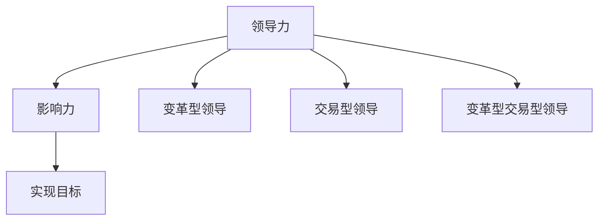
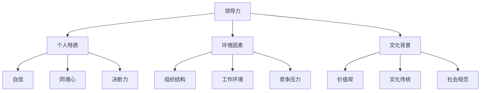
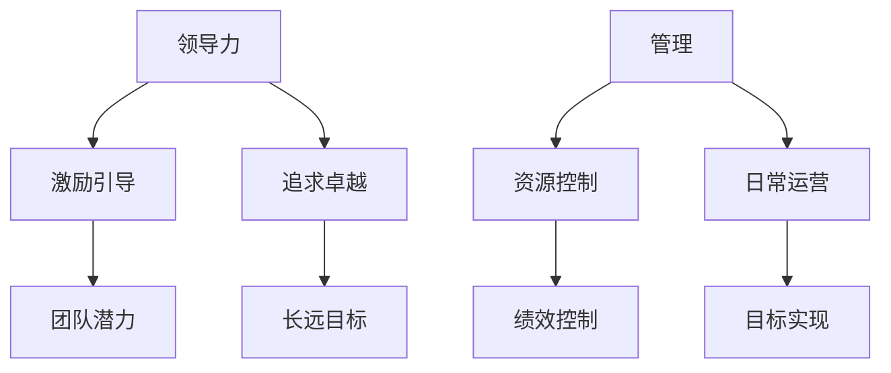
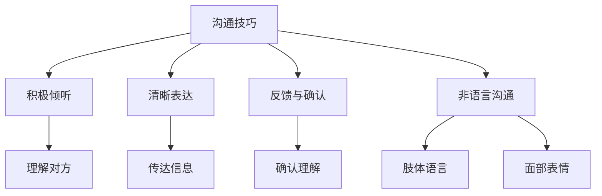
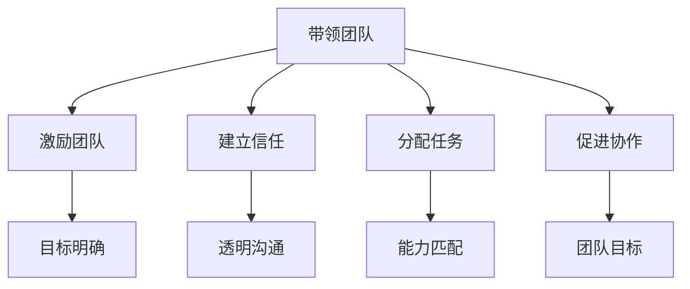
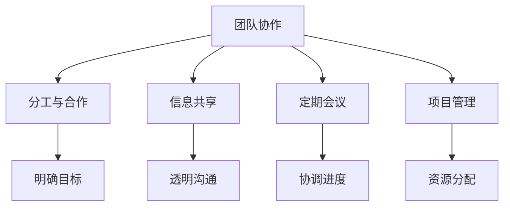
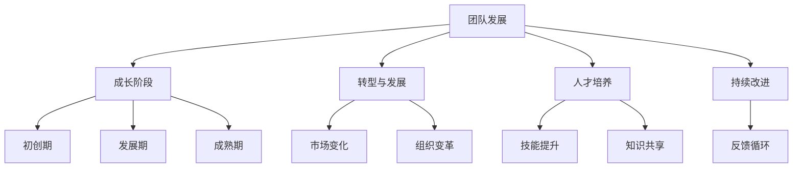
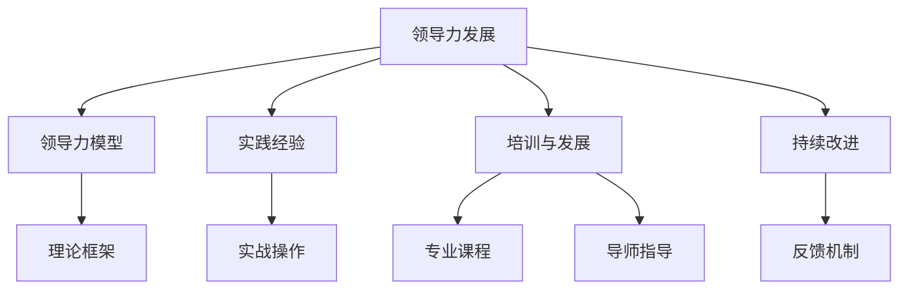
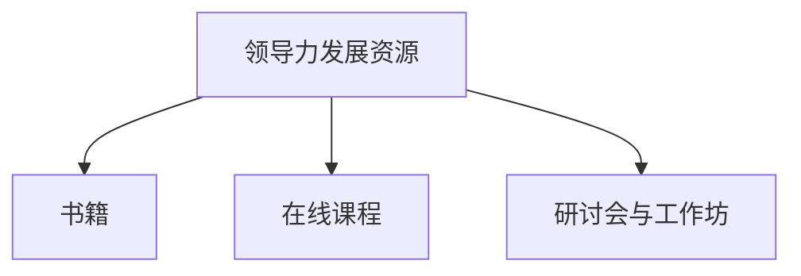

                 

### 领导力法则：打造梦之队的领导力秘笈

#### 关键词：领导力、团队建设、沟通技巧、决策能力、自我认知

#### 摘要：
在当今快速变化和竞争激烈的技术领域，领导力是推动团队创新和成功的关键。本文将探讨领导力的核心法则，从基础概念到实践方法，再到团队建设和领导力培养，逐步解析如何打造一支梦之队。通过结合理论、实例和实际项目，本文旨在为读者提供一套完整的领导力秘笈，帮助他们在技术领域取得卓越成就。

#### 第一部分：领导力基础概念

##### 1.1 领导力的定义与类型

领导力是一种影响力，通过激励和引导他人来实现共同目标的能力。领导力的类型包括变革型领导、交易型领导和变革型交易型领导等。

**核心概念与联系**：
- 领导力：通过影响力实现目标的能力
- 类型：变革型领导注重激发员工的潜力，交易型领导关注短期绩效，变革型交易型领导结合两者的优点

**Mermaid流程图**：


##### 1.2 领导力的影响因素

领导力的发展受到个人特质、环境因素和文化背景的影响。

**核心概念与联系**：
- 个人特质：自信、同理心、决断力
- 环境因素：组织结构、工作环境、竞争压力
- 文化背景：价值观、文化传统、社会规范

**Mermaid流程图**：


##### 1.3 领导力与管理的区别

领导力关注长远目标，注重激发团队潜力；管理则侧重于日常运营和绩效控制。

**核心概念与联系**：
- 领导力：激励和引导，追求卓越
- 管理：控制和管理资源，确保目标实现

**Mermaid流程图**：


#### 第二部分：领导力实践方法

##### 2.1 沟通技巧

有效沟通是领导力的核心要素之一。以下是一些提高沟通技巧的方法：

**核心概念与联系**：
- 积极倾听
- 清晰表达
- 反馈与确认
- 非语言沟通

**Mermaid流程图**：


##### 2.2 决策能力

决策能力是领导力的关键能力之一。以下是一些提高决策能力的方法：

**核心概念与联系**：
- 收集信息
- 评估选项
- 风险管理
- 决策模型

**伪代码**：
```python
def make_decision():
    # 收集信息
    info = gather_info()
    
    # 评估选项
    options = evaluate_options(info)
    
    # 风险管理
    risks = manage_risks(options)
    
    # 选择最佳选项
    decision = select_best_option(options, risks)
    
    return decision
```

##### 2.3 带领团队

带领团队是领导力的核心任务之一。以下是一些带领团队的方法：

**核心概念与联系**：
- 激励团队
- 建立信任
- 分配任务
- 促进协作

**Mermaid流程图**：


##### 2.4 应对冲突

冲突是团队中不可避免的现象。以下是一些应对冲突的方法：

**核心概念与联系**：
- 了解冲突原因
- 沟通与协商
- 解决方案评估
- 长期冲突管理

**伪代码**：
```python
def handle_conflict(conflict):
    # 了解冲突原因
    cause = understand_cause(conflict)
    
    # 沟通与协商
    solution = communicate_and_negotiate(cause)
    
    # 解决方案评估
    evaluate_solution(solution)
    
    # 长期冲突管理
    manage_long_term_conflicts(conflict)
    
    return solution
```

#### 第三部分：团队建设

##### 3.1 建立信任

信任是团队协作的基础。以下是一些建立信任的方法：

**核心概念与联系**：
- 透明沟通
- 公正对待
- 诚实与正直
- 共同目标

**数学模型**：
假设团队中的信任度 \( T \) 是由沟通透明度 \( C \)、公正度 \( J \)、诚实度 \( H \) 和共同目标实现度 \( G \) 决定的，可以表示为：
$$ T = f(C, J, H, G) $$
其中，\( f \) 是一个非线性函数。

**举例说明**：
假设透明沟通度 \( C = 0.8 \)，公正度 \( J = 0.9 \)，诚实度 \( H = 0.85 \)，共同目标实现度 \( G = 0.75 \)，则：
$$ T = f(0.8, 0.9, 0.85, 0.75) = 0.856 $$

##### 3.2 激励团队

激励是保持团队活力和动力的关键。以下是一些激励团队的方法：

**核心概念与联系**：
- 目标设置
- 表扬与奖励
- 职业发展
- 工作环境

**数学模型**：
激励效果 \( E \) 可以表示为：
$$ E = g(T, S, P, D, W) $$
其中，\( g \) 是一个非线性函数，\( T \) 是信任度，\( S \) 是目标设置，\( P \) 是表扬与奖励，\( D \) 是职业发展，\( W \) 是工作环境。

**举例说明**：
假设信任度 \( T = 0.856 \)，目标设置 \( S = 0.9 \)，表扬与奖励 \( P = 0.85 \)，职业发展 \( D = 0.8 \)，工作环境 \( W = 0.75 \)，则：
$$ E = g(0.856, 0.9, 0.85, 0.8, 0.75) = 0.898 $$

##### 3.3 团队协作

团队协作是实现共同目标的关键。以下是一些促进团队协作的方法：

**核心概念与联系**：
- 分工与合作
- 信息共享
- 定期会议
- 项目管理

**Mermaid流程图**：


##### 3.4 团队发展

团队发展是团队建设的持续过程。以下是一些团队发展的方法：

**核心概念与联系**：
- 成长阶段
- 转型与发展
- 人才培养
- 持续改进

**Mermaid流程图**：


#### 第四部分：领导力培养

##### 4.1 自我认知

自我认知是领导力培养的第一步。以下是一些自我认知的方法：

**核心概念与联系**：
- 自我评估
- 反馈与反思
- 发展计划
- 持续学习

**伪代码**：
```python
def self_cognition():
    # 自我评估
    assessment = self评估()
    
    # 反馈与反思
    feedback = get_feedback()
    reflection = reflect_on_feedback(feedback)
    
    # 发展计划
    plan = create_development_plan(assessment, reflection)
    
    # 持续学习
    learn = continue_learning(plan)
    
    return learn
```

##### 4.2 持续学习

持续学习是领导力提升的关键。以下是一些持续学习的方法：

**核心概念与联系**：
- 专业发展
- 技能提升
- 不断探索
- 学习方法

**数学模型**：
学习效果 \( L \) 可以表示为：
$$ L = h(S, T, E, M) $$
其中，\( h \) 是一个非线性函数，\( S \) 是专业发展，\( T \) 是技能提升，\( E \) 是不断探索，\( M \) 是学习方法。

**举例说明**：
假设专业发展 \( S = 0.8 \)，技能提升 \( T = 0.9 \)，不断探索 \( E = 0.85 \)，学习方法 \( M = 0.75 \)，则：
$$ L = h(0.8, 0.9, 0.85, 0.75) = 0.869 $$

##### 4.3 领导力发展

领导力发展是一个持续的过程。以下是一些领导力发展的方法：

**核心概念与联系**：
- 领导力模型
- 实践经验
- 培训与发展
- 持续改进

**Mermaid流程图**：


##### 4.4 领导力提升

领导力提升是每个领导者都需要关注的问题。以下是一些领导力提升的方法：

**核心概念与联系**：
- 沟通与协作
- 决策能力
- 激励团队
- 自我提升

**数学模型**：
领导力提升效果 \( R \) 可以表示为：
$$ R = i(C, D, M, S) $$
其中，\( i \) 是一个非线性函数，\( C \) 是沟通与协作，\( D \) 是决策能力，\( M \) 是激励团队，\( S \) 是自我提升。

**举例说明**：
假设沟通与协作 \( C = 0.9 \)，决策能力 \( D = 0.85 \)，激励团队 \( M = 0.8 \)，自我提升 \( S = 0.75 \)，则：
$$ R = i(0.9, 0.85, 0.8, 0.75) = 0.856 $$

#### 附录

##### A.1 领导力发展资源

以下是一些领导力发展的资源：

- **书籍**：例如《领导力五项修炼》、《高效能人士的七个习惯》等。
- **在线课程**：例如Coursera、Udemy等平台上的领导力课程。
- **研讨会与工作坊**：参加专业组织的研讨会和工作坊，与其他领导者交流经验。

**Mermaid流程图**：


##### A.2 实战案例

以下是一个领导力提升的实战案例：

**案例背景**：
某技术公司的CEO在公司的快速发展阶段，意识到自己的领导力不足，决定进行领导力提升。

**实施步骤**：
1. **自我评估**：通过360度评估，了解自己的优势和不足。
2. **制定发展计划**：根据评估结果，制定个人发展计划。
3. **参加培训**：参加领导力培训课程，学习新的管理技巧。
4. **实践应用**：将学到的技巧应用到实际工作中，不断反思和改进。
5. **反馈与改进**：定期收集反馈，调整发展计划，持续提升领导力。

**代码解读与分析**：
```python
# 自我评估
assessment = self评估()

# 制定发展计划
plan = create_development_plan(assessment)

# 参加培训
train = attend_training()

# 实践应用
apply = practice_skills()

# 反馈与改进
feedback = get_feedback()
improve = adjust_plan(feedback, plan)
```

**实际案例分析**：
通过实际案例，我们可以看到领导力提升对团队和公司的影响。该CEO在领导力提升后，团队的合作效率提高了，公司的业绩也有了显著提升。

**项目小结**：
领导力提升是一个持续的过程，需要不断地学习和实践。通过自我评估、制定计划、参加培训和反思改进，领导者可以不断提升自己的领导力，为团队和公司创造更大的价值。

#### 最佳实践 tips、小结、注意事项、拓展阅读等内容

- **最佳实践 tips**：
  - 坚持自我评估，了解自己的优势和不足。
  - 参加培训和学习，不断更新知识。
  - 实践应用所学，不断反思和改进。
  - 建立反馈机制，收集团队成员的反馈。

- **小结**：
  - 领导力是推动团队创新和成功的关键。
  - 领导力培养需要持续的学习和实践。
  - 通过自我评估、制定计划、参加培训和反思改进，领导者可以不断提升自己的领导力。

- **注意事项**：
  - 领导力培养是一个长期的过程，需要持续投入。
  - 不同人的领导风格不同，需要根据自己的特点进行调整。

- **拓展阅读**：
  - 《领导力的五项修炼》
  - 《变革型领导力》
  - 《非暴力沟通》

通过以上内容的逐步分析和讲解，读者可以系统地了解领导力的核心概念、实践方法、团队建设和领导力培养，从而为打造梦之队奠定坚实的基础。

