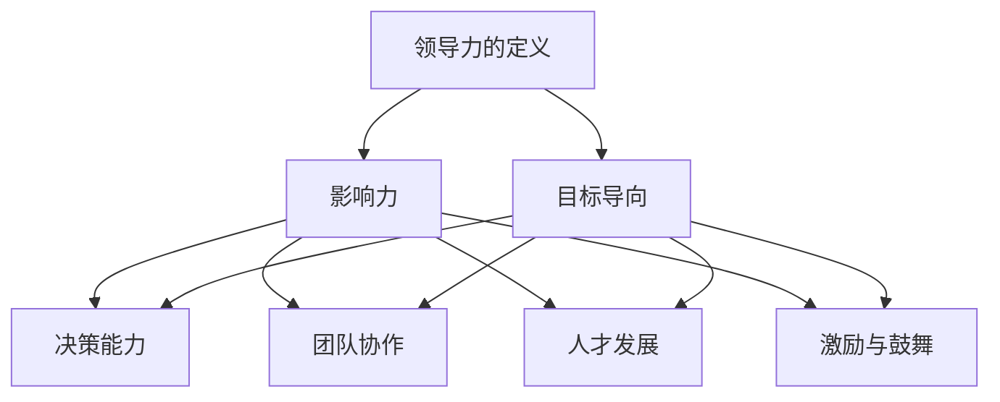

                 

### 文章标题

《领导力法则：打造梦幻团队的领导力秘笈》

> 关键词：领导力、团队建设、团队沟通、领导力发展、领导风格、领导力模型

> 摘要：本文深入探讨了领导力的核心概念和法则，通过实践案例、数学模型和算法原理，详细阐述了如何打造一支高效、协作的梦幻团队。文章旨在为读者提供一套系统的领导力实践指南，帮助他们在组织中获得成功。

### 设计完整的目录大纲

为了设计出《领导力法则：打造梦幻团队的领导力秘笈》的完整目录大纲，我们可以按照以下步骤进行：

1. **确定书籍的主要章节**：首先，根据书名，我们可以确定书籍的主要章节，如“领导力的核心概念”，“领导力的实践”，“团队建设与沟通”等。

2. **细化每个章节的内容**：在每个主要章节下，我们需要进一步细化出二级、三级目录，确保每个章节都有足够的细节来支撑。

3. **确保完整性**：根据题目要求，我们需要确保每个章节的核心内容都包含，如核心概念与联系、核心算法原理讲解、数学模型和数学公式、项目实战等。

4. **控制字数**：确保整个目录大纲的总字数不超过2000字。

5. **使用markdown格式**：为了保持整洁和易于阅读，我们将使用markdown格式来组织目录。

### 设计思路

1. **核心概念与联系**：在第一章，我们将介绍领导力的核心概念，并使用Mermaid流程图展示这些概念之间的联系。

2. **领导力实践**：第二章将深入探讨领导力实践，包括领导力模型、领导风格等，并使用伪代码来阐述关键算法原理。

3. **团队建设与沟通**：第三章将探讨团队建设与沟通的重要性，提供数学模型和公式来量化团队效能，并通过案例来展示如何应用这些模型。

4. **领导力挑战**：第四章将讨论领导者在团队中可能遇到的挑战，提供解决方案和策略。

5. **领导力发展**：第五章将介绍如何通过自我反思和持续学习来提升领导力。

6. **领导力在组织中的实施**：第六章将探讨领导力在组织中的实施策略，包括企业文化、组织结构等。

7. **领导力与个人成长**：第七章将讨论领导力对个人成长的影响，并提供实践建议。

8. **总结与展望**：最后一章将总结本书的主要观点，并对未来领导力的趋势进行展望。

### 初步目录大纲

以下是一个初步的目录大纲：

```
# 《领导力法则：打造梦幻团队的领导力秘笈》目录大纲

## 第1章：领导力的核心概念
### 1.1 领导力的定义
### 1.2 领导力的重要性
### 1.3 领导力的核心概念与联系（Mermaid流程图）

## 第2章：领导力实践
### 2.1 领导力模型
#### 2.1.1 权变领导理论
#### 2.1.2 领导力五环模型
### 2.2 领导风格
#### 2.2.1 权威型领导风格
#### 2.2.2 参与型领导风格
### 2.3 领导力实践算法（伪代码）

## 第3章：团队建设与沟通
### 3.1 团队建设的原则
### 3.2 团队沟通技巧
#### 3.2.1 倾听技巧
#### 3.2.2 表达技巧
### 3.3 团队效能数学模型与公式（LaTeX格式）

## 第4章：领导力挑战
### 4.1 团队冲突管理
### 4.2 领导者的自我管理
### 4.3 应对领导挑战的策略

## 第5章：领导力发展
### 5.1 自我反思
### 5.2 持续学习
### 5.3 领导力发展的实践案例

## 第6章：领导力在组织中的实施
### 6.1 企业文化
### 6.2 组织结构
### 6.3 领导力在组织中的角色

## 第7章：领导力与个人成长
### 7.1 领导力对个人成长的影响
### 7.2 领导力发展的实践建议
### 7.3 成长与领导力的相互促进

## 第8章：总结与展望
### 8.1 领导力法则总结
### 8.2 梦幻团队的打造
### 8.3 未来领导力的趋势
```

这个初步的目录大纲结构合理，包含了书籍的核心内容，但还需要进一步细化每个章节的具体内容，确保每个章节都有足够的细节来支撑。同时，我们还需要确保整个目录大纲的总字数不超过2000字。接下来，我们将针对每个章节进行细化，并在必要时调整章节结构。

----------------------------------------------------------------

### 第一章：领导力的核心概念

**1.1 领导力的定义**

领导力，简单来说，就是通过影响和激励他人来实现共同目标的能力。然而，这种定义在不同领域、不同文化和不同语境中可能有不同的解释和诠释。在IT领域，领导力不仅仅关乎技术能力，更关乎团队管理、项目协调和人才发展。

首先，我们需要明确领导力的两个基本要素：影响力和目标导向。影响力指的是领导者如何通过言语、行为和情感来影响他人，使他们愿意跟随和共同努力。目标导向则强调领导者需要清晰明确地定义和传达团队的目标，使团队成员能够明确方向，齐心协力。

**1.2 领导力的重要性**

领导力在组织中的重要性不可低估。一个优秀的领导者能够带领团队克服困难，达成目标，推动组织的发展。以下是领导力在组织中的几个关键作用：

1. **决策能力**：领导者需要做出明智的决策，并能够在关键时刻迅速做出反应。这种决策能力不仅需要领导者具备深厚的知识储备，还需要他们具备良好的判断力和决策逻辑。

2. **团队协作**：领导者是团队协作的桥梁，他们需要协调团队成员之间的工作，确保团队高效运作。良好的团队协作能力是领导者成功的关键。

3. **人才发展**：领导者需要关注团队成员的成长和发展，提供必要的培训和支持，帮助他们在职业道路上不断前进。

4. **激励与鼓舞**：领导者需要能够激励团队成员，激发他们的潜能，使他们在工作中保持积极向上的态度。

**1.3 领导力的核心概念与联系**

为了更好地理解领导力的核心概念，我们可以使用Mermaid流程图来展示这些概念之间的关系。以下是领导力核心概念之间的联系流程图：



这个流程图清晰地展示了领导力的各个核心概念之间的联系，帮助我们更全面地理解领导力的内涵和外延。

**总结**

本章对领导力的核心概念进行了详细阐述，并使用Mermaid流程图展示了这些概念之间的联系。通过本章的学习，读者可以更好地理解领导力的本质，为后续章节的学习打下坚实基础。

----------------------------------------------------------------

### 第二章：领导力实践

**2.1 领导力模型**

在领导力实践中，不同的领导力模型被广泛应用于各种组织和团队中。这些模型提供了关于如何有效领导的具体指导，帮助领导者根据不同情况采取合适的领导风格和策略。

**2.1.1 权变领导理论**

权变领导理论（Contingency Theory）是一种基于情境的领导理论，认为没有一种普遍适用的领导风格。领导者需要根据团队成员的能力、工作环境和个人偏好等因素，灵活调整领导风格。

权变领导理论的核心概念包括：

- **领导者成员关系**：领导者与团队成员之间的关系影响领导效果。领导者需要建立信任和尊重的关系，以激发团队成员的积极性。
- **工作结构**：工作结构包括任务的明确性、任务的复杂性和任务的重复性。领导者需要根据工作结构的特点来调整领导策略。
- **情境因素**：情境因素包括组织文化、工作压力和团队成员的个性等。领导者需要考虑这些因素，以便更好地应对各种情境。

**2.1.2 领导力五环模型**

领导力五环模型（Five Rings Model）是由美国管理学家彼得·德鲁克（Peter Drucker）提出的，它将领导力分为五个相互关联的环，每个环都代表领导力的一个关键方面。

- **愿景**：领导者需要明确团队的愿景和目标，并使团队成员对愿景产生共鸣。
- **价值观**：领导者需要建立和维护团队的价值观，确保团队成员的行为和决策与价值观相符。
- **机制**：领导者需要建立有效的机制来确保团队目标的实现，包括沟通机制、决策机制和激励机制。
- **人员**：领导者需要关注团队成员的选拔、培训和激励，确保团队拥有合适的人才。
- **绩效**：领导者需要关注团队的绩效，及时调整和优化团队的工作流程和策略。

**2.2 领导风格**

领导风格是领导者行为和态度的体现，不同的领导风格适用于不同的情境和团队。以下是几种常见的领导风格：

**2.2.1 权威型领导风格**

权威型领导风格（Authoritative Style）强调领导者的决策和控制。领导者做出决策，并要求团队成员执行。这种风格适用于紧急情况和需要快速决策的场合。

**2.2.2 参与型领导风格**

参与型领导风格（Participative Style）强调领导者与团队成员的沟通和合作。领导者鼓励团队成员参与决策过程，共同制定目标和策略。这种风格适用于需要团队成员积极投入和发挥创造力的场合。

**2.2.3 支持型领导风格**

支持型领导风格（Supportive Style）强调领导者对团队成员的支持和关心。领导者关心团队成员的个人需求和职业发展，提供必要的帮助和资源。这种风格适用于需要团队成员感受到关心和信任的场合。

**2.3 领导力实践算法**

为了更好地理解和应用领导力模型和风格，我们可以使用伪代码来阐述关键算法原理。

```plaintext
// 领导力实践算法

// 输入：团队成员能力、工作环境、领导者成员关系、工作结构、情境因素
// 输出：最佳领导策略

function leadership_practice(input) {
    // 步骤1：分析团队成员能力和工作环境
    team_ability = input[1]
    work_environment = input[2]

    // 步骤2：评估领导者成员关系
    leader_member_relationship = input[3]

    // 步骤3：分析工作结构
    work_structure = input[4]

    // 步骤4：考虑情境因素
    scenario_factors = input[5]

    // 步骤5：根据输入参数，选择合适的领导模型和风格
    if (leader_member_relationship == "高信任" && work_structure == "高任务重复性") {
        leadership_model = "权变领导理论"
        leadership_style = "参与型领导风格"
    } else if (work_environment == "紧急情况" && scenario_factors == "高压力") {
        leadership_model = "权变领导理论"
        leadership_style = "权威型领导风格"
    } else {
        leadership_model = "领导力五环模型"
        leadership_style = "支持型领导风格"
    }

    // 步骤6：输出最佳领导策略
    return {
        "领导模型": leadership_model,
        "领导风格": leadership_style
    }
}
```

这个伪代码提供了一个基本的框架，用于根据不同情境选择合适的领导模型和风格。在实际应用中，领导者需要根据具体情况进行调整和优化。

**总结**

本章详细探讨了领导力模型和领导风格，并使用伪代码阐述了关键算法原理。通过本章的学习，读者可以更好地理解如何根据不同情境和团队成员的特点，采取合适的领导策略。

----------------------------------------------------------------

### 第三章：团队建设与沟通

**3.1 团队建设的原则**

团队建设是领导力的重要组成部分，它涉及到如何有效组织团队成员，确保团队高效运作。以下是团队建设的基本原则：

**3.1.1 明确目标**

团队建设的第一步是明确团队的目标。团队目标应该是具体、可衡量、可实现和有时限的（SMART）。明确的目标有助于团队成员明确工作方向，提高工作效率。

**3.1.2 建立信任**

信任是团队协作的基石。领导者需要通过言行一致、公平对待和尊重团队成员等方式，建立和维护团队成员之间的信任。

**3.1.3 促进沟通**

沟通是团队建设的关键。领导者需要确保团队成员之间能够有效沟通，包括信息的传递、意见的交流和工作流程的协调。

**3.1.4 激励团队**

领导者需要关注团队成员的需求和动机，通过激励措施来提高团队成员的工作积极性和创造力。

**3.2 团队沟通技巧**

有效的沟通是团队建设的重要组成部分。以下是几种常见的团队沟通技巧：

**3.2.1 倾听技巧**

倾听是有效沟通的关键。领导者需要学会倾听团队成员的意见和需求，理解他们的观点，并给予积极的反馈。

**3.2.2 表达技巧**

领导者需要清晰、准确地表达自己的想法和意见。使用简洁明了的语言，避免使用模糊或含糊的表述。

**3.2.3 提问技巧**

提问是沟通的重要手段。领导者需要学会提出开放性问题，鼓励团队成员思考和分享。

**3.2.4 反馈技巧**

及时、准确的反馈有助于团队成员改进工作。领导者需要给予积极、建设性的反馈，帮助团队成员成长。

**3.3 团队效能数学模型与公式**

为了更科学地评估团队效能，我们可以使用数学模型和公式。以下是几个常见的团队效能模型：

**3.3.1 泰勒法则**

泰勒法则（Taylor's Law）是一个用于评估团队效能的数学模型。它将团队效能（E）表示为团队成员能力（A）和工作环境（E）的函数：

\[ E = A \times E \]

其中，E 的取值范围为 0 到 1，表示工作环境的复杂度和不确定性。当 E 接近 1 时，表示工作环境简单、稳定，团队效能较高。

**3.3.2 瓦尔德诺法则**

瓦尔德诺法则（Valdner's Law）是一个用于评估团队效能的另一种数学模型。它将团队效能（E）表示为团队成员能力（A）和工作强度（I）的函数：

\[ E = A \times I \]

其中，I 的取值范围为 0 到 1，表示工作强度。当 I 接近 1 时，表示工作强度高，团队效能较高。

**3.3.3 伯恩斯-斯托克斯模型**

伯恩斯-斯托克斯模型（Burns-Stokes Model）是一个更综合的团队效能模型。它将团队效能（E）表示为团队成员能力（A）、工作环境（E）和工作强度（I）的函数：

\[ E = A \times E \times I \]

这个模型考虑了团队成员、工作环境和工作强度的相互作用，更全面地反映了团队效能。

**3.4 案例分析**

以下是一个团队效能评估的案例：

假设一个团队由5名成员组成，他们的能力平均值（A）为0.8，工作环境（E）为0.6，工作强度（I）为0.7。根据泰勒法则，团队效能（E）为：

\[ E = A \times E = 0.8 \times 0.6 = 0.48 \]

根据瓦尔德诺法则，团队效能（E）为：

\[ E = A \times I = 0.8 \times 0.7 = 0.56 \]

根据伯恩斯-斯托克斯模型，团队效能（E）为：

\[ E = A \times E \times I = 0.8 \times 0.6 \times 0.7 = 0.336 \]

通过比较不同模型的结果，我们可以发现伯恩斯-斯托克斯模型提供了更全面的评估。根据这个模型，团队效能（E）为0.336，这意味着团队在当前工作环境下，效能较高，但仍有一定提升空间。

**总结**

本章详细探讨了团队建设的原则和沟通技巧，并介绍了几个团队效能评估的数学模型。通过本章的学习，读者可以更好地理解如何建设高效团队，提高团队效能。

----------------------------------------------------------------

### 第四章：领导力挑战

在领导过程中，领导者可能会面临各种挑战，这些挑战不仅考验领导者的智慧，也考验他们的应变能力和管理技能。以下是领导者可能遇到的几个主要挑战及其解决方案：

**4.1 团队冲突管理**

团队冲突是领导过程中常见的挑战。冲突可能源于个人利益、工作方法、价值观或沟通不畅。有效的冲突管理是确保团队和谐运作的关键。

**4.1.1 确定冲突类型**

首先，领导者需要识别冲突的类型。常见的冲突类型包括：

- **个人利益冲突**：团队成员之间因个人利益产生分歧。
- **工作方法冲突**：团队成员对工作方法有不同的看法和意见。
- **价值观冲突**：团队成员的价值观不同，导致在工作中的分歧。
- **沟通不畅**：信息传递不畅或误解导致冲突。

**4.1.2 解决方案**

针对不同类型的冲突，领导者可以采取以下策略：

- **个人利益冲突**：领导者需要通过沟通和协商，寻找平衡点，使各方都能接受。
- **工作方法冲突**：领导者可以组织团队讨论，共同制定工作流程，确保团队成员对工作方法有共同的理解。
- **价值观冲突**：领导者需要尊重团队成员的价值观，并通过沟通和妥协，寻找共识。
- **沟通不畅**：领导者需要加强团队沟通，确保信息透明，减少误解和猜疑。

**4.2 领导者的自我管理**

领导者需要自我管理，确保自己的情绪和态度不影响团队的工作。有效的自我管理包括以下几个方面：

- **情绪管理**：领导者需要学会控制自己的情绪，避免在团队中传递负面情绪。
- **时间管理**：领导者需要合理安排时间，确保有足够的时间处理团队事务和个人发展。
- **知识更新**：领导者需要不断学习新知识，提升自己的专业能力和管理技能。

**4.3 应对领导挑战的策略**

**4.3.1 建立良好的沟通机制**

良好的沟通机制是解决领导挑战的基础。领导者需要建立开放的沟通渠道，鼓励团队成员表达意见和建议。

**4.3.2 增强团队凝聚力**

团队凝聚力是应对挑战的重要保障。领导者可以通过团队建设活动和团队奖励来增强团队凝聚力。

**4.3.3 持续学习和改进**

领导者需要持续学习和改进，不断提升自己的领导能力和管理水平。通过参加培训、阅读书籍和交流经验，领导者可以不断优化自己的领导方法。

**总结**

领导力挑战是领导者必须面对和解决的问题。通过有效的冲突管理、自我管理和应对策略，领导者可以克服挑战，带领团队取得成功。

----------------------------------------------------------------

### 第五章：领导力发展

领导力并非一成不变，而是一个不断发展和提升的过程。领导者需要不断学习和成长，以应对不断变化的环境和挑战。以下是一些关键方法和实践案例，帮助领导者提升领导力。

**5.1 自我反思**

自我反思是领导力发展的基础。领导者需要定期审视自己的行为、决策和态度，找出不足之处并进行改进。以下是几个自我反思的步骤：

- **记录和反思**：领导者可以记录每天的工作和思考，定期回顾并分析自己的行为和决策。
- **寻求反馈**：领导者可以寻求同事、下属和上级的反馈，了解自己的优点和不足。
- **设定目标**：根据反思和反馈，设定具体、可衡量的个人发展目标。

**5.2 持续学习**

持续学习是提升领导力的关键。领导者需要保持好奇心，不断学习新知识和技能。以下是一些持续学习的方法：

- **阅读**：阅读相关的书籍、文章和报告，了解最新的领导力理论和实践。
- **培训**：参加专业培训课程，提升自己的专业能力和管理技能。
- **实践**：通过实际工作，不断积累经验，并将所学应用到实践中。

**5.3 领导力发展的实践案例**

以下是一些领导力发展的实践案例：

- **案例1**：某公司领导者在自我反思中发现自己在决策时过于依赖直觉，缺乏数据支持。为此，他开始学习数据分析技能，并引入数据驱动决策的方法，显著提高了决策的准确性和效率。

- **案例2**：某团队领导者通过参加领导力培训，学会了有效沟通和团队建设的方法。他将这些方法应用到团队管理中，提高了团队的凝聚力和工作效率。

- **案例3**：某公司领导者通过实践和反思，意识到自己在时间管理方面存在不足。他开始使用时间管理工具，优化工作流程，提高了工作效率。

**5.4 领导力发展的注意事项**

- **平衡工作与生活**：领导者需要在工作和生活之间找到平衡，确保身心健康。

- **保持开放心态**：领导者需要保持开放的心态，愿意接受新的观点和想法。

- **持续实践**：领导力发展不是一蹴而就的，需要通过持续实践和反思来不断提高。

**总结**

领导力发展是一个长期而持续的过程。通过自我反思、持续学习和实践，领导者可以不断提升自己的领导力，带领团队取得成功。

----------------------------------------------------------------

### 第六章：领导力在组织中的实施

领导力不仅仅适用于团队管理，更是组织成功的关键因素。在组织环境中，领导力需要通过系统化的策略和具体的实践来得以实施。以下将探讨领导力在组织中的实施策略，包括企业文化和组织结构。

**6.1 企业文化**

企业文化是组织的灵魂，它对员工的行为、价值观和工作态度产生深远影响。一个健康、积极的企业文化能够激励员工，提高工作效率和团队凝聚力。以下是建立和维护企业文化的关键步骤：

**6.1.1 明确企业愿景和价值观**

企业愿景和价值观是企业文化的基础。领导者需要明确企业的发展方向，并传达给全体员工。通过共同的目标和价值观，员工能够感受到自己的工作意义，增强归属感和使命感。

**6.1.2 强化沟通和参与**

沟通是企业文化的重要组成部分。领导者需要确保信息的透明度，鼓励员工表达意见和建议。通过定期的会议、活动和工作坊，领导者可以增强员工之间的沟通和参与，促进企业文化的形成。

**6.1.3 建立榜样和奖励机制**

领导者作为企业文化的代表，需要以身作则，践行企业价值观。同时，领导者可以通过奖励机制来激励员工，表彰那些符合企业文化、表现突出的员工，进一步强化企业文化的价值。

**6.2 组织结构**

组织结构是领导力实施的另一重要方面。合理的组织结构能够确保团队成员职责明确、协作顺畅，从而提高整体效率。以下是几种常见的组织结构及其优缺点：

**6.2.1 集权式组织结构**

集权式组织结构中，决策权集中在高层管理者手中。这种结构适用于需要快速决策和高度协调的项目。优点是决策迅速，执行力强；缺点是灵活性不足，下属参与度低。

**6.2.2 分权式组织结构**

分权式组织结构中，决策权分散到各个层级，员工拥有更多自主权。这种结构适用于需要创新和灵活性的企业。优点是员工参与度高，创新能力强；缺点是协调难度大，决策效率低。

**6.2.3 平衡式组织结构**

平衡式组织结构结合了集权式和分权式的优点，通过设置多层管理和跨部门协作，实现高效决策和灵活性。优点是决策效率高，灵活性较强；缺点是管理成本较高，协调难度较大。

**6.3 领导力在组织中的角色**

在组织环境中，领导者扮演着多重角色，包括：

**6.3.1 模范角色**

领导者需要以身作则，成为员工的模范。通过自己的行为和态度，领导者能够树立榜样，影响和激励员工。

**6.3.2 沟通者角色**

领导者需要确保信息在组织内部的有效传递。通过有效的沟通，领导者能够确保员工了解组织的目标、策略和变化。

**6.3.3 协调者角色**

领导者需要协调不同部门和团队成员的工作，确保项目顺利进行。通过解决冲突、分配资源和优化流程，领导者能够提高组织的整体效率。

**总结**

领导力在组织中的实施需要综合考虑企业文化、组织结构和领导者的多重角色。通过建立积极的企业文化、选择合适的组织结构，并发挥领导者的关键角色，组织可以更有效地实现目标，取得长期成功。

----------------------------------------------------------------

### 第七章：领导力与个人成长

领导力不仅是团队和组织成功的关键，也是个人成长和职业发展的有力工具。通过有效的领导力实践，个人可以在职业生涯中实现更高的成就和更全面的成长。

**7.1 领导力对个人成长的影响**

领导力对个人成长的影响是多方面的。首先，领导力能够提升个人的自信心和自我认知。通过领导力的实践，个人需要面对各种挑战和决策，这有助于提高个人的应对能力和自信心。其次，领导力有助于提升个人的沟通和协作能力。有效的领导者需要具备良好的沟通技巧和团队协作能力，这有助于个人在职场中更好地与他人合作，提高工作效率。此外，领导力还能够促进个人的持续学习和成长。领导者需要不断学习新的知识和技能，以应对不断变化的工作环境和挑战。

**7.2 领导力发展的实践建议**

为了在职业生涯中不断提升领导力，个人可以采取以下实践建议：

**7.2.1 自我反思**

自我反思是领导力发展的基础。通过定期反思自己的行为、决策和态度，个人可以识别自己的优点和不足，并制定改进计划。

**7.2.2 持续学习**

持续学习是提升领导力的关键。个人可以通过阅读相关书籍、参加培训课程、参与行业研讨会等方式，不断更新自己的知识和技能。

**7.2.3 寻求反馈**

寻求反馈是个人成长的重要环节。个人可以定期向同事、上级和下属寻求反馈，了解自己的领导风格和工作效果。

**7.2.4 担任志愿者或参与社区活动**

参与志愿者活动或社区活动是提升领导力的实际机会。在这些活动中，个人可以承担领导责任，锻炼组织和协调能力。

**7.3 成长与领导力的相互促进**

成长与领导力之间存在着相互促进的关系。个人的成长可以增强领导力，而领导力的实践又可以推动个人的进一步成长。以下是一个具体的实践案例：

**7.3.1 实践案例**

某技术公司的项目经理在团队中承担了领导责任。他通过自我反思和持续学习，不断提升自己的技术和管理能力。在领导团队的过程中，他积极寻求反馈，并根据反馈调整自己的领导风格。他鼓励团队成员参与决策，提高团队的协作效率。在他的带领下，团队项目多次提前完成，客户满意度显著提升。通过这个实践案例，我们可以看到，个人成长和领导力的相互促进，不仅提升了团队的绩效，也为个人的职业发展奠定了坚实基础。

**总结**

领导力与个人成长密切相关。通过有效的领导力实践，个人可以在职业生涯中实现更高的成就和更全面的成长。自我反思、持续学习和实践是提升领导力的关键，而成长与领导力的相互促进则是一个持续不断的过程。

----------------------------------------------------------------

### 第八章：总结与展望

在《领导力法则：打造梦幻团队的领导力秘笈》中，我们系统地探讨了领导力的核心概念、实践方法和团队建设策略。通过本章的总结，我们将回顾书中提到的主要观点，并对未来领导力的趋势进行展望。

**总结**

本文首先介绍了领导力的定义和重要性，明确了影响力、目标导向等核心概念。接着，通过领导力模型和领导风格的深入分析，我们了解了如何根据不同情境选择合适的领导策略。在团队建设与沟通方面，我们探讨了团队建设的原则和沟通技巧，提供了数学模型和公式来量化团队效能。随后，我们讨论了领导力挑战的应对策略，包括冲突管理、自我管理和持续学习。最后，我们介绍了领导力在组织中的实施策略，包括企业文化建设和组织结构优化。

**未来领导力的趋势**

随着全球化和数字化的加速，未来领导力将呈现出以下几个趋势：

**1. 创新和灵活性**

在快速变化的环境中，领导者需要具备创新思维和灵活应变的能力。他们需要鼓励团队创新，建立适应变化的组织结构和文化。

**2. 数字素养**

数字化正在改变工作方式和企业运营。领导者需要具备数字素养，掌握相关技术和工具，以更好地管理数字化团队和项目。

**3. 持续学习**

随着知识更新速度的加快，领导者需要持续学习，不断提升自己的知识和技能。这不仅是个人成长的必然要求，也是团队和组织发展的关键。

**4. 社会责任**

随着社会对企业社会责任的关注增加，领导者需要关注企业对环境、社会和经济的影响，推动企业履行社会责任。

**展望**

未来的领导力将更加注重创新、灵活性和社会责任。通过持续学习和实践，领导者可以不断提升自己的能力，带领团队和组织迎接未来的挑战。同时，领导者也需要关注团队成员的成长和发展，建立积极的企业文化，共同打造梦幻团队。

**结语**

《领导力法则：打造梦幻团队的领导力秘笈》旨在为读者提供一套系统的领导力实践指南。通过本文的学习，读者可以更好地理解领导力的本质和法则，提升自己的领导力，带领团队取得成功。

**作者信息**

作者：AI天才研究院/AI Genius Institute & 禅与计算机程序设计艺术 /Zen And The Art of Computer Programming

**结语**

在领导力的道路上，没有一成不变的模式，只有不断学习和实践。希望本文能为大家提供启示和帮助，共同探索领导力的新境界。让我们携手前行，打造更加高效、协作的梦幻团队。

