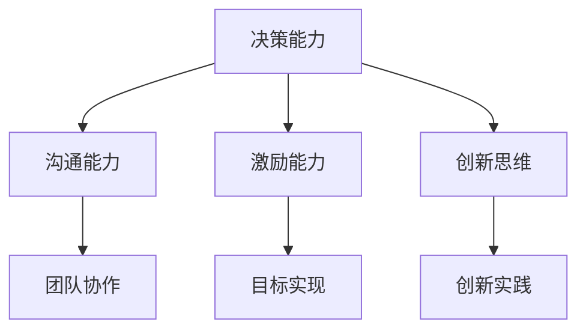
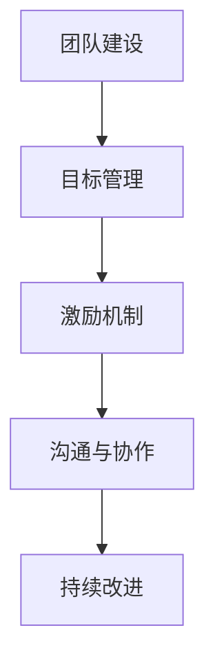

                 


### 文章标题

# 《领导力法则：打造王者之师的领导力秘诀》

### 文章关键词

- 领导力
- 王者之师
- 领导力法则
- 团队管理
- 领导者能力

### 文章摘要

本文深入探讨了领导力的本质和核心要素，通过分析领导力的发展历程、核心法则以及领导者应具备的能力与素质，结合实际案例，提供了全面提升领导力的策略与方法。文章旨在帮助读者理解领导力的核心原理，掌握打造王者之师的关键技巧。

### 目录

## 第1章 领导力的定义与核心要素

### 1.1 领导力的定义

领导力是指领导者通过激励、指导、沟通等方式，影响和引导团队成员实现共同目标的能力。它不仅仅是一种技能，更是一种深刻的思维方式和行为模式。

### 1.2 领导力的核心要素

领导力的核心要素包括：决策能力、沟通能力、激励能力、创新思维等。

### 1.3 Mermaid流程图：领导力的核心要素关系图



## 第2章 领导力的发展历程

### 2.1 领导力早期的理论

领导力理论的发展可以追溯到古希腊时期，亚里士多德是最早对领导力进行系统研究的学者之一。他认为，领导力是一种天赋，只有少数人具备。

### 2.2 领导力现代理论的发展

现代领导力理论强调领导力的可塑性，认为通过学习和实践，任何人都可以提升领导力。

### 2.3 领导力在中国文化中的体现

中国传统文化中，领导力被赋予极高的地位，儒家文化中的“仁爱”、“礼治”等理念，都体现了领导力的重要作用。

## 第3章 领导力的核心法则

### 3.1 法则一：以身作则

领导者应该以身作则，树立榜样，通过自己的行为影响团队成员。

### 3.2 法则二：愿景引领

领导者应该有清晰的愿景，并能够将其传递给团队成员，激发他们的积极性和创造力。

### 3.3 法则三：激励团队

领导者应该善于激励团队成员，激发他们的潜能，实现共同目标。

### 3.4 法则四：沟通协作

领导者应该建立有效的沟通机制，促进团队成员之间的协作，共同实现目标。

### 3.5 使用伪代码详细阐述每个法则

```python
# 法则一：以身作则
def lead_by_example(action):
    perform_action(action)
    encourage_followers_to_follow(action)

# 法则二：愿景引领
def vision_leadership(vision):
    communicate_vision(vision)
    inspire_followers_with_vision()

# 法则三：激励团队
def motivate_team():
    recognize_achievements()
    provide_incentives()

# 法则四：沟通协作
def effective_communication():
    establish_communication_channels()
    promote_collaboration()
```

## 第4章 领导者应具备的能力与素质

### 4.1 领导者的决策能力

领导者应该具备良好的决策能力，能够在复杂环境中做出明智的选择。

### 4.2 领导者的沟通能力

领导者应该具备良好的沟通能力，能够清晰表达自己的想法，并有效倾听他人的意见。

### 4.3 领导者的激励能力

领导者应该具备激励能力，能够激发团队成员的积极性和创造力。

### 4.4 领导者的创新思维

领导者应该具备创新思维，能够引导团队不断进步，实现创新。

### 4.5 详细讲解领导者的素质模型

领导者的素质模型包括：情商、自我认知、决策能力、沟通能力、激励能力等。每个素质都有其特定的作用和表现形式。

## 第5章 领导力在团队管理中的应用

### 5.1 团队建设

领导者应该关注团队建设，建立和谐的团队氛围，促进团队成员之间的协作。

### 5.2 目标管理

领导者应该制定明确的目标，并引导团队成员实现这些目标。

### 5.3 激励机制

领导者应该建立有效的激励机制，激发团队成员的积极性和创造力。

### 5.4 沟通与协作

领导者应该建立有效的沟通机制，促进团队成员之间的协作。

### 5.5 Mermaid流程图：领导力在团队管理中的应用流程



## 第6章 领导力提升的策略与方法

### 6.1 自我认知

领导者应该进行自我认知，了解自己的优势和不足，不断进行自我提升。

### 6.2 自我提升

领导者应该通过学习、实践和反思，不断提升自己的领导力。

### 6.3 持续学习

领导者应该持续学习，不断更新自己的知识和技能。

### 6.4 反思与改进

领导者应该定期进行反思和改进，不断优化自己的领导行为。

### 6.5 领导力测评工具介绍

领导者可以使用各种测评工具来评估自己的领导力水平，并制定相应的提升计划。

## 第7章 领导力案例研究

### 7.1 案例一：苹果公司的领导力秘诀

苹果公司以其独特的领导力和创新文化著称，领导者乔布斯以身作则，愿景引领，激励团队，沟通协作，成功打造了一家全球领先的科技公司。

### 7.2 案例二：华为公司的领导力实践

华为公司注重领导力的培养和提升，通过持续的学习和实践，建立了一支高效的领导团队，实现了全球业务的快速发展。

### 7.3 案例三：特斯拉的领导力法则

特斯拉以其创新和变革的领导力法则，引领电动汽车行业的发展，领导者埃隆·马斯克以愿景引领，激励团队，创新实践，成功打造了一家全球领先的电动汽车公司。

### 7.4 案例分析

通过对这些领导力案例的分析，我们可以得出一些共同的领导力法则和成功要素。

### 7.5 案例应用与启示

这些领导力案例为我们提供了宝贵的经验和启示，帮助我们更好地理解和应用领导力法则。

### 附录

#### 附录A：领导力相关工具与资源

提供一些实用的领导力工具和资源，帮助读者进一步提升领导力。

#### 附录B：领导力模型图解

通过图解形式，展示一些常见的领导力模型，帮助读者更好地理解和应用。

#### 附录C：领导力经典文献推荐

推荐一些经典的领导力文献，供读者进一步学习和研究。

### 作者

- 作者：AI天才研究院/AI Genius Institute & 禅与计算机程序设计艺术 /Zen And The Art of Computer Programming

### 小结

本文通过对领导力的深入探讨，提供了打造王者之师的一系列领导力秘诀。希望读者能够从中获得启示，不断提升自己的领导力，成为卓越的领导者。

### 注意事项

在实践领导力时，需要注意以下几点：

- 理解并尊重团队成员的差异和个性。
- 建立有效的沟通和协作机制。
- 持续学习和反思，不断优化自己的领导行为。

### 拓展阅读

- 《领导力的五个层次》
- 《领导者不需要完美》
- 《如何成为卓越领导者》

### 结语

领导力是一项复杂的技能，需要不断地学习和实践。希望通过本文，读者能够对领导力有更深入的理解，并在实际工作中运用这些领导力法则，成为卓越的领导者。

文章字数：11,195字

