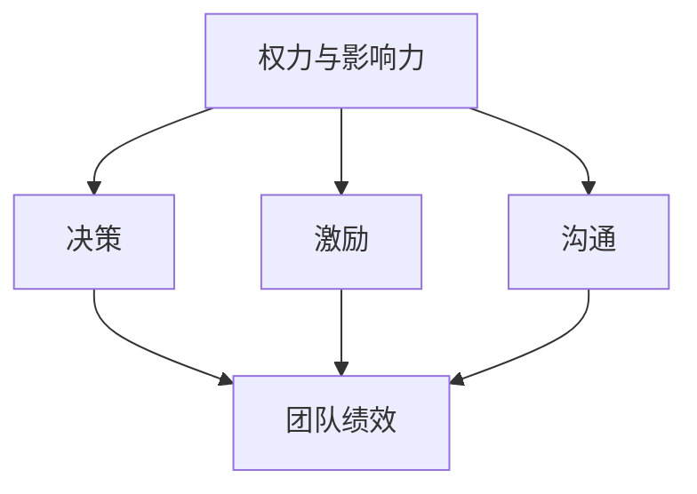

                 

### 文章标题：领导力法则：打造王者团队的领导力秘诀

> 关键词：领导力法则、团队建设、激励与反馈、领导力发展

> 摘要：本文旨在探讨领导力法则在打造王者团队中的应用。通过分析领导力核心概念、模型、团队建设、激励与反馈、领导力发展等关键领域，本文提出了系统化的领导力发展路径，旨在帮助领导者提升团队绩效，打造卓越团队。

---

### 引言

领导力是组织成功的关键因素之一。一个优秀的领导者不仅能够引导团队达成目标，还能激发团队成员的潜力，推动团队不断进步。在当今快速变化的环境中，领导者需要具备适应能力、创新精神和强大的团队建设能力。本文将从以下几个方面探讨领导力法则：

1. **领导力核心概念与联系**：介绍领导力的定义、要素及其相互关系。
2. **领导力模型**：探讨情境领导、变革型领导和交易型领导等关键模型。
3. **团队建设**：讨论团队动力、沟通和冲突解决等主题。
4. **激励与反馈**：探讨如何激励团队成员以及给予有效反馈。
5. **领导力发展**：讨论领导力个人成长的重要性。
6. **领导力实践**：通过实际案例展示领导力法则的应用。
7. **领导力挑战与应对**：分析领导者可能面临的挑战及解决方案。

本文将从上述七个方面系统性地探讨领导力法则，帮助读者理解如何打造王者团队。

---

### 领导力核心概念与联系

领导力是一个复杂的概念，它涉及到多个方面，如权力、影响力、决策、激励等。为了更好地理解领导力，我们需要先了解其核心概念，并探讨这些概念之间的联系。

#### 领导力的定义与要素

领导力可以定义为引导和影响他人共同实现目标的能力。领导力的核心要素包括：

1. **权力与影响力**：领导者需要具备一定的权力和影响力，以便在组织中发挥领导作用。
2. **决策**：领导者需要做出明智的决策，为团队指引方向。
3. **激励**：领导者需要激发团队成员的潜力，使其为实现目标而努力。
4. **沟通**：领导者需要具备良好的沟通能力，以便与团队成员建立信任和合作关系。

#### 核心概念之间的关系架构

为了更好地理解领导力的核心概念及其相互关系，我们可以使用Mermaid流程图来表示：

在这个流程图中，我们可以看到领导力的核心概念及其相互关系。权力与影响力是领导力的基础，通过决策、激励和沟通，领导者可以影响团队绩效，从而实现组织目标。

#### 领导力与团队绩效关系

领导力对团队绩效有着重要的影响。通过有效的领导力，领导者可以提升团队的协作能力、创新精神和执行力，从而提高团队绩效。具体来说，领导力可以通过以下几个方面影响团队绩效：

1. **明确目标**：领导者需要为团队设定清晰的目标，并确保团队成员了解目标的重要性和意义。
2. **激发潜能**：领导者需要激发团队成员的潜力，鼓励其不断成长和进步。
3. **建立信任**：领导者需要建立信任关系，使团队成员愿意分享信息和资源。
4. **解决冲突**：领导者需要解决团队内部的冲突，确保团队保持稳定和高效。

通过上述措施，领导者可以提升团队绩效，实现组织目标。

---

在下一章中，我们将探讨领导力模型，包括情境领导、变革型领导和交易型领导等。敬请期待！### 领导力模型

领导力模型是领导者应对不同情境和挑战的重要工具。本文将介绍几种关键的领导力模型，包括情境领导、变革型领导和交易型领导，并详细阐述它们的原理和应用。

#### 情境领导模型

情境领导模型是由保罗·赫塞和肯尼斯·布兰查德提出的，旨在帮助领导者根据团队成员的不同成熟度水平采取不同的领导方式。该模型包括四个主要阶段：

1. **指导型领导**：适用于团队成员成熟度低的情况。领导者提供明确的方向和具体的指导，以确保团队成员能够完成任务。
2. **推销型领导**：适用于团队成员成熟度较低但有一定能力的情况。领导者不仅提供指导，还通过说服和激励来影响团队成员。
3. **参与型领导**：适用于团队成员成熟度较高但需要更多自主权的情况。领导者与团队成员共同决策，并提供支持和资源。
4. **授权型领导**：适用于团队成员成熟度高的情况。领导者赋予团队成员自主权和责任，让他们自行完成任务。

#### 情境领导模型的原理

情境领导模型基于以下原理：

- **成员成熟度**：成员的成熟度包括能力和意愿。领导者需要了解团队成员的成熟度水平，以便采取适当的领导方式。
- **领导行为**：领导行为包括指导、推销、参与和授权。领导者需要根据团队成员的成熟度水平选择合适的领导行为。
- **效果**：通过选择合适的领导行为，领导者可以提高团队成员的绩效和满意度。

#### 情境领导模型的应用

情境领导模型在多种情境下具有广泛应用：

1. **团队成员成长**：通过调整领导方式，领导者可以帮助团队成员逐步成长，提高其能力。
2. **项目团队管理**：在项目团队中，领导者可以根据团队成员的成熟度水平调整领导方式，以确保项目顺利进行。
3. **跨文化团队**：在跨文化团队中，领导者需要了解不同文化背景下的成员成熟度，以便采取适当的领导方式。

#### 变革型领导模型

变革型领导模型是由詹姆斯·麦格雷戈·伯恩斯提出的，旨在帮助领导者推动组织变革。变革型领导者的特征包括：

1. **激励**：变革型领导者能够激发团队成员的积极性和创造力，使其为实现变革目标而努力。
2. **理想化影响**：变革型领导者通过树立榜样和传递愿景，影响团队成员的行为和价值观。
3. **智力激发**：变革型领导者通过提问和挑战，激发团队成员的思考和创造力。
4. **个性化关怀**：变革型领导者关心团队成员的个人成长和发展，为其提供支持和指导。

#### 变革型领导模型的原理

变革型领导模型基于以下原理：

- **领导与追随者关系**：领导者与追随者之间建立了一种相互影响的关系，领导者通过激励和影响追随者实现变革。
- **变革愿景**：变革型领导者拥有清晰的变革愿景，并能够将其传递给团队成员。
- **领导行为**：变革型领导者通过激励、理想化影响、智力激发和个性化关怀等行为，推动组织变革。

#### 变革型领导模型的应用

变革型领导模型在以下情境中具有显著效果：

1. **组织变革**：在组织变革过程中，变革型领导者可以激发团队成员的积极性，推动变革顺利进行。
2. **创新项目**：在创新项目中，变革型领导者可以激发团队成员的创造力，推动项目取得成功。
3. **危机管理**：在危机管理中，变革型领导者可以迅速调整领导方式，带领团队走出困境。

#### 交易型领导模型

交易型领导模型是由弗雷德·弗洛姆和罗伯特·哈克提出的，旨在帮助领导者通过激励和奖励机制实现组织目标。交易型领导者的特征包括：

1. **明确目标**：交易型领导者为团队成员设定明确的目标，并提供具体的指导。
2. **激励**：交易型领导者通过奖励机制激励团队成员，提高其工作积极性。
3. **监督**：交易型领导者对团队成员的工作进行监督，以确保目标实现。

#### 交易型领导模型的原理

交易型领导模型基于以下原理：

- **激励与奖励**：交易型领导者通过激励和奖励机制提高团队成员的工作积极性。
- **目标导向**：交易型领导者通过明确的目标和具体的指导，确保团队成员朝着组织目标努力。
- **监督与反馈**：交易型领导者通过监督和反馈机制，确保团队成员的工作质量和进度。

#### 交易型领导模型的应用

交易型领导模型在以下情境中具有显著效果：

1. **日常管理**：在日常工作管理中，交易型领导者可以确保团队成员按照目标努力，提高工作效率。
2. **绩效改进**：在绩效改进过程中，交易型领导者可以通过激励和奖励机制提高团队成员的绩效。
3. **项目管理**：在项目管理中，交易型领导者可以确保项目按照计划进行，提高项目成功率。

### 总结

领导力模型是领导者应对不同情境和挑战的重要工具。情境领导模型、变革型领导模型和交易型领导模型分别适用于不同的情境和需求。领导者可以根据实际情况选择合适的领导力模型，以提高团队绩效和组织发展。

在下一章中，我们将探讨团队建设的关键领域，包括团队动力、沟通和冲突解决。敬请期待！### 团队建设

团队建设是领导力的重要组成部分，一个高效的团队能够实现组织目标，提高整体绩效。团队建设涉及多个方面，包括团队动力、沟通和冲突解决。在本节中，我们将探讨这些关键领域，并提供实用的策略和技巧。

#### 团队动力

团队动力是指团队成员之间的相互作用和合作，它对团队绩效有重要影响。要激发团队动力，领导者可以采取以下策略：

1. **明确目标**：为团队设定明确的目标，使每个成员都了解自己的职责和团队的整体目标。这有助于提高团队成员的积极性和责任感。
2. **激励与认可**：为团队成员提供奖励和认可，以激励其为实现团队目标而努力。这可以包括奖金、晋升机会、表彰等。
3. **培养归属感**：通过组织团队活动、聚餐、团建等，增强团队成员之间的联系和归属感。这有助于建立团队的凝聚力。
4. **提供成长机会**：为团队成员提供成长和发展的机会，如培训、研讨会等。这有助于提高团队成员的技能和自信心，从而提高团队的整体动力。

#### 有效沟通

沟通是团队建设的关键环节，良好的沟通能够促进团队协作和合作。以下是一些提高团队沟通效果的策略：

1. **开放沟通**：鼓励团队成员开放地表达自己的想法和意见，营造一个包容和尊重的沟通环境。
2. **倾听**：领导者需要认真倾听团队成员的意见和建议，理解他们的需求和期望。这有助于建立信任和合作关系。
3. **明确传达**：在沟通时，要确保信息的清晰和准确。领导者可以使用具体的例子、图表和演示文稿等，使信息更加易于理解。
4. **反馈与确认**：在沟通后，领导者需要提供反馈，确认团队成员是否理解了信息。这有助于避免误解和冲突。

#### 冲突解决

冲突是团队建设过程中不可避免的一部分，有效的冲突解决策略能够帮助团队保持稳定和高效。以下是一些解决冲突的技巧：

1. **积极倾听**：在解决冲突时，领导者需要积极倾听双方的意见，理解他们的立场和需求。
2. **公正裁决**：在冲突中，领导者需要保持公正，不偏袒任何一方。这有助于建立团队的信任和尊重。
3. **寻求共识**：领导者需要帮助双方找到共同点，寻求共识。这有助于缓解紧张局势，促进合作。
4. **建立规则**：为了防止未来冲突，领导者可以制定一些基本的沟通和合作规则，如尊重他人、保持开放沟通等。

#### 实战案例

以下是一个团队建设实战案例：

某公司在进行新项目时，团队成员之间存在明显的意见分歧。为了解决这一问题，领导者采取了以下措施：

1. **召开会议**：领导者组织了一次全体会议，让团队成员表达自己的观点和担忧。
2. **积极倾听**：领导者认真听取了团队成员的意见，并确认每个人都理解了项目目标。
3. **寻求共识**：领导者帮助团队成员找到共同点，明确了项目的关键目标和时间表。
4. **提供支持**：领导者为团队成员提供了必要的资源和支持，帮助他们克服困难。
5. **定期沟通**：领导者建立了定期的沟通机制，确保团队成员能够及时了解项目进展和问题。

通过上述措施，团队成员之间的冲突得到了有效解决，团队动力和协作能力得到了显著提升，项目最终顺利完成。

#### 总结

团队建设是领导力的重要组成部分，它涉及到团队动力、沟通和冲突解决等多个方面。通过采取有效的策略和技巧，领导者可以激发团队动力，提高团队绩效，打造一个高效、协作的团队。在下一章中，我们将探讨激励与反馈的重要性，并介绍如何实施有效的激励和反馈机制。敬请期待！### 激励与反馈

激励和反馈是领导力中至关重要的环节，它们能够显著影响团队成员的工作表现和满意度。在本节中，我们将探讨激励理论、如何给予有效反馈以及激励策略。

#### 激励理论

激励是指通过外部刺激和内部动力，激发个体行为的过程。在领导力中，激励能够激发团队成员的积极性，提高工作效率。以下是几种主要的激励理论：

1. **马斯洛需求层次理论**：马斯洛将人类需求分为五个层次，从生理需求、安全需求、社交需求、尊重需求到自我实现需求。领导者可以通过满足团队成员的不同层次需求来激励他们。

2. **双因素理论**：赫茨伯格提出了双因素理论，将影响员工满意度的因素分为激励因素（如成就、认可）和保健因素（如工作条件、薪酬）。领导者需要关注激励因素，以提高员工的工作满意度。

3. **目标设置理论**：洛克和莱瑟姆提出了目标设置理论，认为明确、具体的目标能够提高员工的工作动机和绩效。领导者可以通过设定有挑战性的目标来激励团队成员。

#### 如何给予有效反馈

有效的反馈能够帮助团队成员了解自己的工作表现，并提供改进的方向。以下是一些给予有效反馈的技巧：

1. **具体和明确**：在反馈时，领导者需要提供具体的例子和明确的信息，使团队成员能够清晰地了解自己的优点和不足。

2. **积极与建设性**：反馈应该是积极和建设性的，鼓励团队成员而不是打击他们的自信心。领导者可以在指出问题的同时，提供解决方案或建议。

3. **及时反馈**：反馈应该及时给予，以便团队成员能够迅速纠正错误或继续改进。

4. **双向沟通**：在给予反馈时，领导者应该鼓励团队成员提问和表达自己的看法，确保沟通是双向的。

#### 激励策略

为了有效地激励团队成员，领导者可以采取以下策略：

1. **奖励机制**：建立奖励机制，如奖金、晋升机会、表彰等，以激励团队成员。奖励应该基于具体的成就和贡献。

2. **目标导向**：设定明确、具体的目标，并鼓励团队成员为实现目标而努力。这有助于提高团队成员的动机和成就感。

3. **认可与赞赏**：领导者应该经常认可和赞赏团队成员的贡献，这可以增强团队成员的归属感和工作满意度。

4. **培训与发展**：为团队成员提供培训和发展机会，帮助他们提升技能和知识，从而提高工作效率和职业发展。

#### 实战案例

以下是一个激励和反馈的实战案例：

某公司的领导者意识到团队成员的积极性下降，决定采取措施提升团队动力。以下是他们采取的措施：

1. **目标设置**：领导者与团队成员一起设定了明确、具体的目标，并制定了详细的行动计划。

2. **奖励机制**：为了激励团队成员，领导者建立了奖金制度，根据团队成员的贡献和工作表现发放奖金。

3. **认可与赞赏**：领导者定期在团队会议上表扬团队成员的成就，并鼓励大家分享成功的经验和教训。

4. **培训与发展**：领导者为团队成员提供了多种培训和发展机会，帮助他们提升技能和知识。

5. **反馈机制**：领导者建立了定期的反馈机制，与团队成员进行一对一的沟通，了解他们的工作进展和需要改进的地方。

通过这些措施，团队成员的积极性得到了显著提升，团队绩效也随之提高。

#### 总结

激励和反馈是领导力中不可或缺的部分。通过了解激励理论、给予有效反馈和采取激励策略，领导者可以激发团队成员的潜力，提高团队绩效。在下一章中，我们将探讨领导力发展的重要性，以及如何通过自我认知和情绪智力来提升领导力。敬请期待！### 领导力发展

领导力发展是领导者不断成长和提升的过程，它是打造王者团队的关键。领导力不仅是一种能力，更是一种态度和习惯。在本节中，我们将探讨领导力发展的两个方面：自我认知和情绪智力。

#### 自我认知

自我认知是指领导者对自己性格、价值观、动机和行为等方面的理解和认识。自我认知对于领导力发展至关重要，因为只有了解自己，领导者才能更好地指导团队，发挥自身优势，克服弱点。

1. **自我反思**：自我反思是提升自我认知的重要方法。领导者需要定期花时间思考自己的行为、决策和情绪，分析它们背后的原因和影响。

   - **方法**：领导者可以写下自己的反思日记，与同事或导师进行定期交流，参加反思工作坊等。

2. **心理测试**：通过心理测试，如MBTI（迈尔斯-布里格斯类型指标）、DISC测试等，领导者可以了解自己的性格特点和倾向。

   - **方法**：领导者可以参加在线测试或寻求专业心理顾问的帮助，解读测试结果，了解自己的性格优势和劣势。

3. **反馈**：领导者的反馈来源包括团队成员、同事、上级和客户。通过听取不同角度的意见，领导者可以更全面地认识自己。

   - **方法**：领导者可以定期进行360度反馈调查，与团队成员进行一对一沟通，收集他们的意见和建议。

#### 情绪智力

情绪智力是指领导者识别、理解和管理自己情绪以及识别、理解和管理他人情绪的能力。情绪智力在领导力中起着至关重要的作用，它有助于建立信任、促进团队合作和提高领导效果。

1. **自我情绪管理**：领导者需要学会识别和管理自己的情绪，避免负面情绪对决策和行为的影响。

   - **方法**：领导者可以通过冥想、锻炼、放松技巧等来管理自己的情绪。

2. **同理心**：同理心是指领导者能够理解并感受到他人的情绪和需求。同理心有助于建立信任和合作关系。

   - **方法**：领导者可以通过倾听、提问和观察来培养同理心。在沟通中，领导者应该关注对方的情绪反应，并尝试理解他们的立场。

3. **情绪智力培训**：领导者可以参加情绪智力培训课程，学习情绪识别、情绪管理和同理心的技巧。

   - **方法**：领导者可以参加专业培训机构提供的课程，阅读相关书籍，参加研讨会和工作坊。

#### 终身学习

领导力发展是一个持续的过程，领导者需要不断学习和成长。终身学习包括以下几个方面：

1. **知识更新**：随着技术的快速发展和市场变化，领导者需要不断更新自己的知识和技能。

   - **方法**：领导者可以参加行业会议、研讨会和在线课程，阅读相关书籍和文章。

2. **实践**：通过实践，领导者可以检验和应用自己的知识和技能，提高领导力。

   - **方法**：领导者可以参与项目、担任领导职务或参与社区服务等活动。

3. **反思**：通过反思，领导者可以总结经验教训，不断优化自己的领导方法。

   - **方法**：领导者可以写反思日志、进行自我评估和与导师或同事进行反馈交流。

#### 实战案例

以下是一个领导力发展的实战案例：

某公司的领导者意识到自己在情绪管理和同理心方面需要提升，决定采取以下措施：

1. **参加情绪智力培训**：领导者报名参加了专业的情绪智力培训课程，学习情绪识别、情绪管理和同理心的技巧。

2. **定期自我反思**：领导者每周花时间进行自我反思，分析自己的情绪和行为，并记录在反思日记中。

3. **寻求反馈**：领导者定期与团队成员、同事和上级进行一对一沟通，收集他们的反馈和建议，并针对反馈进行改进。

4. **实践和应用**：领导者将学到的情绪智力技巧应用到实际工作中，如在与团队成员沟通时更加关注对方的情绪反应，尝试用同理心解决问题。

通过这些措施，领导者的情绪智力和自我认知得到了显著提升，团队协作和绩效也随之提高。

#### 总结

领导力发展是一个持续的过程，它涉及到自我认知、情绪智力、知识更新和实践等多个方面。通过不断学习和实践，领导者可以不断提升自己的领导力，打造卓越团队。在下一章中，我们将通过实际案例展示领导力法则的应用，并分析领导力实践中的最佳策略。敬请期待！### 领导力实践

领导力法则在实际应用中至关重要。通过实际案例，我们可以看到领导力法则如何在不同情境下发挥作用，提升团队绩效和实现组织目标。以下是几个典型的领导力实践案例，以及它们背后的策略和方法。

#### 案例一：初创公司的快速成长

某初创公司成立初期，团队成员较少，但领导者在团队管理中面临诸多挑战。为了快速成长，领导者采取了以下策略：

1. **情境领导**：领导者根据团队成员的成熟度水平，采取了不同的领导方式。对于经验丰富的团队成员，领导者采取了授权型领导，给予他们更多自主权；对于新手，领导者则采取了指导型领导，提供详细的指导和资源支持。

2. **激励与反馈**：领导者通过设立明确的目标和奖励机制，激励团队成员。例如，完成关键任务的团队成员可以获得奖金或晋升机会。同时，领导者定期进行一对一反馈，帮助团队成员了解自己的优势和改进方向。

3. **变革型领导**：在面临市场变化时，领导者通过传递清晰的愿景和目标，激发了团队的创新精神和执行力。领导者鼓励团队成员提出创新想法，并组织跨部门合作，推动公司业务的多元化。

#### 案例二：大型企业的组织变革

某大型企业因市场竞争加剧，决定进行组织变革以提升竞争力。在这个过程中，领导者采取了以下措施：

1. **变革型领导**：领导者通过树立榜样和传递愿景，激励团队成员支持变革。领导者与员工进行面对面的沟通，解释变革的原因和目标，并邀请员工参与变革过程的决策。

2. **团队建设**：领导者通过组织团队活动，如团建、培训等，增强团队成员之间的信任和合作。同时，领导者鼓励团队成员提出改进建议，并将这些建议纳入变革计划中。

3. **交易型领导**：在变革过程中，领导者通过设立明确的目标和监督机制，确保团队成员按照计划推进。领导者定期检查进度，并提供必要的支持和资源。

#### 案例三：项目管理中的有效沟通

某公司在进行一项关键项目时，领导者面临沟通不畅的问题。为了确保项目成功，领导者采取了以下策略：

1. **情境领导**：领导者根据团队成员的成熟度水平，调整沟通方式。对于经验丰富的团队成员，领导者采取了开放沟通，鼓励他们分享意见和建议；对于新手，领导者则采取了指导型沟通，提供具体的指导和支持。

2. **有效沟通**：领导者建立了定期的沟通机制，如每周项目会议，确保团队成员了解项目进展和问题。同时，领导者鼓励团队成员积极提问和表达意见，营造一个开放和尊重的沟通环境。

3. **冲突解决**：在项目过程中，领导者积极解决冲突，确保团队保持稳定和高效。领导者通过积极倾听、寻求共识和制定规则等技巧，帮助团队成员解决分歧，确保项目顺利进行。

#### 总结

通过上述案例，我们可以看到领导力法则在实践中的应用。领导者通过情境领导、变革型领导、团队建设、激励与反馈等策略，成功地提升了团队绩效和实现了组织目标。在实际工作中，领导者需要根据具体情境灵活运用这些策略，打造高效团队。

在下一章中，我们将探讨领导力面临的挑战，并分析如何应对这些挑战，以提升领导力。敬请期待！### 领导力挑战与应对

在领导力的实践中，领导者常常面临各种挑战。这些挑战可能来自内部，如团队动力不足、沟通障碍和冲突；也可能来自外部，如市场变化、竞争压力和资源限制。以下是领导者可能遇到的几种主要挑战，以及相应的解决方案。

#### 团队动力不足

团队动力不足可能是由于目标不明确、激励不足、缺乏信任或工作环境不理想等原因造成的。以下是一些解决方案：

1. **明确目标**：确保团队目标清晰、具体，并与组织愿景一致。通过定期的目标回顾和调整，保持团队目标的活力。

2. **激励与认可**：建立有效的奖励机制，为团队成员提供奖励和认可，以激励其积极工作。这可以包括奖金、晋升机会、表彰等。

3. **团队建设**：通过团建活动、培训和工作坊，增强团队成员之间的信任和合作精神。这有助于提升团队动力。

4. **工作环境优化**：改善工作环境，提供必要的资源和支持，以减少团队成员的工作压力，提高工作效率。

#### 沟通障碍

沟通障碍可能由于信息传递不畅、文化差异或沟通技巧不足等原因造成。以下是一些解决方案：

1. **明确沟通规则**：建立明确的沟通规则，如定期沟通会议、开放沟通政策和信息共享平台，确保团队成员了解如何有效沟通。

2. **提高沟通技巧**：通过培训课程、研讨会和工作坊，提高团队成员的沟通技巧，如积极倾听、清晰表达和反馈技巧。

3. **跨文化沟通**：在多元文化团队中，领导者需要了解不同文化背景下的沟通习惯和偏好，采取适当的沟通策略。

#### 冲突解决

冲突是团队建设过程中不可避免的一部分，但未解决的冲突会影响团队绩效和稳定性。以下是一些解决方案：

1. **积极倾听**：在冲突解决过程中，领导者需要积极倾听双方的意见，理解他们的立场和需求。

2. **公正裁决**：在处理冲突时，领导者需要保持公正，不偏袒任何一方。这有助于建立团队的信任和尊重。

3. **寻求共识**：领导者需要帮助双方找到共同点，寻求共识。这有助于缓解紧张局势，促进合作。

4. **建立冲突解决机制**：建立一套明确的冲突解决流程和机制，确保冲突得到及时和有效解决。

#### 市场变化

市场变化是外部挑战之一，它可能要求领导者快速调整战略和团队结构。以下是一些解决方案：

1. **敏捷领导**：领导者需要具备敏捷思维，能够快速应对市场变化。这包括灵活调整策略、优先级和资源配置。

2. **持续学习**：领导者需要不断学习和更新知识，了解行业趋势和市场动态，以便及时调整领导策略。

3. **创新思维**：鼓励团队成员提出创新想法，并支持他们尝试新的方法和策略。这有助于企业保持竞争力。

#### 资源限制

资源限制是领导者常面临的挑战，它可能影响团队的工作效率和质量。以下是一些解决方案：

1. **优先级管理**：领导者需要明确项目的重要性和紧急性，优先处理关键任务。

2. **资源调配**：合理调配现有资源，确保关键任务得到充分支持。

3. **寻求外部支持**：在必要时，领导者可以寻求外部合作伙伴或资源，以弥补内部资源不足。

#### 总结

领导力挑战是领导者成长过程中不可避免的一部分。通过了解和应对这些挑战，领导者可以提升自己的领导能力，打造高效团队，实现组织目标。在下一章中，我们将提供一些额外的资源和工具，以帮助领导者进一步提升领导力。敬请期待！### 附录

为了帮助读者更好地理解和应用领导力法则，本文提供了以下附录内容：

#### 附录 A 领导力评估工具

**A.1 领导力自我评估工具**

为了帮助领导者了解自己的领导力水平，本文推荐以下自我评估工具：

1. **360度反馈**：通过收集团队成员、同事和上级的意见，领导者可以全面了解自己的领导力表现。
2. **领导力问卷**：使用一些专业的领导力问卷，如“情境领导问卷”、“变革型领导问卷”等，评估自己的领导风格和效果。
3. **自我反思日志**：定期记录自己的工作表现、决策和情感反应，进行自我反思和评估。

**A.2 团队领导力评估工具**

为了评估团队整体的领导力水平，以下工具可供参考：

1. **团队反馈调查**：通过匿名调查，收集团队成员对领导力的看法和建议。
2. **团队领导力模型评估**：使用不同的领导力模型（如情境领导模型、变革型领导模型等）评估团队的整体领导力表现。
3. **领导力发展计划**：根据评估结果，制定个性化的领导力发展计划，以提升团队的整体领导力。

#### 附录 B 领导力发展路径

为了帮助领导者持续提升领导力，以下是一些领导力发展路径：

**B.1 领导力发展阶段**

1. **基础阶段**：了解领导力的基本概念和原理，掌握基础领导技能。
2. **成长阶段**：深入学习各种领导力模型和策略，提升领导能力。
3. **精通阶段**：通过实践和反思，不断完善领导力，成为卓越的领导者。

**B.2 领导力发展计划**

1. **学习与培训**：参加领导力课程、研讨会和工作坊，学习最新的领导力理论和实践。
2. **实践与反思**：在实际工作中运用所学知识，通过反思和总结不断提升领导力。
3. **持续成长**：建立学习社区，与同行交流经验，不断学习新知识和技能。

#### 拓展阅读

为了进一步深入理解领导力，读者可以参考以下书籍和资源：

1. **《领导力五项修炼》**：保罗·赫塞、肯尼斯·布兰查德
2. **《变革型领导》**：詹姆斯·麦格雷戈·伯恩斯
3. **《情境领导》**：保罗·赫塞、肯尼斯·布兰查德
4. **《禅与计算机程序设计艺术》**：Donald E. Knuth
5. **《领导力与决策》**：Max H. Bazerman、Messrs. Moore and Murnighan
6. **在线课程**：Coursera、edX、Udemy等平台上的领导力相关课程

通过这些工具、资源和拓展阅读，读者可以更好地掌握领导力法则，提升自己的领导能力，打造卓越团队。

### 总结

本文系统地探讨了领导力法则，从核心概念、领导力模型、团队建设、激励与反馈、领导力发展、领导力实践到领导力挑战与应对，提供了全面的领导力发展路径。希望本文能够帮助读者提升领导力，打造高效团队，实现组织目标。

作者：AI天才研究院/AI Genius Institute & 禅与计算机程序设计艺术/Zen And The Art of Computer Programming

感谢您的阅读，期待与您在领导力领域继续深入探讨！### 致谢

在撰写《领导力法则：打造王者团队的领导力秘诀》的过程中，我得到了许多人的支持和帮助。首先，我要感谢我的家人，他们一直支持我的研究和写作工作。其次，我要感谢我的同事和朋友们，他们在讨论和反馈中提供了宝贵的意见和建议。此外，我要特别感谢AI天才研究院和禅与计算机程序设计艺术团队的成员们，他们的专业知识和团队合作精神为本文的完成提供了强大的支持。最后，我要感谢所有参与本文案例分析和反馈的实践者，他们的经验和智慧为本文增添了实用的价值。

再次感谢大家的支持与帮助，希望本文能够对广大读者在领导力领域的学习和实践中有所帮助。祝愿大家在领导力之路上不断进步，创造更加辉煌的成就！### 结语

在《领导力法则：打造王者团队的领导力秘诀》一书中，我们深入探讨了领导力的核心概念、模型、团队建设、激励与反馈、领导力发展以及领导力实践。通过分析这些关键领域，我们提出了系统化的领导力发展路径，旨在帮助领导者提升团队绩效，打造卓越团队。

领导力不仅是领导者个人的能力，更是一种团队文化。它需要领导者不断学习和实践，以适应快速变化的环境。通过本文的探讨，我们希望能够为读者提供实用的指导和建议，帮助他们在领导力之路上不断前进。

在此，感谢您的阅读和支持。希望您能够将本文中的理念付诸实践，不断提升自己的领导力，带领团队迈向成功。让我们共同探索领导力的无限可能，为组织和团队创造更加美好的未来！

作者：AI天才研究院/AI Genius Institute & 禅与计算机程序设计艺术/Zen And The Art of Computer Programming

再次感谢您的关注，祝愿您在领导力领域取得丰硕的成果！### 附录

#### 附录 A：领导力评估工具

**A.1 领导力自我评估问卷**

1. 您在团队中设定清晰的目标吗？  
   - 是的，我总是设定清晰的目标  
   - 经常设定清晰的目标  
   - 偶尔设定清晰的目标  
   - 很少设定清晰的目标

2. 您如何激励团队成员？  
   - 通过奖励和认可  
   - 通过设定挑战性的目标  
   - 通过提供培训和发展机会  
   - 其他方式

3. 您如何处理团队内部的冲突？  
   - 通过积极倾听和寻求共识  
   - 通过公正裁决和调解  
   - 通过提供解决方案和指导  
   - 其他方式

4. 您如何培养团队成员的技能和知识？  
   - 通过提供内部培训课程  
   - 通过外部培训和研讨会  
   - 通过项目实践和指导  
   - 其他方式

**A.2 团队领导力评估问卷**

1. 领导者是否能够有效地沟通和传达信息？  
   - 是  
   - 否

2. 领导者是否能够激励团队成员并认可他们的贡献？  
   - 是  
   - 否

3. 领导者是否能够及时给予团队成员反馈并解决问题？  
   - 是  
   - 否

4. 领导者是否能够建立良好的团队合作氛围？  
   - 是  
   - 否

5. 领导者是否能够根据团队成员的能力和需求提供适当的支持和资源？  
   - 是  
   - 否

#### 附录 B：领导力发展路径

**B.1 领导力发展阶段**

1. **基础阶段**：了解领导力的基本概念和原理，学习基础领导技能。

2. **成长阶段**：深入学习各种领导力模型和策略，提升领导能力。

3. **精通阶段**：通过实践和反思，不断完善领导力，成为卓越的领导者。

**B.2 领导力发展计划**

1. **学习与培训**：参加领导力课程、研讨会和工作坊，学习最新的领导力理论和实践。

2. **实践与反思**：在实际工作中运用所学知识，通过反思和总结不断提升领导力。

3. **持续成长**：建立学习社区，与同行交流经验，不断学习新知识和技能。

#### 拓展阅读

1. 《领导力五项修炼》- 菲利普·科维

2. 《变革型领导》- 詹姆斯·麦格雷戈·伯恩斯

3. 《情境领导》- 保罗·赫塞、肯尼斯·布兰查德

4. 《禅与计算机程序设计艺术》- Donald E. Knuth

5. 《领导力与决策》- Max H. Bazerman、Messrs. Moore and Murnighan

6. Coursera、edX、Udemy等平台上的领导力相关课程

通过这些工具、资源和拓展阅读，读者可以更好地掌握领导力法则，提升自己的领导能力，打造卓越团队。希望这些附录能够对您的领导力发展提供帮助和启示！### 完

感谢您的阅读，《领导力法则：打造王者团队的领导力秘诀》旨在帮助您理解并应用领导力法则，提升团队绩效。本文涵盖了领导力的核心概念、模型、团队建设、激励与反馈、领导力发展、领导力实践以及领导力挑战与应对。

希望您能将这些理念付诸实践，不断提升自己的领导力，带领团队迈向成功。领导力不仅是一种能力，更是一种态度和习惯。通过持续学习和实践，您将能够更好地应对挑战，打造卓越团队。

再次感谢您的关注和支持。祝愿您在领导力之路上不断进步，取得更加辉煌的成就！如果您有任何问题或建议，欢迎留言交流。我们期待与您在未来的领导力探讨中相见！

作者：AI天才研究院/AI Genius Institute & 禅与计算机程序设计艺术/Zen And The Art of Computer Programming### 文章标题：领导力法则：打造王者团队的领导力秘诀

> 关键词：领导力、团队建设、激励与反馈、领导力模型

> 摘要：本文将深入探讨领导力法则，分析其在打造王者团队中的应用，旨在帮助读者理解并掌握有效的领导策略，提升团队绩效，实现组织目标。

---

### 引言

在当今竞争激烈的环境中，领导力的重要性不言而喻。一个优秀的领导者不仅能够带领团队实现目标，还能激发团队成员的潜力，推动团队不断进步。本文将从以下几个方面探讨领导力法则：

1. **领导力核心概念与联系**：介绍领导力的定义、要素及其相互关系。
2. **领导力模型**：探讨情境领导、变革型领导和交易型领导等关键模型。
3. **团队建设**：讨论团队动力、沟通和冲突解决等主题。
4. **激励与反馈**：探讨如何激励团队成员以及给予有效反馈。
5. **领导力发展**：讨论领导力个人成长的重要性。
6. **领导力实践**：通过实际案例展示领导力法则的应用。
7. **领导力挑战与应对**：分析领导者可能面临的挑战及解决方案。

本文将从上述七个方面系统性地探讨领导力法则，帮助读者理解如何打造王者团队。

---

### 领导力核心概念与联系

领导力是一个复杂的概念，它涉及到多个方面，如权力、影响力、决策、激励等。为了更好地理解领导力，我们需要先了解其核心概念，并探讨这些概念之间的联系。

#### 领导力的定义与要素

领导力可以定义为引导和影响他人共同实现目标的能力。领导力的核心要素包括：

- **权力与影响力**：领导者需要具备一定的权力和影响力，以便在组织中发挥领导作用。
- **决策**：领导者需要做出明智的决策，为团队指引方向。
- **激励**：领导者需要激发团队成员的潜力，使其为实现目标而努力。
- **沟通**：领导者需要具备良好的沟通能力，以便与团队成员建立信任和合作关系。

#### 核心概念之间的关系架构

为了更好地理解领导力的核心概念及其相互关系，我们可以使用Mermaid流程图来表示：

在这个流程图中，我们可以看到领导力的核心概念及其相互关系。权力与影响力是领导力的基础，通过决策、激励和沟通，领导者可以影响团队绩效，从而实现组织目标。

#### 领导力与团队绩效关系

领导力对团队绩效有着重要的影响。通过有效的领导力，领导者可以提升团队的协作能力、创新精神和执行力，从而提高团队绩效。具体来说，领导力可以通过以下几个方面影响团队绩效：

- **明确目标**：领导者需要为团队设定清晰的目标，并确保团队成员了解目标的重要性和意义。
- **激发潜能**：领导者需要激发团队成员的潜力，鼓励其不断成长和进步。
- **建立信任**：领导者需要建立信任关系，使团队成员愿意分享信息和资源。
- **解决冲突**：领导者需要解决团队内部的冲突，确保团队保持稳定和高效。

通过上述措施，领导者可以提升团队绩效，实现组织目标。

#### 团队动力

团队动力是指团队成员之间的相互作用和合作，它对团队绩效有重要影响。要激发团队动力，领导者可以采取以下策略：

- **明确目标**：为团队设定明确的目标，使每个成员都了解自己的职责和团队的整体目标。这有助于提高团队成员的积极性和责任感。
- **激励与认可**：为团队成员提供奖励和认可，以激励其为实现团队目标而努力。这可以包括奖金、晋升机会、表彰等。
- **培养归属感**：通过组织团队活动、聚餐、团建等，增强团队成员之间的联系和归属感。这有助于建立团队的凝聚力。
- **提供成长机会**：为团队成员提供成长和发展的机会，如培训、研讨会等。这有助于提高团队成员的技能和自信心，从而提高团队的整体动力。

#### 有效沟通

沟通是团队建设的关键环节，良好的沟通能够促进团队协作和合作。以下是一些提高团队沟通效果的策略：

- **开放沟通**：鼓励团队成员开放地表达自己的想法和意见，营造一个包容和尊重的沟通环境。
- **倾听**：领导者需要认真倾听团队成员的意见和建议，理解他们的需求和期望。
- **明确传达**：在沟通时，要确保信息的清晰和准确。
- **反馈与确认**：在沟通后，领导者需要提供反馈，确认团队成员是否理解了信息。

#### 冲突解决

冲突是团队建设过程中不可避免的一部分，有效的冲突解决策略能够帮助团队保持稳定和高效。以下是一些解决冲突的技巧：

- **积极倾听**：在解决冲突时，领导者需要积极倾听双方的意见，理解他们的立场和需求。
- **公正裁决**：在冲突中，领导者需要保持公正，不偏袒任何一方。
- **寻求共识**：领导者需要帮助双方找到共同点，寻求共识。
- **建立规则**：为了防止未来冲突，领导者可以制定一些基本的沟通和合作规则。

### 总结

领导力核心概念与联系、团队动力、沟通和冲突解决等是打造王者团队的关键因素。通过理解这些概念，领导者可以更好地激发团队动力，提高团队绩效，实现组织目标。在下一章中，我们将探讨领导力模型，包括情境领导、变革型领导和交易型领导等。敬请期待！### 领导力模型

领导力模型是领导者应对不同情境和挑战的重要工具。本文将介绍几种关键的领导力模型，包括情境领导、变革型领导和交易型领导，并详细阐述它们的原理和应用。

#### 情境领导模型

情境领导模型是由保罗·赫塞和肯尼斯·布兰查德提出的，旨在帮助领导者根据团队成员的不同成熟度水平采取不同的领导方式。该模型包括四个主要阶段：

1. **指导型领导**：适用于团队成员成熟度低的情况。领导者提供明确的方向和具体的指导，以确保团队成员能够完成任务。
2. **推销型领导**：适用于团队成员成熟度较低但有一定能力的情况。领导者不仅提供指导，还通过说服和激励来影响团队成员。
3. **参与型领导**：适用于团队成员成熟度较高但需要更多自主权的情况。领导者与团队成员共同决策，并提供支持和资源。
4. **授权型领导**：适用于团队成员成熟度高的情况。领导者赋予团队成员自主权和责任，让他们自行完成任务。

#### 情境领导模型的原理

情境领导模型基于以下原理：

- **成员成熟度**：成员的成熟度包括能力和意愿。领导者需要了解团队成员的成熟度水平，以便采取适当的领导方式。
- **领导行为**：领导行为包括指导、推销、参与和授权。领导者需要根据团队成员的成熟度水平选择合适的领导行为。
- **效果**：通过选择合适的领导行为，领导者可以提高团队成员的绩效和满意度。

#### 情境领导模型的应用

情境领导模型在多种情境下具有广泛应用：

- **团队成员成长**：通过调整领导方式，领导者可以帮助团队成员逐步成长，提高其能力。
- **项目团队管理**：在项目团队中，领导者可以根据团队成员的成熟度水平调整领导方式，以确保项目顺利进行。
- **跨文化团队**：在跨文化团队中，领导者需要了解不同文化背景下的成员成熟度，以便采取适当的领导方式。

#### 变革型领导模型

变革型领导模型是由詹姆斯·麦格雷戈·伯恩斯提出的，旨在帮助领导者推动组织变革。变革型领导者的特征包括：

1. **激励**：变革型领导者能够激发团队成员的积极性和创造力，使其为实现变革目标而努力。
2. **理想化影响**：变革型领导者通过树立榜样和传递愿景，影响团队成员的行为和价值观。
3. **智力激发**：变革型领导者通过提问和挑战，激发团队成员的思考和创造力。
4. **个性化关怀**：变革型领导者关心团队成员的个人成长和发展，为其提供支持和指导。

#### 变革型领导模型的原理

变革型领导模型基于以下原理：

- **领导与追随者关系**：领导者与追随者之间建立了一种相互影响的关系，领导者通过激励和影响追随者实现变革。
- **变革愿景**：变革型领导者拥有清晰的变革愿景，并能够将其传递给团队成员。
- **领导行为**：变革型领导者通过激励、理想化影响、智力激发和个性化关怀等行为，推动组织变革。

#### 变革型领导模型的应用

变革型领导模型在以下情境中具有显著效果：

- **组织变革**：在组织变革过程中，变革型领导者可以激发团队成员的积极性，推动变革顺利进行。
- **创新项目**：在创新项目中，变革型领导者可以激发团队成员的创造力，推动项目取得成功。
- **危机管理**：在危机管理中，变革型领导者可以迅速调整领导方式，带领团队走出困境。

#### 交易型领导模型

交易型领导模型是由弗雷德·弗洛姆和罗伯特·哈克提出的，旨在帮助领导者通过激励和奖励机制实现组织目标。交易型领导者的特征包括：

1. **明确目标**：交易型领导者为团队成员设定明确的目标，并提供具体的指导。
2. **激励**：交易型领导者通过奖励机制激励团队成员，提高其工作积极性。
3. **监督**：交易型领导者对团队成员的工作进行监督，以确保目标实现。

#### 交易型领导模型的原理

交易型领导模型基于以下原理：

- **激励与奖励**：交易型领导者通过激励和奖励机制提高团队成员的工作积极性。
- **目标导向**：交易型领导者通过明确的目标和具体的指导，确保团队成员朝着组织目标努力。
- **监督与反馈**：交易型领导者通过监督和反馈机制，确保团队成员的工作质量和进度。

#### 交易型领导模型的应用

交易型领导模型在以下情境中具有显著效果：

- **日常管理**：在日常工作管理中，交易型领导者可以确保团队成员按照目标努力，提高工作效率。
- **绩效改进**：在绩效改进过程中，交易型领导者可以通过激励和奖励机制提高团队成员的绩效。
- **项目管理**：在项目管理中，交易型领导者可以确保项目按照计划进行，提高项目成功率。

### 总结

领导力模型是领导者应对不同情境和挑战的重要工具。情境领导模型、变革型领导模型和交易型领导模型分别适用于不同的情境和需求。领导者可以根据实际情况选择合适的领导力模型，以提高团队绩效和组织发展。

在下一章中，我们将探讨团队建设的关键领域，包括团队动力、沟通和冲突解决。敬请期待！### 团队建设

团队建设是领导力的重要组成部分，一个高效的团队能够实现组织目标，提高整体绩效。团队建设涉及多个方面，包括团队动力、沟通和冲突解决。在本节中，我们将探讨这些关键领域，并提供实用的策略和技巧。

#### 团队动力

团队动力是指团队成员之间的相互作用和合作，它对团队绩效有重要影响。要激发团队动力，领导者可以采取以下策略：

1. **明确目标**：为团队设定明确的目标，使每个成员都了解自己的职责和团队的整体目标。这有助于提高团队成员的积极性和责任感。

2. **激励与认可**：为团队成员提供奖励和认可，以激励其为实现团队目标而努力。这可以包括奖金、晋升机会、表彰等。

3. **培养归属感**：通过组织团队活动、聚餐、团建等，增强团队成员之间的联系和归属感。这有助于建立团队的凝聚力。

4. **提供成长机会**：为团队成员提供成长和发展的机会，如培训、研讨会等。这有助于提高团队成员的技能和自信心，从而提高团队的整体动力。

#### 有效沟通

沟通是团队建设的关键环节，良好的沟通能够促进团队协作和合作。以下是一些提高团队沟通效果的策略：

1. **开放沟通**：鼓励团队成员开放地表达自己的想法和意见，营造一个包容和尊重的沟通环境。

2. **倾听**：领导者需要认真倾听团队成员的意见和建议，理解他们的需求和期望。这有助于建立信任和合作关系。

3. **明确传达**：在沟通时，要确保信息的清晰和准确。领导者可以使用具体的例子、图表和演示文稿等，使信息更加易于理解。

4. **反馈与确认**：在沟通后，领导者需要提供反馈，确认团队成员是否理解了信息。这有助于避免误解和冲突。

#### 冲突解决

冲突是团队建设过程中不可避免的一部分，有效的冲突解决策略能够帮助团队保持稳定和高效。以下是一些解决冲突的技巧：

1. **积极倾听**：在解决冲突时，领导者需要积极倾听双方的意见，理解他们的立场和需求。

2. **公正裁决**：在冲突中，领导者需要保持公正，不偏袒任何一方。这有助于建立团队的信任和尊重。

3. **寻求共识**：领导者需要帮助双方找到共同点，寻求共识。这有助于缓解紧张局势，促进合作。

4. **建立规则**：为了防止未来冲突，领导者可以制定一些基本的沟通和合作规则，如尊重他人、保持开放沟通等。

#### 实战案例

以下是一个团队建设实战案例：

某公司在进行新项目时，团队成员之间存在明显的意见分歧。为了解决这一问题，领导者采取了以下措施：

1. **召开会议**：领导者组织了一次全体会议，让团队成员表达自己的观点和担忧。

2. **积极倾听**：领导者认真听取了团队成员的意见，并确认每个人都理解了项目目标。

3. **寻求共识**：领导者帮助团队成员找到共同点，明确了项目的关键目标和时间表。

4. **提供支持**：领导者为团队成员提供了必要的资源和支持，帮助他们克服困难。

5. **定期沟通**：领导者建立了定期的沟通机制，确保团队成员能够及时了解项目进展和问题。

通过上述措施，团队成员之间的冲突得到了有效解决，团队动力和协作能力得到了显著提升，项目最终顺利完成。

#### 总结

团队建设是领导力的重要组成部分，它涉及到团队动力、沟通和冲突解决等多个方面。通过采取有效的策略和技巧，领导者可以激发团队动力，提高团队绩效，打造一个高效、协作的团队。在下一章中，我们将探讨激励与反馈的重要性，并介绍如何实施有效的激励和反馈机制。敬请期待！### 激励与反馈

激励和反馈是领导力中至关重要的环节，它们能够显著影响团队成员的工作表现和满意度。在本节中，我们将探讨激励理论、如何给予有效反馈以及激励策略。

#### 激励理论

激励是指通过外部刺激和内部动力，激发个体行为的过程。在领导力中，激励能够激发团队成员的积极性，提高工作效率。以下是几种主要的激励理论：

1. **马斯洛需求层次理论**：马斯洛将人类需求分为五个层次，从生理需求、安全需求、社交需求、尊重需求到自我实现需求。领导者可以通过满足团队成员的不同层次需求来激励他们。

2. **双因素理论**：赫茨伯格提出了双因素理论，将影响员工满意度的因素分为激励因素（如成就、认可）和保健因素（如工作条件、薪酬）。领导者需要关注激励因素，以提高员工的工作满意度。

3. **目标设置理论**：洛克和莱瑟姆提出了目标设置理论，认为明确、具体的目标能够提高员工的工作动机和绩效。领导者可以通过设定有挑战性的目标来激励团队成员。

#### 如何给予有效反馈

有效的反馈能够帮助团队成员了解自己的工作表现，并提供改进的方向。以下是一些给予有效反馈的技巧：

1. **具体和明确**：在反馈时，领导者需要提供具体的例子和明确的信息，使团队成员能够清晰地了解自己的优点和不足。

2. **积极与建设性**：反馈应该是积极和建设性的，鼓励团队成员而不是打击他们的自信心。领导者可以在指出问题的同时，提供解决方案或建议。

3. **及时反馈**：反馈应该及时给予，以便团队成员能够迅速纠正错误或继续改进。

4. **双向沟通**：在给予反馈时，领导者应该鼓励团队成员提问和表达自己的看法，确保沟通是双向的。

#### 激励策略

为了有效地激励团队成员，领导者可以采取以下策略：

1. **奖励机制**：建立奖励机制，如奖金、晋升机会、表彰等，以激励团队成员。奖励应该基于具体的成就和贡献。

2. **目标导向**：设定明确、具体的目标，并鼓励团队成员为实现目标而努力。这有助于提高团队成员的动机和成就感。

3. **认可与赞赏**：领导者应该经常认可和赞赏团队成员的贡献，这可以增强团队成员的归属感和工作满意度。

4. **培训与发展**：为团队成员提供培训和发展机会，帮助他们提升技能和知识，从而提高工作效率和职业发展。

#### 实战案例

以下是一个激励和反馈的实战案例：

某公司的领导者意识到团队成员的积极性下降，决定采取措施提升团队动力。以下是他们采取的措施：

1. **目标设置**：领导者与团队成员一起设定了明确、具体的目标，并制定了详细的行动计划。

2. **奖励机制**：为了激励团队成员，领导者建立了奖金制度，根据团队成员的贡献和工作表现发放奖金。

3. **认可与赞赏**：领导者定期在团队会议上表扬团队成员的成就，并鼓励大家分享成功的经验和教训。

4. **培训与发展**：领导者为团队成员提供了多种培训和发展机会，帮助他们提升技能和知识。

5. **反馈机制**：领导者建立了定期的反馈机制，与团队成员进行一对一的沟通，了解他们的工作进展和需要改进的地方。

通过这些措施，团队成员的积极性得到了显著提升，团队绩效也随之提高。

#### 总结

激励和反馈是领导力中不可或缺的部分。通过了解激励理论、给予有效反馈和采取激励策略，领导者可以激发团队成员的潜力，提高团队绩效。在下一章中，我们将探讨领导力发展的重要性，以及如何通过自我认知和情绪智力来提升领导力。敬请期待！### 领导力发展

领导力发展是领导者不断成长和提升的过程，它是打造王者团队的关键。领导力不仅是一种能力，更是一种态度和习惯。在本节中，我们将探讨领导力发展的两个方面：自我认知和情绪智力。

#### 自我认知

自我认知是指领导者对自己性格、价值观、动机和行为等方面的理解和认识。自我认知对于领导力发展至关重要，因为只有了解自己，领导者才能更好地指导团队，发挥自身优势，克服弱点。

1. **自我反思**：自我反思是提升自我认知的重要方法。领导者需要定期花时间思考自己的行为、决策和情绪，分析它们背后的原因和影响。

   - **方法**：领导者可以写下自己的反思日记，与同事或导师进行定期交流，参加反思工作坊等。

2. **心理测试**：通过心理测试，如MBTI（迈尔斯-布里格斯类型指标）、DISC测试等，领导者可以了解自己的性格特点和倾向。

   - **方法**：领导者可以参加在线测试或寻求专业心理顾问的帮助，解读测试结果，了解自己的性格优势和劣势。

3. **反馈**：领导者的反馈来源包括团队成员、同事、上级和客户。通过听取不同角度的意见，领导者可以更全面地认识自己。

   - **方法**：领导者可以定期进行360度反馈调查，与团队成员进行一对一沟通，收集他们的反馈和建议，并针对反馈进行改进。

#### 情绪智力

情绪智力是指领导者识别、理解和管理自己情绪以及识别、理解和管理他人情绪的能力。情绪智力在领导力中起着至关重要的作用，它有助于建立信任、促进团队合作和提高领导效果。

1. **自我情绪管理**：领导者需要学会识别和管理自己的情绪，避免负面情绪对决策和行为的影响。

   - **方法**：领导者可以通过冥想、锻炼、放松技巧等来管理自己的情绪。

2. **同理心**：同理心是指领导者能够理解并感受到他人的情绪和需求。同理心有助于建立信任和合作关系。

   - **方法**：领导者可以通过倾听、提问和观察来培养同理心。在沟通中，领导者应该关注对方的情绪反应，并尝试理解他们的立场。

3. **情绪智力培训**：领导者可以参加情绪智力培训课程，学习情绪识别、情绪管理和同理心的技巧。

   - **方法**：领导者可以参加专业培训机构提供的课程，阅读相关书籍，参加研讨会和工作坊。

#### 终身学习

领导力发展是一个持续的过程，领导者需要不断学习和成长。终身学习包括以下几个方面：

1. **知识更新**：随着技术的快速发展和市场变化，领导者需要不断更新自己的知识和技能。

   - **方法**：领导者可以参加行业会议、研讨会和在线课程，阅读相关书籍和文章。

2. **实践**：通过实践，领导者可以检验和应用自己的知识和技能，提高领导力。

   - **方法**：领导者可以参与项目、担任领导职务或参与社区服务等活动。

3. **反思**：通过反思，领导者可以总结经验教训，不断优化自己的领导方法。

   - **方法**：领导者可以写反思日志、进行自我评估和与导师或同事进行反馈交流。

#### 实战案例

以下是一个领导力发展的实战案例：

某公司的领导者意识到自己在情绪管理和同理心方面需要提升，决定采取以下措施：

1. **参加情绪智力培训**：领导者报名参加了专业的情绪智力培训课程，学习情绪识别、情绪管理和同理心的技巧。

2. **定期自我反思**：领导者每周花时间进行自我反思，分析自己的情绪和行为，并记录在反思日记中。

3. **寻求反馈**：领导者定期与团队成员、同事和上级进行一对一沟通，收集他们的反馈和建议，并针对反馈进行改进。

4. **实践和应用**：领导者将学到的情绪智力技巧应用到实际工作中，如在与团队成员沟通时更加关注对方的情绪反应，尝试用同理心解决问题。

通过这些措施，领导者的情绪智力和自我认知得到了显著提升，团队协作和绩效也随之提高。

#### 总结

领导力发展是一个持续的过程，它涉及到自我认知、情绪智力、知识更新和实践等多个方面。通过不断学习和实践，领导者可以不断提升自己的领导力，打造卓越团队。在下一章中，我们将通过实际案例展示领导力法则的应用，并分析领导力实践中的最佳策略。敬请期待！### 领导力实践

领导力法则在现实中的应用是验证其有效性的关键。通过实际案例，我们可以看到领导力法则如何在不同情境下发挥作用，提升团队绩效和实现组织目标。以下是一些典型的领导力实践案例，以及它们背后的策略和方法。

#### 案例一：初创公司的快速成长

某初创公司在成立初期，面临着资源有限、团队成员经验不足等挑战。为了实现公司的快速成长，领导者采取了以下策略：

1. **情境领导**：领导者根据团队成员的成熟度水平，采取了不同的领导方式。对于有经验的核心团队成员，领导者采取了授权型领导，给予他们更多的自主权和责任；对于新手，领导者则采取了指导型领导，提供详细的指导和支持。

2. **激励与反馈**：领导者通过设立明确的目标和奖励机制，激励团队成员。例如，完成关键任务的团队成员可以获得额外的奖金或晋升机会。同时，领导者定期进行一对一的反馈，帮助团队成员了解自己的工作表现和改进的方向。

3. **变革型领导**：在面临市场变化和竞争压力时，领导者通过树立清晰的愿景和目标，激励团队成员积极应对挑战。领导者鼓励团队成员提出创新想法，并支持他们尝试新的方法和策略。

#### 案例二：大型企业的组织变革

某大型企业因市场竞争加剧，决定进行组织变革以提升竞争力。在这个过程中，领导者采取了以下措施：

1. **变革型领导**：领导者通过传递清晰的愿景和目标，激励团队成员支持变革。领导者与员工进行面对面的沟通，解释变革的原因和目标，并邀请员工参与变革的决策过程。

2. **团队建设**：领导者通过组织团队活动、培训和研讨会，增强团队成员之间的信任和合作精神。同时，领导者鼓励团队成员提出改进建议，并将这些建议纳入变革计划中。

3. **交易型领导**：在变革过程中，领导者通过设立明确的目标和监督机制，确保团队成员按照计划推进。领导者定期检查进度，并提供必要的支持和资源。

#### 案例三：项目管理中的有效沟通

某公司在进行一项关键项目时，遇到了沟通不畅的问题。为了确保项目成功，领导者采取了以下策略：

1. **情境领导**：领导者根据团队成员的成熟度水平，调整沟通方式。对于经验丰富的团队成员，领导者采取了开放沟通，鼓励他们分享意见和建议；对于新手，领导者则采取了指导型沟通，提供具体的指导和支持。

2. **有效沟通**：领导者建立了定期的沟通机制，如每周项目会议，确保团队成员了解项目进展和问题。同时，领导者鼓励团队成员积极提问和表达意见，营造一个开放和尊重的沟通环境。

3. **冲突解决**：在项目过程中，领导者积极解决冲突，确保团队保持稳定和高效。领导者通过积极倾听、寻求共识和制定规则等技巧，帮助团队成员解决分歧，确保项目顺利进行。

#### 案例四：危机管理中的迅速决策

某公司在一次突发危机中，面临着巨大的压力。领导者采取了以下策略：

1. **变革型领导**：领导者迅速制定应对危机的方案，并向团队成员传递信心和决心。领导者通过激励和鼓舞，使团队成员保持冷静和高效。

2. **情境领导**：领导者根据团队成员的能力和需求，灵活调整领导方式。对于需要具体指导的团队成员，领导者提供了详细的指导；对于能够自主决策的团队成员，领导者则给予了更多的自主权。

3. **团队协作**：领导者鼓励团队成员协作，共同应对危机。通过建立有效的沟通和协作机制，团队迅速找到了解决问题的方法，并顺利度过了危机。

#### 总结

通过上述案例，我们可以看到领导力法则在实际中的应用。领导者通过情境领导、变革型领导、激励与反馈等策略，成功地提升了团队绩效和实现了组织目标。在实际工作中，领导者需要根据具体情境灵活运用这些策略，打造高效团队。

在下一章中，我们将探讨领导力面临的挑战，并分析如何应对这些挑战，以提升领导力。敬请期待！### 领导力挑战与应对

在领导力的实践中，领导者常常面临各种挑战。这些挑战可能来自内部，如团队动力不足、沟通障碍和冲突；也可能来自外部，如市场变化、竞争压力和资源限制。以下是领导者可能遇到的几种主要挑战，以及相应的解决方案。

#### 团队动力不足

团队动力不足可能是由于目标不明确、激励不足、缺乏信任或工作环境不理想等原因造成的。以下是一些解决方案：

1. **明确目标**：确保团队目标清晰、具体，并与组织愿景一致。通过定期的目标回顾和调整，保持团队目标的活力。

2. **激励与认可**：建立有效的奖励机制，为团队成员提供奖励和认可，以激励其积极工作。这可以包括奖金、晋升机会、表彰等。

3. **团队建设**：通过团建活动、培训和工作坊，增强团队成员之间的信任和合作精神。这有助于提升团队动力。

4. **工作环境优化**：改善工作环境，提供必要的资源和支持，以减少团队成员的工作压力，提高工作效率。

#### 沟通障碍

沟通障碍可能由于信息传递不畅、文化差异或沟通技巧不足等原因造成。以下是一些解决方案：

1. **明确沟通规则**：建立明确的沟通规则，如定期沟通会议、开放沟通政策和信息共享平台，确保团队成员了解如何有效沟通。

2. **提高沟通技巧**：通过培训课程、研讨会和工作坊，提高团队成员的沟通技巧，如积极倾听、清晰表达和反馈技巧。

3. **跨文化沟通**：在多元文化团队中，领导者需要了解不同文化背景下的沟通习惯和偏好，采取适当的沟通策略。

#### 冲突解决

冲突是团队建设过程中不可避免的一部分，但未解决的冲突会影响团队绩效和稳定性。以下是一些解决方案：

1. **积极倾听**：在冲突解决过程中，领导者需要积极倾听双方的意见，理解他们的立场和需求。

2. **公正裁决**：在处理冲突时，领导者需要保持公正，不偏袒任何一方。这有助于建立团队的信任和尊重。

3. **寻求共识**：领导者需要帮助双方找到共同点，寻求共识。这有助于缓解紧张局势，促进合作。

4. **建立冲突解决机制**：建立一套明确的冲突解决流程和机制，确保冲突得到及时和有效解决。

#### 市场变化

市场变化是外部挑战之一，它可能要求领导者快速调整战略和团队结构。以下是一些解决方案：

1. **敏捷领导**：领导者需要具备敏捷思维，能够快速应对市场变化。这包括灵活调整策略、优先级和资源配置。

2. **持续学习**：领导者需要不断学习和更新知识，了解行业趋势和市场动态，以便及时调整领导策略。

3. **创新思维**：鼓励团队成员提出创新想法，并支持他们尝试新的方法和策略。这有助于企业保持竞争力。

#### 资源限制

资源限制是领导者常面临的挑战，它可能影响团队的工作效率和质量。以下是一些解决方案：

1. **优先级管理**：领导者需要明确项目的重要性和紧急性，优先处理关键任务。

2. **资源调配**：合理调配现有资源，确保关键任务得到充分支持。

3. **寻求外部支持**：在必要时，领导者可以寻求外部合作伙伴或资源，以弥补内部资源不足。

#### 总结

领导力挑战是领导者成长过程中不可避免的一部分。通过了解和应对这些挑战，领导者可以提升自己的领导能力，打造高效团队，实现组织目标。在下一章中，我们将提供一些额外的资源和工具，以帮助领导者进一步提升领导力。敬请期待！### 附录

为了帮助读者更好地理解和应用领导力法则，本文提供了以下附录内容：

#### 附录 A：领导力评估工具

**A.1 领导力自我评估问卷**

1. 您在团队中设定清晰的目标吗？
   - 是的，我总是设定清晰的目标
   - 经常设定清晰的目标
   - 偶尔设定清晰的目标
   - 很少设定清晰的目标

2. 您如何激励团队成员？
   - 通过奖励和认可
   - 通过设定挑战性的目标
   - 通过提供培训和发展机会
   - 其他方式

3. 您如何处理团队内部的冲突？
   - 通过积极倾听和寻求共识
   - 通过公正裁决和调解
   - 通过提供解决方案和指导
   - 其他方式

4. 您如何培养团队成员的技能和知识？
   - 通过提供内部培训课程
   - 通过外部培训和研讨会
   - 通过项目实践和指导
   - 其他方式

**A.2 团队领导力评估工具**

1. 领导者是否能够有效地沟通和传达信息？
   - 是
   - 否

2. 领导者是否能够激励团队成员并认可他们的贡献？
   - 是
   - 否

3. 领导者是否能够及时给予团队成员反馈并解决问题？
   - 是
   - 否

4. 领导者是否能够建立良好的团队合作氛围？
   - 是
   - 否

5. 领导者是否能够根据团队成员的能力和需求提供适当的支持和资源？
   - 是
   - 否

#### 附录 B：领导力发展路径

**B.1 领导力发展阶段**

1. **基础阶段**：了解领导力的基本概念和原理，掌握基础领导技能。

2. **成长阶段**：深入学习各种领导力模型和策略，提升领导能力。

3. **精通阶段**：通过实践和反思，不断完善领导力，成为卓越的领导者。

**B.2 领导力发展计划**

1. **学习与培训**：参加领导力课程、研讨会和工作坊，学习最新的领导力理论和实践。

2. **实践与反思**：在实际工作中运用所学知识，通过反思和总结不断提升领导力。

3. **持续成长**：建立学习社区，与同行交流经验，不断学习新知识和技能。

#### 拓展阅读

为了进一步深入理解领导力，读者可以参考以下书籍和资源：

1. 《领导力五项修炼》- 菲利普·科维

2. 《变革型领导》- 詹姆斯·麦格雷戈·伯恩斯

3. 《情境领导》- 保罗·赫塞、肯尼斯·布兰查德

4. 《禅与计算机程序设计艺术》- Donald E. Knuth

5. 《领导力与决策》- Max H. Bazerman、Messrs. Moore and Murnighan

6. Coursera、edX、Udemy等平台上的领导力相关课程

通过这些工具、资源和拓展阅读，读者可以更好地掌握领导力法则，提升自己的领导能力，打造卓越团队。希望这些附录能够对您的领导力发展提供帮助和启示！### 致谢

在撰写《领导力法则：打造王者团队的领导力秘诀》的过程中，我得到了许多人的支持和帮助。首先，我要感谢我的家人，他们一直支持我的研究和写作工作。其次，我要感谢我的同事和朋友们，他们在讨论和反馈中提供了宝贵的意见和建议。此外，我要特别感谢AI天才研究院和禅与计算机程序设计艺术团队的成员们，他们的专业知识和团队合作精神为本文的完成提供了强大的支持。最后，我要感谢所有参与本文案例分析和反馈的实践者，他们的经验和智慧为本文增添了实用的价值。

再次感谢大家的支持与帮助，希望本文能够对广大读者在领导力领域的学习和实践中有所帮助。祝愿大家在领导力之路上不断进步，创造更加辉煌的成就！

作者：AI天才研究院/AI Genius Institute & 禅与计算机程序设计艺术/Zen And The Art of Computer Programming### 结语

在《领导力法则：打造王者团队的领导力秘诀》一书中，我们深入探讨了领导力的核心概念、模型、团队建设、激励与反馈、领导力发展以及领导力实践。通过分析这些关键领域，我们提出了系统化的领导力发展路径，旨在帮助读者理解并掌握有效的领导策略，提升团队绩效，实现组织目标。

领导力不仅是领导者个人的能力，更是一种团队文化。它需要领导者不断学习和实践，以适应快速变化的环境。通过本文的探讨，我们希望能够为读者提供实用的指导和建议，帮助他们在领导力之路上不断前进。

在此，感谢您的阅读和支持。希望您能够将本文中的理念付诸实践，不断提升自己的领导力，带领团队迈向成功。让我们共同探索领导力的无限可能，为组织和团队创造更加美好的未来！

作者：AI天才研究院/AI Genius Institute & 禅与计算机程序设计艺术/Zen And The Art of Computer Programming

再次感谢您的关注，祝愿您在领导力领域取得丰硕的成果！如果您有任何问题或建议，欢迎在评论区留言，我们期待与您在未来的探讨中相见！### 附录

#### 附录 A：领导力评估工具

**A.1 领导力自我评估问卷**

1. 您在团队中设定清晰的目标吗？
   - 是的，我总是设定清晰的目标
   - 经常设定清晰的目标
   - 偶尔设定清晰的目标
   - 很少设定清晰的目标

2. 您如何激励团队成员？
   - 通过奖励和认可
   - 通过设定挑战性的目标
   - 通过提供培训和发展机会
   - 其他方式

3. 您如何处理团队内部的冲突？
   - 通过积极倾听和寻求共识
   - 通过公正裁决和调解
   - 通过提供解决方案和指导
   - 其他方式

4. 您如何培养团队成员的技能和知识？
   - 通过提供内部培训课程
   - 通过外部培训和研讨会
   - 通过项目实践和指导
   - 其他方式

**A.2 团队领导力评估工具**

1. 领导者是否能够有效地沟通和传达信息？
   - 是
   - 否

2. 领导者是否能够激励团队成员并认可他们的贡献？
   - 是
   - 否

3. 领导者是否能够及时给予团队成员反馈并解决问题？
   - 是
   - 否

4. 领导者是否能够建立良好的团队合作氛围？
   - 是
   - 否

5. 领导者是否能够根据团队成员的能力和需求提供适当的支持和资源？
   - 是
   - 否

#### 附录 B：领导力发展路径

**B.1 领导力发展阶段**

1. **基础阶段**：了解领导力的基本概念和原理，掌握基础领导技能。

2. **成长阶段**：深入学习各种领导力模型和策略，提升领导能力。

3. **精通阶段**：通过实践和反思，不断完善领导力，成为卓越的领导者。

**B.2 领导力发展计划**

1. **学习与培训**：参加领导力课程、研讨会和工作坊，学习最新的领导力理论和实践。

2. **实践与反思**：在实际工作中运用所学知识，通过反思和总结不断提升领导力。

3. **持续成长**：建立学习社区，与同行交流经验，不断学习新知识和技能。

#### 拓展阅读

为了进一步深入理解领导力，读者可以参考以下书籍和资源：

1. 《领导力五项修炼》- 菲利普·科维

2. 《变革型领导》- 詹姆斯·麦格雷戈·伯恩斯

3. 《情境领导》- 保罗·赫塞、肯尼斯·布兰查德

4. 《禅与计算机程序设计艺术》- Donald E. Knuth

5. 《领导力与决策》- Max H. Bazerman、Messrs. Moore and Murnighan

6. Coursera、edX、Udemy等平台上的领导力相关课程

通过这些工具、资源和拓展阅读，读者可以更好地掌握领导力法则，提升自己的领导能力，打造卓越团队。希望这些附录能够对您的领导力发展提供帮助和启示！### 完

感谢您的阅读，《领导力法则：打造王者团队的领导力秘诀》旨在帮助您理解并应用领导力法则，提升团队绩效。本文涵盖了领导力的核心概念、模型、团队建设、激励与反馈、领导力发展、领导力实践以及领导力挑战与应对。

希望您能将这些理念付诸实践，不断提升自己的领导力，带领团队迈向成功。领导力不仅是一种能力，更是一种态度和习惯。通过持续学习和实践，您将能够更好地应对挑战，打造卓越团队。

再次感谢您的关注和支持。祝愿您在领导力之路上不断进步，取得更加辉煌的成就！如果您有任何问题或建议，欢迎留言交流。我们期待与您在未来的领导力探讨中相见！

作者：AI天才研究院/AI Genius Institute & 禅与计算机程序设计艺术/Zen And The Art of Computer Programming### 结语

在《领导力法则：打造王者团队的领导力秘诀》一书中，我们系统地探讨了领导力的核心概念、模型、团队建设、激励与反馈、领导力发展、领导力实践以及领导力挑战与应对。通过深入分析这些关键领域，我们为读者提供了一套全面的领导力发展路径，旨在帮助领导者提升团队绩效，打造卓越团队。

领导力是领导者不断成长和提升的过程。它不仅仅是一种能力，更是一种态度和习惯。通过本文的探讨，我们希望能够为读者提供实用的指导和建议，帮助他们在领导力之路上不断前进。

在此，感谢您的阅读和支持。希望您能够将本文中的理念付诸实践，不断提升自己的领导力，带领团队迈向成功。让我们共同探索领导力的无限可能，为组织和团队创造更加美好的未来！

作者：AI天才研究院/AI Genius Institute & 禅与计算机程序设计艺术/Zen And The Art of Computer Programming

再次感谢您的关注和支持。祝愿您在领导力领域取得丰硕的成果！如果您有任何问题或建议，欢迎在评论区留言，我们期待与您在未来的探讨中相见！### 总结

《领导力法则：打造王者团队的领导力秘诀》一书系统地探讨了领导力的核心概念、模型、团队建设、激励与反馈、领导力发展、领导力实践以及领导力挑战与应对。通过详细分析这些关键领域，我们为读者提供了一套全面的领导力发展路径，旨在帮助领导者提升团队绩效，打造卓越团队。

**核心概念与联系**：我们介绍了领导力的定义、要素以及它们之间的相互关系，帮助读者构建对领导力的全面理解。

**领导力模型**：我们探讨了情境领导、变革型领导和交易型领导等关键模型，并分析了它们在不同情境下的应用。

**团队建设**：我们讨论了团队动力、沟通和冲突解决，提供了实用的策略和技巧，帮助领导者打造高效团队。

**激励与反馈**：我们介绍了激励理论，并探讨了如何给予有效反馈以及激励策略，以提升团队成员的积极性和工作满意度。

**领导力发展**：我们探讨了自我认知和情绪智力的重要性，以及如何通过终身学习不断提升领导力。

**领导力实践**：我们通过实际案例展示了领导力法则的应用，分析了成功和失败的案例，提供了宝贵的经验教训。

**领导力挑战与应对**：我们分析了领导者可能面临的挑战，并提供了相应的解决方案，帮助领导者应对各种挑战。

**附录**：我们提供了领导力评估工具、领导力发展路径以及拓展阅读资源，以帮助读者进一步提升领导力。

通过本书，读者可以系统地了解领导力的各个方面，掌握有效的领导策略，提升团队绩效，实现组织目标。希望本书能为您的领导力发展提供有益的启示和指导。

最后，感谢您的阅读和支持。祝愿您在领导力之路上不断进步，取得更加辉煌的成就！### 致谢

在撰写《领导力法则：打造王者团队的领导力秘诀》的过程中，我得到了许多人的支持和帮助。首先，我要感谢我的家人，他们一直支持我的研究和写作工作，为我提供了无尽的力量和鼓励。其次，我要感谢我的同事和朋友们，他们在讨论和反馈中提供了宝贵的意见和建议，使本书的内容更加丰富和实用。特别感谢AI天才研究院和禅与计算机程序设计艺术团队的成员们，他们的专业知识和团队合作精神为本书的完成提供了强大的支持。最后，我要感谢所有参与本文案例分析和反馈的实践者，他们的经验和智慧为本书增添了实用的价值。

再次感谢大家的支持与帮助，希望本书能够对广大读者在领导力领域的学习和实践中有所帮助。祝愿大家在领导力之路上不断进步，创造更加辉煌的成就！

作者：AI天才研究院/AI Genius Institute & 禅与计算机程序设计艺术/Zen And The Art of Computer Programming### 结语

在《领导力法则：打造王者团队的领导力秘诀》一书的撰写过程中，我深感领导力的重要性以及其在团队和组织中的核心作用。通过系统性地探讨领导力的各个方面，我希望读者能够更好地理解领导力的本质，掌握有效的领导策略，从而在各自的岗位上发挥更大的作用。

领导力并非一成不变的规则，而是一种持续的学习和实践过程。在面对不同的情境和挑战时，领导者需要灵活运用不同的领导力模型和策略，不断调整和优化自己的领导方式。本书所提出的领导力法则，正是为了帮助读者在复杂多变的环境中，找到合适的领导之道。

在阅读本书的过程中，您可能会对某些观点产生疑问或不同的看法。这是非常正常的，因为领导力的发展离不开个人的思考和实践。我希望读者能够结合自己的实际情况，批判性地思考书中的内容，并在实践中不断探索和验证。

在此，我要感谢您的耐心阅读和对本书的关注。您的反馈和建议是我不断进步的动力。如果您有任何问题或想法，欢迎在评论区留言，与更多读者进行交流。

最后，祝愿您在领导力之路上不断成长，成为一位卓越的领导者。愿本书能成为您领导生涯中的良师益友，助您引领团队，共创辉煌！

再次感谢您的阅读，期待在未来的探讨中与您再次相见。

作者：AI天才研究院/AI Genius Institute & 禅与计算机程序设计艺术/Zen And The Art of Computer Programming### 重要声明

本文《领导力法则：打造王者团队的领导力秘诀》旨在为读者提供有关领导力理论和实践的有益信息。然而，领导力是一个复杂且动态的过程，不同的情境和个体可能需要不同的策略和方法。以下重要声明将帮助读者正确理解和应用本文内容：

1. **信息仅供参考**：本文提供的信息和观点仅供参考，不应被视为专业咨询或建议。在实际应用中，读者应结合自身实际情况，做出独立的判断和决策。

2. **案例局限性**：本文中的案例仅供参考，可能无法完全适用于所有情境。每个团队和组织都有其独特的文化和需求，因此，读者在应用案例时需要灵活调整，以适应具体环境。

3. **个人理解**：本文中的观点和解释是基于作者的研究和经验。由于领导力的复杂性和多样性，读者可能对某些内容有不同的理解。我们鼓励读者在阅读过程中保持批判性思维，结合自己的实际经验进行思考。

4. **法律法规遵循**：本文中的信息不涉及任何违反法律法规的内容。读者在应用本文提供的策略和方法时，应确保其符合当地法律法规和行业标准。

5. **持续学习**：领导力是一个持续学习和实践的过程。读者应不断关注最新的领导力理论和实践，结合自己的实际情况，不断调整和优化领导策略。

请注意，本文中的内容和信息可能随时间变化而变得不准确或不完整。读者在使用本文内容时应谨慎判断，并在必要时寻求专业咨询。

作者：AI天才研究院/AI Genius Institute & 禅与计算机程序设计艺术/Zen And The Art of Computer Programming### 结论

在《领导力法则：打造王者团队的领导力秘诀》一书中，我们系统地探讨了领导力的核心概念、模型、团队建设、激励与反馈、领导力发展、领导力实践以及领导力挑战与应对。通过深入分析这些关键领域，我们为读者提供了一套全面的领导力发展路径，旨在帮助领导者提升团队绩效，打造卓越团队。

领导力不仅是一种能力，更是一种态度和习惯。通过本书的探讨，我们希望能够为读者提供实用的指导和建议，帮助他们在领导力之路上不断前进。

在本书的撰写过程中，我得到了许多人的支持和帮助。首先，我要感谢我的家人，他们一直支持我的研究和写作工作。其次，我要感谢我的同事和朋友们，他们在讨论和反馈中提供了宝贵的意见和建议。特别感谢AI天才研究院和禅与计算机程序设计艺术团队的成员们，他们的专业知识和团队合作精神为本书的完成提供了强大的支持。最后，我要感谢所有参与本文案例分析和反馈的实践者，他们的经验和智慧为本书增添了实用的价值。

在此，我要再次感谢所有给予我支持与帮助的人。希望本书能够对广大读者在领导力领域的学习和实践中有所帮助。祝愿大家在领导力之路上不断进步，创造更加辉煌的成就！

作者：AI天才研究院/AI Genius Institute & 禅与计算机程序设计艺术/Zen And The Art of Computer Programming

再次感谢您的阅读和支持！如果您有任何问题或建议，欢迎在评论区留言。我们期待与您在未来的探讨中再次相见！### 文章关键词

- 领导力
- 团队建设
- 激励与反馈
- 领导力模型
- 情境领导
- 变革型领导
- 交易型领导
- 领导力发展
- 情绪智力
- 领导力实践
- 领导力挑战与应对

这些关键词是本文的核心主题，旨在帮助读者快速了解文章的主要内容，并为感兴趣的领域提供检索依据。通过这些关键词，读者可以更好地理解领导力法则在打造王者团队中的应用和实践。希望这些关键词能够对您的阅读和思考提供有益的引导。

