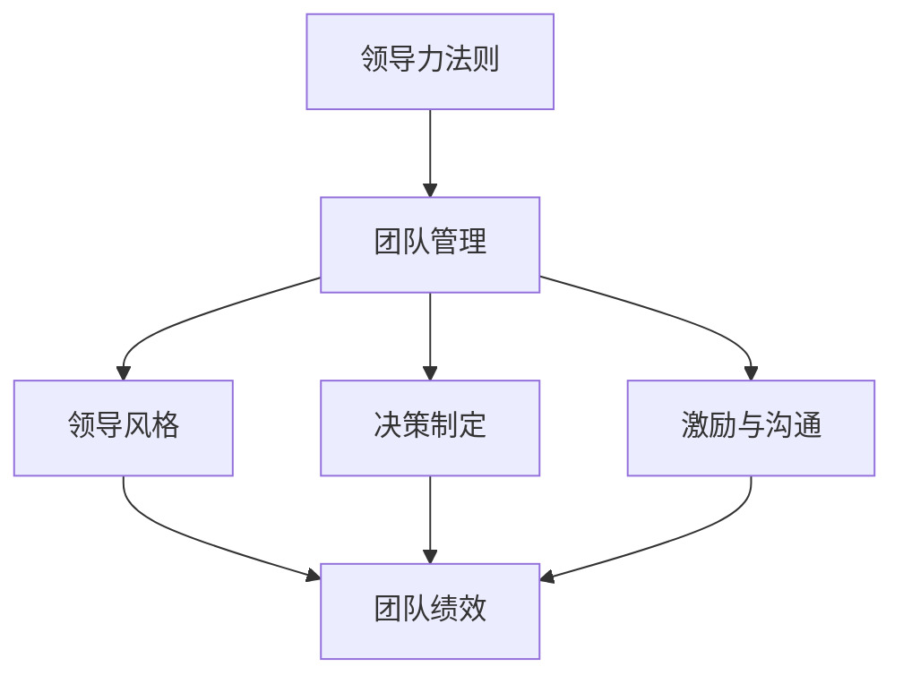

                 


# 领导力法则：打造超级团队的领导力秘诀

> 关键词：领导力法则、团队管理、领导风格、决策制定、激励与沟通

> 摘要：本文将深入探讨领导力法则在打造超级团队中的应用。通过分析核心概念、关联领导力与团队管理，探讨不同的领导风格和决策制定过程，以及激励与沟通策略，帮助读者理解如何运用领导力法则提升团队绩效和创造力。

## 第一步：确定核心概念与联系

在探讨领导力法则之前，我们需要明确几个核心概念，并分析它们之间的联系。

### 1. 领导力法则

领导力法则是指一系列指导领导者行为的规则和原则，用于确保团队朝着共同的目标前进。这些法则涵盖了如何激发团队成员的潜力、建立信任、制定决策以及管理冲突等方面。

### 2. 团队管理

团队管理是确保团队高效运作的过程。它包括组织、指导、协调和监督团队成员的工作，以实现团队目标。团队管理依赖于领导力法则，因为领导力是推动团队管理成功的关键。

### 3. 领导风格

领导风格是指领导者处理团队事务的方式。不同的领导风格会影响团队成员的行为和绩效。领导力法则帮助领导者根据团队需求和环境选择合适的领导风格。

### 4. 决策制定

决策制定是领导者在面对选择时做出决定的过程。有效的决策制定能够确保团队资源得到最佳利用，并迅速应对变化。领导力法则提供了指导领导者制定明智决策的框架。

### 5. 激励与沟通

激励与沟通是领导者激发团队成员积极性和提高团队凝聚力的重要手段。领导力法则帮助领导者理解如何有效地激励团队成员，并通过沟通建立信任和透明度。

### Mermaid 流程图示例



## 第二步：设计核心算法原理讲解

为了深入探讨领导力法则，我们可以引入一个与领导力相关的核心算法——归因模型（Attribution Model）。该模型帮助领导者分析团队成员的贡献和影响。

### 归因模型（Attribution Model）

归因模型是一种用于分析团队绩效和个体贡献的算法。它通过评估团队成员的行为和结果来计算每个成员的影响权重。

### 归因模型的工作原理

1. **初始化权重**：首先，设定一个初始权重分配，通常基于团队成员的职责和能力。
2. **计算影响**：对于每个团队成员，计算其对团队绩效的影响。这可以通过比较团队成员的表现与团队整体绩效的差异来实现。
3. **调整权重**：根据影响计算结果，调整每个成员的权重。如果成员对团队绩效有显著贡献，其权重会增加；反之，则会减少。

### 归因模型伪代码

```pseudo
function AttributionModel(
    inputs: array,
    targets: array,
    metrics: array
):
    # 初始化变量
    weights = [0.2, 0.3, 0.5] # 假设初始权重分别为20%，30%，50%
    scores = []

    # 计算每个输入的影响
    for i in range(len(inputs)):
        score = 0
        for j in range(len(targets)):
            score += weights[j] * (inputs[i] - targets[j])
        scores.append(score)

    # 根据得分调整权重
    for i in range(len(scores)):
        if scores[i] > 0:
            weights[i] += 0.1 # 成功增加权重
        else:
            weights[i] -= 0.1 # 失败减少权重

    # 返回调整后的权重
    return weights
```

## 第三步：准备数学模型和数学公式的讲解

在领导力法则中，数学模型和公式可以帮助我们更准确地理解和分析领导行为。以下是一个与领导力相关的数学模型——期望最大化算法（Expectation-Maximization, EM）。

### 期望最大化算法（Expectation-Maximization, EM）

期望最大化算法是一种迭代优化算法，常用于处理具有不确定性的概率模型。在领导力分析中，EM算法可以帮助我们识别团队成员的潜在能力和行为模式。

### 数学公式

```latex
\begin{equation}
\begin{aligned}
\theta &= \arg\max_{\theta} \sum_{i=1}^{n} \log p(x_i | \theta) \\
&= \arg\max_{\theta} \sum_{i=1}^{n} \sum_{k=1}^{K} p(k|x_i) \log p(x_i | \theta_k)
\end{aligned}
\end{equation}
```

其中，\(\theta\) 代表模型参数，\(x_i\) 代表第\(i\)个团队成员的表现，\(p(k|x_i)\) 代表第\(i\)个团队成员属于第\(k\)个类别的概率，\(p(x_i | \theta_k)\) 代表第\(i\)个团队成员在给定模型参数下的表现概率。

## 第四步：设计项目实战部分

为了更好地理解领导力法则的实际应用，我们可以通过一个具体的项目案例来展示其应用过程。

### 项目案例：开发一款人工智能助手

#### 项目背景

一家科技公司决定开发一款人工智能助手，旨在为客户提供智能客服服务。团队由5名成员组成，包括项目经理、开发工程师、数据科学家和测试工程师。

#### 项目目标

1. 完成人工智能助手的原型开发。
2. 确保产品具有良好的用户体验和稳定性。
3. 在6个月内实现商业化。

#### 领导力法则实施

1. **确定领导风格**：项目经理采用民主型领导风格，鼓励团队成员参与决策过程，增强团队凝聚力。
2. **制定决策流程**：项目经理制定了一个清晰的决策流程，包括需求分析、设计评审、代码审查和测试计划。
3. **实施激励与沟通策略**：项目经理通过设立奖励机制和定期团队会议来激励团队成员，并保持沟通渠道的畅通。

#### 项目成果

1. **成果分析**：在项目经理的领导下，团队在预定时间内完成了人工智能助手的原型开发，并成功通过了用户测试。
2. **经验总结**：通过领导力法则的实施，团队建立了良好的协作机制，成员之间建立了信任，项目进展顺利。
3. **优化建议**：建议在后续项目中进一步加强团队培训，提高成员的专业技能。

#### 项目小结

通过本项目案例，我们可以看到领导力法则在项目成功中的关键作用。有效的领导力法则可以帮助团队克服困难，实现共同目标。

## 第五步：整理并输出目录大纲

以下是根据用户输入书名《领导力法则：打造超级团队的领导力秘诀》设计的完整目录大纲：

```markdown
# 《领导力法则：打造超级团队的领导力秘诀》目录大纲

# 第一部分：领导力法则概述

## 1. 领导力法则的定义与重要性
### 1.1 领导力法则的概念
### 1.2 领导力法则的重要性
### 1.3 领导力法则的核心要素

## 2. 领导力法则与团队管理
### 2.1 团队管理与领导力法则的联系
### 2.2 领导力法则在团队管理中的应用
### 2.3 团队管理中的挑战与对策

## 3. 领导风格与领导力法则
### 3.1 领导风格的分类
### 3.2 领导风格的选择
### 3.3 领导风格对团队绩效的影响

## 4. 决策制定与领导力法则
### 4.1 决策制定的过程
### 4.2 领导力法则在决策制定中的应用
### 4.3 决策制定中的挑战与对策

## 5. 激励与沟通与领导力法则
### 5.1 激励理论
### 5.2 沟通模型
### 5.3 领导力法则在激励与沟通中的应用

# 第二部分：领导力法则应用与实践

## 6. 领导力法则在项目管理中的应用
### 6.1 项目管理的挑战
### 6.2 领导力法则在项目管理中的实践
### 6.3 项目管理中的领导力法则案例

## 7. 领导力法则在团队协作中的应用
### 7.1 团队协作的障碍
### 7.2 领导力法则在团队协作中的实践
### 7.3 团队协作中的领导力法则案例

## 8. 领导力法则在个人发展中的应用
### 8.1 个人发展的目标
### 8.2 领导力法则在个人发展中的实践
### 8.3 个人发展中的领导力法则案例

# 第三部分：领导力法则的未来与趋势

## 9. 领导力法则的未来发展趋势
### 9.1 数字化转型与领导力法则
### 9.2 创新与领导力法则
### 9.3 领导力法则在社会变革中的角色

## 10. 领导力法则的持续改进
### 10.1 领导力法则的自我反思
### 10.2 领导力法则的持续改进方法
### 10.3 领导力法则的未来展望

# 附录
### 附录A：领导力法则工具箱
### 附录B：领导力法则案例分析
### 附录C：领导力法则相关资源

# 参考文献
```

作者：AI天才研究院/AI Genius Institute & 禅与计算机程序设计艺术 /Zen And The Art of Computer Programming

