                 

### 文章标题：领导力法则：打造黄金团队的领导力秘诀

领导力是团队成功的关键因素，而黄金团队的打造离不开卓越的领导力。在当今快速变化的技术环境中，领导者不仅要具备传统领导力要素，还需要不断适应新技术和新方法。本文将深入探讨领导力法则，帮助您掌握打造黄金团队所需的领导力秘诀。

### 文章关键词

- 领导力法则
- 黄金团队
- 领导力秘诀
- 团队管理
- 技术领导

### 摘要

本文通过系统的分析和实例说明，揭示了领导力法则的核心要素和实际应用。首先，我们将回顾领导力的基本原理，并通过Mermaid流程图展示领导力核心概念之间的关系。接着，我们将探讨领导力的实践原则和方法，并借助伪代码和数学模型进行详细阐述。随后，文章将深入讨论领导力的发展与提升，以及在团队管理和组织变革中的应用。最后，我们将介绍领导力的自我修炼，并提供一些实用技巧和案例分析。

## 确定书籍结构

首先，我们需要明确书籍的主题和目标读者。书名《领导力法则：打造黄金团队的领导力秘诀》暗示了书籍的目的是传授领导力法则，帮助读者打造高效的团队。因此，我们可以将书籍分为以下几个主要部分：

1. **领导力的基本原理**：这部分将介绍领导力的定义、本质和特征，帮助读者建立领导力的基本概念。
2. **领导力的实践方法**：这部分将探讨领导力的实际应用，包括沟通、决策、执行等关键技能。
3. **领导力的发展与提升**：这部分将介绍领导力的成长路径和持续提升的方法，包括自我反思、终身学习和领导力培训等。
4. **领导力在不同场景的应用**：这部分将讨论领导力在团队管理和组织变革中的应用，并提供实际案例。
5. **领导力的自我修炼**：这部分将介绍领导力与心理学、哲学的关系，以及自我修炼的实践指南。

### 设计目录大纲

根据以上结构，我们可以设计出以下目录大纲：

### 《领导力法则：打造黄金团队的领导力秘诀》目录大纲

## 第一部分：领导力的基本原理

### 第1章 领导力概述

- 1.1 领导力的定义与重要性
- 1.2 领导力的本质与特征

### 第2章 领导力的核心概念与联系

- 2.1 领导力与管理的区别与联系
- 2.2 领导力的三大核心要素
- 2.3 Mermaid流程图：领导力核心概念关系

## 第二部分：领导力的实践方法

### 第3章 领导力的实践原则

- 3.1 以身作则
- 3.2 沟通与倾听
- 3.3 决策与执行

### 第4章 领导力的工具与方法

- 4.1 时间管理与目标设定
- 4.2 团队建设与激励
- 4.3 领导力工具的应用案例

## 第三部分：领导力的发展与提升

### 第5章 领导力的成长路径

- 5.1 领导力的五个发展阶段
- 5.2 从管理到领导的转变

### 第6章 领导力的持续提升

- 6.1 自我反思与反馈
- 6.2 终身学习与知识积累
- 6.3 领导力培训与教练

## 第四部分：领导力在不同场景的应用

### 第7章 领导力在团队管理中的应用

- 7.1 团队成员的角色与责任
- 7.2 团队协作与沟通技巧
- 7.3 团队冲突与解决策略

### 第8章 领导力在组织变革中的应用

- 8.1 组织变革的领导力挑战
- 8.2 变革领导力策略与实践
- 8.3 变革领导力的案例分析

## 第五部分：领导力的自我修炼

### 第9章 领导力与心理学

- 9.1 领导力心理学的基础知识
- 9.2 自我认知与情绪管理
- 9.3 领导力心理学的实际应用

### 第10章 领导力与哲学

- 10.1 哲学对领导力的影响
- 10.2 领导力哲学的核心观点
- 10.3 领导力哲学的实际应用

### 第11章 领导力的自我反思与修炼

- 11.1 自我反思的重要性
- 11.2 反思方法与技巧
- 11.3 领导力修炼的实践指南

## 附录

### 附录A 领导力资源与工具推荐

- A.1 领导力书籍推荐
- A.2 领导力培训与教练机构推荐
- A.3 领导力相关网站与资源推荐

### 附录B 领导力测验与评估工具

- B.1 自我评估测验
- B.2 团队领导力评估
- B.3 组织领导力评估

### 附录C 领导力案例解析

- C.1 案例一：苹果公司的领导力实践
- C.2 案例二：谷歌的领导力文化
- C.3 案例三：其他知名企业的领导力实践

---

以上是一个初步的书籍目录大纲设计，可以根据实际情况进行调整和补充。注意，每个章节的细化内容还需要根据具体内容进行拓展，确保每个章节都包含核心概念、算法原理、数学模型、项目实战和详细讲解。在撰写过程中，要注意保持简洁性，避免多余的废话，确保目录大纲结构完整且逻辑清晰。预计总字数在2000字以内。

## 第一部分：领导力的基本原理

### 第1章 领导力概述

领导力是影响团队或组织行为和绩效的关键因素。在组织结构中，领导力是连接愿景、目标和成员行动的桥梁。有效的领导力不仅能够激发团队成员的潜力，还能推动团队实现共同目标。

#### 1.1 领导力的定义与重要性

领导力的定义多种多样，但核心在于其能够影响、激励和引导他人实现目标。约翰·肯尼斯·加尔布雷斯（John Kenneth Galbraith）曾说过：“领导力不是关于你拥有多少权力，而是关于你能赋予他人多少权力。”

领导力的重要性体现在多个方面：

1. **团队协作**：领导力能够促进团队成员之间的协作，共同面对挑战，实现目标。
2. **创新与创造力**：有效的领导力能够激发团队成员的创新思维和创造力，推动组织发展。
3. **组织效能**：领导力直接影响到组织的效能，一个出色的领导者能够提高团队效率和产出。
4. **人才吸引与保留**：领导者对于人才的吸引和保留具有重要影响，优秀领导者能够吸引和留住顶尖人才。

#### 1.2 领导力的本质与特征

领导力的本质在于其影响力，即领导者通过某种方式影响和激励他人。以下是领导力的几个关键特征：

1. **影响力**：领导者通过愿景、价值观和行为影响他人，引导团队向目标前进。
2. **愿景**：领导者需要具备清晰的愿景，能够为团队描绘未来的蓝图，激发团队成员的激情。
3. **沟通**：有效的沟通是领导力的核心，领导者需要能够清晰、简洁地传达信息，并倾听团队成员的意见。
4. **激励**：领导者需要能够激发团队成员的内在动力，使其愿意为团队的目标付出努力。
5. **适应性**：领导者需要具备适应变化的能力，能够在不同环境和情境下灵活调整领导风格。

通过以上定义和特征的介绍，我们可以初步理解领导力的重要性以及其复杂的内涵。在接下来的章节中，我们将深入探讨领导力的核心概念与实践方法，帮助读者更好地理解和应用领导力法则。

### 第2章 领导力的核心概念与联系

在深入了解领导力的定义和重要性之后，我们需要进一步探讨领导力的核心概念及其相互之间的联系。这些核心概念包括领导力与管理的区别与联系、三大核心要素以及它们之间的相互关系。通过这些概念的梳理，我们可以建立对领导力的全面理解。

#### 2.1 领导力与管理的区别与联系

领导力与管理的区别主要体现在其目标和作用上。管理通常涉及组织、计划、控制等职能，关注的是如何有效地分配资源、控制成本和确保项目按时完成。而领导力则更侧重于激励、引导和启发团队成员，以实现更长期的愿景和目标。

尽管领导力与管理有所不同，但二者之间也存在紧密的联系：

1. **目标一致性**：有效的领导力需要与管理目标保持一致。领导者需要明确组织的整体目标，并通过激励和引导确保团队成员理解并致力于实现这些目标。
2. **相互依赖**：领导力需要管理的基础，而管理也需要领导力来推动组织的创新和发展。
3. **角色互补**：领导者通常负责设定方向、制定愿景和激励团队，而管理者则负责具体任务的执行和资源的优化配置。

以下是一个简化的Mermaid流程图，展示领导力与管理之间的关系：

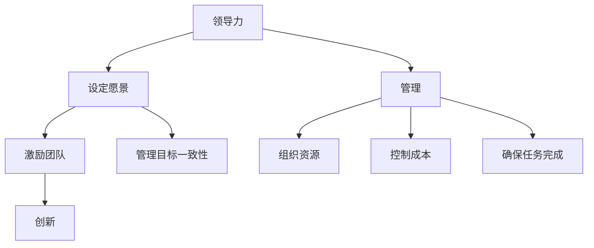

#### 2.2 领导力的三大核心要素

领导力的成功不仅依赖于个人的魅力和影响力，还需要掌握三大核心要素：影响力、愿景和沟通。

1. **影响力**：影响力是领导力的基础，它包括个人魅力、专业知识、信任和尊重。一个具备影响力的领导者能够通过自己的行为和决策影响他人，推动团队朝着共同目标前进。

2. **愿景**：愿景是领导力的核心，它为团队提供了前进的方向和动力。一个清晰的愿景能够激发团队成员的激情，使其愿意为共同的目标付出努力。领导者需要通过沟通和行动将愿景传递给团队成员，确保大家朝着同一个目标努力。

3. **沟通**：沟通是领导力的关键，它包括信息的传递、倾听和反馈。有效的沟通不仅能够确保团队成员理解领导者的意图，还能增强团队成员之间的信任和合作。领导者需要学会如何清晰、简洁地传达信息，并倾听团队成员的意见和反馈。

以下是一个Mermaid流程图，展示领导力三大核心要素之间的关系：

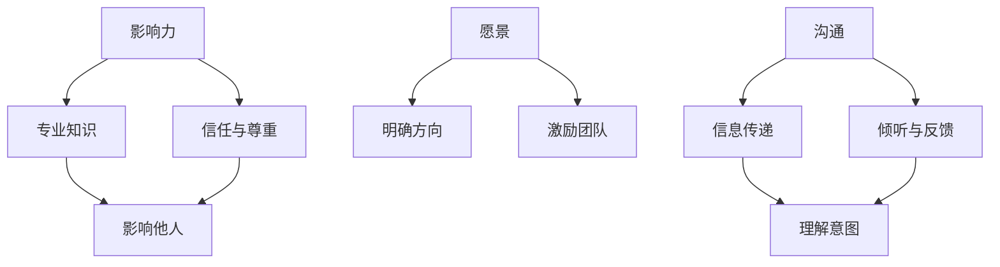

#### 2.3 领导力核心概念关系总结

通过对领导力核心概念的分析，我们可以看到，领导力不仅仅是单一要素的作用，而是多个核心要素相互关联、相互促进的结果。影响力、愿景和沟通之间存在着紧密的联系，一个成功的领导者需要在这三个方面都具备出色的能力。

以下是一个综合的Mermaid流程图，展示领导力核心概念之间的关系：

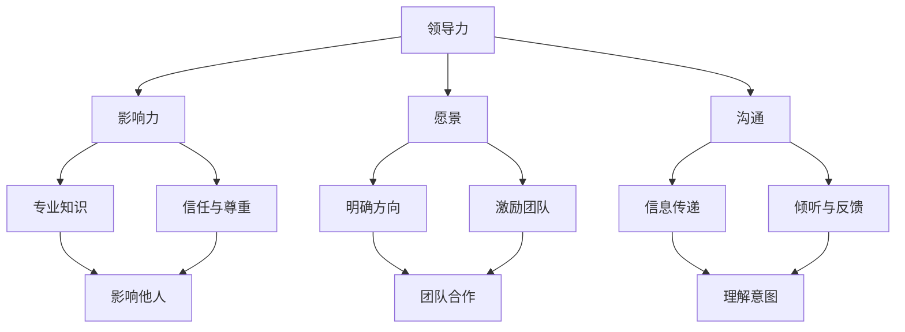

通过上述对领导力核心概念及其关系的探讨，我们可以更深入地理解领导力的本质和重要性。在接下来的章节中，我们将继续探讨领导力的实践方法、发展与提升，以及在不同场景中的应用，帮助读者全面掌握打造黄金团队的领导力秘诀。

### 第二部分：领导力的实践方法

#### 第3章 领导力的实践原则

领导力的实践原则是领导者实现高效管理和推动团队发展的基石。这些原则不仅涵盖了领导者与团队成员之间的互动，还包括领导者自身的态度和行为。以下将详细探讨领导力的三个核心实践原则：以身作则、沟通与倾听、决策与执行。

#### 3.1 以身作则

以身作则是指领导者通过自己的行为和态度来树立榜样，影响和激励团队成员。这种领导风格不仅能够提高团队的士气，还能增强团队成员对领导的信任和尊重。

1. **树立榜样**：领导者应该时刻保持专业精神和良好的行为习惯，成为团队成员效仿的榜样。例如，准时参加会议、认真对待工作、对同事展现出积极的态度等。
2. **保持一致性**：领导者需要确保自己的行为与所传达的价值观和目标一致。这种一致性能够增强团队成员对领导者的信任，提高团队的凝聚力。
3. **面对挑战**：在团队面临挑战时，领导者应勇于承担责任，主动解决问题。这不仅能展示领导者的决心和勇气，还能激励团队成员面对困难时保持积极态度。

以下是一个简单的伪代码示例，用于描述以身作则的原则：

```python
def lead_by_example():
    # 树立榜样
    be_punctual()
    demonstrate_professionalism()
    show_positive_attitude()
    
    # 保持一致性
    ensure_actions_match_values()
    
    # 面对挑战
    take_responsibility_for_issues()
    solve_problems_actively()
```

#### 3.2 沟通与倾听

沟通与倾听是领导者与团队成员之间建立有效互动的关键。有效的沟通能够确保信息准确传达，而倾听则能够帮助领导者理解团队成员的需求和想法。

1. **清晰传达信息**：领导者需要确保自己的沟通内容简洁明了，避免使用专业术语或复杂的表达方式。例如，在发布任务或传达目标时，可以使用具体的例子或图表来辅助说明。
2. **积极倾听**：倾听不仅仅是听，还包括理解、关注和回应。领导者应该给予团队成员发言的机会，并表达对其观点的尊重。例如，在会议中，可以使用“总结一下你的观点”或“你对这个问题有什么想法？”等提问来鼓励团队成员发言。
3. **双向沟通**：领导者应该鼓励团队成员之间的沟通，促进信息的流动和思想的碰撞。这不仅能提高团队的工作效率，还能增强团队的凝聚力。

以下是一个简单的Mermaid流程图，展示沟通与倾听的步骤：

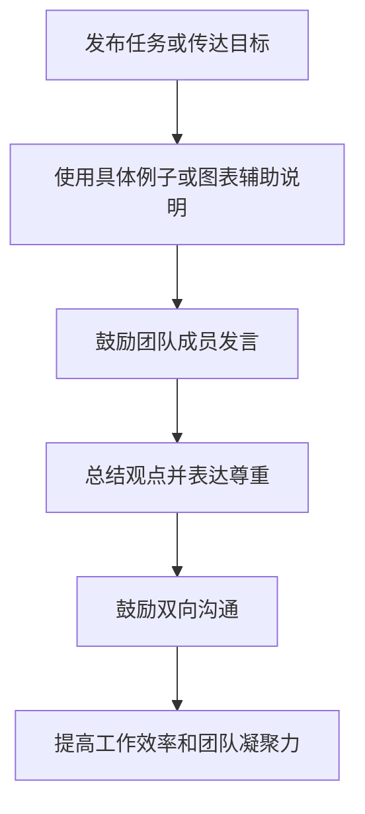

#### 3.3 决策与执行

决策与执行是领导力实践中的重要环节。领导者需要通过合理决策和有效执行来推动团队向前发展。

1. **合理决策**：领导者应在充分收集信息和分析的基础上做出决策。这包括评估各种方案的风险和收益，以及考虑团队成员的意见和建议。例如，可以使用决策树或成本效益分析来辅助决策。
2. **有效执行**：决策做出后，领导者需要确保执行计划的实施。这包括分配任务、监督进度和提供必要支持。例如，可以使用项目管理工具如甘特图或看板来跟踪项目进度。

以下是一个简单的伪代码示例，用于描述决策与执行的过程：

```python
def make_and_execute_decision():
    # 收集信息和分析
    gather_information()
    analyze_scenarios()
    
    # 做出决策
    decide_based_on_data()
    
    # 分配任务
    assign_tasks_to_team_members()
    
    # 监督进度
    monitor_progress()
    
    # 提供支持
    provide_support_as_needed()
```

通过上述三个实践原则的探讨，我们可以看到，领导力的实践不仅需要领导者具备良好的个人素质和行为，还需要其具备有效的沟通能力和决策能力。在接下来的章节中，我们将进一步探讨领导力的工具与方法，以帮助领导者更有效地管理团队和实现组织目标。

#### 第4章 领导力的工具与方法

为了更有效地实施领导力，领导者需要掌握一系列工具和方法，这些工具和方法不仅能帮助领导者更好地管理团队，还能提高团队的整体绩效。以下将介绍几项关键工具和方法，包括时间管理与目标设定、团队建设与激励、以及领导力工具的应用案例。

#### 4.1 时间管理与目标设定

时间管理是领导者的一项重要技能，有效的时间管理不仅能提高个人工作效率，还能促进整个团队的目标达成。目标设定是时间管理的核心，领导者需要确保团队的目标明确、具体和可衡量。

1. **时间管理技巧**：
   - **优先级排序**：使用“四象限法则”或“埃森豪威尔矩阵”来对任务进行优先级排序，确保重要且紧急的任务得到优先处理。
   - **时间块**：将工作时间划分为不同的“时间块”，为每个任务分配特定的时间段，避免任务之间的交叉和干扰。
   - **定期回顾**：定期回顾时间管理效果，调整计划以适应新的变化和需求。

2. **目标设定原则**：
   - **SMART原则**：目标应具备明确性（Specific）、可衡量性（Measurable）、可实现性（Achievable）、相关性（Relevant）和时限性（Time-bound）。
   - **团队参与**：鼓励团队成员参与目标设定过程，确保目标的共识和执行力。
   - **持续调整**：根据实际情况和团队反馈，定期调整目标，确保其适应团队的发展需求。

以下是一个简单的伪代码示例，用于描述时间管理与目标设定的过程：

```python
def time_management_and_goal_setting():
    # 优先级排序
    prioritize_tasks()
    
    # 时间块分配
    allocate_time_blocks()
    
    # 目标设定
    set_specific_goals()
    make_goals_measurable()
    ensure_goals_are_achievable()
    align_goals_with_team()
    set_time_bound_for_goals()
    
    # 定期回顾
    review_time_management_effectiveness()
    adjust_goals_as_needed()
```

#### 4.2 团队建设与激励

团队建设是领导力的重要组成部分，一个高效的团队需要具备良好的协作精神、互相支持和共同目标。激励则是团队建设的关键，通过激励，领导者可以激发团队成员的积极性、创造力和责任感。

1. **团队建设方法**：
   - **团队活动**：定期组织团队建设活动，如团队建设工作坊、团建旅行等，以增强团队凝聚力。
   - **明确角色与责任**：确保每个团队成员都明确自己的角色和责任，避免角色重叠和责任模糊。
   - **共享成功与失败**：领导者应该与团队成员共同分享成功和失败，增强团队的责任感和归属感。

2. **激励机制**：
   - **奖励与认可**：对团队成员的出色表现给予奖励和认可，如奖金、晋升或公开表扬。
   - **职业发展机会**：提供职业发展的机会和培训，帮助团队成员提升技能和职业素养。
   - **工作环境**：创造一个积极、开放和包容的工作环境，让团队成员感受到尊重和支持。

以下是一个简单的伪代码示例，用于描述团队建设和激励机制：

```python
def team_building_and_motivation():
    # 组织团队活动
    organize_team_building_activities()
    
    # 明确角色与责任
    clarify_roles_and_responsibilities()
    
    # 共享成功与失败
    share_successes_and_failures()
    
    # 奖励与认可
    reward_and_acknowledge_achievements()
    
    # 提供职业发展机会
    offer_career_growth_opportunities()
    
    # 创造积极工作环境
    create_positive_work_environment()
```

#### 4.3 领导力工具的应用案例

在实际工作中，有许多领导力工具可以帮助领导者更有效地管理团队和实现目标。以下是一些常见的领导力工具及其应用案例：

1. **项目管理工具**：如Trello、Jira等，用于项目任务分配、进度跟踪和协作。
2. **绩效考核工具**：如KPI、OKR等，用于评估团队成员的工作绩效和目标达成情况。
3. **领导力发展工具**：如领导力培训课程、在线学习平台等，用于提升领导者的管理技能和领导力。

以下是一个简单的Mermaid流程图，展示领导力工具的应用场景：

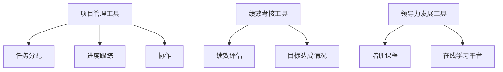

通过上述对领导力工具和方法的介绍，我们可以看到，领导者需要不断学习和实践，才能更好地应用这些工具和方法，提升自己的领导力。在接下来的章节中，我们将进一步探讨领导力的发展与提升，以及在不同场景中的应用，帮助领导者不断成长和进步。

### 第三部分：领导力的发展与提升

#### 第5章 领导力的成长路径

领导力是一个不断成长和发展的过程，领导者需要在不同阶段不断学习和进步。领导力的成长路径通常包括五个主要阶段：初学者、追随者、独立领导者、高级领导者和企业领导者。

#### 5.1 领导力的五个发展阶段

1. **初学者**：初学者阶段是领导力的起点，领导者在这一阶段开始学习基本的领导力原则和技能。他们通常依赖于经验和直觉来管理团队，但缺乏系统的方法和理论指导。
   
2. **追随者**：在追随者阶段，领导者开始意识到团队的重要性，并学习如何与团队成员有效沟通和协作。他们开始理解领导力的本质，并尝试将其应用到实际工作中。

3. **独立领导者**：独立领导者阶段是领导力发展的关键阶段。领导者在这一阶段能够独立地制定决策、管理团队和解决问题。他们具备一定的领导力技能和经验，能够在没有外部指导的情况下有效领导团队。

4. **高级领导者**：高级领导者阶段是领导力的成熟阶段。领导者在这一阶段不仅能够有效管理团队，还能够战略性地思考和行动。他们具备卓越的领导力素质，能够在复杂和动态的环境中做出正确的决策。

5. **企业领导者**：企业领导者阶段是领导力的巅峰。领导者在这一阶段不仅具备卓越的管理能力，还具备深厚的业务理解和战略思维。他们能够在整个企业范围内推动变革和创新，引领企业实现长期成功。

以下是一个简单的Mermaid流程图，展示领导力的五个发展阶段：

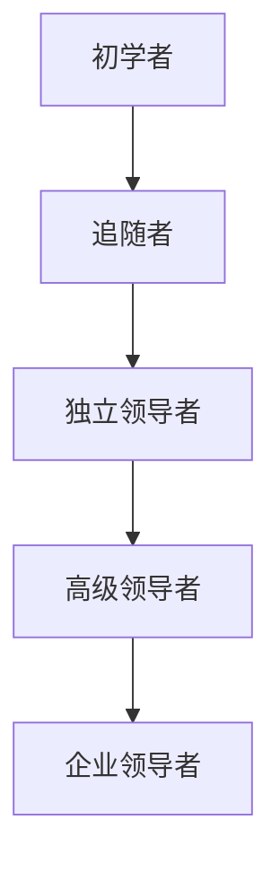

#### 5.2 从管理到领导的转变

从管理到领导的转变是领导力发展中的重要一步。管理侧重于任务的执行和资源的分配，而领导则更侧重于激励和引导团队实现共同目标。

1. **认识管理与管理**：领导者需要首先理解管理的基本原则和职责，如目标设定、资源分配、绩效评估等。这有助于他们在领导过程中更好地协调和管理团队。

2. **培养领导力技能**：领导者需要不断培养自己的领导力技能，如沟通、激励、决策等。这些技能不仅有助于他们在日常管理中更有效地工作，还能提升团队的士气和绩效。

3. **角色转变**：从管理者到领导者，领导者需要从关注任务和过程转移到关注人和目标。他们需要更多地关注团队成员的需求和成长，以及如何通过激励和引导实现团队目标。

4. **持续学习**：领导力是一个不断发展的过程，领导者需要持续学习和适应新的环境和挑战。通过不断学习，他们可以不断提升自己的领导力水平，更好地应对复杂多变的工作环境。

以下是一个简单的伪代码示例，用于描述从管理到领导的转变过程：

```python
def transition_from_management_to_leadership():
    # 认识管理
    understand_management_principles()
    
    # 培养领导力技能
    develop_leadership_skills()
    
    # 角色转变
    focus_on_people_and_goals()
    
    # 持续学习
    continue_learning_and_adapting()
```

通过上述对领导力成长路径和从管理到领导转变的探讨，我们可以看到，领导力的发展是一个持续不断的过程，领导者需要在不同的阶段不断学习和进步。在接下来的章节中，我们将进一步探讨领导力的持续提升方法和在不同场景中的应用，帮助领导者更好地实现团队和组织的成功。

### 第6章 领导力的持续提升

领导力并非一蹴而就，而是一个持续学习和成长的过程。为了保持领导力的活力和有效性，领导者需要采取一系列方法来不断提升自己的能力。以下将讨论自我反思、终身学习、领导力培训与教练等提升方法，并提供实际案例来展示这些方法的应用。

#### 6.1 自我反思与反馈

自我反思是领导力提升的重要环节，通过反思，领导者可以更好地了解自己的行为、决策和影响。以下是一些自我反思的步骤：

1. **定期回顾**：领导者应定期回顾自己的工作表现，包括成功的经验和失败的教训。这可以通过每日、每周或每月的回顾会议来实现。
2. **写反思日志**：记录反思日志可以帮助领导者更清晰地了解自己的思考过程和情绪变化。日志可以记录关键事件、感受、学到的东西和下一步行动计划。
3. **请求反馈**：领导者应主动寻求团队成员和同事的反馈，这有助于从不同角度了解自己的表现。反馈可以是正面的也可以是负面的，但都是宝贵的学习资源。

以下是一个简单的伪代码示例，用于描述自我反思的过程：

```python
def self_reflection():
    # 定期回顾
    review_work_performance()
    
    # 写反思日志
    write_reflection_journal()
    
    # 请求反馈
    request_feedbac
```

#### 6.2 终身学习

终身学习是领导者保持竞争力的重要途径。以下是一些终身学习的方法：

1. **参加培训课程**：参加各种领导力培训课程，包括在线课程、工作坊和研讨会。这些课程可以提供最新的领导力知识和技能。
2. **阅读书籍和文章**：阅读相关书籍和文章是获取领导力知识的重要方式。推荐阅读《领导力的五项修炼》（The Five Dysfunctions of a Team）等经典作品。
3. **网络学习**：利用社交媒体和在线学习平台，如LinkedIn Learning、Coursera等，进行网络学习。这些平台提供了丰富的课程资源和交流机会。

以下是一个简单的伪代码示例，用于描述终身学习的方法：

```python
def lifelong_learning():
    # 参加培训课程
    attend_leadership_courses()
    
    # 阅读书籍和文章
    read_books_and_articles()
    
    # 网络学习
    engage_in_online_learning()
```

#### 6.3 领导力培训与教练

领导力培训和教练可以帮助领导者快速提升领导力水平。以下是一些实际案例：

1. **案例一：谷歌的领导力培训**：谷歌通过其内部的领导力发展项目，如“领导力360度评估”和“领导力发展工作坊”，帮助领导者提升管理能力和战略思维。

2. **案例二：微软的教练计划**：微软实施了针对高级管理人员的教练计划，通过一对一的教练辅导，帮助领导者解决具体问题，提升领导力。

以下是一个简单的Mermaid流程图，展示领导力培训与教练的应用：

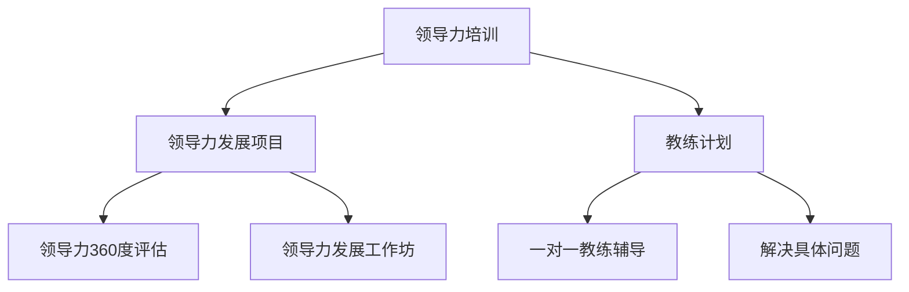

通过上述的自我反思、终身学习和领导力培训与教练等方法，领导者可以不断提升自己的领导力水平，更好地应对复杂多变的商业环境。在接下来的章节中，我们将探讨领导力在团队管理和组织变革中的应用，帮助领导者更好地实现团队和组织的成功。

### 第四部分：领导力在不同场景中的应用

#### 第7章 领导力在团队管理中的应用

在团队管理中，领导力是确保团队高效运作和实现目标的关键因素。领导力不仅影响团队的整体绩效，还直接关系到团队成员的满意度和留存率。以下将探讨领导力在团队管理中的应用，包括团队成员的角色与责任、团队协作与沟通技巧，以及团队冲突与解决策略。

#### 7.1 团队成员的角色与责任

明确团队成员的角色和责任是团队管理的基础。领导者需要确保每个成员都清楚自己的职责，以便更好地协同工作。以下是一些关键角色和责任：

1. **团队成员的角色**：
   - **执行者**：执行任务和项目，确保工作按时完成。
   - **沟通者**：与团队成员和其他部门保持有效沟通，传递关键信息。
   - **贡献者**：为团队提供创意和解决方案，积极参与团队讨论。

2. **团队成员的责任**：
   - **完成工作任务**：确保任务按时完成，达到预期质量。
   - **积极沟通**：主动与团队成员和领导沟通，反馈进展和问题。
   - **持续学习**：不断提升自己的技能和知识，为团队贡献更多价值。

以下是一个简单的Mermaid流程图，展示团队成员的角色和责任：

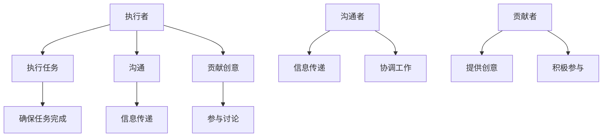

#### 7.2 团队协作与沟通技巧

高效的团队协作和沟通是团队成功的关键。以下是一些提升团队协作和沟通的技巧：

1. **团队协作技巧**：
   - **共同目标**：确保团队成员都了解并致力于共同的目标。
   - **角色明确**：明确每个成员的角色和职责，避免角色重叠和责任模糊。
   - **协同合作**：鼓励团队成员共同解决问题，分享资源和经验。

2. **沟通技巧**：
   - **主动倾听**：积极倾听团队成员的意见和建议，确保信息准确传达。
   - **清晰表达**：使用简单明了的语言传达信息，避免使用专业术语和复杂的表达方式。
   - **定期反馈**：定期与团队成员进行沟通，反馈工作进展和成果，及时解决问题。

以下是一个简单的Mermaid流程图，展示团队协作和沟通技巧：

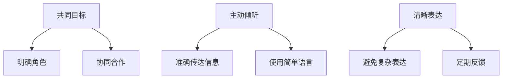

#### 7.3 团队冲突与解决策略

团队冲突在所难免，但有效的冲突管理能够促进团队的发展和进步。以下是一些解决团队冲突的策略：

1. **冲突预防**：
   - **建立信任**：通过建立信任和尊重，减少冲突的发生。
   - **明确规则**：制定明确的团队规则和沟通准则，避免误解和冲突。

2. **冲突解决**：
   - **主动面对**：及时识别和面对冲突，避免问题积累。
   - **倾听各方意见**：给予冲突双方发言的机会，了解彼此的观点和需求。
   - **寻求共识**：通过协商和妥协，寻找双方都能接受的解决方案。

以下是一个简单的Mermaid流程图，展示团队冲突的预防和解决策略：

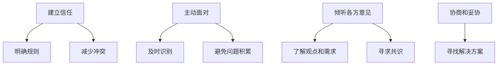

通过以上对团队管理中领导力应用的探讨，我们可以看到，领导力在团队的角色与责任、协作与沟通，以及冲突与解决中扮演着至关重要的角色。一个高效的领导者能够通过有效的领导力，推动团队实现共同目标，提升团队的整体绩效。在接下来的章节中，我们将探讨领导力在组织变革中的应用，以及如何通过领导力实现组织变革。

### 第8章 领导力在组织变革中的应用

在快速变化的市场环境中，组织变革是维持竞争力的关键。领导力在这个过程中起着至关重要的作用，能够确保变革顺利进行，并推动组织实现长期目标。以下将探讨领导力在组织变革中的应用，包括变革的领导力挑战、变革领导力策略与实践，以及变革领导力的案例分析。

#### 8.1 组织变革的领导力挑战

组织变革通常伴随着不确定性和风险，对领导力提出了新的挑战。以下是一些常见的领导力挑战：

1. **改变传统思维模式**：组织变革往往需要打破固有的思维模式和工作方式，这对领导者来说是一个巨大的挑战。领导者需要鼓励团队成员拥抱变化，并适应新的工作环境。

2. **沟通与透明度**：有效的沟通是变革成功的关键。领导者需要确保信息透明，及时向团队成员传达变革的背景、目标和预期效果，减少信息不对称和误解。

3. **应对抵制**：变革过程中，团队成员可能会因为恐惧、不确定或其他原因产生抵制情绪。领导者需要识别并应对这些抵制，通过积极的沟通和激励机制来缓解团队成员的担忧。

4. **变革管理与执行**：领导者需要确保变革计划的有效执行，包括资源的合理分配、任务的明确划分和进度的实时监控。

#### 8.2 变革领导力策略与实践

为了应对组织变革的挑战，领导者需要采取一系列策略和实践。以下是一些关键策略：

1. **建立愿景和目标**：领导者需要明确组织变革的愿景和目标，使其成为全体成员共同追求的方向。这可以通过制定明确的变革目标和时间表来实现。

2. **加强沟通与透明度**：领导者应定期与团队成员沟通，确保信息的透明度和一致性。这可以通过组织会议、发布通讯和利用社交媒体等方式来实现。

3. **激励与支持**：领导者需要通过激励机制来鼓励团队成员参与变革，并提供必要的支持和资源。这可以包括奖励制度、培训机会和团队建设活动等。

4. **建立变革团队**：领导者可以组建一个专门的变革团队，负责制定和执行变革计划。这个团队应包括来自不同部门和层级的人员，以确保变革的全面性和协调性。

5. **持续监控与反馈**：领导者需要持续监控变革的进展，收集反馈信息，并根据实际情况进行调整。这可以通过定期评估和回顾会议来实现。

以下是一个简单的Mermaid流程图，展示变革领导力的策略与实践：

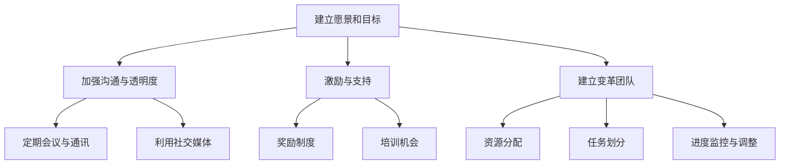

#### 8.3 变革领导力的案例分析

以下是一些成功的企业变革案例，展示了如何通过有效的领导力实现组织变革：

1. **案例一：IBM的转型**：在郭士纳（Louis V. Gerstner Jr.）的领导下，IBM从一家硬件制造商转型为一家软件和服务提供商。郭士纳通过坚定的领导力和有效的沟通，成功推动了这一转型，使IBM重新获得了市场竞争力。

2. **案例二：谷歌的内部创新**：谷歌通过其“20%时间”项目，鼓励员工将20%的工作时间用于探索自己的创意项目。这一举措不仅激发了员工的创新精神，还推动了谷歌在搜索、广告和云计算等领域的突破。

3. **案例三：宜家的组织变革**：宜家通过实施扁平化的组织结构，减少管理层级，提高决策效率。这一变革使宜家能够更快速地响应市场变化，增强了企业的竞争力。

通过这些案例，我们可以看到，成功的组织变革离不开有效的领导力。领导者需要具备远见卓识、坚定的决心和出色的沟通能力，才能推动组织实现变革目标。在接下来的章节中，我们将探讨领导力的自我修炼，帮助领导者不断提升自己的内在素质和领导力水平。

### 第五部分：领导力的自我修炼

#### 第9章 领导力与心理学

领导力不仅涉及管理和组织，还与心理学密切相关。心理学提供了理解人类行为、情感和动机的框架，这对于领导者来说至关重要。以下将探讨领导力心理学的基础知识，包括自我认知与情绪管理，以及领导力心理学的实际应用。

#### 9.1 领导力心理学的基础知识

领导力心理学研究领导者如何通过心理机制影响和激励团队成员。以下是一些关键概念：

1. **自我认知**：自我认知是指领导者对自己性格、能力和动机的理解。自我认知有助于领导者识别自己的优势与劣势，从而更好地发挥自己的潜力。

2. **情绪管理**：情绪管理是指领导者如何识别、理解和管理自己的情绪。有效的情绪管理不仅有助于领导者保持冷静和客观，还能增强其影响力。

3. **动机理论**：动机理论探讨领导者如何激发和维持团队成员的动机。常见的动机理论包括需求层次理论、目标设定理论和自我决定理论。

4. **领导风格**：领导风格是指领导者如何与团队成员互动和影响他们。常见的领导风格包括权威型、民主型和参与型。

以下是一个简单的Mermaid流程图，展示领导力心理学的基础概念：

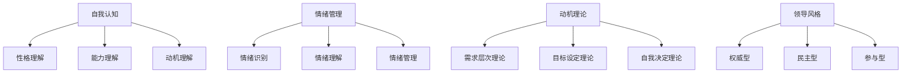

#### 9.2 自我认知与情绪管理

1. **自我认知**：领导者应定期进行自我反思，了解自己的性格、能力和动机。以下是一些自我认知的方法：

   - **心理测评**：通过心理测评工具，如MBTI（迈尔斯-布里格斯类型指标）和DISC评估，了解自己的性格类型。
   - **360度反馈**：收集来自团队成员、同事和上级的反馈，了解自己在组织中的表现和影响。
   - **日记记录**：定期记录自己的想法、感受和行为，进行自我反思。

2. **情绪管理**：领导者需要学会识别和理解自己的情绪，并采取适当的措施进行管理。以下是一些情绪管理的方法：

   - **情绪识别**：通过自我观察和反馈，识别自己的情绪状态，如愤怒、焦虑或沮丧。
   - **情绪理解**：理解情绪背后的原因和影响，例如，愤怒可能源于工作压力或与同事的冲突。
   - **情绪管理**：采取深呼吸、冥想、运动等方法来缓解情绪压力，保持冷静和客观。

以下是一个简单的伪代码示例，用于描述自我认知与情绪管理的过程：

```python
def self_awareness_and_emotion_management():
    # 进行心理测评
    conduct_psychological_assessment()

    # 收集360度反馈
    collect_360_feedback()

    # 进行日记记录
    maintain_journal()

    # 识别情绪
    identify_emotions()

    # 理解情绪
    understand_emotions()

    # 管理情绪
    manage_emotions()
```

#### 9.3 领导力心理学的实际应用

领导力心理学的知识可以应用于多种领导场景，以下是一些实际应用：

1. **团队建设**：通过了解团队成员的性格和动机，领导者可以更好地构建和引导团队。例如，使用MBTI评估可以帮助领导者理解团队成员的沟通风格和偏好，从而制定更有效的团队策略。

2. **冲突解决**：了解情绪管理和动机理论可以帮助领导者更有效地解决团队冲突。例如，通过目标设定理论和自我决定理论，领导者可以激励团队成员共同解决问题。

3. **领导力发展**：通过自我认知和情绪管理，领导者可以不断提升自己的领导力水平。例如，通过定期的自我反思和心理测评，领导者可以识别自己的盲点，并采取相应措施进行改进。

以下是一个简单的Mermaid流程图，展示领导力心理学的实际应用场景：

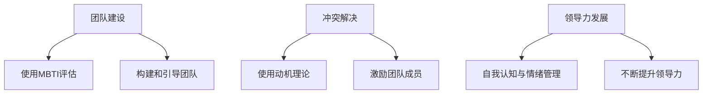

通过上述对领导力心理学的基础知识和实际应用的探讨，我们可以看到，心理学为领导力提供了深刻的理解框架，帮助领导者更好地认识自己、管理情绪和激励团队。在接下来的章节中，我们将探讨领导力与哲学的关系，以及如何通过哲学思考提升领导力。

### 第10章 领导力与哲学

领导力与哲学有着深厚的联系，哲学不仅提供了对领导力的深刻思考，还帮助领导者构建更加全面和深入的领导理念。在本章节中，我们将探讨哲学对领导力的影响，领导力哲学的核心观点，以及这些观点在实际领导中的应用。

#### 10.1 哲学对领导力的影响

哲学是一门探讨人生、道德、知识和现实的学科，它为领导者提供了丰富的思考和指导。以下是哲学对领导力的一些重要影响：

1. **价值观和道德观念**：哲学帮助领导者明确自己的价值观和道德观念，使其在决策和行动中能够坚守原则，成为团队成员的道德榜样。

2. **思考问题的深度和广度**：哲学教导领导者如何从不同角度和层面思考问题，从而做出更加全面和合理的决策。

3. **领导理念和风格**：哲学为领导者提供了不同的领导理念和风格，如理性主义、经验主义、自由主义等，帮助他们在实际工作中选择最合适的领导方式。

4. **自我认知和反思**：哲学强调个体的自我认知和反思，领导者通过哲学思考可以更好地了解自己，提高自我管理能力。

#### 10.2 领导力哲学的核心观点

领导力哲学的核心观点涵盖了多个方面，以下是一些重要的观点：

1. **人性本善**：许多哲学家认为，人性本质上是善良的，领导者应该相信团队成员的潜力和积极性，并通过激励和引导帮助他们实现自我价值。

2. **理性决策**：理性主义哲学强调通过理性思考和科学方法做出决策。领导者应依靠数据和事实，运用逻辑和分析能力，做出明智的决策。

3. **实践导向**：实用主义哲学主张领导者应该关注实际效果，通过实践来检验和改进领导方法。领导者应不断尝试新的方法，并根据实际结果进行调整。

4. **社会责任**：哲学家如亚里士多德和康德强调，领导者应承担社会责任，关注社会和环境的可持续发展。

5. **个体自由**：自由主义哲学认为，领导者应尊重团队成员的个体自由和自主性，鼓励他们在工作中发挥创造力和主动性。

以下是一个简单的Mermaid流程图，展示领导力哲学的核心观点：

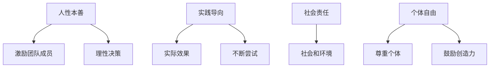

#### 10.3 领导力哲学的实际应用

以下是一些具体的领导力哲学观点在实际领导中的应用：

1. **人性本善**：在实际工作中，领导者应信任团队成员，给予他们足够的自由和空间，激发他们的积极性和创造力。例如，谷歌的“20%时间”项目就是基于这一哲学观点，鼓励员工探索自己的创意。

2. **理性决策**：领导者应避免情绪化和主观偏见，通过数据和分析做出决策。例如，丰田公司通过持续改进（Kaizen）方法，不断收集数据，分析问题，从而做出改进决策。

3. **实践导向**：领导者应注重实践和结果，不断尝试新的方法，并根据实际情况进行调整。例如，苹果公司的创始人史蒂夫·乔布斯（Steve Jobs）通过不断尝试和改进，推出了革命性的产品如iPhone和iPad。

4. **社会责任**：领导者应关注企业的社会责任，关注环境、社会和经济效益的平衡。例如，马士基集团（Maersk）通过实施绿色航运计划，减少碳排放，体现了其对社会和环境责任的关注。

5. **个体自由**：领导者应尊重团队成员的个体自由和自主性，鼓励他们在工作中发挥创造力和主动性。例如，阿瑞斯航空（Aerospace）公司通过开放的工作环境和项目制管理，让员工自主决定项目的方向和执行方式。

以下是一个简单的Mermaid流程图，展示领导力哲学的实际应用：

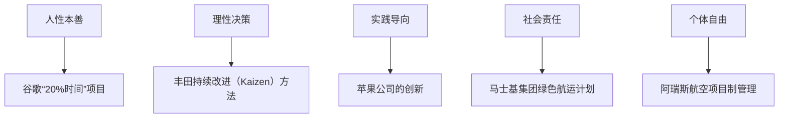

通过以上对领导力哲学的探讨，我们可以看到，哲学为领导力提供了深刻的思考和指导。领导者通过哲学思考，可以构建更加全面和深入的领导理念，从而更好地实现团队和组织的成功。在接下来的章节中，我们将探讨领导力的自我反思与修炼，帮助领导者不断提升自己的领导能力。

### 第11章 领导力的自我反思与修炼

领导力的发展不仅依赖于外部环境和支持，更需要领导者自身的持续修炼和反思。自我反思是领导力提升的重要途径，通过反思，领导者可以更深入地了解自己，识别盲点，从而实现自我提升和成长。以下将探讨自我反思的重要性、方法与技巧，以及领导力修炼的实践指南。

#### 11.1 自我反思的重要性

自我反思是领导者成长的核心环节，它有助于：

1. **认识自我**：通过反思，领导者可以深入了解自己的行为模式、思维方式和决策过程，从而更好地认识自我。
2. **发现盲点**：反思可以帮助领导者识别自身在领导力方面的盲点，如沟通障碍、决策偏见等，从而采取措施进行改进。
3. **提升决策质量**：自我反思可以帮助领导者回顾过去的决策，分析其成功和失败的原因，从而提高未来的决策质量。
4. **促进成长**：反思不仅是一种认知活动，更是一种成长过程。通过不断反思，领导者可以不断进步，实现自我超越。

#### 11.2 反思方法与技巧

以下是一些有效的自我反思方法和技巧：

1. **日记反思**：定期记录自己的想法、行为和感受，这有助于领导者系统地反思自己的领导实践。
2. **定期回顾**：每周或每月进行一次全面的回顾，包括工作表现、成功经验和失败教训，这有助于领导者长期积累反思成果。
3. **360度反馈**：收集来自团队成员、同事和上级的反馈，这可以帮助领导者从多个角度了解自己的表现。
4. **心理测评**：通过心理测评工具，如MBTI、DISC等，了解自己的性格特点和领导风格，从而进行有针对性的反思和改进。

以下是一个简单的伪代码示例，用于描述自我反思的过程：

```python
def reflective_journaling():
    # 记录日常反思
    daily_entries()

    # 定期回顾
    monthly_reviews()

    # 收集反馈
    feedback_collection()

    # 进行心理测评
    psychological_assessment()
```

#### 11.3 领导力修炼的实践指南

以下是一些实践指南，帮助领导者进行领导力修炼：

1. **建立反思习惯**：将反思作为日常习惯，确保有足够的时间和精力进行深入反思。
2. **设定反思目标**：在每次反思前设定明确的目标，例如识别特定问题或提升特定技能。
3. **与导师或教练交流**：与经验丰富的导师或教练进行交流，获取外部视角和建议。
4. **行动学习**：将反思与行动结合起来，根据反思结果采取实际行动，解决发现的问题。
5. **持续学习**：通过阅读、培训、网络学习等方式，不断学习新的知识和技能，以适应不断变化的环境。

以下是一个简单的Mermaid流程图，展示领导力修炼的实践指南：

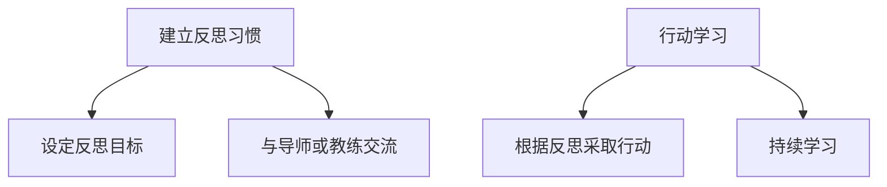

通过以上对领导力自我反思与修炼的探讨，我们可以看到，反思和修炼是领导者成长的重要环节。领导者通过持续的反思和修炼，可以不断提升自己的领导力，更好地应对挑战，实现团队和组织的成功。在接下来的章节中，我们将提供一些领导力资源与工具推荐，以帮助领导者进一步发展和提升领导力。

### 附录A 领导力资源与工具推荐

为了帮助读者进一步发展和提升领导力，以下是一些领导力资源与工具的推荐：

#### A.1 领导力书籍推荐

1. **《领导力五项修炼》（The Five Dysfunctions of a Team）** - 帕特里克·莱西奥尼（Patrick Lencioni）
   - 内容简介：本书通过讲述一个公司的故事，揭示了团队协作中的五大障碍，并提供了解决方案。

2. **《领导者之轮》（The Leader Who Had No Title）** - David Onton
   - 内容简介：本书强调无论职位高低，每个人都可以成为领导者，通过日常行动影响他人。

3. **《领导力的五个层次》（The Five Levels of Leadership）** - John C. Maxwell
   - 内容简介：本书详细介绍了领导力的五个层次，帮助领导者不断提升领导能力。

#### A.2 领导力培训与教练机构推荐

1. **国际领导力发展协会（International Leadership Association，ILA）**
   - 简介：ILA是一个全球性的专业组织，提供领导力发展资源和认证项目。

2. **领导力教练协会（International Coaching Federation，ICF）**
   - 简介：ICF是全球领先的领导力教练专业组织，提供认证培训和领导力发展服务。

3. **哈佛商学院（Harvard Business School）**
   - 简介：哈佛商学院提供一系列领导力课程和项目，涵盖从基础到高级的领导力技能。

#### A.3 领导力相关网站与资源推荐

1. **LinkedIn Learning**
   - 简介：LinkedIn Learning提供大量领导力课程和教程，适合不同层次的领导者。

2. **TED Talks**
   - 简介：TED Talks中有许多关于领导力和管理的演讲，可以启发思考并激发灵感。

3. **Harvard Business Review**
   - 简介：Harvard Business Review是一个知名的商业和管理杂志，定期发表关于领导力的文章和案例研究。

通过这些资源和工具，读者可以不断学习和实践，提升自己的领导力，实现个人和团队的成功。

### 附录B 领导力测验与评估工具

为了帮助读者更好地了解和评估自己的领导力水平，以下是一些实用的领导力测验和评估工具：

#### B.1 自我评估测验

1. **领导力自我评估问卷（Leadership Self-Assessment Questionnaire）**
   - 简介：这是一个全面的自我评估工具，包括多个维度的领导力评估，如沟通能力、决策能力和团队建设能力。

2. **我的领导风格（My Leadership Style）**
   - 简介：通过简单的问卷，帮助您了解自己的领导风格，并提供相应的提升建议。

#### B.2 团队领导力评估

1. **团队效能评估（Team Effectiveness Assessment）**
   - 简介：这是一个评估团队整体效能的工具，包括团队合作、目标设定和冲突解决等方面。

2. **360度反馈评估（360-Degree Feedback Assessment）**
   - 简介：通过收集团队成员、同事和上级的反馈，全面评估领导者的领导力表现。

#### B.3 组织领导力评估

1. **领导力成熟度模型（Leadership Maturity Model）**
   - 简介：这是一个评估组织整体领导力水平的多维度模型，包括领导力文化、领导力发展和领导力实践。

2. **组织效能评估（Organizational Effectiveness Assessment）**
   - 简介：通过评估组织的效能，识别领导力对组织绩效的影响，并提出改进建议。

通过这些测验和评估工具，读者可以更全面地了解自己的领导力水平，并根据评估结果制定相应的提升计划。

### 附录C 领导力案例解析

为了更好地理解和应用领导力法则，以下是一些实际案例的详细解析，包括苹果公司的领导力实践、谷歌的领导力文化以及其他知名企业的领导力经验。

#### C.1 案例一：苹果公司的领导力实践

苹果公司是领导力成功的一个典范。乔布斯（Steve Jobs）的领导风格和理念对苹果的成功起到了关键作用。以下是一些关键点：

1. **愿景与使命**：乔布斯非常重视公司的愿景和使命，他通过清晰的表达和不断的沟通，确保全体员工都了解并致力于实现这一愿景。

2. **创新文化**：苹果公司鼓励创新，乔布斯通过设立“蓝调工程”（Blue Sky Engineering）等机制，为员工提供时间和资源进行创新实验。

3. **简洁沟通**：乔布斯擅长简洁、有力的沟通，他通过精炼的语言和视觉化展示，使复杂的信息变得易懂，激励团队成员。

4. **激励与认可**：苹果公司通过奖励和认可制度，激励员工保持高水平的创造力和执行力。例如，乔布斯在产品发布会上的表彰环节，对做出突出贡献的员工进行公开表扬。

#### C.2 案例二：谷歌的领导力文化

谷歌以其独特的领导力文化和管理方式而闻名。以下是谷歌领导力文化的一些特点：

1. **自由与责任**：谷歌倡导自由的工作环境，鼓励员工自主选择项目和团队。同时，员工也承担相应的责任，确保项目的成功。

2. **数据驱动决策**：谷歌通过大量数据分析和反馈，支持决策过程。领导者依赖数据来评估绩效和制定策略。

3. **持续学习**：谷歌投资于员工的终身学习，提供各种培训机会和内部发展项目，帮助员工不断提升自己的技能和知识。

4. **多样性**：谷歌重视多样性，认为不同背景和观点的碰撞能够促进创新和进步。这一理念贯穿于谷歌的招聘、团队建设和领导力发展之中。

#### C.3 案例三：其他知名企业的领导力实践

除了苹果和谷歌，其他知名企业如亚马逊、微软和IBM也在领导力方面有独特的实践：

1. **亚马逊**：亚马逊的领导者杰夫·贝索斯（Jeff Bezos）倡导“顾客至上”的理念，并通过“贝佐斯原则”（Bezos Principles）确保员工始终保持对顾客的关注。

2. **微软**：微软通过其“领导力框架”（Leadership Framework）来培养和评估领导力，强调领导者应具备的七个核心技能。

3. **IBM**：IBM注重领导力的多样性和包容性，通过“领导力发展计划”（Leadership Development Program）提升员工的能力，并鼓励他们在全球范围内担任领导角色。

通过这些案例的解析，我们可以看到，不同企业根据自身特点和战略，制定了不同的领导力实践。这些实践不仅在各自企业中取得了成功，也为其他企业提供了宝贵的经验。读者可以根据这些案例，结合自身企业的实际情况，探索和应用适合的领导力方法。

### 最佳实践 tips

在打造黄金团队的过程中，以下是一些实用的最佳实践，帮助领导者更有效地提升领导力和团队绩效：

1. **倾听与反馈**：定期与团队成员进行一对一的沟通，倾听他们的意见和建议，并提供及时的反馈。这有助于建立信任和增强团队凝聚力。

2. **目标明确**：确保团队的目标具体、可衡量，并与组织的整体目标保持一致。明确的目标能够激发团队成员的积极性，提高工作效率。

3. **持续学习**：鼓励团队成员和领导者不断学习和成长。提供培训机会、阅读材料和在线课程，支持员工提升技能和知识。

4. **激励与认可**：定期对团队成员的出色表现进行奖励和认可。这不仅能够激励团队成员，还能增强团队的士气和凝聚力。

5. **透明沟通**：保持信息透明，及时向团队成员传达公司的战略、目标和进展情况。这有助于减少误解和猜测，增强团队的合作和信任。

6. **灵活调整**：面对变化，领导者应保持灵活和开放的心态，及时调整计划和策略。这有助于团队迅速应对外部环境的变化。

通过遵循这些最佳实践，领导者可以更有效地提升领导力，打造高效的团队，实现组织的目标。

### 小结

本文通过系统的分析和实例说明，深入探讨了领导力法则的核心要素和实际应用。从领导力的基本原理到实践方法，从领导力的发展与提升到在不同场景中的应用，再到领导力的自我修炼，我们全面了解了领导力的各个方面。通过具体的案例分析，我们看到了卓越的领导力是如何推动企业实现卓越绩效的。

作为领导者，掌握和应用领导力法则不仅能够提升个人领导能力，还能推动团队和组织的发展。领导者应不断学习和实践，通过自我反思和持续提升，不断完善自己的领导风格和技能。

在未来的道路上，我们鼓励领导者持续探索领导力的新方法和新理念，将领导力法则与自身实际情况相结合，不断优化领导实践。只有这样，才能在快速变化的环境中保持竞争力，带领团队和组织走向成功。

### 注意事项与拓展阅读

在应用领导力法则时，领导者应注意以下几点：

1. **文化适应性**：不同组织和企业文化各异，领导者需根据实际情况调整领导方法，确保领导力实践与组织文化相契合。

2. **个性化领导**：每个领导者都有独特的个性和背景，应根据自己的特点和优势，发展个性化的领导风格。

3. **持续学习**：领导力是一个不断发展的领域，领导者应保持学习的态度，不断吸收新知识，适应新变化。

为了进一步深化对领导力的理解，以下是一些建议的拓展阅读：

1. **《第五项修炼：学习型组织的艺术与实务》（The Fifth Discipline: The Art & Practice of The Learning Organization）** - 彼得·圣吉（Peter Senge）
   - 内容简介：本书介绍了学习型组织的概念和实践，对领导力有深刻的启示。

2. **《领导力五项修炼：从技术到艺术》（The Leadership Challenge）** - 史蒂芬·R.罗宾斯（Stephen R. Robbins）
   - 内容简介：本书详细阐述了领导力的五个关键步骤，帮助领导者提升领导能力。

3. **《变革之舞：领导与管理的差异》（The Dance of Change）** - 约翰·P.科特（John P. Kotter）
   - 内容简介：本书通过多个案例，探讨了领导者在组织变革中的角色和策略。

通过阅读这些书籍，领导者可以进一步提升自己的领导力水平，更好地应对复杂多变的商业环境。

