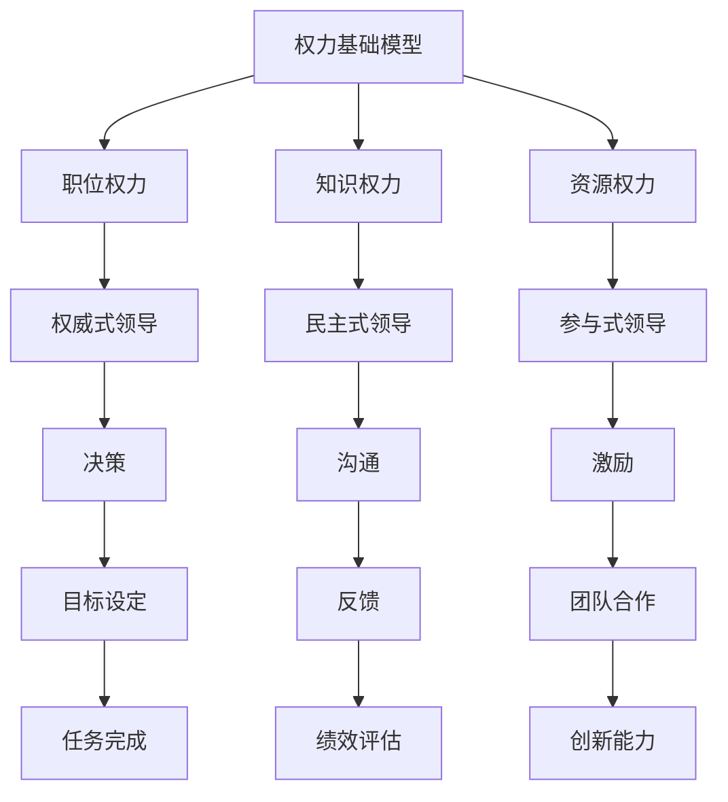
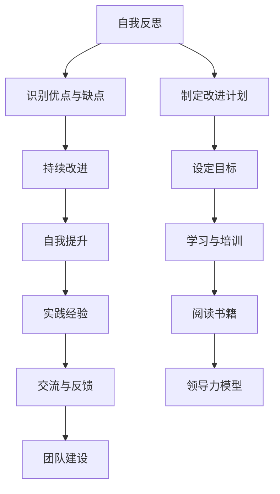
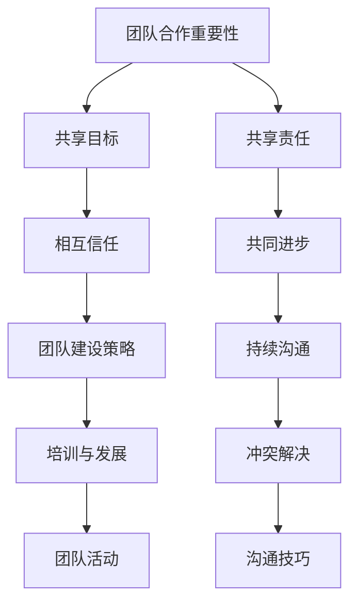
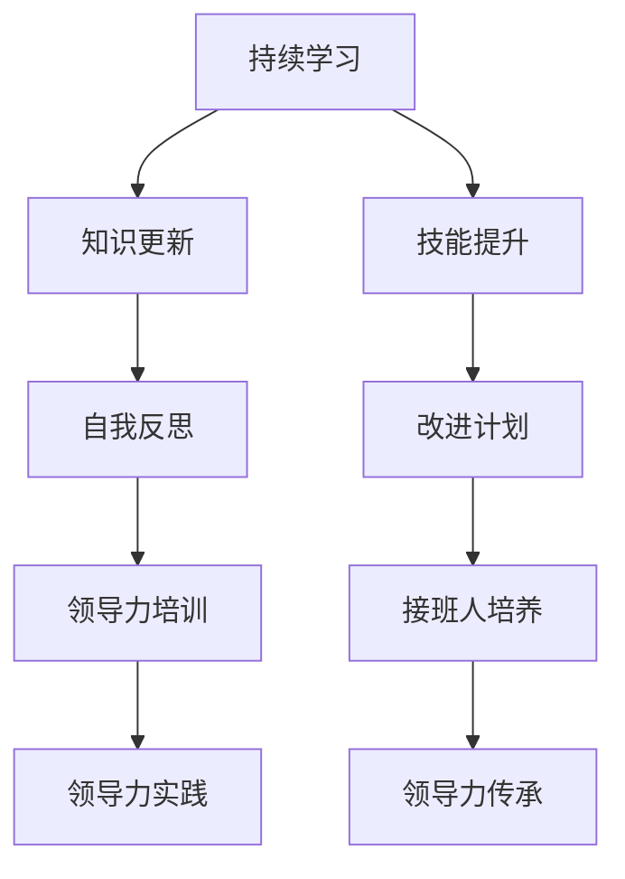
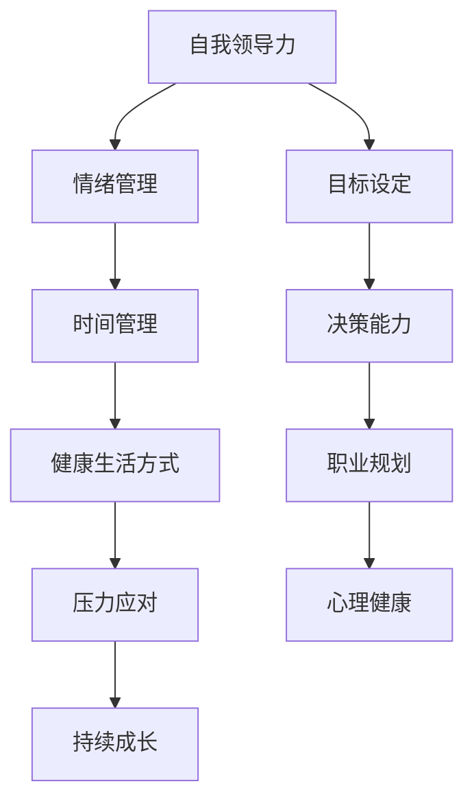

                 

### 文章标题

# 领导力法则：打造黄金团队的领导力秘诀

> 关键词：领导力、团队建设、团队沟通、自我提升、实践技巧

> 摘要：本文深入探讨了领导力在打造高效团队中的关键作用。通过对领导力基础理论的解析、领导力模型的介绍、自我认知与提升、团队建设策略以及领导力实践技巧的详细分析，本文旨在为读者提供一套系统的领导力法则，帮助他们在实际工作中更好地发挥领导力，打造黄金团队。

---

### 目录大纲

#### 第一部分：领导力基础

1. **第1章：领导力概述**
2. **第2章：领导力模型**
3. **第3章：领导者的自我认知**
4. **第4章：领导力的核心原则**
5. **第5章：团队建设**
6. **第6章：领导力发展与提升**

#### 第二部分：领导力实践

1. **第7章：领导力案例分析**
2. **第8章：领导力技巧提升**
3. **第9章：领导力在特殊情境下的应用**
4. **第10章：领导力与个人成长**

#### 附录

1. **附录A：领导力工具与方法**
2. **附录B：领导力资源推荐**

---

### 第一部分：领导力基础

#### 第1章：领导力概述

领导力是任何组织和团队成功的关键要素。在IT领域，领导力尤为重要，因为它直接影响到团队的创新能力和工作效率。那么，什么是领导力？领导力如何定义和衡量？这是本章要探讨的问题。

首先，让我们从定义入手。领导力可以被视为一种能力，它使得一个人能够在团队中激发出更大的潜力和效率。具体来说，领导力涉及以下几个方面：

- **影响力**：领导力不仅仅是对团队成员的指令和控制，更重要的是能够通过自己的行为和价值观来影响他人。
- **激励**：领导者需要能够激发团队成员的积极性，使其为实现共同目标而努力。
- **沟通**：有效的沟通是领导力的核心，领导者需要能够清晰、准确地传达信息，并倾听团队成员的意见和反馈。
- **决策**：领导者需要具备快速决策的能力，能够在复杂和不确定的环境中做出正确的决策。

接下来，我们来看一下领导力的衡量标准。虽然领导力难以量化，但我们可以通过以下几个方面来评估领导力：

- **团队绩效**：领导力最终体现在团队的整体绩效上，高效的领导者往往能够带领团队实现卓越的业绩。
- **员工满意度**：员工的满意度和忠诚度是衡量领导力的重要指标，一个优秀的领导者能够使团队成员感到被尊重和信任。
- **创新能力**：领导力有助于激发团队的创新能力，一个富有领导力的领导者能够推动团队不断进步和创新。

现在，我们已经对领导力有了初步的认识。接下来，我们将深入探讨领导力的各种模型，帮助读者更好地理解领导力的本质。

#### 第2章：领导力模型

领导力并非一成不变，而是多种多样的。不同的领导力模型适用于不同的情境和团队。以下是几种常见的领导力模型：

1. **权力基础模型**：该模型认为领导力的来源是权力，领导者通过掌握权力来影响他人。权力可以来源于多个方面，如职位、知识、资源和关系。

2. **领导风格模型**：该模型将领导力分为不同的风格，如民主式领导、权威式领导、参与式领导和教练式领导。每种领导风格都有其适用的情境和优点。

3. **领导效能模型**：该模型关注领导者的行为和结果，通过评估领导者的行为和团队绩效来衡量领导效能。典型的领导效能模型包括路径-目标理论和领导者-成员交换理论。

接下来，我们通过一个Mermaid流程图来展示这些领导力模型之间的关系：



通过这个流程图，我们可以看到不同领导力模型之间的联系和互动。例如，权力基础模型可以影响领导风格，而领导风格又会影响领导效能和团队绩效。

#### 第3章：领导者的自我认知

领导者的自我认知是领导力发展的关键。一个优秀的领导者首先需要了解自己的优点和缺点，这样才能更好地发挥自己的潜力，并带领团队走向成功。以下是领导者自我认知的几个方面：

1. **自我反思**：领导者需要定期进行自我反思，分析自己的行为和决策，了解自己的优点和需要改进的地方。

2. **自我提升**：自我认知不仅仅是了解自己，更重要的是通过学习和实践来提升自己。领导者可以通过参加培训、阅读相关书籍和与优秀领导者交流来不断进步。

3. **自我领导力培养**：领导者需要具备自我领导力，这意味着他们能够自我管理、自我激励并自我成长。

接下来，我们通过一个Mermaid流程图来展示领导者自我认知的过程：



通过这个流程图，我们可以看到领导者自我认知的过程是如何影响领导力的各个方面。

#### 第4章：领导力的核心原则

领导力的核心原则是领导者必须遵循的基本规则，它们不仅指导领导者的行为，还直接影响团队的表现。以下是几个关键的领导力原则：

1. **坦诚与透明**：领导者应该保持与团队成员之间的坦诚和透明，这有助于建立信任和良好的工作关系。

2. **目标设定**：明确的目标是团队前进的方向。领导者需要确保团队目标清晰、具体、可衡量，并激发团队成员为实现目标而努力。

3. **决策与执行力**：领导者需要具备快速决策和执行的能力，这要求领导者不仅要有远见，还要能够应对复杂和不确定的环境。

接下来，我们通过伪代码来详细阐述这些核心原则：

```python
# 坦诚与透明原则
def be_honest_and_open():
    # 与团队成员分享信息
    share_info_with_team()
    # 鼓励团队成员提出建议
    encourage_suggestions()

# 目标设定原则
def set_goals():
    # 确定具体目标
    specific_goals = define_specific_goals()
    # 设定可衡量指标
    measurable_indicators = define_measurable_indicators()
    # 激发团队成员
    motivate_team_members()

# 决策与执行力原则
def make_decisions_and_execute():
    # 快速决策
    quick_decision_making()
    # 强调执行力
    emphasize_execution()
    # 监控进度
    monitor_progress()
```

通过这些伪代码，我们可以看到如何将这些核心原则转化为具体的操作步骤。

#### 第5章：团队建设

团队建设是领导力的重要组成部分，一个高效的团队可以极大地提高组织的整体绩效。以下是一些关键的团队建设策略：

1. **团队合作的重要性**：团队合作是团队成功的关键。领导者需要认识到团队合作的价值，并鼓励团队成员积极参与。

2. **团队建设策略**：领导者可以通过多种方式来建设团队，如组织团队建设活动、提供培训和发展机会、建立有效的沟通机制等。

3. **团队沟通技巧**：有效的沟通是团队成功的基础。领导者需要具备良好的沟通技巧，包括清晰传达信息、倾听团队成员的意见和反馈等。

接下来，我们通过一个Mermaid流程图来展示团队建设的过程：



通过这个流程图，我们可以看到团队建设是如何通过多个方面来实现的。

#### 第6章：领导力发展与提升

领导力并非一成不变，它需要不断发展和提升。以下是一些关键的领导力提升策略：

1. **持续学习**：领导者需要不断学习新知识和技能，以适应快速变化的工作环境。

2. **反思与改进**：领导者需要定期进行自我反思，识别自己的不足并加以改进。

3. **培养接班人**：领导者需要培养潜在的接班人，以确保组织的持续发展。

接下来，我们通过一个Mermaid流程图来展示领导力提升的过程：



通过这个流程图，我们可以看到领导力提升是一个持续的过程。

### 第二部分：领导力实践

#### 第7章：领导力案例分析

在实际工作中，领导力的重要性往往在关键时刻得以体现。本章将分析几个真实的领导力案例，探讨成功和失败的原因，以供读者参考。

1. **成功案例：亚马逊的领导力**  
   亚马逊的创始人杰夫·贝佐斯以其独特的领导风格和远见卓识，成功地带领公司成长为全球最大的电子商务企业。他的领导力秘诀包括明确的目标设定、快速决策和执行力。贝佐斯通过设立“Day 1”文化，鼓励员工始终保持创业心态，不断挑战自我，从而推动了公司的持续创新。

2. **失败案例：福特汽车公司的领导力**  
   福特汽车公司曾因领导层的决策失误而陷入困境。特别是在20世纪80年代，福特公司未能及时调整战略，应对日本汽车制造商的挑战，导致市场份额大幅下降。这一案例表明，领导者的短视和错误决策会对企业产生深远的影响。

通过这些案例，我们可以看到领导力在关键时刻的作用。成功案例中的领导者能够预见未来趋势，并迅速做出正确决策；而失败案例中的领导者则因未能及时应对变化而遭受挫折。

#### 第8章：领导力技巧提升

提升领导力技巧是每个领导者都需要关注的重要任务。以下是一些实用的领导力技巧：

1. **情绪智能**：情绪智能是指领导者识别、理解和管理自己和他人的情绪。通过提高情绪智能，领导者可以更好地应对挑战和冲突，建立积极的工作氛围。

2. **冲突管理**：冲突在团队中是不可避免的，领导者需要掌握有效的冲突管理技巧，以解决冲突并促进团队和谐。

3. **变化管理**：在快速变化的工作环境中，领导者需要具备变化管理的能力，能够引导团队适应新的挑战和机遇。

接下来，我们通过伪代码来详细阐述这些技巧：

```python
# 情绪智能
def emotional_intelligence():
    # 识别自己的情绪
    recognize_own_emotions()
    # 理解他人的情绪
    understand_other_people_emotions()
    # 管理情绪
    manage_emotions()

# 冲突管理
def conflict_management():
    # 识别冲突
    recognize_conflicts()
    # 分析冲突原因
    analyze_conflict_reasons()
    # 解决冲突
    resolve_conflicts()

# 变化管理
def change_management():
    # 预见变化
    predict_changes()
    # 应对变化
    respond_to_changes()
    # 引导团队适应变化
    guide_team_to_adapt_changes()
```

通过这些伪代码，我们可以看到如何将领导力技巧转化为具体的行动步骤。

#### 第9章：领导力在特殊情境下的应用

在特殊情境下，领导力需要更加灵活和适应。以下是一些特殊情境下的领导力应用：

1. **应对危机**：在危机时刻，领导者需要保持冷静，迅速做出决策，并动员团队共同应对挑战。

2. **远程工作**：随着远程工作的普及，领导者需要掌握远程团队管理的技巧，确保团队成员的沟通和协作。

3. **全球化团队**：全球化团队面临的文化差异和沟通障碍，领导者需要具备跨文化领导力，促进团队成员的合作。

接下来，我们通过伪代码来详细阐述这些应用：

```python
# 应对危机
def handle_crises():
    # 保持冷静
    stay_calm()
    # 快速决策
    quick_decision_making()
    # 动员团队
    mobilize_team()

# 远程工作
def remote_work_management():
    # 确保沟通
    ensure_communication()
    # 提供支持
    provide_support()
    # 保持团队凝聚力
    maintain_team_cohesion()

# 全球化团队
def global_team_management():
    # 掌握跨文化知识
    understand_cultural_differences()
    # 促进沟通
    promote_communication()
    # 建立跨文化团队
    build_cultural_teams()
```

通过这些伪代码，我们可以看到如何在特殊情境下灵活运用领导力技巧。

#### 第10章：领导力与个人成长

领导力不仅影响团队和组织，也深刻影响着领导者的个人成长。以下是领导力与个人成长的几个方面：

1. **自我领导力与个人成长**：领导者需要通过自我领导力来管理自己的情绪、目标和行为，实现个人成长。

2. **职业生涯规划**：领导者需要规划自己的职业生涯，明确职业目标，并制定实现目标的策略。

3. **心理健康**：领导力的发展需要良好的心理健康，领导者需要关注自己的心理健康，并学会应对压力。

接下来，我们通过一个Mermaid流程图来展示领导力与个人成长的联系：



通过这个流程图，我们可以看到领导力与个人成长之间的互动和影响。

### 附录

#### 附录A：领导力工具与方法

1. **360度反馈**：360度反馈是一种评估领导者绩效的方法，通过收集来自团队成员、上级、同事和下属的意见，帮助领导者了解自己的表现和需要改进的地方。

2. **领导力评估工具**：领导力评估工具可以帮助领导者识别自己的优势和劣势，从而制定改进计划。

3. **团队评估工具**：团队评估工具可以帮助领导者了解团队的整体表现，识别团队的优势和改进点。

#### 附录B：领导力资源推荐

1. **书籍推荐**：《领导力的五个层次》、《从优秀到卓越》和《原则》是几本值得推荐的领导力书籍。

2. **课程推荐**：在线课程平台如Coursera、edX和Udemy提供了丰富的领导力课程，涵盖多个主题和领域。

3. **观点文章推荐**：多篇有关领导力的观点文章可以帮助读者深入了解领导力的各个方面，如《哈佛商业评论》和《福布斯》等知名媒体上的文章。

### 总结与反思

通过本文的探讨，我们可以看到领导力在打造黄金团队中的关键作用。从领导力基础理论的解析，到领导力模型的介绍，再到领导者的自我认知和实践技巧的提升，每一个环节都是打造高效团队不可或缺的部分。

然而，领导力并非一蹴而就，它需要持续的学习和实践。领导者需要不断反思自己的行为和决策，识别自己的不足，并积极改进。同时，领导者也需要关注团队成员的成长和发展，建立良好的团队文化，激发团队的创新能力。

在实际工作中，领导者需要灵活运用各种领导力技巧，应对不同的情境和挑战。无论是在应对危机、远程工作还是全球化团队中，领导力都发挥着至关重要的作用。

最后，本文提供了一系列领导力工具和资源，以帮助读者在领导力的发展道路上不断前行。通过持续学习和实践，每位领导者都能成为团队中的黄金领袖，带领团队走向成功。

### 作者信息

作者：AI天才研究院/AI Genius Institute & 禅与计算机程序设计艺术 /Zen And The Art of Computer Programming

感谢您阅读本文，希望本文能够为您在领导力的发展道路上提供一些启示和帮助。如果您有任何问题或建议，欢迎随时与我们联系。期待与您共同成长，打造更高效的团队！

