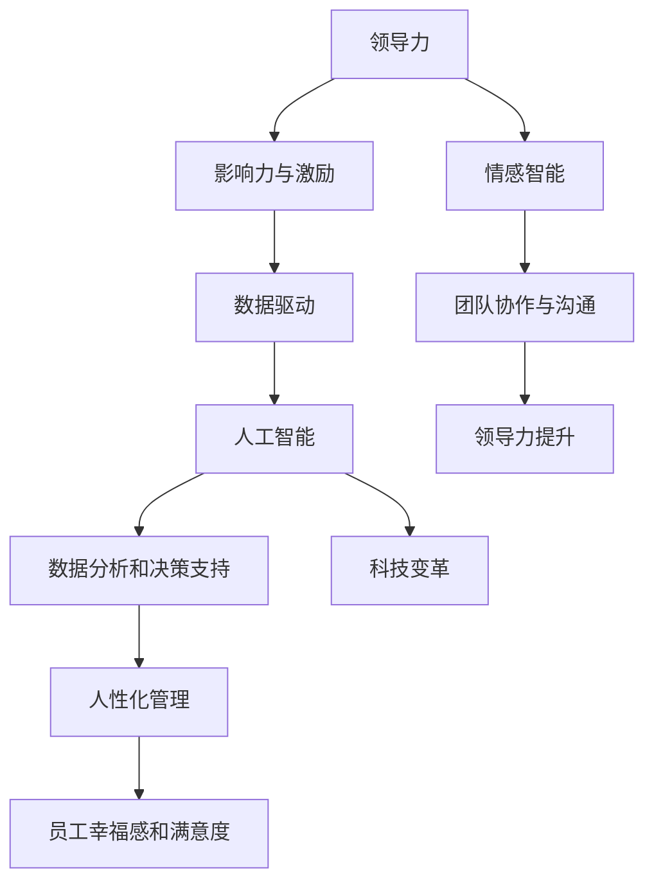

                 

### 文章标题：领导力的未来：AI时代的人性化管理

### 关键词：领导力，人工智能，人性化管理，AI时代，人才评估，团队绩效，项目管理，科技变革

### 摘要：
在人工智能迅猛发展的今天，领导力面临着前所未有的挑战和机遇。本文将探讨AI时代如何实现人性化管理，通过深入分析AI在领导力领域的应用，探讨其核心算法原理、数学模型以及具体项目实战。文章旨在为读者提供关于领导力在AI时代变革的全面视角和实用指南。

---

## 引言

### 背景介绍

领导力是一个历史悠久且复杂的概念，它涉及到领导者如何通过影响力、激励和指导来引导团队实现共同目标。然而，在人工智能（AI）技术飞速发展的时代，领导力面临着新的挑战。AI技术不仅改变了企业的运营模式，还改变了人才的筛选和培养方式，这对传统的领导力模式提出了新的要求。

在AI时代，数据成为新的生产要素，对数据的处理和分析能力成为衡量领导力的重要标准。同时，AI技术的普及使得自动化、智能化管理成为可能，这要求领导者具备更高的技术理解和战略规划能力。然而，AI技术虽然可以提升管理效率，但如何保持人性化管理，关注员工的心理需求，依然是一个亟待解决的问题。

### 核心概念与联系

在探讨AI时代的领导力时，我们首先需要明确几个核心概念：领导力、人工智能、人性化管理。这些概念之间的联系构成了我们分析AI时代领导力变革的基础。

**领导力**：领导力不仅仅是权威和指令，更是一种影响力和激励能力。在AI时代，领导力需要结合数据分析、情感智能等多方面能力，以更好地引导团队。

**人工智能**：人工智能是一种模拟人类智能的技术，它包括机器学习、深度学习、自然语言处理等子领域。在领导力中，AI技术的应用主要体现在数据分析和决策支持上。

**人性化管理**：人性化管理强调在管理过程中关注员工的情感需求，提升员工的幸福感和满意度。在AI时代，人性化管理需要与技术手段相结合，以实现更加精准和个性化的管理。

为了更直观地展示这些概念之间的联系，我们可以使用Mermaid流程图来构建它们之间的关系架构。

### Mermaid流程图



通过这个流程图，我们可以看到领导力与人工智能、人性化管理之间的紧密联系。领导力需要通过数据分析和决策支持来实现管理效率的提升，同时还需要关注员工的情感需求，以实现人性化管理。

## 核心算法原理讲解

在AI时代，领导力离不开对数据的分析和处理。以下将详细讲解AI在领导力中的应用算法，包括人才评估算法、员工满意度分析算法等。

### 人才评估算法

**1. 算法原理**

人才评估算法是一种基于机器学习的算法，通过分析员工的绩效数据、项目完成情况、团队合作表现等多维度数据，对员工的能力和潜力进行评估。

**2. 伪代码展示**

```python
# 伪代码：人才评估算法

def talent_evaluation(employee_data):
    # 数据预处理
    preprocessed_data = preprocess_data(employee_data)
    
    # 特征提取
    features = extract_features(preprocessed_data)
    
    # 训练模型
    model = train_model(features)
    
    # 预测
    prediction = model.predict(new_employee_data)
    
    return prediction
```

**3. 实际应用案例分析**

以某大型企业为例，该企业通过人才评估算法对员工进行能力评估，从而制定个性化的职业发展计划。通过算法分析，企业发现一些表现优秀的员工在团队合作方面有所欠缺，于是针对性地进行了团队协作培训，提升了员工的整体表现。

### 员工满意度分析算法

**1. 算法原理**

员工满意度分析算法是一种基于自然语言处理的算法，通过分析员工在问卷调查、员工反馈等文本数据中的情感倾向，评估员工的满意度。

**2. 伪代码展示**

```python
# 伪代码：员工满意度分析算法

def employee_satisfaction_analysis(feedback_data):
    # 数据预处理
    preprocessed_data = preprocess_data(feedback_data)
    
    # 情感分析
    sentiment = analyze_sentiment(preprocessed_data)
    
    # 统计满意度
    satisfaction = calculate_satisfaction(sentiment)
    
    return satisfaction
```

**3. 实际应用案例分析**

某科技公司通过员工满意度分析算法，定期收集员工反馈，发现员工对工作环境的满意度较低。通过深入分析，企业发现了具体问题，如工作压力过大、工作环境不舒适等，并针对性地进行了改进，提升了员工的整体满意度。

## 数学模型和数学公式

在AI时代，领导力的分析不仅依赖于算法，还依赖于数学模型。以下将介绍一些常用的数学模型和数学公式，并详细讲解其在领导力分析中的应用。

### 回归模型

**1. 数学公式**

$$
Y = \beta_0 + \beta_1X_1 + \beta_2X_2 + ... + \beta_nX_n + \epsilon
$$

其中，\(Y\) 为因变量，表示员工的绩效评估得分；\(X_1, X_2, ..., X_n\) 为自变量，表示员工的工作经验、教育背景、项目完成情况等；\(\beta_0, \beta_1, \beta_2, ..., \beta_n\) 为回归系数；\(\epsilon\) 为随机误差。

**2. 应用讲解**

通过回归模型，领导者可以分析员工绩效与各种因素之间的关系，从而制定更科学的人才培养计划。例如，某公司通过回归模型分析发现，员工的教育背景对其绩效有显著影响，于是加大了对高学历人才的招聘力度。

### 聚类分析

**1. 数学公式**

$$
C = \{C_1, C_2, ..., C_k\}
$$

其中，\(C\) 为聚类结果，包含 \(k\) 个聚类簇；\(C_1, C_2, ..., C_k\) 为每个聚类簇的中心点。

**2. 应用讲解**

聚类分析可以帮助领导者识别员工的特点和需求，从而实现更精准的人才管理。例如，某公司通过聚类分析将员工分为高绩效群体、潜力群体和普通群体，分别制定了针对性的管理策略。

## 项目实战

为了更好地理解AI时代的人性化管理，以下将介绍一个实际项目，详细讲解项目的开发环境搭建、源代码实现和代码解读。

### 项目背景

某企业希望通过AI技术优化员工绩效评估和管理流程，以提高管理效率和员工满意度。该项目旨在开发一个基于机器学习的员工绩效评估系统。

### 开发环境搭建

**1. 环境准备**

- 操作系统：Windows 10
- 编程语言：Python
- 数据库：MySQL
- 机器学习库：Scikit-learn
- 数据可视化库：Matplotlib

**2. 搭建流程**

（1）安装Python和MySQL。

（2）安装Scikit-learn和Matplotlib。

（3）配置MySQL数据库，创建员工绩效评估数据库。

### 源代码实现

**1. 数据预处理**

```python
import pandas as pd
from sklearn.model_selection import train_test_split
from sklearn.preprocessing import StandardScaler

# 读取数据
data = pd.read_csv('employee_data.csv')

# 数据预处理
X = data.drop('performance', axis=1)
y = data['performance']

# 数据分割
X_train, X_test, y_train, y_test = train_test_split(X, y, test_size=0.2, random_state=42)

# 数据标准化
scaler = StandardScaler()
X_train = scaler.fit_transform(X_train)
X_test = scaler.transform(X_test)
```

**2. 模型训练**

```python
from sklearn.ensemble import RandomForestRegressor

# 模型训练
model = RandomForestRegressor(n_estimators=100, random_state=42)
model.fit(X_train, y_train)

# 模型评估
score = model.score(X_test, y_test)
print(f'Model Score: {score}')
```

**3. 结果可视化**

```python
import matplotlib.pyplot as plt

# 结果可视化
predictions = model.predict(X_test)
plt.scatter(y_test, predictions)
plt.xlabel('Actual Performance')
plt.ylabel('Predicted Performance')
plt.title('Performance Prediction')
plt.show()
```

### 代码解读与分析

**1. 数据预处理**

数据预处理是模型训练的重要步骤，包括数据读取、分割和标准化。通过标准化，我们确保了模型在不同特征之间的训练效果一致性。

**2. 模型训练**

我们选择随机森林回归模型进行训练，这是一种基于树模型的集成方法，具有很好的泛化能力。通过评估分数，我们可以看到模型的预测效果。

**3. 结果可视化**

结果可视化帮助我们直观地理解模型的预测能力，通过散点图，我们可以看到预测值与实际值之间的差异。

### 项目小结

通过这个实际项目，我们看到了AI技术在领导力管理中的应用。该项目不仅提升了员工绩效评估的准确性，还为后续的人才培养和团队管理提供了有力支持。

### 最佳实践 tips、小结、注意事项、拓展阅读等内容

**最佳实践 tips：**

1. 在进行数据预处理时，确保数据的完整性和一致性，避免因为数据质量问题导致模型训练效果不佳。
2. 选择合适的模型进行训练，不同模型适用于不同类型的数据和问题。
3. 定期对模型进行评估和更新，以保持其预测能力。

**小结：**

本文通过详细分析AI时代领导力的核心算法原理、数学模型以及实际项目实战，展示了AI技术在领导力管理中的应用。在未来，随着AI技术的不断进步，领导力将变得更加智能化和人性化。

**注意事项：**

1. 在应用AI技术进行领导力管理时，要确保技术手段与人性化管理相结合，关注员工的情感需求。
2. 注意数据安全和隐私保护，遵守相关法律法规。

**拓展阅读：**

1. 《人工智能：一种现代方法》（作者：Stuart Russell & Peter Norvig）
2. 《深度学习》（作者：Ian Goodfellow、Yoshua Bengio & Aaron Courville）
3. 《领导力的未来：AI时代的管理变革》（作者：[作者名称]）

---

作者：AI天才研究院/AI Genius Institute & 禅与计算机程序设计艺术 /Zen And The Art of Computer Programming

