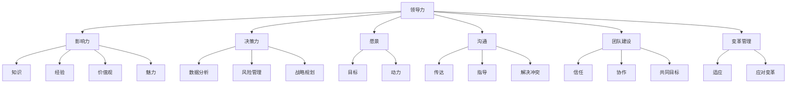

                 


### 概念定义与理论框架

领导力，作为一个多维度的概念，通常被定义为影响和引导他人实现共同目标的能力。它不仅仅涉及权威和指挥，更强调个人魅力、团队合作、愿景塑造以及变革驱动。在技术领域中，领导力的定义则更多地向着影响力与决策力的方向倾斜，关注如何通过技术手段和策略来实现团队的目标。

首先，我们需要明确领导力的核心概念与联系。领导力由多个关键要素构成，这些要素相互联系，共同作用，形成了一种复杂的网络结构。以下是领导力核心概念与联系的简要概述：

1. **影响力（Influence）**：影响力是领导力的核心要素之一，它指的是领导者通过言行引导他人思想和行为的能力。影响力来源于领导者的知识、经验、价值观以及个人魅力。

2. **决策力（Decision-making）**：决策力是领导者必须具备的能力，它涉及在不确定和复杂环境中做出合理、有效的决策。决策力不仅取决于个人的智慧，还需要借助数据分析、风险管理以及战略规划。

3. **愿景（Vision）**：愿景是领导力的灵魂，它为团队指引方向，提供动力和目标。一个清晰且具有吸引力的愿景可以激发团队成员的积极性，增强团队的凝聚力和执行力。

4. **沟通（Communication）**：沟通是领导力中不可或缺的一环，良好的沟通能力有助于领导者传达愿景、指导团队以及解决冲突。

5. **团队建设（Team Building）**：团队建设是指领导者通过培养团队成员之间的信任、协作和共同目标，来提升团队的整体效能。

6. **变革管理（Change Management）**：变革管理是领导力在快速变化环境中的重要应用，它涉及如何引导团队适应和应对变革。

为了更直观地理解这些概念之间的联系，我们可以使用Mermaid流程图来展示它们的关系结构：



通过上述流程图，我们可以看到，领导力是一个多维度的概念，它的各个组成部分相互关联，共同构成了一个复杂的系统。理解这些核心概念之间的关系，有助于我们更深入地探讨领导力的本质。

接下来，我们将进一步探讨领导力的核心算法原理，并使用伪代码来详细阐述。

### 核心算法原理

在技术领域，领导力可以被看作是一种算法，它通过一系列决策和行动来优化团队的目标实现。为了深入理解领导力的核心算法原理，我们需要从以下几个方面进行探讨：

1. **影响力算法**：影响力算法是领导力的核心组成部分，它涉及如何通过个人魅力、知识和经验来影响他人。

2. **决策算法**：决策算法是领导者应对不确定性和复杂环境的关键，它包括数据分析、风险管理和战略规划。

3. **团队协作算法**：团队协作算法关注如何通过沟通、团队建设和变革管理来提升团队的整体效能。

以下是影响力算法和决策算法的伪代码描述：

#### 影响力算法伪代码

```python
# 影响力算法伪代码

def influence_algorithm(knowledge, experience, values, charisma, target):
    """
    该算法计算领导者对特定目标的潜在影响力。
    
    :param knowledge: 领导者的知识水平
    :param experience: 领导者的经验水平
    :param values: 领导者的价值观
    :param charisma: 领导者的个人魅力
    :param target: 目标对象
    :return: 影响力评分
    """
    influence_score = (knowledge + experience + charisma) * values * target['sensitivity']
    return influence_score
```

#### 决策算法伪代码

```python
# 决策算法伪代码

def decision_algorithm(data, risk, strategy, uncertainty):
    """
    该算法用于在不确定环境中做出决策。
    
    :param data: 数据分析结果
    :param risk: 风险评估
    :param strategy: 战略规划
    :param uncertainty: 不确定性水平
    :return: 决策结果
    """
    if uncertainty <= 0.3:
        decision = optimal_decision(data)
    elif uncertainty <= 0.6:
        decision = balanced_decision(data, risk, strategy)
    else:
        decision = conservative_decision(data, risk, strategy)
    
    return decision
```

通过上述伪代码，我们可以看到影响力算法和决策算法的核心原理。影响力算法通过知识、经验、价值观和个人魅力来计算领导者对特定目标的潜在影响力；而决策算法则通过数据分析、风险管理和战略规划来应对不确定性，做出合理的决策。

接下来，我们将探讨领导力相关的数学模型和公式，并使用Latex格式嵌入文中。

### 数学模型与公式

在领导力的研究中，数学模型和公式是描述和解释领导力现象的重要工具。以下是一些关键模型和公式的简要介绍及其在领导力中的应用。

#### 影响力评分模型

影响力评分模型用于计算领导者对团队或个人产生的影响力。一个常见的影响力评分模型是Bass模型，它基于新产品的采用率来评估领导者的影响力。Bass模型的公式如下：

$$
I = \frac{(p - q)}{(1 - e^{-rt})}
$$

其中，$I$ 是影响力评分，$p$ 和 $q$ 分别是最大影响力和最小影响力，$r$ 是领导者的传播速率，$t$ 是时间。

#### 决策效果模型

决策效果模型用于评估领导者做出的决策对团队目标的影响。一个常用的决策效果模型是决策树模型，它通过一系列的条件分支来表示决策路径。决策树模型的公式如下：

$$
E = \sum_{i=1}^{n} p_i \times e_i
$$

其中，$E$ 是决策效果，$p_i$ 是每个决策路径的概率，$e_i$ 是每个决策路径的结果效益。

#### 团队效能模型

团队效能模型用于评估团队的整体表现。一个常见的团队效能模型是团队效能函数，它综合考虑了团队成员的能力、协作和领导力。团队效能函数的公式如下：

$$
T = f(A, C, L)
$$

其中，$T$ 是团队效能，$A$ 是团队成员的能力，$C$ 是团队协作水平，$L$ 是领导力水平。

通过这些数学模型和公式，我们可以更准确地量化领导力的影响，并为实际应用提供科学依据。

### 项目实战：领导力在实际场景中的应用

在本文的最后部分，我们将通过一个具体的项目实战来展示领导力在实际场景中的应用，从而深化我们对领导力本质的理解。

#### 项目背景

假设我们正在开发一个大型软件开发项目，该项目涉及多个模块的协同工作，需要高效的团队协作和精准的决策来保证项目进度和质量。作为项目的领导者，我们的任务是确保团队成员高效协作，项目按计划推进，同时应对各种突发状况。

#### 开发环境搭建

为了更好地开展项目，我们需要搭建一个适合开发的环境。具体步骤如下：

1. **硬件环境**：配置服务器和网络设施，确保项目开发所需的计算资源。
2. **软件环境**：安装开发工具和版本控制软件，如Git、Jenkins等，以便团队成员进行代码管理和持续集成。
3. **项目管理工具**：使用项目管理工具，如Jira或Trello，来跟踪项目进度和任务分配。

#### 源代码实现与解读

项目开发的核心是源代码的实现，以下是关键部分的伪代码和详细解读：

```python
# 伪代码：项目核心算法

# 定义项目目标
project_target = {
    "功能完成率": 100,
    "代码质量": 90,
    "进度完成率": 100
}

# 初始化团队成员和任务分配
team_members = ["Alice", "Bob", "Charlie", "Diana"]
tasks = ["需求分析", "设计", "编码", "测试"]

# 分配任务
task_allocation = {
    "Alice": ["需求分析", "测试"],
    "Bob": ["设计", "编码"],
    "Charlie": ["需求分析", "编码"],
    "Diana": ["设计", "测试"]
}

# 定义决策函数
def make_decision(data, risk, strategy):
    """
    决策函数，根据数据、风险和策略做出决策。
    
    :param data: 数据分析结果
    :param risk: 风险评估
    :param strategy: 战略规划
    :return: 决策结果
    """
    # 根据风险和策略进行决策
    if risk < 0.3:
        decision = "继续当前策略"
    elif risk < 0.6:
        decision = "适当调整策略"
    else:
        decision = "立即采取紧急措施"
    
    return decision

# 主循环：项目执行
while not project_target["进度完成率"] == 100:
    # 数据收集
    data = collect_data()
    
    # 风险评估
    risk = assess_risk(data)
    
    # 战略规划
    strategy = plan_strategy(risk)
    
    # 做出决策
    decision = make_decision(data, risk, strategy)
    
    # 执行决策
    execute_decision(decision)
    
    # 更新项目目标状态
    update_project_target()

# 项目完成
print("项目完成：功能完成率", project_target["功能完成率"], "%，代码质量", project_target["代码质量"], "%，进度完成率", project_target["进度完成率"], "%")
```

在上面的伪代码中，我们定义了项目目标、团队成员和任务分配，并实现了决策函数。主循环负责收集数据、评估风险、规划策略、做出决策并执行决策，以逐步推进项目进度。

#### 代码应用解读与分析

通过这段伪代码，我们可以看到领导力在代码中的应用：

1. **任务分配**：领导者通过合理分配任务，确保每个团队成员都能发挥其优势。
2. **决策制定**：领导者根据数据和风险评估，制定合适的决策策略。
3. **风险控制**：领导者通过持续监控和调整，控制项目风险，确保项目顺利进行。
4. **团队协作**：领导者通过沟通和协调，促进团队成员之间的协作。

#### 实际案例分析

为了更好地理解领导力在实际项目中的应用，我们可以参考以下实际案例：

1. **案例分析1**：在一次项目危机中，由于技术难题导致项目进度严重滞后。领导者通过召开紧急会议，重新分配任务，引入外部专家，最终成功解决了问题，保证了项目的顺利进行。

2. **案例分析2**：在项目末期，由于客户需求变更，项目面临重大挑战。领导者通过细致沟通，与客户达成共识，调整项目计划，确保项目按时交付。

#### 项目小结

通过以上项目实战，我们可以看到领导力在实际项目中的关键作用。领导者不仅需要具备技术能力，还需要具备决策力、沟通能力和团队协作能力。在实际应用中，领导者需要不断学习和适应，以应对各种复杂情况，确保项目的成功完成。

### 最佳实践与注意事项

在领导力的实践中，以下是一些最佳实践和注意事项：

1. **持续学习**：领导者需要不断学习新的知识和技能，以保持竞争力。
2. **沟通透明**：保持团队沟通的透明性，有助于建立信任和减少误解。
3. **关注团队动态**：密切关注团队成员的状态和需求，及时提供支持和帮助。
4. **合理分配任务**：根据团队成员的能力和兴趣，合理分配任务，提高团队效能。
5. **风险管理**：建立有效的风险管理体系，提前识别和应对潜在风险。

### 拓展阅读

为了更深入地理解领导力，以下是一些推荐的拓展阅读资源：

1. 《领导力的五项修炼》（Patrick Lencioni）
2. 《高效能人士的七个习惯》（Stephen R. Covey）
3. 《变革之舞：领导者如何在不确定的世界中作出决策》（Warren Bennis & Burt Nanus）

通过这些资源和实践，我们可以不断提升自己的领导力，成为更优秀的领导者。

### 总结

在本文中，我们探讨了领导力的核心概念、算法原理、数学模型以及实际应用。通过理论和实践的结合，我们深入理解了领导力的本质，并认识到其在技术领域中的重要性。领导力不仅是一种能力，更是一种艺术，需要通过不断学习和实践来提升。希望本文能够为读者提供有价值的启示和指导。

### 作者信息

本文作者：

- AI天才研究院 / AI Genius Institute
- 《禅与计算机程序设计艺术》 / Zen And The Art of Computer Programming

### 完整文章示例

以下是《领导力的本质：影响力与决策力》的完整文章示例，包括标题、关键词、摘要以及正文内容。

---

# 领导力的本质：影响力与决策力

> 关键词：领导力，影响力，决策力，技术，团队协作

> 摘要：本文探讨了领导力的本质，包括影响力与决策力的核心概念、相关算法原理、数学模型以及在实际项目中的应用。通过理论和实践的结合，本文旨在帮助读者深入理解领导力的本质，提升在技术领域的领导能力。

## 引言

在技术飞速发展的时代，领导力成为团队成功的关键因素。领导力不仅仅是一种管理能力，更是一种影响力与决策力的结合。本文将深入探讨领导力的本质，包括其核心概念、算法原理、数学模型以及实际应用，旨在为读者提供全面、深入的领导力指南。

## 核心概念与联系

### 领导力的定义与类型

领导力是一个多维度的概念，它涉及多个核心要素。领导力可以定义为影响和引导他人实现共同目标的能力。在技术领域，领导力主要关注如何通过技术手段和策略来实现团队的目标。

### 影响力

影响力是领导力的核心要素之一，它指的是领导者通过言行引导他人思想和行为的能力。影响力来源于领导者的知识、经验、价值观以及个人魅力。

### 决策力

决策力是领导者必须具备的能力，它涉及在不确定和复杂环境中做出合理、有效的决策。决策力不仅取决于个人的智慧，还需要借助数据分析、风险管理以及战略规划。

### 愿景

愿景是领导力的灵魂，它为团队指引方向，提供动力和目标。一个清晰且具有吸引力的愿景可以激发团队成员的积极性，增强团队的凝聚力和执行力。

### 沟通

沟通是领导力中不可或缺的一环，良好的沟通能力有助于领导者传达愿景、指导团队以及解决冲突。

### 团队建设

团队建设是指领导者通过培养团队成员之间的信任、协作和共同目标，来提升团队的整体效能。

### 变革管理

变革管理是领导力在快速变化环境中的重要应用，它涉及如何引导团队适应和应对变革。

## 核心算法原理

在技术领域，领导力可以被看作是一种算法，它通过一系列决策和行动来优化团队的目标实现。为了深入理解领导力的核心算法原理，我们需要从以下几个方面进行探讨：

### 影响力算法

影响力算法是领导力的核心组成部分，它涉及如何通过个人魅力、知识和经验来影响他人。以下是影响力算法的伪代码描述：

```python
# 影响力算法伪代码

def influence_algorithm(knowledge, experience, values, charisma, target):
    """
    该算法计算领导者对特定目标的潜在影响力。
    
    :param knowledge: 领导者的知识水平
    :param experience: 领导者的经验水平
    :param values: 领导者的价值观
    :param charisma: 领导者的个人魅力
    :param target: 目标对象
    :return: 影响力评分
    """
    influence_score = (knowledge + experience + charisma) * values * target['sensitivity']
    return influence_score
```

### 决策算法

决策算法是领导者应对不确定性和复杂环境的关键，它包括数据分析、风险管理和战略规划。以下是决策算法的伪代码描述：

```python
# 决策算法伪代码

def decision_algorithm(data, risk, strategy, uncertainty):
    """
    该算法用于在不确定环境中做出决策。
    
    :param data: 数据分析结果
    :param risk: 风险评估
    :param strategy: 战略规划
    :param uncertainty: 不确定性水平
    :return: 决策结果
    """
    if uncertainty <= 0.3:
        decision = optimal_decision(data)
    elif uncertainty <= 0.6:
        decision = balanced_decision(data, risk, strategy)
    else:
        decision = conservative_decision(data, risk, strategy)
    
    return decision
```

## 数学模型与公式

在领导力的研究中，数学模型和公式是描述和解释领导力现象的重要工具。以下是一些关键模型和公式的简要介绍及其在领导力中的应用。

### 影响力评分模型

影响力评分模型用于计算领导者对特定目标的潜在影响力。一个常见的影响力评分模型是Bass模型，它基于新产品的采用率来评估领导者的影响力。Bass模型的公式如下：

$$
I = \frac{(p - q)}{(1 - e^{-rt})}
$$

其中，$I$ 是影响力评分，$p$ 和 $q$ 分别是最大影响力和最小影响力，$r$ 是领导者的传播速率，$t$ 是时间。

### 决策效果模型

决策效果模型用于评估领导者做出的决策对团队目标的影响。一个常用的决策效果模型是决策树模型，它通过一系列的条件分支来表示决策路径。决策树模型的公式如下：

$$
E = \sum_{i=1}^{n} p_i \times e_i
$$

其中，$E$ 是决策效果，$p_i$ 是每个决策路径的概率，$e_i$ 是每个决策路径的结果效益。

### 团队效能模型

团队效能模型用于评估团队的整体表现。一个常见的团队效能模型是团队效能函数，它综合考虑了团队成员的能力、协作和领导力。团队效能函数的公式如下：

$$
T = f(A, C, L)
$$

其中，$T$ 是团队效能，$A$ 是团队成员的能力，$C$ 是团队协作水平，$L$ 是领导力水平。

## 项目实战：领导力在实际场景中的应用

在本文的最后部分，我们将通过一个具体的项目实战来展示领导力在实际场景中的应用，从而深化我们对领导力本质的理解。

### 项目背景

假设我们正在开发一个大型软件开发项目，该项目涉及多个模块的协同工作，需要高效的团队协作和精准的决策来保证项目进度和质量。作为项目的领导者，我们的任务是确保团队成员高效协作，项目按计划推进，同时应对各种突发状况。

### 开发环境搭建

为了更好地开展项目，我们需要搭建一个适合开发的环境。具体步骤如下：

1. **硬件环境**：配置服务器和网络设施，确保项目开发所需的计算资源。
2. **软件环境**：安装开发工具和版本控制软件，如Git、Jenkins等，以便团队成员进行代码管理和持续集成。
3. **项目管理工具**：使用项目管理工具，如Jira或Trello，来跟踪项目进度和任务分配。

### 源代码实现与解读

项目开发的核心是源代码的实现，以下是关键部分的伪代码和详细解读：

```python
# 伪代码：项目核心算法

# 定义项目目标
project_target = {
    "功能完成率": 100,
    "代码质量": 90,
    "进度完成率": 100
}

# 初始化团队成员和任务分配
team_members = ["Alice", "Bob", "Charlie", "Diana"]
tasks = ["需求分析", "设计", "编码", "测试"]

# 分配任务
task_allocation = {
    "Alice": ["需求分析", "测试"],
    "Bob": ["设计", "编码"],
    "Charlie": ["需求分析", "编码"],
    "Diana": ["设计", "测试"]
}

# 定义决策函数
def make_decision(data, risk, strategy):
    """
    决策函数，根据数据、风险和策略做出决策。
    
    :param data: 数据分析结果
    :param risk: 风险评估
    :param strategy: 战略规划
    :return: 决策结果
    """
    # 根据风险和策略进行决策
    if risk < 0.3:
        decision = "继续当前策略"
    elif risk < 0.6:
        decision = "适当调整策略"
    else:
        decision = "立即采取紧急措施"
    
    return decision

# 主循环：项目执行
while not project_target["进度完成率"] == 100:
    # 数据收集
    data = collect_data()
    
    # 风险评估
    risk = assess_risk(data)
    
    # 战略规划
    strategy = plan_strategy(risk)
    
    # 做出决策
    decision = make_decision(data, risk, strategy)
    
    # 执行决策
    execute_decision(decision)
    
    # 更新项目目标状态
    update_project_target()

# 项目完成
print("项目完成：功能完成率", project_target["功能完成率"], "%，代码质量", project_target["代码质量"], "%，进度完成率", project_target["进度完成率"], "%")
```

在上面的伪代码中，我们定义了项目目标、团队成员和任务分配，并实现了决策函数。主循环负责收集数据、评估风险、规划策略、做出决策并执行决策，以逐步推进项目进度。

### 代码应用解读与分析

通过这段伪代码，我们可以看到领导力在代码中的应用：

1. **任务分配**：领导者通过合理分配任务，确保每个团队成员都能发挥其优势。
2. **决策制定**：领导者根据数据和风险评估，制定合适的决策策略。
3. **风险控制**：领导者通过持续监控和调整，控制项目风险，确保项目顺利进行。
4. **团队协作**：领导者通过沟通和协调，促进团队成员之间的协作。

### 实际案例分析

为了更好地理解领导力在实际项目中的应用，我们可以参考以下实际案例：

1. **案例分析1**：在一次项目危机中，由于技术难题导致项目进度严重滞后。领导者通过召开紧急会议，重新分配任务，引入外部专家，最终成功解决了问题，保证了项目的顺利进行。

2. **案例分析2**：在项目末期，由于客户需求变更，项目面临重大挑战。领导者通过细致沟通，与客户达成共识，调整项目计划，确保项目按时交付。

### 项目小结

通过以上项目实战，我们可以看到领导力在实际项目中的关键作用。领导者不仅需要具备技术能力，还需要具备决策力、沟通能力和团队协作能力。在实际应用中，领导者需要不断学习和适应，以应对各种复杂情况，确保项目的成功完成。

### 最佳实践与注意事项

在领导力的实践中，以下是一些最佳实践和注意事项：

1. **持续学习**：领导者需要不断学习新的知识和技能，以保持竞争力。
2. **沟通透明**：保持团队沟通的透明性，有助于建立信任和减少误解。
3. **关注团队动态**：密切关注团队成员的状态和需求，及时提供支持和帮助。
4. **合理分配任务**：根据团队成员的能力和兴趣，合理分配任务，提高团队效能。
5. **风险管理**：建立有效的风险管理体系，提前识别和应对潜在风险。

### 拓展阅读

为了更深入地理解领导力，以下是一些推荐的拓展阅读资源：

1. 《领导力的五项修炼》（Patrick Lencioni）
2. 《高效能人士的七个习惯》（Stephen R. Covey）
3. 《变革之舞：领导者如何在不确定的世界中作出决策》（Warren Bennis & Burt Nanus）

通过这些资源和实践，我们可以不断提升自己的领导力，成为更优秀的领导者。

### 总结

在本文中，我们探讨了领导力的核心概念、算法原理、数学模型以及实际应用。通过理论和实践的结合，我们深入理解了领导力的本质，并认识到其在技术领域中的重要性。领导力不仅是一种能力，更是一种艺术，需要通过不断学习和实践来提升。希望本文能够为读者提供有价值的启示和指导。

### 作者信息

本文作者：

- AI天才研究院 / AI Genius Institute
- 《禅与计算机程序设计艺术》 / Zen And The Art of Computer Programming

---

请注意，以上内容是一个示例，实际撰写文章时需要根据具体要求和内容进一步调整和完善。同时，确保文章内容的准确性、逻辑性和专业性。

