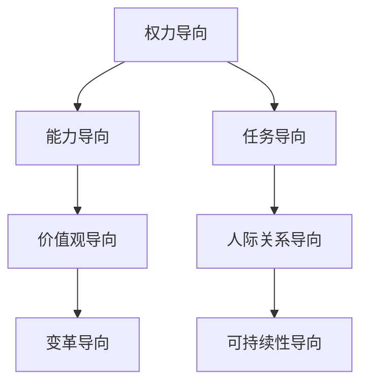
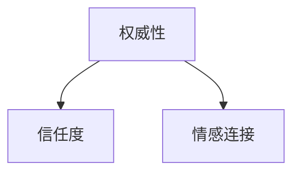
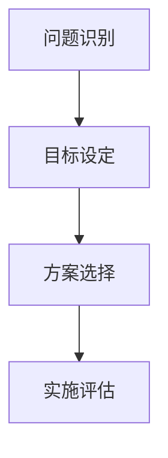

                 

为了撰写一篇符合要求的《领导力的本质：影响力与决策力的完美结合》技术博客文章，我们将按照以下步骤进行：

### 1. 确定文章结构和核心内容

#### 标题：《领导力的本质：影响力与决策力的完美结合》

#### 关键词：领导力、影响力、决策力、组织管理、团队协作

#### 摘要：
本文深入探讨了领导力的本质，以及影响力与决策力的关系。通过分析领导力的发展路径、影响力在组织中的应用，以及决策力的基本原理，我们旨在提供一个全方位的视角，以理解领导力的核心要素和其在现代组织中的重要性。

### 2. 撰写引言

**引言**

在快节奏、高度竞争的商业环境中，领导力已成为组织成功的关键因素。领导力不仅仅是管理技能的体现，更是影响力与决策力的完美结合。本文将首先介绍领导力的定义和演变，接着探讨影响力与决策力的构成要素及其在组织中的应用，最后分析领导力在组织变革和创新中的角色。通过这些探讨，我们将揭示领导力的本质，并展望其未来发展。

### 3. 领导力的本质

#### 3.1 领导力的定义和演变

**定义：** 领导力是指个人或集体在特定环境中，通过影响和激励他人，实现共同目标和价值的能力。

**演变：** 领导力的概念经历了从权力导向到能力导向的转变。现代领导力更注重人际关系、共同价值和长期目标。

**Mermaid流程图：领导力的发展演变**

### 4. 影响力的构成要素

#### 4.1 影响力的基础理论

**基础理论：** 影响力源于个人特质、知识和技能，以及与他人的关系。

**构成要素：**

- **权威性：** 基于职位或专业知识的权力。
- **信任度：** 建立在信任和尊重的基础上。
- **情感连接：** 通过情感共鸣建立的联系。

**Mermaid流程图：影响力的构成要素**

### 5. 决策力的基本原理

#### 5.1 决策模型

**决策模型：** 决策过程包括问题识别、目标设定、方案选择和实施评估。

**Mermaid流程图：决策模型**

#### 5.2 决策工具与方法

**工具与方法：**

- **数据分析：** 使用数据分析工具（如统计软件）辅助决策。
- **决策树：** 通过决策树分析决策路径和结果。
- **博弈论：** 应用博弈论原理分析多边决策。

### 6. 领导力与影响力的实践

#### 6.1 领导力培养

**培养路径：**

- **从个体到团队：** 培养个人的领导力，进而扩展到团队管理。
- **从管理到领导：** 理解管理的职责，并将其扩展到领导力层面。

**培养策略：**

- **持续学习：** 领导力需要不断学习和适应新的环境。
- **反思与改进：** 通过反思和反馈来不断优化领导技能。

#### 6.2 影响力的应用场景

**应用场景：**

- **组织中的影响力策略：** 如何在组织内部建立影响力。
- **个人影响力提升的方法：** 提升个人影响力的技巧。

### 7. 决策力与领导力的协同

#### 7.1 协同机制

**协同机制：**

- **领导力与决策力协同的重要性：** 如何在领导力中融入决策力。
- **协同模型的构建：** 构建一个有效的领导决策模型。

#### 7.2 实践案例分析

**案例分析：**

- **成功案例的解析：** 分析成功的领导决策案例。
- **失败案例的反思：** 探讨领导决策中的常见错误。

### 8. 领导力在组织中的应用

#### 8.1 组织文化与领导力

**关系：**

- **组织文化与领导力的关系：** 如何通过领导力塑造组织文化。
- **建立有效的组织文化：** 实践方法和案例分析。

#### 8.2 领导力的变革与创新

**变革与创新：**

- **创新型领导力的特征：** 如何成为具有创新意识的领导者。
- **变革中的领导力策略：** 领导力在组织变革中的作用。

### 9. 领导力发展趋势

#### 9.1 现代领导力的发展方向

**方向：**

- **数字化领导力：** 如何适应数字化时代的领导需求。
- **跨文化领导力：** 如何在全球化背景下进行领导。

#### 9.2 未来领导力的展望

**展望：**

- **领导力教育的变革：** 领导力培养的新趋势。
- **领导力在可持续发展中的作用：** 领导力如何促进可持续发展。

### 10. 总结与展望

**总结：**

- **领导力的核心要素：** 对领导力核心要素的总结。
- **领导力在个人和组织中的作用：** 领导力的实际影响。

**展望：**

- **未来领导力的挑战与机遇：** 领导力在未来可能面临的挑战和机遇。
- **领导力培养的新方法：** 探索未来领导力培养的新途径。

### 11. 结尾

**作者信息：**

- **作者：AI天才研究院/AI Genius Institute & 禅与计算机程序设计艺术 /Zen And The Art of Computer Programming**

在完成上述步骤后，我们将对文章进行逐段撰写，确保每个部分内容丰富、逻辑清晰。在撰写过程中，我们会遵循markdown格式，并在适当位置嵌入Mermaid流程图和LaTeX公式。最终，我们将确保文章字数在8000-12000字左右，完成一篇高质量的技术博客文章。

