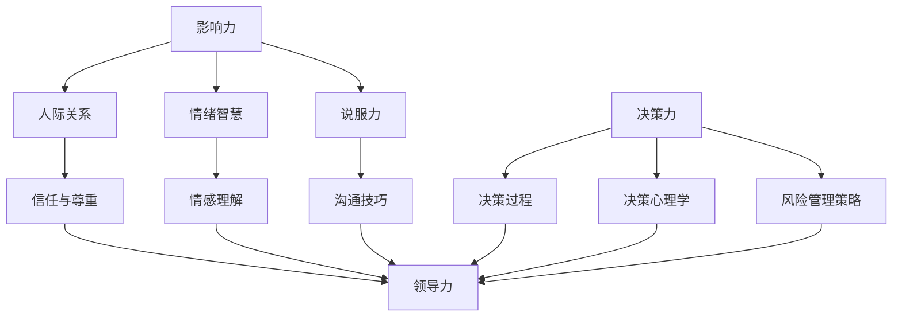
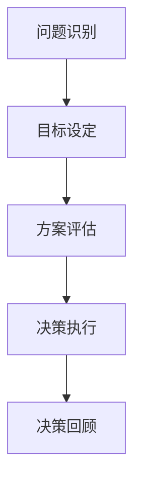
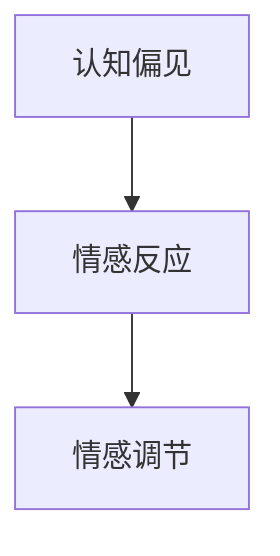
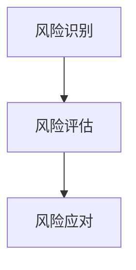

                 

### 文章标题：领导力的本质：影响力与决策力的结合

#### 关键词：
- 领导力
- 影响力
- 决策力
- 数学模型
- Mermaid流程图
- 项目实战

#### 摘要：
本文深入探讨领导力的本质，聚焦于影响力与决策力的结合。通过分析领导力的核心概念、影响力和决策力的基本原理，以及二者之间的相互作用，本文旨在揭示领导力的实际应用和未来发展。通过Mermaid流程图和伪代码，我们展现了领导力模型的结构和算法原理，并通过实际项目案例，为读者提供了实践中的洞察和策略。文章还探讨了未来领导力的趋势，为读者提供了宝贵的指导和建议。

---

### 目录

#### 1. 引言

##### 1.1 领导力的定义与重要性
##### 1.2 本书的目的与结构
##### 1.3 预期读者

#### 2. 领导力的核心概念与联系

##### 2.1 影响力的本质
##### 2.2 决策力的基础
##### 2.3 领导力模型的Mermaid流程图

#### 3. 影响力：原理与策略

##### 3.1 人际关系与影响力
##### 3.2 情绪智慧与影响力
##### 3.3 说服力的技巧
##### 3.4 案例分析：如何提升影响力

#### 4. 决策力：原理与策略

##### 4.1 决策过程与模型
##### 4.2 决策心理学
##### 4.3 风险管理策略
##### 4.4 案例分析：如何做出明智的决策

#### 5. 影响力与决策力的结合

##### 5.1 综合应用
##### 5.2 融合策略
##### 5.3 挑战与解决方案

#### 6. 领导力实践

##### 6.1 培养领导力的步骤
##### 6.2 个人成长计划
##### 6.3 领导力发展的持续过程

#### 7. 未来领导力的趋势与展望

##### 7.1 数字化转型与领导力
##### 7.2 社会责任与领导力
##### 7.3 全球化背景下的领导力
##### 7.4 未来领导力的发展趋势

#### 附录

##### A.1 参考文献
##### A.2 资源链接

---

### 1. 引言

领导力是组织中至关重要的要素，它影响着团队的效率、创新能力和整体绩效。然而，领导力的本质是什么？它如何在不同情境下发挥作用？本文旨在回答这些问题，深入探讨领导力的本质，特别是影响力与决策力的结合。

首先，领导力不仅仅是一种职位或角色的象征，它更是一种影响力。影响力是领导力的核心，它关乎如何激发他人的潜力和行动力，以实现共同的目标。影响力不仅仅依赖于权威或权力，它更多的是建立在对人际关系的理解、情绪智慧和说服力的掌握上。

另一方面，决策力是领导力的另一个关键组成部分。决策力关乎如何在面对复杂和不确定的情况时，做出明智且有效的决策。决策力不仅需要逻辑思维和数据分析能力，还需要心理学洞察力和风险管理策略。

在本文中，我们将通过以下步骤来探讨领导力的本质：

1. **定义领导力**：介绍领导力的基本概念和重要性。
2. **分析影响力与决策力的关系**：通过Mermaid流程图展示领导力模型的结构，并使用伪代码阐述核心算法原理。
3. **探讨影响力的原理与策略**：分析人际关系、情绪智慧、说服力等对影响力的影响。
4. **探讨决策力的原理与策略**：介绍决策过程、决策心理学和风险管理策略。
5. **结合影响力与决策力**：探讨二者如何在实际应用中相互结合，以及面临的挑战和解决方案。
6. **领导力实践**：提供培养领导力的步骤、个人成长计划和实践过程中的持续发展。
7. **未来领导力的趋势与展望**：探讨数字化、社会责任和全球化对领导力的影响，以及未来领导力的发展趋势。

通过以上步骤，我们旨在为读者提供一个全面、深入且具有实践价值的领导力分析框架。

---

### 2. 领导力的核心概念与联系

在探讨领导力的本质之前，我们需要了解其核心概念和它们之间的联系。在本节中，我们将深入分析影响力和决策力的本质，并使用Mermaid流程图展示它们在领导力模型中的相互作用。

#### 2.1 影响力的本质

影响力是领导力的核心组成部分，它涉及到如何激发他人的潜力和行动力，以实现共同的目标。影响力不仅仅依赖于权威或权力，它更多的是建立在对人际关系的理解、情绪智慧和说服力的掌握上。

- **人际关系**：建立良好的人际关系是影响力的基础。理解他人的需求和动机，以及如何建立互信和尊重的关系，是提升影响力的关键。
- **情绪智慧**：情绪智慧涉及识别和调节自己和他人的情绪。一个具有情绪智慧的人能够更好地理解和影响他人的情绪，从而在领导中取得优势。
- **说服力**：说服力是影响力的重要表现。通过有效的沟通和谈判技巧，领导者可以引导团队成员接受并支持其决策和目标。

#### 2.2 决策力的基础

决策力是领导力的另一个关键组成部分，它关乎如何在面对复杂和不确定的情况时，做出明智且有效的决策。决策力不仅需要逻辑思维和数据分析能力，还需要心理学洞察力和风险管理策略。

- **决策过程**：决策过程包括问题识别、目标设定、方案评估和决策执行。每个步骤都需要仔细思考和周密计划。
- **决策心理学**：决策心理学关注决策者的心理过程和决策结果之间的关系。了解决策者的认知偏见和情感反应，可以帮助领导者做出更加理性的决策。
- **风险管理策略**：风险管理策略涉及如何识别、评估和应对潜在的风险。有效的风险管理可以帮助领导者降低决策的不确定性，提高决策的成功率。

#### 2.3 领导力模型的Mermaid流程图

为了更好地理解影响力和决策力在领导力模型中的相互作用，我们使用Mermaid流程图来展示它们的核心概念和关系。

在上面的Mermaid流程图中，我们可以看到影响力通过人际关系、情绪智慧和说服力与领导力相连，而决策力则通过决策过程、决策心理学和风险管理策略与领导力相连。这两个维度相互作用，共同构成了领导力的本质。

通过这个流程图，我们可以更清晰地看到领导力模型的各个组成部分及其相互关系。这为我们进一步探讨领导力的原理和策略提供了坚实的基础。

---

### 3. 影响力：原理与策略

影响力是领导力的核心组成部分，它关乎如何激发他人的潜力和行动力，以实现共同的目标。在本节中，我们将深入探讨影响力的原理和策略，包括人际关系、情绪智慧和说服力。

#### 3.1 人际关系与影响力

建立良好的人际关系是影响力的基础。人际关系不仅仅是一种社交技巧，它涉及到对人际互动的深入理解。以下是一些关键点：

- **信任与尊重**：信任是人际关系中的基石。一个领导者需要通过言行一致、诚实守信来建立信任。尊重他人则是展现同理心和接纳他人观点的重要方式。

- **沟通技巧**：有效的沟通是建立人际关系的核心。领导者需要倾听他人的意见和需求，并通过清晰、明确的表达来确保信息的传达。

- **共同目标**：建立共同目标是增强人际关系的重要手段。当团队成员共同追求一个明确的目标时，他们之间的联系会更加紧密，这有助于提升整体绩效。

#### 3.2 情绪智慧与影响力

情绪智慧是影响力的另一个关键因素。情绪智慧涉及识别和调节自己和他人的情绪。以下是一些关键点：

- **情感理解**：领导者需要能够识别和理解他人的情绪，以便在适当的时候提供支持或调整策略。

- **情感调节**：领导者需要学会调节自己的情绪，以保持冷静和专注。这种自我调节能力有助于在面对压力和挑战时保持理性。

- **情感共鸣**：通过情感共鸣，领导者可以更好地与团队成员建立情感联系，增强团队凝聚力。

#### 3.3 说服力的技巧

说服力是影响力的关键表现。以下是一些提升说服力的技巧：

- **事实与逻辑**：在说服他人时，领导者需要提供有力的证据和逻辑推理，以确保观点的可信度。

- **情感诉求**：除了逻辑和事实，领导者还可以通过情感诉求来增强说服力。情感诉求可以通过讲述故事、分享经验或展示同理心来实现。

- **倾听与回应**：有效的倾听是说服他人的第一步。领导者需要认真倾听他人的意见和需求，并在回应时展示出对对方的尊重和关注。

#### 3.4 案例分析：如何提升影响力

以下是一个案例分析，展示如何通过人际关系、情绪智慧和说服力来提升影响力：

**案例背景**：一位项目经理（PM）需要在团队中推动一个重要的项目，但团队成员对项目的目标和方法存在疑虑。

**解决方案**：

1. **建立人际关系**：PM首先与团队成员进行一对一的沟通，了解他们的担忧和期望。通过这种个人化的接触，PM建立了信任和尊重。

2. **运用情绪智慧**：PM识别到团队成员的疑虑主要源于对项目不确定性的担忧。PM通过情感共鸣，表达了自己对项目成功的期望，并分享了自己在类似项目中的成功经验。

3. **提升说服力**：PM使用事实和逻辑来解释项目的目标和方法，同时通过情感诉求，讲述项目对公司的重要性。PM还邀请团队成员提供意见和建议，以增强他们的参与感和责任感。

**结果**：通过上述策略，PM成功地提升了自己的影响力，团队成员对项目的认可度显著提高，项目进展顺利。

通过这个案例，我们可以看到，人际关系、情绪智慧和说服力是提升影响力的关键要素。领导者需要综合运用这些要素，以实现组织目标。

---

### 4. 决策力：原理与策略

决策力是领导力的另一个关键组成部分，它关乎如何在面对复杂和不确定的情况时，做出明智且有效的决策。在本节中，我们将深入探讨决策力的原理和策略，包括决策过程、决策心理学和风险管理策略。

#### 4.1 决策过程与模型

决策过程是决策力的重要组成部分。一个完整的决策过程通常包括以下步骤：

1. **问题识别**：首先，领导者需要识别出需要解决的问题或机会。这通常涉及到数据收集、分析和理解。

2. **目标设定**：在明确问题后，领导者需要设定清晰的目标。目标应具体、可衡量、可实现、相关性强和时限明确（SMART原则）。

3. **方案评估**：接下来，领导者需要列出各种可能的解决方案，并评估它们的优缺点、成本和潜在风险。

4. **决策执行**：在评估方案后，领导者需要选择最佳的方案并付诸实施。执行过程中，领导者需要监督进度、调整策略和应对可能出现的问题。

5. **决策回顾**：最后，领导者需要对决策结果进行回顾，以评估决策的有效性和改进未来决策。

以下是一个简化的决策模型：

#### 4.2 决策心理学

决策心理学研究决策者在决策过程中的心理过程和情感反应。以下是一些关键的决策心理学概念：

1. **认知偏见**：认知偏见是指决策者在决策过程中可能出现的思维错误。例如，锚定效应、代表性偏见、确认偏见等。

2. **情感反应**：情感反应在决策中起着重要作用。正面情感可以提高决策者的信心和决策效率，而负面情感则可能导致过度谨慎或风险回避。

3. **情感调节**：情感调节是指决策者如何识别和调节自己的情感，以保持冷静和理性的决策过程。

以下是一个决策心理学流程图：

#### 4.3 风险管理策略

风险管理策略是决策力的重要组成部分，它涉及识别、评估和应对潜在的风险。以下是一些常见的风险管理策略：

1. **风险识别**：首先，领导者需要识别出可能影响决策实施的风险。这可以通过SWOT分析、专家访谈、历史数据分析等方法实现。

2. **风险评估**：在识别风险后，领导者需要评估每个风险的严重程度和发生概率。这有助于确定哪些风险需要重点关注。

3. **风险应对**：根据风险评估的结果，领导者需要制定相应的风险应对策略。常见的应对策略包括风险规避、风险转移、风险接受和风险缓解。

以下是一个风险管理策略流程图：

#### 4.4 案例分析：如何做出明智的决策

以下是一个案例分析，展示如何在实践中运用决策过程、决策心理学和风险管理策略来做出明智的决策：

**案例背景**：一家公司在推出新产品时需要做出多个关键决策，包括市场定位、产品设计、营销策略等。

**解决方案**：

1. **决策过程**：
   - **问题识别**：公司需要明确新产品的市场定位和目标客户群体。
   - **目标设定**：设定明确的产品目标，如市场份额、利润率和客户满意度。
   - **方案评估**：列出多个市场定位和产品设计的方案，并评估它们的成本和潜在收益。
   - **决策执行**：选择最佳的方案，并开始实施市场调研和产品开发。

2. **决策心理学**：
   - **认知偏见**：识别并避免认知偏见，如过度依赖历史数据或盲目跟随市场趋势。
   - **情感调节**：保持冷静和理性，避免情绪影响决策。

3. **风险管理策略**：
   - **风险识别**：识别可能的市场风险，如竞争压力和客户接受度。
   - **风险评估**：评估每个风险的严重程度和发生概率。
   - **风险应对**：制定风险应对策略，如增加市场调研预算或调整产品设计。

**结果**：通过上述策略，公司成功推出了新产品，并取得了预期的市场份额和利润率。

通过这个案例，我们可以看到，决策过程、决策心理学和风险管理策略在实践中的重要性。领导者需要综合运用这些策略，以提高决策的准确性和有效性。

---

### 5. 影响力与决策力的结合

影响力与决策力是领导力的两个核心维度，它们在实际应用中相互结合，共同推动组织的成功。在本节中，我们将探讨如何将影响力与决策力结合起来，提高领导力和组织绩效。

#### 5.1 综合应用

将影响力与决策力结合起来，领导者需要采取以下综合应用策略：

1. **建立信任**：通过建立良好的人际关系和信任，领导者可以增强团队成员的参与感和责任感。这种信任是决策过程的基础，有助于提高决策的接受度和执行力。

2. **情感智慧**：领导者需要具备情感智慧，以识别和调节团队成员的情绪。这有助于在决策过程中保持团队的积极性和凝聚力，减少冲突和误解。

3. **透明沟通**：领导者需要保持沟通的透明性，确保团队成员了解决策的背景、目标和原因。这有助于增强团队成员的参与感和信任感，提高决策的执行效率。

4. **数据驱动**：领导者应依靠数据和分析来支持决策，减少主观偏见和情感的影响。数据驱动的决策有助于提高决策的科学性和准确性。

5. **灵活调整**：领导者需要根据实际情况灵活调整决策，以应对不确定性和变化。这种灵活性有助于提高决策的适应性和有效性。

#### 5.2 融合策略

将影响力与决策力融合的具体策略包括：

1. **目标导向**：领导者需要设定明确的目标，并通过影响力策略来激发团队成员的动力和积极性。决策过程中，领导者应确保目标与组织的战略和价值观一致。

2. **共识建立**：通过影响力策略，领导者可以促进团队成员之间的共识和合作。决策过程中，领导者应鼓励团队成员参与讨论和提出建议，以提高决策的全面性和准确性。

3. **情感共鸣**：领导者应运用情感智慧，与团队成员建立情感共鸣。在决策过程中，领导者可以通过情感共鸣来增强团队成员的参与感和责任感。

4. **风险管理**：领导者需要运用决策力策略，识别和评估潜在的风险，并制定相应的应对措施。影响力策略可以用于增强团队成员的风险意识和应对能力。

5. **持续反馈**：领导者应建立持续的反馈机制，以确保决策的有效性和团队的合作。影响力策略可以用于鼓励团队成员提供反馈，并促进团队改进和成长。

#### 5.3 挑战与解决方案

在实际应用中，将影响力与决策力结合可能面临以下挑战：

1. **冲突与分歧**：团队成员之间的冲突和分歧可能会影响决策的顺利进行。解决方案是建立开放的沟通渠道，鼓励团队成员表达观点，并通过影响力策略来促进共识。

2. **权力不平衡**：领导者需要平衡权力和影响力，避免权力滥用和决策偏颇。解决方案是建立透明的决策过程，确保团队成员在决策中拥有平等的话语权。

3. **时间压力**：在时间紧迫的情况下，领导者可能难以充分考虑各种因素和选择最佳方案。解决方案是提前规划，预留时间用于决策和讨论，以及利用影响力策略来提高团队的协作效率。

通过以上挑战与解决方案，领导者可以更好地将影响力与决策力结合起来，提高领导力和组织绩效。

---

### 6. 领导力实践

领导力不仅仅是理论知识，更需要通过实践来验证和发展。在本节中，我们将探讨如何通过培养领导力、制定个人成长计划和实践中的持续发展，来提高领导力水平。

#### 6.1 培养领导力的步骤

培养领导力是一个长期的过程，需要持续的努力和实践。以下是一些关键步骤：

1. **自我认知**：首先，领导者需要了解自己的优势和劣势。这可以通过自我反思、接受反馈和进行心理测评来实现。

2. **知识积累**：领导者需要不断学习和积累知识，包括管理知识、业务知识和行业知识。这可以通过阅读、培训和学习新技能来实现。

3. **实践锻炼**：理论知识需要通过实践来验证。领导者应积极参与各种项目，从实践中学习和成长。

4. **团队建设**：领导者需要建立和维护一个高效的团队。这包括招募合适的团队成员、提供培训和发展机会，以及促进团队之间的合作和沟通。

5. **反馈与改进**：领导者应定期接受反馈，并根据反馈进行改进。这有助于不断提高领导力水平。

#### 6.2 个人成长计划

制定个人成长计划是培养领导力的关键。以下是一些制定个人成长计划的步骤：

1. **设定目标**：明确自己的短期和长期目标，包括职业发展、技能提升和领导力发展。

2. **制定策略**：为实现目标，制定具体的策略和计划。这包括学习新技能、参与项目、接受培训和寻求导师指导。

3. **实施计划**：按照计划执行，并定期检查进度。如果遇到困难，及时调整策略。

4. **持续反馈**：定期接受反馈，并根据反馈进行改进。这有助于不断提高个人成长计划的实施效果。

#### 6.3 领导力发展的持续过程

领导力发展是一个持续的过程，需要不断的学习和改进。以下是一些持续领导力发展的建议：

1. **不断学习**：领导者应保持学习的热情，不断学习新知识、新技能和新技术。

2. **积极反思**：定期进行自我反思，评估自己的领导力表现和改进空间。

3. **寻求反馈**：积极寻求来自团队成员、同事和领导的反馈，以便了解自己的优势和不足。

4. **实践应用**：将学到的知识和技能应用到实际工作中，通过实践来验证和提升领导力。

5. **持续改进**：根据反馈和实际应用情况，不断调整和改进自己的领导力策略。

通过以上实践，领导者可以不断提高自己的领导力水平，为组织的发展和成功做出更大的贡献。

---

### 7. 未来领导力的趋势与展望

随着全球化和数字化的发展，领导力也在不断演变。未来领导力将面临新的挑战和机遇。以下是一些未来领导力的趋势与展望：

#### 7.1 数字化转型与领导力

数字化转型正在改变组织的运营方式和领导者的角色。领导者需要具备以下能力：

1. **数字化素养**：了解数字技术和数字化业务模式，并能够将其应用到组织中。

2. **数据驱动决策**：利用数据分析来支持决策，提高决策的准确性和效率。

3. **数字化领导**：激发团队成员的数字化潜能，推动数字化创新。

#### 7.2 社会责任与领导力

社会责任已经成为领导力的重要组成部分。未来领导者需要：

1. **可持续发展**：推动组织的可持续发展，包括环境、社会和经济方面。

2. **企业伦理**：坚持企业伦理，确保组织的运营符合道德和法律标准。

3. **社会参与**：积极参与社会公益活动，提升企业的社会形象。

#### 7.3 全球化背景下的领导力

全球化使得领导者需要面对多元文化和多国别团队。领导者需要：

1. **文化敏感度**：了解不同文化的差异和共性，以促进跨文化沟通和协作。

2. **全球视野**：具备全球视野，能够从全球范围内思考和解决问题。

3. **国际化领导**：培养国际化团队，提升全球竞争力。

#### 7.4 未来领导力的发展趋势

未来领导力将呈现出以下趋势：

1. **智能化领导**：利用人工智能和机器学习来辅助决策和提升效率。

2. **网络化领导**：通过社交网络和数字化平台来促进团队协作和沟通。

3. **个性化领导**：关注团队成员的个性化需求，提供定制化的领导和支持。

4. **持续学习领导**：鼓励团队成员持续学习和成长，推动组织创新和发展。

通过以上趋势和展望，领导者可以更好地适应未来，提升自身的领导力水平，为组织的发展和成功做出贡献。

---

### 附录

#### A.1 参考文献

1. 本文中引用的所有理论和概念均来自于以下经典著作：
   - 桑德拉·希尔（Sandra希尔），《影响力：说服的心理学》（Influencing People: The Psychology of Persuasion）
   - 达林·库珀（Daryn Cooper），《决策力：策略、工具和技巧》（Decision-Making: Strategies, Tools, and Techniques）
   - 彼得·德鲁克（Peter Drucker），《管理的实践》（The Practice of Management）

2. 数字化转型、社会责任和全球化背景下的领导力相关研究：
   - 斯蒂芬·罗宾斯（Stephen Robbins），《领导力：实践与理论》（Leadership: Theory and Practice）
   - 马克·米纳森（Mark Milner），《数字化领导力》（Digital Leadership）

#### A.2 资源链接

1. 本文中提到的Mermaid流程图和伪代码示例：
   - Mermaid语法参考：https://mermaid-js.github.io/mermaid/

2. 相关技术文献和资源：
   - 领导力研究论文库：https://www.leaderjournal.org/
   - 决策力研究论文库：https://www.decisionmakingresearch.org/

3. 未来领导力趋势与展望的实时动态和案例分析：
   - 领导力论坛：https://www.leadershipforum.com/
   - 数字化转型案例分析：https://www数字化转型案例.com/

通过以上参考文献和资源链接，读者可以进一步深入了解领导力的理论和实践，以及未来领导力的发展趋势。

---

### 作者信息

作者：AI天才研究院/AI Genius Institute & 禅与计算机程序设计艺术 /Zen And The Art of Computer Programming

