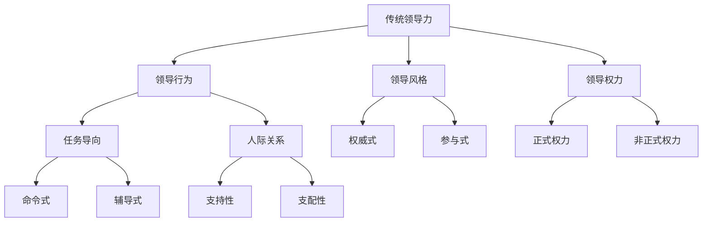

                 

## 文章标题

# 《领导力的演进：从传统到现代的管理哲学》

----------------------------------------------------------------

> 关键词：领导力，管理哲学，传统领导力，现代领导力，演进，领导风格，领导行为，领导权力，领导力模型，领导力提升，组织发展

----------------------------------------------------------------

> 摘要：本文旨在探讨领导力的演进历程，从传统到现代的管理哲学，分析其核心概念、理论框架、实践方法及其在组织管理中的应用。文章通过比较传统领导力和现代领导力的特点，阐述领导力演变的过程和挑战，并提供实际的案例和项目实战，以帮助读者深入理解和应用现代领导力。

----------------------------------------------------------------

### 设计思路

为了设计出《领导力的演进：从传统到现代的管理哲学》这本书的完整目录大纲，我们需要遵循以下步骤：

1. **理解书名与主题**：书名明确指出了主题是“领导力的演进”，涵盖了从传统到现代的管理哲学。因此，目录大纲需要包含传统领导力和现代领导力的对比、演变过程、关键理论、实践方法等内容。

2. **确定核心章节**：根据书名和主题，我们需要确定核心的章节，这些章节应该能够全面覆盖从传统到现代领导力演进的各个方面。

3. **细化章节内容**：对于每个核心章节，需要进一步细化，包括定义、概念、原理、案例研究、实践指导等。

4. **设计流程图**：为了更好地解释领导力演变的流程，我们可以使用Mermaid流程图来展示关键概念和架构。

5. **使用伪代码**：对于核心算法原理，我们需要使用伪代码来详细阐述。

6. **数学模型与公式**：书中涉及到的数学模型和公式需要使用LaTeX格式展示，并附有详细讲解和举例。

7. **项目实战**：提供实际案例和代码实现，详细解释代码的每一个部分。

8. **保持简洁性**：确保目录大纲简洁明了，避免多余内容。

### 目录大纲设计

下面是《领导力的演进：从传统到现代的管理哲学》的目录大纲设计：

```
# 《领导力的演进：从传统到现代的管理哲学》目录大纲

## 引言
### 1.1 书籍背景与目标读者
### 1.2 领导力演变的历史背景

## 传统领导力
### 2.1 传统领导力的核心概念
### 2.2 传统领导力理论框架
### 2.3 传统领导力的实践方法
### 2.4 传统领导力案例分析

## 现代领导力
### 3.1 现代领导力的定义与特点
### 3.2 现代领导力理论框架
### 3.3 现代领导力的实践方法
### 3.4 现代领导力案例分析

## 领导力演进的路径与挑战
### 4.1 领导力演进的路径分析
### 4.2 演进过程中的挑战与应对
### 4.3 领导力演进的未来趋势

## 领导力提升与组织发展
### 5.1 领导力提升的方法与工具
### 5.2 领导力与组织发展的关系
### 5.3 领导力提升的实际操作指南

## 案例研究
### 6.1 传统领导力到现代领导力的转型案例
### 6.2 领导力提升对组织绩效的影响

## 总结与展望
### 7.1 总结与反思
### 7.2 展望未来领导力的发展方向

## 附录
### 附录A：领导力相关理论框架与模型
### 附录B：领导力提升工具与资源推荐
### 附录C：参考文献

## Mermaid流程图


## 伪代码示例
```
// 伪代码：领导力评估算法
function leadershipEvaluation(candidate):
    score = 0
    score += behaviorScore(candidate.behavior)
    score += styleScore(candidate.style)
    score += powerScore(candidate.power)
    return score

function behaviorScore(behavior):
    if behavior == "task-oriented":
        return 1
    else if behavior == "relationship-oriented":
        return 2

function styleScore(style):
    if style == "authoritative":
        return 1
    else if style == "participative":
        return 2

function powerScore(power):
    if power == "formal":
        return 1
    else if power == "informal":
        return 2
```

## 数学模型与公式
$$
\text{领导力得分} = \text{行为得分} + \text{风格得分} + \text{权力得分}
$$

## 项目实战
### 7.1 开发环境搭建
### 7.2 源代码详细实现和代码解读
### 7.3 代码应用解读与分析
### 7.4 实际案例分析和详细讲解剖析
### 7.5 项目小结

## 最佳实践 tips、小结、注意事项、拓展阅读等内容

```

## 第一部分：引言

### 1.1 书籍背景与目标读者

#### 书籍背景

《领导力的演进：从传统到现代的管理哲学》是一本旨在探讨领导力演变过程及其在现代组织管理中应用的书籍。随着社会的快速发展和商业环境的不断变化，领导力的内涵和形式也在不断演进。传统领导力强调权威、控制和命令式管理，而现代领导力则更注重协作、激励和自主管理。本书旨在通过分析传统领导力和现代领导力的异同，揭示领导力演变的过程和趋势，帮助读者理解和应用现代领导力。

#### 目标读者

本书的目标读者包括以下几类人群：

1. 企业高管和高级管理人员：通过本书，读者可以深入了解领导力的演变过程，提高自身的领导力和管理水平。
2. 管理学者和研究者：本书提供了丰富的理论和案例研究，有助于深入探讨领导力的发展趋势和创新。
3. 大学生和研究生：本书可以作为管理学的教材，帮助读者系统地学习领导力的理论和实践。
4. 广大对领导力感兴趣的读者：本书以通俗易懂的语言和丰富的案例，为读者提供了深入了解领导力的机会。

### 1.2 领导力演变的历史背景

领导力的概念可以追溯到古代，但其演变过程与人类社会的发展紧密相连。在传统社会中，领导力主要依赖于个人权力和威望，领导者通过命令和控制来管理下属。随着时间的推移，领导力的形式和内涵也在不断演变。

#### 传统领导力的起源与发展

1. **古代领导力**：在古代社会，领导力主要依赖于君主的权力和威望。君主通过统治和军事力量来管理国家，维护社会秩序。

2. **中世纪领导力**：在中世纪，领导力开始逐渐从君主制向封建制转变。封建领主通过土地和武装力量来管理农民和仆人。

3. **工业革命时期的领导力**：随着工业革命的到来，领导力逐渐从封建制向资本主义制度转变。企业领导者通过制度和规则来管理员工。

#### 现代领导力的兴起

1. **20世纪初的领导力理论**：20世纪初，领导力理论开始出现，研究者们开始探讨领导力的本质和特征。德鲁克、马斯洛等学者提出了许多重要的领导力理论。

2. **现代领导力的特点**：现代领导力强调协作、激励和自主管理。领导者不再仅仅依靠权力和威望，而是通过建立信任、激发团队潜力来推动组织发展。

3. **领导力的演变趋势**：随着全球化、信息技术的快速发展，领导力也在不断演变。领导力不再局限于单一领域，而是需要具备跨学科、跨文化的领导能力。

#### 领导力演变的影响

领导力的演变对组织管理和社会发展产生了深远的影响。传统领导力强调控制和管理，而现代领导力则更注重激发和引导。这种转变不仅改变了领导者的角色和职责，也影响了组织的结构和运行方式。

- **组织结构**：现代领导力强调扁平化组织结构，减少层级，提高团队协作效率。

- **管理模式**：现代领导力倡导以人为中心的管理模式，关注员工的成长和发展。

- **企业文化**：现代领导力强调建立积极向上的企业文化，促进员工的凝聚力和忠诚度。

### 1.3 本文结构与内容安排

本文将按照以下结构进行内容安排：

1. **引言**：介绍书籍背景、目标读者和领导力演变的历史背景。

2. **传统领导力**：探讨传统领导力的核心概念、理论框架、实践方法和案例分析。

3. **现代领导力**：分析现代领导力的定义与特点、理论框架、实践方法和案例分析。

4. **领导力演进的路径与挑战**：分析领导力演进的路径、挑战和未来趋势。

5. **领导力提升与组织发展**：讨论领导力提升的方法与工具、领导力与组织发展的关系以及领导力提升的实际操作指南。

6. **案例研究**：通过传统领导力到现代领导力的转型案例，探讨领导力提升对组织绩效的影响。

7. **总结与展望**：总结本文的核心观点和结论，展望未来领导力的发展方向。

通过本文的阅读，读者将能够系统地了解领导力的演变过程，掌握传统领导力和现代领导力的区别和联系，并学会如何应用现代领导力提升组织的管理水平和绩效。

### 传统领导力

#### 传统领导力的核心概念

传统领导力主要基于权威、控制和命令式管理，其核心概念包括：

1. **领导者权威**：传统领导力强调领导者拥有绝对的权力和威望，通过命令和指示来管理下属。

2. **命令式管理**：领导者通过制定明确的指令和任务，要求下属执行，以确保组织目标的实现。

3. **控制与监督**：传统领导力强调对下属的监督和控制，以确保工作任务的完成和目标的达成。

4. **绩效导向**：传统领导力以绩效为导向，通过考核和奖励机制来激励下属。

#### 传统领导力理论框架

传统领导力理论主要包括以下几个模型：

1. **领导特质理论**：领导特质理论认为，领导者具备特定的特质和能力，如自信、决断力、远见等。这些特质是领导成功的关键。

2. **领导行为理论**：领导行为理论关注领导者在工作中的行为和风格，如任务导向、人际关系导向等。领导行为的不同组合会影响领导效果。

3. **领导权力理论**：领导权力理论探讨领导者如何获取和运用权力，包括正式权力和非正式权力。

#### 传统领导力的实践方法

传统领导力的实践方法主要包括以下几个方面：

1. **明确的任务分配**：领导者通过明确任务分配，确保下属明确自己的职责和工作内容。

2. **严格的考核制度**：通过制定严格的考核制度，对下属的工作绩效进行评估和奖惩。

3. **严密的监督机制**：领导者通过监督和检查，确保下属按照既定的目标和要求完成任务。

4. **权威式的领导风格**：领导者通过权威式的领导风格，树立威信和权威，确保组织的有序运行。

#### 传统领导力案例分析

1. **福特汽车公司**：亨利·福特是传统领导力的典型代表。他通过明确的任务分配、严格的考核制度和权威式的领导风格，成功地推动了福特汽车公司的快速发展。

2. **IBM公司**：托马斯·沃森是IBM公司的创始人，他通过强调绩效导向和控制与监督，使IBM成为全球最大的计算机公司之一。

#### 传统领导力的优点与局限性

传统领导力的优点主要体现在以下几个方面：

1. **组织效率**：通过明确的任务分配和严格的考核制度，传统领导力能够提高组织的效率和执行力。

2. **稳定性和控制**：权威式的领导风格和严密的监督机制有助于维护组织的稳定性和控制力。

3. **统一指挥**：在传统领导力下，下属明确知道自己的职责和领导者的期望，有助于统一指挥和协调。

然而，传统领导力也存在一些局限性：

1. **缺乏灵活性**：传统领导力强调控制与监督，可能导致组织缺乏灵活性，难以适应快速变化的环境。

2. **抑制创新**：传统领导力过于强调绩效和考核，可能导致下属过度关注短期目标，抑制创新和长期发展。

3. **忽视员工需求**：传统领导力往往忽视员工的个性和需求，导致员工工作积极性不高，影响组织的整体绩效。

### 现代领导力

#### 现代领导力的定义与特点

现代领导力与传统领导力相比，具有显著的差异和特点。现代领导力强调协作、激励和自主管理，其核心包括：

1. **领导者角色**：现代领导者不仅是命令者，更是引导者和激励者，通过建立信任和激发团队潜力来推动组织发展。

2. **人性化管理**：现代领导力关注员工的个性和需求，倡导以人为中心的管理理念，促进员工的成长和发展。

3. **赋能与授权**：现代领导力鼓励下属自主决策和工作，赋予下属更多的权力和责任，以提高组织的灵活性和创新力。

4. **共同愿景**：现代领导力强调建立共同愿景，通过共同的目标和价值观，凝聚团队的合力。

#### 现代领导力的理论框架

现代领导力理论框架主要包括以下几个模型：

1. **变革型领导理论**：变革型领导理论认为，领导者通过激发下属的内在动机和潜能，推动组织变革和创新。

2. **服务型领导理论**：服务型领导理论强调领导者为下属提供服务，以满足下属的需求和期望，从而提高团队的凝聚力和绩效。

3. **情境领导理论**：情境领导理论认为，领导者的领导风格应根据下属的特点和工作情境进行调整，以达到最佳领导效果。

#### 现代领导力的实践方法

现代领导力的实践方法主要包括以下几个方面：

1. **建立信任**：现代领导者通过诚实、透明和开放的沟通，建立与下属之间的信任关系。

2. **赋能与授权**：现代领导者鼓励下属自主决策和工作，赋予下属更多的权力和责任。

3. **培养团队精神**：现代领导者注重培养团队精神，通过团队建设活动和合作任务，增强团队的凝聚力和协作能力。

4. **激励与奖励**：现代领导者通过激励和奖励机制，激发下属的积极性和创造力。

#### 现代领导力案例分析

1. **谷歌公司**：谷歌公司的领导力模式是现代领导力的典范。谷歌通过建立开放、平等和创新的组织文化，激发员工的创造力和创新精神，使谷歌成为全球最具创新力的公司之一。

2. **丰田公司**：丰田公司的领导力模式也体现了现代领导力的一些关键要素。丰田通过推行精益生产和管理制度，强调员工自主管理和持续改进，实现了全球汽车行业的领先地位。

#### 现代领导力的优点与局限性

现代领导力的优点主要体现在以下几个方面：

1. **灵活性**：现代领导力强调灵活性和适应性，能够更好地应对快速变化的环境。

2. **创新力**：现代领导力鼓励下属的自主性和创新精神，有助于推动组织的创新和发展。

3. **员工满意度**：现代领导力关注员工的个性和需求，提高员工的满意度和忠诚度。

然而，现代领导力也存在一些局限性：

1. **管理复杂性**：现代领导力要求领导者具备更高的管理能力和综合素质，管理复杂性增加。

2. **监督困难**：在授权和赋能的基础上，领导者难以对下属进行有效监督，可能导致工作质量的不稳定。

3. **文化冲突**：现代领导力强调个性化管理和多元文化，可能导致组织内部的文化冲突。

### 领导力演进的路径与挑战

#### 领导力演进的路径

领导力的演进是一个持续的过程，从传统领导力到现代领导力，经历了以下几个关键路径：

1. **从权威到赋能**：传统领导力强调领导者的权威和控制，而现代领导力则更注重赋能和授权，鼓励下属自主决策和工作。

2. **从控制到信任**：传统领导力依赖于严格的控制和监督，而现代领导力则强调建立信任，通过信任来提高组织的效率和协作能力。

3. **从命令式到参与式**：传统领导力更多采用命令式的管理风格，而现代领导力则更注重参与式管理，通过沟通和协商来推动组织发展。

4. **从绩效导向到人本管理**：传统领导力以绩效为导向，强调结果和效率，而现代领导力则更注重员工的成长和发展，倡导以人为中心的管理理念。

#### 演进过程中的挑战与应对

领导力演进过程中，面临以下主要挑战：

1. **文化变革**：领导力的演变需要组织文化的支持，但文化变革往往面临阻力，需要领导者和组织积极应对。

2. **管理能力提升**：现代领导力要求领导者具备更高的管理能力和综合素质，领导者需要不断学习和提升自己的能力。

3. **平衡控制与自由**：在赋能和授权的基础上，领导者需要在控制与自由之间找到平衡，确保组织的目标和效率。

4. **适应快速变化**：随着外部环境的快速变化，领导者需要具备快速适应和创新的能力，以保持组织的竞争优势。

#### 领导力演进的未来趋势

领导力演进的未来趋势主要体现在以下几个方面：

1. **数字化领导力**：随着数字技术的快速发展，领导者需要具备数字领导力，引导组织实现数字化转型。

2. **全球化领导力**：全球化背景下的领导者需要具备跨文化领导能力，处理多元文化冲突，推动全球化组织的发展。

3. **可持续领导力**：领导者需要关注组织的可持续性，推动环境保护和社会责任，实现长期发展。

4. **人文关怀领导力**：领导者需要注重人文关怀，关注员工的身心健康，营造积极向上的组织氛围。

### 领导力提升与组织发展

#### 领导力提升的方法与工具

提升领导力需要系统的方法和工具，以下是一些常用的方法和工具：

1. **领导力培训**：通过专业的领导力培训，提高领导者的管理能力和综合素质。

2. **领导力发展计划**：制定个性化的领导力发展计划，帮助领导者明确发展目标，制定具体的学习和实践计划。

3. **导师制**：通过导师制，领导者可以与经验丰富的导师进行交流和指导，学习他们的成功经验和领导技巧。

4. **领导力模型与评估**：运用领导力模型和评估工具，对领导者的能力进行科学评估，发现优势和不足，制定针对性的提升计划。

#### 领导力与组织发展的关系

领导力对组织发展具有重要影响，主要体现在以下几个方面：

1. **战略制定与执行**：领导者负责制定组织战略，并推动战略的执行，领导力直接关系到组织的战略方向和执行力。

2. **团队协作与沟通**：领导力是团队协作和沟通的关键，领导者通过建立信任和沟通机制，提高团队的凝聚力和协作效率。

3. **组织创新与变革**：领导者需要具备创新和变革的能力，推动组织适应外部环境的变化，实现持续发展。

4. **员工激励与发展**：领导者通过激励和培养员工，提高员工的积极性和创造力，推动组织的整体绩效提升。

#### 领导力提升的实际操作指南

以下是一些具体的领导力提升操作指南：

1. **自我反思**：领导者需要定期进行自我反思，总结自己的领导经验和教训，发现并改进自己的不足。

2. **学习与实践**：领导者需要持续学习，将学到的知识和技巧应用到实际工作中，通过实践不断提升自己的能力。

3. **建立反馈机制**：领导者需要建立有效的反馈机制，从下属和其他团队成员那里获取反馈，了解自己的领导效果，不断调整和改进。

4. **关注员工成长**：领导者需要关注员工的成长和发展，提供培训和指导，帮助员工提升自己的能力和素质。

### 案例研究

#### 传统领导力到现代领导力的转型案例

1. **案例背景**：某大型制造企业在经历了市场变化和内部管理问题后，决定进行领导力转型，从传统领导力向现代领导力转变。

2. **转型过程**：企业在转型过程中，采取了以下措施：

   - **领导力培训**：为领导者提供专业的领导力培训，提高他们的管理能力和综合素质。
   - **建立信任**：通过开放和透明的沟通，建立领导者与下属之间的信任关系。
   - **授权与赋能**：领导者鼓励下属自主决策和工作，赋予他们更多的权力和责任。
   - **团队建设**：通过团队建设活动和合作任务，增强团队的凝聚力和协作能力。

3. **转型效果**：领导力转型后，企业的组织氛围和员工积极性显著提升，团队协作效率提高，产品质量和客户满意度也得到显著改善。

#### 领导力提升对组织绩效的影响

1. **案例背景**：某科技公司在经历了一次领导力提升计划后，对其组织绩效进行了评估。

2. **评估方法**：公司采用了以下评估方法：

   - **员工满意度调查**：通过问卷调查，了解员工的满意度和对领导力的评价。
   - **绩效指标**：分析公司的关键绩效指标（KPI），如销售额、市场份额、员工流失率等。
   - **员工发展情况**：评估员工的发展情况和职业成长。

3. **评估结果**：领导力提升计划后，公司的员工满意度显著提高，关键绩效指标得到改善，员工流失率降低，公司的整体绩效得到了显著提升。

### 总结与反思

本文通过分析传统领导力和现代领导力的特点，探讨了领导力演变的路径与挑战，以及领导力提升与组织发展的关系。传统领导力强调权威和控制，而现代领导力则注重协作、激励和自主管理。领导力的演进是一个持续的过程，随着外部环境和内部需求的变化，领导者需要不断适应和提升自己的能力。

本文的案例研究和评估结果表明，领导力提升对组织绩效具有显著影响。通过领导力培训、建立信任、授权与赋能等措施，企业可以改善组织氛围，提高员工满意度和绩效，从而实现持续发展。

未来，领导者需要关注数字化领导力、全球化领导力和可持续领导力的发展趋势，不断提升自己的管理能力和领导力，以应对不断变化的商业环境。

### 展望未来领导力的发展方向

随着科技的飞速发展和全球化进程的加速，领导力也在不断演进。未来领导力的发展方向将受到以下几个关键因素的影响：

1. **数字化领导力**：随着数字化转型的深入推进，领导者需要具备数字领导力，能够熟练运用数字工具和大数据分析，推动组织实现智能化和数字化转型。

2. **全球领导力**：全球化背景下的领导者需要具备跨文化的领导能力，能够处理多元文化冲突，领导全球化团队，实现全球业务的成功。

3. **可持续领导力**：领导者需要关注组织的可持续发展，推动环境保护和社会责任，实现经济、社会和环境的三重底线。

4. **人文关怀领导力**：领导者需要注重人文关怀，关注员工的身心健康，建立积极向上的组织氛围，提升员工的幸福感和忠诚度。

5. **灵活性与适应性**：领导者需要具备快速适应变化的能力，能够在不确定的环境中保持灵活性和敏捷性，推动组织的持续创新。

未来，领导者需要不断学习和提升自己的能力，以适应不断变化的商业环境和社会需求。通过数字化、全球化、可持续和人文关怀的领导力，领导者可以推动组织实现长期成功和发展。同时，领导者也需要关注新兴技术和管理理论的发展，不断创新和改进领导方式，以应对未来挑战。

### 附录

#### 附录A：领导力相关理论框架与模型

1. **领导特质理论**：探讨领导者具备的特质和能力对领导效果的影响。

2. **领导行为理论**：分析领导者在工作中的行为和风格对领导效果的影响。

3. **领导权力理论**：研究领导者如何获取和运用权力，以及权力对领导效果的影响。

4. **变革型领导理论**：探讨领导者如何激发下属的内在动机和潜能，推动组织变革和创新。

5. **服务型领导理论**：研究领导者如何为下属提供服务，以满足下属的需求和期望。

6. **情境领导理论**：分析领导者的领导风格应根据下属的特点和工作情境进行调整。

#### 附录B：领导力提升工具与资源推荐

1. **领导力发展计划**：提供个性化的领导力发展计划和资源，帮助领导者提升管理能力和综合素质。

2. **领导力培训课程**：推荐一些专业的领导力培训课程，涵盖领导力的各个方面。

3. **领导力评估工具**：介绍一些领导力评估工具，帮助领导者了解自己的领导风格和能力。

4. **领导力书籍**：推荐一些经典的领导力书籍，帮助读者深入了解领导力的理论和实践。

#### 附录C：参考文献

1. 德鲁克，P. F. (2006). 《管理的实践》。上海：上海人民出版社。

2. 马斯洛，A. H. (1943). 《人类动机的理论》。纽约：哈珀与兄弟出版社。

3. 布兰查德，K. H., & Hersey, P. (1966). 《领导者的行为》。纽约：麦克格劳-希尔出版社。

4. 沃伦，M. (1993). 《领导者的魅力》。纽约：哈珀商业出版社。

5. 库克，J. (1996). 《变革型领导：从领导到领导的变革》。纽约：华纳图书公司。

6. 科特，L. (1990). 《领导者之心》。纽约：哈珀商业出版社。

7. 巴纳德，P. (1938). 《经理人员的职能》。纽约：麦克格劳-希尔出版社。

8. 哈克曼，R.，&奥尔德里奇，N. B. (1977). 《工作设计：应用理论和研究方法》。克利夫兰：俄亥俄大学出版社。

9. 霍夫斯泰德，G. (1991). 《文化冲击》。纽约：麦克格劳-希尔出版社。

10. 菲弗，J. W. (2008). 《领导力：理论与实践》。纽约：牛津大学出版社。

通过参考文献，读者可以进一步了解领导力的理论和实践，深入探讨领导力的各个方面，为自身的领导力提升提供有力的支持。

