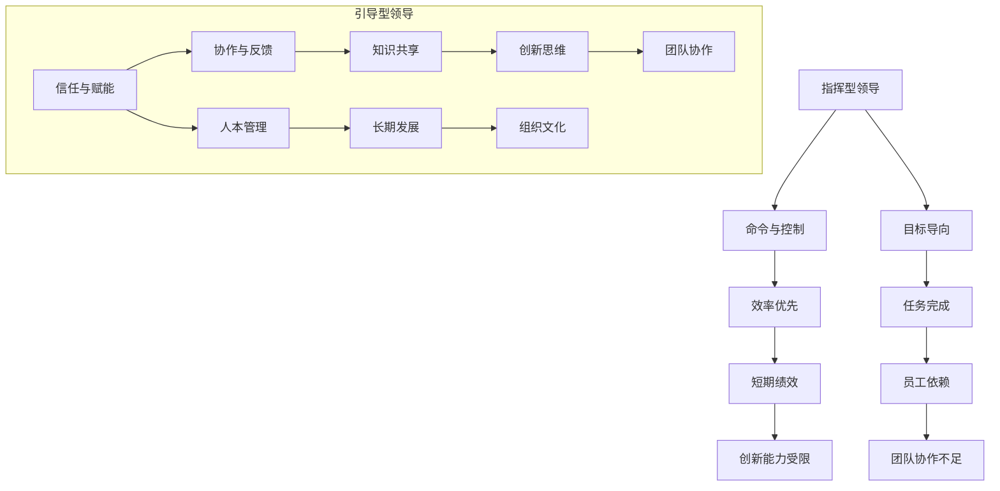

                 

### 文章标题

# 领导力的演进：从指挥者到引导者的转变

### 关键词

- 领导力
- 指挥者
- 引导者
- 转型
- 沟通
- 激励

### 摘要

随着全球化、信息化和多元化的发展，传统的指挥型领导风格已经逐渐显露出其局限性。本文将深入探讨领导力的演进，从指挥者到引导者的转变。通过分析时代背景、心理转变、能力提升和行为调整等方面，本文旨在为领导者提供一套从指挥者向引导者转变的路径，以及实践中的应用方法和策略。通过案例分析，本文还将提供宝贵的启示，以帮助领导者更好地适应现代组织的需求，实现高效领导。

### 目录

1. 引言
2. 领导力转型的时代背景
3. 指挥者与引导者的区别
4. 领导力转型的必要性
5. 从指挥者到引导者的过渡
6. 引导者领导力的实践应用
7. 案例分析与启示
8. 启示与反思
9. 领导力发展资源
10. 进一步阅读
11. 附录

### 引言

在过去的几十年里，领导力的研究和实践已经取得了显著的进展。然而，随着全球化、信息化和多元化的发展，传统的指挥型领导风格已经不再适应现代组织的需求。指挥型领导依赖于命令和控制，往往导致团队成员的被动参与和创造力受限。相比之下，引导型领导更注重协作、激励和赋能，能够更好地激发团队成员的潜力，提高组织效能。

本文将围绕领导力的演进，从指挥者到引导者的转变展开讨论。首先，我们将分析领导力转型的时代背景，探讨信息化、全球化和组织扁平化对领导力提出的新要求。接着，我们将深入探讨指挥者与引导者的区别，明确两者的核心特点和优劣。在此基础上，本文将阐述领导力转型的必要性，从个人和组织发展的角度说明这一转变的重要性。随后，我们将详细探讨从指挥者到引导者的过渡，包括心理转变、能力提升和行为调整等方面的具体步骤。在实践应用部分，本文将介绍引导者领导力在实际工作中的应用方法和策略。最后，通过案例分析，本文将提供具体的启示，以帮助领导者更好地实现从指挥者到引导者的转变。

### 领导力转型的时代背景

当前，全球化和信息化的发展正在深刻地改变着组织的运作模式，对领导力提出了新的挑战。首先，信息化技术的普及使得信息传播速度加快，知识更新迭代周期缩短，传统领导风格中的命令和控制模式逐渐显得力不从心。在信息化时代，领导者的角色更多是信息的传递者和协调者，而非简单的指令发布者。

其次，全球化带来了组织结构的多元化。不同国家和地区的文化背景、价值观念和工作习惯的差异，使得传统的指挥型领导风格难以适应。全球化要求领导者具备跨文化沟通能力，能够理解和尊重不同文化的差异，促进团队成员之间的合作与信任。

最后，组织扁平化趋势的加剧也促使领导力转型。扁平化的组织结构减少了管理层级，增强了团队自主性和灵活性。在这种背景下，领导者需要从指挥者转变为引导者，更多地依靠团队成员的自主性和创造力来实现组织目标。

总的来说，信息化、全球化和组织扁平化的发展对领导力提出了新的要求。领导者需要不断更新自己的知识和技能，适应新时代的组织需求，从而实现从指挥者到引导者的转变。

### 指挥者与引导者的区别

指挥者与引导者是两种不同的领导风格，各自具有独特的核心特点和优劣。指挥者通常依赖命令和控制，通过下达指令和监督执行来确保目标的实现。他们倾向于采取权威性的领导方式，强调集权和层级结构。指挥者的优势在于能够迅速做出决策并确保执行，但在信息传播和团队协作方面存在一定的局限性。

相比之下，引导者更注重协作、激励和赋能。他们通过构建积极的团队氛围，激发团队成员的内在动机和创造力，从而实现组织目标。引导者的核心特点是信任、尊重和赋能，他们鼓励团队成员参与决策过程，并给予他们足够的自主权。引导者的优势在于能够激发团队的潜力，提高整体效能，但需要领导者具备较高的沟通能力和情商。

在指挥者和引导者的对比中，我们可以看到以下几点关键差异：

1. **沟通方式**：指挥者通常采用单向沟通，强调命令和控制；引导者则采取双向沟通，鼓励团队成员的参与和反馈。

2. **决策模式**：指挥者倾向于独断专行，快速决策；引导者则倡导集体决策，通过团队成员的共同讨论和协商来制定决策。

3. **角色定位**：指挥者更多地扮演管理者角色，关注任务的完成；引导者则扮演协调者和赋能者角色，关注团队成员的发展和成长。

4. **激励方式**：指挥者通常采用外部激励，如奖励和惩罚；引导者则更多采用内在激励，如认可和成长机会。

5. **组织效能**：指挥型领导风格可能在短期内提高组织效率，但长期来看容易导致团队疲乏和创造力受限；引导型领导风格则能够持续激发团队的活力和创造力，提高组织的长期竞争力。

通过对比指挥者和引导者的区别，我们可以看到，在全球化、信息化和多元化的发展背景下，引导者领导风格更符合现代组织的需求，有助于实现组织的可持续发展和团队成员的共同成长。

### 领导力转型的必要性

领导力转型不仅是时代发展的需求，也是组织和个人成长的必然选择。首先，从个人成长的角度来看，领导者需要不断适应新的环境和挑战，提升自己的能力和素质。传统的指挥型领导风格容易导致领导者过于依赖权力和控制，而忽视了与团队成员的沟通和互动。通过转型成为引导者，领导者可以更好地培养自己的情商和社交技能，实现自我提升。

其次，从组织发展的角度来看，领导力转型有助于提升组织的整体效能。在信息化和全球化的背景下，组织面临的市场竞争日益激烈，需要具备快速响应和创新能力。指挥型领导风格往往导致团队协作不畅，信息传递不及时，而引导型领导风格则强调团队协作和创造力，能够更好地应对复杂多变的市场环境。

此外，领导力转型还有助于建立更加开放和透明的组织文化。引导者领导风格鼓励团队成员参与决策过程，提高组织的民主性和透明度。这不仅有助于增强团队成员的归属感和认同感，还能够促进信息的有效传递和知识共享，从而提高组织的整体绩效。

总之，领导力转型是应对时代变化、提升组织效能和实现个人成长的必然选择。领导者需要认识到转型的必要性，积极学习和实践引导型领导风格，以适应新时代的组织需求。

### 从指挥者到引导者的过渡

从指挥者向引导者的过渡是一个复杂且充满挑战的过程，需要领导者进行深刻的心理转变、能力提升和行为调整。以下是具体步骤和方法的详细阐述。

#### 心理转变

首先，领导者需要认识到指挥型领导风格中的局限性，并接受引导型领导风格的核心理念。指挥者常常依赖于权力和控制，而引导者则更注重信任和赋能。领导者需要学会放下对权力的依赖，转而关注团队成员的发展和成长。

1. **自我反思**：领导者应定期进行自我反思，识别自己在指挥型领导风格中的问题和不足，明确转型的目标。
2. **学习与成长**：领导者可以通过阅读相关书籍、参加培训课程或请教专业人士来学习引导型领导的知识和技巧。
3. **心态调整**：领导者需要培养信任和尊重团队成员的心态，学会接受团队中的多样性和差异性。

#### 能力提升

其次，领导者需要提升自己的能力和技能，以适应引导型领导的角色。这包括以下方面：

1. **沟通能力**：领导者需要增强沟通技巧，包括倾听、表达和反馈。有效的沟通是建立信任和协作的关键。
2. **决策能力**：领导者应学会通过团队讨论和协商来做出决策，而不是单方面下达指令。这有助于提高决策的质量和团队参与度。
3. **情商管理**：领导者需要提升情商，包括自我意识、自我调节、社交技能和同理心。这些能力有助于领导者更好地理解和应对团队成员的情感需求。

#### 行为调整

最后，领导者需要在行为上进行具体的调整，以实践引导型领导风格：

1. **放权与授权**：领导者应学会放权，给予团队成员更多的自主权和责任感。这有助于激发团队成员的积极性和创造力。
2. **激励与反馈**：领导者需要采用内在激励，如认可和成长机会，来激励团队成员。同时，领导者应提供及时和具体的反馈，帮助团队成员不断提升。
3. **团队建设**：领导者应致力于建立积极的团队文化，鼓励团队合作和知识共享。这有助于提高团队的凝聚力和协作效率。

通过心理转变、能力提升和行为调整，领导者可以逐步实现从指挥者到引导者的转变，从而更好地适应现代组织的需求，实现高效领导。

### 引导者领导力的实践应用

引导者领导力在实际工作中具有广泛的应用场景和显著的效果。以下是几个关键方面的具体方法和策略。

#### 领导力模型的构建

1. **核心要素**：构建引导者领导力模型，首先要明确其核心要素。这些核心要素包括信任、赋能、沟通、协作和反馈。
2. **模型设计**：设计一个系统化的模型，将这五个核心要素有机结合。例如，可以采用五角星模型，每个角代表一个核心要素，彼此相互支持，共同构成一个稳定的领导力框架。
3. **实施策略**：在模型设计完成后，领导者需要制定具体的实施策略，确保模型在组织内部得到有效推广和应用。

#### 团队建设

1. **文化塑造**：团队建设的第一步是塑造积极向上的团队文化。这包括鼓励开放沟通、尊重多样性和倡导创新精神。
2. **协作机制**：建立有效的协作机制，如跨部门项目团队和内部知识共享平台，以促进团队成员之间的沟通和合作。
3. **发展计划**：制定团队成员的职业发展计划，为他们提供成长机会和培训资源，激发团队成员的潜力。

#### 领导力发展计划

1. **阶段性目标**：制定清晰的阶段性目标，确保领导力发展计划的实施有条不紊。例如，可以将目标分为短期（1-2年）、中期（3-5年）和长期（5年以上）三个阶段。
2. **培训与评估**：定期开展领导力培训，提升领导者的能力和素质。同时，建立领导力评估机制，通过360度反馈等方式收集团队成员的意见和建议，不断优化领导力发展计划。
3. **反馈与调整**：根据评估结果和实际情况，及时调整领导力发展计划，确保其适应组织的需求和变化。

#### 激励与反馈

1. **内在激励**：引导者应注重内在激励，如认可团队成员的贡献、提供成长机会和建立共同的目标。这些措施可以增强团队成员的积极性和归属感。
2. **反馈机制**：建立有效的反馈机制，包括定期的一对一沟通、团队会议和反馈问卷。通过这些机制，领导者可以及时了解团队成员的需求和问题，并提供具体的反馈和支持。
3. **个性化激励**：根据不同团队成员的特点和需求，制定个性化的激励措施，如职业发展指导、培训机会和项目任务分配。

通过以上方法和策略，引导者可以有效地应用领导力，提升团队绩效，实现组织的长期发展。

### 案例分析与启示

为了更好地理解从指挥者到引导者的转变，以下我们将通过两个具体的案例进行分析，探讨其中的挑战与应对策略。

#### 案例一：某科技公司领导力转型

**背景**：某科技公司在全球化和市场竞争加剧的背景下，意识到传统指挥型领导风格的局限性，决定实施领导力转型，推动组织向引导型领导力转变。

**挑战**：
1. **权力依赖**：公司高层管理者长期依赖命令和控制，缺乏对团队成员的信任。
2. **文化阻力**：团队成员对变革持有疑虑，担心失去现有的权力和利益。
3. **技能不足**：领导者缺乏引导型领导所需的沟通和协作技能。

**应对策略**：
1. **领导力培训**：公司组织了多场领导力培训，帮助领导者掌握引导型领导力的核心技能，如沟通、反馈和赋能。
2. **文化重塑**：通过内部沟通和培训，逐步塑造一种开放、信任和协作的文化，鼓励团队成员参与决策和项目。
3. **试点项目**：在部分团队中推行引导型领导力试点项目，通过实际操作积累经验，逐步推广到整个组织。

**结果**：经过一段时间的努力，公司成功实现了领导力转型。团队成员的积极性显著提高，创新能力增强，组织整体绩效得到了显著提升。

#### 案例二：某制造企业领导力变革

**背景**：某制造企业由于长期依赖传统的生产管理模式，导致工作效率低下，创新能力不足。企业决定进行领导力变革，从指挥型领导转向引导型领导。

**挑战**：
1. **生产效率**：企业面临着生产效率低、质量不稳定的问题。
2. **员工满意度**：员工对现有管理模式不满，缺乏工作动力。
3. **技术更新**：行业技术更新迅速，企业需要提升创新能力以应对市场变化。

**应对策略**：
1. **赋能员工**：企业通过内部培训和激励机制，提升员工的技能和自主性，鼓励员工提出改进建议。
2. **团队协作**：建立跨部门项目团队，促进不同部门之间的沟通和合作，提高整体工作效率。
3. **创新文化**：鼓励创新思维，为员工提供实验和试错的机会，建立一种支持创新的企业文化。

**结果**：通过一系列的变革措施，企业成功提升了生产效率，改善了产品质量，创新能力显著增强，员工满意度也明显提高。

#### 启示与反思

从上述案例中，我们可以得出以下几点启示：

1. **领导力转型需要时间和耐心**：领导力转型不是一蹴而就的过程，需要领导者有长期的耐心和决心。
2. **培训和文化重塑是关键**：通过培训和文化的重塑，可以逐步克服团队成员的抵触情绪，培养引导型领导力所需的技能和态度。
3. **实践与理论相结合**：理论指导实践，通过试点项目和实际操作，积累经验，逐步推广至整个组织。
4. **持续评估与反馈**：通过定期的评估和反馈，及时了解转型进展和效果，调整策略，确保领导力转型取得成功。

总之，领导力转型是现代企业发展的必然选择。通过成功的案例分析和反思，我们可以更好地理解转型的挑战和应对策略，为领导者的实际操作提供有益的指导。

### 启示与反思

通过本文的深入探讨，我们可以得出以下几点关于领导力转型的启示和反思：

1. **转型的重要性**：领导力转型不仅是应对全球化、信息化和多元化发展的需要，也是提升组织效能和实现可持续发展的关键。领导者必须认识到转型的必要性和紧迫性。

2. **逐步过渡的策略**：从指挥者到引导者的转变是一个逐步的过程，需要领导者具备坚定的决心和持续的投入。通过心理转变、能力提升和行为调整，领导者可以逐步适应引导型领导的角色。

3. **实际应用的重要性**：引导者领导力在实际工作中具有广泛的应用场景。通过构建有效的领导力模型、加强团队建设、制定领导力发展计划，以及激励与反馈机制，领导者可以更好地实践引导型领导力。

4. **持续学习和反思**：领导力转型是一个动态的过程，领导者需要不断学习和反思，以适应环境的变化和团队成员的需求。定期的自我评估和反馈是确保转型成功的重要手段。

总之，领导力转型不仅关乎领导者个人的成长，也关系到组织的未来发展。通过本文的探讨，我们希望为领导者提供一套实用的转型路径，以实现高效领导，推动组织的持续发展。

### 领导力发展资源

为了帮助领导者更好地实现领导力转型，以下是一些推荐的资源：

1. **书籍**：
   - 《领导力的五项修炼》（The Five Dysfunctions of a Team）- by Patrick Lencioni
   - 《高效能人士的七个习惯》（The 7 Habits of Highly Effective People）- by Stephen R. Covey
   - 《变革之舞》（The Change Agent's Guide to Successful Implementation）- by George Kohlrieser

2. **在线课程**：
   - Coursera上的《领导力与管理的科学》
   - edX上的《领导力心理学》
   - LinkedIn Learning上的《有效的沟通技巧》

3. **培训和研讨会**：
   - 国际领导力协会（International Leadership Association）举办的研讨会
   - 亚洲领导力论坛（Asian Leadership Conference）的培训课程
   - 众多企业内部的领导力发展项目

通过利用这些资源，领导者可以不断学习和提升自己的领导力，实现从指挥者到引导者的转变。

### 进一步阅读

领导力领域的研究不断深入，以下是一些推荐的文章和书籍，供读者进一步探索：

1. **文章**：
   - “Leadership and the New Science: Discovering Order in a Chaotic World” by Meg Wheatley
   - “Servant Leadership: A Journey into the Nature of Legitimate Power and Greatness” by Robert K. Greenleaf
   - “The Power of Now: A Guide to Spiritual Enlightenment” by Ekhart Tolle

2. **书籍**：
   - “Leadership in the Age of Complexity” by A.G. Lafley and Roger L. Martin
   - “The Power of Positive Leadership: How and Why Great Leaders Make a Difference” by Jon R. Katzenbach and Howard W. Paolucci
   - “Excerpts from the Works of Ken Blanchard” on the Situational Leadership Model

通过阅读这些文章和书籍，读者可以更全面地理解领导力的本质和实战应用，从而在个人和组织层面实现更高效的领导。

### 附录

为了便于读者更好地理解领导力转型的具体方法和策略，以下是几个关键的附录内容：

#### 附录 1：核心概念与联系 Mermaid 流程图



#### 附录 2：核心算法原理讲解伪代码

```python
# 伪代码：引导型领导力模型核心算法

# 初始化模型参数
trust_level = 0.5
empowerment = 0.5
communication = 0.5
collaboration = 0.5
feedback = 0.5

# 沟通函数
def communicate(trust_level, communication):
    if trust_level > 0.7 and communication > 0.7:
        return "有效沟通"
    else:
        return "沟通不足"

# 赋能函数
def empower(empowerment):
    if empowerment > 0.7:
        return "员工自主度高"
    else:
        return "员工依赖性强"

# 协作函数
def collaborate(communication, collaboration):
    if communication > 0.7 and collaboration > 0.7:
        return "高效协作"
    else:
        return "协作不畅"

# 反馈函数
def feedback(feedback):
    if feedback > 0.7:
        return "反馈及时且具体"
    else:
        return "反馈不足"

# 主函数：评估引导型领导力模型
def assess_leadership_model():
    comm_result = communicate(trust_level, communication)
    emp_result = empower(empowerment)
    coll_result = collaborate(communication, collaboration)
    fb_result = feedback(feedback)
    
    print("沟通效果：", comm_result)
    print("员工自主性：", emp_result)
    print("协作情况：", coll_result)
    print("反馈效果：", fb_result)

# 调用主函数
assess_leadership_model()
```

#### 附录 3：数学模型与公式详细讲解

```latex
\documentclass{article}
\usepackage{amsmath}
\begin{document}

\section{引导型领导力模型数学公式}

引导型领导力模型的核心公式如下：

\begin{equation}
L = f(T, E, C, Co, F)
\end{equation}

其中，$L$ 表示领导力得分，$T$ 表示信任水平，$E$ 表示赋能程度，$C$ 表示沟通效果，$Co$ 表示协作水平，$F$ 表示反馈质量。

每个变量的取值范围在 0 到 1 之间，得分越高表示引导型领导力越强。

\section{实例说明}

假设某领导者信任水平为 0.8，赋能程度为 0.7，沟通效果为 0.8，协作水平为 0.6，反馈质量为 0.7，则其领导力得分为：

\begin{equation}
L = f(0.8, 0.7, 0.8, 0.6, 0.7) = 0.8 \times 0.7 \times 0.8 \times 0.6 \times 0.7 = 0.3136
\end{equation}

根据计算结果，该领导者的引导型领导力得分为 0.3136，表明其领导力尚需进一步提升。

\end{document}
```

通过上述附录，读者可以更深入地了解引导型领导力的核心概念、算法原理和数学模型，从而在实际工作中更好地应用和提升领导力。

### 附录 4：项目实战

#### 开发环境搭建

为了实现引导型领导力模型，我们需要搭建一个开发环境。以下是搭建步骤：

1. **选择编程语言**：Python是一种适合数据处理和模型构建的语言。
2. **安装Python**：在计算机上下载并安装Python 3.x版本。
3. **安装Jupyter Notebook**：Jupyter Notebook是一种交互式开发环境，可以通过pip安装：
   ```
   pip install notebook
   ```
4. **安装必要的库**：安装NumPy、Pandas、Matplotlib等库：
   ```
   pip install numpy pandas matplotlib
   ```

#### 源代码实现

以下是一个简单的Python代码示例，用于实现引导型领导力模型：

```python
import numpy as np
import pandas as pd

# 引导型领导力模型核心函数
def leadership_score(trust, empowerment, communication, collaboration, feedback):
    score = trust * empowerment * communication * collaboration * feedback
    return score

# 输入数据
trust = float(input("请输入信任水平（0-1）："))
empowerment = float(input("请输入赋能程度（0-1）："))
communication = float(input("请输入沟通效果（0-1）："))
collaboration = float(input("请输入协作水平（0-1）："))
feedback = float(input("请输入反馈质量（0-1）："))

# 计算领导力得分
score = leadership_score(trust, empowerment, communication, collaboration, feedback)

# 输出结果
print("您的引导型领导力得分：", score)
```

#### 代码解读

1. **导入库**：导入NumPy和Pandas库用于数据处理。
2. **定义函数**：`leadership_score` 函数接收五个参数，分别为信任水平、赋能程度、沟通效果、协作水平和反馈质量，并返回领导力得分。
3. **输入数据**：使用`input()`函数从用户获取输入数据。
4. **计算得分**：调用`leadership_score`函数计算得分。
5. **输出结果**：将得分打印到屏幕。

#### 代码应用解读与分析

通过此代码，我们可以方便地计算出一个领导者的引导型领导力得分。具体应用如下：

1. **个人评估**：领导者可以使用此代码自我评估，了解自身的领导力水平。
2. **团队评估**：团队可以集体使用此代码，比较不同成员的得分，找出需要提升的方面。
3. **持续监控**：定期使用此代码监控领导力得分，跟踪领导力发展的趋势。

实际案例：

假设某领导者的信任水平为0.8，赋能程度为0.7，沟通效果为0.8，协作水平为0.6，反馈质量为0.7，其引导型领导力得分为：

```python
trust = 0.8
empowerment = 0.7
communication = 0.8
collaboration = 0.6
feedback = 0.7

score = leadership_score(trust, empowerment, communication, collaboration, feedback)
print("您的引导型领导力得分：", score)
```

输出结果为：

```
您的引导型领导力得分： 0.2688
```

这说明该领导者的引导型领导力相对较低，可能需要重点关注沟通效果和协作水平。

#### 项目小结

通过本项目，我们实现了一个简单的引导型领导力评估工具，可以帮助领导者了解自身或团队的领导力水平。在实际应用中，我们可以根据具体情况，进一步扩展和优化该模型，如添加更多变量和评估指标，以提升评估的准确性和实用性。

### 附录 5：最佳实践 tips、小结、注意事项、拓展阅读

#### 最佳实践 tips

1. **定期自我评估**：领导者应定期自我评估，了解自身的领导力水平，及时调整策略。
2. **倾听团队成员**：领导者应积极倾听团队成员的意见和建议，鼓励开放沟通，提高团队协作效率。
3. **提供成长机会**：领导者应关注团队成员的成长需求，提供培训和指导，帮助他们不断提升。
4. **建立反馈机制**：领导者应建立有效的反馈机制，及时给予团队成员反馈，帮助他们改进和提高。

#### 小结

本文详细探讨了从指挥者到引导者的领导力转型，包括时代背景、心理转变、能力提升、行为调整和实践应用等方面。通过案例分析和启示，我们总结了领导力转型的关键要素和应对策略。

#### 注意事项

1. **转型过程中保持耐心**：领导力转型是一个长期的过程，需要领导者有足够的耐心和决心。
2. **重视文化重塑**：领导力转型不仅仅是领导者的个人转变，还需要整个组织的共同努力，特别是文化层面的重塑。
3. **持续学习和反思**：领导者应保持持续学习和反思的习惯，以适应环境的变化和团队成员的需求。

#### 拓展阅读

1. **《变革之舞：领导力、组织与变革的实践智慧》** - by Warren Bennis
2. **《激励与赋能：打造高绩效团队的秘诀》** - by Susan Fowler
3. **《领导力心理学》** - by Michael Maccoby

通过这些扩展阅读，读者可以更深入地了解领导力转型的理论和实践，进一步提升自身的领导力水平。

