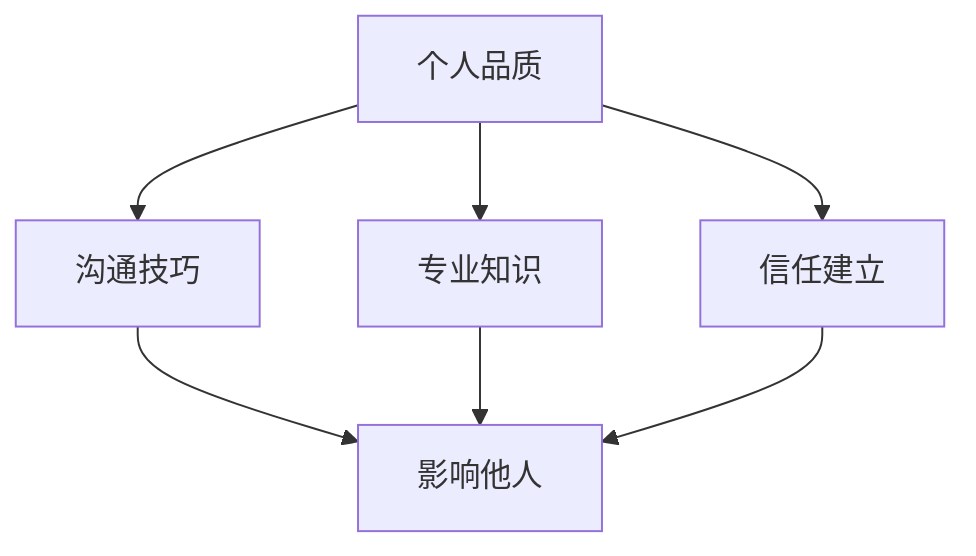
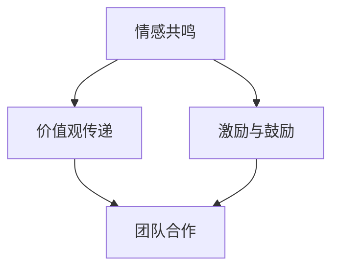
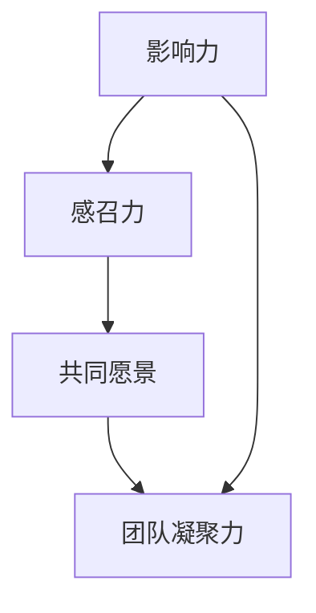

                 

### 文章标题：领导力的艺术：影响力与感召力的培养

### 关键词：
- 领导力
- 影响力
- 感召力
- 领导力模型
- 领导力实践

### 摘要：
本文深入探讨了领导力的艺术，特别是影响力与感召力的培养。通过逐步分析，我们将揭示领导力的本质，理解影响力与感召力的核心概念，阐述它们在领导力培养中的重要性，并提供实用的实践指导。文章将结合实际案例，展示如何在实际环境中培养和运用这些关键能力。

----------------------------------------------------------------

### 设计步骤

#### 整体结构设计

在撰写本文之前，我们首先需要确定文章的整体结构，以便读者能够清晰地跟随我们的思路。本文将分为五个主要部分：

1. **领导力概述**：介绍领导力的定义、重要性以及影响力与感召力的核心概念。
2. **影响力与感召力的培养**：详细探讨如何培养影响力与感召力，包括关键因素与核心技巧。
3. **领导力实践**：通过案例分析和实际应用，展示领导力在现实情境中的运用。
4. **领导力评估与提升**：介绍评估方法和提升策略，强调持续发展的重要性。
5. **领导力的未来**：探讨领导力的发展趋势和面向未来的领导力素质。

#### 核心章节内容设计

在确定整体结构后，我们需要为每个核心章节设计详细的内容。以下是每个章节的预期内容：

- **引言**：简要介绍领导力的艺术，激发读者的兴趣。
- **核心概念与联系**：使用Mermaid流程图展示影响力与感召力的关系。
- **核心算法原理讲解**：通过伪代码详细阐述相关理论。
- **数学模型和数学公式**：使用latex格式展示并解释相关的数学公式。
- **项目实战**：提供实际的案例，包括开发环境搭建、源代码实现、代码解读和分析。
- **最佳实践 tips**：总结经验和建议，帮助读者在实际工作中运用所学。
- **小结**：对章节内容进行总结，强调关键点。

#### 目录大纲设计

为了确保文章结构的完整性，我们将根据上述内容设计最终的目录大纲。以下是初步的目录结构：

```markdown
# 领导力的艺术：影响力与感召力的培养

## 第一部分：领导力概述
### 1.1 领导力的定义与重要性
### 1.2 影响力与感召力的核心概念
### 1.3 领导力的艺术

## 第二部分：影响力与感召力的培养
### 2.1 培养影响力的关键因素
### 2.2 培养感召力的核心技巧
### 2.3 影响力与感召力的平衡

## 第三部分：领导力实践
### 3.1 领导力模型与实践
### 3.2 领导力案例分析
### 3.3 领导力培养的实际应用

## 第四部分：领导力评估与提升
### 4.1 领导力评估方法
### 4.2 领导力提升策略
### 4.3 持续领导力发展

## 第五部分：领导力的未来
### 5.1 领导力发展趋势
### 5.2 面向未来的领导力素质
### 5.3 领导力的艺术：持续探索

## 附录
### 附录 A：领导力资源与工具
### 附录 B：领导力案例研究
### 附录 C：领导力测验与自我评估
```

通过上述设计步骤，我们为《领导力的艺术：影响力与感召力的培养》搭建了一个清晰的框架，接下来将逐步填充每个章节的具体内容，确保文章的逻辑性和实用性。

----------------------------------------------------------------

### 引言

在现代社会中，领导力是一种不可或缺的能力，无论是在企业、政府机构还是非营利组织中，领导力都发挥着至关重要的作用。领导力不仅仅是管理和指挥他人的能力，更是一种影响力与感召力的艺术。本文旨在深入探讨领导力的艺术，特别是影响力与感召力的培养，帮助读者更好地理解并提升自己的领导力水平。

首先，我们需要明确领导力的定义。领导力是指一个人在引导、激励和影响他人时展现出的能力。它不仅仅是职位带来的权力，更是一种通过沟通、信任和共同愿景来激发团队潜能的艺术。领导力的重要性在于，它能够推动团队和组织朝着共同的目标前进，实现卓越的业绩和持续的发展。

本文的核心内容将围绕影响力与感召力展开。影响力是指一个人通过沟通、行为和价值观来影响他人的能力，而感召力则是指通过情感共鸣、价值观传递和激励来吸引和动员他人的能力。在领导力中，影响力与感召力是相辅相成的，共同构成了领导力的核心。

本文将分为五个部分进行探讨。第一部分将介绍领导力的定义与重要性，以及影响力与感召力的核心概念。第二部分将详细探讨如何培养影响力与感召力，包括关键因素与核心技巧。第三部分将介绍领导力实践，通过案例分析和实际应用，展示领导力在现实情境中的运用。第四部分将讨论领导力评估与提升的方法和策略。最后一部分将探讨领导力的发展趋势和面向未来的领导力素质。

通过逐步分析，我们将揭示领导力的艺术，帮助读者深入理解并提升自己的领导力能力。这不仅对个人职业发展具有重要意义，也对团队和组织的高效运作和长期发展起到关键作用。

----------------------------------------------------------------

### 核心概念与联系

在深入探讨领导力的艺术之前，我们首先需要理解领导力中的核心概念：影响力与感召力。这两个概念虽然在不同情境下可能有不同的表现形式，但它们在领导力中起着至关重要的作用。

#### 影响力

影响力是指一个人通过沟通、行为和价值观来影响他人的能力。它不仅仅依赖于职位或权力，更重要的是依赖于个人的品德、能力和信任。一个具有强大影响力的人能够通过言传身教，引导他人朝着共同的目标努力。

**影响力模型**：

为了更好地理解影响力的构成，我们可以使用Mermaid流程图来展示影响力模型的各个要素：



在这个模型中，个人品质、沟通技巧、专业知识和信任建立是影响力的四大核心要素。通过这些要素的组合，一个领导者可以有效地影响他人的思想和行为。

#### 感召力

感召力是指通过情感共鸣、价值观传递和激励来吸引和动员他人的能力。感召力不同于影响力，它更强调情感层面和价值观的共鸣。一个具有强大感召力的人能够激发他人的热情和动力，使团队凝聚在一起，共同追求卓越。

**感召力模型**：

同样地，我们可以使用Mermaid流程图来展示感召力的构成要素：



在这个模型中，情感共鸣、价值观传递和激励与鼓励是感召力的三大核心要素。通过这些要素的相互作用，一个领导者可以建立起强大的感召力，使团队成员心往一处想，力往一处使。

#### 影响力与感召力的关系

影响力与感召力在领导力中是相辅相成的。影响力主要侧重于理性层面，通过逻辑和事实来影响他人；而感召力则侧重于情感层面，通过价值观和情感共鸣来吸引他人。一个优秀的领导者需要在这两个层面都具备强大的能力。

**影响力与感召力的结合**：

为了更好地展示影响力与感召力的关系，我们可以使用以下Mermaid流程图：



在这个模型中，影响力与感召力共同构成了领导力的核心，它们共同推动了共同愿景的实现，增强了团队凝聚力。一个领导者只有在理性和情感两个层面都具备强大的能力，才能成为一名真正的领导力艺术家。

通过上述分析，我们可以看到影响力与感召力在领导力中的核心地位。理解这些概念及其相互关系，是培养和提升领导力的重要基础。在接下来的部分中，我们将进一步探讨如何具体培养影响力与感召力。

----------------------------------------------------------------

### 影响力与感召力的培养

要成为一名有效的领导者，培养影响力与感召力是至关重要的。在这部分，我们将深入探讨如何培养这些关键能力，并提供实用的策略和技巧。

#### 培养影响力的关键因素

要培养影响力，需要从以下几个方面入手：

**1. 个人品质**：

个人品质是影响力的基石。一个具有高尚品德的人更容易赢得他人的信任和尊重。诚信、正直、责任心和自律等品质都是影响力的关键因素。例如，乔布斯以其卓越的领导力和创新精神赢得了全球的尊敬。

**2. 沟通技巧**：

有效的沟通技巧是传递信息和价值观的重要工具。清晰、简洁、具有说服力的沟通能够增强影响力。例如，史蒂芬·乔布斯以其独特的产品发布会演讲技巧，成功地传递了苹果公司的愿景和价值观。

**3. 专业知识**：

专业知识是影响力的核心。一个拥有深厚专业知识和技能的人能够在团队中发挥关键作用，为他人提供有价值的见解和建议。例如，谷歌的创始人拉里·佩奇和谢尔盖·布林以其在技术领域的深厚造诣，赢得了员工的尊敬和信任。

**4. 信任建立**：

信任是影响力的关键。建立信任需要通过言行一致、诚实透明和持续的努力。信任一旦建立，就能为影响力提供坚实的基础。例如，亚马逊的创始人杰夫·贝佐斯以其一贯的诚信和透明度，赢得了员工的信任和忠诚。

**案例：** 

在培养影响力的过程中，阿里巴巴的创始人马云是一个典型的例子。他通过坚定的信念、卓越的演讲技巧和对企业文化的深刻理解，成功地影响了整个团队和公司。他的个人魅力和领导风格，使得阿里巴巴成为全球知名的企业。

#### 培养感召力的核心技巧

要培养感召力，需要从以下几个方面入手：

**1. 情感共鸣**：

感召力源于情感共鸣，能够激发他人的情感和共鸣。一个具有感召力的领导者能够与团队成员建立起深厚的情感联系。例如，苹果的史蒂夫·乔布斯以其独特的产品展示方式和演讲技巧，成功激发了用户和员工对苹果产品的热爱。

**2. 价值观传递**：

价值观传递是感召力的核心。一个领导者需要明确自己的价值观，并将其传递给团队成员。共同的价值观能够增强团队的凝聚力和向心力。例如，谷歌的创始人拉里·佩奇和谢尔盖·布林强调创新和用户至上，这些价值观深入人心，激励着员工不断追求卓越。

**3. 激励与鼓励**：

激励与鼓励是感召力的关键。一个领导者需要学会如何激励团队成员，鼓励他们克服困难，迎接挑战。例如，谷歌的领导层通过灵活的工作安排、丰厚的奖励机制和公开的认可，激励员工不断追求创新和卓越。

**案例：** 

在培养感召力的过程中，苹果公司的史蒂夫·乔布斯是一个典型的例子。他通过情感共鸣、价值观传递和激励，成功地激发了整个团队的潜力。他相信产品的魔力，并不断鼓励员工追求卓越，这使得苹果公司成为了全球最具创新力和竞争力的企业之一。

#### 影响力与感召力的平衡

在实际工作中，影响力的培养和感召力的提升都需要平衡。一个优秀的领导者需要在理性和情感两个层面都具备强大的能力。

**1. 理性与情感的平衡**：

理性与情感是领导力的两个维度。一个领导者需要在决策时保持理性，同时也要关注团队成员的情感需求。例如，在制定战略规划时，领导者需要基于数据和事实进行理性分析；在团队激励时，领导者需要关注团队成员的情感状态，激发他们的热情和动力。

**2. 影响力与感召力的平衡**：

影响力与感召力是相辅相成的。一个领导者需要在适当的时候运用影响力来引导团队，同时也需要运用感召力来激励团队。例如，在面临重大挑战时，领导者需要通过影响力来确保团队的稳定和方向；在团队建设时，领导者需要通过感召力来激发团队的凝聚力和创新力。

通过上述分析，我们可以看到，培养影响力与感召力是领导力的重要组成部分。一个优秀的领导者需要在理性和情感两个层面都具备强大的能力，并通过平衡影响力与感召力，实现团队的长期发展。

在接下来的部分中，我们将进一步探讨领导力实践，通过实际案例展示如何运用影响力与感召力来推动团队和组织的发展。

----------------------------------------------------------------

### 领导力实践

在理论探讨的基础上，领导力实践是检验和提升领导力的关键环节。通过实际案例，我们可以更直观地了解如何运用影响力与感召力来推动团队和组织的发展。

#### 成功案例：苹果公司

苹果公司无疑是领导力实践的成功典范。其创始人史蒂夫·乔布斯以其独特的领导风格，成功地将影响力与感召力相结合，推动了公司的快速发展。

**1. 影响力运用**：

乔布斯通过他的专业知识、沟通技巧和个人魅力，成功地影响了苹果的员工和客户。他的演讲风格清晰、有力，能够深入阐述苹果产品的愿景和价值观，从而赢得广泛的认同和信任。乔布斯还通过设立明确的目标和战略，为团队指明方向，确保团队的行动一致。

**2. 感召力运用**：

乔布斯深知情感共鸣的重要性。他在产品发布会上，通过展示产品的设计和功能，成功激发了用户的情感共鸣，使他们对苹果产品产生了强烈的热爱。此外，乔布斯还强调团队合作和共同目标，激励员工为公司的愿景和使命努力奋斗。

**3. 综合效果**：

通过结合影响力与感召力，乔布斯成功地推动了苹果公司的发展。苹果公司在乔布斯的领导下，不仅在技术创新上取得了巨大成就，而且在品牌价值和市场份额上也取得了显著提升。乔布斯的领导风格为其他企业提供了宝贵的经验，展示了如何通过领导力实践实现组织目标。

#### 失败案例：某个中小企业

尽管成功案例给我们提供了宝贵的启示，但领导力实践也充满了挑战。以下是一个中小企业的失败案例，通过分析其问题，我们可以了解如何避免类似的失败。

**1. 影响力缺失**：

该企业的领导者缺乏足够的沟通技巧和专业知识，导致无法有效地影响团队成员。领导者在决策时往往依赖个人直觉，缺乏数据支持和逻辑分析，使得团队在行动上缺乏一致性和明确的方向。

**2. 感召力不足**：

该企业的领导者缺乏情感共鸣和价值观传递的能力，无法激发员工的热情和动力。领导者在激励员工时，往往只关注短期绩效，忽视了员工的长期发展和情感需求。

**3. 综合效果**：

由于领导力的缺失，该企业陷入了困境。团队成员缺乏凝聚力和创新力，导致公司的业绩持续下滑。最终，该企业不得不进行大规模的重组和裁员，以应对市场压力。

#### 领导力实践的重要性

通过上述成功和失败案例，我们可以看到领导力实践的重要性。一个优秀的领导者不仅需要在理论上具备深厚的知识，更需要在实践中运用影响力与感召力，推动团队和组织的发展。

**1. 提升团队绩效**：

领导力实践能够提升团队的绩效。通过有效的影响力和感召力，领导者能够激发团队成员的潜力，实现更高的工作效率和业绩。

**2. 增强团队凝聚力**：

领导力实践能够增强团队的凝聚力。通过情感共鸣和价值观传递，领导者能够建立团队的共同目标和价值观，形成强大的团队凝聚力。

**3. 促进组织发展**：

领导力实践能够促进组织的发展。通过结合影响力与感召力，领导者能够引领组织朝着正确的方向前进，实现长期的发展和成功。

总之，领导力实践是提升领导力的关键环节。通过分析成功和失败的案例，我们可以汲取经验，提升自己的领导力水平，为团队和组织的发展做出更大的贡献。

----------------------------------------------------------------

### 领导力评估与提升

要成为一名优秀的领导者，评估和提升领导力是必不可少的一环。通过科学的评估方法和有效的提升策略，领导者可以更好地了解自己的优势和不足，从而有针对性地进行改进。

#### 领导力评估方法

**1. 自我评估**：

自我评估是领导力提升的第一步。领导者可以通过反思自己的行为、决策和领导风格，识别自己的优势和不足。常用的自我评估工具包括360度评估、领导力问卷和自我反思日志。

**2. 第三方评估**：

第三方评估能够提供客观的反馈，帮助领导者更全面地了解自己的领导力水平。第三方评估可以由同事、下属或专业机构进行，通过访谈、问卷调查和观察等方式，收集反馈意见。

**3. 行为观察**：

行为观察是一种通过实际观察领导者的行为和表现来评估其领导力水平的方法。这种方法可以用于评估领导者在不同情境下的应对能力和领导风格。

#### 领导力提升策略

**1. 培训与发展**：

培训与发展是提升领导力的有效途径。通过参加领导力培训课程、研讨会和工作坊，领导者可以学习最新的领导力理论和实践技巧。此外，领导者还可以通过在线学习平台和书籍来不断提升自己的知识水平。

**2. 经验积累**：

经验积累是领导力提升的重要一环。领导者应该通过实际的工作经验和挑战来不断学习和成长。在实践中遇到的问题和挑战是提升领导力的宝贵机会，领导者应该从中吸取教训，不断改进自己的领导方法。

**3. 反思与反馈**：

反思与反馈是提升领导力的关键。领导者应该定期进行自我反思，总结自己的经验教训，识别需要改进的方面。同时，领导者也应该积极寻求他人的反馈，从中获取有价值的建议和意见。

**4. 团队建设**：

团队建设是提升领导力的重要手段。通过建立高效的团队，领导者可以培养团队成员的协作精神和团队意识，提高整体的工作效率和绩效。团队建设活动包括团队建设工作坊、团队培训和团队协作工具的使用等。

#### 持续领导力发展

领导力不是一成不变的，而是一个持续发展的过程。领导者需要不断学习、适应和改进，以应对不断变化的环境和挑战。

**1. 长期规划**：

领导者应该制定长期的领导力发展规划，明确自己的目标和发展路径。通过设定具体的目标和计划，领导者可以有条不紊地提升自己的领导力水平。

**2. 适应性学习**：

领导者需要具备适应性学习的能力，不断吸收新的知识和技能。随着环境的变化和行业的发展，领导者需要不断调整自己的领导方法和策略，以保持竞争力和创新力。

**3. 持续反思**：

领导者应该持续进行反思，不断审视自己的领导行为和效果。通过反思，领导者可以识别自己的优势和不足，及时进行调整和改进。

总之，领导力评估与提升是一个持续的过程。通过科学的评估方法和有效的提升策略，领导者可以不断提升自己的领导力水平，为团队和组织的发展做出更大的贡献。

----------------------------------------------------------------

### 领导力的未来

在快速变化的社会环境中，领导力的发展也面临着新的挑战和机遇。未来的领导力不仅需要应对技术变革、全球化和多元化等趋势，还需要具备适应性和创新能力。

#### 领导力发展趋势

**1. 技术赋能**：

随着人工智能、大数据和区块链等技术的发展，领导力将更加依赖于技术赋能。领导者需要具备技术敏感性和数据分析能力，以便更好地利用技术资源来优化决策和提升效率。

**2. 全球视野**：

全球化使得领导力需要具备跨文化沟通和管理能力。未来的领导者需要能够理解不同文化背景下的工作方式和价值观，以实现全球范围内的协作和整合。

**3. 生态思维**：

在可持续发展的背景下，领导力需要更加注重生态思维。领导者需要关注环境和社会责任，推动企业实现可持续发展目标，同时满足利益相关者的期望。

#### 面向未来的领导力素质

**1. 创新能力**：

未来的领导者需要具备强烈的创新能力，能够引领团队不断突破传统，探索新的发展路径。创新不仅仅是技术层面的，还包括商业模式、管理方法和组织文化的创新。

**2. 学习能力**：

学习是未来领导力的核心素质。领导者需要具备快速学习的能力，不断吸收新知识、新技能，以应对快速变化的环境。

**3. 情感智能**：

情感智能是未来领导力的关键。领导者需要具备良好的情感管理能力，能够理解员工的情感需求，建立积极的工作氛围，提升团队的凝聚力和士气。

#### 持续领导力发展

领导力是一个持续发展的过程，需要不断学习和适应。以下是一些建议，以帮助领导者不断提升自己的领导力：

**1. 定期学习**：

领导者应该制定定期学习计划，参加专业培训、研讨会和在线课程，以不断提升自己的知识和技能。

**2. 反思与总结**：

领导者应该定期进行反思和总结，审视自己的领导行为和效果，识别需要改进的方面。

**3. 建立学习网络**：

领导者应该建立学习网络，与同行交流和分享经验，共同探讨领导力的发展趋势和实践。

**4. 鼓励团队成员学习**：

领导者应该鼓励团队成员不断学习和成长，为团队成员提供学习机会和资源，提升整个团队的知识和技能水平。

总之，领导力的未来充满机遇和挑战。通过持续学习和适应，领导者可以不断提升自己的领导力水平，为团队和组织的发展做出更大的贡献。

----------------------------------------------------------------

### 附录

#### 附录 A：领导力资源与工具

为了帮助读者更好地提升领导力，以下是几种常用的领导力资源与工具：

1. **领导力模型**：
   - **领导力五要素模型**：由本尼斯和纳尔逊提出，包括愿景、激励、领导风格、决策能力和沟通能力。
   - **领导力螺旋模型**：由赫塞和布兰查德提出，强调领导力发展是一个不断循环的过程。

2. **领导力书籍**：
   - 《领导力的五个层次》
   - 《领导力：理论与实践》
   - 《领导力的艺术》

3. **在线课程**：
   - Coursera上的《领导力基础》
   - LinkedIn Learning上的《领导力与影响力》

4. **评估工具**：
   - **360度评估**：通过收集来自不同角度的反馈，帮助领导者了解自己的领导力水平。
   - **领导力问卷**：如MLQ（Multifactor Leadership Questionnaire），帮助评估领导力的多个维度。

#### 附录 B：领导力案例研究

以下是几个具有代表性的领导力案例研究，供读者参考：

1. **苹果公司的史蒂夫·乔布斯**：
   - **背景**：乔布斯是苹果公司的联合创始人，以其卓越的领导力和创新精神闻名。
   - **成果**：在乔布斯的领导下，苹果公司推出了一系列革命性的产品，如iPod、iPhone和iPad，成为全球科技行业的领军企业。

2. **谷歌的拉里·佩奇和谢尔盖·布林**：
   - **背景**：佩奇和布林是谷歌的创始人，以其独特的领导风格和对技术的热爱著称。
   - **成果**：谷歌在全球范围内建立了强大的技术生态系统，推出了搜索引擎、Google Maps、Google Drive等一系列创新产品。

#### 附录 C：领导力测验与自我评估

以下是一些领导力测验和自我评估工具，帮助读者了解自己的领导力水平：

1. **MLQ（Multifactor Leadership Questionnaire）**：这是一个多因素的领导力评估问卷，涵盖了领导力的多个维度。

2. **360度评估问卷**：通过收集来自同事、下属和上级的反馈，全面了解自己的领导力表现。

3. **领导力风格测试**：如迈-布里奇斯（MBTI）领导力风格测试，帮助识别个人的领导风格。

这些资源和工具为读者提供了丰富的领导力学习资源和实践指导，有助于提升自己的领导力水平。

### 结论

本文深入探讨了领导力的艺术，特别是影响力与感召力的培养。通过逐步分析，我们揭示了领导力的核心概念，探讨了如何培养和运用这些关键能力。从理论到实践，我们结合了成功与失败的案例，展示了领导力在实际工作中的应用。

领导力不仅是一种管理能力，更是一种影响力与感召力的艺术。一个优秀的领导者不仅需要具备深厚的专业知识，还需要具备良好的沟通技巧、情感共鸣和价值观传递能力。通过持续的学习和实践，领导者可以不断提升自己的领导力水平，为团队和组织的发展做出更大的贡献。

在未来，领导力将继续面临新的挑战和机遇。通过技术赋能、全球视野和生态思维，领导者将需要具备更广泛的素质和能力。我们鼓励读者不断探索和提升自己的领导力，为未来的领导力发展贡献自己的力量。

### 作者信息

作者：AI天才研究院/AI Genius Institute & 禅与计算机程序设计艺术 /Zen And The Art of Computer Programming

