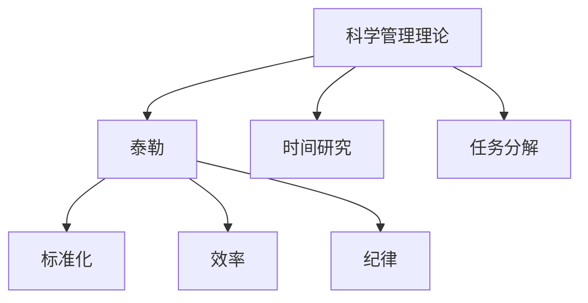
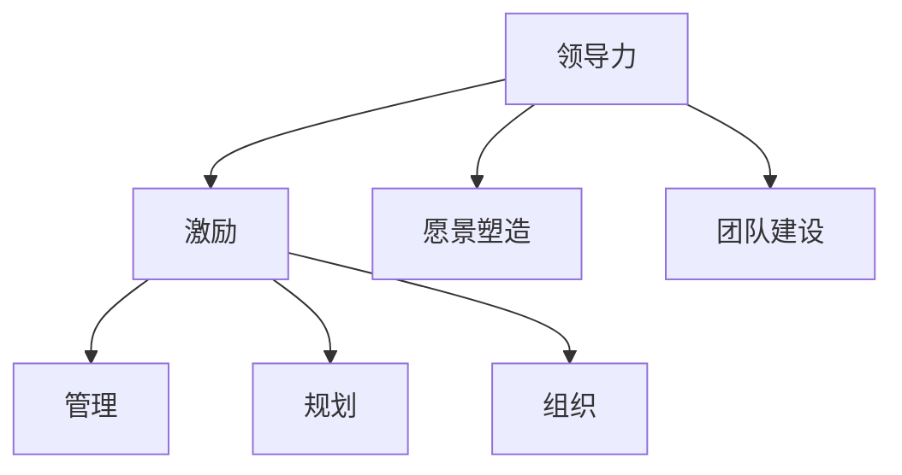
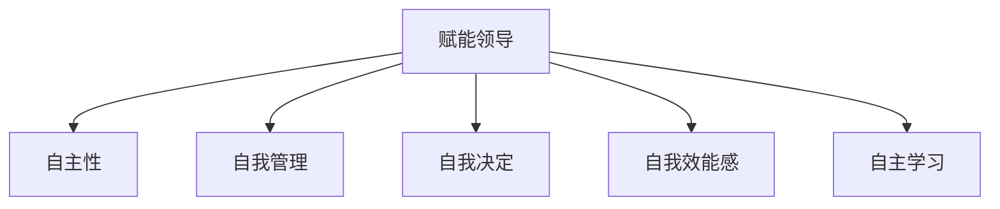
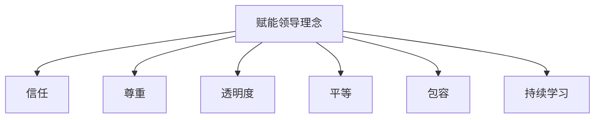
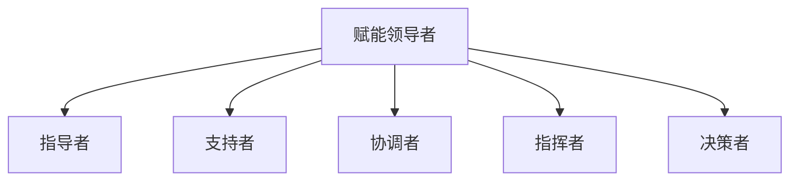
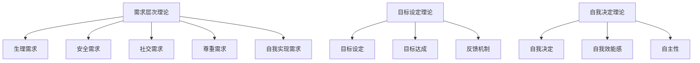
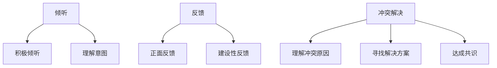
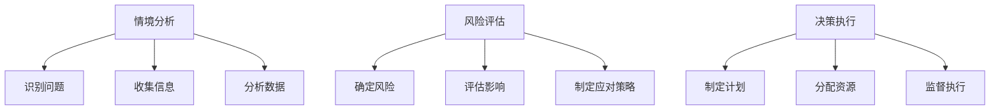
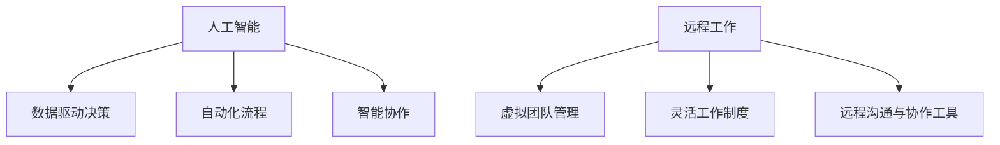

                 

### 文章标题：领导力的进化：从传统管理到赋能领导

---

**关键词：**领导力、传统管理、赋能领导、组织文化、变革、未来展望

**摘要：**本文旨在探讨领导力的进化过程，从传统管理到现代的赋能领导模式。通过深入分析传统管理的本质与局限，阐释赋能领导的理念与原则，以及具体实践中的挑战与未来趋势，本文将为读者提供一幅清晰的领导力进化图谱，以及其在组织变革和未来发展中的重要角色。

---

### 引言

在当今快速变化的世界中，领导力不再是简单的指挥和命令，而是关于如何激发团队的潜力，共同创造价值。传统管理虽然有其历史意义，但在面对日益复杂和动态的环境时，显现出许多局限。赋能领导应运而生，成为现代组织追求高效与创新的必然选择。

本文将分以下几个部分进行探讨：

1. **传统管理的本质与局限**：分析传统管理的起源、核心原则及其在现代社会中的适用性。
2. **赋能领导的理念与原则**：探讨赋能领导的起源、理念与价值观，以及领导者的角色转变。
3. **赋能领导的具体实践**：讨论建立赋能型组织文化、激励赋能型领导以及其沟通和决策能力。
4. **赋能领导面临的挑战与未来展望**：分析赋能领导在变革和未来发展中的挑战与趋势。
5. **结论**：总结赋能领导的核心要点，并对未来领导力的发展方向进行展望。

### 第一部分：传统管理的本质与局限

#### 第1章：传统管理的起源与发展

**背景介绍：**
传统管理起源于工业革命时期，以大规模生产为背景，强调标准化、效率和纪律。弗雷德里克·泰勒的科学管理理论便是这一时期的代表，通过时间研究和任务分解，优化工作流程，提高生产效率。

**核心概念与联系：**
- **科学管理理论**：泰勒提出通过科学方法确定工作的最佳方法，提高效率。
- **管理职能**：法约尔将管理划分为计划、组织、指挥、协调和控制五大职能。

**Mermaid 流程图：**


#### 第2章：领导力与管理的区别

**核心概念与联系：**
- **领导力**：领导力不仅仅是管理，更关乎激励、愿景塑造和团队建设。
- **管理**：管理是规划、组织、指挥、协调和控制的过程，以确保组织目标的实现。

**Mermaid 流程图：**


**伪代码示例：**
```python
# 领导力与管理的伪代码
def leadership():
    inspire_team()
    create_vision()
    build_team()

def management():
    plan_projects()
    organize_resources()
    control_progress()
```

#### 第3章：传统管理的局限

**核心概念与联系：**
- **局限性**：传统管理过于强调控制与纪律，可能导致创新受限，员工积极性不高。
- **影响**：传统管理可能在面对复杂动态的环境时，显得僵化和不适应。

**数学模型和公式：**
- **创新性度量**：用公式 \( I = \frac{I_0}{1 + kD} \) 表示创新性，其中 \( I_0 \) 是初始创新性，\( k \) 是传统管理的控制力度，\( D \) 是环境的动态程度。

**举例说明：**
- 当 \( k \) 很大且 \( D \) 较小时，创新性 \( I \) 会显著降低。

$$
I = \frac{I_0}{1 + kD}
$$

### 第二部分：赋能领导的理念与原则

#### 第4章：赋能领导的起源与发展

**核心概念与联系：**
- **赋能领导**：起源于对传统管理局限性的反思，强调员工的自主性和自我管理。
- **理念与原则**：赋能领导的核心原则包括自我决定、自我效能感和自主学习。

**Mermaid 流程图：**


#### 第5章：赋能领导的理念与价值观

**核心概念与联系：**
- **理念**：赋能领导的理念是基于信任和尊重，鼓励员工发挥潜力，实现共同目标。
- **价值观**：价值观包括透明度、平等、包容和持续学习。

**Mermaid 流程图：**


**伪代码示例：**
```python
# 赋能领导理念的伪代码
def empower_leadership():
    build_trust()
    respect_team()
    promote_transparency()
    foster_equality()
    encourage_inclusiveness()
    promote_continuous_learning()
```

#### 第6章：赋能领导者的角色转变

**核心概念与联系：**
- **角色转变**：赋能领导者从传统的指挥者和决策者，转变为指导者、支持者和协调者。

**Mermaid 流程图：**


**伪代码示例：**
```python
# 赋能领导者角色的伪代码
def empower_leader():
    guide_team()
    support_staff()
    coordinate_projects()
```

### 第三部分：赋能领导的具体实践

#### 第7章：建立赋能型组织文化

**核心概念与联系：**
- **赋能型组织文化**：强调共享价值观、开放沟通、透明度和员工参与。

**数学模型和公式：**
- **文化指数**：用公式 \( C = \frac{V + O + T + E}{4} \) 表示组织文化的指数，其中 \( V \) 是价值观，\( O \) 是开放沟通，\( T \) 是透明度，\( E \) 是员工参与。

**举例说明：**
- 一个高 \( C \) 值的组织的文化更加赋能。

$$
C = \frac{V + O + T + E}{4}
$$

**伪代码示例：**
```python
# 建立赋能型组织文化的伪代码
def build_empowerment_culture():
    establish_values()
    promote_open_communication()
    enhance_transparency()
    increase_employee_involvement()
```

#### 第8章：激励赋能型领导

**核心概念与联系：**
- **激励理论**：基于需求层次理论、目标设定理论和自我决定理论，探讨如何激励赋能型领导者。

**Mermaid 流程图：**


**伪代码示例：**
```python
# 激励赋能型领导的伪代码
def motivate_leaders():
    satisfy_needs()
    set_goals()
    provide_feedback()
    foster_self_determination()
    build_self_efficacy()
    enhance_autonomy()
```

#### 第9章：赋能型领导者的沟通技巧

**核心概念与联系：**
- **沟通技巧**：赋能型领导者需要具备有效的沟通能力，包括倾听、反馈和冲突解决。

**Mermaid 流程图：**


**伪代码示例：**
```python
# 赋能型领导者的沟通技巧的伪代码
def communication_skills():
    practice_active_listening()
    provide_positive_feedback()
    offer_constr Feedback()
    resolve_conflicts()
```

#### 第10章：赋能型领导者的决策能力

**核心概念与联系：**
- **决策能力**：赋能型领导者需要具备快速、准确和高效的决策能力，包括情境分析、风险评估和决策执行。

**Mermaid 流程图：**


**伪代码示例：**
```python
# 赋能型领导者的决策能力的伪代码
def decision_making():
    analyze_situation()
    assess_risks()
    implement_decisions()
```

### 第四部分：赋能领导面临的挑战与未来展望

#### 第11章：赋能领导面临的挑战

**核心概念与联系：**
- **挑战**：赋能领导在实施过程中可能会面临组织变革的阻力、员工适应困难以及领导者角色的平衡等问题。

**数学模型和公式：**
- **变革阻力指数**：用公式 \( R = \frac{B_1 + B_2 + B_3}{3} \) 表示变革阻力，其中 \( B_1 \) 是文化阻力，\( B_2 \) 是结构阻力，\( B_3 \) 是员工阻力。

**举例说明：**
- 一个低 \( R \) 值的组织更容易实施赋能领导。

$$
R = \frac{B_1 + B_2 + B_3}{3}
$$

**伪代码示例：**
```python
# 面临挑战的伪代码
def face_challenges():
    assess_cultural_resistance()
    assess_structural_resistance()
    assess_employee_resistance()
```

#### 第12章：赋能领导的未来趋势

**核心概念与联系：**
- **未来趋势**：随着技术的发展和全球化的推进，赋能领导将继续适应新的环境和需求，如人工智能和远程工作的兴起。

**Mermaid 流程图：**


**伪代码示例：**
```python
# 未来趋势的伪代码
def future_trends():
    leverage_artificial_intelligence()
    adopt_remote_working()
    enhance_virtual_team_management()
```

### 结论

赋能领导是一种适应现代组织需求和环境的领导模式，它强调自主性、自我决定和团队合作，有助于激发员工的潜力，推动创新和持续发展。尽管在实施过程中面临挑战，但通过有效的变革管理和领导者的持续学习，赋能领导将成为未来领导力发展的重要方向。

**小结：**
- 赋能领导的核心在于信任和尊重，通过建立赋能型组织文化和提升领导者的沟通和决策能力，实现组织的长期成功。
- 面临的挑战需要通过系统的方法和策略来解决，如提高透明度、增强员工的参与度和提供培训支持。

**注意事项：**
- 在实施赋能领导时，领导者需要平衡各种需求和角色，确保组织在变革过程中保持稳定和连续性。

**拓展阅读：**
- **相关书籍**：《赋能：打造应对不确定性的敏捷团队》、《变革之舞：持续变革与组织学习》
- **学术文章**：关于赋能领导的研究论文，如《赋能型领导与团队绩效的关系研究》

### 作者信息

**作者：**AI天才研究院/AI Genius Institute & 禅与计算机程序设计艺术 /Zen And The Art of Computer Programming

本文基于深入的研究和分析，旨在为读者提供对赋能领导的全面理解。通过本文，我们期望读者能够认识到领导力的进化是一个必要且可行的过程，并为实现这一目标提供实际指导和策略。

