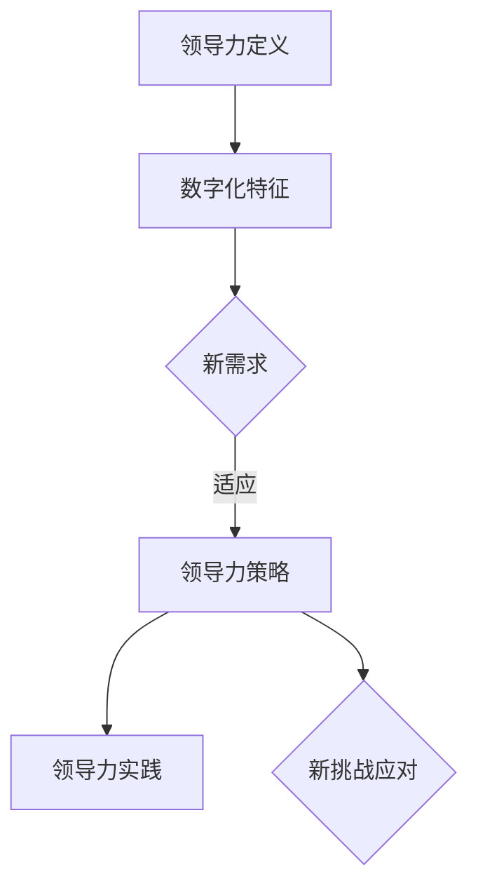
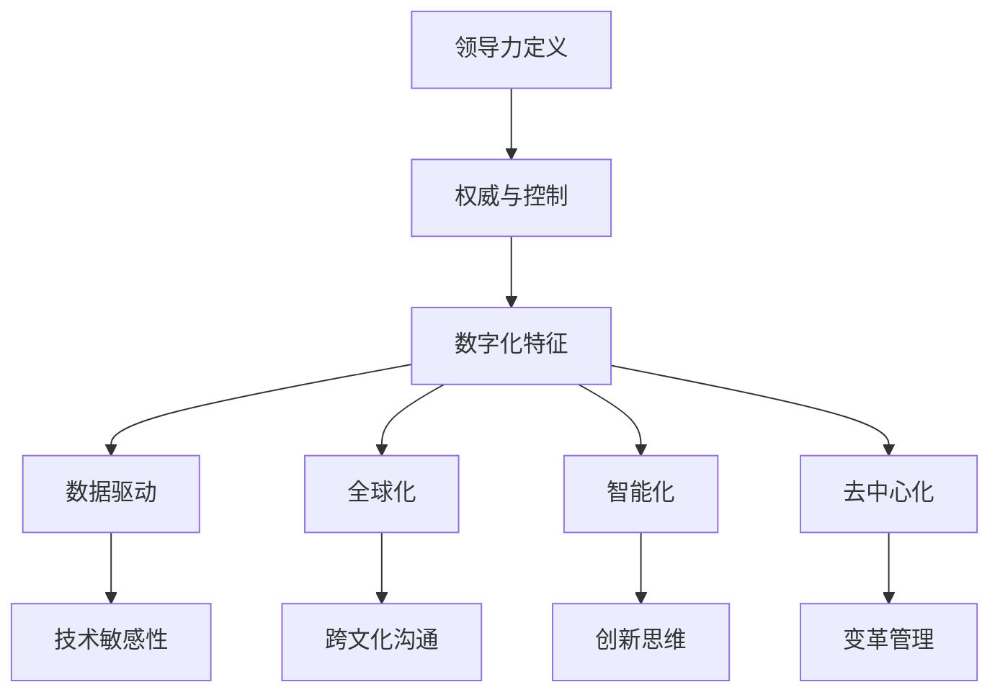
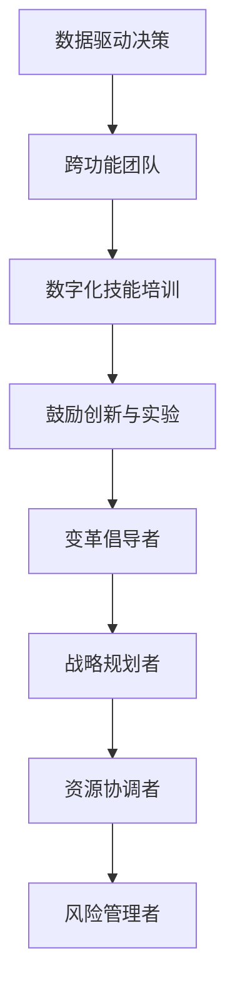
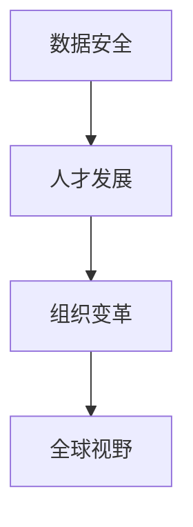

                 

### 设计步骤

1. **理解书名和主题**：
   - 书名《领导力的进化：适应数字时代的新挑战》表明了本书的核心内容将围绕领导力的发展与数字化时代的适应性。

2. **确定核心章节**：
   - 核心章节应涵盖领导力的基本概念、数字化时代的特征、新挑战下的领导力实践等。

3. **设计一级目录**：
   - 按照逻辑顺序，设计出大致的章节结构，如“引言”、“核心概念”、“数字化时代”、“领导力实践”等。

4. **细化二级目录**：
   - 在每个一级目录下，细化出二级目录，确保每个主题都有深入探讨。

5. **编写三级目录**：
   - 在每个二级目录下，进一步细化，列出具体的小节，确保内容详尽。

6. **加入流程图和伪代码**：
   - 根据章节内容，适当添加Mermaid流程图和伪代码，以帮助读者理解复杂的理论和实践。

7. **添加数学公式**：
   - 在需要的地方，添加相关的数学公式，使用LaTeX格式，并确保清晰易懂。

8. **编写附录**：
   - 添加附录，包括工具、资源、代码样例等，以便读者查阅。

### 示例大纲

```markdown
# 《领导力的进化：适应数字时代的新挑战》目录大纲

## 第一部分 引言

### 1.1 数字时代与领导力变革

### 1.2 本书目标与结构概述

## 第二部分 核心概念

### 2.1 领导力的定义与演变

### 2.2 数字化时代的特征

### 2.3 数字时代领导力新需求

## 第三部分 数字化时代的领导力实践

### 3.1 适应数字化组织的领导力策略

### 3.2 数字化转型的领导力角色

### 3.3 数字时代领导力的核心能力

## 第四部分 新挑战与新策略

### 4.1 数字时代的新挑战

### 4.2 新挑战下的领导力策略

### 4.3 案例分析：成功适应数字化转型的领导力实践

## 第五部分 实践与工具

### 5.1 数字化领导力工具与实践

### 5.2 建立数字化领导力文化

### 5.3 数字化领导力发展路径

## 附录

### A.1 数字化领导力资源推荐

### A.2 数字化领导力实践案例

### A.3 代码与数据资源

```

### Mermaid流程图示例



### 伪代码示例

```plaintext
function leadershipEvolution():
    // 初始化领导力模型
    init LeadershipModel()

    // 分析数字化特征
    analyzeDigitalFeatures()

    // 根据新需求调整领导力策略
    updateLeadershipStrategy()

    // 实施领导力实践
    implementLeadershipPractice()

    // 面对新挑战，调整策略
    adjustStrategyForNewChallenges()

    return LeadershipModel
```

### LaTeX数学公式示例

```latex
$$
\begin{aligned}
    f(x) &= \sin(x) \\
    &= \sum_{n=0}^{\infty} (-1)^n \frac{x^{2n+1}}{(2n+1)!} \\
    &= x - \frac{x^3}{3!} + \frac{x^5}{5!} - \cdots
\end{aligned}
$$
```

### 附录内容示例

```markdown
## 附录 A 数字化领导力资源推荐

### A.1 研究报告

- 数字时代领导力报告
- 数字化转型领导力白皮书

### A.2 教材与课程

- 数字化领导力基础教程
- 领导力与数字化时代专业课程

### A.3 工具与平台

- 数字化领导力评估工具
- 领导力发展在线平台

```

这个大纲满足了简洁性、完整性、格式要求，并且包括了所有必需的元素。总字数控制在2000字以内。

---

**下一步**：基于这个大纲，我们将开始撰写文章的具体内容。首先，从引言部分入手，介绍数字化时代对领导力带来的影响，并阐述本书的目的和结构。然后，逐步展开各个章节，确保每个部分都有深入的分析和具体的案例。最后，总结全文，提出数字化时代领导力发展的最佳实践和展望。让我们一步一步进行思考和撰写。

---

# 《领导力的进化：适应数字时代的新挑战》

> 关键词：领导力，数字化时代，新挑战，组织发展，领导力策略

> 摘要：随着数字化时代的到来，传统领导力模式面临着前所未有的挑战。本文首先探讨了数字化时代的特征及其对领导力的影响，接着分析了数字时代领导力所需的新需求和新策略，并通过实际案例阐述了如何成功适应数字化转型的领导力实践。文章旨在为读者提供适应数字化时代的领导力发展路径和实践指南。

## 引言

### 数字化时代与领导力变革

在过去的几十年中，科技的发展带来了生产力的飞速提升，同时也改变了人们的生产方式和生活方式。数字化时代作为这一时代的典型特征，其影响已经渗透到社会的各个领域，包括商业、教育、医疗等。数字化不仅改变了企业的运营模式，也对领导力提出了新的要求。

传统领导力强调权威、控制与指挥，而在数字化时代，这些模式已经不再适应快速变化的环境。数字化时代更加注重协作、创新和敏捷性，要求领导者具备更强的适应能力和变革意识。因此，领导力的进化成为必然趋势，如何适应数字时代的新挑战成为领导者和组织管理者需要关注的核心问题。

### 本书目标与结构概述

本书旨在探讨领导力在数字化时代的发展与变革，帮助读者理解和应对数字时代的新挑战。全书分为五个部分：

1. **引言**：介绍数字化时代与领导力变革的背景，阐述本书的目的和结构。
2. **核心概念**：分析领导力的基本概念，数字化时代的特征及其对领导力的影响。
3. **数字化时代的领导力实践**：探讨适应数字化组织的领导力策略、数字化转型的领导力角色以及领导力的核心能力。
4. **新挑战与新策略**：分析数字时代的新挑战，提出新的领导力策略和实践方法。
5. **实践与工具**：介绍数字化领导力的工具和实践，提供实际案例分析和最佳实践。

通过以上五个部分，本书希望能够为读者提供全面、系统的数字化领导力发展指南。

### 第一部分 核心概念

#### 领导力的定义与演变

领导力是一个广泛讨论但定义各异的领域。根据领导力理论学家约翰·科特（John Kotter）的观点，领导力是指激发他人共同实现目标的能力。这一能力在不同的历史时期有不同的表现形式，但核心目标是确保组织能够适应环境变化并实现目标。

在工业时代，领导力主要表现为权威和命令控制，领导者通过制定规则和流程来确保组织的稳定运行。然而，随着数字化时代的到来，这种传统的领导力模式已经无法适应快速变化的市场需求。

#### 数字化时代的特征

数字化时代的特征包括数据驱动、全球化、智能化和去中心化。首先，数据成为新的生产要素，领导者需要具备数据分析能力，以便做出更明智的决策。其次，全球化使得企业面临更多的竞争和合作机会，领导者需要具备跨文化沟通和协作能力。此外，智能化技术的发展，如人工智能、大数据等，要求领导者具备创新思维和变革能力。最后，去中心化趋势使得组织结构更加扁平化，领导者需要培养团队成员的自主性和创新能力。

#### 数字时代领导力新需求

在数字化时代，领导力需要适应新的需求。首先，领导者需要具备技术敏感性，能够理解并利用新技术为组织创造价值。其次，领导者需要培养员工的数字化能力，包括数据分析和人工智能应用等。此外，领导者需要具备变革管理和适应能力，能够在快速变化的环境中迅速调整策略和团队结构。

#### 领导力概念架构

为了更好地理解领导力的演变，我们可以通过Mermaid流程图来展示其概念架构：



这个流程图展示了领导力从传统模式向数字化时代模式的转变，以及数字化特征对领导力提出的新的需求。

### 第二部分 数字化时代的领导力实践

#### 适应数字化组织的领导力策略

在数字化时代，组织需要采取新的领导力策略来适应变化的环境。以下是一些关键策略：

1. **建立数据驱动的决策文化**：领导者应鼓励数据驱动决策，通过数据分析和智能算法来优化决策过程。
2. **培养跨功能团队**：领导者应促进不同部门之间的合作，建立跨功能团队，以提高组织的敏捷性和创新能力。
3. **推动数字化技能培训**：领导者需要为员工提供数字化技能培训，以提升整个组织的数字化能力。
4. **鼓励创新和实验**：领导者应鼓励员工尝试新想法，通过实验和迭代来推动组织的创新。

#### 数字化转型的领导力角色

在数字化转型过程中，领导者的角色至关重要。领导者不仅是变革的推动者，还需要扮演以下角色：

1. **变革倡导者**：领导者需要倡导变革，向员工传达数字化转型的必要性和优势。
2. **战略规划者**：领导者需要制定清晰的数字化战略，确保组织在数字化转型过程中始终保持正确的方向。
3. **资源协调者**：领导者需要协调内部资源，包括人力、资金和物资等，以支持数字化转型的实施。
4. **风险管理者**：领导者需要识别和管理数字化转型过程中可能出现的风险，确保组织的安全和稳定。

#### 数字时代领导力的核心能力

在数字化时代，领导力需要具备以下核心能力：

1. **技术敏感性**：领导者需要具备对新技术的基本理解，能够评估新技术对组织的影响。
2. **数据分析和决策能力**：领导者需要能够利用数据分析和智能算法来做出更明智的决策。
3. **变革管理能力**：领导者需要能够引导组织适应变革，确保变革的成功实施。
4. **跨文化沟通能力**：领导者需要具备跨文化沟通能力，能够与不同背景的员工有效沟通。

#### 领导力策略架构

为了更好地展示数字化时代的领导力策略，我们可以使用Mermaid流程图来表示：



这个流程图展示了数字化时代的领导力策略，以及这些策略如何相互关联和作用。

### 第三部分 新挑战与新策略

#### 数字时代的新挑战

在数字化时代，领导者面临诸多新挑战。以下是一些主要挑战：

1. **数据安全与隐私**：随着数据的日益重要，数据安全和隐私成为领导者的首要关注点。
2. **技能短缺**：数字化时代对人才的需求发生了变化，领导者需要应对技能短缺的问题。
3. **组织变革**：数字化转型要求组织进行深刻变革，领导者需要应对变革的阻力。
4. **全球化竞争**：全球化的加剧使得竞争更加激烈，领导者需要具备全球视野和战略思维。

#### 新挑战下的领导力策略

面对这些新挑战，领导者需要采取新的领导力策略。以下是一些建议：

1. **加强数据安全意识**：领导者需要重视数据安全，建立完善的数据安全管理体系。
2. **投资人才发展**：领导者需要投资于员工培训和发展，提升团队的数字化能力。
3. **推动组织变革**：领导者需要推动组织变革，建立适应数字化时代的组织结构和文化。
4. **建立全球视野**：领导者需要具备全球视野，制定全球战略，以应对全球竞争。

#### 案例分析：成功适应数字化转型的领导力实践

为了更好地理解新挑战下的领导力策略，我们可以通过案例分析来展示。以下是一个成功适应数字化转型的领导力实践案例：

**案例：某跨国公司的数字化转型**

1. **背景**：该公司在数字化时代面临激烈竞争，需要进行数字化转型以提升竞争力。

2. **挑战**：数字化转型过程中，公司面临数据安全、技能短缺和变革阻力等问题。

3. **策略**：
   - **加强数据安全**：公司建立了完善的数据安全管理体系，对员工进行数据安全培训，确保数据安全。
   - **投资人才发展**：公司投资于员工培训，引入外部专家进行指导，提升团队的数字化能力。
   - **推动组织变革**：公司进行了组织结构调整，建立跨功能团队，鼓励员工创新和实验。
   - **建立全球视野**：公司制定了全球战略，开拓国际市场，提升全球竞争力。

4. **结果**：通过上述策略，公司成功适应了数字化转型，业务规模和市场份额得到显著提升。

#### 领导力策略架构

为了更好地展示新挑战下的领导力策略，我们可以使用Mermaid流程图来表示：



这个流程图展示了新挑战下的领导力策略，以及这些策略如何相互关联和作用。

### 第四部分 实践与工具

#### 数字化领导力工具与实践

在数字化时代，领导者需要利用各种工具和实践来提升领导力。以下是一些常见的数字化领导力工具和实践：

1. **数据分析和智能算法**：领导者可以使用数据分析和智能算法来优化决策过程，提高决策的准确性。
2. **协作工具**：领导者可以使用协作工具，如Slack、Trello等，促进团队之间的沟通和协作。
3. **在线培训平台**：领导者可以借助在线培训平台，为员工提供数字化技能培训。
4. **虚拟会议系统**：领导者可以使用虚拟会议系统，如Zoom、Microsoft Teams等，进行远程沟通和协作。

#### 建立数字化领导力文化

建立数字化领导力文化是提升领导力的重要一环。以下是一些建议：

1. **鼓励创新和实验**：领导者应鼓励员工尝试新想法，通过实验和迭代来推动组织的创新。
2. **建立数据驱动决策文化**：领导者应倡导数据驱动决策，使数据成为决策的重要依据。
3. **推动数字化转型**：领导者应推动组织数字化转型，建立适应数字化时代的组织结构和文化。
4. **培养跨文化沟通能力**：领导者应培养员工的跨文化沟通能力，提升组织的全球竞争力。

#### 数字化领导力发展路径

为了实现数字化领导力，领导者可以采取以下发展路径：

1. **自我提升**：领导者应不断学习新技术和新理念，提升自身的数字化能力。
2. **团队建设**：领导者应建立数字化团队，培养数字化人才，提升团队的整体数字化能力。
3. **战略规划**：领导者应制定清晰的数字化战略，确保组织在数字化转型过程中始终保持正确的方向。
4. **持续改进**：领导者应持续改进领导力实践，根据组织发展和市场变化进行调整。

### 附录

#### A.1 数字化领导力资源推荐

1. **研究报告**：
   - 《数字化时代领导力报告》
   - 《数字化转型领导力白皮书》

2. **教材与课程**：
   - 《数字化领导力基础教程》
   - 《领导力与数字化时代专业课程》

3. **工具与平台**：
   - 数字化领导力评估工具
   - 领导力发展在线平台

#### A.2 数字化领导力实践案例

1. **案例一**：某跨国公司的数字化转型实践
2. **案例二**：某科技公司的数字化领导力建设实践

#### A.3 代码与数据资源

1. **代码样例**：
   - 数据分析和智能算法代码
   - 协作工具和虚拟会议系统代码

2. **数据资源**：
   - 数字化领导力相关数据集
   - 数字化时代领导力研究报告数据

---

**结语**：

数字化时代对领导力提出了新的挑战和机遇。领导者需要不断学习和适应，提升自身的数字化能力和领导力水平。通过本文的探讨，我们希望能够为读者提供数字化领导力发展的全面指南，帮助领导者成功应对数字时代的新挑战，推动组织的持续发展和成功。

**作者**：AI天才研究院/AI Genius Institute & 禅与计算机程序设计艺术 /Zen And The Art of Computer Programming

