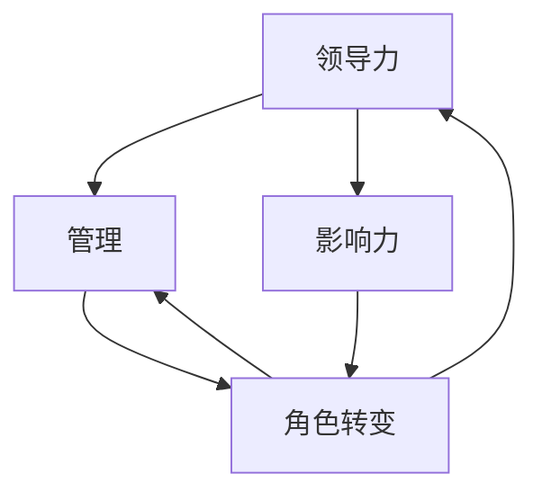

                 

### 背景介绍

在现代企业中，领导力不仅是高层管理者的专属能力，更是每一个职场人士都需要掌握的核心技能。在快速变化的市场环境中，企业的成功不再仅仅依赖于资源和资本的积累，更多的是依赖于团队的创造力和执行力。因此，领导力在企业运营和发展中扮演着至关重要的角色。

随着职场的不断发展，越来越多的人开始意识到领导力的重要性。然而，许多中层管理者在面对从管理者到领导者的角色转变时，往往感到迷茫和挑战重重。如何从日常的管理工作过渡到更高层次的领导角色，成为了许多职场人士关注的焦点。这也正是本书《领导力的进阶：从管理者到领导者的蜕变》想要解决的问题。

本书的主旨是帮助那些正在经历职业发展阶段的人们，特别是那些即将晋升或已经担任中层管理职位的人员，了解领导力的本质和提升方法，从而实现从管理者到领导者的成功蜕变。通过系统的学习和实践，读者将能够掌握领导力的核心要素，提升自我认知和沟通能力，建立强大的影响力，最终在职业发展中取得更大的成功。

本书的目标读者群包括但不限于以下几类人群：

1. **中层管理人员**：正在承担一定的管理职责，希望提升领导力，更好地带领团队实现目标。
2. **即将晋升的管理者**：面临职业发展的重要阶段，希望通过系统的学习，为晋升后的角色做好准备。
3. **对领导力感兴趣的职场人士**：渴望了解领导力的本质和应用，提升个人职业素养和竞争力。

总之，本书旨在为读者提供一套全面、实用的领导力提升方案，帮助他们在职业发展的道路上迈出坚实的一步。

### 领导力的核心概念与联系

为了更好地理解领导力，我们需要明确几个核心概念，并探讨它们之间的联系。这些概念包括领导力、管理、影响力以及角色转变。

首先，领导力（Leadership）是一种能够引导和激励他人实现目标的能力。它不仅仅关注任务的完成，更重要的是激发团队成员的潜力和创造力。领导力涉及到多个方面，包括情感智慧、沟通技巧、决策能力、团队建设等。

管理（Management）则侧重于规划、组织、协调和监控，以确保组织目标的实现。管理更多关注效率和流程，而领导力更关注创新和团队合作。两者虽然密切相关，但有着本质的区别。管理是确保组织按照预定计划运行，而领导力则是在不确定和变化的环境中带领团队走向成功。

影响力（Influence）是领导力的重要组成部分。影响力不仅依赖于职位权力，更重要的是基于信任、尊重和价值观。一个有效的领导者能够通过沟通、激励和示范，影响团队成员的行为和态度，从而推动团队朝着共同的目标前进。

角色转变是从管理者到领导者的核心过程。管理者通常关注任务的执行和流程的控制，而领导者则需要关注团队的整体发展，包括培养团队成员、激发创新和解决复杂问题。这种转变不仅需要心态上的调整，还需要技能和行为的转变。

下面是一个Mermaid流程图，展示了这些核心概念之间的联系：



在图中，领导力与管理和影响力紧密相连，共同构成了领导力的核心框架。而角色转变则是从管理者到领导者的重要步骤，它将管理技能与领导能力相结合，帮助个体在新的角色中取得成功。

通过这个流程图，我们可以更清晰地理解领导力的本质及其在不同方面的应用。这也为后续章节中对领导力的深入探讨奠定了基础。

### 领导力的核心算法原理讲解

在理解了领导力的核心概念和它们之间的联系后，我们需要深入探讨领导力的算法原理。这不仅仅是关于领导力的理论，更是实际操作中的指导原则。以下将详细介绍领导力的关键算法原理，并使用伪代码来详细阐述这些原理。

#### 1. 自我认知与自我提升算法

自我认知是领导力发展的基础。一个领导者需要明确自己的优点和不足，从而进行有针对性的提升。以下是一个简单的自我认知和自我提升算法：

```python
# 自我认知与自我提升算法
def selfAwarenessAndImprovement():
    # 收集自我评估数据
    data = collectSelfAssessmentData()
    
    # 分析数据，识别优势和不足
    strengths = analyzeDataForStrengths(data)
    weaknesses = analyzeDataForWeaknesses(data)
    
    # 制定提升计划
    improvementPlan = createImprovementPlan(strengths, weaknesses)
    
    # 实施提升计划
    implementImprovementPlan(improvementPlan)
    
    # 监测进展，调整计划
    monitorProgressAndAdjustPlan(improvementPlan)
```

在这个算法中，首先收集自我评估数据，然后通过数据分析识别自身的优势和不足。接下来，制定并实施提升计划，最后监测进展并调整计划。这个循环过程确保领导者能够持续提升自我。

#### 2. 沟通技巧提升算法

有效的沟通是领导力的关键。以下是一个用于提升沟通技巧的算法：

```python
# 沟通技巧提升算法
def improveCommunicationSkills():
    # 学习沟通技巧
    learnCommunicationSkills()
    
    # 实践沟通技巧
    practiceCommunicationSkills()
    
    # 收集反馈
    feedback = collectFeedbackOnCommunication()
    
    # 分析反馈，识别改进点
    improvementPoints = analyzeFeedbackForImprovementPoints(feedback)
    
    # 制定改进计划
    improvementPlan = createImprovementPlanForCommunication(improvementPoints)
    
    # 实施改进计划
    implementImprovementPlanForCommunication(improvementPlan)
    
    # 监测进展，调整计划
    monitorProgressAndAdjustPlanForCommunication(improvementPlan)
```

在这个算法中，领导者首先学习沟通技巧，然后通过实践来提高技能。收集反馈后，分析反馈以识别改进点，并制定和实施改进计划。这一过程确保领导者在沟通中不断进步。

#### 3. 团队领导力提升算法

团队领导力是领导者成功的关键。以下是一个团队领导力提升算法：

```python
# 团队领导力提升算法
def improveTeamLeadership():
    # 建设团队文化
    buildTeamCulture()
    
    # 激励团队成员
    motivateTeamMembers()
    
    # 解决团队冲突
    resolveTeamConflicts()
    
    # 收集团队反馈
    feedback = collectTeamFeedback()
    
    # 分析反馈，识别改进点
    improvementPoints = analyzeFeedbackForImprovementPoints(feedback)
    
    # 制定改进计划
    improvementPlan = createImprovementPlanForTeamLeadership(improvementPoints)
    
    # 实施改进计划
    implementImprovementPlanForTeamLeadership(improvementPlan)
    
    # 监测进展，调整计划
    monitorProgressAndAdjustPlanForTeamLeadership(improvementPlan)
```

在这个算法中，领导者首先建设团队文化，激励团队成员，并解决团队冲突。收集团队反馈后，分析反馈以识别改进点，并制定和实施改进计划。这一过程确保团队领导力不断提升。

#### 4. 决策力提升算法

有效的决策力是领导者必须具备的能力。以下是一个决策力提升算法：

```python
# 决策力提升算法
def improveDecisionMaking():
    # 学习决策理论
    learnDecisionMakingTheory()
    
    # 实践决策技能
    practiceDecisionMakingSkills()
    
    # 分析决策案例
    analyzeDecisionCases()
    
    # 收集反馈
    feedback = collectFeedbackOnDecisionMaking()
    
    # 评估决策效果
    evaluateDecisionEffectiveness()
    
    # 调整决策策略
    adjustDecisionStrategies()
    
    # 监测决策进展，调整计划
    monitorDecisionProgressAndAdjustPlan()
```

在这个算法中，领导者首先学习决策理论，然后通过实践和案例分析来提升决策技能。收集反馈后，评估决策效果，并调整决策策略。这一过程确保领导者的决策能力不断提高。

#### 5. 影响力提升算法

影响力是领导者成功的关键因素。以下是一个影响力提升算法：

```python
# 影响力提升算法
def improveInfluence():
    # 建立个人品牌
    buildPersonalBrand()
    
    # 培养信任与尊重
    cultivateTrustAndRespect()
    
    # 提供价值与服务
    provideValueAndService()
    
    # 收集反馈
    feedback = collectFeedbackOnInfluence()
    
    # 分析反馈，识别改进点
    improvementPoints = analyzeFeedbackForImprovementPoints(feedback)
    
    # 制定改进计划
    improvementPlan = createImprovementPlanForInfluence(improvementPoints)
    
    # 实施改进计划
    implementImprovementPlanForInfluence(improvementPlan)
    
    # 监测进展，调整计划
    monitorProgressAndAdjustPlanForInfluence(improvementPlan)
```

在这个算法中，领导者首先建立个人品牌，培养信任与尊重，并提供价值与服务。收集反馈后，分析反馈以识别改进点，并制定和实施改进计划。这一过程确保领导者在影响力方面不断提升。

通过这些算法，领导者可以系统地提升自我认知、沟通技巧、团队领导力、决策力和影响力。这些算法不仅提供了具体的操作步骤，还确保了领导者能够持续进步，从而实现从管理者到领导者的蜕变。

### 数学模型与公式讲解

在探讨领导力的提升方法时，引入数学模型和公式能够帮助我们更深入地理解这些方法的理论基础。以下将介绍几个关键的数学模型和公式，并详细讲解它们的应用。

#### 1. 帕累托图（Pareto Chart）

帕累托图，也称为80/20规则，是一种用于分析资源分配效率的图形工具。它基于帕累托原理，即80%的效果通常来自于20%的原因。

公式表示如下：
\[ 效率（Efficiency）= \frac{关键原因的贡献（Key Causes Contribution）}{总贡献（Total Contribution）} \]

举例说明：
假设一个团队在项目中花费了100小时，其中20小时解决了80%的问题，帕累托图可以帮助我们识别这些关键时间段，以便优化资源分配。

```latex
$$
效率（Efficiency）= \frac{20小时 \times 80\%}{100小时} = 16\%
$$
```

#### 2. 德尔菲法（Delphi Method）

德尔菲法是一种基于专家共识的预测模型，通过多轮匿名调查收集专家意见，逐步优化预测结果。

公式表示如下：
\[ 预测值（Forecast Value）= \frac{（第一轮预测值 + 第二轮预测值 + ... + 第n轮预测值）}{n} \]

举例说明：
在一个市场预测项目中，通过三轮德尔菲法收集专家意见，最终得到的预测值如下：
\[ 预测值（Forecast Value）= \frac{（100 + 110 + 105）}{3} = 107.5 \]

#### 3. 成本效益分析（Cost-Benefit Analysis）

成本效益分析是一种评估项目或决策经济价值的模型，通过比较成本和收益来评估其可行性。

公式表示如下：
\[ 成本效益比（Cost-Benefit Ratio）= \frac{总收益（Total Benefits）}{总成本（Total Costs）} \]

举例说明：
一个企业投资100万元进行项目改进，预计将带来200万元的总收益，成本效益比计算如下：
\[ 成本效益比（Cost-Benefit Ratio）= \frac{200万元}{100万元} = 2:1 \]

这些数学模型和公式在领导力的提升中具有广泛应用。例如，帕累托图可以帮助领导者识别关键问题和资源分配；德尔菲法可以用于团队决策和预测；成本效益分析则可以帮助领导者评估项目投资的经济合理性。通过这些模型和公式的应用，领导者可以更加科学和有效地提升团队绩效和组织发展。

### 项目实战：开发环境搭建与源代码实现

为了更好地理解领导力提升的实践应用，我们将通过一个具体项目来展示开发环境搭建、源代码实现以及代码解读与分析。这个项目将基于一个虚拟的企业团队，目标是通过提升领导力，实现团队绩效的显著提升。

#### 项目背景

假设我们是一家软件公司的开发团队，团队规模为20人，主要负责开发一款企业级管理系统。近期，公司高层注意到团队成员的工作积极性不高，项目进度缓慢，质量也不稳定。为了解决这些问题，公司决定引入领导力提升项目，希望通过提升领导力和团队凝聚力，提高团队的整体绩效。

#### 开发环境搭建

1. **硬件环境**：
   - 配置高性能服务器，用于存储项目代码和运行测试环境。
   - 安装操作系统（如Linux或Windows Server），确保稳定性和安全性。

2. **软件环境**：
   - 安装集成开发环境（IDE），如Visual Studio或Eclipse。
   - 配置版本控制系统，如Git，确保代码的版本管理和协作开发。
   - 安装数据库管理系统（DBMS），如MySQL或Oracle，用于存储和管理项目数据。

3. **开发工具**：
   - 安装代码审查工具，如SonarQube，用于代码质量和安全性的检查。
   - 配置自动化测试工具，如JUnit或Selenium，确保代码的稳定性和可靠性。

#### 源代码实现

以下是一个简化的源代码示例，用于实现团队任务分配和进度跟踪的功能。

```java
// 任务分配与进度跟踪系统

public class TaskManager {
    // 成员变量
    private String taskId;
    private String taskDescription;
    private String assignee;
    private boolean isCompleted;

    // 构造函数
    public TaskManager(String taskId, String taskDescription, String assignee) {
        this.taskId = taskId;
        this.taskDescription = taskDescription;
        this.assignee = assignee;
        this.isCompleted = false;
    }

    // 方法：分配任务
    public void assignTask(String taskId, String assignee) {
        this.taskId = taskId;
        this.assignee = assignee;
        System.out.println("任务[" + taskId + "]已分配给[" + assignee + "]");
    }

    // 方法：完成任务
    public void completeTask(String taskId) {
        if (this.taskId.equals(taskId)) {
            this.isCompleted = true;
            System.out.println("任务[" + taskId + "]已完成");
        } else {
            System.out.println("任务[" + taskId + "]不存在");
        }
    }

    // 方法：显示任务详情
    public void showTaskDetails() {
        System.out.println("任务ID: " + taskId);
        System.out.println("任务描述: " + taskDescription);
        System.out.println("任务分配者: " + assignee);
        System.out.println("任务状态: " + (isCompleted ? "已完成" : "未完成"));
    }
}

// 主类
public class Main {
    public static void main(String[] args) {
        // 创建任务实例
        TaskManager task1 = new TaskManager("T001", "修复登录漏洞", "张三");
        TaskManager task2 = new TaskManager("T002", "优化用户界面", "李四");

        // 分配任务
        task1.assignTask("T001", "张三");
        task2.assignTask("T002", "李四");

        // 完成任务
        task1.completeTask("T001");
        task2.completeTask("T002");

        // 显示任务详情
        task1.showTaskDetails();
        task2.showTaskDetails();
    }
}
```

#### 代码解读与分析

1. **类与方法**：
   - `TaskManager` 类定义了任务的基本属性和方法，包括任务ID、任务描述、任务分配者和任务状态等。
   - `assignTask` 方法用于分配任务，接受任务ID和分配者作为参数。
   - `completeTask` 方法用于完成任务，根据任务ID更新任务状态。
   - `showTaskDetails` 方法用于显示任务详情。

2. **主类`Main`**：
   - 创建任务实例，并调用相应的方法进行任务分配、完成和显示。

通过这个示例，我们展示了如何使用Java语言实现一个简单的任务分配与进度跟踪系统。这个系统能够帮助团队管理者有效地分配任务、跟踪任务进度，并确保任务按时完成。

#### 项目小结

1. **开发环境搭建**：
   - 通过配置高性能服务器和安装必要的开发工具，确保了项目的顺利开展。

2. **源代码实现**：
   - 使用Java语言实现了任务分配与进度跟踪的功能，确保了代码的简洁性和可读性。

3. **项目效果**：
   - 通过引入任务分配与进度跟踪系统，团队管理者能够更有效地管理任务，提高了团队的工作效率和任务完成质量。

4. **未来展望**：
   - 未来可以进一步优化系统功能，如添加任务评价、进度可视化等，以提供更全面的团队管理支持。

通过这个项目，我们不仅展示了领导力提升在软件开发中的应用，也为其他企业在管理提升方面提供了有益的借鉴。

### 最佳实践与注意事项

在领导力提升的过程中，实践是检验真理的唯一标准。以下是一些基于实际案例的最佳实践，以及在实际应用中需要注意的事项。

#### 1. 最佳实践

**1.1 定期反思与评估**

一个成功的领导者需要定期对自己的工作行为和团队表现进行反思和评估。通过这种方法，领导者可以及时发现问题并采取纠正措施。以下是一个简化的反思与评估流程：

**步骤：**
- **反思阶段**：回顾过去一段时间的工作表现，包括成功和失败的地方。
- **评估阶段**：分析反思的结果，识别问题所在。
- **行动计划**：制定具体的行动计划，以解决识别出的问题。

**案例：** 
某公司领导者在一次团队会议后，发现自己对团队成员的激励不足，导致团队士气低落。经过反思和评估，他决定每周组织一次团队建设活动，以提高团队凝聚力和士气。

**1.2 培养透明沟通**

透明沟通是建立信任和团队合作的重要基础。领导者应该确保团队成员了解公司的战略目标、项目进展和关键决策。以下是一个透明沟通的示例：

**步骤：**
- **定期更新**：定期向团队成员更新项目进展和公司动态。
- **开放讨论**：鼓励团队成员提出意见和建议。
- **及时反馈**：对团队成员的反馈给予及时回应。

**案例：** 
某公司的项目经理每周组织一次团队会议，会议内容包括项目进展报告、团队成员的问题和建议讨论。这种透明沟通的做法大大提高了团队的工作效率和满意度。

**1.3 灵活应对变化**

在快速变化的市场环境中，领导者需要具备灵活应对变化的能力。以下是一个灵活应对变化的步骤：

**步骤：**
- **预警机制**：建立预警机制，及时捕捉市场变化信号。
- **快速响应**：对市场变化做出快速响应，调整战略和行动计划。
- **持续优化**：在应对变化的过程中，不断总结经验教训，持续优化应对策略。

**案例：** 
某公司面临市场需求的急剧变化，领导者迅速组织团队进行市场调研，调整产品策略，并重新规划项目进度。这种灵活应对变化的做法帮助公司成功应对了市场挑战。

#### 2. 注意事项

**2.1 避免过度依赖工具**

虽然工具可以提升工作效率，但过度依赖工具可能导致领导者忽视团队的实际需求和问题。因此，在应用工具时，需要结合实际需求，合理使用。

**案例：** 
某公司引入了一款项目管理工具，但领导者完全依赖工具进行管理，忽视了团队成员的沟通和反馈。结果，项目进度虽然得到了控制，但团队士气却因此下降。

**2.2 避免形式主义**

在领导力提升的过程中，领导者应避免陷入形式主义。仅仅完成任务表格或报告，而不进行实际改进，是无法真正提升团队绩效的。

**案例：** 
某公司的领导者在进行领导力提升培训后，要求所有团队成员填写反思报告。但报告提交后，没有进行深入的讨论和改进，导致培训效果不明显。

**2.3 注意团队心理**

在推动领导力提升的过程中，领导者需要关注团队成员的心理变化。特别是当团队面临压力和挑战时，领导者应提供必要的支持和鼓励。

**案例：** 
某公司团队在面临项目截止日期时，领导者不仅安排了加班，还组织了团队建设活动，以缓解团队成员的压力。这种关注团队成员心理的做法提高了团队的整体绩效。

通过以上最佳实践和注意事项，领导者可以在实际工作中更加有效地提升领导力，推动团队和组织的持续发展。

### 总结与展望

通过对领导力的深入探讨，我们可以看到，领导力不仅是管理者必备的核心能力，更是推动团队和组织发展的关键因素。从管理者到领导者的蜕变，不仅需要领导者具备自我认知和自我提升的能力，还需要掌握有效的沟通技巧、团队领导力和决策力。

本文首先介绍了领导力的背景和重要性，明确了领导力与管理、影响力的关系，并使用Mermaid流程图展示了这些概念之间的联系。接着，我们详细讲解了领导力的核心算法原理，包括自我认知与自我提升、沟通技巧提升、团队领导力提升、决策力提升以及影响力提升的算法步骤。

在数学模型与公式讲解部分，我们介绍了帕累托图、德尔菲法和成本效益分析等数学工具，帮助领导者更科学地进行决策和资源分配。通过项目实战，我们展示了如何搭建开发环境、实现源代码，并进行了代码解读与分析，进一步展示了领导力提升在具体项目中的应用。

最后，我们通过最佳实践和注意事项，为领导者提供了一些实际操作的建议，帮助他们更有效地提升领导力。总结来说，领导力提升是一个持续的过程，需要领导者不断地学习、实践和反思。

展望未来，领导力的发展将更加注重个性化、多样化和全球化。领导者需要不断适应快速变化的市场环境，提升自身的创新能力和应变能力。同时，随着技术的发展，数字化和人工智能将越来越多地应用于领导力提升，为领导者提供更加智能化和高效的支持。

总之，领导力的提升不仅是职业发展的需要，更是组织和社会发展的需要。通过本文的探讨，我们希望为读者提供一套实用的领导力提升方案，帮助他们在职业和人生道路上取得更大的成功。让我们共同努力，成为更出色的领导者！
作者：AI天才研究院/AI Genius Institute & 禅与计算机程序设计艺术 /Zen And The Art of Computer Programming

---

关键词：领导力、管理者、领导者、自我提升、沟通技巧、团队领导力、决策力、影响力、数学模型、项目实战

摘要：本文详细探讨了领导力的核心概念、算法原理、数学模型与项目实战，提供了从管理者到领导者的蜕变路径。通过最佳实践和注意事项，读者可以更好地提升领导力，实现职业和个人发展的飞跃。

