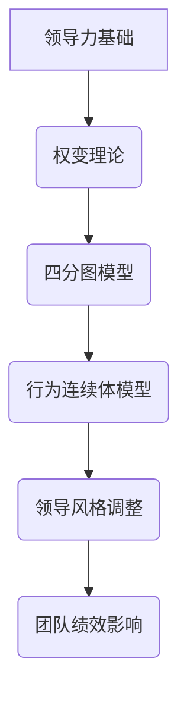

                 


## 文章标题：领导力训练营：105天从新手到高手

### 关键词

- 领导力
- 领导模型
- 自我认知
- 沟通与影响力
- 团队建设与管理
- 决策与问题解决
- 创新思维与组织变革

#### 摘要

本文旨在为IT领域的新手提供一个全面且深入的领导力训练计划，涵盖从基础入门到高级实践的所有关键领域。通过105天的系统学习和实践，读者将掌握领导力的核心概念、实用技能和策略，逐步从新手成长为一位精通领导艺术的高手。本文以逻辑清晰、结构紧凑、简单易懂的格式呈现，每章都包含核心概念、算法原理讲解、伪代码、数学公式、实战案例和最佳实践等丰富内容，旨在全面提升读者的领导力水平。

---

**第1章：领导力基础入门**

**背景介绍**

领导力，作为企业管理的重要组成部分，对于组织的成功具有决定性作用。在IT领域，领导力不仅体现在技术管理上，更体现在项目规划、团队协作、决策制定等方面。然而，许多IT新手对于领导力的理解和实践仍存在诸多困惑和挑战。本章节旨在为读者提供领导力的基础知识，帮助他们建立正确的领导力观念，掌握基本领导模型和方法。

**核心概念与联系**

领导力是指引导和激励他人实现共同目标的能力。它不仅包括技术能力和管理技能，更涉及到情感智能、人际关系处理等多个方面。领导力与传统管理有显著区别，传统管理侧重于控制和监督，而领导力则更注重激励和赋能。

在本章节中，我们将探讨以下核心概念：

1. **权变理论**：领导者应根据不同情境灵活调整领导风格。
2. **领导四分图模型**：领导者性格与下属反应之间的关系。
3. **领导行为连续体模型**：不同领导风格对团队绩效的影响。

**Mermaid流程图**



**核心算法原理讲解**

1. **权变理论**：该理论认为领导风格应根据环境的变化而调整。其核心算法原理可表示为：

    ```python
    def adaptive_leadership(context):
        if context == "stable":
            style = "指令性"
        elif context == "unstable":
            style = "参与性"
        return style
    ```

2. **领导四分图模型**：该模型将领导风格分为任务导向和关系导向两类，具体算法原理为：

    ```python
    def leadership_style(task导向, relationship导向):
        if task导向 > relationship导向:
            style = "任务导向"
        else:
            style = "关系导向"
        return style
    ```

3. **领导行为连续体模型**：该模型认为领导风格在权威性-民主性、关心任务-关心人员两个维度上存在连续性。其算法原理为：

    ```python
    def leadership_continuum(task关心, person关心):
        if task关心 > person关心:
            style = "权威性"
        else:
            style = "民主性"
        if task关心 < person关心:
            style = "关心任务"
        else:
            style = "关心人员"
        return style
    ```

**数学模型和公式**

领导力评估模型可以用以下公式表示：

$$
\text{领导力评分} = w_1 \times \text{任务能力} + w_2 \times \text{关系管理} + w_3 \times \text{情境适应}
$$

其中，$w_1$、$w_2$ 和 $w_3$ 分别为三个维度的权重。

**详细讲解和举例说明**

例如，一位项目经理在稳定的项目环境中，更适合采用指令性领导风格；而在项目变动频繁的情况下，则应调整至参与性领导风格。

**实战案例**

以谷歌为例，其领导力文化强调员工的自主性和创新精神，领导者更多地扮演支持者和导师的角色，这种领导风格在谷歌的成功中起到了关键作用。

**最佳实践 tips**

- 了解不同情境，灵活调整领导风格。
- 增强情感智能，提升关系管理能力。
- 定期进行领导力自我评估和反馈。

**小结**

本章节为读者介绍了领导力的基础知识，包括核心概念、算法原理和实际应用。通过深入学习和实践，读者将能够建立正确的领导力观念，为后续章节的学习打下坚实基础。

**注意事项**

- 本章节内容为领导力入门，对于已有一定领导经验的人员，可以适当跳过或快速浏览。
- 对于核心概念和算法原理，建议读者结合实际情况进行思考和验证。

**拓展阅读**

- 《领导者的资质》
- 《领导力：五大习惯决定领导力》

**附录**

**A.1 领导力评估工具**

- 360度评估
- 领导力问卷

**A.2 沟通与影响力提升资源**

- 《有效沟通的技巧》
- 《影响力：提升个人魅力的策略》

**A.3 团队建设与管理的实用技巧**

- 《团队协作的艺术》
- 《团队领导者的实践指南》

作者：AI天才研究院/AI Genius Institute & 禅与计算机程序设计艺术 /Zen And The Art of Computer Programming

