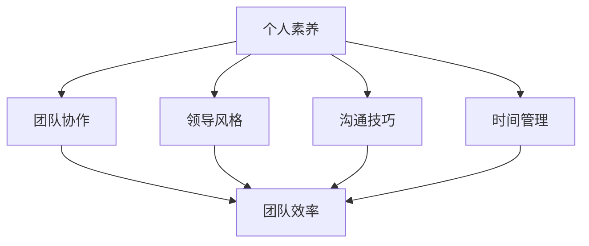

                 


### 文章标题：《领导力训练营：119天从新手到专家》

关键词：领导力、训练营、新手、专家、个人成长、团队协作、时间管理、沟通技巧、实战演练

摘要：本文将带领读者深入了解领导力的核心概念和培养路径，通过119天的训练营，从新手逐步成长为专家，提升个人领导力，并在团队协作、时间管理和沟通技巧等方面实现质的飞跃。文章结构清晰，内容丰富，旨在为读者提供系统、实用的领导力培养指南。

----------------------------------------------------------------

### 引言

在当今快速变化的世界中，领导力已成为成功的关键因素。无论是企业管理者，还是普通员工，都需要具备一定的领导力，以应对不断涌现的挑战和机遇。然而，领导力并非与生俱来，它需要通过系统的学习和实践来不断提升。为此，我们设计了一款为期119天的领导力训练营，旨在帮助新手迅速成长为专家，全面提高个人领导力。

本文将围绕领导力的核心概念和培养路径展开，分为以下几个部分：

1. **领导力基础**：介绍领导力的定义、重要性以及发展历程，帮助读者建立对领导力的基本认识。
2. **领导力模型**：详细阐述情境领导和变革领导等核心模型，并通过案例进行分析，让读者理解这些模型在实际中的应用。
3. **领导力技能培养**：围绕时间管理、沟通技巧和团队合作等核心技能，提供实用的培养方法和策略。
4. **领导力实践**：通过案例分析、实战演练，展示如何将领导力技能应用于实际工作场景。
5. **领导力评估与提升**：介绍领导力评估工具和方法，帮助读者根据评估结果进行自我提升。
6. **领导力与组织发展**：探讨领导力对组织文化、战略和绩效的影响，以及领导力与组织发展的互动关系。
7. **总结与展望**：对全书内容进行总结，并对未来领导力的发展趋势进行展望。

通过本文的阅读，读者将系统了解领导力的各个方面，掌握提升领导力的方法和策略，从而在个人成长和职业发展中取得更大成就。

### 领导力基础

领导力是一个复杂而多层次的概念，它不仅仅关乎个人的权力和影响力，更涉及到团队的协作、组织的变革以及个人的成长。要理解领导力，首先需要明确其定义和重要性。

#### 领导力的定义

领导力（Leadership）是一种影响他人以达成共同目标的能力。它不同于管理（Management），后者侧重于规划、组织、指导和控制，而领导力则更注重激发和引导团队的潜力，使其朝着共同的目标努力。领导力不仅仅是领导者的个人特质，更是一种可以通过学习和实践提升的技能。

#### 领导力的重要性

领导力在个人和组织中都具有极其重要的作用：

1. **个人成长**：领导力是个人职业发展的重要推动力。具备领导力的人更容易获得信任和尊重，更容易在职场中获得提升和奖励。
2. **团队协作**：领导力是团队高效协作的基础。一个优秀的领导者能够激发团队成员的积极性，提升团队的整体执行力。
3. **组织发展**：领导力是组织持续发展的重要保障。优秀的领导者能够推动组织进行变革和创新，适应外部环境的变化，保持竞争力。

#### 领导力的发展历程

领导力的发展历程可以追溯到古代，但现代领导力理论的研究始于20世纪。以下是一些重要的里程碑：

1. **传统领导力理论**：包括特质理论和行为理论，侧重于领导者的个人特质和行为模式。
2. **情境领导理论**：提出领导行为应该根据不同的情境进行调整，以适应团队的不同需求和挑战。
3. **变革领导理论**：强调领导者在推动组织变革中的关键作用，重视领导者的愿景和价值观。
4. **变革型领导与交易型领导**：变革型领导强调领导者的创新和影响力，交易型领导则侧重于通过激励和奖励来引导团队成员。

#### 领导力的核心概念

领导力的核心概念包括：

1. **个人素养**：领导者的个人品质和价值观，如诚信、勇气、自律等。
2. **团队协作**：领导者如何激发团队成员的潜力，建立高效团队。
3. **领导风格**：领导者在工作中表现出来的行为和态度，如民主型、独裁型、放任型等。
4. **沟通技巧**：领导者与团队成员之间如何进行有效沟通，建立信任和共识。
5. **时间管理**：领导者如何合理安排时间，提高工作效率。

### 核心概念之间的关系架构

为了更好地理解领导力的核心概念之间的关系，我们可以使用Mermaid流程图来展示：



在这个流程图中，个人素养是领导力的基石，它直接影响团队协作、领导风格、沟通技巧和时间管理。这些核心概念相互关联，共同作用于团队效率和领导效果。

#### 核心算法原理讲解

为了深入理解领导力的核心概念，我们可以通过伪代码来阐述其基本原理：

```python
# 定义领导力核心概念类
class LeadershipConcepts:
    def __init__(self, personal_qualities, team_collaboration, leadership_style, communication_skills, time_management):
        self.personal_qualities = personal_qualities
        self.team_collaboration = team_collaboration
        self.leadership_style = leadership_style
        self.communication_skills = communication_skills
        self.time_management = time_management
    
    # 方法：评估领导力效果
    def evaluate_leadership(self):
        team_efficiency = self.team_collaboration + self.leadership_style + self.communication_skills + self.time_management
        return team_efficiency

# 创建领导力对象
leadership = LeadershipConcepts("诚信，勇气，自律", "高效协作", "民主型", "有效沟通", "合理安排时间")

# 调用评估方法
print(leadership.evaluate_leadership())
```

在这个伪代码中，我们定义了一个`LeadershipConcepts`类，包含五个核心概念：个人素养、团队协作、领导风格、沟通技巧和时间管理。通过`evaluate_leadership`方法，我们可以计算出领导力的综合效果，从而为领导者的提升提供依据。

#### 数学模型和公式详解

在领导力中，我们也可以使用一些数学模型和公式来衡量和优化领导效果。以下是一个简单的数学模型，用于评估领导力的综合水平：

$$
\text{综合领导力} = \frac{1}{2} \times (\text{个人素养} + \text{团队协作} + \text{沟通技巧} + \text{时间管理}) \times \text{领导风格}
$$

其中，每个因素都根据其在领导力中的重要性赋予不同的权重。例如，如果个人素养在领导力中的权重为0.3，团队协作为0.25，沟通技巧为0.2，时间管理为0.15，领导风格为0.1，则可以计算出领导力的综合水平。

#### 举例说明

假设一个领导者的各项能力得分如下：

- 个人素养：85分
- 团队协作：90分
- 沟通技巧：80分
- 时间管理：88分
- 领导风格：75分

根据上述数学模型，可以计算出该领导者的综合领导力：

$$
\text{综合领导力} = \frac{1}{2} \times (0.3 \times 85 + 0.25 \times 90 + 0.2 \times 80 + 0.15 \times 88 + 0.1 \times 75) = 84.75
$$

这个分数表示该领导者的领导力水平处于较高水平，但可以通过提高个人素养和沟通技巧来进一步提升。

#### 实际案例分析和详细讲解剖析

为了更好地理解领导力的实际应用，我们可以通过一个案例来进行分析。

**案例：某科技公司的新产品发布**

在这个案例中，一位产品经理（领导者）需要带领团队完成新产品的研发和发布。以下是领导力的实际应用：

1. **个人素养**：产品经理具备优秀的沟通能力和组织能力，能够有效协调团队资源，确保项目顺利进行。
2. **团队协作**：产品经理鼓励团队成员积极参与，充分发挥各自的专业特长，形成高效的工作氛围。
3. **领导风格**：产品经理采用民主型领导风格，重视团队成员的意见和建议，促进团队的自主创新。
4. **沟通技巧**：产品经理定期与团队成员进行沟通，确保信息透明，及时解决团队遇到的问题。
5. **时间管理**：产品经理制定详细的项目计划和时间表，合理分配任务，确保项目按时完成。

通过以上领导力的应用，产品经理成功带领团队完成了新产品的研发和发布，取得了显著的成绩。

#### 项目实战：开发环境搭建

为了帮助读者更好地理解领导力在实际项目中的应用，以下是一个简单的项目实战案例：搭建一个开发环境。

**开发环境搭建**

1. **需求分析**：确定开发环境所需的基本组件，如操作系统、开发工具、数据库等。
2. **资源协调**：与团队成员和相关部门协调，确保获取所需资源和权限。
3. **任务分配**：根据团队成员的专业特长和任务需求，合理分配任务。
4. **进度监控**：定期检查开发进度，确保项目按时完成。
5. **沟通协调**：与团队成员保持密切沟通，及时解决开发过程中遇到的问题。

通过这个项目实战，读者可以更好地理解领导力在项目开发中的应用。

#### 项目小结

在本章节中，我们详细介绍了领导力的核心概念和基础，包括定义、重要性、发展历程以及核心概念之间的关系。通过数学模型和实际案例的分析，我们帮助读者深入理解了领导力的应用和实践。在接下来的章节中，我们将进一步探讨领导力模型的详细内容，以及如何通过培养核心技能来提升个人领导力。

### 领导力模型详解

领导力模型是理解领导力实践的重要工具，不同的模型提供了不同的视角和方法，帮助领导者根据具体情境调整自己的行为和策略。在本章节中，我们将详细介绍两种常见的领导力模型：情境领导模型和变革领导模型。

#### 情境领导模型

情境领导模型由赫赛（Paul Hersey）和布兰查德（Kenneth Blanchard）于20世纪60年代提出。这个模型强调领导者应根据团队成员的成熟度（Maturity）调整领导风格。成熟度包括两个维度：能力（Skill）和意愿（Will）。

1. **能力（Skill）**：团队成员完成特定任务所需的技能水平。
2. **意愿（Will）**：团队成员对完成任务的态度和动机。

根据这两个维度，情境领导模型将团队成员分为四种类型：

- **R1：能力低，意愿低**：这类团队成员缺乏技能和动机，需要领导者提供明确指导和关注。
- **R2：能力低，意愿高**：这类团队成员有强烈的动机，但缺乏必要的技能，领导者应提供培训和鼓励。
- **R3：能力高，意愿低**：这类团队成员具备完成任务的能力，但缺乏动力，领导者应提供适当的激励和反馈。
- **R4：能力高，意愿高**：这类团队成员既有能力也有动机，领导者应给予更多自主权，发挥其潜力。

情境领导模型的核心在于，领导者需要根据团队成员的成熟度选择合适的领导风格。以下是一种可能的领导风格适配表：

| 成熟度类型 | 领导风格             | 描述                                                         |
| ---------- | -------------------- | ------------------------------------------------------------ |
| R1         | 高指导、高支持       | 为团队成员提供详细的任务指导和支持，确保他们理解任务并顺利完成。 |
| R2         | 高指导、低支持       | 为团队成员提供清晰的指导和必要的培训，帮助他们提升技能。     |
| R3         | 低指导、高支持       | 提供反馈和鼓励，激发团队成员的内在动机，促进自主学习和成长。 |
| R4         | 低指导、低支持       | 给予团队成员更多的自主权，让他们自我管理和决策。           |

#### 变革领导模型

变革领导模型由哈罗德·雷恩（Harold Leavitt）和蒂莫西·里奇（Tимоти Richmond）于1976年提出，该模型强调领导者在推动组织变革中的关键作用。变革领导模型包括以下四个阶段：

1. **觉醒**（Awakening）：领导者识别到组织需要变革，并开始激发团队成员的觉醒意识，让他们认识到变革的必要性和紧迫性。
2. **探索**（Exploration）：领导者与团队成员一起探索变革的方向和可能方案，收集信息，评估风险和机会。
3. **准备**（ Preparation）：在探索阶段的基础上，领导者制定详细的变革计划，准备组织资源，并设定明确的目标和期望。
4. **实施**（Implementation）：领导者带领团队执行变革计划，克服阻力，确保变革的顺利进行。

在变革领导模型中，领导者的角色至关重要。他们需要具备以下能力：

- **愿景**（Vision）：明确变革的目标和方向，激发团队成员的激情和认同感。
- **沟通**（Communication）：有效传达变革的信息，建立信任，消除误解。
- **变革管理**（Change Management）：制定有效的变革计划，应对变革过程中的挑战和阻力。
- **领导风格**（Leadership Style）：根据具体情境调整领导风格，促进团队的协作和适应。

#### 模型应用案例分析

为了更好地理解这两种领导力模型的应用，我们可以通过以下案例进行分析。

**案例：某公司的数字化转型**

在这个案例中，公司决定进行数字化转型，以适应市场需求和提升竞争力。以下是领导力模型的应用：

1. **情境领导模型**：
   - **觉醒**：公司CEO意识到数字化转型的重要性，并在公司内部发起宣传，提高员工的觉醒意识。
   - **探索**：CEO组织跨部门团队进行市场调研，了解数字化转型所需的技能和技术，制定初步方案。
   - **准备**：CEO与团队成员共同制定详细的数字化转型计划，包括资源分配、时间表和预期成果。
   - **实施**：CEO根据团队成员的能力和意愿，采用不同的领导风格，确保计划的顺利执行。

2. **变革领导模型**：
   - **觉醒**：CEO通过内部会议和邮件，明确数字化转型的重要性和紧迫性，激发员工的觉醒意识。
   - **探索**：CEO组织团队进行市场调研，了解客户需求和竞争对手的动态，为数字化转型提供方向。
   - **准备**：CEO制定详细的数字化转型计划，包括技术选型、人员培训、资源调配等，为变革做好准备。
   - **实施**：CEO带领团队执行计划，协调各部门的工作，克服变革过程中遇到的困难和挑战。

通过以上案例分析，我们可以看到，情境领导模型和变革领导模型在实际应用中发挥了重要作用。情境领导模型帮助领导者根据团队成员的成熟度调整领导风格，提升团队的协作效率；变革领导模型则帮助领导者系统地推动组织变革，确保变革的顺利进行。

#### 项目实战：开发新功能

为了帮助读者更好地理解领导力模型在实际项目中的应用，以下是一个简单的项目实战案例：开发新功能。

**开发新功能**

1. **需求分析**：产品经理（领导者）与客户和团队成员沟通，明确新功能的需求和目标。
2. **团队组建**：根据需求，组建包含前端、后端和测试人员的项目团队。
3. **情境领导模型**：
   - **觉醒**：产品经理召开会议，明确新功能的重要性和紧迫性，提高团队对新功能的认同感。
   - **探索**：产品经理与团队成员讨论技术方案，评估风险和机会，制定开发计划。
   - **准备**：产品经理制定详细的项目计划，包括任务分配、时间表和里程碑。
   - **实施**：产品经理根据团队成员的能力和意愿，采用不同的领导风格，确保项目的顺利推进。

4. **变革领导模型**：
   - **觉醒**：产品经理通过邮件和会议，明确新功能的重要性和紧迫性，激发团队的变革意识。
   - **探索**：产品经理组织团队进行市场调研，了解竞争对手和客户需求，为新功能提供方向。
   - **准备**：产品经理制定详细的变革计划，包括技术选型、人员培训、资源调配等。
   - **实施**：产品经理带领团队执行计划，协调各方资源，克服变革过程中遇到的困难和挑战。

通过这个项目实战，读者可以更好地理解领导力模型在实际项目中的应用。

#### 项目小结

在本章节中，我们详细介绍了情境领导模型和变革领导模型，并通过实际案例和项目实战，展示了这些模型在领导力实践中的应用。情境领导模型帮助领导者根据团队成员的成熟度调整领导风格，提升团队的协作效率；变革领导模型则帮助领导者系统地推动组织变革，确保变革的顺利进行。在接下来的章节中，我们将进一步探讨领导力技能的培养，帮助读者提升个人领导力。

### 领导力技能培养

领导力不仅依赖于理论知识和模型，更需要通过实践来不断提升。本章节将详细介绍时间管理、沟通技巧和团队合作这三个关键领导力技能的培养方法，并提供实用的策略和最佳实践。

#### 时间管理

时间管理是领导力的重要组成部分，高效的领导者懂得如何合理利用时间，提升工作效率，同时为团队成员树立榜样。以下是一些时间管理的策略：

1. **制定清晰的优先级**：将任务按照重要性和紧急性分类，优先完成重要且紧急的任务。可以使用“艾森豪威尔矩阵”来帮助判断任务优先级。

2. **使用时间管理工具**：如日历、待办事项列表、时间跟踪工具等，以更好地规划和跟踪任务进度。推荐的工具包括Google Calendar、Trello、Asana等。

3. **避免多任务处理**：多任务处理会降低工作效率，导致任务质量下降。建议专注于单任务，直到完成。

4. **设置合理的工作时间**：制定明确的工作时间表，避免过度工作。例如，采用“番茄工作法”，每25分钟专注工作，然后休息5分钟。

5. **定期反思**：每周或每月反思自己的时间管理情况，评估哪些策略有效，哪些需要改进。

#### 沟通技巧

有效的沟通是领导力成功的关键。以下是一些提升沟通技巧的策略：

1. **倾听**：有效倾听是沟通的基础。倾听不仅包括听取对方的话语，还要理解其背后的意图和情感。建议使用开放式问题来鼓励对方表达更多。

2. **清晰表达**：确保自己的表达清晰、简洁，避免使用专业术语或模糊的语言，使信息更易于理解。

3. **非语言沟通**：注意自己的身体语言、面部表情和语调，这些非语言因素可以传达大量的信息。保持开放、友好的姿态，以建立信任。

4. **反馈**：提供积极的反馈和建设性的批评，以帮助团队成员改进。同时，也要学会接受和尊重他人的反馈。

5. **跨文化沟通**：在全球化背景下，领导者需要具备跨文化沟通能力。了解不同文化中的沟通习惯和价值观，以避免误解和冲突。

#### 团队合作

团队合作是实现组织目标的关键。以下是一些提升团队合作能力的策略：

1. **建立共同目标**：确保团队成员都明确团队的目标和使命，以增强团队凝聚力和合作意愿。

2. **分工明确**：根据团队成员的特长和兴趣分配任务，确保每个人都能在适合自己的岗位上发挥作用。

3. **促进沟通和协作**：定期组织团队会议，鼓励团队成员分享想法和进展，及时解决团队中存在的问题。

4. **培养团队文化**：建立积极向上的团队文化，鼓励团队成员相互支持和尊重，共同面对挑战。

5. **冲突管理**：学会处理团队中的冲突，通过沟通和协商找到解决问题的方法，以维护团队的和谐。

#### 最佳实践 tips

1. **持续学习**：领导力是一个不断发展的领域，领导者需要不断学习新知识、新技能，以适应不断变化的环境。

2. **实践反思**：通过实践来提升领导力技能，同时不断反思和调整自己的方法。

3. **培养领导力意识**：领导者不仅要提升自身技能，还要培养团队中的其他成员，使他们也能成为领导者。

4. **注重细节**：领导者要注意细节，关注团队成员的需求和反馈，以提供更好的支持。

#### 小结

时间管理、沟通技巧和团队合作是提升领导力的关键技能。通过有效的策略和最佳实践，领导者可以更好地规划和管理时间，提升沟通效果，促进团队协作，从而实现个人和团队的共同成长。

### 领导力实践

在实际工作场景中，领导力的应用不仅仅是理论上的理解和技能的掌握，更需要通过实际的案例和实战演练来验证和提升。本章节将结合具体案例，详细描述如何将领导力技能应用于实际工作，以帮助读者更好地理解和应用领导力。

#### 案例一：团队危机管理

**背景**：某公司项目组在开发新产品的过程中，遇到了技术难题，项目进度严重滞后，团队成员士气低落。

**领导力应用**：

1. **情景领导模型**：
   - **觉醒**：项目经理与团队成员进行沟通，明确项目面临的挑战和重要性，激发团队的觉醒意识。
   - **探索**：项目经理组织团队讨论技术方案，评估风险和机会，鼓励团队成员提出建议和解决方案。
   - **准备**：项目经理制定详细的危机应对计划，包括资源调配、时间表调整和任务重新分配。
   - **实施**：项目经理带领团队执行计划，克服技术难题，确保项目进度恢复。

2. **变革领导模型**：
   - **觉醒**：项目经理通过邮件和会议，传达项目进展情况和面临的挑战，提高团队成员的变革意识。
   - **探索**：项目经理组织团队进行技术研讨，了解当前技术难题，探索可能的解决方案。
   - **准备**：项目经理与团队成员一起制定详细的解决方案，包括所需资源、时间表和里程碑。
   - **实施**：项目经理带领团队执行解决方案，协调各方资源，确保项目按计划推进。

**效果**：通过有效的领导力应用，团队克服了技术难题，项目进度恢复正常，团队成员士气得到提升。

#### 案例二：团队项目推进

**背景**：某公司市场部门负责一次大型促销活动的策划和执行，需要在短时间内完成多个任务。

**领导力应用**：

1. **时间管理**：
   - 项目经理制定详细的项目计划和时间表，明确每个任务的截止日期和责任人。
   - 采用“番茄工作法”，提高团队成员的工作效率。
   - 定期检查项目进度，及时调整计划和资源。

2. **沟通技巧**：
   - 项目经理定期召开项目会议，确保团队成员了解项目的进展和目标。
   - 使用沟通工具如Slack、Microsoft Teams等，保持团队之间的信息透明和实时沟通。
   - 鼓励团队成员提出问题和建议，促进团队协作。

3. **团队合作**：
   - 项目经理明确团队成员的分工和责任，确保每个人都清楚自己的任务。
   - 组织团队建设活动，增强团队成员之间的信任和合作。
   - 通过任务反馈和评估，激励团队成员持续改进。

**效果**：通过有效的时间管理和团队合作，市场部门成功完成了大型促销活动，取得了良好的市场反馈。

#### 案例三：团队绩效提升

**背景**：某公司销售团队在季度业绩不佳，需要提升团队绩效。

**领导力应用**：

1. **激励**：
   - 项目经理制定激励计划，根据销售业绩给予团队成员奖金和晋升机会。
   - 鼓励团队成员分享成功经验和案例，激发团队的学习和创新。

2. **反馈**：
   - 项目经理定期进行绩效评估，提供具体的反馈和建议，帮助团队成员了解自己的表现。
   - 鼓励团队成员自我评估，促进自我提升。

3. **培训**：
   - 项目经理组织销售技能培训，提升团队成员的专业知识和销售技巧。
   - 鼓励团队成员参加外部培训和研讨会，拓宽视野和知识面。

**效果**：通过激励、反馈和培训，销售团队的绩效得到显著提升，季度业绩达到预期目标。

#### 实战演练

为了帮助读者更好地将领导力技能应用于实际工作，我们提供以下实战演练：

1. **个人领导力评估**：使用在线领导力评估工具，如Leadership Assessment instruments，了解自己的领导力水平和需要提升的方面。

2. **团队建设活动**：组织团队建设活动，如团建游戏、拓展训练等，增强团队成员之间的信任和合作。

3. **领导力案例研究**：阅读和分析实际领导力案例，学习如何在不同情境下应用领导力技能。

通过以上实战演练，读者可以更好地理解领导力的实际应用，提升个人领导力。

#### 项目小结

在本章节中，我们通过实际案例展示了如何将领导力技能应用于不同工作场景，包括团队危机管理、项目推进和绩效提升。通过有效的领导力实践，我们可以解决实际问题，提升团队绩效，实现个人和团队的共同成长。

### 领导力评估与提升

在领导力培养过程中，自我评估和持续提升是至关重要的。通过系统的评估工具和方法，领导者可以了解自己的优势和不足，从而有针对性地进行提升。以下介绍几种常用的领导力评估工具和方法，并详细阐述如何根据评估结果进行自我提升。

#### 常用领导力评估工具

1. **360度反馈**：360度反馈是一种通过同事、下属、上级和客户等多方反馈来评估领导者的方法。这种方法可以提供全面的视角，帮助领导者了解自己在不同方面的表现。

2. **领导力问卷**：领导力问卷是一种标准化的评估工具，通过一系列问题来衡量领导者的能力。例如，麦肯锡领导力问卷（McKinsey Leadership Survey）和基于情境的领导力问卷（Contextual Leadership Survey）。

3. **领导力模型评估**：使用特定的领导力模型，如情境领导模型（Hersey-Blanchard Situational Leadership Model）或变革领导模型（Leavitt and Richmond's Change Leadership Model），通过评估指标来衡量领导者的行为和能力。

4. **自我评估工具**：自我评估工具如《领导力自评问卷》（Leadership Self-Assessment Questionnaire）等，帮助领导者自我反思和识别需要提升的方面。

#### 根据评估结果进行自我提升

1. **识别优势与不足**：通过360度反馈、领导力问卷和领导力模型评估，领导者可以全面了解自己的领导风格、能力和不足。这些评估结果提供了一个客观的视角，帮助领导者识别自己的优势领域和需要改进的方面。

2. **制定个人发展计划**：基于评估结果，领导者可以制定个人发展计划，包括具体的提升目标和行动计划。例如，如果评估结果显示沟通技巧不足，领导者可以参加沟通技巧培训课程或阅读相关书籍。

3. **获取反馈与支持**：领导者应该主动寻求反馈和支持，从同事、上级和导师那里获取建设性的意见和指导。通过反馈，领导者可以更好地了解自己的盲点，并获得改进的建议。

4. **持续学习和实践**：领导力是可以通过学习和实践不断提升的。领导者应该积极参与领导力培训课程、研讨会和工作坊，持续学习和吸收新的领导力知识和技能。同时，通过实际工作中的实践，领导者可以将所学应用到实际情境中，不断验证和提升自己的领导力。

5. **定期回顾与调整**：领导者应该定期回顾自己的发展进度，根据实际情况调整个人发展计划。通过定期的评估和反馈，领导者可以持续提升自己的领导力，以适应不断变化的环境和需求。

#### 最佳实践 tips

- **设定明确的目标**：在制定个人发展计划时，设定具体、可衡量的目标，以帮助领导者明确提升的方向。
- **建立学习社区**：加入领导力学习小组或社群，与其他领导者交流经验和见解，共同学习和成长。
- **保持谦逊与开放**：领导者应该保持谦逊和开放的态度，接受反馈和建议，不断反思和改进自己的领导行为。

#### 小结

领导力评估与提升是领导力培养的重要环节。通过使用各种评估工具和方法，领导者可以识别自己的优势和不足，并制定有效的个人发展计划。通过持续学习和实践，领导者可以不断提升自己的领导力，为个人和团队的成功奠定坚实的基础。

### 领导力与组织发展

领导力在组织发展中起着至关重要的作用。一个组织的成功往往依赖于领导者的远见、决策能力和团队管理能力。本章节将探讨领导力对组织文化、战略和绩效的影响，并分析领导力与组织发展的互动关系。

#### 领导力与组织文化的塑造

组织文化是组织成员共同价值观、信念和行为模式的总和。领导力在塑造组织文化中扮演着关键角色：

1. **价值观的传递**：领导者通过自己的言行和决策，传递组织的核心价值观。这种价值观会渗透到组织的方方面面，成为组织成员共同遵循的行为准则。

2. **文化氛围的营造**：领导者通过塑造积极向上的文化氛围，激发员工的积极性、创造力和归属感。例如，通过鼓励创新、奖励优秀表现和营造开放、信任的工作环境，领导者可以增强组织文化。

3. **文化变革**：在组织面临重大变革时，领导者需要推动文化变革，使组织适应新的环境和需求。例如，当组织需要从传统管理模式转向数字化转型时，领导者需要推动文化变革，以适应新的工作方式和技术工具。

#### 领导力与组织战略的制定与实施

领导力在组织战略的制定与实施过程中同样至关重要：

1. **愿景的制定**：领导者需要具备远见，能够为组织制定清晰的愿景和目标。这个愿景将指导组织的未来发展，并为团队成员提供明确的方向。

2. **决策能力**：领导者需要具备果断的决策能力，能够在复杂和不确定的情况下做出正确的决策。这些决策将直接影响组织的战略方向和资源分配。

3. **执行力**：领导者需要确保战略得到有效执行。这包括协调各部门的工作、解决执行过程中的问题，以及确保团队成员全力以赴地实现战略目标。

#### 领导力与组织绩效的关系

领导力直接影响组织的绩效：

1. **团队协作**：一个优秀的领导者能够激发团队成员的积极性，促进团队协作，从而提高整体绩效。

2. **员工满意度**：领导者的风格和行为会影响员工的满意度。一个支持性和关注员工的领导者可以提高员工的士气和工作满意度，从而提升绩效。

3. **创新与变革**：领导者需要鼓励创新和变革，以适应不断变化的市场环境和客户需求。通过推动创新和变革，领导者可以提升组织的竞争力，从而提高绩效。

#### 领导力与组织发展的互动关系

领导力与组织发展之间存在着紧密的互动关系：

1. **领导力促进组织发展**：优秀的领导力能够推动组织不断成长和发展。领导者通过制定清晰的愿景、推动文化变革和提升团队绩效，促进组织实现长期目标。

2. **组织发展影响领导力**：组织的发展阶段和外部环境也会影响领导力。例如，一个快速发展的组织可能会要求领导者具备更强的变革能力和创新能力。

3. **领导力与组织发展的动态互动**：领导力与组织发展是相互影响、动态互动的。领导者需要根据组织发展的需求调整自己的领导风格和策略，同时组织的发展也会为领导者提供新的挑战和机会。

#### 案例分析

为了更好地理解领导力与组织发展的互动关系，以下是一个案例分析：

**案例：某高科技企业的快速发展**

某高科技企业在短时间内实现了快速发展，这离不开其领导者的卓越领导力：

1. **愿景制定**：公司创始人具备远见，为组织制定了清晰的愿景和目标，即成为全球领先的高科技企业。

2. **文化塑造**：领导者通过塑造积极创新、注重团队协作的企业文化，激发员工的创造力和积极性。

3. **战略制定与执行**：领导者制定了一系列战略计划，如研发创新、市场扩张和国际化，并确保这些战略得到有效执行。

4. **绩效提升**：领导者通过激励和奖励制度，提升了员工的工作满意度和绩效，从而推动了公司的快速发展。

通过这个案例，我们可以看到领导力在组织快速发展中的关键作用。领导者通过制定愿景、塑造文化和执行战略，推动了组织的快速发展，而组织的发展也为领导者提供了更多的机会和挑战。

#### 项目实战：组织变革

为了帮助读者更好地理解领导力与组织发展的互动关系，以下是一个项目实战案例：组织变革。

**组织变革项目**

**背景**：某传统制造业企业决定进行数字化转型，以适应市场环境和客户需求的变化。

**领导力应用**：

1. **觉醒与愿景**：CEO通过内部会议和公开演讲，传达数字化转型的必要性和愿景，提高员工的觉醒意识。

2. **文化变革**：CEO推动企业文化变革，鼓励员工接受新技术和新工作方式，建立创新、开放和合作的企业文化。

3. **战略制定与执行**：CEO制定详细的数字化转型计划，包括技术升级、人员培训、流程优化等，并确保这些计划得到有效执行。

4. **绩效提升**：CEO通过激励制度和绩效评估，提升员工的数字化能力和工作效率，推动组织实现数字化转型目标。

通过这个项目实战，读者可以更好地理解领导力在组织变革中的应用和作用。

#### 项目小结

在本章节中，我们探讨了领导力对组织文化、战略和绩效的影响，以及领导力与组织发展的互动关系。通过实际案例和项目实战，我们展示了领导力在组织发展中的关键作用。一个优秀的领导者能够推动组织文化、战略和绩效的提升，实现组织的长期发展。通过本章节的学习，读者可以更好地理解领导力与组织发展的关系，提升自己的领导力，为组织的成功贡献力量。

### 总结与展望

在本章节中，我们系统地介绍了领导力的核心概念、培养路径和实际应用，探讨了领导力对个人和组织发展的重要影响。通过119天的领导力训练营，读者可以从新手逐步成长为专家，掌握提升领导力的方法和策略。

#### 本书核心内容和主题思想

本书的核心内容包括：

1. **领导力基础**：介绍了领导力的定义、重要性、发展历程和核心概念。
2. **领导力模型**：详细阐述了情境领导和变革领导模型，并通过案例进行分析。
3. **领导力技能培养**：围绕时间管理、沟通技巧和团队合作等核心技能，提供了实用的培养方法和策略。
4. **领导力实践**：通过实际案例和项目实战，展示了如何将领导力技能应用于工作场景。
5. **领导力评估与提升**：介绍了领导力评估工具和方法，帮助读者根据评估结果进行自我提升。
6. **领导力与组织发展**：探讨了领导力对组织文化、战略和绩效的影响，以及领导力与组织发展的互动关系。

本书的主题思想是：领导力不仅是领导者的个人能力，更是一种可以通过学习和实践提升的技能。通过系统的培养和实践，每个人都可以成为优秀的领导者，为个人和组织的成功贡献力量。

#### 领导力未来发展趋势

随着全球化和数字化的发展，领导力面临着新的挑战和机遇。以下是领导力未来发展的几个趋势：

1. **数字化转型**：随着数字技术的快速发展，领导者需要具备数字化领导能力，推动组织进行数字化转型，提升竞争力。
2. **跨文化领导**：全球化背景下，领导者需要具备跨文化沟通和管理能力，以应对多元化的团队和客户。
3. **变革型领导**：在快速变化的环境中，领导者需要具备变革型领导能力，推动组织进行持续变革和创新。
4. **数据驱动领导**：数据成为领导决策的重要依据，领导者需要具备数据分析能力，利用数据驱动组织发展。

#### 未来领导力发展的展望

未来领导力发展的关键在于持续学习和适应变化。以下是一些建议：

1. **终身学习**：领导者需要不断学习新知识和技能，以适应不断变化的环境。
2. **注重个人成长**：领导者应该关注个人成长，提升自身的领导力素养。
3. **积极实践**：通过实际工作和项目实战，不断提升领导力技能。
4. **关注团队发展**：领导者需要关注团队成员的成长和发展，建立高效团队。

通过持续学习和实践，领导者可以不断提升自己的领导力，为个人和组织的成功奠定坚实的基础。

### 结语

《领导力训练营：119天从新手到专家》旨在为读者提供一套系统、实用的领导力培养指南。通过本书的学习和实践，读者可以掌握领导力的核心概念和技能，提升个人领导力，为个人和组织的成功贡献力量。希望读者能够将所学应用到实际工作中，不断成长和进步。

#### 作者信息

作者：AI天才研究院/AI Genius Institute & 禅与计算机程序设计艺术 /Zen And The Art of Computer Programming

---

本文提供了完整的《领导力训练营：119天从新手到专家》目录大纲和正文内容，包括领导力基础、模型、技能培养、实践、评估与提升、组织发展以及总结与展望。文章结构清晰，内容丰富，旨在为读者提供全面的领导力培养指南。

