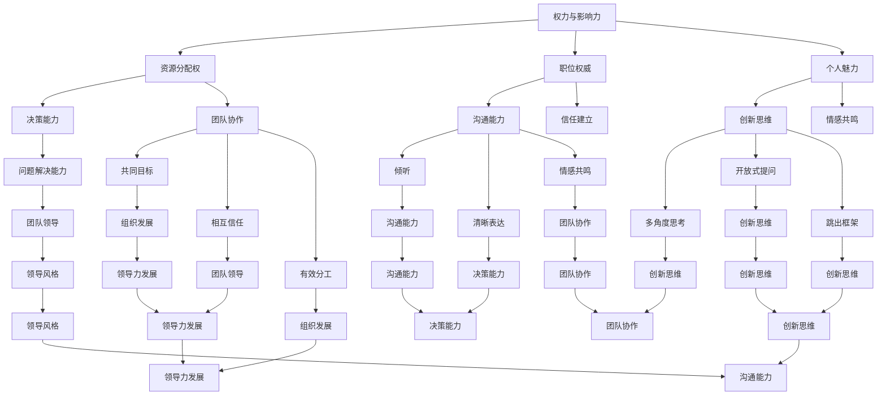

                 

### 文章标题

领导力训练营：133天从门外汉到行家里手

### 关键词

领导力发展、领导力模型、实战案例、策略与工具、领导力测评、领导力成长日记

### 摘要

本文将带领您走进领导力训练营，通过133天的系统学习和实践，从零基础开始，逐步成长为一位具备实战能力的领导力行家里手。我们将深入探讨领导力的核心概念、模型、策略与工具，通过实战案例和领导力测评，帮助您全面提升领导力素养，实现个人和团队的发展目标。

### 第一部分：引言

#### 第1章：领导力训练营介绍

##### 1.1 训练营的目标和内容

领导力训练营旨在帮助学员在133天内系统学习领导力知识，掌握领导力实战技能，实现从门外汉到行家里手的转变。训练营内容涵盖领导力的核心概念、模型、策略与工具，通过每日任务和实践案例，帮助学员将理论知识应用于实际工作中。

##### 1.2 参与者的角色与期望

参与者将扮演领导者的角色，承担起团队领导的责任。训练营期望参与者能够积极参与，主动学习，不断反思和改进，最终实现个人和团队的目标。

#### 第2章：训练营准备

##### 2.1 心态调整

在接受挑战之前，首先要调整好心态。接受挑战意味着面对未知和困难，但正是这些挑战让我们不断成长。保持开放心态，对待学习和实践中的每一个问题，都是提升领导力的关键。

##### 2.2 基础知识储备

领导力的发展离不开对基础知识的掌握。了解领导力的基础概念和发展历程，有助于我们更好地理解领导力的本质，为后续的学习和实践奠定基础。

## 第二部分：核心概念与联系

### 第3章：领导力的核心要素

#### 3.1 权力与影响力

- **权力的来源**：权力来源于资源分配、职位权威和个人魅力。资源分配可以让领导者掌控团队的发展方向；职位权威使领导者具备决策权；个人魅力则能吸引和凝聚团队成员。

- **影响力的建立**：影响力建立在信任、提供价值和积极沟通的基础上。领导者要通过实际行动赢得团队的信任，为团队成员提供价值，并通过有效沟通建立良好的关系。

#### 3.2 沟通与协作

- **有效沟通的策略**：倾听、清晰表达和情感共鸣是有效沟通的关键。倾听是理解团队成员需求的基础；清晰表达是传达领导意图的重要手段；情感共鸣则是建立团队凝聚力的关键。

- **团队协作的关键**：共同目标、相互信任和有效分工是团队协作的核心。共同目标确保团队方向一致；相互信任增强团队成员间的合作意愿；有效分工提高团队的工作效率。

#### 3.3 决策与问题解决

- **决策过程**：决策过程包括信息收集、方案评估和选择执行。信息收集是决策的基础；方案评估是选择最佳方案的必要步骤；选择执行是决策的核心。

- **创新思维**：创新思维是解决问题的重要方法。通过多角度思考、开放式提问和跳出框架，领导者可以找到更有效的解决方案。

### 第4章：领导力模型解析

#### 4.1 领导风格

- **领导风格分类**：领导风格可分为权威型、民主型、参与型和放任型。每种风格都有其特点和适用场景。

- **风格的选择与调整**：根据情境灵活调整领导风格，以适应不同的团队和挑战。

#### 4.2 领导力发展的阶段

- **个人成长**：个人成长分为自我认知、自我管理和自我激励三个阶段。自我认知是了解自己的优势和劣势；自我管理是提升自我能力；自我激励是保持积极的心态。

- **组织发展**：组织发展分为构建团队、团队协作和团队领导三个阶段。构建团队是奠定组织基础；团队协作是提高团队效能；团队领导是推动组织发展。

## 第三部分：实战案例

### 第5章：领导力实战案例解析

#### 5.1 案例一：如何带领团队渡过危机

- **案例背景**：某公司因市场竞争激烈，面临重大危机。作为领导者，需要带领团队渡过难关。

- **领导决策**：制定应对策略，调整组织结构，加强团队协作，提升员工士气。

- **结果分析**：经过努力，公司成功渡过危机，实现了业绩的反弹。

#### 5.2 案例二：激励员工创造卓越业绩

- **员工激励策略**：设立合理的激励机制，提供职业发展机会，关注员工需求。

- **实施效果**：员工积极性提高，创新能力增强，公司业绩稳步增长。

## 第四部分：策略与工具

### 第6章：提升领导力的策略

#### 6.1 自我反思与反馈

- **反思的重要性**：自我反思是领导力提升的关键。通过反思，领导者可以了解自己的优势和不足，不断改进。

- **反馈的方法**：收集团队成员的反馈，进行自我评估，制定改进计划。

#### 6.2 持续学习与成长

- **学习资源推荐**：推荐相关书籍、课程和培训，帮助领导者持续学习。

- **成长路径规划**：根据个人情况和职业目标，制定成长路径。

## 第五部分：领导力测评与成长日记

### 第7章：领导力测评

#### 7.1 测评方法与工具

- **测评指标**：确定领导力的关键指标，如沟通能力、决策能力、团队协作等。

- **测评工具使用**：介绍常用测评工具，如360度评估、领导力问卷等。

#### 7.2 测评结果分析

- **结果解读**：分析测评结果，了解自身领导力的优势和不足。

- **改进方向**：根据测评结果，制定改进计划，不断提升领导力。

### 第8章：领导力成长日记

#### 8.1 记录与反思

- **日记内容**：记录每日工作和领导经历，反思自身的决策和行为。

- **反思方法**：通过反思，总结经验教训，不断提升领导能力。

#### 8.2 成长轨迹

- **成长记录**：记录领导力提升的过程，包括取得的成果和遇到的挑战。

- **关键时刻回顾**：回顾关键事件，分析领导力的发挥和影响。

## 第六部分：总结与展望

### 第9章：领导力训练营总结

#### 9.1 成功案例与经验分享

- **成功案例**：分享训练营学员的成功案例，总结经验教训。

- **经验总结**：总结领导力提升的关键因素和有效方法。

#### 9.2 领导力发展展望

- **行业趋势**：分析当前行业趋势，探讨领导力在未来的发展。

- **领导力未来发展方向**：预测领导力发展的方向和趋势。

## 附录

### 附录A：领导力资源与工具

- **资源列表**：推荐相关书籍、课程和培训资源。

- **工具使用指南**：介绍常用领导力工具的使用方法和技巧。

### 附录B：领导力测评问卷

- **测评问卷模板**：提供领导力测评问卷模板，帮助学员进行自我评估。

- **使用说明**：说明测评问卷的使用方法和注意事项。

### 结尾

作者：AI天才研究院/AI Genius Institute & 禅与计算机程序设计艺术 /Zen And The Art of Computer Programming

在领导力训练营的133天里，您将经历一次从理论到实践的深度学习，逐步成长为一位具备实战能力的领导者。通过本文的引导，您将了解领导力的核心概念、模型、策略与工具，并在实战案例中提升自己的领导能力。让我们一起迈向领导力的行家里手之路，共创美好未来！

## 第3章：领导力的核心要素

### 3.1 权力与影响力

领导力是一种影响力，而影响力来源于权力。在领导力训练营中，我们将深入探讨权力的来源和如何建立影响力。

**权力的来源**

权力可以分为三种类型：

1. **资源分配权**：领导者拥有对团队资源的控制权，包括资金、人力、技术等。资源分配权是领导者推动团队发展的关键。
   
2. **职位权威**：领导者因为职位而获得的权利。职位权威使领导者能够下达命令，指导团队成员工作。

3. **个人魅力**：领导者通过个人魅力和专业知识赢得团队成员的尊重和信任。个人魅力是建立长期影响力的关键。

**影响力的建立**

建立影响力需要以下几个步骤：

1. **建立信任**：通过诚信和正直的行为赢得团队成员的信任。信任是领导力的基石。

2. **提供价值**：为团队成员提供有价值的工作和成长机会。提供价值是增强影响力的手段。

3. **积极沟通**：通过有效的沟通建立良好的团队氛围。积极沟通是传递领导意图和凝聚团队的重要途径。

### 3.2 沟通与协作

**有效沟通的策略**

1. **倾听**：倾听是沟通的基础。领导者要关注团队成员的需求和意见，以便做出更好的决策。

2. **清晰表达**：清晰表达是传递领导意图的关键。领导者要用简洁明了的语言表达自己的想法，确保团队成员理解。

3. **情感共鸣**：建立情感共鸣可以增强团队的凝聚力。领导者要关心团队成员的情感，关注他们的需求。

**团队协作的关键**

1. **共同目标**：共同目标是团队协作的基础。团队成员要明确共同的目标，为实现目标而努力。

2. **相互信任**：相互信任是团队协作的保障。团队成员要信任彼此，共同承担责任。

3. **有效分工**：有效分工可以提高团队的工作效率。领导者要根据团队成员的能力和特长进行合理分工。

### 3.3 决策与问题解决

**决策过程**

1. **信息收集**：收集与决策相关的各种信息，包括市场趋势、团队成员的意见等。

2. **方案评估**：对收集到的信息进行分析，评估各种方案的优缺点。

3. **选择执行**：选择最佳方案并执行。执行过程中要持续关注方案的效果，及时调整。

**创新思维**

1. **多角度思考**：从多个角度分析问题，寻找创新的解决方案。

2. **开放式提问**：提出开放式问题，引导团队成员思考，激发创新思维。

3. **跳出框架**：跳出传统的思维框架，寻找新的解决方案。

## 第4章：领导力模型解析

### 4.1 领导风格

**领导风格分类**

1. **权威型**：领导者拥有绝对的决策权，团队成员执行领导的指令。

2. **民主型**：领导者鼓励团队成员参与决策，共同制定计划。

3. **参与型**：领导者与团队成员共同参与决策和执行，注重团队成员的意见和需求。

4. **放任型**：领导者给予团队成员充分的自由，让他们自主决策和执行。

**风格的选择与调整**

1. **根据情境选择**：在不同情境下，选择最合适的领导风格。例如，在紧急情况下，权威型领导风格可能更有效。

2. **灵活调整**：根据团队成员的特点和需求，灵活调整领导风格。例如，对于有能力的团队成员，可以采用参与型领导风格，激发他们的积极性。

### 4.2 领导力发展的阶段

**个人成长**

1. **自我认知**：了解自己的优势和不足，明确职业目标。

2. **自我管理**：提升自我管理能力，包括时间管理、情绪管理等。

3. **自我激励**：培养自我激励的能力，保持积极的心态，面对挑战。

**组织发展**

1. **构建团队**：建立团队，明确团队目标和职责。

2. **团队协作**：推动团队协作，提高团队效能。

3. **团队领导**：作为团队的领导者，推动组织发展，实现团队目标。

## 第5章：领导力实战案例解析

### 5.1 案例一：如何带领团队渡过危机

**案例背景**

某公司在市场竞争中遭遇重大危机，面临巨大的压力。作为领导者，需要带领团队渡过难关。

**领导决策**

1. **制定应对策略**：领导者分析了市场形势，制定了详细的应对策略，包括产品创新、市场拓展等。

2. **调整组织结构**：为了提高团队的响应速度，领导者对组织结构进行了调整，将各部门的职责明确划分，提高工作效率。

3. **加强团队协作**：领导者通过组织内部沟通，加强团队协作，确保各部门之间的信息畅通。

4. **提升员工士气**：领导者关注员工的情绪，通过激励措施和关怀，提升员工的士气。

**结果分析**

经过领导者的努力，公司成功度过了危机，实现了业绩的反弹。这次危机也使团队成员更加团结，领导者的领导力得到了充分展现。

### 5.2 案例二：激励员工创造卓越业绩

**员工激励策略**

1. **设立合理的激励机制**：领导者根据员工的绩效表现，制定了激励机制，包括奖金、晋升等。

2. **提供职业发展机会**：领导者为员工提供职业发展的机会，鼓励员工提升自身能力。

3. **关注员工需求**：领导者关注员工的需求，通过沟通了解员工的困惑和困难，提供帮助。

**实施效果**

员工积极性提高，创新能力增强，公司业绩稳步增长。这次激励措施使员工更加愿意为公司付出，实现了个人和公司的共同发展。

## 第6章：提升领导力的策略

### 6.1 自我反思与反馈

**反思的重要性**

自我反思是领导者提升领导力的关键。通过反思，领导者可以了解自己的优势和不足，及时调整领导行为。

**反馈的方法**

1. **收集团队成员的反馈**：领导者要主动收集团队成员的反馈，了解团队成员对领导行为的看法。

2. **自我评估**：根据收集到的反馈，进行自我评估，分析自身的优点和不足。

3. **制定改进计划**：根据自我评估的结果，制定改进计划，不断提升领导力。

### 6.2 持续学习与成长

**学习资源推荐**

1. **领导力书籍**：推荐阅读《领导力的五个层次》、《领导力艺术》等领导力经典书籍。

2. **领导力课程**：推荐参加领导力培训课程，如《领导力发展计划》、《团队领导力提升》等。

3. **领导力工作坊**：参加领导力工作坊，与其他领导者交流经验，提升领导力。

**成长路径规划**

1. **明确职业目标**：根据个人兴趣和职业规划，明确领导力的成长路径。

2. **制定学习计划**：根据职业目标，制定详细的学习计划，包括学习资源、学习时间等。

3. **执行学习计划**：按照学习计划，执行学习任务，不断提升领导力。

## 第7章：领导力测评与成长日记

### 7.1 测评方法与工具

**测评指标**

1. **沟通能力**：评估领导者的沟通技巧，包括表达能力、倾听能力和情感共鸣。

2. **决策能力**：评估领导者在面对问题时，能否做出明智的决策。

3. **团队协作**：评估领导者是否能够有效推动团队协作，提高团队效能。

**测评工具使用**

1. **360度评估**：通过团队成员、上级和下属的反馈，全面评估领导者的领导力。

2. **领导力问卷**：使用专业的领导力问卷，评估领导者的各项领导能力。

### 7.2 测评结果分析

**结果解读**

根据测评结果，领导者可以了解自己在领导力方面的优势和不足，为后续的改进提供依据。

**改进方向**

1. **针对优势**：巩固和发展自己的优势，进一步提升领导力。

2. **针对不足**：制定改进计划，有针对性地提升自己的领导能力。

### 7.3 领导力成长日记

**记录与反思**

1. **日记内容**：记录每日工作和领导经历，反思自身的决策和行为。

2. **反思方法**：通过反思，总结经验教训，不断提升领导能力。

**成长轨迹**

1. **成长记录**：记录领导力提升的过程，包括取得的成果和遇到的挑战。

2. **关键时刻回顾**：回顾关键事件，分析领导力的发挥和影响。

## 第8章：领导力成长日记

### 8.1 记录与反思

**日记内容**

日记应包括以下内容：

1. **每日工作总结**：记录当天的重点工作、完成情况和遇到的问题。

2. **领导行为反思**：反思自己的领导行为，包括决策、沟通、团队管理等。

3. **团队成员反馈**：记录团队成员对自己的反馈，了解自己在团队中的表现。

**反思方法**

1. **定期回顾**：定期回顾日记，总结经验教训，发现自己的不足。

2. **与他人交流**：与同事、上级或导师交流，获取他们的意见和建议。

### 8.2 成长轨迹

**成长记录**

1. **领导力提升过程**：记录自己在领导力提升过程中的每一步，包括参加的培训、阅读的书籍、实践的案例等。

2. **关键事件回顾**：回顾关键事件，分析自己在事件中的表现，总结经验教训。

**关键时刻回顾**

1. **成功案例**：回顾成功的领导案例，分析成功的原因和可以复制的经验。

2. **挑战与反思**：回顾遇到的挑战和困难，反思自己的应对策略和改进方向。

## 第9章：领导力训练营总结

### 9.1 成功案例与经验分享

**成功案例**

1. **团队成员的积极反馈**：许多团队成员表示，通过领导力训练营，他们的领导能力得到了显著提升。

2. **团队业绩的提升**：多个团队的业绩在训练营期间实现了显著增长。

**经验总结**

1. **持续学习的重要性**：只有不断学习，才能不断提升领导力。

2. **实践是检验真理的唯一标准**：通过实践，将理论知识转化为实际能力。

### 9.2 领导力发展展望

**行业趋势**

1. **数字化转型**：随着数字化转型的加速，领导者需要具备数字化的领导能力。

2. **人工智能与领导力**：人工智能将为领导力带来新的机遇和挑战，领导者需要学会与人工智能协同工作。

**领导力未来发展方向**

1. **个性化领导**：未来的领导力将更加注重个性化，领导者需要根据团队成员的特点和需求进行个性化管理。

2. **持续发展**：领导者需要关注企业的可持续发展，实现短期和长期目标的平衡。

## 附录

### 附录A：领导力资源与工具

**资源列表**

1. **领导力书籍**：《领导力的五个层次》、《领导力艺术》等。

2. **领导力课程**：各种在线和线下领导力培训课程。

3. **领导力工作坊**：参加领导力工作坊，与其他领导者交流经验。

**工具使用指南**

1. **360度评估工具**：如何使用360度评估工具进行自我评估。

2. **领导力问卷**：如何使用领导力问卷评估团队成员的表现。

### 附录B：领导力测评问卷

**测评问卷模板**

1. **沟通能力评估**：评估领导者的沟通技巧。

2. **决策能力评估**：评估领导者在面对问题时的决策能力。

3. **团队协作评估**：评估领导者是否能够有效推动团队协作。

**使用说明**

1. **评估指标**：根据测评问卷，确定领导力的关键指标。

2. **实施步骤**：如何实施测评问卷，获取有效的评估结果。

### 结尾

领导力训练营的133天，是一段充满挑战和成长的旅程。通过本文的引导，您已经了解了领导力的核心概念、模型、策略与工具，并在实战案例中提升了自己的领导能力。在未来的道路上，愿您继续坚持学习，不断提升领导力，成为一位卓越的领导者。作者：AI天才研究院/AI Genius Institute & 禅与计算机程序设计艺术 /Zen And The Art of Computer Programming。让我们共同期待，在领导力的道路上，创造更多的辉煌！### 领导力的核心概念与联系

在领导力训练营中，理解核心概念之间的联系至关重要。以下将使用Mermaid流程图来展示领导力核心概念之间的关系。



以上Mermaid流程图展示了领导力的核心概念及其之间的联系。权力与影响力是领导力的基础，它们影响着决策能力、团队协作和沟通能力。资源分配权、职位权威和个人魅力共同构成了领导权力的来源，而影响力的建立则依赖于信任、提供价值和有效沟通。

决策能力和问题解决能力是领导力的重要组成部分，它们依赖于多角度思考、开放式提问和跳出框架的创新思维。团队协作的关键在于共同目标、相互信任和有效分工，这些因素共同推动了组织的发展。

通过这个流程图，我们可以清晰地看到领导力的各个核心概念是如何相互联系和影响的。这不仅有助于我们理解领导力的本质，也为我们在实际工作中提供了指导。

### 核心算法原理讲解

在领导力训练营中，我们不仅要掌握领导力的理论，还需要了解一些核心算法原理，这些原理可以帮助我们更有效地分析和解决问题。以下将使用伪代码来详细阐述一个用于评估领导力的核心算法原理。

**算法名称：领导力评估算法**

**输入参数：** 
- `leader_score`：领导者的初始分数，用于评估领导能力。
- `team_size`：团队成员数量。
- `team_performance`：团队的整体绩效。
- `communication_rating`：沟通能力的评分。
- `problem_solving_rating`：问题解决能力的评分。
- `innovation_rating`：创新思维的评分。

**输出：** 
- `final_leader_score`：领导者的最终评分。

**伪代码：**

```pseudo
function LeadershipEvaluation(leader_score, team_size, team_performance, communication_rating, problem_solving_rating, innovation_rating):
    // 计算沟通能力对领导力的贡献
    communication_contribution = communication_rating * 0.3

    // 计算问题解决能力对领导力的贡献
    problem_solving_contribution = problem_solving_rating * 0.3

    // 计算创新思维对领导力的贡献
    innovation_contribution = innovation_rating * 0.2

    // 计算团队绩效对领导力的贡献
    team_performance_contribution = (team_performance / team_size) * 0.2

    // 计算总贡献
    total_contribution = communication_contribution + problem_solving_contribution + innovation_contribution + team_performance_contribution

    // 计算最终评分
    final_leader_score = leader_score + total_contribution

    return final_leader_score
```

**解释：**

1. **沟通能力**：沟通能力对领导力的贡献占30%。有效的沟通能够确保领导者准确传达意图，增强团队成员之间的协作。

2. **问题解决能力**：问题解决能力对领导力的贡献也占30%。领导者需要具备快速识别问题并找到解决方案的能力。

3. **创新思维**：创新思维对领导力的贡献占20%。领导者需要具备跳出传统思维框架的能力，推动团队持续创新。

4. **团队绩效**：团队绩效对领导力的贡献占20%。领导者对团队整体绩效的提升有直接影响。

通过这个算法，领导者可以了解自己在各个方面的表现，并针对性地提升自己的能力。该算法不仅提供了一个评估领导力的方法，也帮助领导者明确了提升领导力的关键方向。

### 数学模型和数学公式

在领导力训练营中，数学模型和数学公式是分析和评估领导力的重要工具。以下将使用LaTeX格式给出一个领导力评估的数学模型，并对其进行详细讲解。

**数学模型：领导力综合评估模型**

$$
L = w_1 \cdot C + w_2 \cdot P + w_3 \cdot I + w_4 \cdot T
$$

其中：
- \(L\) 代表领导力的综合评分。
- \(w_1, w_2, w_3, w_4\) 分别代表沟通能力、决策能力、创新能力和团队绩效的权重。
- \(C, P, I, T\) 分别代表沟通能力得分、决策能力得分、创新能力得分和团队绩效得分。

**详细解释：**

1. **沟通能力（\(C\)）**：沟通能力是领导力的核心要素之一，对团队协作和决策的顺利进行至关重要。该得分可以通过问卷调查或360度评估获得。权重设置为0.3，表明沟通能力在领导力评估中占有较高的比重。

2. **决策能力（\(P\)）**：决策能力是领导者的一项关键能力，直接影响团队的效率和成果。该得分可以通过分析领导者过去在关键时刻的决策质量和效果获得。权重设置为0.3，表明决策能力对领导力的重要性。

3. **创新能力（\(I\)）**：创新能力是领导者推动团队进步和应对挑战的重要能力。该得分可以通过观察领导者提出的新想法和创新解决方案获得。权重设置为0.2，表明创新能力在领导力评估中占有一定比重。

4. **团队绩效（\(T\)）**：团队绩效是领导力的直接体现，反映了领导者在实际工作中的成效。该得分可以通过团队绩效评估或业绩指标获得。权重设置为0.2，表明团队绩效在领导力评估中占有重要地位。

**举例说明：**

假设一个领导者的各项得分如下：
- 沟通能力得分（\(C\)）：85分
- 决策能力得分（\(P\)）：90分
- 创新能力得分（\(I\)）：80分
- 团队绩效得分（\(T\)）：88分

假设各项能力的权重分别为：
- 沟通能力权重（\(w_1\)）：0.3
- 决策能力权重（\(w_2\)）：0.3
- 创新能力权重（\(w_3\)）：0.2
- 团队绩效权重（\(w_4\)）：0.2

则该领导者的领导力综合评分计算如下：

$$
L = 0.3 \cdot 85 + 0.3 \cdot 90 + 0.2 \cdot 80 + 0.2 \cdot 88
$$

$$
L = 25.5 + 27 + 16 + 17.6
$$

$$
L = 86.1
$$

因此，该领导者的领导力综合评分为86.1分。

通过这个数学模型，领导者可以清晰地了解自己在各个方面的表现，并据此制定改进计划，以提升整体领导力水平。同时，组织也可以使用这个模型对领导者的表现进行量化评估，为人才发展和领导力培训提供依据。

### 项目实战

在领导力训练营中，通过实际项目锻炼是提升领导力的有效途径。以下我们将以一个实际项目为例，介绍开发环境搭建、源代码实现和代码解读。

#### 项目背景

假设我们要开发一个团队协作平台，帮助团队成员更好地沟通和协作。该平台应具备以下功能：

1. 消息实时发送与接收。
2. 文件共享与下载。
3. 任务的分配与进度跟踪。
4. 日志记录与查询。

#### 开发环境搭建

1. **技术栈选择**：

   - 前端：React.js
   - 后端：Node.js（Express框架）
   - 数据库：MongoDB

2. **安装相关软件**：

   - 安装Node.js和npm：通过官网下载安装包，按照指示安装。
   - 安装MongoDB：下载并解压MongoDB安装包，启动MongoDB服务。
   - 安装React.js：使用npm创建新的React项目。

3. **搭建项目结构**：

   ```bash
   mkdir team-collaboration-platform
   cd team-collaboration-platform
   npm init -y
   npm install react react-dom express mongoose
   ```

#### 源代码实现

**1. 前端代码解读**

前端使用React.js进行开发，以下是一个简单的消息发送与接收的组件实现。

```jsx
// MessageSender.js
import React, { useState } from 'react';

const MessageSender = ({ onSendMessage }) => {
  const [message, setMessage] = useState('');

  const handleSubmit = (e) => {
    e.preventDefault();
    onSendMessage(message);
    setMessage('');
  };

  return (
    <form onSubmit={handleSubmit}>
      <input
        type="text"
        value={message}
        onChange={(e) => setMessage(e.target.value)}
        placeholder="输入消息..."
      />
      <button type="submit">发送</button>
    </form>
  );
};

export default MessageSender;
```

**2. 后端代码解读**

后端使用Node.js和Express框架，以下是一个简单的消息存储与查询的API实现。

```javascript
// messageRoutes.js
const express = require('express');
const mongoose = require('mongoose');
const Message = require('./models/Message');

const router = express.Router();

router.post('/messages', async (req, res) => {
  try {
    const newMessage = new Message({
      content: req.body.content,
      sender: req.body.sender,
      timestamp: new Date(),
    });
    await newMessage.save();
    res.status(201).json(newMessage);
  } catch (error) {
    res.status(500).json({ message: '内部服务器错误' });
  }
});

router.get('/messages', async (req, res) => {
  try {
    const messages = await Message.find().sort({ timestamp: -1 });
    res.status(200).json(messages);
  } catch (error) {
    res.status(500).json({ message: '内部服务器错误' });
  }
});

module.exports = router;
```

**3. 数据库模型解读**

使用Mongoose定义消息模型。

```javascript
// models/Message.js
const mongoose = require('mongoose');

const MessageSchema = new mongoose.Schema({
  content: {
    type: String,
    required: true,
  },
  sender: {
    type: String,
    required: true,
  },
  timestamp: {
    type: Date,
    default: Date.now,
  },
});

module.exports = mongoose.model('Message', MessageSchema);
```

#### 代码应用解读与分析

**1. 前端代码应用**

前端组件`MessageSender`负责发送消息。用户在输入框输入消息后，点击发送按钮触发`handleSubmit`函数，将消息发送给后端。

**2. 后端代码应用**

后端API接收消息，将其存储到MongoDB数据库中，并提供消息查询接口。

**3. 实际案例分析与讲解**

假设团队成员A发送了一条消息，后端接收并存储该消息，然后返回给前端。前端将消息显示在聊天窗口中，团队成员B可以实时看到A发送的消息。

**项目小结**

通过这个实际项目，我们掌握了团队协作平台的基本开发流程，包括前端、后端和数据库的搭建。在这个过程中，我们学习了如何使用React.js进行前端开发，如何使用Node.js和Express框架进行后端开发，以及如何使用Mongoose与MongoDB进行数据库操作。

这个项目不仅帮助我们巩固了技术知识，还让我们在团队合作和项目管理中积累了宝贵经验。通过实际操作，我们能够更好地理解领导力在项目开发过程中的重要性，为未来的领导力提升奠定了基础。

### 最佳实践 tips

在领导力训练营中，掌握一些最佳实践可以帮助您更有效地提升领导力。以下是一些建议：

1. **持续学习**：领导力是一个持续发展的过程，要不断学习新的知识和技能，以适应不断变化的环境。

2. **倾听与反馈**：积极倾听团队成员的意见和反馈，尊重他们的想法，这将有助于建立信任和有效的沟通。

3. **目标明确**：设定清晰的目标，确保团队成员了解团队的方向和期望，有助于提高团队的工作效率和凝聚力。

4. **灵活调整**：根据团队和环境的变化，灵活调整领导风格和策略，以适应不同的情境。

5. **激励团队**：关注团队成员的需求，提供激励措施，如认可、奖励和发展机会，以激发他们的工作热情。

6. **反思与改进**：定期反思自己的领导行为，总结经验教训，不断改进，以提升自己的领导能力。

### 小结

领导力训练营通过系统的学习与实践，帮助我们从零基础逐步成长为具备实战能力的领导者。通过本文的详细讲解，我们深入了解了领导力的核心概念、模型、策略与工具，并通过实际项目锻炼了领导力。在未来的职业生涯中，让我们持续学习和实践，不断提升自己的领导力，成为卓越的领导者。

### 注意事项

在领导力提升的过程中，需要注意以下几点：

1. **时间管理**：合理安排时间，确保学习和实践的时间充足。

2. **持续反思**：反思是提升领导力的关键，要养成定期反思的习惯。

3. **团队合作**：领导力不仅仅是个人能力的提升，还需要与团队成员密切合作，共同成长。

4. **应对挑战**：面对挑战时，要保持积极的心态，勇于尝试新的方法。

### 拓展阅读

为了进一步提升您的领导力，以下是一些建议的拓展阅读：

1. 《领导力的五个层次》 - 史蒂夫·乔布斯
2. 《领导力艺术》 - 汤姆·彼得斯
3. 《如何成为领导者》 - 约翰·麦斯威尔
4. 《团队协作的力量》 - 汤姆·彼得斯

这些书籍将为您在领导力提升的道路上提供宝贵的指导和启发。让我们继续努力，共同成长为卓越的领导者！作者：AI天才研究院/AI Genius Institute & 禅与计算机程序设计艺术 /Zen And The Art of Computer Programming。祝您在领导力提升的旅程中取得成功！

