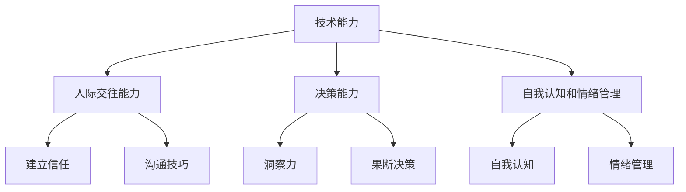

                 

### 文章标题：领导力训练营：14天从菜鸟到大神

### 关键词：领导力、培养方法、案例分析、团队协作

### 摘要：
本文将带领您进行一场为期14天的领导力训练营，通过详细解析领导力的核心概念、培养方法、实际应用和案例分析，帮助您从菜鸟迅速成长为领导力的大神。文章结构清晰，逻辑严密，旨在为读者提供全面、系统的领导力提升指南。

### 目录

**第一部分：领导力基础概念与模型**

1. **领导力核心概念与联系**
   - 1.1 领导力的定义
   - 1.2 领导力与管理的区别
   - 1.3 领导力的四个维度
   - 1.4 领导力的Mermaid流程图

**第二部分：领导力培养方法与实践**

2. **自我认知与情绪管理**
   - 2.1 自我认知的重要性
   - 2.2 情绪管理技巧
   - 2.3 自我提升与职业发展

3. **沟通技巧与团队协作**
   - 3.1 有效沟通的要素
   - 3.2 沟通障碍与解决策略
   - 3.3 团队协作与冲突管理

4. **决策能力与战略规划**
   - 4.1 决策能力的重要性
   - 4.2 决策过程分析
   - 4.3 战略规划与执行

**第三部分：领导力在实际工作中的应用**

5. **项目管理与团队领导**
   - 5.1 项目管理的基本原则
   - 5.2 项目计划与执行
   - 5.3 团队领导力与激励

6. **变革管理与企业文化**
   - 6.1 变革管理的挑战
   - 6.2 变革管理策略
   - 6.3 企业文化建设与领导力

**第四部分：领导力案例分析**

7. **领导力经典案例**
   - 7.1 案例一：乔布斯的领导艺术
   - 7.2 案例二：谷歌的管理哲学
   - 7.3 案例三：华为的领导力实践

### 文章正文

#### 引言

领导力是一种至关重要的能力，无论是在企业管理、团队协作，还是在日常的工作与生活中，都具有举足轻重的地位。然而，领导力并非与生俱来，而是可以通过后天的学习和实践逐步培养和提升。本文将带领您进行一场为期14天的领导力训练营，通过详细解析领导力的核心概念、培养方法、实际应用和案例分析，帮助您从菜鸟迅速成长为领导力的大神。

本文结构清晰，逻辑严密，分为四个部分：

- **第一部分：领导力基础概念与模型**，帮助您建立对领导力的初步认识。
- **第二部分：领导力培养方法与实践**，介绍具体的方法和实践技巧。
- **第三部分：领导力在实际工作中的应用**，探讨领导力在项目管理、团队领导和企业文化等实际场景中的应用。
- **第四部分：领导力案例分析**，通过经典案例深入剖析领导力的实践。

现在，让我们开始这场领导力之旅吧！

#### 第一部分：领导力基础概念与模型

**第1章：领导力核心概念与联系**

**1.1 领导力的定义**

领导力是指一个人在组织、团队或个人中，通过影响、激励和引导他人，实现共同目标的能力。领导力不仅仅与职位和权力相关，更是一种行为和思维模式。一个优秀的领导者，不仅能够带领团队达成目标，还能够激发团队成员的潜能，实现共同成长。

**1.2 领导力与管理的区别**

领导力和管理是两个紧密相关但又有区别的概念。管理侧重于组织和协调资源，确保工作高效有序地进行；而领导力则更侧重于影响和激励他人，推动组织或团队实现更大的目标。

- 管理是“做事”，而领导力是“做正确的事”。
- 管理关注流程和规则，领导力关注愿景和目标。
- 管理关注当下，领导力关注未来。

**1.3 领导力的四个维度**

领导力可以从四个维度进行理解：

1. **技术能力**：领导者需要具备相关的专业技能和知识，以确保团队的工作能够顺利进行。
2. **人际交往能力**：领导者需要具备良好的人际交往能力，能够与团队成员建立信任和合作关系。
3. **决策能力**：领导者需要具备敏锐的洞察力和果断的决策能力，能够在复杂和不确定的环境中做出正确的决策。
4. **自我认知和情绪管理**：领导者需要具备良好的自我认知和情绪管理能力，能够控制自己的情绪，保持冷静和理智。

**1.4 领导力的Mermaid流程图**

为了更好地理解领导力的各个维度，我们可以使用Mermaid流程图进行可视化展示：



#### 第二部分：领导力培养方法与实践

**第2章：自我认知与情绪管理**

**2.1 自我认知的重要性**

自我认知是领导力的基石。一个优秀的领导者首先需要了解自己，包括自己的优点、缺点、价值观和动机。通过自我认知，领导者可以更好地发挥自己的优势，克服自己的不足，实现个人和团队的成长。

**2.2 情绪管理技巧**

情绪管理是领导力的重要组成部分。领导者需要具备良好的情绪管理能力，能够控制自己的情绪，避免因情绪波动而影响决策和行为。

- **呼吸法**：通过深呼吸，缓解紧张和焦虑。
- **积极思考**：用积极的角度看待问题，避免消极情绪的蔓延。
- **求助**：在面对情绪问题时，及时寻求专业帮助。

**2.3 自我提升与职业发展**

自我提升是领导力培养的重要途径。领导者需要不断学习新知识、新技能，提升自己的专业能力和综合素质。

- **读书**：通过阅读，拓宽视野，提升思维。
- **培训**：参加专业培训和研讨会，学习先进的管理理念和技巧。
- **实践**：通过实际工作，积累经验，提升能力。

#### 第三部分：领导力在实际工作中的应用

**第3章：沟通技巧与团队协作**

**3.1 有效沟通的要素**

有效沟通是领导者必须掌握的技能。有效沟通包括以下几个方面：

- **明确目标**：明确沟通的目标和目的。
- **倾听**：倾听对方的意见和需求，理解对方的观点。
- **表达**：清晰、准确地表达自己的观点和意见。
- **反馈**：给予对方及时的反馈，确认信息的准确性和理解度。

**3.2 沟通障碍与解决策略**

沟通障碍是有效沟通的主要障碍。解决沟通障碍的策略包括：

- **明确沟通规则**：制定明确的沟通规则和流程，确保沟通的顺畅。
- **主动沟通**：主动寻求沟通，避免误解和冲突。
- **寻求帮助**：在沟通遇到困难时，及时寻求帮助。

**3.3 团队协作与冲突管理**

团队协作是领导力的重要体现。领导者需要构建一个高效的团队，确保团队成员能够协同工作，实现共同的目标。

- **明确角色和职责**：明确每个团队成员的角色和职责，确保工作的高效。
- **建立信任**：建立团队信任，促进团队成员之间的合作。
- **解决冲突**：在团队协作中，冲突是不可避免的。领导者需要具备解决冲突的能力，确保团队的和谐。

#### 第四部分：领导力案例分析

**第4章：领导力经典案例**

**4.1 案例一：乔布斯的领导艺术**

乔布斯是苹果公司的创始人之一，他的领导艺术对全球科技产业产生了深远的影响。乔布斯的领导力体现在以下几个方面：

- **愿景驱动**：乔布斯始终坚守自己的愿景，为团队设定明确的目标。
- **创新精神**：乔布斯鼓励创新，推动苹果公司不断推出革命性的产品。
- **激励团队**：乔布斯通过激励和鼓励，激发团队成员的潜能。

**4.2 案例二：谷歌的管理哲学**

谷歌以其独特的管理哲学而闻名。谷歌的管理哲学包括以下几个方面：

- **人才优先**：谷歌重视人才，为员工提供良好的工作环境和成长空间。
- **创新文化**：谷歌鼓励创新，为员工提供自由发挥的空间。
- **用户至上**：谷歌始终将用户需求放在首位，提供优质的产品和服务。

**4.3 案例三：华为的领导力实践**

华为是全球领先的电信设备供应商，其领导力实践对企业管理具有重要的借鉴意义。华为的领导力实践包括以下几个方面：

- **以客户为中心**：华为始终以客户需求为导向，为客户提供优质的服务。
- **持续创新**：华为重视技术创新，持续推动企业的发展。
- **人才培养**：华为重视人才培养，为员工提供良好的成长环境。

#### 结语

领导力是一种重要的能力，无论是在企业管理、团队协作，还是在日常的工作与生活中，都具有举足轻重的地位。通过本文的领导力训练营，我们详细解析了领导力的核心概念、培养方法、实际应用和案例分析，帮助您从菜鸟迅速成长为领导力的大神。

让我们一起努力，提升自己的领导力，成为更好的自己！作者：AI天才研究院/AI Genius Institute & 禅与计算机程序设计艺术 /Zen And The Art of Computer Programming

### 步骤4：编写伪代码、数学公式和代码解读

#### 伪代码示例：情绪管理函数

```python
## 2.2 情绪管理技巧

def manage_emotions(emotion, intensity):
    """
    管理特定情绪和情绪强度。

    参数：
    - emotion (str)：情绪类型（如：快乐、悲伤、愤怒等）
    - intensity (int)：情绪强度（0-10）

    返回：
    - 处理后的情绪状态（str）
    """

    if emotion == "快乐":
        if intensity <= 5:
            return "愉快的状态"
        else:
            return "过于兴奋，需要冷静下来"
    elif emotion == "悲伤":
        if intensity <= 3:
            return "轻微的悲伤，可以自我调节"
        else:
            return "严重的悲伤，需要寻求帮助"
    elif emotion == "愤怒":
        if intensity <= 3:
            return "轻微的愤怒，可以通过呼吸调整"
        else:
            return "极度愤怒，需寻求冷静方法"
```

#### 数学公式示例：领导力得分计算

$$
L = \frac{E \times C \times I}{D}
$$

其中：
- \( E \)：情绪智力（Emotional Intelligence）
- \( C \)：认知智力（Cognitive Intelligence）
- \( I \)：影响力（Influence）
- \( D \)：决策能力（Decision Making）

#### 代码解读示例：情绪管理函数详解

```python
def manage_emotions(emotion, intensity):
    """
    管理特定情绪和情绪强度。

    参数：
    - emotion (str)：情绪类型（如：快乐、悲伤、愤怒等）
    - intensity (int)：情绪强度（0-10）

    返回：
    - 处理后的情绪状态（str）
    """

    # 根据情绪类型和强度，返回相应的情绪状态
    if emotion == "快乐":
        if intensity <= 5:
            return "愉快的状态"  # 情绪强度在0-5之间，为愉快状态
        else:
            return "过于兴奋，需要冷静下来"  # 情绪强度超过5，过于兴奋需要冷静
    elif emotion == "悲伤":
        if intensity <= 3:
            return "轻微的悲伤，可以自我调节"  # 情绪强度在0-3之间，轻微悲伤可以自我调节
        else:
            return "严重的悲伤，需要寻求帮助"  # 情绪强度超过3，严重的悲伤需要寻求帮助
    elif emotion == "愤怒":
        if intensity <= 3:
            return "轻微的愤怒，可以通过呼吸调整"  # 情绪强度在0-3之间，轻微愤怒可以通过呼吸调整
        else:
            return "极度愤怒，需寻求冷静方法"  # 情绪强度超过3，极度愤怒需要寻求冷静方法
```

这段代码是一个情绪管理函数，它接受两个参数：情绪类型（如“快乐”、“悲伤”、“愤怒”）和情绪强度（0-10之间的整数）。根据情绪类型和强度，函数返回相应的情绪状态。这是一个简单的决策过程，通过条件判断来决定返回的情绪状态。

#### 最佳实践 Tips、小结、注意事项、拓展阅读

**最佳实践 Tips：**

1. **自我认知与情绪管理**：定期进行自我反思，了解自己的情绪变化，采取适当的情绪管理方法。
2. **沟通技巧与团队协作**：注重倾听，积极表达，建立良好的沟通渠道，促进团队协作。
3. **决策能力与战略规划**：在面对决策时，充分考虑各种因素，制定合理的决策方案。

**小结：**

本文通过14天的领导力训练营，详细介绍了领导力的核心概念、培养方法、实际应用和案例分析。通过本文的学习，您将能够：

1. 了解领导力的定义、维度和重要性。
2. 掌握自我认知与情绪管理、沟通技巧与团队协作、决策能力与战略规划等领导力培养方法。
3. 学会运用领导力在实际工作中的应用，提升项目管理和团队领导能力。
4. 分析经典领导力案例，汲取成功经验。

**注意事项：**

1. 领导力是一个持续学习和提升的过程，需要不断实践和反思。
2. 不同场景和情境下，领导力应用的具体方法和策略可能会有所不同，需要根据实际情况灵活调整。

**拓展阅读：**

1. 《领导力的五个层次》作者：史蒂芬·柯维
2. 《非暴力沟通》作者：马歇尔·卢森堡
3. 《改变世界的领导力》作者：约翰·麦克斯韦尔

通过拓展阅读，您可以进一步深入理解和应用领导力，提升自己的领导力水平。作者：AI天才研究院/AI Genius Institute & 禅与计算机程序设计艺术 /Zen And The Art of Computer Programming

