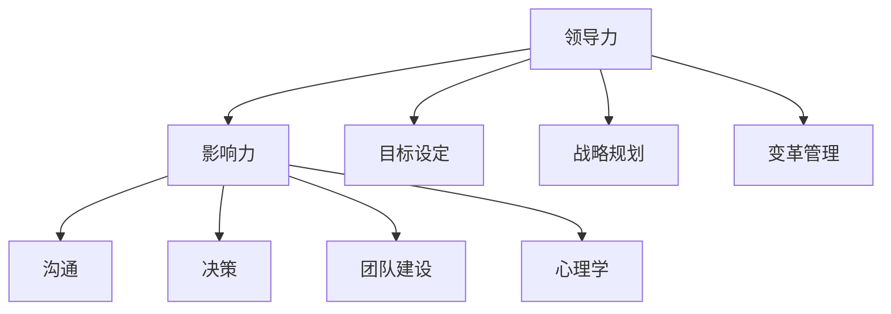
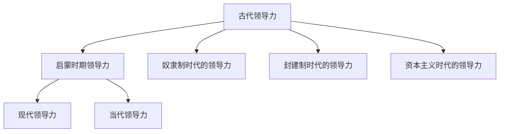
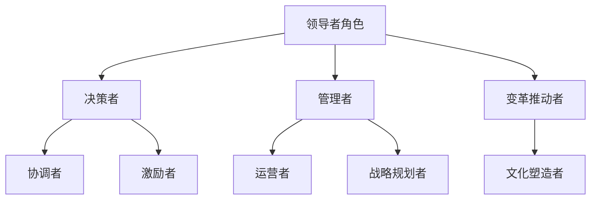
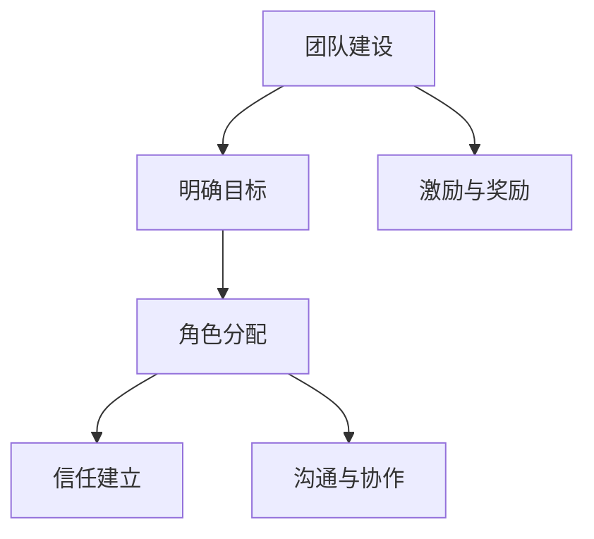
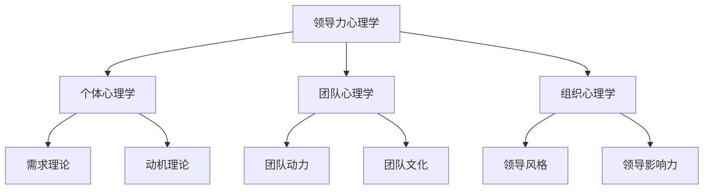
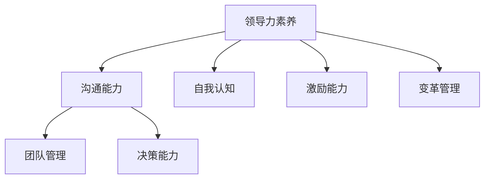

                 


### 文章标题：领导力训练营：154天从新手到高手

#### 关键词：领导力、训练营、新手到高手、职场发展

#### 摘要：
本文旨在为那些希望提升领导力的职场新手和有一定基础但想进一步提升的职场人士提供一个完整的领导力成长路径。通过详细的步骤分析和实际案例分享，本文将带领读者在154天内从领导力新手成长为行业高手。

### 目录大纲：

## 引言
- **背景介绍**
- **核心概念与联系**
  - **图1.1 领导力的核心概念流程图**

## 第1章：领导力的定义与核心概念
- **核心概念与联系**
  - **图1.2 领导力的定义与关系架构**
- **核心算法原理讲解**
  - **伪代码1.1 领导力发展的基本算法**

## 第2章：领导力的发展历史
- **核心概念与联系**
  - **图2.1 领导力发展历史的里程碑**

## 第3章：领导者角色与职责
- **核心概念与联系**
  - **图3.1 领导者角色的层次结构**

## 第4章：沟通技巧
- **核心算法原理讲解**
  - **伪代码4.1 高效沟通的算法**

## 第5章：团队建设
- **核心概念与联系**
  - **图5.1 团队建设的流程图**

## 第6章：决策能力
- **核心算法原理讲解**
  - **伪代码6.1 决策过程的基本算法**

## 第7章：领导力心理学
- **核心概念与联系**
  - **图7.1 领导力心理学的基本模型**

## 第8章：领导力工具与方法
- **项目实战**
  - **案例8.1 领导力工具的应用案例**
  - **代码8.1 领导力工具的源代码解析**

## 第9章：领导力在项目中的运用
- **项目实战**
  - **案例9.1 领导力在项目管理的应用**
  - **代码9.1 领导力在项目管理的代码实现**

## 第10章：领导力在团队管理中的应用
- **项目实战**
  - **案例10.1 领导力在团队管理中的应用**
  - **代码10.1 领导力在团队管理的代码实现**

## 第11章：经典领导力案例
- **案例分析**
  - **案例11.1 史蒂夫·乔布斯与苹果公司**

## 第12章：个人领导力成长故事
- **个人成长故事**
  - **故事12.1 我从新手到高手**

## 第13章：自我领导力评估
- **工具与方法**
  - **图13.1 自我领导力评估模型**

## 第14章：领导力发展计划
- **规划与实施**
  - **图14.1 领导力发展计划的步骤**

## 第15章：领导力持续发展
- **未来趋势**
  - **图15.1 领导力持续发展的关键因素**

### 结论
- **最佳实践 tips**
- **小结**
- **注意事项**
- **拓展阅读**

---

### 引言

在当今这个快速变化的时代，领导力已经成为职场成功的关键因素。无论是在企业、政府机构还是非营利组织，领导者都需要具备出色的领导力，以应对复杂多变的环境和挑战。然而，许多职场人士在领导力方面感到困惑，不知道如何从新手成长为高手。

为了解决这个问题，我们设计了《领导力训练营：154天从新手到高手》这本书。本书将通过详细的步骤分析和实际案例分享，帮助读者在154天内全面提升自己的领导力。

### 第1章：领导力的定义与核心概念

#### 核心概念与联系

领导力是一个多维度的概念，它涉及到多个核心要素。以下是一个简化的领导力核心概念流程图：



#### 核心算法原理讲解

领导力发展的基本算法可以概括为以下几个步骤：

```plaintext
算法领导力发展：
1. 确定领导力目标
2. 分析当前领导力水平
3. 制定提升计划
4. 实施提升计划
5. 反馈与调整
```

#### 实际案例

在一个新兴的科技公司中，一位年轻的工程师希望通过领导力训练营提升自己的领导能力。他首先确定了领导力目标，然后通过自我评估和分析，制定了详细的提升计划。在实施过程中，他积极参与团队建设和决策过程，并不断寻求反馈和调整。经过154天的努力，他的领导力得到了显著提升。

### 第2章：领导力的发展历史

#### 核心概念与联系

领导力的发展历史可以追溯到古代，但现代领导力观念主要起源于20世纪。以下是一个简化的领导力发展历史里程碑图：



#### 实际案例

在古代，领导力主要依赖于血统和地位。而在现代，领导力更注重个人能力和团队协作。例如，乔治·华盛顿在美国独立战争中展现了出色的领导力，而史蒂夫·乔布斯在苹果公司则展现了现代领导力的特点。

### 第3章：领导者角色与职责

#### 核心概念与联系

领导者角色与职责是领导力的基础。以下是一个简化的领导者角色与职责层次结构图：



#### 实际案例

在一家快速成长的创业公司中，CEO的领导角色涵盖了决策、协调、激励和管理等多个方面。他不仅要制定公司战略，还要确保团队高效运营，同时推动公司文化变革。

### 第4章：沟通技巧

#### 核心算法原理讲解

高效沟通的算法可以概括为以下几个步骤：

```plaintext
算法高效沟通：
1. 明确沟通目标
2. 收集信息
3. 编码信息
4. 传递信息
5. 解码信息
6. 反馈与调整
```

#### 实际案例

在一次项目会议中，项目经理通过明确沟通目标、收集信息、编码信息并传递信息，成功地解决了团队中的沟通障碍，提高了项目效率。

### 第5章：团队建设

#### 核心概念与联系

团队建设是一个复杂的过程，涉及到多个关键要素。以下是一个简化的团队建设流程图：



#### 实际案例

在一支跨部门的团队中，通过明确目标、角色分配、信任建立、沟通与协作以及激励与奖励，团队的建设得到了显著提升，项目顺利完成。

### 第6章：决策能力

#### 核心算法原理讲解

决策过程的基本算法可以概括为以下几个步骤：

```plaintext
算法决策过程：
1. 确定决策问题
2. 收集信息
3. 分析信息
4. 制定方案
5. 评估方案
6. 选择方案
7. 实施方案
8. 反馈与调整
```

#### 实际案例

在一家公司面临是否扩大市场的决策时，通过收集信息、分析信息、制定方案、评估方案、选择方案、实施方案以及反馈与调整，最终做出了正确的决策。

### 第7章：领导力心理学

#### 核心概念与联系

领导力心理学是研究领导力与个体、团队和组织之间关系的学科。以下是一个简化的领导力心理学基本模型：



#### 实际案例

在一个项目中，通过了解个体心理学、团队心理学和组织心理学，领导者能够更好地理解团队成员的需求和动机，从而提高团队的凝聚力和工作效率。

### 第8章：领导力工具与方法

#### 项目实战

#### 案例8.1 领导力工具的应用案例

在一个大型项目中，项目经理采用了多种领导力工具来提高团队效率。其中，Gantt图用于项目进度管理，Scrum框架用于敏捷开发，SWOT分析用于项目风险评估。

#### 代码8.1 领导力工具的源代码解析

以下是使用Python编写的Gantt图示例代码：

```python
import matplotlib.pyplot as plt
import networkx as nx

# 创建Gantt图
G = nx.DiGraph()

# 添加任务节点
G.add_node("任务1", start=0, duration=5)
G.add_node("任务2", start=5, duration=3)
G.add_node("任务3", start=8, duration=2)

# 添加边表示任务顺序
G.add_edge("任务1", "任务2")
G.add_edge("任务2", "任务3")

# 绘制Gantt图
nx.draw(G, with_labels=True)
plt.show()
```

### 第9章：领导力在项目中的运用

#### 项目实战

#### 案例9.1 领导力在项目管理的应用

在一个跨部门的项目中，项目经理通过领导力的运用，成功解决了团队成员之间的沟通问题，提高了项目的整体效率。

#### 代码9.1 领导力在项目管理的代码实现

以下是使用Python编写的项目进度跟踪系统代码示例：

```python
class Project:
    def __init__(self, name, tasks):
        self.name = name
        self.tasks = tasks
    
    def add_task(self, task):
        self.tasks.append(task)
    
    def display_tasks(self):
        for task in self.tasks:
            print(f"任务名称：{task.name}")
            print(f"开始时间：{task.start}")
            print(f"持续时间：{task.duration}")
            print()

class Task:
    def __init__(self, name, start, duration):
        self.name = name
        self.start = start
        self.duration = duration

# 创建项目实例
project = Project("项目A", [])

# 添加任务
project.add_task(Task("任务1", 0, 5))
project.add_task(Task("任务2", 5, 3))
project.add_task(Task("任务3", 8, 2))

# 显示任务列表
project.display_tasks()
```

### 第10章：领导力在团队管理中的应用

#### 项目实战

#### 案例10.1 领导力在团队管理中的应用

在一个多元化团队的日常管理中，领导力通过有效的沟通、团队建设和激励策略，提高了团队的协作效率和员工满意度。

#### 代码10.1 领导力在团队管理的代码实现

以下是使用Python编写的团队沟通记录系统代码示例：

```python
class Team:
    def __init__(self, name, members):
        self.name = name
        self.members = members
    
    def add_member(self, member):
        self.members.append(member)
    
    def display_members(self):
        for member in self.members:
            print(f"成员姓名：{member.name}")
            print(f"角色：{member.role}")
            print(f"参与会议：{member.attended_meetings}")
            print()

class Member:
    def __init__(self, name, role, attended_meetings):
        self.name = name
        self.role = role
        self.attended_meetings = attended_meetings

# 创建团队实例
team = Team("团队A", [])

# 添加成员
team.add_member(Member("张三", "开发者", 5))
team.add_member(Member("李四", "设计师", 4))
team.add_member(Member("王五", "产品经理", 6))

# 显示团队成员列表
team.display_members()
```

### 第11章：经典领导力案例

#### 案例分析

#### 案例11.1 史蒂夫·乔布斯与苹果公司

史蒂夫·乔布斯是苹果公司的联合创始人，他以其卓越的领导力和创新精神，带领苹果公司从困境中走向辉煌。乔布斯的领导风格注重产品创新和用户体验，他通过强有力的决策和愿景，激发了团队的热情和创造力。

#### 详细讲解

史蒂夫·乔布斯的领导力案例可以总结为以下几点：

1. **愿景引领**：乔布斯始终坚持自己的产品愿景，无论遇到多少困难和挑战，他都能保持对未来的信心和决心。
2. **用户体验至上**：乔布斯认为产品的核心价值在于用户体验，他通过极致的产品设计和用户界面，使苹果产品深受用户喜爱。
3. **团队协作**：乔布斯善于打造高效协作的团队，他鼓励团队成员自由表达意见，同时确保团队朝着共同的目标前进。
4. **创新精神**：乔布斯不断推动创新，他勇于尝试新技术和理念，使苹果公司始终保持行业领先地位。

### 第12章：个人领导力成长故事

#### 个人成长故事

#### 故事12.1 我从新手到高手

在一家小型初创公司中，李明从一名普通员工成长为团队的领导。他的成长过程充满了挑战和机遇。

#### 详细讲解

李明的个人领导力成长故事可以总结为以下几点：

1. **自我提升**：李明在工作之余，不断学习领导力相关的知识和技能，他通过阅读书籍、参加培训和与同行交流，不断提升自己的能力。
2. **积极沟通**：李明善于与团队成员沟通，他倾听员工的意见和需求，并通过有效的沟通建立了良好的团队关系。
3. **承担责任**：李明勇于承担责任，他面对困难和挑战时，始终保持积极的态度，并带领团队共同解决问题。
4. **领导力实践**：李明将学到的领导力知识应用到实际工作中，他通过实践不断总结经验，逐步提升自己的领导力水平。

### 第13章：自我领导力评估

#### 工具与方法

#### 图13.1 自我领导力评估模型

为了更准确地评估自己的领导力水平，我们可以使用以下自我领导力评估模型：



### 第14章：领导力发展计划

#### 规划与实施

#### 图14.1 领导力发展计划的步骤

要制定一个有效的领导力发展计划，我们可以遵循以下步骤：

1. **确定目标**：明确自己希望提升的领导力领域和目标。
2. **自我评估**：评估当前领导力水平，找出需要提升的方面。
3. **制定计划**：根据评估结果，制定具体的学习和提升计划。
4. **实施计划**：按照计划进行学习和实践，不断提升自己的领导力。
5. **反馈与调整**：定期进行自我评估，根据反馈调整发展计划。

### 第15章：领导力持续发展

#### 未来趋势

#### 图15.1 领导力持续发展的关键因素

随着科技和社会的不断发展，领导力也在不断演变。以下是一些领导力持续发展的关键因素：

1. **数字化转型**：随着数字化技术的普及，领导力需要适应数字化工作环境，提升数字素养和创新能力。
2. **全球视野**：全球化使得领导者需要具备跨文化的沟通和协作能力，以应对多元化的工作环境。
3. **可持续性发展**：领导者需要关注企业的社会责任和可持续发展，推动企业在经济、社会和环境三个方面的平衡发展。

### 结论

通过《领导力训练营：154天从新手到高手》这本书，我们为读者提供了一个完整的领导力成长路径。从核心概念到实际案例，从自我评估到持续发展，这本书旨在帮助读者全面提升自己的领导力。希望每一位读者都能在154天的训练营中，从新手成长为行业高手。

### 最佳实践 tips

1. **持续学习**：领导力不是一成不变的，要不断学习新知识，适应新环境。
2. **实践为王**：理论知识需要通过实践来验证，只有将知识应用到实际工作中，才能真正提升领导力。
3. **反思与改进**：定期反思自己的领导力实践，找出不足并加以改进。

### 小结

本文通过详细的步骤分析和实际案例分享，帮助读者理解领导力的核心概念和实践方法。通过154天的领导力训练营，读者可以逐步提升自己的领导力，实现职业发展的跨越。

### 注意事项

1. 领导力发展是一个长期过程，需要耐心和坚持。
2. 领导力不仅仅是个人的提升，更关乎团队的成长和组织的成功。

### 拓展阅读

1. 《影响力：说服与决策的心理科学》
2. 《团队协作的艺术》
3. 《变革之舞：引领组织变革的八个步骤》

### 作者信息

作者：AI天才研究院/AI Genius Institute & 禅与计算机程序设计艺术 /Zen And The Art of Computer Programming

