                 


### 1.1.1 Defining Leadership

**背景介绍**

在复杂多变的商业环境中，领导者扮演着至关重要的角色。领导力的本质在于激励和引导团队成员，以实现共同的目标。然而，领导力究竟是什么？它又是如何定义的？

**核心概念与联系**

首先，我们需要理解几个核心概念：

- **影响力（Influence）**：领导者通过影响力来引导和影响团队成员的行为和决策。
- **愿景（Vision）**：领导者具备明确的愿景，能够描绘出团队未来的发展方向。
- **决策（Decision-making）**：领导力涉及对团队和组织决策的制定和执行。

以下是领导力的定义及其核心概念的Mermaid流程图：

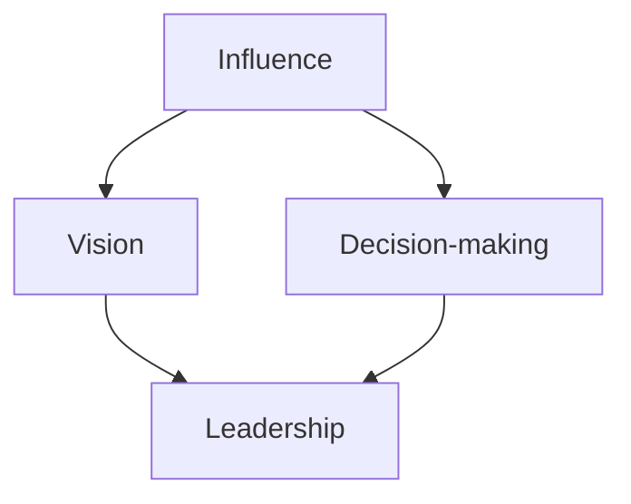

**核心算法原理讲解**

伪代码：

```
function defineLeadership() {
    influence = true
    vision = true
    decisionMaking = true
    if (influence && vision && decisionMaking) {
        return "Leadership is the ability to influence and guide others towards a shared vision through decision-making."
    } else {
        return "Incomplete leadership definition."
    }
}
```

**数学模型和公式**

领导力的定义可以用数学模型来表示：

$$ \text{Leadership} = f(\text{Influence}, \text{Vision}, \text{Decision-Making}) $$

**举例说明**

假设一个团队正在开发一款新的产品，领导者需要具备以下能力：

- **影响力**：领导者需要能够影响团队成员，使他们齐心协力地推进项目。
- **愿景**：领导者需要明确产品的愿景，使团队朝着一个共同的目标努力。
- **决策**：领导者需要在项目开发过程中做出明智的决策，以确保项目的顺利进行。

通过以上三个核心概念的应用，领导者可以有效地定义领导力。

### 1.1.2 Leadership Theories and Models

**背景介绍**

领导力是一个复杂的概念，不同的学者提出了各种各样的领导理论。了解这些理论有助于我们更深入地理解领导力。

**核心概念与联系**

以下是几种主要的领导理论：

- **特质理论（Trait Theory）**：认为领导者具备特定的个性特质。
- **行为理论（Behavioral Theory）**：关注领导者的行为和风格。
- **情境理论（Contingency Theory）**：认为领导效果取决于领导者的行为与情境的匹配。

以下是领导理论的Mermaid流程图：

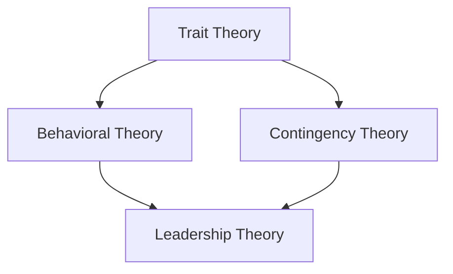

**核心算法原理讲解**

伪代码：

```
function analyzeLeadershipTheories() {
    theories = ["Trait Theory", "Behavioral Theory", "Contingency Theory"]
    for (theory in theories) {
        print("The " + theory + " emphasizes the importance of " + getEmphasis(theory))
    }
}

function getEmphasis(theory) {
    if (theory == "Trait Theory") {
        return "traits and characteristics."
    } else if (theory == "Behavioral Theory") {
        return "behavior and style."
    } else if (theory == "Contingency Theory") {
        return "context and situation."
    } else {
        return "unknown emphasis."
    }
}
```

**数学模型和公式**

领导理论可以用数学模型来表示：

$$ \text{Leadership Theory} = f(\text{Trait}, \text{Behavior}, \text{Contingency}) $$

**举例说明**

- **特质理论**：例如，约翰·肯尼迪被认为具有领导者的特质，如自信、决心和热情。
- **行为理论**：例如，领导者的行为可以是民主式或独裁式，根据情境的需要进行选择。
- **情境理论**：例如，在某些紧急情况下，独裁式的领导风格可能更有效。

通过以上理论的分析，我们可以更好地理解领导力的多样性。

### 1.2 Personal Leadership Skills

**背景介绍**

个人领导技能是领导者成功的关键。这些技能不仅影响领导者与团队成员的互动，还影响整个团队的绩效。

**核心概念与联系**

以下是几个关键的个人领导技能：

- **自我认知（Self-awareness）**：领导者需要了解自己的优点和缺点。
- **情绪智力（Emotional Intelligence）**：领导者需要具备理解和管理自己及他人情绪的能力。
- **沟通技巧（Communication Skills）**：领导者需要有效地传达信息和理解他人。

以下是个人领导技能的Mermaid流程图：

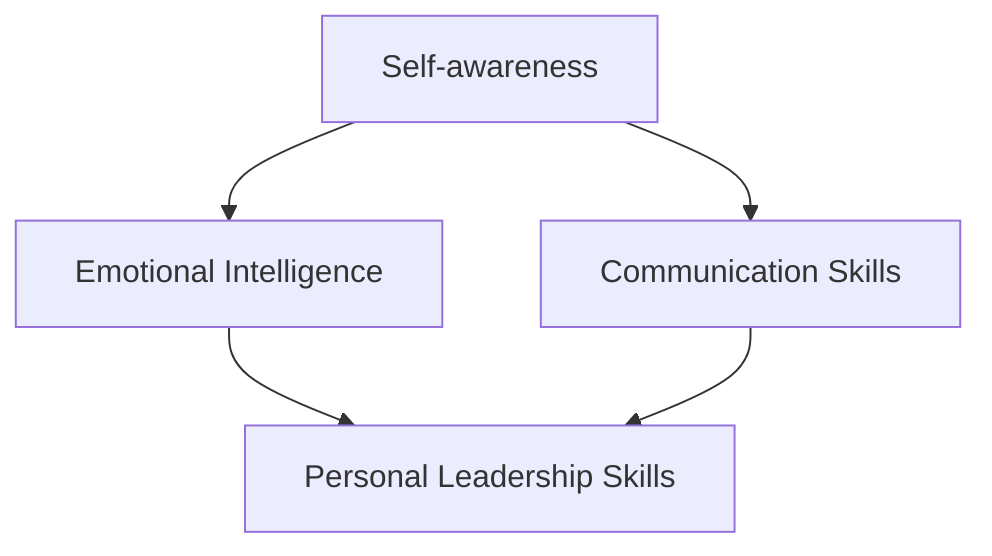

**核心算法原理讲解**

伪代码：

```
function personalLeadershipSkills() {
    selfAwareness = true
    emotionalIntelligence = true
    communicationSkills = true
    if (selfAwareness && emotionalIntelligence && communicationSkills) {
        return "Personal leadership skills are crucial for effective leadership."
    } else {
        return "Incomplete personal leadership skills."
    }
}
```

**数学模型和公式**

个人领导技能可以用数学模型来表示：

$$ \text{Personal Leadership Skills} = f(\text{Self-awareness}, \text{Emotional Intelligence}, \text{Communication Skills}) $$

**举例说明**

- **自我认知**：领导者可以通过反思和反馈来提高自我认知。
- **情绪智力**：领导者需要学会识别和管理自己的情绪，以及如何帮助团队成员处理情绪。
- **沟通技巧**：领导者需要学会清晰、明确地传达信息，并倾听他人的观点。

通过以上技能的提升，领导者可以更好地应对各种挑战，提升团队的绩效。

### 1.3 Building Trust and Teamwork

**背景介绍**

建立信任和团队合作是领导力的关键要素。没有信任，团队难以协作；没有团队合作，项目难以成功。

**核心概念与联系**

以下是建立信任和团队合作的关键概念：

- **信任（Trust）**：信任是团队成员相互依赖和合作的基础。
- **团队合作（Teamwork）**：团队合作是团队共同追求目标的过程。

以下是建立信任和团队合作的概念架构：

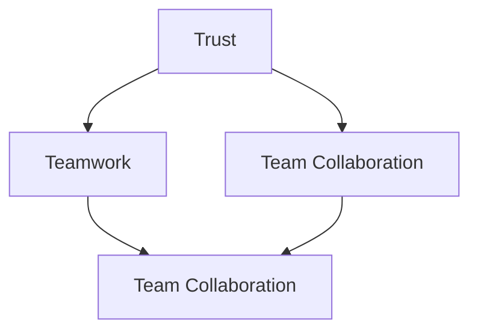

**核心算法原理讲解**

伪代码：

```
function buildTrustAndTeamwork() {
    trust = true
    teamwork = true
    if (trust && teamwork) {
        return "Building trust and teamwork is essential for a successful team."
    } else {
        return "Incomplete trust and teamwork."
    }
}
```

**数学模型和公式**

信任和团队合作可以用数学模型来表示：

$$ \text{Trust and Teamwork} = f(\text{Trust}, \text{Teamwork}) $$

**举例说明**

- **信任**：领导者可以通过透明沟通、兑现承诺和关注团队成员的福祉来建立信任。
- **团队合作**：领导者可以鼓励团队成员分享意见、共同解决问题，并通过协作完成项目。

通过以上措施，领导者可以建立高度信任的团队，实现团队合作。

### 1.3.1 Trust Building Strategies

**背景介绍**

建立信任是领导力的关键要素。没有信任，团队将无法有效协作。了解并实施有效的信任建立策略对于领导者至关重要。

**核心概念与联系**

以下是几种关键的信任建立策略：

- **透明沟通（Transparent Communication）**：领导者需要公开、诚实地与团队成员沟通。
- **兑现承诺（Keeping Promises）**：领导者需要遵守承诺，以赢得团队成员的信任。
- **关注团队成员的福祉（Focusing on Team Members' Well-being）**：领导者需要关注团队成员的情感和职业发展。

以下是信任建立策略的Mermaid流程图：

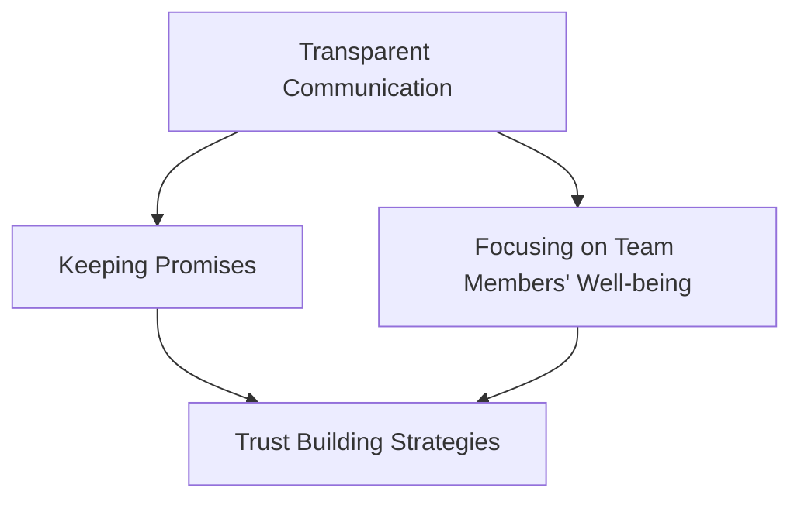

**核心算法原理讲解**

伪代码：

```
function buildTrust() {
    transparentCommunication = true
    keepingPromises = true
    focusingOnWell-being = true
    if (transparentCommunication && keepingPromises && focusingOnWell-being) {
        return "Effective trust-building strategies are crucial for building a cohesive team."
    } else {
        return "Incomplete trust-building strategies."
    }
}
```

**数学模型和公式**

信任建立策略可以用数学模型来表示：

$$ \text{Trust Building Strategies} = f(\text{Transparent Communication}, \text{Keeping Promises}, \text{Focusing on Team Members' Well-being}) $$

**举例说明**

- **透明沟通**：领导者可以定期召开团队会议，分享项目进展、挑战和成功经验。
- **兑现承诺**：领导者需要在规定的时间内完成任务，并始终保持诚信。
- **关注团队成员的福祉**：领导者可以关注团队成员的工作压力、职业发展，并提供必要的支持。

通过实施以上策略，领导者可以建立高度信任的团队，提高团队绩效。

### 1.3.2 Team Development Stages

**背景介绍**

团队的发展是一个动态的过程，不同阶段需要采取不同的策略。了解团队发展的各个阶段对于领导者至关重要。

**核心概念与联系**

以下是团队发展的四个主要阶段：

- **形成阶段（Forming）**：团队成员开始相互了解，建立基本的关系。
- **冲突阶段（Storming）**：团队成员开始表达不同的意见，出现冲突。
- **规范阶段（Norming）**：团队成员开始相互合作，形成共同的目标。
- **执行阶段（Performing）**：团队高效地完成任务，实现目标。

以下是团队发展阶段的Mermaid流程图：

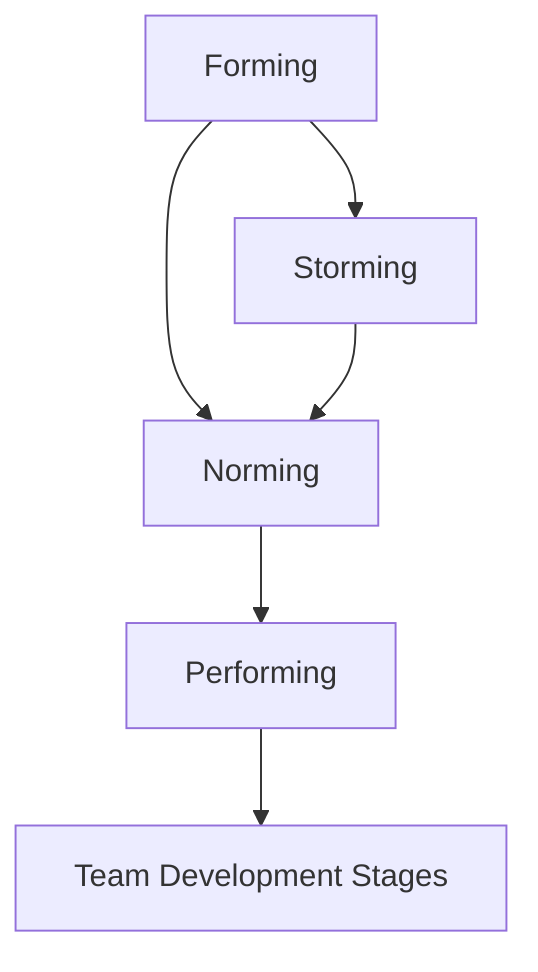

**核心算法原理讲解**

伪代码：

```
function teamDevelopmentStages() {
    stages = ["Forming", "Storming", "Norming", "Performing"]
    for (stage in stages) {
        print("In " + stage + ", team members " + getDescription(stage))
    }
}

function getDescription(stage) {
    if (stage == "Forming") {
        return "start to get to know each other and establish basic relationships."
    } else if (stage == "Storming") {
        return "express different opinions and conflicts may arise."
    } else if (stage == "Norming") {
        return "start to cooperate and form common goals."
    } else if (stage == "Performing") {
        return "work efficiently and achieve objectives."
    } else {
        return "unknown description."
    }
}
```

**数学模型和公式**

团队发展阶段可以用数学模型来表示：

$$ \text{Team Development Stages} = f(\text{Forming}, \text{Storming}, \text{Norming}, \text{Performing}) $$

**举例说明**

- **形成阶段**：团队成员相互介绍，了解背景和工作职责。
- **冲突阶段**：团队成员开始提出不同的意见和想法，可能会出现冲突。
- **规范阶段**：团队成员开始合作，建立共同的目标和规范。
- **执行阶段**：团队高效地完成任务，实现目标。

通过理解团队发展阶段，领导者可以更好地引导团队，提高团队绩效。

### 1.3.3 Conflict Resolution

**背景介绍**

团队冲突是不可避免的，但如何有效地解决冲突对于团队的成功至关重要。领导者需要掌握冲突解决的策略，以维持团队的和谐与高效。

**核心概念与联系**

以下是解决冲突的几个关键概念：

- **倾听（Listening）**：领导者需要倾听团队成员的观点和需求。
- **调解（Mediation）**：领导者需要作为中立者，帮助团队成员找到共同点。
- **妥协（Compromise）**：领导者需要引导团队成员做出妥协，以解决冲突。

以下是冲突解决的概念架构：

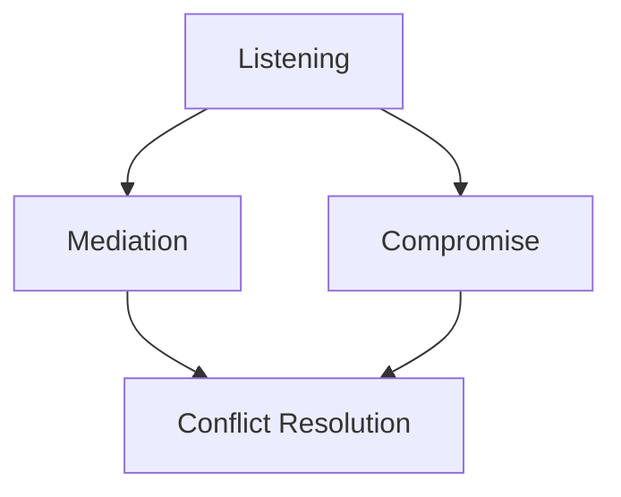

**核心算法原理讲解**

伪代码：

```
function resolveConflict() {
    listening = true
    mediation = true
    compromise = true
    if (listening && mediation && compromise) {
        return "Effective conflict resolution strategies are essential for maintaining team harmony and productivity."
    } else {
        return "Incomplete conflict resolution strategies."
    }
}
```

**数学模型和公式**

冲突解决策略可以用数学模型来表示：

$$ \text{Conflict Resolution} = f(\text{Listening}, \text{Mediation}, \text{Compromise}) $$

**举例说明**

- **倾听**：领导者需要耐心倾听团队成员的观点，理解他们的需求和担忧。
- **调解**：领导者可以充当调解者，帮助团队成员找到共同点，达成共识。
- **妥协**：领导者可以引导团队成员做出妥协，以解决冲突，实现团队目标。

通过以上策略，领导者可以有效地解决冲突，维护团队和谐。

### 2.1 Strategic Thinking

**背景介绍**

战略思维是领导者的一项关键能力。它涉及制定长期目标和规划实现这些目标的方法。了解战略思维的重要性，以及如何培养这种能力，对于领导者至关重要。

**核心概念与联系**

以下是战略思维的关键概念：

- **战略规划（Strategic Planning）**：制定长期目标和实现这些目标的方法。
- **SWOT分析（SWOT Analysis）**：分析组织的优势、劣势、机会和威胁。
- **愿景和使命陈述（Vision and Mission Statements）**：定义组织的长期目标和价值观。

以下是战略思维的Mermaid流程图：

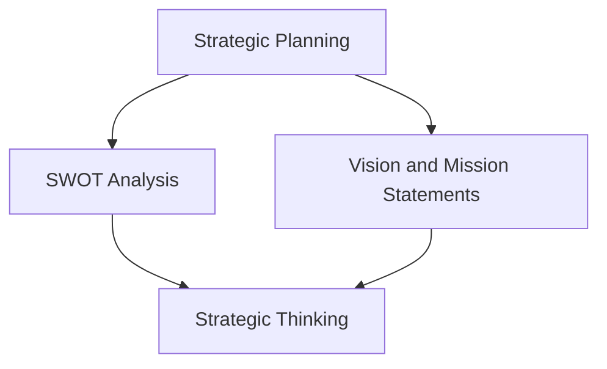

**核心算法原理讲解**

伪代码：

```
function strategicThinking() {
    strategicPlanning = true
    swotAnalysis = true
    visionAndMissionStatements = true
    if (strategicPlanning && swotAnalysis && visionAndMissionStatements) {
        return "Strategic thinking is essential for long-term success and achieving organizational goals."
    } else {
        return "Incomplete strategic thinking."
    }
}
```

**数学模型和公式**

战略思维可以用数学模型来表示：

$$ \text{Strategic Thinking} = f(\text{Strategic Planning}, \text{SWOT Analysis}, \text{Vision and Mission Statements}) $$

**举例说明**

- **战略规划**：领导者需要制定具体的行动计划，以实现组织的长期目标。
- **SWOT分析**：领导者需要分析组织的优势、劣势、机会和威胁，以制定相应的策略。
- **愿景和使命陈述**：领导者需要明确组织的愿景和使命，以指导组织的长期发展。

通过以上策略，领导者可以培养战略思维，为组织的长期成功奠定基础。

### 2.1.1 Strategic Planning Process

**背景介绍**

战略规划是组织成功的关键。它涉及制定长期目标和制定实现这些目标的具体计划。了解战略规划的过程对于领导者至关重要。

**核心概念与联系**

以下是战略规划的核心概念：

- **目标设定（Goal Setting）**：确定组织的长期目标和短期目标。
- **资源分配（Resource Allocation）**：确保组织拥有实现目标所需的资源。
- **执行监控（Execution Monitoring）**：跟踪项目的进展，确保目标的实现。

以下是战略规划的Mermaid流程图：

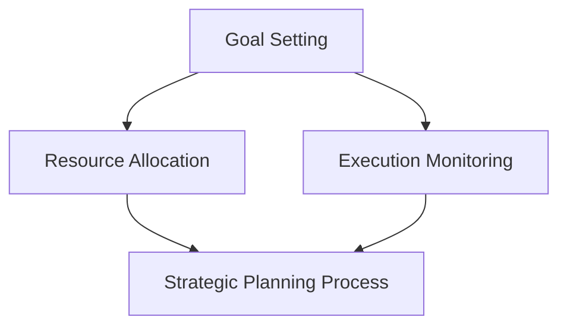

**核心算法原理讲解**

伪代码：

```
function strategicPlanningProcess() {
    goalSetting = true
    resourceAllocation = true
    executionMonitoring = true
    if (goalSetting && resourceAllocation && executionMonitoring) {
        return "The strategic planning process is crucial for achieving organizational goals."
    } else {
        return "Incomplete strategic planning process."
    }
}
```

**数学模型和公式**

战略规划过程可以用数学模型来表示：

$$ \text{Strategic Planning Process} = f(\text{Goal Setting}, \text{Resource Allocation}, \text{Execution Monitoring}) $$

**举例说明**

- **目标设定**：领导者需要确定组织的长期和短期目标，确保团队成员了解这些目标。
- **资源分配**：领导者需要确保组织拥有实现目标所需的资源，如人力、财力和技术资源。
- **执行监控**：领导者需要定期检查项目的进展，确保目标的实现。

通过以上过程，领导者可以确保组织目标的实现，推动组织的长期成功。

### 2.1.2 SWOT Analysis

**背景介绍**

SWOT分析是战略规划过程中的关键步骤，用于评估组织的优势、劣势、机会和威胁。了解SWOT分析的重要性，以及如何进行有效的SWOT分析，对于领导者至关重要。

**核心概念与联系**

以下是SWOT分析的核心概念：

- **优势（Strengths）**：组织在资源、能力、市场等方面的优势。
- **劣势（Weaknesses）**：组织在资源、能力、市场等方面的不足。
- **机会（Opportunities）**：外部环境中的有利因素。
- **威胁（Threats）**：外部环境中的不利因素。

以下是SWOT分析的Mermaid流程图：

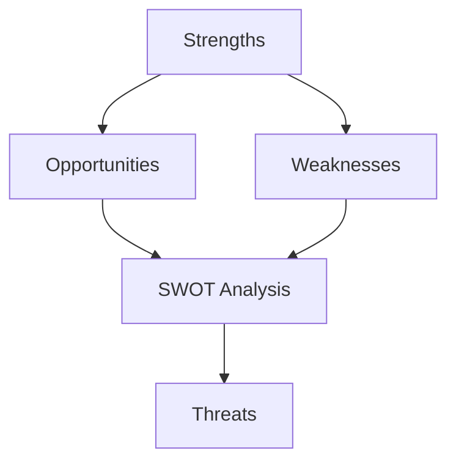

**核心算法原理讲解**

伪代码：

```
function swotAnalysis() {
    strengths = true
    weaknesses = true
    opportunities = true
    threats = true
    if (strengths && weaknesses && opportunities && threats) {
        return "SWOT analysis is a crucial tool for strategic planning and decision-making."
    } else {
        return "Incomplete SWOT analysis."
    }
}
```

**数学模型和公式**

SWOT分析可以用数学模型来表示：

$$ \text{SWOT Analysis} = f(\text{Strengths}, \text{Weaknesses}, \text{Opportunities}, \text{Threats}) $$

**举例说明**

- **优势**：组织在技术、市场、品牌等方面的优势。
- **劣势**：组织在资源、能力、管理等方面的不足。
- **机会**：市场趋势、竞争对手的劣势、新的技术等。
- **威胁**：竞争对手的威胁、市场变化、政策法规等。

通过以上分析，领导者可以更好地了解组织的现状，制定相应的战略计划。

### 2.1.3 Vision and Mission Statements

**背景介绍**

愿景和使命陈述是组织战略规划的重要组成部分，用于定义组织的长期目标和核心价值观。了解如何撰写有效的愿景和使命陈述对于领导者至关重要。

**核心概念与联系**

以下是愿景和使命陈述的核心概念：

- **愿景（Vision）**：描述组织希望成为什么样的组织，未来的愿景。
- **使命（Mission）**：描述组织存在的目的，为什么存在。

以下是愿景和使命陈述的Mermaid流程图：

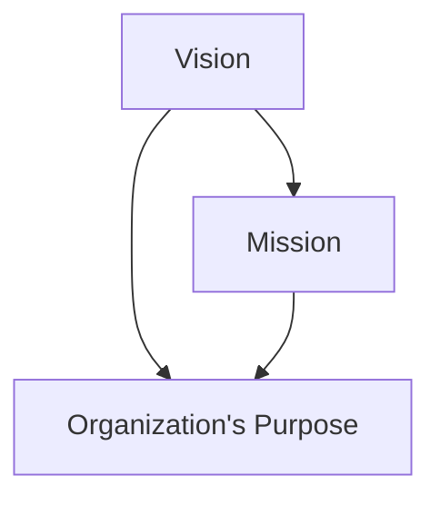

**核心算法原理讲解**

伪代码：

```
function visionAndMissionStatements() {
    vision = true
    mission = true
    organizationPurpose = true
    if (vision && mission && organizationPurpose) {
        return "Effective vision and mission statements are essential for guiding organizational strategy and culture."
    } else {
        return "Incomplete vision and mission statements."
    }
}
```

**数学模型和公式**

愿景和使命陈述可以用数学模型来表示：

$$ \text{Vision and Mission Statements} = f(\text{Vision}, \text{Mission}, \text{Organization's Purpose}) $$

**举例说明**

- **愿景**：例如，"成为全球领先的技术解决方案提供商"。
- **使命**：例如，"通过创新技术，帮助客户实现业务增长"。
- **组织目的**：例如，"推动技术进步，为人类创造更多价值"。

通过以上陈述，领导者可以明确组织的方向和价值观，指导组织的长期发展。

### 2.2 Decision Making

**背景介绍**

决策是领导者的一项核心任务，它影响组织的方向和成功。了解决策的重要性，以及如何做出明智的决策，对于领导者至关重要。

**核心概念与联系**

以下是决策的关键概念：

- **决策模型（Decision Models）**：用于指导决策的工具和方法。
- **风险评估（Risk Assessment）**：评估决策可能带来的风险和影响。
- **决策工具（Decision Tools）**：用于支持决策的软件和资源。

以下是决策的Mermaid流程图：

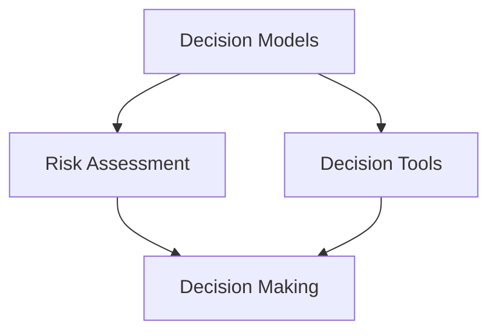

**核心算法原理讲解**

伪代码：

```
function decisionMaking() {
    decisionModels = true
    riskAssessment = true
    decisionTools = true
    if (decisionModels && riskAssessment && decisionTools) {
        return "Effective decision-making is crucial for organizational success."
    } else {
        return "Incomplete decision-making process."
    }
}
```

**数学模型和公式**

决策可以用数学模型来表示：

$$ \text{Decision Making} = f(\text{Decision Models}, \text{Risk Assessment}, \text{Decision Tools}) $$

**举例说明**

- **决策模型**：例如，成本效益分析、机会成本分析等。
- **风险评估**：例如，概率和影响矩阵、敏感性分析等。
- **决策工具**：例如，决策树、风险分析软件等。

通过以上模型和工具，领导者可以做出明智的决策，推动组织的发展。

### 2.2.1 Decision-Making Models

**背景介绍**

决策模型是指导领导者做出明智决策的工具。了解不同的决策模型，并知道何时使用它们，对于领导者至关重要。

**核心概念与联系**

以下是几种常见的决策模型：

- **理性决策模型（Rational Decision Model）**：基于逻辑和分析的决策过程。
- **有限理性决策模型（Bounded Rationality Model）**：考虑时间和认知限制的决策过程。
- **直觉决策模型（Intuitive Decision Model）**：基于经验和直觉的决策过程。

以下是决策模型的Mermaid流程图：

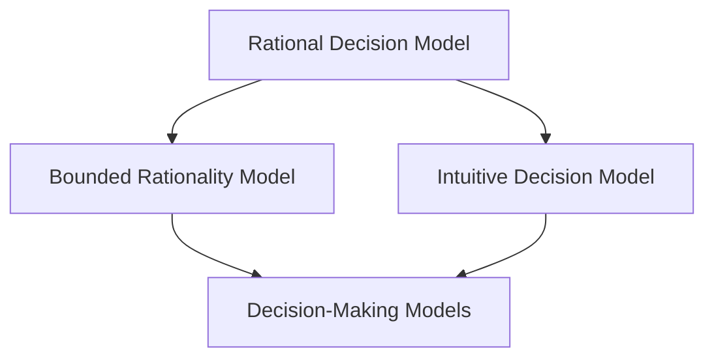

**核心算法原理讲解**

伪代码：

```
function decisionMakingModels() {
    rational = true
    boundedRationality = true
    intuitive = true
    if (rational && boundedRationality && intuitive) {
        return "Different decision-making models are useful for leaders in various situations."
    } else {
        return "Incomplete decision-making models."
    }
}
```

**数学模型和公式**

决策模型可以用数学模型来表示：

$$ \text{Decision-Making Models} = f(\text{Rational}, \text{Bounded Rationality}, \text{Intuitive}) $$

**举例说明**

- **理性决策模型**：例如，在制定长期战略规划时使用。
- **有限理性决策模型**：例如，在紧急情况下或资源有限时使用。
- **直觉决策模型**：例如，在处理日常事务或快速决策时使用。

通过了解不同决策模型，领导者可以根据具体情况选择合适的决策方法。

### 2.2.2 Risk Assessment

**背景介绍**

在决策过程中，风险评估是关键的一步。了解可能的风险，并评估其对决策的影响，对于领导者至关重要。

**核心概念与联系**

以下是风险评估的关键概念：

- **风险识别（Risk Identification）**：识别可能的风险因素。
- **风险评估（Risk Assessment）**：评估风险的可能性和影响。
- **风险缓解（Risk Mitigation）**：制定措施来减轻风险的影响。

以下是风险评估的Mermaid流程图：

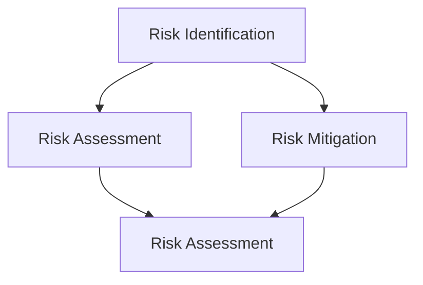

**核心算法原理讲解**

伪代码：

```
function riskAssessment() {
    riskIdentification = true
    riskAssessment = true
    riskMitigation = true
    if (riskIdentification && riskAssessment && riskMitigation) {
        return "Risk assessment is essential for making informed decisions."
    } else {
        return "Incomplete risk assessment process."
    }
}
```

**数学模型和公式**

风险评估可以用数学模型来表示：

$$ \text{Risk Assessment} = f(\text{Risk Identification}, \text{Risk Assessment}, \text{Risk Mitigation}) $$

**举例说明**

- **风险识别**：例如，识别市场变化、技术故障等潜在风险。
- **风险评估**：例如，使用概率和影响矩阵来评估风险的可能性和影响。
- **风险缓解**：例如，制定应急预案、增加备份设备等来减轻风险的影响。

通过以上步骤，领导者可以更好地评估风险，并制定相应的策略来减轻风险。

### 2.2.3 Decision-Making Tools

**背景介绍**

在决策过程中，使用合适的工具可以提高决策的效率和准确性。了解不同的决策工具，并知道如何使用它们，对于领导者至关重要。

**核心概念与联系**

以下是几种常见的决策工具：

- **决策树（Decision Tree）**：用于分析不同决策路径的后果。
- **概率和影响矩阵（Probability and Impact Matrix）**：用于评估风险的概率和影响。
- **成本效益分析（Cost-Benefit Analysis）**：用于评估决策的成本和效益。

以下是决策工具的Mermaid流程图：

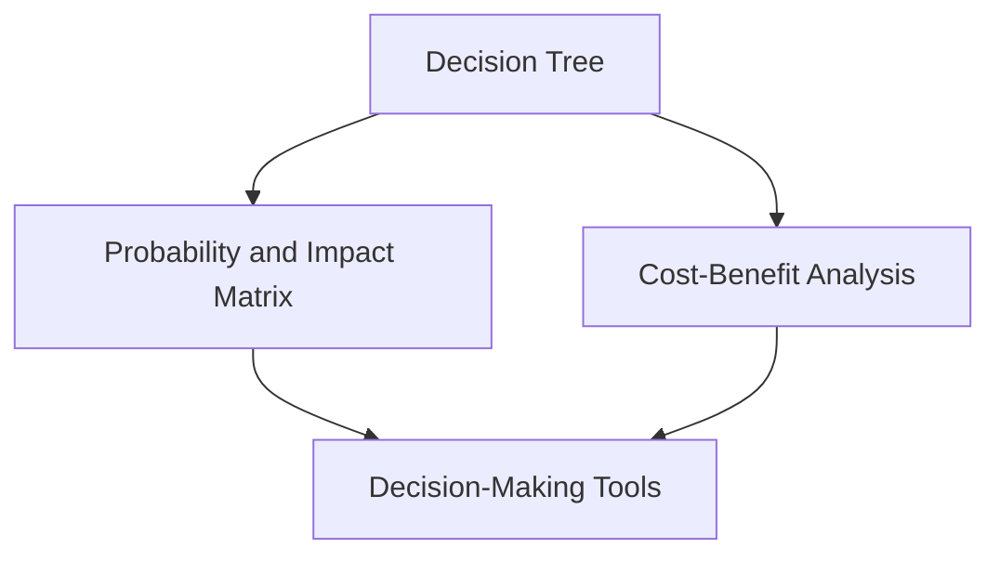

**核心算法原理讲解**

伪代码：

```
function decisionMakingTools() {
    decisionTree = true
    probabilityAndImpactMatrix = true
    costBenefitAnalysis = true
    if (decisionTree && probabilityAndImpactMatrix && costBenefitAnalysis) {
        return "Effective use of decision-making tools is crucial for informed decision-making."
    } else {
        return "Incomplete decision-making tools."
    }
}
```

**数学模型和公式**

决策工具可以用数学模型来表示：

$$ \text{Decision-Making Tools} = f(\text{Decision Tree}, \text{Probability and Impact Matrix}, \text{Cost-Benefit Analysis}) $$

**举例说明**

- **决策树**：例如，在项目决策时分析不同路径的收益和风险。
- **概率和影响矩阵**：例如，在风险评估时评估不同风险的概率和影响。
- **成本效益分析**：例如，在投资决策时评估项目的成本和预期收益。

通过使用以上工具，领导者可以更准确地做出决策。

### 2.3 Leading Change

**背景介绍**

在当今快速变化的环境中，领导者需要具备引导变革的能力。了解变革管理的理论和策略，对于领导者至关重要。

**核心概念与联系**

以下是变革管理的关键概念：

- **变革管理理论（Change Management Theories）**：解释变革过程的理论。
- **管理变革阻力（Managing Resistance to Change）**：解决团队成员对变革的抵触情绪。
- **变革实施策略（Change Implementation Strategies）**：实施变革的具体方法和步骤。

以下是变革管理的Mermaid流程图：

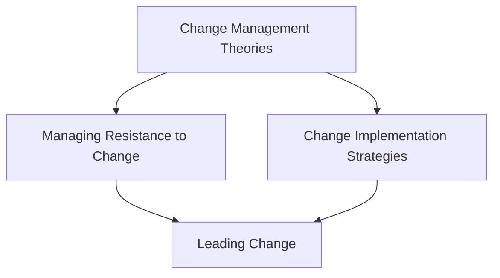

**核心算法原理讲解**

伪代码：

```
function leadingChange() {
    changeManagementTheories = true
    managingResistance = true
    changeImplementationStrategies = true
    if (changeManagementTheories && managingResistance && changeImplementationStrategies) {
        return "Effective change leadership is essential for navigating organizational transformation."
    } else {
        return "Incomplete change leadership strategies."
    }
}
```

**数学模型和公式**

变革管理可以用数学模型来表示：

$$ \text{Leading Change} = f(\text{Change Management Theories}, \text{Managing Resistance to Change}, \text{Change Implementation Strategies}) $$

**举例说明**

- **变革管理理论**：例如，Kotter的八个步骤变革模型。
- **管理变革阻力**：例如，通过沟通、培训、参与等方式减少团队成员的抵触情绪。
- **变革实施策略**：例如，制定详细的变革计划、确保资源的分配、监控变革进程等。

通过以上策略，领导者可以有效地引导变革，推动组织的发展。

### 2.3.1 Change Management Theories

**背景介绍**

变革管理是领导力的关键组成部分，涉及如何引导组织适应和应对变化。了解不同的变革管理理论有助于领导者制定有效的变革策略。

**核心概念与联系**

以下是几种常见的变革管理理论：

- **Kotter的八个步骤变革模型**：提供了一套系统化的变革流程。
- **领导变革模型（Leadership Change Model）**：强调领导者角色在变革过程中的重要性。
- **组织发展理论（Organization Development Theory）**：关注组织文化的变革。

以下是变革管理理论的Mermaid流程图：

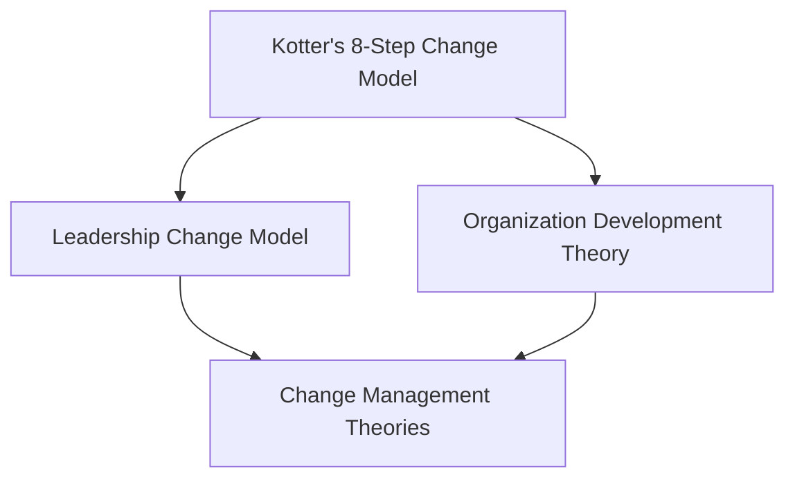

**核心算法原理讲解**

伪代码：

```
function changeManagementTheories() {
    kotterModel = true
    leadershipModel = true
    organizationDevelopment = true
    if (kotterModel && leadershipModel && organizationDevelopment) {
        return "Understanding different change management theories is crucial for effective organizational transformation."
    } else {
        return "Incomplete change management theories."
    }
}
```

**数学模型和公式**

变革管理理论可以用数学模型来表示：

$$ \text{Change Management Theories} = f(\text{Kotter's 8-Step Change Model}, \text{Leadership Change Model}, \text{Organization Development Theory}) $$

**举例说明**

- **Kotter的八个步骤变革模型**：包括建立紧急意识、组建指导团队、明确愿景等。
- **领导变革模型**：强调领导者需要在变革过程中发挥关键作用。
- **组织发展理论**：关注组织文化在变革过程中的重要性。

通过理解这些理论，领导者可以更好地应对变革挑战。

### 2.3.2 Managing Resistance to Change

**背景介绍**

在变革过程中，团队成员往往会出现抵触情绪。了解如何管理变革阻力对于领导者至关重要。

**核心概念与联系**

以下是管理变革阻力的关键概念：

- **变革阻力来源（Sources of Change Resistance）**：分析团队成员抵触变革的原因。
- **变革沟通策略（Change Communication Strategies）**：制定有效的沟通策略，减少变革阻力。
- **变革培训（Change Training）**：提高团队成员的变革能力。

以下是管理变革阻力的Mermaid流程图：

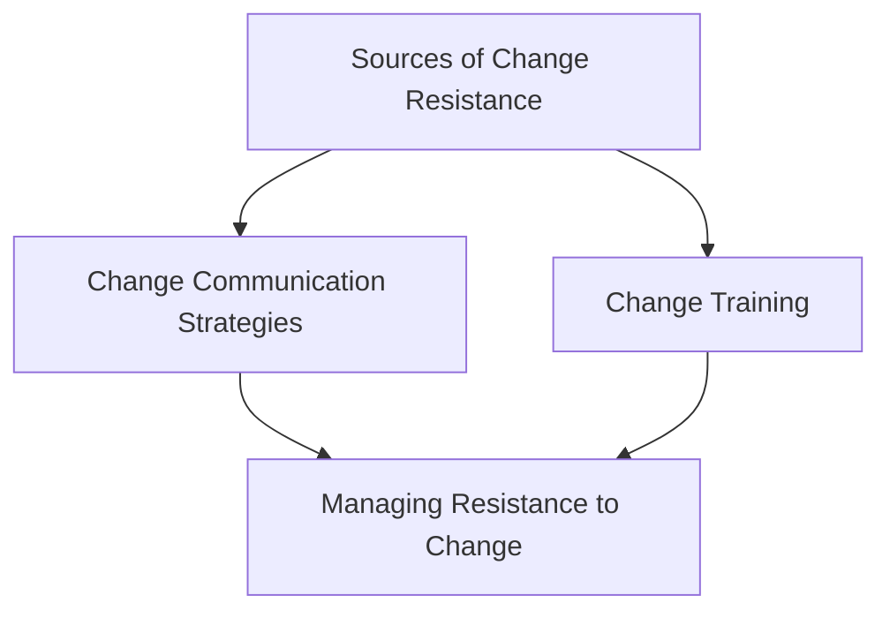

**核心算法原理讲解**

伪代码：

```
function managingResistance() {
    resistanceSources = true
    communicationStrategies = true
    training = true
    if (resistanceSources && communicationStrategies && training) {
        return "Effective management of resistance to change is essential for successful organizational transformation."
    } else {
        return "Incomplete resistance management strategies."
    }
}
```

**数学模型和公式**

变革阻力的管理可以用数学模型来表示：

$$ \text{Managing Resistance to Change} = f(\text{Resistance Sources}, \text{Communication Strategies}, \text{Training}) $$

**举例说明**

- **变革阻力来源**：例如，不确定、恐惧、习惯性思维等。
- **变革沟通策略**：例如，定期沟通、透明分享信息、倾听反馈等。
- **变革培训**：例如，提供变革管理培训、技能提升培训等。

通过以上措施，领导者可以更好地管理变革阻力，推动变革的顺利进行。

### 2.3.3 Change Implementation Strategies

**背景介绍**

在变革过程中，有效的实施策略是关键。领导者需要制定明确的实施计划，并确保团队成员积极参与。

**核心概念与联系**

以下是变革实施策略的关键概念：

- **变革计划（Change Plan）**：制定详细的变革实施步骤。
- **资源分配（Resource Allocation）**：确保变革过程中所需的资源。
- **监控和评估（Monitoring and Evaluation）**：跟踪变革进展，评估变革效果。

以下是变革实施策略的Mermaid流程图：

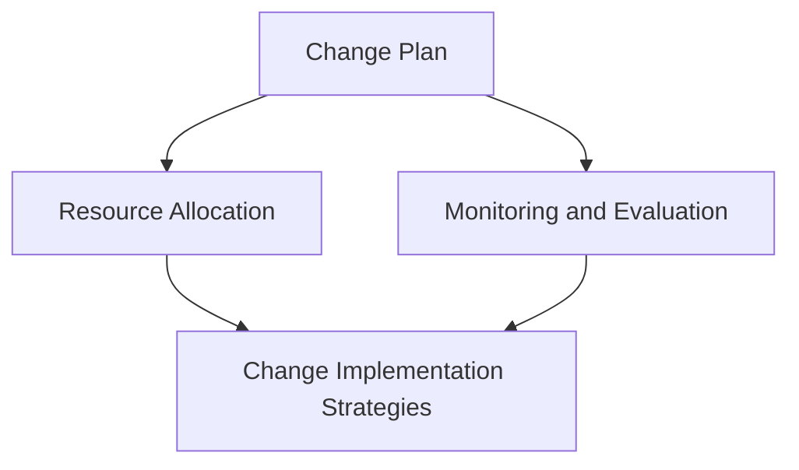

**核心算法原理讲解**

伪代码：

```
function changeImplementationStrategies() {
    changePlan = true
    resourceAllocation = true
    monitoringEvaluation = true
    if (changePlan && resourceAllocation && monitoringEvaluation) {
        return "Effective change implementation strategies are crucial for successful organizational transformation."
    } else {
        return "Incomplete implementation strategies."
    }
}
```

**数学模型和公式**

变革实施策略可以用数学模型来表示：

$$ \text{Change Implementation Strategies} = f(\text{Change Plan}, \text{Resource Allocation}, \text{Monitoring and Evaluation}) $$

**举例说明**

- **变革计划**：例如，明确变革的目标、时间表、责任人等。
- **资源分配**：例如，确保变革过程中的人力、财力和技术资源。
- **监控和评估**：例如，定期检查变革进展，评估变革效果，并根据实际情况进行调整。

通过以上策略，领导者可以确保变革的顺利进行。

### 3.1 Effective Communication

**背景介绍**

有效的沟通是领导者成功的关键。领导者需要掌握有效的沟通技巧，以确保信息的准确传递和理解。

**核心概念与联系**

以下是有效的沟通技巧的关键概念：

- **主动倾听（Active Listening）**：不仅仅是听，而是理解对方的意思。
- **非语言沟通（Nonverbal Communication）**：通过肢体语言、面部表情等传达信息。
- **有效反馈（Effective Feedback）**：给予清晰、有建设性的反馈。

以下是有效沟通的Mermaid流程图：

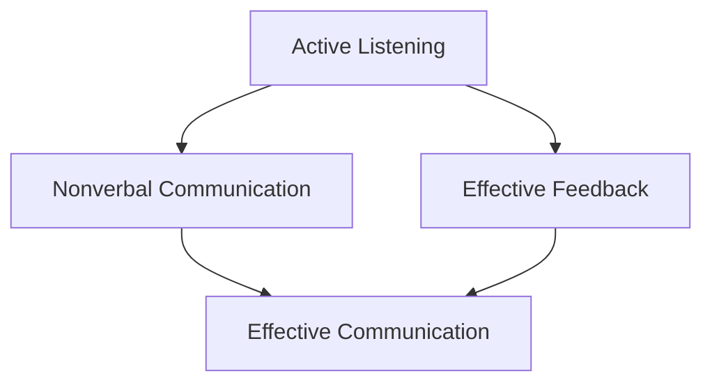

**核心算法原理讲解**

伪代码：

```
function effectiveCommunication() {
    activeListening = true
    nonverbalCommunication = true
    effectiveFeedback = true
    if (activeListening && nonverbalCommunication && effectiveFeedback) {
        return "Effective communication is essential for leadership success."
    } else {
        return "Incomplete communication skills."
    }
}
```

**数学模型和公式**

有效沟通可以用数学模型来表示：

$$ \text{Effective Communication} = f(\text{Active Listening}, \text{Nonverbal Communication}, \text{Effective Feedback}) $$

**举例说明**

- **主动倾听**：领导者需要认真倾听团队成员的问题和意见，确保理解他们的观点。
- **非语言沟通**：领导者需要通过肢体语言、面部表情等方式，传达自己的态度和情感。
- **有效反馈**：领导者需要给予清晰、有建设性的反馈，帮助团队成员改进。

通过以上技巧，领导者可以建立有效的沟通，提高团队的协作效率。

### 3.1.1 Active Listening

**背景介绍**

主动倾听是领导者有效沟通的核心技巧之一。它不仅仅是听，而是理解对方的意思，并给予积极的反馈。

**核心概念与联系**

以下是主动倾听的关键概念：

- **倾听技巧（Listening Skills）**：包括专注、理解、记忆等。
- **非语言信号（Nonverbal Signals）**：如点头、目光接触、身体姿势等，以表达关注和理解。
- **反馈（Feedback）**：通过提问、复述、总结等方式，确保理解对方的意思。

以下是主动倾听的Mermaid流程图：

```mermaid
graph TD
A[Listening Skills] --> B[Nonverbal Signals]
A --> C[Feedback]
B --> D[Active Listening]
C --> D
```

**核心算法原理讲解**

伪代码：

```
function activeListening() {
    listeningSkills = true
    nonverbalSignals = true
    feedback = true
    if (listeningSkills && nonverbalSignals && feedback) {
        return "Active listening is crucial for effective communication and understanding."
    } else {
        return "Incomplete active listening skills."
    }
}
```

**数学模型和公式**

主动倾听可以用数学模型来表示：

$$ \text{Active Listening} = f(\text{Listening Skills}, \text{Nonverbal Signals}, \text{Feedback}) $$

**举例说明**

- **倾听技巧**：领导者需要专注于对方的发言，确保理解他们的观点。
- **非语言信号**：领导者可以通过点头、目光接触等方式，表达自己的关注和理解。
- **反馈**：领导者可以通过提问、复述、总结等方式，确保理解对方的意思，并给予积极的反馈。

通过以上技巧，领导者可以建立有效的沟通，提高团队的协作效率。

### 3.1.2 Nonverbal Communication

**背景介绍**

非语言沟通是沟通的重要组成部分，它包括肢体语言、面部表情、声音语调等。了解非语言沟通的重要性，以及如何有效使用它，对于领导者至关重要。

**核心概念与联系**

以下是非语言沟通的关键概念：

- **肢体语言（Body Language）**：通过身体的动作、姿态等表达信息。
- **面部表情（Facial Expression）**：通过面部表情传达情感和态度。
- **声音语调（Voice Tone）**：通过声音的高低、强弱、快慢等表达信息。

以下是非语言沟通的Mermaid流程图：

```mermaid
graph TD
A[Body Language] --> B[Facial Expression]
A --> C[Voice Tone]
B --> D[Nonverbal Communication]
C --> D
```

**核心算法原理讲解**

伪代码：

```
function nonverbalCommunication() {
    bodyLanguage = true
    facialExpression = true
    voiceTone = true
    if (bodyLanguage && facialExpression && voiceTone) {
        return "Nonverbal communication is essential for effective communication and understanding."
    } else {
        return "Incomplete nonverbal communication skills."
    }
}
```

**数学模型和公式**

非语言沟通可以用数学模型来表示：

$$ \text{Nonverbal Communication} = f(\text{Body Language}, \text{Facial Expression}, \text{Voice Tone}) $$

**举例说明**

- **肢体语言**：领导者可以通过站姿、手势等表达自信和决心。
- **面部表情**：领导者可以通过微笑、皱眉等表达情感和态度。
- **声音语调**：领导者可以通过语调的变化来表达强调、疑问或鼓励。

通过有效使用非语言沟通，领导者可以增强沟通效果，提高团队的合作效率。

### 3.1.3 Effective Feedback

**背景介绍**

有效的反馈是领导者激励和指导团队成员的重要手段。了解如何给予有效反馈，对于领导者至关重要。

**核心概念与联系**

以下是有效反馈的关键概念：

- **反馈类型（Types of Feedback）**：包括正面反馈、负面反馈、建设性反馈等。
- **反馈时机（Feedback Timing）**：选择合适的时机给予反馈。
- **反馈方式（Feedback Method）**：包括面对面、书面、电子邮件等。

以下是有效反馈的Mermaid流程图：

```mermaid
graph TD
A[Positive Feedback] --> B[Negative Feedback]
A --> C[Constructive Feedback]
B --> D[Feedback Types]
C --> D
A --> E[Feedback Timing]
B --> E
C --> E
B --> F[Feedback Method]
C --> F
A --> F
D --> G[Effective Feedback]
E --> G
F --> G
```

**核心算法原理讲解**

伪代码：

```
function effectiveFeedback() {
    positiveFeedback = true
    negativeFeedback = true
    constructiveFeedback = true
    feedbackTiming = true
    feedbackMethod = true
    if (positiveFeedback && negativeFeedback && constructiveFeedback && feedbackTiming && feedbackMethod) {
        return "Effective feedback is crucial for team motivation and development."
    } else {
        return "Incomplete feedback skills."
    }
}
```

**数学模型和公式**

有效反馈可以用数学模型来表示：

$$ \text{Effective Feedback} = f(\text{Positive Feedback}, \text{Negative Feedback}, \text{Constructive Feedback}, \text{Feedback Timing}, \text{Feedback Method}) $$

**举例说明**

- **正面反馈**：领导者可以表扬团队成员的出色表现，增强他们的自信心。
- **负面反馈**：领导者需要避免直接批评，而是给予具体的建议和改进方向。
- **建设性反馈**：领导者需要提供具体的改进建议，帮助团队成员提升能力。
- **反馈时机**：领导者需要在适当的时机给予反馈，以确保团队成员能够接受和消化。
- **反馈方式**：领导者可以根据实际情况选择面对面、书面或电子邮件等方式给予反馈。

通过以上策略，领导者可以给予有效的反馈，激励和指导团队成员。

### 3.2 Public Speaking

**背景介绍**

公共演讲是领导者的一项重要技能，它能够有效地传达信息、建立信任和影响力。了解如何提高公共演讲技巧，对于领导者至关重要。

**核心概念与联系**

以下是公共演讲的关键概念：

- **克服演讲焦虑（Overcoming Public Speaking Anxiety）**：减少紧张和不安的情绪。
- **演讲结构（Speech Structure）**：包括开场、主体和结尾。
- **讲故事技巧（Storytelling Techniques）**：使用故事来传达信息和理念。

以下是公共演讲的Mermaid流程图：

```mermaid
graph TD
A[Overcoming Public Speaking Anxiety] --> B[Speech Structure]
A --> C[Storytelling Techniques]
B --> D[Public Speaking]
C --> D
```

**核心算法原理讲解**

伪代码：

```
function publicSpeaking() {
    overcomingAnxiety = true
    speechStructure = true
    storytelling = true
    if (overcomingAnxiety && speechStructure && storytelling) {
        return "Effective public speaking is essential for leadership and communication."
    } else {
        return "Incomplete public speaking skills."
    }
}
```

**数学模型和公式**

公共演讲可以用数学模型来表示：

$$ \text{Public Speaking} = f(\text{Overcoming Public Speaking Anxiety}, \text{Speech Structure}, \text{Storytelling Techniques}) $$

**举例说明**

- **克服演讲焦虑**：领导者可以通过充分的准备、练习和模拟演讲来减少紧张情绪。
- **演讲结构**：领导者需要确保演讲内容有良好的结构，包括引人入胜的开场、详实的主体和有力的结尾。
- **讲故事技巧**：领导者可以通过生动的案例、故事来传达信息和理念，使演讲更具吸引力和说服力。

通过以上策略，领导者可以提升公共演讲技巧，提高演讲效果。

### 3.2.1 Overcoming Public Speaking Anxiety

**背景介绍**

公共演讲是领导者必须掌握的技能之一，但很多人都会面临演讲焦虑。了解如何克服演讲焦虑，对于提高演讲效果至关重要。

**核心概念与联系**

以下是克服演讲焦虑的关键概念：

- **准备充分（Preparation）**：提前了解听众、熟悉演讲内容。
- **实践练习（Practice）**：通过反复练习，提高演讲技巧。
- **心理调适（Psychological Adjustment）**：调整心态，减少紧张情绪。

以下是克服演讲焦虑的Mermaid流程图：

```mermaid
graph TD
A[Preparation] --> B[Practice]
A --> C[Psychological Adjustment]
B --> D[Overcoming Public Speaking Anxiety]
C --> D
```

**核心算法原理讲解**

伪代码：

```
function overcomeSpeakingAnxiety() {
    preparation = true
    practice = true
    psychologicalAdjustment = true
    if (preparation && practice && psychologicalAdjustment) {
        return "Effective preparation, practice, and psychological adjustment are crucial for overcoming public speaking anxiety."
    } else {
        return "Incomplete anxiety management strategies."
    }
}
```

**数学模型和公式**

克服演讲焦虑可以用数学模型来表示：

$$ \text{Overcoming Public Speaking Anxiety} = f(\text{Preparation}, \text{Practice}, \text{Psychological Adjustment}) $$

**举例说明**

- **准备充分**：领导者可以通过研究听众、了解演讲主题，提前准备演讲稿，以确保演讲内容充实。
- **实践练习**：领导者可以通过模拟演讲、录制视频等方式，反复练习演讲，提高演讲技巧。
- **心理调适**：领导者可以通过深呼吸、放松技巧等方式，调整心态，减少紧张情绪。

通过以上策略，领导者可以有效地克服演讲焦虑，提高演讲效果。

### 3.2.2 Structuring a Speech

**背景介绍**

成功的公共演讲需要有清晰的结构，以确保信息传达的连贯性和逻辑性。了解如何构建一个有效的演讲结构对于领导者至关重要。

**核心概念与联系**

以下是构建演讲结构的关键概念：

- **开场（Opening）**：吸引听众的注意力。
- **主体（Body）**：详细阐述演讲内容。
- **结尾（Closing）**：总结演讲要点，给听众留下深刻印象。

以下是构建演讲结构的Mermaid流程图：

```mermaid
graph TD
A[Opening] --> B[Body]
A --> C[Closing]
B --> D[Speech Structure]
C --> D
```

**核心算法原理讲解**

伪代码：

```
function structureASpeech() {
    opening = true
    body = true
    closing = true
    if (opening && body && closing) {
        return "A well-structured speech is essential for effective communication."
    } else {
        return "Incomplete speech structure."
    }
}
```

**数学模型和公式**

演讲结构可以用数学模型来表示：

$$ \text{Speech Structure} = f(\text{Opening}, \text{Body}, \text{Closing}) $$

**举例说明**

- **开场**：领导者可以通过提问、引用名言、分享趣事等方式，吸引听众的注意力。
- **主体**：领导者需要详细阐述演讲内容，确保逻辑清晰，信息连贯。
- **结尾**：领导者可以通过总结要点、提出行动呼吁等方式，给听众留下深刻印象。

通过以上步骤，领导者可以构建一个清晰、有逻辑的演讲结构，提高演讲效果。

### 3.2.3 Storytelling Techniques

**背景介绍**

讲故事是一种有效的演讲技巧，它可以帮助领导者更好地传达信息和理念。了解如何使用故事讲述技巧，对于领导者至关重要。

**核心概念与联系**

以下是故事讲述技巧的关键概念：

- **情节（Narrative）**：构建故事情节，使听众产生共鸣。
- **角色（Characters）**：塑造故事中的角色，使听众更容易理解故事。
- **冲突（Conflict）**：引入冲突，增加故事的紧张感。
- **解决方案（Solution）**：提供解决方案，使故事圆满结束。

以下是故事讲述技巧的Mermaid流程图：

```mermaid
graph TD
A[Narrative] --> B[Characters]
A --> C[Conflict]
A --> D[Solution]
B --> E[Storytelling Techniques]
C --> E
D --> E
```

**核心算法原理讲解**

伪代码：

```
function storytellingTechniques() {
    narrative = true
    characters = true
    conflict = true
    solution = true
    if (narrative && characters && conflict && solution) {
        return "Effective storytelling techniques are essential for engaging and persuasive public speaking."
    } else {
        return "Incomplete storytelling techniques."
    }
}
```

**数学模型和公式**

故事讲述技巧可以用数学模型来表示：

$$ \text{Storytelling Techniques} = f(\text{Narrative}, \text{Characters}, \text{Conflict}, \text{Solution}) $$

**举例说明**

- **情节**：领导者可以通过一个引人入胜的故事情节，使听众产生共鸣。
- **角色**：领导者可以塑造故事中的角色，使听众更容易理解故事。
- **冲突**：领导者可以通过引入冲突，增加故事的紧张感。
- **解决方案**：领导者可以通过提供解决方案，使故事圆满结束。

通过以上技巧，领导者可以有效地使用故事讲述，提高演讲的吸引力和说服力。

### 3.3 Influencing and Negotiation Skills

**背景介绍**

在领导过程中，影响和谈判技能是领导者不可或缺的工具。了解如何有效地运用这些技能，对于领导者在组织中的成功至关重要。

**核心概念与联系**

以下是影响和谈判技能的关键概念：

- **影响力（Influence）**：通过说服和引导来影响他人的决策和行为。
- **谈判策略（Negotiation Strategies）**：在谈判过程中采取的策略和方法。
- **人际关系（Interpersonal Relationships）**：与他人的互动和沟通。

以下是影响和谈判技能的Mermaid流程图：

```mermaid
graph TD
A[Influence] --> B[Negotiation Strategies]
A --> C[Interpersonal Relationships]
B --> D[Influencing and Negotiation Skills]
C --> D
```

**核心算法原理讲解**

伪代码：

```
function influencingAndNegotiationSkills() {
    influence = true
    negotiationStrategies = true
    interpersonalRelationships = true
    if (influence && negotiationStrategies && interpersonalRelationships) {
        return "Effective influencing and negotiation skills are essential for leadership success."
    } else {
        return "Incomplete influencing and negotiation skills."
    }
}
```

**数学模型和公式**

影响和谈判技能可以用数学模型来表示：

$$ \text{Influencing and Negotiation Skills} = f(\text{Influence}, \text{Negotiation Strategies}, \text{Interpersonal Relationships}) $$

**举例说明**

- **影响力**：领导者可以通过建立信任、展示专业知识、倾听他人观点等方式来影响他人。
- **谈判策略**：领导者可以采取合作性谈判、竞争性谈判等方式来达成目标。
- **人际关系**：领导者需要建立和维护良好的人际关系，以增强自己的影响力。

通过以上策略，领导者可以有效地运用影响和谈判技能，提高领导效果。

### 3.3.1 Influencing Skills

**背景介绍**

在领导过程中，影响力是领导者的一项核心能力。了解如何有效地运用影响力，对于领导者来说至关重要。

**核心概念与联系**

以下是影响力技能的关键概念：

- **建立信任（Building Trust）**：通过诚信和透明度建立信任。
- **展示专业知识（Displaying Expertise）**：通过展示专业知识和经验来增强影响力。
- **倾听（Listening）**：通过倾听他人的观点和需求来建立联系。

以下是影响力技能的Mermaid流程图：

```mermaid
graph TD
A[Building Trust] --> B[Displaying Expertise]
A --> C[Listening]
B --> D[Influencing Skills]
C --> D
```

**核心算法原理讲解**

伪代码：

```
function influencingSkills() {
    buildingTrust = true
    displayingExpertise = true
    listening = true
    if (buildingTrust && displayingExpertise && listening) {
        return "Effective influencing skills are crucial for leadership success."
    } else {
        return "Incomplete influencing skills."
    }
}
```

**数学模型和公式**

影响力技能可以用数学模型来表示：

$$ \text{Influencing Skills} = f(\text{Building Trust}, \text{Displaying Expertise}, \text{Listening}) $$

**举例说明**

- **建立信任**：领导者可以通过诚信、透明和公正的行为来建立信任。
- **展示专业知识**：领导者可以通过分享专业知识和经验来增强自己的影响力。
- **倾听**：领导者需要倾听他人的观点和需求，以建立有效的关系。

通过以上策略，领导者可以有效地运用影响力，提高领导效果。

### 3.3.2 Negotiation Strategies

**背景介绍**

谈判是领导者在日常工作中经常需要面对的挑战。了解并掌握有效的谈判策略，对于领导者的成功至关重要。

**核心概念与联系**

以下是谈判策略的关键概念：

- **合作性谈判（Collaborative Negotiation）**：寻求双方都能接受的解决方案。
- **竞争性谈判（Competitive Negotiation）**：以一方获胜为目标。
- **双赢谈判（Win-Win Negotiation）**：寻求双方都能获得利益的解决方案。

以下是谈判策略的Mermaid流程图：

```mermaid
graph TD
A[Collaborative Negotiation] --> B[Competitive Negotiation]
A --> C[Win-Win Negotiation]
B --> D[Negotiation Strategies]
C --> D
```

**核心算法原理讲解**

伪代码：

```
function negotiationStrategies() {
    collaborative = true
    competitive = true
    winWin = true
    if (collaborative && competitive && winWin) {
        return "Effective negotiation strategies are essential for successful leadership."
    } else {
        return "Incomplete negotiation strategies."
    }
}
```

**数学模型和公式**

谈判策略可以用数学模型来表示：

$$ \text{Negotiation Strategies} = f(\text{Collaborative Negotiation}, \text{Competitive Negotiation}, \text{Win-Win Negotiation}) $$

**举例说明**

- **合作性谈判**：领导者可以在谈判中寻求共同目标，以实现双赢。
- **竞争性谈判**：领导者可以在必要时采取竞争策略，争取优势。
- **双赢谈判**：领导者可以通过寻求双方都能获得利益的解决方案，实现长期合作。

通过以上策略，领导者可以有效地运用谈判技能，实现组织目标。

### 3.3.3 Building Influential Relationships

**背景介绍**

建立有影响力的人际关系是领导者成功的关键。了解如何建立和维护有影响力的人际关系，对于领导者至关重要。

**核心概念与联系**

以下是建立有影响力的人际关系的关键概念：

- **建立信任（Building Trust）**：通过诚信和透明度建立信任。
- **共享价值观（Shared Values）**：寻找和共享共同的价值观和目标。
- **互惠互利（Reciprocity）**：通过互相帮助和支持来实现互惠互利。

以下是建立有影响力的人际关系的Mermaid流程图：

```mermaid
graph TD
A[Building Trust] --> B[Shared Values]
A --> C[Reciprocity]
B --> D[Influential Relationships]
C --> D
```

**核心算法原理讲解**

伪代码：

```
function buildInfluentialRelationships() {
    buildingTrust = true
    sharedValues = true
    reciprocity = true
    if (buildingTrust && sharedValues && reciprocity) {
        return "Building influential relationships is essential for effective leadership."
    } else {
        return "Incomplete relationship-building strategies."
    }
}
```

**数学模型和公式**

建立有影响力的人际关系可以用数学模型来表示：

$$ \text{Influential Relationships} = f(\text{Building Trust}, \text{Shared Values}, \text{Reciprocity}) $$

**举例说明**

- **建立信任**：领导者可以通过诚信、透明和公正的行为来建立信任。
- **共享价值观**：领导者可以与团队成员共同探讨和分享价值观，以增强凝聚力。
- **互惠互利**：领导者可以通过帮助和支持他人，实现互惠互利的关系。

通过以上策略，领导者可以建立有影响力的人际关系，提高领导效果。

### 4.1 Team Management

**背景介绍**

团队管理是领导者的一项关键职责，它涉及如何有效组织、指导和支持团队成员，以实现团队目标。

**核心概念与联系**

以下是团队管理的核心概念：

- **角色和职责（Roles and Responsibilities）**：明确团队成员的角色和职责。
- **团队目标（Team Goals）**：设定明确、可衡量的团队目标。
- **团队绩效评价（Team Performance Evaluation）**：评估团队的工作成果。

以下是团队管理的Mermaid流程图：

```mermaid
graph TD
A[Roles and Responsibilities] --> B[Team Goals]
A --> C[Team Performance Evaluation]
B --> D[Team Management]
C --> D
```

**核心算法原理讲解**

伪代码：

```
function teamManagement() {
    rolesAndResponsibilities = true
    teamGoals = true
    teamPerformanceEvaluation = true
    if (rolesAndResponsibilities && teamGoals && teamPerformanceEvaluation) {
        return "Effective team management is crucial for achieving organizational objectives."
    } else {
        return "Incomplete team management strategies."
    }
}
```

**数学模型和公式**

团队管理可以用数学模型来表示：

$$ \text{Team Management} = f(\text{Roles and Responsibilities}, \text{Team Goals}, \text{Team Performance Evaluation}) $$

**举例说明**

- **角色和职责**：领导者需要明确每个团队成员的角色和职责，确保他们了解自己的工作范围。
- **团队目标**：领导者需要设定明确、可衡量的团队目标，以引导团队成员的努力方向。
- **团队绩效评价**：领导者需要定期评估团队的工作成果，以了解团队的表现，并提供反馈和改进建议。

通过以上策略，领导者可以有效地管理团队，提高团队绩效。

### 4.1.1 Roles and Responsibilities

**背景介绍**

明确团队中每个成员的角色和职责是团队管理的基础。了解如何分配和定义这些角色和职责，对于领导者至关重要。

**核心概念与联系**

以下是角色和职责管理的核心概念：

- **角色分配（Role Allocation）**：根据团队成员的能力和兴趣分配角色。
- **职责定义（Responsibility Definition）**：明确每个角色的职责和期望。
- **沟通和协调（Communication and Coordination）**：确保团队成员了解自己的角色和职责，并能够有效沟通和协调。

以下是角色和职责管理的Mermaid流程图：

```mermaid
graph TD
A[Role Allocation] --> B[Responsibility Definition]
A --> C[Communication and Coordination]
B --> D[Roles and Responsibilities]
C --> D
```

**核心算法原理讲解**

伪代码：

```
function defineRolesAndResponsibilities() {
    roleAllocation = true
    responsibilityDefinition = true
    communicationCoordination = true
    if (roleAllocation && responsibilityDefinition && communicationCoordination) {
        return "Clear roles and responsibilities are essential for effective team management."
    } else {
        return "Incomplete role and responsibility definition."
    }
}
```

**数学模型和公式**

角色和职责管理可以用数学模型来表示：

$$ \text{Roles and Responsibilities} = f(\text{Role Allocation}, \text{Responsibility Definition}, \text{Communication and Coordination}) $$

**举例说明**

- **角色分配**：领导者需要根据团队成员的能力和兴趣，将他们分配到合适的角色。
- **职责定义**：领导者需要明确每个角色的职责和期望，确保团队成员了解自己的工作范围。
- **沟通和协调**：领导者需要确保团队成员之间有良好的沟通，以便他们能够有效地协调工作，共同实现团队目标。

通过以上策略，领导者可以确保团队中每个成员都清楚自己的角色和职责，提高团队协作效率。

### 4.1.2 Delegation

**背景介绍**

有效的任务分配和委托是团队管理的重要组成部分。了解如何有效分配任务和委托，对于领导者至关重要。

**核心概念与联系**

以下是任务分配和委托的核心概念：

- **任务分配（Task Allocation）**：将任务分配给最适合执行这些任务的团队成员。
- **责任转移（Responsibility Transfer）**：确保团队成员了解他们所承担的责任。
- **授权（Empowerment）**：给予团队成员足够的自主权，让他们自主决策。

以下是任务分配和委托的Mermaid流程图：

```mermaid
graph TD
A[Task Allocation] --> B[Responsibility Transfer]
A --> C[Empowerment]
B --> D[Delegation]
C --> D
```

**核心算法原理讲解**

伪代码：

```
function delegation() {
    taskAllocation = true
    responsibilityTransfer = true
    empowerment = true
    if (taskAllocation && responsibilityTransfer && empowerment) {
        return "Effective delegation is crucial for efficient team management."
    } else {
        return "Incomplete delegation strategies."
    }
}
```

**数学模型和公式**

任务分配和委托可以用数学模型来表示：

$$ \text{Delegation} = f(\text{Task Allocation}, \text{Responsibility Transfer}, \text{Empowerment}) $$

**举例说明**

- **任务分配**：领导者需要根据团队成员的能力和兴趣，将任务分配给他们。
- **责任转移**：领导者需要确保团队成员了解他们所承担的责任，并能够承担这些责任。
- **授权**：领导者需要给予团队成员足够的自主权，让他们自主决策，提高工作效率。

通过以上策略，领导者可以有效地分配任务和委托，提高团队协作效率。

### 4.1.3 Team Performance Evaluation

**背景介绍**

团队绩效评价是团队管理的重要组成部分，它有助于领导者了解团队的工作表现，并提供反馈和改进建议。

**核心概念与联系**

以下是团队绩效评价的核心概念：

- **绩效指标（Performance Metrics）**：用于衡量团队工作成果的指标。
- **反馈机制（Feedback Mechanism）**：提供团队成员绩效反馈的机制。
- **改进建议（Improvement Suggestions）**：根据团队绩效评价提供的改进建议。

以下是团队绩效评价的Mermaid流程图：

```mermaid
graph TD
A[Performance Metrics] --> B[Feedback Mechanism]
A --> C[Improvement Suggestions]
B --> D[Team Performance Evaluation]
C --> D
```

**核心算法原理讲解**

伪代码：

```
function evaluateTeamPerformance() {
    performanceMetrics = true
    feedbackMechanism = true
    improvementSuggestions = true
    if (performanceMetrics && feedbackMechanism && improvementSuggestions) {
        return "Effective team performance evaluation is essential for continuous improvement."
    } else {
        return "Incomplete performance evaluation strategies."
    }
}
```

**数学模型和公式**

团队绩效评价可以用数学模型来表示：

$$ \text{Team Performance Evaluation} = f(\text{Performance Metrics}, \text{Feedback Mechanism}, \text{Improvement Suggestions}) $$

**举例说明**

- **绩效指标**：领导者需要设定明确的绩效指标，如项目完成率、客户满意度等。
- **反馈机制**：领导者需要建立有效的反馈机制，定期向团队成员提供绩效反馈。
- **改进建议**：领导者需要根据团队绩效评价提供具体的改进建议，以帮助团队不断提升绩效。

通过以上策略，领导者可以有效地评价团队绩效，推动团队持续改进。

### 4.2 Employee Motivation

**背景介绍**

员工激励是领导力的重要组成部分，它关系到员工的工作满意度和绩效。了解如何有效激励员工，对于领导者至关重要。

**核心概念与联系**

以下是员工激励的核心概念：

- **马斯洛需求层次理论（Maslow's Hierarchy of Needs）**：理解员工的不同需求层次。
- **赫茨伯格双因素理论（Herzberg's Two-Factor Theory）**：区分激励因素和保健因素。
- **内在激励和外在激励（Intrinsic and Extrinsic Motivation）**：理解不同类型的激励。

以下是员工激励的Mermaid流程图：

```mermaid
graph TD
A[Maslow's Hierarchy of Needs] --> B[Herzberg's Two-Factor Theory]
A --> C[Intrinsic and Extrinsic Motivation]
B --> D[Employee Motivation]
C --> D
```

**核心算法原理讲解**

伪代码：

```
function employeeMotivation() {
    maslowHierarchy = true
    herzbergTwoFactor = true
    intrinsicExtrinsicMotivation = true
    if (maslowHierarchy && herzbergTwoFactor && intrinsicExtrinsicMotivation) {
        return "Understanding and applying effective employee motivation strategies is essential for leadership success."
    } else {
        return "Incomplete motivation strategies."
    }
}
```

**数学模型和公式**

员工激励可以用数学模型来表示：

$$ \text{Employee Motivation} = f(\text{Maslow's Hierarchy of Needs}, \text{Herzberg's Two-Factor Theory}, \text{Intrinsic and Extrinsic Motivation}) $$

**举例说明**

- **马斯洛需求层次理论**：领导者需要了解员工的不同需求层次，如生理需求、安全需求、社交需求等。
- **赫茨伯格双因素理论**：领导者需要区分激励因素和保健因素，以更好地激励员工。
- **内在激励和外在激励**：领导者需要提供内在激励，如成就感、自主性等，以及外在激励，如奖金、晋升等。

通过以上策略，领导者可以有效地激励员工，提高员工的工作满意度和绩效。

### 4.2.1 Maslow's Hierarchy of Needs

**背景介绍**

马斯洛需求层次理论是心理学中的一个经典理论，用于解释人类需求的不同层次。了解这一理论对于领导者理解员工需求、提高员工激励至关重要。

**核心概念与联系**

以下是马斯洛需求层次理论的核心概念：

- **生理需求（Physiological Needs）**：如食物、水、空气等。
- **安全需求（Safety Needs）**：如工作保障、健康、安全感等。
- **社交需求（Social Needs）**：如爱、归属感、友谊等。
- **尊重需求（Esteem Needs）**：如自尊、自信、成就感等。
- **自我实现需求（Self-Actualization Needs）**：如实现个人潜力、追求理想等。

以下是马斯洛需求层次理论的Mermaid流程图：

```mermaid
graph TD
A[Physiological Needs] --> B[Safety Needs]
A --> C[Social Needs]
B --> D[Maslow's Hierarchy of Needs]
C --> D
D --> E[Esteem Needs]
E --> F[Self-Actualization Needs]
```

**核心算法原理讲解**

伪代码：

```
function maslowHierarchy() {
    physiological = true
    safety = true
    social = true
    esteem = true
    selfActualization = true
    if (physiological && safety && social && esteem && selfActualization) {
        return "Understanding Maslow's Hierarchy of Needs is essential for effective employee motivation."
    } else {
        return "Incomplete Maslow's Hierarchy."
    }
}
```

**数学模型和公式**

马斯洛需求层次理论可以用数学模型来表示：

$$ \text{Maslow's Hierarchy of Needs} = f(\text{Physiological Needs}, \text{Safety Needs}, \text{Social Needs}, \text{Esteem Needs}, \text{Self-Actualization Needs}) $$

**举例说明**

- **生理需求**：领导者需要确保员工的基本生理需求得到满足，如提供良好的工作环境、合理的休息时间等。
- **安全需求**：领导者需要提供稳定的工作环境和安全保障，如职业保障、健康保险等。
- **社交需求**：领导者需要鼓励员工建立良好的人际关系，提供团队合作的机会。
- **尊重需求**：领导者需要通过表扬、认可等方式，满足员工的尊重需求。
- **自我实现需求**：领导者需要提供员工成长和发展的机会，帮助他们实现个人潜力。

通过理解马斯洛需求层次理论，领导者可以更好地激励员工，提高员工的工作满意度和绩效。

### 4.2.2 Herzberg's Motivation-Hygiene Theory

**背景介绍**

赫茨伯格的双因素理论（Motivation-Hygiene Theory）是另一个重要的心理学理论，用于解释工作满意度的影响因素。了解这一理论对于领导者提升员工激励和满意度至关重要。

**核心概念与联系**

以下是赫茨伯格双因素理论的核心概念：

- **激励因素（Motivators）**：与工作本身相关的因素，如成就、认可、工作意义等。
- **保健因素（Hygiene Factors）**：与工作环境相关的因素，如薪酬、工作条件、公司政策等。

以下是赫茨伯格双因素理论的Mermaid流程图：

```mermaid
graph TD
A[Motivators] --> B[Hygiene Factors]
A --> C[Herzberg's Motivation-Hygiene Theory]
B --> C
```

**核心算法原理讲解**

伪代码：

```
function herzbergTheory() {
    motivators = true
    hygieneFactors = true
    if (motivators && hygieneFactors) {
        return "Herzberg's Motivation-Hygiene Theory helps leaders understand the factors affecting job satisfaction."
    } else {
        return "Incomplete Herzberg's Theory."
    }
}
```

**数学模型和公式**

赫茨伯格双因素理论可以用数学模型来表示：

$$ \text{Herzberg's Theory} = f(\text{Motivators}, \text{Hygiene Factors}) $$

**举例说明**

- **激励因素**：领导者可以通过提供挑战性任务、认可员工成就等方式来提高员工的工作积极性。
- **保健因素**：领导者需要确保员工的薪酬、工作条件、公司政策等符合行业标准和员工期望。

通过理解赫茨伯格双因素理论，领导者可以更有效地激励员工，提高员工的工作满意度。

### 4.2.3 Intrinsic and Extrinsic Motivation

**背景介绍**

内在激励和外在激励是激励员工的重要手段。了解这两种激励类型及其应用，对于领导者至关重要。

**核心概念与联系**

以下是内在激励和外在激励的核心概念：

- **内在激励（Intrinsic Motivation）**：源于个人内心的动机，如兴趣、成就感、自我实现等。
- **外在激励（Extrinsic Motivation）**：源于外部因素的动机，如奖金、晋升、认可等。

以下是内在激励和外在激励的Mermaid流程图：

```mermaid
graph TD
A[Intrinsic Motivation] --> B[Extrinsic Motivation]
A --> C[Motivation Types]
B --> C
```

**核心算法原理讲解**

伪代码：

```
function motivationTypes() {
    intrinsic = true
    extrinsic = true
    if (intrinsic && extrinsic) {
        return "Understanding intrinsic and extrinsic motivation is essential for effective employee motivation."
    } else {
        return "Incomplete motivation types."
    }
}
```

**数学模型和公式**

内在和外在激励可以用数学模型来表示：

$$ \text{Motivation Types} = f(\text{Intrinsic Motivation}, \text{Extrinsic Motivation}) $$

**举例说明**

- **内在激励**：领导者可以通过提供有趣、有挑战性的任务，激发员工的兴趣和成就感。
- **外在激励**：领导者可以通过奖金、晋升、认可等外部奖励，提高员工的工作积极性。

通过结合内在和外在激励，领导者可以更全面地激励员工，提高员工的工作满意度和绩效。

### 4.3 Fostering a Positive Work Culture

**背景介绍**

营造积极的工作文化是领导者的一项重要任务，它对员工的满意度和绩效有着深远的影响。了解如何培养积极的工作文化，对于领导者至关重要。

**核心概念与联系**

以下是培养积极工作文化的关键概念：

- **员工参与（Employee Engagement）**：鼓励员工积极参与团队决策和工作。
- **开放沟通（Open Communication）**：建立透明、开放的沟通环境。
- **团队合作（Team Collaboration）**：鼓励团队合作，共同追求目标。
- **持续学习（Continuous Learning）**：提供学习机会，促进员工个人和团队成长。

以下是培养积极工作文化的Mermaid流程图：

```mermaid
graph TD
A[Employee Engagement] --> B[Open Communication]
A --> C[Team Collaboration]
A --> D[Continuous Learning]
B --> E[Positive Work Culture]
C --> E
D --> E
```

**核心算法原理讲解**

伪代码：

```
function positiveWorkCulture() {
    employeeEngagement = true
    openCommunication = true
    teamCollaboration = true
    continuousLearning = true
    if (employeeEngagement && openCommunication && teamCollaboration && continuousLearning) {
        return "Fostering a positive work culture is essential for high employee satisfaction and performance."
    } else {
        return "Incomplete work culture strategies."
    }
}
```

**数学模型和公式**

积极工作文化可以用数学模型来表示：

$$ \text{Positive Work Culture} = f(\text{Employee Engagement}, \text{Open Communication}, \text{Team Collaboration}, \text{Continuous Learning}) $$

**举例说明**

- **员工参与**：领导者可以通过定期的团队会议、员工反馈渠道等方式，鼓励员工参与决策。
- **开放沟通**：领导者需要建立一个透明、开放的沟通环境，确保信息畅通。
- **团队合作**：领导者需要鼓励团队合作，共同追求团队目标。
- **持续学习**：领导者需要提供学习机会，鼓励员工不断学习和成长。

通过以上策略，领导者可以培养积极的工作文化，提高员工的工作满意度和绩效。

### 4.3.1 Building a Strong Team Culture

**背景介绍**

建立强大的团队文化是团队成功的关键。了解如何建立和维护强大的团队文化，对于领导者至关重要。

**核心概念与联系**

以下是建立强大团队文化的关键概念：

- **共同价值观（Shared Values）**：团队成员共同遵循的价值观。
- **信任（Trust）**：团队成员之间的相互信任。
- **合作（Collaboration）**：团队成员共同合作，共同追求目标。
- **尊重（Respect）**：团队成员之间相互尊重。

以下是建立强大团队文化的Mermaid流程图：

```mermaid
graph TD
A[Shared Values] --> B[Trust]
A --> C[Collaboration]
A --> D[Respect]
B --> E[Strong Team Culture]
C --> E
D --> E
```

**核心算法原理讲解**

伪代码：

```
function buildTeamCulture() {
    sharedValues = true
    trust = true
    collaboration = true
    respect = true
    if (sharedValues && trust && collaboration && respect) {
        return "Building a strong team culture is essential for team success and performance."
    } else {
        return "Incomplete team culture strategies."
    }
}
```

**数学模型和公式**

强大团队文化可以用数学模型来表示：

$$ \text{Strong Team Culture} = f(\text{Shared Values}, \text{Trust}, \text{Collaboration}, \text{Respect}) $$

**举例说明**

- **共同价值观**：领导者可以通过定期的团队活动、价值观培训等方式，培养团队成员的共同价值观。
- **信任**：领导者需要通过透明沟通、公正决策等方式，建立团队成员之间的信任。
- **合作**：领导者需要鼓励团队合作，共同解决难题，实现共同目标。
- **尊重**：领导者需要尊重每个团队成员的意见和贡献，确保团队成员感受到尊重。

通过以上策略，领导者可以建立和维护强大的团队文化，提高团队的凝聚力和绩效。

### 4.3.2 Encouraging a Culture of Innovation

**背景介绍**

鼓励创新是团队成功的关键，它能够激发团队的创造力和竞争力。了解如何鼓励创新，对于领导者至关重要。

**核心概念与联系**

以下是鼓励创新的核心概念：

- **创新思维（Innovative Thinking）**：鼓励团队成员提出新的想法和解决方案。
- **实验精神（Experimental Spirit）**：鼓励团队成员尝试新方法，不怕失败。
- **持续改进（Continuous Improvement）**：鼓励团队成员不断寻找改进机会。

以下是鼓励创新的Mermaid流程图：

```mermaid
graph TD
A[Innovative Thinking] --> B[Experimental Spirit]
A --> C[Continuous Improvement]
B --> D[Innovation Culture]
C --> D
```

**核心算法原理讲解**

伪代码：

```
function innovationCulture() {
    innovativeThinking = true
    experimentalSpirit = true
    continuousImprovement = true
    if (innovativeThinking && experimentalSpirit && continuousImprovement) {
        return "Encouraging a culture of innovation is essential for team success and competitive advantage."
    } else {
        return "Incomplete innovation strategies."
    }
}
```

**数学模型和公式**

创新文化可以用数学模型来表示：

$$ \text{Innovation Culture} = f(\text{Innovative Thinking}, \text{Experimental Spirit}, \text{Continuous Improvement}) $$

**举例说明**

- **创新思维**：领导者可以通过组织创新研讨会、头脑风暴等活动，鼓励团队成员提出新的想法。
- **实验精神**：领导者需要鼓励团队成员尝试新方法，不怕失败，从失败中吸取教训。
- **持续改进**：领导者需要鼓励团队成员不断寻找改进机会，推动团队不断进步。

通过以上策略，领导者可以建立鼓励创新的文化，激发团队的创造力和竞争力。

### 4.3.3 Promoting Employee Well-being

**背景介绍**

员工的身心健康对团队绩效有着重要影响。了解如何促进员工的身心健康，对于领导者至关重要。

**核心概念与联系**

以下是促进员工身心健康的核心概念：

- **工作生活平衡（Work-Life Balance）**：确保员工有足够的休息时间和个人时间。
- **健康福利（Health Benefits）**：提供健康保险、健身设施等福利。
- **心理健康支持（Mental Health Support）**：提供心理咨询、压力管理等心理健康支持。

以下是促进员工健康的核心概念：

```mermaid
graph TD
A[Work-Life Balance] --> B[Health Benefits]
A --> C[Mental Health Support]
B --> D[Employee Well-being]
C --> D
```

**核心算法原理讲解**

伪代码：

```
function promoteEmployeeWell-being() {
    workLifeBalance = true
    healthBenefits = true
    mentalHealthSupport = true
    if (workLifeBalance && healthBenefits && mentalHealthSupport) {
        return "Promoting employee well-being is essential for high employee satisfaction and performance."
    } else {
        return "Incomplete well-being strategies."
    }
}
```

**数学模型和公式**

员工身心健康可以用数学模型来表示：

$$ \text{Employee Well-being} = f(\text{Work-Life Balance}, \text{Health Benefits}, \text{Mental Health Support}) $$

**举例说明**

- **工作生活平衡**：领导者可以通过灵活的工作安排、加班补贴等方式，确保员工有足够的时间休息和享受个人生活。
- **健康福利**：领导者可以提供健康保险、健身设施等福利，帮助员工保持身体健康。
- **心理健康支持**：领导者可以提供心理咨询、压力管理等心理健康支持，帮助员工保持心理健康。

通过以上策略，领导者可以促进员工的身心健康，提高员工的工作满意度和绩效。

### Conclusion

In conclusion, "Leadership Training Camp: 168 Days from Novice to Expert" offers a comprehensive guide to developing leadership skills, from foundational concepts to advanced strategies. This book is structured into seven key parts, each focusing on a critical aspect of leadership:

1. **Foundations of Leadership** covers core concepts and theories, including the definition of leadership and its various models.
2. **Developing Leadership Competencies** explores strategic thinking, decision-making, and change management.
3. **Effective Communication and Presentation Skills** emphasizes the importance of clear and persuasive communication.
4. **Leading and Motivating Teams** dives into team management, employee motivation, and fostering a positive work culture.
5. **Building a Strong Team Culture** provides strategies for creating a cohesive and innovative team environment.
6. **Encouraging a Culture of Innovation** highlights the value of fostering creativity and continuous improvement.
7. **Promoting Employee Well-being** discusses the importance of maintaining a healthy work-life balance and supporting employee mental health.

Each section is designed to be practical and actionable, with detailed explanations, examples, and actionable tips. By following the steps and strategies outlined in this book, readers can develop their leadership skills and transform from novices to experts.

The book is not just a theoretical guide but also a practical roadmap for real-world application. It combines academic research with real-world examples and case studies, providing readers with a comprehensive understanding of leadership principles and how to apply them effectively.

In addition to the theoretical insights, the book includes exercises, reflections, and challenges to help readers practice and apply their learning in their own work and personal life. This hands-on approach ensures that readers can gain practical experience and develop their leadership skills through active learning.

"Leadership Training Camp: 168 Days from Novice to Expert" is an essential resource for anyone looking to improve their leadership skills, whether they are new leaders starting their journey or experienced leaders looking to refine their approach. This book is suitable for leaders in any field, from business and technology to healthcare and education.

In summary, this book offers a holistic and actionable approach to leadership development, providing readers with the knowledge, skills, and tools they need to become effective leaders. With its comprehensive content and practical exercises, it is the perfect guide for anyone looking to enhance their leadership abilities and make a positive impact in their organization and community.

---

### Keywords

- Leadership Development
- Leadership Skills
- Strategic Thinking
- Communication Skills
- Team Management
- Employee Motivation
- Work Culture
- Innovation
- Employee Well-being

### Abstract

"Leadership Training Camp: 168 Days from Novice to Expert" is a comprehensive guide designed to help readers develop their leadership skills over a period of 168 days. The book covers a wide range of topics, from foundational concepts and strategic thinking to effective communication, team management, and employee motivation. By following the structured content and practical exercises, readers can gain valuable insights and develop actionable strategies to improve their leadership skills. The book emphasizes the importance of building trust, fostering a positive work culture, and promoting employee well-being, ensuring that readers not only understand theoretical concepts but also learn how to apply them in real-world scenarios. Whether you are a novice leader starting your journey or an experienced leader looking to refine your approach, this book provides the knowledge and tools needed to become an effective leader.

