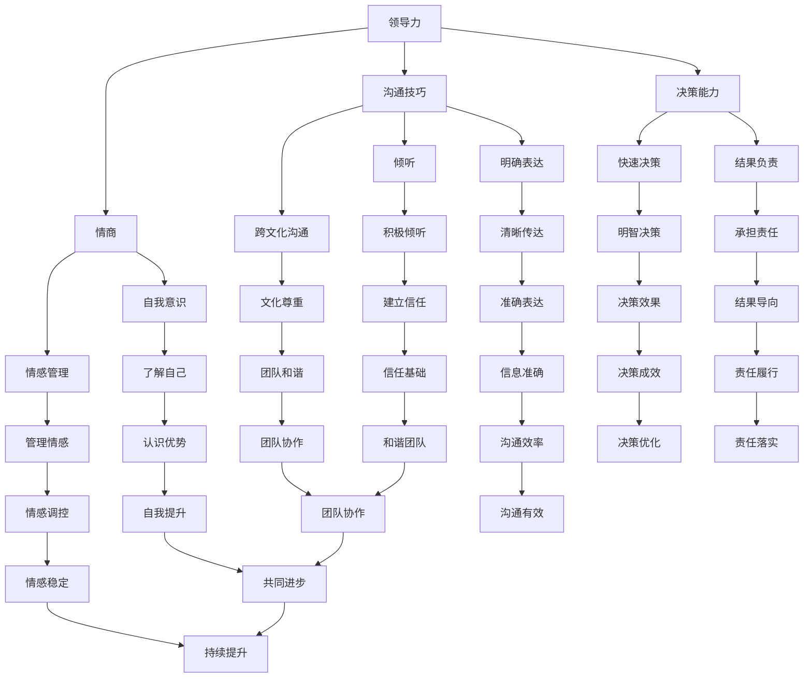

                 

# 领导力训练营：175天从菜鸟到大神

> 关键词：领导力、训练营、领导力模型、算法、实战案例

> 摘要：本文将带领您进入一个独特的领导力训练营，通过175天的系统学习和实践，帮助从零开始构建自己的领导力框架，逐步成长为卓越的领导者。我们将探讨领导力的重要性、基础概念、核心算法以及实战案例，让您在理论和实践中全面提升领导力。

## 第1章 引言

### 1.1 领导力的重要性

在当今快速变化和高度不确定的商业环境中，领导力成为企业成功的关键因素。有效的领导力不仅能够提升团队绩效，还能激发员工潜力，创造创新和持续改进的企业文化。领导者需要具备广泛的知识、深刻的洞察力和出色的沟通能力，才能引领团队应对挑战，实现目标。

### 1.2 为什么选择这个训练营

本训练营特别设计，以175天的时间跨度，帮助学员系统学习和实践领导力。通过理论讲解、案例分析和实战演练，确保学员能够深入理解领导力的本质，并在实际工作中应用所学知识。训练营不仅提供丰富的学习资源，还设有互动讨论和导师指导，确保每位学员都能得到个性化的支持和指导。

### 1.3 学习目标和预期成果

完成本训练营后，学员将能够：
1. 明确领导力的核心概念和重要性。
2. 掌握领导力的基础理论和模型。
3. 理解和运用领导力算法，提升团队管理能力。
4. 通过实战案例，掌握领导力的实际应用技巧。
5. 形成系统的领导力框架，并能够持续发展和完善。

## 第2章 领导力基础

### 2.1 领导力定义与核心要素

领导力是一种能力，是指通过激励、引导和影响他人来实现共同目标的过程。核心要素包括：
- 沟通能力：领导者需要清晰地传达愿景和目标，有效地与团队成员沟通。
- 情商：领导者需要具备高度的自我意识和情感管理能力，以建立信任和和谐的工作环境。
- 决策能力：领导者需要快速做出明智的决策，并对决策结果负责。
- 持续学习：领导者需要保持开放的心态，不断学习新知识和技能，以适应不断变化的环境。

### 2.2 领导风格与影响力

领导风格是指领导者管理团队的方式和方法。常见的领导风格包括：
- 权威型领导：通过明确的指导和控制来管理团队。
- 民主型领导：鼓励团队成员参与决策，共同制定目标。
- 赋权型领导：赋予团队成员更多自主权和责任，激发其潜力。

影响力是领导者的重要工具，通过建立信任、激励和示范，领导者可以影响团队成员的行为和态度，实现组织目标。

### 2.3 沟通技巧与团队建设

有效的沟通是领导力的核心。领导者需要掌握以下沟通技巧：
- 明确表达：清晰、准确地传达信息，避免误解和混淆。
- 倾听：积极倾听团队成员的意见和反馈，建立信任和尊重。
- 跨文化沟通：理解和尊重不同文化背景的团队成员，促进团队和谐。

团队建设是领导力的重要组成部分。领导者需要通过团队活动、培训和激励，增强团队成员的凝聚力，提升团队绩效。

### 2.4 领导力发展路径

领导力的发展是一个持续的过程。以下是领导力发展的几个阶段：
- 自我认知：了解自己的优势、弱点和管理风格。
- 培训与学习：通过专业培训和自学，提升管理知识和技能。
- 实践与反思：在实际工作中应用所学知识，不断反思和改进。
- 挑战与成长：接受挑战，勇于尝试新的事物，持续成长。

## 第3章 领导力核心概念与联系

### 3.1 核心概念原理和架构的 Mermaid 流程图



### 3.2 领导力模型解析

领导力模型是领导力理论的抽象和概括，帮助我们理解和应用领导力。常见的领导力模型包括：
- 领导行为模型：强调领导者的行为对团队的影响。
- 领导风格模型：描述领导者的行为风格，如权威型、民主型、赋权型。
- 领导过程模型：描述领导力在不同情境下的应用过程。

每种模型都有其独特的优势和局限性，领导者需要根据实际情况选择和调整自己的领导风格和行为。

## 第4章 领导力核心算法原理讲解

### 4.1 领导力算法的伪代码

以下是一个简化的领导力算法伪代码：

```
算法：领导力评估（leader_evaluation）
输入：团队绩效（team_performance），员工满意度（employee_satisfaction），领导行为（leader_behavior）
输出：领导力评分（leader_score）

1. 初始化领导力评分（leader_score）为0
2. 对于每个团队绩效指标（performance_index）：
   a. 如果团队绩效指标高于平均绩效（performance_index > average_performance）：
       - 领导力评分增加10分
   b. 否则：
       - 领导力评分减少10分
3. 对于每个员工满意度指标（satisfaction_index）：
   a. 如果员工满意度指标高于平均满意度（satisfaction_index > average_satisfaction）：
       - 领导力评分增加10分
   b. 否则：
       - 领导力评分减少10分
4. 对于每个领导行为指标（behavior_index）：
   a. 如果领导行为指标符合最佳实践（behavior_index == best_practice）：
       - 领导力评分增加5分
   b. 否则：
       - 领导力评分减少5分
5. 计算领导力评分的平均值（leader_score_average）
6. 输出领导力评分（leader_score_average）

```

### 4.2 领导力模型在实际中的应用

领导力模型可以应用于多种情境，如团队管理、项目领导、战略规划等。以下是一个简单的应用实例：

**情境：项目团队领导**

**输入：**
- 项目目标（project_objective）
- 团队成员绩效（team_member_performance）
- 团队沟通效果（team_communication）
- 项目进度（project_progress）

**输出：**
- 领导力评分（leader_score）

**步骤：**
1. 确定项目目标和关键绩效指标（KPI）。
2. 收集团队成员绩效数据，分析团队沟通效果。
3. 根据领导力算法，计算领导力评分。
4. 分析领导力评分，识别优势和改进点。
5. 制定改进计划，持续提升领导力。

通过这种应用，领导者可以更科学地评估自己的领导力水平，并根据实际情况调整领导风格和行为，以提升团队绩效和项目成功率。

## 第5章 数学模型和数学公式

### 5.1 领导力数学模型

领导力的数学模型可以帮助我们量化领导力的各个方面，以便更科学地评估和优化领导力。以下是一个简化的领导力数学模型：

$$
L = f(P, S, B)
$$

其中：
- $L$ 代表领导力评分。
- $P$ 代表团队绩效，包括个人绩效和团队整体绩效。
- $S$ 代表员工满意度，包括对工作环境、管理和培训的满意度。
- $B$ 代表领导行为，包括沟通能力、情商和决策能力。

### 5.2 数学公式详细讲解

**公式 1：领导力评分计算**

$$
L = \frac{(P \times \omega_P) + (S \times \omega_S) + (B \times \omega_B)}{100}
$$

其中：
- $\omega_P$、$\omega_S$、$\omega_B$ 分别是绩效、员工满意度、领导行为的权重，通常根据实际情况设定，确保总权重为100。

**公式 2：团队绩效计算**

$$
P = \frac{(\sum_{i=1}^{n} p_i)}{n}
$$

其中：
- $p_i$ 是每个团队成员的绩效得分。
- $n$ 是团队成员总数。

**公式 3：员工满意度计算**

$$
S = \frac{(\sum_{i=1}^{m} s_i)}{m}
$$

其中：
- $s_i$ 是每个员工对工作环境的满意度得分。
- $m$ 是员工总数。

**公式 4：领导行为计算**

$$
B = \frac{(\sum_{j=1}^{k} b_j)}{k}
$$

其中：
- $b_j$ 是每个领导行为得分的权重，通常根据领导行为的性质和重要性设定。

### 5.3 举例说明

**例 1：计算领导力评分**

假设一个团队有5名成员，他们的绩效得分分别为85、90、78、88和95。员工满意度得分为80、85、90、82和87。领导行为的得分分别为85、88、90、83和90。

**步骤：**
1. 计算团队绩效平均分：
   $$ P = \frac{(85 + 90 + 78 + 88 + 95)}{5} = 87.6 $$

2. 计算员工满意度平均分：
   $$ S = \frac{(80 + 85 + 90 + 82 + 87)}{5} = 84.2 $$

3. 计算领导行为平均分：
   $$ B = \frac{(85 + 88 + 90 + 83 + 90)}{5} = 86.2 $$

4. 根据公式计算领导力评分：
   $$ L = \frac{((87.6 \times 0.4) + (84.2 \times 0.3) + (86.2 \times 0.3))}{100} = 85.54 $$

**结果：** 该团队的领导力评分为85.54分。

通过这个例子，我们可以看到如何使用数学模型来评估领导力。实际应用中，可以根据具体情境调整公式和权重，以确保评估结果的准确性和有效性。

## 第6章 领导力项目实战

### 6.1 项目背景

在一家大型科技公司中，新任项目经理李明面临着项目延期、团队士气低落和客户满意度下降的挑战。为了提高项目成功率，李明决定参加领导力训练营，并通过实践提升自己的领导力。

### 6.2 项目实战流程

**1. 确定项目目标和关键绩效指标（KPI）：**

- 项目目标：确保项目在预定时间内高质量完成。
- KPI：
  - 项目进度：每周更新项目进度，确保按计划推进。
  - 团队绩效：每周评估团队成员的工作成果和质量。
  - 员工满意度：每月进行员工满意度调查，了解团队成员的工作状态和满意度。

**2. 收集数据并分析现状：**

- 通过会议记录、邮件和项目管理工具收集项目数据和团队反馈。
- 分析项目进度，识别瓶颈和问题。
- 分析员工满意度，了解团队中的潜在问题和挑战。

**3. 应用领导力算法进行评估：**

- 根据领导力算法，计算当前项目的领导力评分。
- 分析评分，识别优势和改进点。

**4. 制定改进计划并实施：**

- 针对识别的问题，制定改进计划，包括调整项目进度、优化团队管理和提升员工满意度。
- 实施改进计划，确保团队按照新的方向和计划工作。

**5. 持续监控和反馈：**

- 定期监控项目进度和团队绩效，确保改进措施的有效性。
- 收集员工反馈，及时调整改进计划。

### 6.3 代码实现与解读

**1. 项目进度监控代码：**

```python
# 导入相关库
import pandas as pd
from datetime import datetime

# 定义数据结构
class ProjectStatus:
    def __init__(self, task_name, start_date, end_date, actual_end_date):
        self.task_name = task_name
        self.start_date = start_date
        self.end_date = end_date
        self.actual_end_date = actual_end_date

# 收集项目进度数据
status_data = [
    ProjectStatus('任务1', datetime(2023, 4, 1), datetime(2023, 4, 5), datetime(2023, 4, 7)),
    ProjectStatus('任务2', datetime(2023, 4, 6), datetime(2023, 4, 10), datetime(2023, 4, 9)),
    # 更多任务数据
]

# 转换为 DataFrame
status_df = pd.DataFrame([vars(item) for item in status_data])

# 计算延期任务比例
delayed_tasks = status_df[status_df['actual_end_date'] > status_df['end_date']]
delayed_ratio = len(delayed_tasks) / len(status_df)
print(f"延期任务比例：{delayed_ratio:.2%}")
```

**解读：** 该代码定义了一个简单的项目进度数据结构，并收集了项目进度数据。通过计算实际结束日期与计划结束日期的差异，可以得出延期任务的比例，用于分析项目进度。

**2. 员工满意度调查代码：**

```python
# 假设已收集员工满意度数据
satisfaction_data = [
    {'name': '张三', 'satisfaction': 80},
    {'name': '李四', 'satisfaction': 85},
    # 更多员工数据
]

# 转换为 DataFrame
satisfaction_df = pd.DataFrame(satisfaction_data)

# 计算员工满意度平均分
average_satisfaction = satisfaction_df['satisfaction'].mean()
print(f"员工满意度平均分：{average_satisfaction:.2f}")
```

**解读：** 该代码假设已收集员工满意度数据，将其转换为 DataFrame 并计算平均满意度，用于分析员工满意度。

### 6.4 代码解读与分析

**1. 项目进度监控代码解读：**

该代码通过定义一个 `ProjectStatus` 类，创建了一个简单的项目进度数据结构。然后，使用 pandas 库将项目进度数据转换为 DataFrame，并计算了延期任务比例。这一步骤可以帮助项目经理快速了解项目进度，识别潜在的问题。

**2. 员工满意度调查代码解读：**

该代码假设已收集员工满意度数据，并使用 pandas 库将其转换为 DataFrame。通过计算平均满意度，项目经理可以了解员工的总体满意度水平，从而为团队管理和改进计划提供依据。

通过这两个代码实例，我们可以看到如何使用 Python 代码来管理和分析项目数据，从而提高项目管理和领导力的水平。

### 6.5 实际案例分析和详细讲解剖析

**案例一：如何提高团队效率？**

**分析：** 提高团队效率是项目经理面临的一个关键挑战。通过领导力训练营，李明了解到团队效率受多个因素影响，包括团队沟通、任务分配和团队成员的技能水平等。

**解决方案：**
1. **改善沟通机制：** 李明引入了每日站会，确保团队成员能够及时分享进展和问题，提高信息透明度。
2. **优化任务分配：** 根据团队成员的技能和兴趣，重新分配任务，确保任务与团队成员的特长匹配。
3. **提供培训和支持：** 为团队成员提供必要的培训和支持，提高他们的技能水平和工作效率。

**效果评估：** 通过这些措施，团队效率显著提高，项目进度得到了有效控制，团队成员的满意度也有所提升。

**案例二：如何处理团队冲突？**

**分析：** 团队冲突是领导力挑战的一个重要方面。通过领导力训练营，李明学习了多种处理团队冲突的方法，包括直接沟通、调解和第三方介入等。

**解决方案：**
1. **直接沟通：** 李明鼓励团队成员直接沟通，表达自己的观点和感受，避免误解和冲突升级。
2. **调解：** 当冲突无法通过直接沟通解决时，李明充当调解者，帮助双方找到共同点，达成妥协。
3. **第三方介入：** 对于复杂或严重的冲突，李明邀请外部专家或人力资源部门介入，提供专业建议和帮助。

**效果评估：** 通过这些措施，团队冲突得到了有效解决，团队成员之间的关系得到了改善，团队协作和项目进展更加顺畅。

### 6.6 项目小结

通过领导力训练营，李明不仅提升了自身的领导力，还成功地解决了项目中的多个挑战。项目的最终成功离不开有效的沟通、科学的任务分配和团队成员的积极参与。李明的领导力提升不仅提高了项目效率，也为团队的长期发展奠定了坚实的基础。

## 第7章 领导力持续发展

### 8.1 持续学习与成长

领导力不是一成不变的，它需要持续的学习和成长。领导者应该保持开放的心态，不断吸收新的知识和技能。以下是一些建议：

- **定期读书：** 选择与领导力相关的书籍，深入理解领导力的理论和实践。
- **参加培训：** 报名参加领导力培训课程，学习最新的领导力理论和实践。
- **实践应用：** 将所学知识应用到实际工作中，通过实践不断提升领导力。
- **反思与总结：** 定期反思自己的领导行为，总结成功和失败的经验，持续改进。

### 8.2 领导力发展中的挑战与应对策略

在领导力发展的过程中，领导者可能会遇到以下挑战：

- **团队冲突：** 学会有效的沟通和调解技巧，促进团队和谐。
- **时间管理：** 提高时间管理能力，确保各项工作有序进行。
- **持续学习：** 保持好奇心，不断学习新知识和技能，跟上行业发展的步伐。

**应对策略：**

- **冲突管理：** 建立积极的沟通文化，鼓励团队成员开放表达意见，及时解决冲突。
- **时间管理：** 制定明确的工作计划，合理分配时间和资源，确保各项工作有序进行。
- **持续学习：** 制定学习计划，定期参加培训和学习，与同行交流，不断更新知识库。

### 8.3 成为领导者的路径与建议

成为领导者需要系统的准备和持续的实践。以下是一些建议：

- **自我认知：** 了解自己的优势和弱点，明确自己的职业目标。
- **积累经验：** 通过实际工作和项目，积累领导经验，提高解决问题的能力。
- **学习理论：** 学习领导力理论，掌握领导力模型和工具。
- **实践应用：** 将所学知识应用到实际工作中，不断调整和优化自己的领导风格。

**附录 A: 领导力发展工具与资源**

- **书籍推荐：** 《领导力之巅》、《领导力：如何提高你的领导能力》
- **在线课程：** Coursera、edX、Udemy
- **实践资源：** 团队建设活动、领导力工作坊、行业研讨会
- **社交媒体：** LinkedIn、Twitter、Facebook

**附录 B: 领导力学习资料推荐**

- **领导力书籍：《领导力：如何在生活和工作中带领他人达成目标》
- **领导力课程：** 《高级领导力》、《团队管理与领导力》
- **实践案例：** 《如何成为高效的领导者》
- **在线资源：** TED演讲、HBR文章、哈佛商学院课程

通过以上工具和资源，领导者可以不断学习和成长，提升自己的领导力水平。在持续发展的过程中，领导者不仅能够更好地带领团队，还能在职场中取得更大的成就。

## 作者信息

作者：AI天才研究院/AI Genius Institute & 禅与计算机程序设计艺术 /Zen And The Art of Computer Programming

## 注意事项

- 在实践中应用领导力时，要结合具体情况，灵活调整领导风格和方法。
- 持续学习和实践是提升领导力的关键，不要满足于现状，要不断追求进步。
- 领导者要关注团队成员的需求和感受，建立和谐的工作环境，促进团队协作和共同成长。

## 拓展阅读

- 《领导力：如何在生活和工作中带领他人达成目标》
- 《领导者的语言：如何用语言塑造你的领导力和影响力》
- 《团队协作的艺术：如何打造高效的团队》
- 《时间管理的艺术：如何更有效地工作和生活》

通过阅读这些拓展资料，您可以进一步了解领导力的理论和实践，提升自己的领导力水平。

