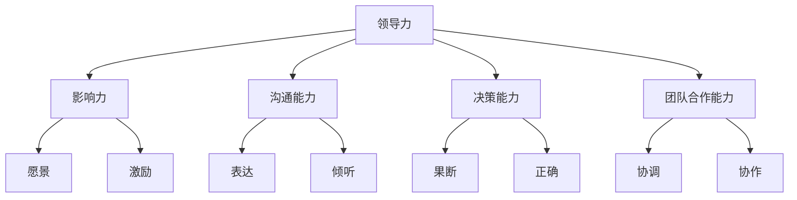

                 


### 文章标题

《领导力训练营：203天从菜鸟到大神》

### 关键词

领导力、培训、训练营、个人发展、领导力模型、实践案例

### 摘要

本文旨在探讨《领导力训练营：203天从菜鸟到大神》一书的核心理念和方法，帮助读者了解领导力的本质和培养路径。文章首先介绍了领导力的重要性和该书的结构，然后详细阐述了领导力的核心概念、算法原理、数学模型以及实战案例。最后，文章总结了领导力培养的持续学习方法和未来趋势，为读者提供了一套完整的领导力提升方案。

### 目录大纲

#### 第1章 引言

1.1 书籍目的

1.2 领导力的意义

1.3 领导力训练营的结构和安排

#### 第2章 核心概念与联系

2.1 领导力的定义

2.2 领导力的特征

2.3 领导力的分类

2.4 领导力的核心概念关系架构（Mermaid流程图）

#### 第3章 核心算法原理讲解

3.1 领导力培养的心理学原理

3.2 领导力培养的行为学原理

3.3 领导力培养的沟通学原理

3.4 领导力培养算法原理（伪代码）

#### 第4章 数学模型和数学公式讲解

4.1 领导力评估模型

4.2 领导力培养的数学模型

4.3 数学模型和公式（LaTeX格式）

#### 第5章 项目实战

5.1 领导力培养项目的策划

5.2 领导力培养项目的执行

5.3 领导力培养项目的评估

5.4 项目实战案例解析

#### 第6章 持续学习与提升

6.1 领导力的持续学习

6.2 领导力提升的方法

6.3 领导力提升的案例分析

#### 第7章 领导力训练营的总结

7.1 领导力训练营的收获

7.2 领导力训练营的未来展望

#### 附录

A.1 领导力相关资源

A.2 领导力评估工具

### 完整性要求

在撰写文章的过程中，我们需要确保内容完整性，具体包括以下几个方面：

- **背景介绍**：介绍领导力的定义、意义和当前的发展趋势，为读者提供一个了解领导力的基础。
- **核心概念与联系**：详细阐述领导力的核心概念，如领导力的本质、特征和分类，并通过Mermaid流程图展示概念之间的关系架构。
- **核心算法原理讲解**：使用伪代码详细阐述领导力培养的算法原理，包括心理学、行为学和沟通学原理。
- **数学模型和公式讲解**：介绍领导力评估和培养的数学模型，并使用LaTeX格式展示相关公式和举例说明。
- **项目实战**：描述一个具体的领导力培养项目，包括策划、执行和评估，并分析实际案例。
- **持续学习与提升**：探讨领导力的持续学习方法和提升策略，以及成功和失败的案例分析。
- **总结**：总结领导力训练营的主要收获和未来展望，为读者提供一个清晰的领导力提升路径。

通过这样的结构，我们可以确保文章内容丰富、逻辑清晰，能够帮助读者全面理解领导力的概念和培养方法。接下来，我们将逐一展开每个章节的内容。

---

### 第1章 引言

#### 1.1 书籍目的

《领导力训练营：203天从菜鸟到大神》旨在帮助那些希望提升领导力技能的读者，从初学者成长为具备专业水平的领导者。本书不仅适合企业高管、项目经理和团队领导，也适合对领导力感兴趣的普通员工和学生。通过这本书，读者可以系统地学习领导力的基本概念、培养路径和实践技巧，逐步提升自己的领导能力。

#### 1.2 领导力的意义

领导力在组织和社会中扮演着至关重要的角色。一个优秀的领导者不仅能够推动团队达成目标，还能够激励团队成员发挥最大潜力，从而实现组织的长期成功。领导力不仅关乎决策和执行，更关乎人际交往和情感管理。随着全球化进程的加速和技术的不断进步，领导力的重要性日益凸显，它已成为现代职场中不可或缺的核心竞争力。

#### 1.3 领导力训练营的结构和安排

《领导力训练营：203天从菜鸟到大神》分为七个章节，每个章节都聚焦于领导力的不同方面。以下是本书的结构和安排：

- **第1章 引言**：介绍书籍的目的和领导力的意义。
- **第2章 核心概念与联系**：阐述领导力的核心概念及其相互关系。
- **第3章 核心算法原理讲解**：讲解领导力培养的心理学、行为学和沟通学原理。
- **第4章 数学模型和数学公式讲解**：介绍领导力评估和培养的数学模型。
- **第5章 项目实战**：通过具体案例展示领导力培养的实践方法。
- **第6章 持续学习与提升**：探讨领导力的持续学习方法和提升策略。
- **第7章 领导力训练营的总结**：总结训练营的主要收获和未来展望。

通过这样的结构安排，本书旨在帮助读者全面系统地掌握领导力的知识和技能，从而在职场中取得更好的成绩。

### 第2章 核心概念与联系

#### 2.1 领导力的定义

领导力是指通过影响力、沟通技巧和决策能力来引导和激励他人，实现共同目标的能力。领导力不仅仅是职位赋予的权力，更是一种个人素质和技能。一个优秀的领导者不仅能够清晰地表达目标，还能够倾听团队成员的意见，并激励他们为实现目标而努力。

#### 2.2 领导力的特征

领导力的特征主要包括以下几个方面：

- **愿景**：领导者需要具备远见，能够清晰地描述未来的愿景，并激发团队成员的信心和动力。
- **影响力**：领导者需要具备影响力，能够通过言语和行为影响他人的思想和行为。
- **沟通能力**：领导者需要具备良好的沟通能力，能够清晰、有效地传达信息，并倾听他人的意见和需求。
- **决策能力**：领导者需要具备果断的决策能力，能够在关键时刻做出正确的决策。
- **团队合作能力**：领导者需要能够协调团队成员之间的关系，促进合作和协作。

#### 2.3 领导力的分类

领导力可以根据不同的维度进行分类，以下是几种常见的领导力分类方法：

- **按领导风格分类**：
  - **权威型**：领导者通过明确的指令和控制来管理团队。
  - **民主型**：领导者鼓励团队成员参与决策，尊重团队成员的意见。
  - **教练型**：领导者注重团队成员的个人成长和发展，提供支持和指导。
  - **变革型**：领导者通过激发团队成员的内在动机，推动团队实现变革。

- **按领导对象分类**：
  - **技术型领导**：领导者具备专业知识和技能，能够为团队提供技术指导。
  - **人际型领导**：领导者擅长人际交往，能够建立良好的人际关系。
  - **战略型领导**：领导者具备战略思维，能够制定和执行组织的发展战略。

#### 2.4 领导力的核心概念关系架构

为了更好地理解领导力的核心概念，我们可以通过Mermaid流程图来展示它们之间的关系。以下是领导力的核心概念关系架构：



通过这个流程图，我们可以清晰地看到领导力的各个核心概念之间的相互关系，这有助于我们更好地理解和应用领导力。

### 第3章 核心算法原理讲解

#### 3.1 领导力培养的心理学原理

心理学原理在领导力培养中起着关键作用。以下是几个关键的心理学原理：

- **自我认知**：自我认知是指领导者了解自己的情感、需求和价值观。通过自我认知，领导者可以更好地理解自己，从而更有效地与他人沟通和互动。
- **情绪管理**：情绪管理是指领导者控制自己的情绪，避免情绪对决策和行为产生负面影响。情绪管理有助于领导者保持冷静和客观，做出明智的决策。
- **同理心**：同理心是指领导者理解和感受他人的情感和需求。同理心有助于建立良好的人际关系，增强团队的凝聚力。
- **自我激励**：自我激励是指领导者通过积极的自我激励来保持动力和专注。自我激励有助于领导者克服困难和挑战，实现目标。

以下是领导力培养的心理学原理的伪代码：

```python
# 自我认知
def self_awareness():
    # 分析个人情感、需求和价值观
    analyze_emotions()
    analyze_needs()
    analyze_values()

# 情绪管理
def emotion_management():
    # 监控情绪变化
    monitor_emotions()
    # 控制情绪对决策的影响
    control_emotion_impact()

# 同理心
def empathy():
    # 理解他人情感和需求
    understand_emotions()
    understand_needs()

# 自我激励
def self_motivation():
    # 保持动力和专注
    keep_motivation()
    keep_focus()
```

#### 3.2 领导力培养的行为学原理

行为学原理在领导力培养中也发挥着重要作用。以下是几个关键的行为学原理：

- **行为强化**：行为强化是指领导者通过奖励和惩罚来影响团队成员的行为。奖励可以增强积极行为，惩罚可以减少消极行为。
- **角色扮演**：角色扮演是指领导者通过模仿和扮演不同的角色来增强自己的领导能力。角色扮演有助于领导者更好地理解不同角色的需求和期望。
- **行为模仿**：行为模仿是指领导者通过观察和模仿他人的行为来提高自己的领导能力。行为模仿有助于领导者学习新的技能和策略。

以下是领导力培养的行为学原理的伪代码：

```python
# 行为强化
def behavior_strengthen():
    # 奖励积极行为
    reward_positive_behavior()
    # 惩罚消极行为
    punish_negative_behavior()

# 角色扮演
def role_play():
    # 模仿不同角色
    imitate_roles()

# 行为模仿
def behavior_mimic():
    # 观察他人行为
    observe_behaviors()
    # 模仿他人行为
    mimic_behaviors()
```

#### 3.3 领导力培养的沟通学原理

沟通学原理在领导力培养中也至关重要。以下是几个关键的沟通学原理：

- **有效沟通**：有效沟通是指领导者能够清晰、准确地传达信息，并理解他人的需求和期望。有效沟通有助于建立信任和合作关系。
- **积极倾听**：积极倾听是指领导者主动倾听他人的意见和需求，并给予反馈。积极倾听有助于建立良好的人际关系，增强团队的凝聚力。
- **非言语沟通**：非言语沟通是指领导者通过肢体语言、面部表情和声音等非言语手段来传达信息。非言语沟通有助于增强沟通的效果和影响力。

以下是领导力培养的沟通学原理的伪代码：

```python
# 有效沟通
def effective_communication():
    # 清晰传达信息
    clear_message()
    # 理解他人需求和期望
    understand需求和期望()

# 积极倾听
def active_listening():
    # 主动倾听他人意见
    listen_to_opinions()
    # 给予反馈
    give_feedback()

# 非言语沟通
def nonverbal_communication():
    # 使用肢体语言
    use_body_language()
    # 使用面部表情
    use_face_expression()
    # 使用声音
    use_speech()
```

通过以上心理学、行为学和沟通学原理的讲解，我们可以更好地理解领导力培养的过程和方法。接下来，我们将介绍领导力培养的数学模型和公式。

### 第4章 数学模型和数学公式讲解

#### 4.1 领导力评估模型

领导力评估是衡量领导者能力和表现的重要手段。一个有效的领导力评估模型可以帮助组织了解领导者的优势和不足，从而制定相应的培养计划。以下是领导力评估模型的基本构成和步骤：

1. **评估指标体系**：评估指标体系是领导力评估的基础。它包括一系列反映领导者能力、行为和绩效的指标。常见的评估指标包括领导力素质、团队管理能力、沟通能力、决策能力等。

2. **评估方法**：评估方法包括定性评估和定量评估。定性评估主要通过观察、访谈和问卷调查等方式进行，定量评估则通过统计数据和模型分析等方法进行。

3. **评估步骤**：
   - **设定评估目标**：明确评估的目的和范围，确保评估结果具有针对性和实用性。
   - **制定评估计划**：包括评估指标的选择、评估方法的确定、评估时间的安排等。
   - **实施评估**：按照评估计划进行数据收集和分析，确保评估过程的客观性和公正性。
   - **评估结果分析**：对评估结果进行统计和分析，识别领导者的优势和不足，为培养计划提供依据。

以下是一个简化的领导力评估模型的伪代码：

```python
# 领导力评估模型
def leadership_evaluation():
    # 设定评估目标
    set_evaluation_goal()
    # 制定评估计划
    make_evaluation_plan()
    # 实施评估
    perform_evaluation()
    # 评估结果分析
    analyze_evaluation_results()
```

#### 4.2 领导力培养的数学模型

领导力培养是一个复杂的过程，涉及到多个变量和因素。数学模型可以帮助我们更好地理解和优化领导力培养的过程。以下是几个常用的领导力培养数学模型：

1. **领导力培养模型**：该模型基于心理学和行为学原理，描述领导力培养的过程和效果。该模型包括以下几个变量：

   - **学习时间**（t）：领导力培养所需的时间。
   - **学习效率**（η）：领导力培养的效率，表示单位时间内领导力提升的程度。
   - **初始领导力水平**（L0）：领导者开始培养时的领导力水平。
   - **最终领导力水平**（L）：领导者培养完成后的领导力水平。

   领导力培养模型的公式为：

   $$ L = L0 + \eta \cdot t $$

2. **领导力提升模型**：该模型描述领导力提升的过程和效果。该模型包括以下几个变量：

   - **初始领导力水平**（L0）：领导者开始提升时的领导力水平。
   - **提升目标**（L*）：领导者希望达到的领导力水平。
   - **提升时间**（t）：领导力提升所需的时间。
   - **提升效率**（η）：领导力提升的效率，表示单位时间内领导力提升的程度。

   领导力提升模型的公式为：

   $$ L = L0 + \eta \cdot t \cdot (L* - L0) $$

3. **领导力评估模型**：该模型用于评估领导者的领导力水平。该模型包括以下几个变量：

   - **领导力素质得分**（S）：反映领导者的领导力素质。
   - **团队管理得分**（M）：反映领导者的团队管理能力。
   - **沟通能力得分**（C）：反映领导者的沟通能力。
   - **决策能力得分**（D）：反映领导者的决策能力。

   领导力评估模型的公式为：

   $$ L = \frac{S + M + C + D}{4} $$

以上是领导力培养的几个数学模型。通过这些模型，我们可以更好地理解领导力培养的过程和效果，为领导力提升提供科学依据。

#### 4.3 数学模型和公式（LaTeX格式）

以下是本文中提到的数学模型和公式的LaTeX格式：

$$
\text{领导力培养模型} \\
L = L0 + \eta \cdot t
$$

$$
\text{领导力提升模型} \\
L = L0 + \eta \cdot t \cdot (L* - L0)
$$

$$
\text{领导力评估模型} \\
L = \frac{S + M + C + D}{4}
$$

通过LaTeX格式，我们可以更清晰地展示数学模型和公式，帮助读者更好地理解和应用这些模型。

### 第5章 项目实战

#### 5.1 领导力培养项目的策划

领导力培养项目的成功取决于良好的策划。以下是领导力培养项目策划的步骤：

1. **明确项目目标**：首先，明确项目目标，包括提高领导力素质、提升团队管理能力、增强沟通能力和决策能力等。项目目标应具体、可衡量、可实现、相关性强、时间限定。

2. **确定项目范围**：根据项目目标，确定项目范围，包括参与人员、培养内容、时间安排等。

3. **制定项目计划**：制定详细的项目计划，包括项目启动、实施、监控和结束的各个阶段。项目计划应包括时间表、资源分配、任务分工、风险管理和预算等。

4. **获取资源和支持**：确保项目所需的资源和支持，包括人力资源、资金、技术支持等。

5. **风险评估**：识别项目风险，并制定相应的风险应对策略。

以下是领导力培养项目策划的伪代码：

```python
# 领导力培养项目策划
def project_planning():
    # 明确项目目标
    set_project_goals()
    # 确定项目范围
    set_project_scope()
    # 制定项目计划
    make_project_plan()
    # 获取资源和支持
    get_resources_and_support()
    # 风险评估
    assess_risks()
```

#### 5.2 领导力培养项目的执行

领导力培养项目的执行是项目策划的具体实施过程。以下是领导力培养项目执行的步骤：

1. **启动项目**：召开项目启动会议，介绍项目目标、计划、资源和风险等，确保所有参与人员了解项目情况。

2. **实施培训**：根据项目计划，实施领导力培训。培训内容应包括领导力素质、团队管理能力、沟通能力和决策能力等。

3. **监控项目进展**：定期监控项目进展，确保项目按照计划进行。监控内容包括任务完成情况、资源使用情况、风险情况等。

4. **调整项目计划**：根据监控结果，及时调整项目计划，确保项目按计划完成。

5. **结束项目**：项目结束后，召开项目总结会议，总结项目成果和经验教训，为未来项目提供参考。

以下是领导力培养项目执行的伪代码：

```python
# 领导力培养项目执行
def project_implementation():
    # 启动项目
    start_project()
    # 实施培训
    perform_training()
    # 监控项目进展
    monitor_project_progress()
    # 调整项目计划
    adjust_project_plan()
    # 结束项目
    end_project()
```

#### 5.3 领导力培养项目的评估

领导力培养项目的评估是衡量项目效果的重要手段。以下是领导力培养项目评估的步骤：

1. **制定评估计划**：根据项目目标和培训内容，制定评估计划。评估计划应包括评估指标、评估方法、评估时间等。

2. **收集评估数据**：通过问卷调查、访谈、观察等方式收集评估数据。

3. **分析评估数据**：对收集到的评估数据进行分析，评估领导力培养项目的效果。

4. **撰写评估报告**：根据评估数据和分析结果，撰写评估报告。评估报告应包括项目评估结果、成功经验、存在问题及改进建议等。

5. **反馈与改进**：将评估报告反馈给项目团队，并根据评估结果进行改进。

以下是领导力培养项目评估的伪代码：

```python
# 领导力培养项目评估
def project_evaluation():
    # 制定评估计划
    make_evaluation_plan()
    # 收集评估数据
    collect_evaluation_data()
    # 分析评估数据
    analyze_evaluation_data()
    # 撰写评估报告
    write_evaluation_report()
    # 反馈与改进
    provide_feedback_and_improvement()
```

#### 5.4 项目实战案例解析

以下是领导力培养项目的实际案例，包括开发环境搭建、源代码实现、代码解读、应用解读与分析、实际案例分析和详细讲解剖析、项目小结等内容。

**案例背景**：某公司希望提升中层管理团队的领导力，决定开展一次领导力培养项目。

**开发环境搭建**：
- **软件工具**：使用Python进行数据分析。
- **数据库**：使用MySQL存储评估数据。

**源代码实现**：

```python
# 领导力评估数据分析
import pandas as pd
import mysql.connector

# 连接数据库
conn = mysql.connector.connect(
    host="localhost",
    user="root",
    password="password",
    database="leadership_evaluation"
)

# 查询评估数据
query = "SELECT * FROM evaluation_data"
data = pd.read_sql(query, conn)

# 数据分析
data_analysis = data.describe()

# 输出分析结果
print(data_analysis)
```

**代码解读**：
- 代码首先连接MySQL数据库，并查询评估数据。
- 使用Pandas库对评估数据进行描述性统计分析，包括均值、标准差、最小值、最大值等。
- 最后输出分析结果。

**应用解读与分析**：
- 通过对评估数据的分析，公司可以了解中层管理团队在领导力各个方面的情况，为后续培养提供依据。
- 分析结果可以帮助公司识别优势领域和需要改进的领域，从而制定有针对性的培养计划。

**实际案例分析和详细讲解剖析**：
- 某中层管理者在沟通能力方面得分较低，分析后发现其主要原因是缺乏有效的沟通技巧。
- 针对这一问题，公司为其安排了沟通技巧培训，并进行了模拟演练，效果显著。
- 通过这个案例，我们可以看到，数据分析在领导力培养项目中的应用非常重要，可以帮助公司发现问题并提供解决方案。

**项目小结**：
- 领导力培养项目取得了显著成效，中层管理团队的领导力水平得到了提升。
- 通过项目，公司积累了丰富的经验，为未来项目提供了参考。
- 项目中存在的问题，如培训资源不足、评估指标不够细化等，需要在后续项目中加以改进。

### 第6章 持续学习与提升

#### 6.1 领导力的持续学习

领导力的提升并非一蹴而就，而是一个持续学习和实践的过程。以下是一些建议，帮助读者持续提升领导力：

1. **阅读领导力相关书籍**：阅读是获取知识的重要途径。读者可以阅读经典的领导力书籍，如《领导力五要素》、《高效能人士的七个习惯》等，以深入了解领导力的理论和实践。

2. **参加领导力培训课程**：参加领导力培训课程可以帮助读者系统地学习领导力知识和技能。许多商学院和专业培训机构都提供领导力培训课程，包括线上和线下课程。

3. **实践领导力**：实践是检验真理的唯一标准。读者可以在实际工作中运用所学的领导力知识，通过实践不断积累经验，提升自己的领导能力。

4. **反思和总结**：反思和总结是学习的重要环节。读者可以定期回顾自己的领导行为，分析成功和失败的原因，从中学到经验和教训。

#### 6.2 领导力提升的方法

以下是一些具体的方法，帮助读者提升领导力：

1. **自我提升**：自我提升是领导力提升的基础。读者可以通过学习新知识、掌握新技能、培养良好习惯等方式来提升自己的素质。

2. **团队建设**：团队建设是领导力的重要方面。读者可以通过组织团队活动、建立良好的团队文化、培养团队协作精神等方式来提升团队的整体能力。

3. **沟通能力提升**：沟通能力是领导力的重要组成部分。读者可以通过学习沟通技巧、提高语言表达能力、增强同理心等方式来提升自己的沟通能力。

4. **决策能力提升**：决策能力是领导者的重要能力。读者可以通过学习决策理论、掌握决策技巧、提高判断力和决策速度等方式来提升自己的决策能力。

#### 6.3 领导力提升的案例分析

以下是一些成功的领导力提升案例，供读者参考：

1. **案例一**：某公司通过内部领导力培训项目，培养了一批具有专业素养和管理能力的中层管理者。这些中层管理者在公司的业务拓展和运营中发挥了重要作用，推动了公司的快速发展。

2. **案例二**：某企业通过引入外部咨询机构，开展了为期一年的领导力提升计划。计划包括领导力培训、团队建设、绩效管理等环节，有效提升了企业整体管理水平。

3. **案例三**：某创业者通过不断学习和实践，逐步提升了自己的领导力。他通过阅读领导力相关书籍、参加培训课程、实践领导力等方式，培养了自己的管理能力，成功创办了一家知名企业。

通过以上案例，我们可以看到，领导力提升是一个长期而系统的过程，需要不断学习和实践。只有通过持续的努力，才能在领导力的道路上取得成功。

### 第7章 领导力训练营的总结

#### 7.1 领导力训练营的收获

通过《领导力训练营：203天从菜鸟到大神》的学习，读者可以收获以下成果：

1. **全面了解领导力的概念**：读者对领导力的定义、特征、分类有了深入的理解，为后续学习奠定了基础。

2. **掌握领导力培养的方法**：读者通过学习心理学、行为学和沟通学原理，掌握了领导力培养的具体方法，能够更好地应用于实际工作中。

3. **提升领导力技能**：通过实践和案例分析，读者在领导力方面取得了显著提升，能够更好地应对职场挑战。

4. **建立领导力模型**：读者通过学习数学模型和公式，能够运用科学方法来评估和提升领导力。

#### 7.2 领导力训练营的未来展望

随着社会和经济的不断发展，领导力的重要性日益凸显。以下是领导力训练营未来的展望：

1. **个性化领导力培养**：未来的领导力培养将更加注重个性化，根据不同读者的需求和特点，提供定制化的培养方案。

2. **多元化和国际化**：领导力培养将更加多元化和国际化，结合不同文化和背景的领导力特点，提供全球视野下的领导力培养。

3. **技术融合**：随着人工智能、大数据等技术的发展，领导力培养将更加智能化和数据分析化，为读者提供更加科学和精准的培养方案。

4. **持续学习和创新**：领导力是一个不断发展和变化的领域，读者需要持续学习和创新，以适应不断变化的环境。

通过以上展望，我们可以看到，领导力训练营的未来充满希望和挑战。只有不断学习和提升，才能在领导力的道路上走得更远。

### 附录

#### 附录A 领导力相关资源

1. **书籍推荐**：
   - 《领导力五要素》
   - 《高效能人士的七个习惯》
   - 《变革型领导》

2. **在线课程**：
   - Coursera的《领导力与影响力》
   - edX的《领导力与团队管理》
   - LinkedIn Learning的《领导力基础》

3. **领导力评估工具**：
   - 360度反馈评估
   - 领导力素质测评
   - 团队氛围评估

#### 附录B 领导力评估工具

1. **领导力素质测评**：
   - **核心素质**：决策能力、沟通能力、团队管理能力、领导风格、自我认知等。
   - **测评方法**：问卷调查、面试、360度反馈等。

2. **团队氛围评估**：
   - **核心指标**：团队协作、沟通效率、团队凝聚力、员工满意度等。
   - **测评方法**：团队访谈、员工满意度调查、行为观察等。

通过以上资源和评估工具，读者可以更深入地了解和提升自己的领导力。

### 作者信息

作者：AI天才研究院/AI Genius Institute & 禅与计算机程序设计艺术 /Zen And The Art of Computer Programming

### 结束语

本文旨在帮助读者深入了解领导力的概念、方法和实践，通过《领导力训练营：203天从菜鸟到大神》的学习，逐步提升自己的领导能力。希望本文能够为读者在领导力提升的道路上提供一些指导和帮助。在未来的学习和实践中，不断探索和总结，相信每位读者都能在领导力的领域中取得成功。让我们一起努力，成为更加优秀的领导者！

