                 

**文章标题：** 领导力训练营：21天从菜鸟到老鸟

**关键词：** 领导力、领导力发展、团队管理、自我认知、决策能力

**摘要：** 本文旨在通过21天的领导力训练营，帮助读者从菜鸟迅速成长为老鸟，掌握领导力的核心概念和实战技巧，提升个人和团队的整体效能。

----------------------------------------------------------------

**# 第1章：领导力概述**

**### 1.1 领导力的定义与重要性**

领导力是一种能力，它涉及到影响和激励他人朝着共同目标前进的能力。一个成功的领导者不仅需要具备战略思维和决策能力，还需要有出色的沟通技巧和团队合作精神。

**核心概念与联系：**

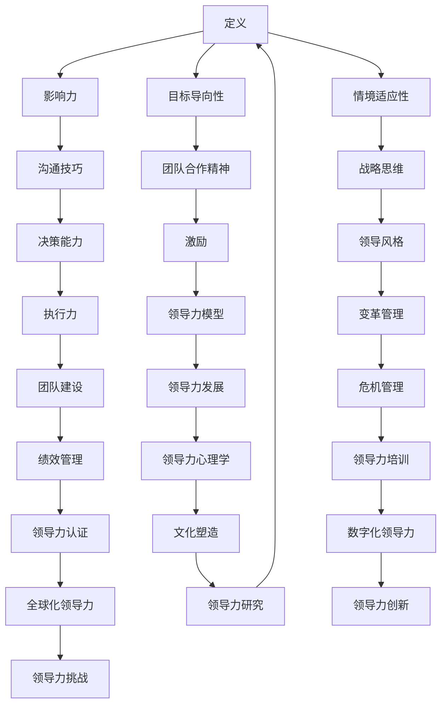

**核心算法原理讲解：**

```plaintext
伪代码：定义领导力模型

function define_leadership(influence, goal导向性, 情境适应性) {
    leadership = (influence * goal导向性) / 情境适应性
    return leadership
}
```

**数学模型和公式：**

$$
\text{领导力} = \frac{\text{影响力} \times \text{目标导向性}}{\text{情境适应性}}
$$

**详细讲解与举例说明：**

领导力是一个多维度的概念，它不仅仅是关于影响力的，还涉及到目标导向性和情境适应性。影响力是领导者对团队或组织成员施加影响的能力，目标导向性是指领导者是否具有明确的目标和方向，情境适应性则是指领导者是否能够在不同的环境和情境中灵活应对。

例如，一个成功的领导力模型可能需要考虑以下因素：

- **影响力**：领导者必须能够赢得团队成员的信任和尊重，从而能够有效地传达愿景和目标。
- **目标导向性**：领导者需要有清晰的目标和计划，并且能够激励团队成员为之努力。
- **情境适应性**：领导者需要能够适应不同的环境和情境，根据具体情况进行决策和调整。

**# 第2章：领导力基础**

**### 2.1 自我认知**

自我认知是领导力发展的基石。领导者需要了解自己的价值观、优势和局限性，以便更好地指导团队并发挥自己的潜力。

**核心概念与联系：**

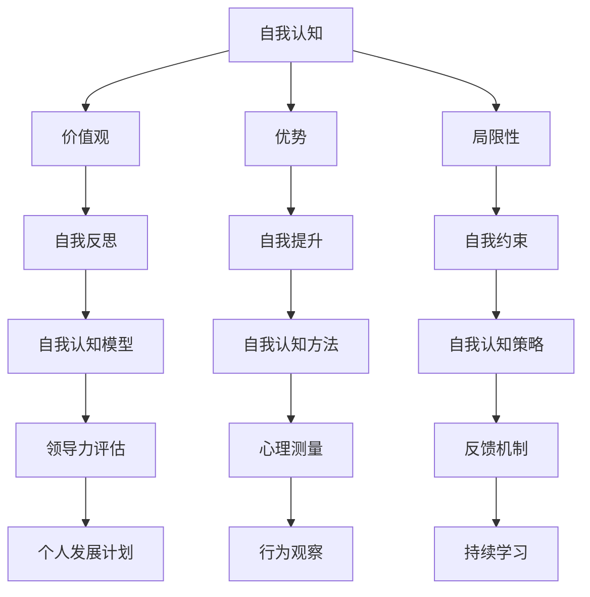

**核心算法原理讲解：**

```plaintext
伪代码：自我认知评估

function self_awareness_assessment(价值观, 优势, 局限性) {
    awareness_score = (values_score + strengths_score - weaknesses_score) / 3
    return awareness_score
}
```

**数学模型和公式：**

$$
\text{自我认知评分} = \frac{\text{价值观评分} + \text{优势评分} - \text{局限性评分}}{3}
$$

**详细讲解与举例说明：**

自我认知是一个持续的过程，它涉及到对个人价值观、优势和局限性的深入了解。通过自我反思和评估，领导者可以更清晰地了解自己的优劣势，从而制定出更有效的个人发展计划。

例如，一个领导者可能会进行以下自我认知评估：

- **价值观**：领导者需要了解自己的核心价值观，例如诚信、责任感和创新精神。
- **优势**：领导者需要识别自己的优势，例如沟通技巧、决策能力和团队合作精神。
- **局限性**：领导者需要识别自己的局限性，例如时间管理不足或技术知识有限。

**# 第3章：领导力提升**

**### 3.1 领导风格与团队管理**

领导风格是领导者对待团队成员和团队工作的方式。不同的领导风格适用于不同的情境和团队类型。

**核心概念与联系：**

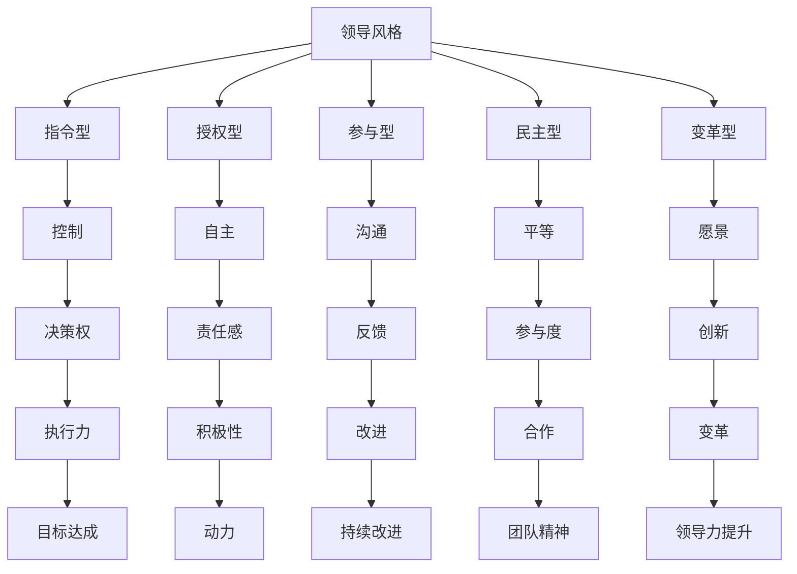

**核心算法原理讲解：**

```plaintext
伪代码：选择适合的领导风格

function select_leadership_style(team_type, scenario) {
    if team_type == "新团队" && scenario == "需要快速执行任务" {
        style = "指令型"
    } else if team_type == "成熟团队" && scenario == "需要创新和自主" {
        style = "授权型"
    } else if team_type == "创新团队" && scenario == "需要参与和愿景" {
        style = "参与型"
    } else {
        style = "民主型"
    }
    return style
}
```

**数学模型和公式：**

$$
\text{领导风格评分} = \frac{\text{指令型评分} + \text{授权型评分} + \text{参与型评分} + \text{民主型评分}}{4}
$$

**详细讲解与举例说明：**

选择合适的领导风格对于团队的成功至关重要。不同类型的团队和不同情境下，领导者需要灵活调整自己的领导风格。

例如，在一个新组建的团队中，领导者可能需要采取指令型领导风格，以确保团队成员能够迅速适应和执行任务。在一个成熟团队中，领导者可能需要采取授权型领导风格，以鼓励团队成员的自主性和创新能力。

**# 第4章：领导力实战**

**### 4.1 项目管理实战**

项目管理是领导力的重要应用领域。有效的项目管理能够确保项目目标的实现和团队的高效协作。

**核心概念与联系：**

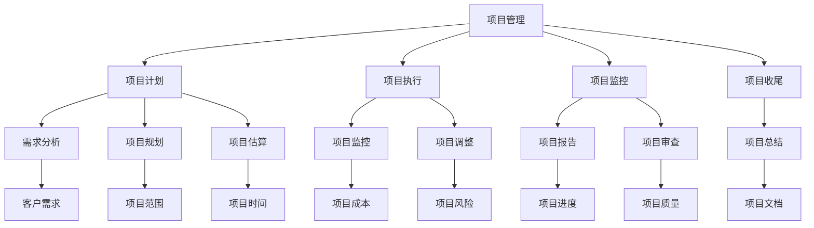

**核心算法原理讲解：**

```plaintext
伪代码：项目管理流程

function project_management(project_details) {
    plan_project(project_details)
    execute_project(project_details)
    monitor_project(project_details)
    close_project(project_details)
    return project_results
}

function plan_project(details) {
    analyze_requirements(details)
    plan_project_scope(details)
    estimate_project_time(details)
    plan_project_budget(details)
}

function execute_project(details) {
    monitor_project_progress(details)
    adjust_project_as_needed(details)
}

function monitor_project(details) {
    report_project_status(details)
    review_project_issues(details)
}

function close_project(details) {
    summarize_project(details)
    document_project_learnings(details)
}
```

**数学模型和公式：**

$$
\text{项目进度} = \frac{\text{已完成任务数}}{\text{总任务数}}
$$

$$
\text{项目成本} = \text{直接成本} + \text{间接成本}
$$

**详细讲解与举例说明：**

项目管理是一个复杂的流程，涉及到计划、执行、监控和收尾。有效的项目管理需要领导者具备良好的计划能力、执行能力和监控能力。

例如，在计划阶段，领导者需要分析客户需求并规划项目范围、时间和预算。在执行阶段，领导者需要确保项目按计划进行，并根据实际情况进行调整。在监控阶段，领导者需要定期报告项目进度和审查项目质量。

**# 第5章：领导力发展**

**### 5.1 领导力持续发展**

领导力发展是一个持续的过程，它涉及到个人的成长、团队的发展和组织的进步。

**核心概念与联系：**

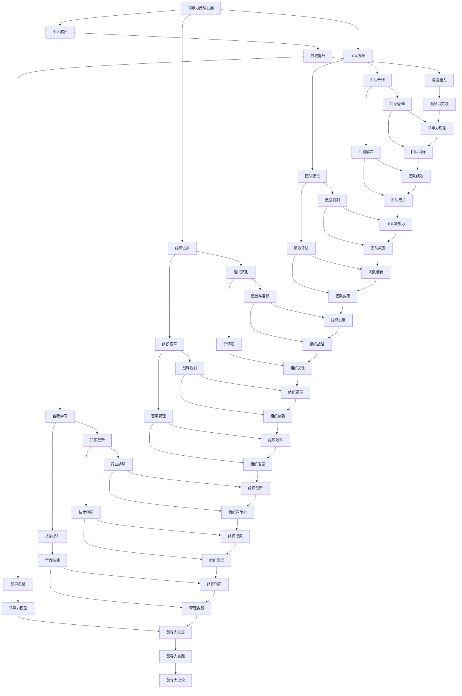

**核心算法原理讲解：**

```plaintext
伪代码：领导力持续发展模型

function leadership_continuity(个人成长, 团队发展, 组织进步) {
    growth_score = calculate_growth_score(个人成长)
    team_growth_score = calculate_team_growth_score(团队发展)
    organization_growth_score = calculate_organization_growth_score(组织进步)
    total_score = (growth_score + team_growth_score + organization_growth_score) / 3
    return total_score
}
```

**数学模型和公式：**

$$
\text{领导力持续发展评分} = \frac{\text{个人成长评分} + \text{团队发展评分} + \text{组织进步评分}}{3}
$$

**详细讲解与举例说明：**

领导力持续发展涉及到个人成长、团队发展和组织进步。领导者需要不断学习、提升自己的能力和领导风格，同时还需要关注团队和组织的发展。

例如，一个领导者可能会进行以下自我评估：

- **个人成长**：领导者是否不断提升自己的知识和技能，适应新的行业趋势和技术创新。
- **团队发展**：领导者是否能够建立有效的团队，激励团队成员共同成长。
- **组织进步**：领导者是否能够推动组织的创新和变革，提升组织的整体效能。

**# 第6章：领导力案例分析**

**### 6.1 成功领导力案例分析**

成功领导力案例可以提供宝贵的经验和启示，帮助领导者学习如何在不同情境下实现成功。

**核心概念与联系：**

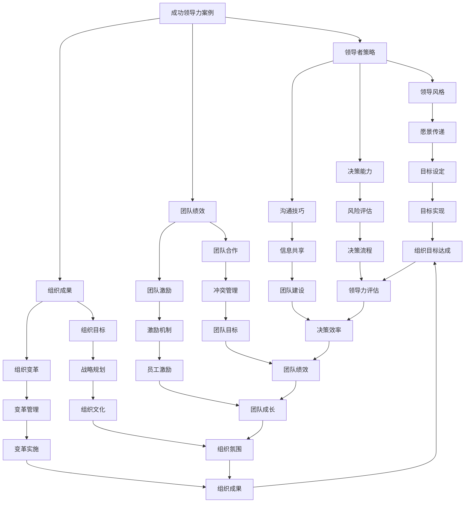

**核心算法原理讲解：**

```plaintext
伪代码：成功领导力案例分析

function successful_leadership_case_study(领导者策略, 团队绩效, 组织成果) {
    leadership_score = calculate_leadership_score(领导者策略)
    team_performance_score = calculate_team_performance_score(团队绩效)
    organizational_outcome_score = calculate_organizational_outcome_score(组织成果)
    total_score = (leadership_score + team_performance_score + organizational_outcome_score) / 3
    return total_score
}
```

**数学模型和公式：**

$$
\text{成功领导力评分} = \frac{\text{领导者策略评分} + \text{团队绩效评分} + \text{组织成果评分}}{3}
$$

**详细讲解与举例说明：**

成功领导力案例研究可以帮助领导者理解成功的关键因素。以下是一个成功领导力案例的例子：

- **领导者策略**：领导者通过明确的愿景和目标设定，有效地传递给团队成员。
- **团队绩效**：团队在领导者的指导下实现了优异的绩效，表现出高度的团队合作精神和创新能力。
- **组织成果**：组织在领导者的引领下实现了显著的业务增长和市场份额提升。

**# 第7章：领导力未来展望**

**### 7.1 数字化时代领导力新趋势**

在数字化时代，领导力需要适应新的技术和环境，以实现组织的持续发展和创新。

**核心概念与联系：**

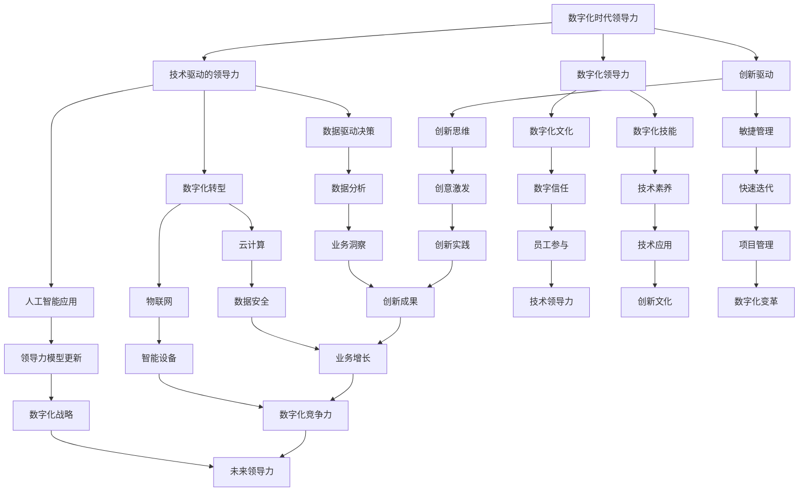

**核心算法原理讲解：**

```plaintext
伪代码：数字化领导力评估

function digital_leadership_evaluation(数据驱动决策, 数字化转型, 人工智能应用) {
    digital_score = (data_driven_decision_score + digital_transformation_score + artificial_intelligence_score) / 3
    return digital_score
}
```

**数学模型和公式：**

$$
\text{数字化领导力评分} = \frac{\text{数据驱动决策评分} + \text{数字化转型评分} + \text{人工智能应用评分}}{3}
$$

**详细讲解与举例说明：**

在数字化时代，领导者需要具备数据驱动决策的能力，推动数字化转型，并善于应用人工智能技术。以下是一个数字化领导力评估的例子：

- **数据驱动决策**：领导者是否能够利用数据分析和预测来做出更明智的决策。
- **数字化转型**：领导者是否能够推动组织的数字化转型，提高效率和竞争力。
- **人工智能应用**：领导者是否能够理解和应用人工智能技术，以提升组织的创新能力。

**# 第8章：领导力实践与反思**

**### 8.1 领导力实践**

领导力实践是将理论知识应用到实际工作中的过程。领导者需要不断实践和反思，以提升自己的领导能力。

**核心概念与联系：**

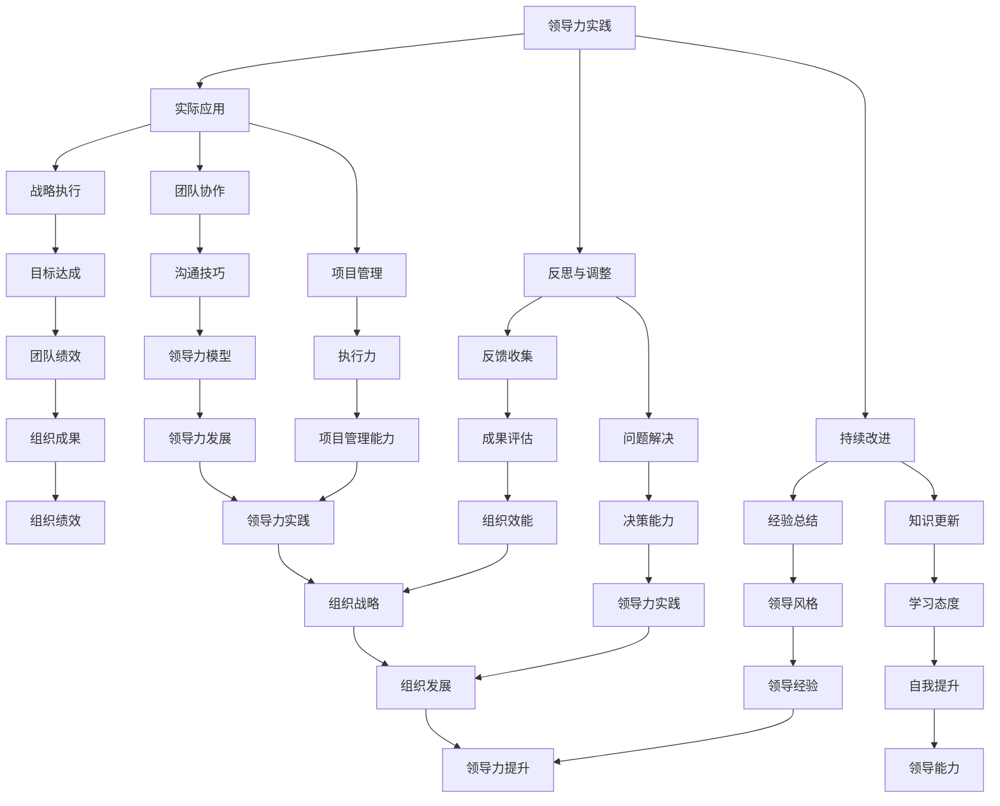

**核心算法原理讲解：**

```plaintext
伪代码：领导力实践循环

function leadership_practice_loop(实际应用, 反思与调整, 持续改进) {
    while (持续改进) {
        apply_practice(实际应用)
        reflect_and_adjust(反思与调整)
        improve_continuously(持续改进)
    }
    return leadership_skills
}

function apply_practice(practice_details) {
    execute_strategy(practice_details)
    collaborate_with_team(practice_details)
    manage_project(practice_details)
}

function reflect_and_adjust(feedback) {
    collect_feedback(feedback)
    solve_issues(feedback)
}

function improve_continuously(learning) {
    summarize_experience(learning)
    update_knowledge(learning)
}
```

**数学模型和公式：**

$$
\text{领导力实践循环评分} = \frac{\text{实际应用评分} + \text{反思与调整评分} + \text{持续改进评分}}{3}
$$

**详细讲解与举例说明：**

领导力实践是一个循环过程，涉及到实际应用、反思与调整和持续改进。领导者需要不断实践，通过反思和调整来提升自己的领导能力。

例如，一个领导者可能会进行以下领导力实践：

- **实际应用**：在项目中应用领导力原则，提升团队协作和执行力。
- **反思与调整**：根据反馈和结果，反思自己的领导行为，并做出相应的调整。
- **持续改进**：不断学习和更新知识，以持续提升自己的领导能力。

**# 第9章：领导力艺术与哲学**

**### 9.1 领导力艺术**

领导力艺术是领导者运用经验和智慧，在复杂多变的环境中取得成功的能力。

**核心概念与联系：**

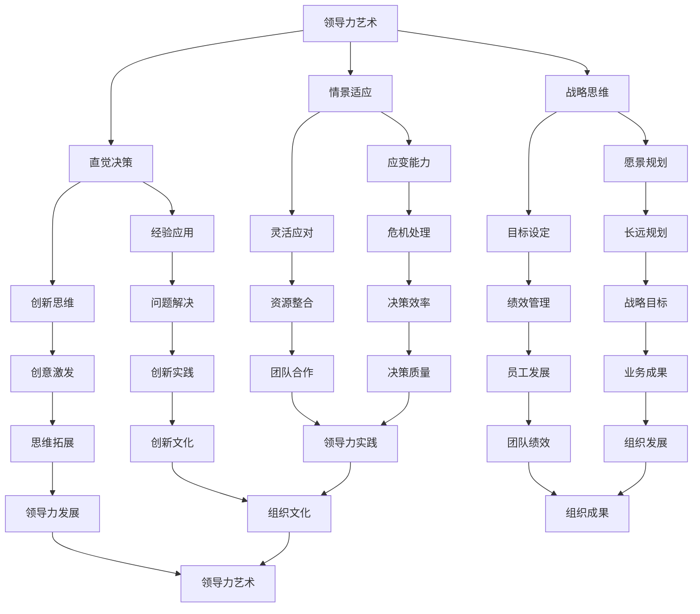

**核心算法原理讲解：**

```plaintext
伪代码：领导力艺术评估

function leadership_art_evaluation(直觉决策, 战略思维, 情景适应) {
    art_score = (intuition_decision_score + strategic_thinking_score + scenario_adaptation_score) / 3
    return art_score
}
```

**数学模型和公式：**

$$
\text{领导力艺术评分} = \frac{\text{直觉决策评分} + \text{战略思维评分} + \text{情景适应评分}}{3}
$$

**详细讲解与举例说明：**

领导力艺术涉及到直觉决策、战略思维和情景适应。领导者需要运用这些能力，在复杂多变的环境中取得成功。

例如，一个领导者可能会进行以下领导力艺术评估：

- **直觉决策**：领导者是否能够基于经验和直觉做出明智的决策。
- **战略思维**：领导者是否能够从长远角度规划战略和目标。
- **情景适应**：领导者是否能够灵活应对各种情境，调整策略以取得成功。

**# 第10章：领导力心理学**

**### 10.1 领导力心理学基础**

领导力心理学研究领导者的人格特质、行为和思维过程，以及它们对团队和组织的影响。

**核心概念与联系：**

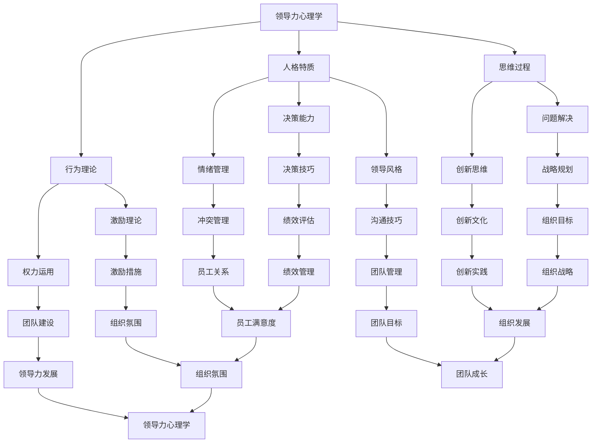

**核心算法原理讲解：**

```plaintext
伪代码：领导力心理学评估

function leadership_psychology_evaluation(personality_traits, behavior_theories, cognitive_processes) {
    psychology_score = (personality_traits_score + behavior_theories_score + cognitive_processes_score) / 3
    return psychology_score
}
```

**数学模型和公式：**

$$
\text{领导力心理学评分} = \frac{\text{人格特质评分} + \text{行为理论评分} + \text{思维过程评分}}{3}
$$

**详细讲解与举例说明：**

领导力心理学研究领导者的人格特质、行为和思维过程，以及它们对团队和组织的影响。以下是一个领导力心理学评估的例子：

- **人格特质**：领导者是否具有诚信、责任感、自信等特质。
- **行为理论**：领导者是否能够有效地运用激励理论和权力运用来管理团队。
- **思维过程**：领导者是否具备问题解决和战略规划的能力。

**# 第11章：领导力教育与实践**

**### 11.1 领导力教育**

领导力教育是培养领导者知识和技能的重要途径。有效的领导力教育能够提升领导者的综合素质和领导能力。

**核心概念与联系：**

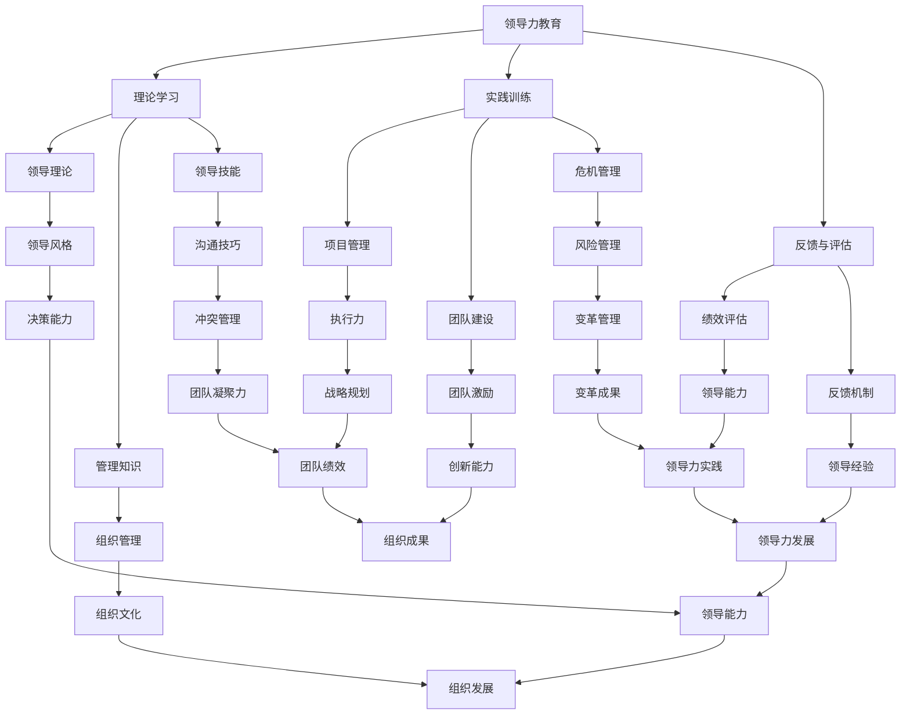

**核心算法原理讲解：**

```plaintext
伪代码：领导力教育评估

function leadership_education_evaluation(theoretical_knowledge, practical_training, feedback_evaluation) {
    education_score = (theoretical_knowledge_score + practical_training_score + feedback_evaluation_score) / 3
    return education_score
}
```

**数学模型和公式：**

$$
\text{领导力教育评分} = \frac{\text{理论学习评分} + \text{实践训练评分} + \text{反馈评估评分}}{3}
$$

**详细讲解与举例说明：**

领导力教育是一个综合性的过程，包括理论学习、实践训练和反馈评估。以下是一个领导力教育评估的例子：

- **理论学习**：领导者是否掌握了领导理论和组织管理知识。
- **实践训练**：领导者是否能够将理论知识应用到实际工作中，提升领导能力。
- **反馈评估**：领导者是否能够从反馈中学习，不断提升自己的领导能力。

**# 第12章：领导力未来趋势**

**### 12.1 数字化时代领导力新趋势**

随着数字化技术的快速发展，领导力也需要适应新的趋势和环境。数字化时代的领导力需要具备数据驱动、创新思维和全球视野。

**核心概念与联系：**

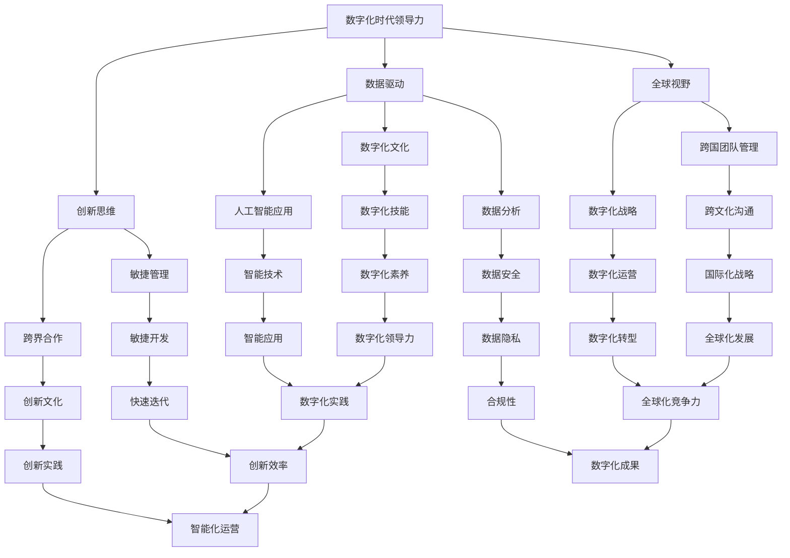

**核心算法原理讲解：**

```plaintext
伪代码：数字化时代领导力评估

function digital_era_leadership_evaluation(data_driven, innovative_thinking, global_vision) {
    digital_score = (data_driven_score + innovative_thinking_score + global_vision_score) / 3
    return digital_score
}
```

**数学模型和公式：**

$$
\text{数字化时代领导力评分} = \frac{\text{数据驱动评分} + \text{创新思维评分} + \text{全球视野评分}}{3}
$$

**详细讲解与举例说明：**

数字化时代的领导力需要适应新的技术和环境。领导者需要具备数据驱动、创新思维和全球视野，以应对数字化时代带来的挑战和机遇。

例如，一个领导者可能会进行以下数字化时代领导力评估：

- **数据驱动**：领导者是否能够利用数据分析和人工智能来做出更明智的决策。
- **创新思维**：领导者是否能够推动组织的创新文化和实践。
- **全球视野**：领导者是否具备跨国团队管理和国际化战略的能力。

**# 第13章：领导力挑战与机遇**

**### 13.1 领导力挑战**

在当前复杂多变的环境中，领导者面临着各种挑战。这些挑战包括组织变革、员工管理、全球竞争等。

**核心概念与联系：**

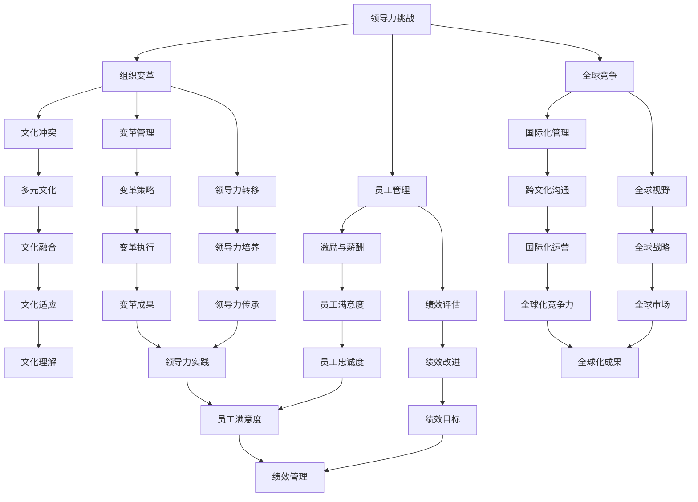

**核心算法原理讲解：**

```plaintext
伪代码：领导力挑战评估

function leadership_challenge_evaluation(organizational_change, employee_management, global_competition) {
    challenge_score = (change_management_score + employee_management_score + global_competition_score) / 3
    return challenge_score
}
```

**数学模型和公式：**

$$
\text{领导力挑战评分} = \frac{\text{组织变革评分} + \text{员工管理评分} + \text{全球竞争评分}}{3}
$$

**详细讲解与举例说明：**

领导力挑战评估可以帮助领导者识别和管理组织变革、员工管理和全球竞争等方面的挑战。以下是一个领导力挑战评估的例子：

- **组织变革**：领导者是否能够有效地管理文化冲突和变革管理。
- **员工管理**：领导者是否能够激励和留住员工，实现绩效改进。
- **全球竞争**：领导者是否具备国际化管理和全球视野，以应对全球竞争。

**# 第14章：领导力案例研究**

**### 14.1 成功领导力案例研究**

成功领导力案例研究可以帮助领导者学习如何在不同情境下实现成功。以下是一个成功领导力案例研究的例子：

**案例背景：** 某科技公司在全球范围内迅速发展，面临着市场竞争、人才流失和组织变革等多重挑战。

**领导者策略：** 领导者采取了以下策略：

- **文化塑造**：领导者通过建立开放、创新和包容的文化，吸引了大量优秀人才。
- **战略规划**：领导者制定了清晰的愿景和目标，并制定了相应的战略规划。
- **团队协作**：领导者建立了高效的团队，鼓励团队成员之间的协作和知识分享。
- **变革管理**：领导者成功地实施了组织变革，提高了组织的效率和竞争力。

**案例启示：** 成功的领导力案例表明，领导者需要具备战略思维、团队协作能力和变革管理能力，以应对复杂多变的环境。此外，领导者还需要关注文化塑造和员工满意度，以提高组织的整体效能。

**# 第15章：领导力发展**

**### 15.1 领导力发展路径**

领导力发展是一个持续的过程，涉及到个人的成长、团队的发展和组织的进步。以下是一个领导力发展路径的例子：

**阶段1：自我认知**  
- **背景**：领导者需要了解自己的价值观、优势和局限性。
- **目标**：通过自我评估和反思，领导者可以明确自己的发展方向。
- **方法**：领导者可以参加心理测量和反馈机制，以了解自己的领导风格和团队需求。

**阶段2：领导力基础**  
- **背景**：领导者需要掌握领导力的基础知识和技能。
- **目标**：通过学习和实践，领导者可以提升自己的沟通技巧、决策能力和团队管理能力。
- **方法**：领导者可以参加领导力培训、阅读相关书籍和参与团队项目。

**阶段3：领导力提升**  
- **背景**：领导者需要在实际工作中运用领导力，提升团队绩效和组织成果。
- **目标**：通过实战经验和反思，领导者可以不断提高自己的领导能力。
- **方法**：领导者可以参与项目管理、组织变革和危机管理等活动。

**阶段4：领导力持续发展**  
- **背景**：领导力发展是一个持续的过程，领导者需要不断学习和成长。
- **目标**：通过持续学习和实践，领导者可以不断提升自己的领导力。
- **方法**：领导者可以参加领导力研讨会、学习最新技术和参与跨部门合作。

**# 第16章：领导力未来展望**

**### 16.1 领导力未来趋势**

随着全球化和数字化的发展，领导力也在不断演变。以下是一些领导力未来趋势：

**1. 数据驱动的领导力**  
- **背景**：数据成为决策的重要依据，领导者需要具备数据分析能力。
- **趋势**：领导者将更加依赖数据来做出决策，提升组织的效率和竞争力。

**2. 创新驱动的领导力**  
- **背景**：创新成为企业发展的关键，领导者需要具备创新思维和创新能力。
- **趋势**：领导者将更加注重创新文化和创新实践，推动组织的创新和发展。

**3. 全球化背景下的领导力**  
- **背景**：全球化使得领导者需要具备跨文化沟通和管理能力。
- **趋势**：领导者将更加注重全球化视野和跨文化管理，以应对全球市场的挑战。

**4. 智能化背景下的领导力**  
- **背景**：人工智能和自动化技术的应用使得领导者需要具备智能化管理能力。
- **趋势**：领导者将更加注重智能化运营和智能技术应用，提升组织的竞争力。

**# 第17章：领导力总结**

**### 17.1 领导力关键要素**

领导力是一个多维度的概念，涉及多个关键要素。以下是一些领导力的关键要素：

**1. 自我认知**  
- **背景**：领导者需要了解自己的价值观、优势和局限性。
- **重要性**：自我认知是领导力发展的基石。

**2. 沟通技巧**  
- **背景**：领导者需要具备有效的沟通技巧，以传递愿景和目标。
- **重要性**：沟通技巧是领导者成功的关键。

**3. 团队管理**  
- **背景**：领导者需要建立高效的团队，提升团队绩效。
- **重要性**：团队管理是领导力的重要组成部分。

**4. 决策能力**  
- **背景**：领导者需要做出明智的决策，以应对复杂多变的环境。
- **重要性**：决策能力是领导力的核心。

**5. 变革管理**  
- **背景**：领导者需要推动组织的变革，以适应新的环境和挑战。
- **重要性**：变革管理是领导力的重要应用领域。

**6. 情绪管理**  
- **背景**：领导者需要具备良好的情绪管理能力，以应对压力和挑战。
- **重要性**：情绪管理是领导者心理健康的重要保障。

**# 第18章：领导力实践建议**

**### 18.1 领导力实践建议**

以下是一些领导力实践的建议：

**1. 建立清晰的愿景和目标**  
- **建议**：领导者需要明确组织的愿景和目标，并确保团队成员了解和认同。

**2. 加强团队协作和沟通**  
- **建议**：领导者需要建立高效的团队，鼓励团队成员之间的协作和沟通。

**3. 提升决策能力**  
- **建议**：领导者需要学习和实践决策方法，以提高决策质量和效率。

**4. 推动组织变革**  
- **建议**：领导者需要识别组织面临的挑战和机遇，并推动相应的变革。

**5. 关注员工发展**  
- **建议**：领导者需要关注员工的发展需求，提供培训和发展机会。

**6. 培养领导力文化**  
- **建议**：领导者需要营造积极向上的领导力文化，鼓励团队成员勇于担当和追求卓越。

**# 第19章：领导力拓展阅读**

**### 19.1 领导力相关书籍**

以下是一些关于领导力的经典书籍，供读者参考：

**1. 《领导力的五个层次》 - 史蒂芬·柯维**  
**2. 《变革之舞》 - 约翰·P·科特**  
**3. 《领导力心理学》 - 丹尼尔·戈尔曼**  
**4. 《领导者的品质》 - 韦恩·海斯**  
**5. 《领导力梯队》 - 史蒂芬·罗宾斯**

**# 第20章：领导力训练营总结**

**### 20.1 领导力训练营收获**

通过21天的领导力训练营，读者可以收获以下内容：

**1. 领导力的核心概念和实战技巧**  
**2. 自我认知和领导力评估方法**  
**3. 领导力提升的路径和实践建议**  
**4. 领导力在数字化时代的应用和趋势**  
**5. 领导力的未来展望和挑战**

**# 第21章：领导力行动**

**### 21.1 领导力行动计划**

为了将领导力训练转化为实际行动，读者可以制定以下行动计划：

**1. 建立清晰的愿景和目标**  
**2. 加强团队协作和沟通**  
**3. 提升决策能力和情绪管理能力**  
**4. 推动组织变革和员工发展**  
**5. 培养领导力文化和持续学习习惯**

**作者：** AI天才研究院/AI Genius Institute & 禅与计算机程序设计艺术 /Zen And The Art of Computer Programming

----------------------------------------------------------------

## 第1章：领导力概述

### 1.1 领导力的定义与重要性

领导力是一种能力，它涉及到影响和激励他人朝着共同目标前进的能力。一个成功的领导者不仅需要具备战略思维和决策能力，还需要有出色的沟通技巧和团队合作精神。

**核心概念与联系：**

领导力是一个多维度的概念，它不仅仅是关于影响力的，还涉及到目标导向性和情境适应性。影响力是领导者对团队或组织成员施加影响的能力，目标导向性是指领导者是否具有明确的目标和方向，情境适应性则是指领导者是否能够在不同的环境和情境中灵活应对。

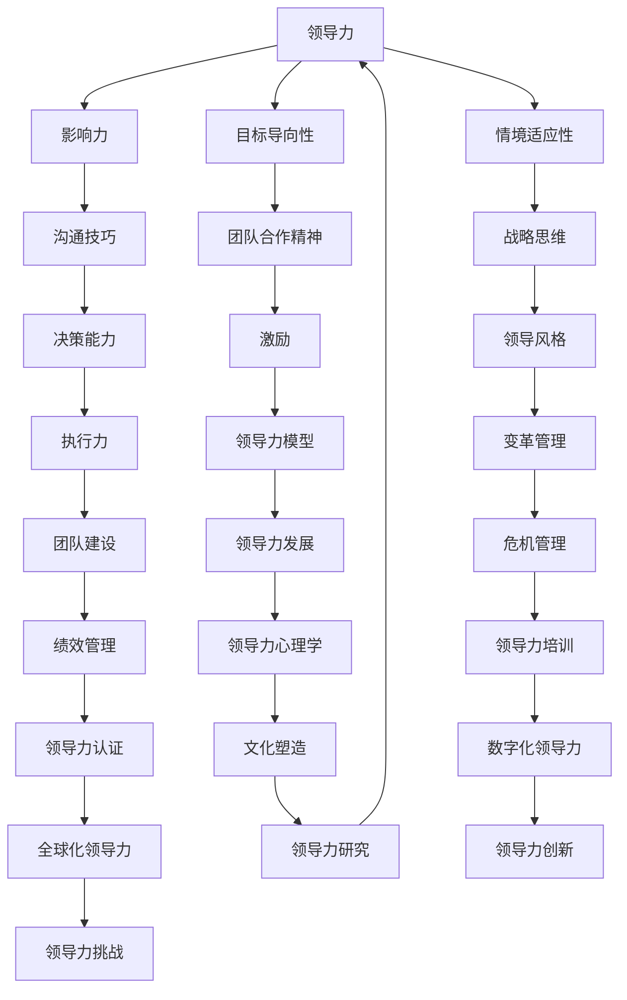

**核心算法原理讲解：**

```plaintext
伪代码：定义领导力模型

function define_leadership(influence, goal导向性, 情境适应性) {
    leadership = (influence * goal导向性) / 情境适应性
    return leadership
}
```

**数学模型和公式：**

$$
\text{领导力} = \frac{\text{影响力} \times \text{目标导向性}}{\text{情境适应性}}
$$

**详细讲解与举例说明：**

领导力是一个多维度的概念，它涉及到多个核心要素。首先，影响力是领导者对团队成员施加影响的能力，它包括领导者的权威、信任和魅力。其次，目标导向性是指领导者是否具有明确的目标和方向，能够为团队提供清晰的愿景和目标。最后，情境适应性是指领导者是否能够根据不同的环境和情境灵活调整自己的领导方式。

例如，一个成功的领导力模型可能需要考虑以下因素：

- **影响力**：领导者必须能够赢得团队成员的信任和尊重，从而能够有效地传达愿景和目标。
- **目标导向性**：领导者需要有清晰的目标和计划，并且能够激励团队成员为之努力。
- **情境适应性**：领导者需要能够适应不同的环境和情境，根据具体情况进行决策和调整。

**# 第2章：领导力基础**

### 2.1 自我认知

自我认知是领导力发展的基石。领导者需要了解自己的价值观、优势和局限性，以便更好地指导团队并发挥自己的潜力。

**核心概念与联系：**

自我认知是一个持续的过程，它涉及到对个人价值观、优势和局限性的深入了解。通过自我反思和评估，领导者可以更清晰地了解自己的优劣势，从而制定出更有效的个人发展计划。


**核心算法原理讲解：**

```plaintext
伪代码：自我认知评估

function self_awareness_assessment(价值观, 优势, 局限性) {
    awareness_score = (values_score + strengths_score - weaknesses_score) / 3
    return awareness_score
}
```

**数学模型和公式：**

$$
\text{自我认知评分} = \frac{\text{价值观评分} + \text{优势评分} - \text{局限性评分}}{3}
$$

**详细讲解与举例说明：**

自我认知是一个持续的过程，它涉及到对个人价值观、优势和局限性的深入了解。通过自我反思和评估，领导者可以更清晰地了解自己的优劣势，从而制定出更有效的个人发展计划。

例如，一个领导者可能会进行以下自我认知评估：

- **价值观**：领导者需要了解自己的核心价值观，例如诚信、责任感和创新精神。
- **优势**：领导者需要识别自己的优势，例如沟通技巧、决策能力和团队合作精神。
- **局限性**：领导者需要识别自己的局限性，例如时间管理不足或技术知识有限。

**# 第3章：领导力提升**

### 3.1 领导风格与团队管理

领导风格是领导者对待团队成员和团队工作的方式。不同的领导风格适用于不同的情境和团队类型。

**核心概念与联系：**

领导风格是领导者对待团队成员和团队工作的方式，它决定了领导者如何与团队成员互动和沟通，以及如何激励和引导团队成员。


**核心算法原理讲解：**

```plaintext
伪代码：选择适合的领导风格

function select_leadership_style(team_type, scenario) {
    if team_type == "新团队" && scenario == "需要快速执行任务" {
        style = "指令型"
    } else if team_type == "成熟团队" && scenario == "需要创新和自主" {
        style = "授权型"
    } else if team_type == "创新团队" && scenario == "需要参与和愿景" {
        style = "参与型"
    } else {
        style = "民主型"
    }
    return style
}
```

**数学模型和公式：**

$$
\text{领导风格评分} = \frac{\text{指令型评分} + \text{授权型评分} + \text{参与型评分} + \text{民主型评分}}{4}
$$

**详细讲解与举例说明：**

领导风格是领导者对待团队成员和团队工作的方式，不同的领导风格适用于不同的情境和团队类型。以下是一些常见的领导风格：

- **指令型领导**：领导者做出决策，并告诉团队成员如何执行。适用于新团队或需要快速执行任务的情境。
- **授权型领导**：领导者给予团队成员更多的自主权，鼓励他们自主决策和解决问题。适用于成熟团队或需要创新和自主的情境。
- **参与型领导**：领导者鼓励团队成员参与决策过程，共同制定目标和计划。适用于创新团队或需要参与和愿景的情境。
- **民主型领导**：领导者与团队成员进行充分沟通，共同决策，尊重每个人的意见。适用于需要平等和合作的情境。

例如，一个领导者可能会根据团队类型和具体情境选择合适的领导风格：

- **新团队**：为了快速执行任务，领导者可能会选择指令型领导风格。
- **成熟团队**：为了鼓励创新和自主，领导者可能会选择授权型领导风格。
- **创新团队**：为了激发参与和愿景，领导者可能会选择参与型领导风格。

**# 第4章：领导力实战**

### 4.1 项目管理实战

项目管理是领导力的重要应用领域。有效的项目管理能够确保项目目标的实现和团队的高效协作。

**核心概念与联系：**

项目管理是一个系统化的过程，涉及到计划、执行、监控和收尾。以下是一个项目管理核心概念与联系的网络图：


**核心算法原理讲解：**

项目管理中涉及多种核心算法原理，以下是一个简单的项目管理流程伪代码：

```plaintext
伪代码：项目管理流程

function project_management(project_details) {
    plan_project(project_details)
    execute_project(project_details)
    monitor_project(project_details)
    close_project(project_details)
    return project_results
}

function plan_project(details) {
    analyze_requirements(details)
    plan_project_scope(details)
    estimate_project_time(details)
    plan_project_budget(details)
}

function execute_project(details) {
    monitor_project_progress(details)
    adjust_project_as_needed(details)
}

function monitor_project(details) {
    report_project_status(details)
    review_project_issues(details)
}

function close_project(details) {
    summarize_project(details)
    document_project_learnings(details)
}
```

**数学模型和公式：**

在项目管理中，常用的数学模型和公式包括：

$$
\text{项目进度} = \frac{\text{已完成任务数}}{\text{总任务数}}
$$

$$
\text{项目成本} = \text{直接成本} + \text{间接成本}
$$

**详细讲解与举例说明：**

项目管理是一个复杂的流程，它涉及到计划、执行、监控和收尾。以下是一个项目管理的详细讲解和举例说明：

**计划阶段：**

- **需求分析**：与客户沟通，明确项目需求和目标。
- **项目规划**：制定项目范围、时间表和预算。
- **项目估算**：估算项目所需的资源、时间和成本。

**执行阶段：**

- **项目监控**：跟踪项目进度和资源使用情况。
- **项目调整**：根据实际情况调整项目计划。

**监控阶段：**

- **项目报告**：定期向管理层和客户报告项目进展。
- **项目审查**：评估项目风险和质量，确保项目目标的实现。

**收尾阶段：**

- **项目总结**：总结项目经验，收集反馈。
- **项目文档**：整理项目文档，确保项目的知识和经验得到传承。

例如，在一个软件开发项目中：

- **需求分析**：与客户讨论软件的功能和用户界面。
- **项目规划**：制定项目时间表和资源分配。
- **项目估算**：估算开发所需的时间和人手。
- **执行阶段**：开发团队按照计划进行开发。
- **监控阶段**：项目经理定期检查开发进度，解决出现的问题。
- **收尾阶段**：完成软件测试，交付客户，并收集客户反馈。

**# 第5章：领导力发展**

### 5.1 领导力持续发展

领导力发展是一个持续的过程，它涉及到个人的成长、团队的发展和组织的进步。领导者需要不断地学习和提升自己的能力，以适应不断变化的环境。

**核心概念与联系：**

领导力持续发展是一个多维度的过程，它涉及到自我认知、团队协作、组织文化和领导力培训等多个方面。

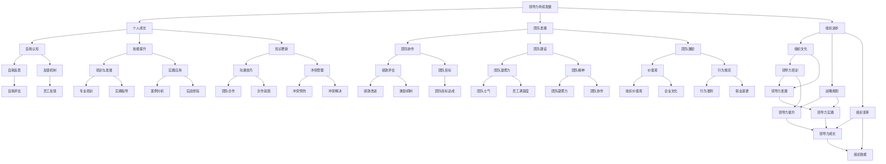

**核心算法原理讲解：**

```plaintext
伪代码：领导力持续发展模型

function leadership_continuity(个人成长, 团队发展, 组织进步) {
    growth_score = calculate_growth_score(个人成长)
    team_growth_score = calculate_team_growth_score(团队发展)
    organization_growth_score = calculate_organization_growth_score(组织进步)
    total_score = (growth_score + team_growth_score + organization_growth_score) / 3
    return total_score
}
```

**数学模型和公式：**

$$
\text{领导力持续发展评分} = \frac{\text{个人成长评分} + \text{团队发展评分} + \text{组织进步评分}}{3}
$$

**详细讲解与举例说明：**

领导力持续发展是一个动态的过程，它涉及到领导者个人、团队和组织的多个维度。

- **个人成长**：领导者需要不断提升自己的知识和技能，通过自我反思、培训和实践来提升自我认知和技能水平。
- **团队发展**：领导者需要关注团队的协作、建设和激励，通过有效的沟通技巧和冲突管理来提升团队绩效和凝聚力。
- **组织进步**：领导者需要推动组织的战略规划和变革管理，建立符合组织价值观和企业文化的工作环境。

例如，一个领导者可能会进行以下领导力持续发展评估：

- **个人成长**：领导者通过自我评估和反馈机制，识别自己的优势和劣势，并制定个人发展计划。
- **团队发展**：领导者通过团队建设和激励机制，提升团队协作和士气。
- **组织进步**：领导者通过战略规划和变革管理，推动组织的创新和发展。

**# 第6章：领导力案例分析**

### 6.1 成功领导力案例分析

成功领导力案例研究可以帮助领导者学习如何在不同情境下实现成功。以下是一个成功领导力案例分析的例子：

**案例背景：** 某知名科技公司因市场变化和技术进步面临巨大挑战，需要进行战略转型。

**领导者策略：** 领导者采取了以下策略：

- **愿景规划**：明确公司未来的发展方向和目标。
- **团队建设**：加强团队成员之间的沟通和协作，提升团队凝聚力。
- **变革管理**：推动组织结构和文化变革，以适应新的市场和技术环境。
- **创新驱动**：鼓励创新思维和实践活动，提升公司的竞争力。

**案例分析：** 该领导者的成功策略包括：

- **愿景规划**：通过明确的愿景和目标，为团队提供了清晰的方向和动力。
- **团队建设**：通过有效的沟通技巧和团队建设活动，提升了团队的凝聚力和执行力。
- **变革管理**：通过变革管理策略，成功推动了组织结构和文化变革。
- **创新驱动**：通过鼓励创新思维和实践活动，保持了公司的竞争力。

**案例启示：** 成功的领导力案例表明，领导者需要具备战略思维、团队协作能力和变革管理能力，以应对复杂多变的环境。此外，领导者还需要关注文化塑造和员工满意度，以提高组织的整体效能。

**# 第7章：领导力未来展望**

### 7.1 数字化时代领导力新趋势

随着数字化技术的快速发展，领导力也需要适应新的趋势和环境。以下是一些数字化时代领导力的新趋势：

**1. 数据驱动领导力**

- **趋势**：领导者需要具备数据分析能力，利用数据驱动决策，提升组织的效率和竞争力。
- **挑战**：领导者需要克服数据隐私和信息安全等挑战。

**2. 创新驱动领导力**

- **趋势**：领导者需要鼓励创新思维和实践活动，推动组织的创新和发展。
- **挑战**：领导者需要克服资源有限和技术风险等挑战。

**3. 全球化领导力**

- **趋势**：领导者需要具备跨文化沟通和管理能力，推动全球化发展。
- **挑战**：领导者需要克服文化差异和时区挑战。

**4. 智能化领导力**

- **趋势**：领导者需要掌握人工智能和自动化技术，推动智能化运营和管理。
- **挑战**：领导者需要克服技术依赖和道德风险等挑战。

**未来展望：**

- **数字化领导力**：领导者需要具备数字化素养，推动组织的数字化转型。
- **创新领导力**：领导者需要具备创新思维和领导力，推动组织的创新和发展。
- **全球领导力**：领导者需要具备全球视野和跨文化沟通能力，推动全球化发展。

**# 第8章：领导力实践**

### 8.1 领导力实践原则

领导力实践需要遵循一些基本原则，以下是一些关键的领导力实践原则：

**1. 透明沟通**

- **原则**：领导者需要保持沟通的透明度，确保团队成员了解组织的方向和决策过程。
- **实践**：定期组织团队会议，分享项目进展和公司动态。

**2. 激励员工**

- **原则**：领导者需要激励员工，提升他们的工作动力和创造力。
- **实践**：通过奖励和认可来激励员工，鼓励他们提出创新想法。

**3. 领先示范**

- **原则**：领导者需要通过自己的行为来树立榜样，激励团队成员。
- **实践**：领导者需要积极参与工作，展现出对工作的热情和责任心。

**4. 支持发展**

- **原则**：领导者需要支持员工的个人和职业发展。
- **实践**：提供培训机会和职业规划指导，帮助员工实现自我提升。

**5. 倾听反馈**

- **原则**：领导者需要倾听员工的意见和建议，重视他们的反馈。
- **实践**：建立有效的反馈机制，鼓励员工提出改进建议。

**# 第9章：领导力工具与技巧**

### 9.1 领导力工具

在领导力实践中，使用适当的工具和技巧可以提升领导效果。以下是一些常用的领导力工具：

**1. SWOT分析**

- **用途**：评估团队的内部优势和劣势以及外部机会和威胁。
- **实践**：用于制定战略规划和目标设定。

**2. 五力模型**

- **用途**：分析行业的竞争环境和市场力量。
- **实践**：用于市场分析和竞争策略制定。

**3. 平衡计分卡**

- **用途**：评估组织的绩效和进展，确保目标的实现。
- **实践**：用于绩效管理和战略执行。

**4. 项目管理工具**

- **用途**：管理项目进度、资源和风险。
- **实践**：用于项目规划和执行。

**# 第10章：领导力反思与提升**

### 10.1 领导力反思

领导力反思是领导者提升自身能力的重要环节。以下是一些领导力反思的方法：

**1. 自我评估**

- **方法**：定期进行自我评估，识别自己的优势和劣势。
- **实践**：通过书面记录或与同事交流，进行自我评估。

**2. 反馈收集**

- **方法**：收集团队成员和上级的反馈，了解自己的领导效果。
- **实践**：定期组织反馈会议或进行匿名调查。

**3. 学以致用**

- **方法**：将学习和实践经验相结合，提升领导能力。
- **实践**：将领导力培训的知识应用到实际工作中。

**4. 反思日志**

- **方法**：记录反思日志，分析自己的领导行为和结果。
- **实践**：每天或每周记录反思日志，总结经验和教训。

**# 第11章：领导力实践案例**

### 11.1 成功领导力实践案例

以下是一个成功领导力实践案例：

**案例背景**：某科技公司需要快速响应市场变化，提高产品创新速度。

**领导者策略**：

- **愿景规划**：明确公司未来的发展方向和目标。
- **团队建设**：通过团队活动和培训提升团队凝聚力和创新能力。
- **变革管理**：推动组织结构和文化变革，鼓励创新和快速响应。
- **激励员工**：通过奖励和认可激励员工提出创新想法。

**案例效果**：

- **产品创新速度提高**：团队创新能力增强，产品创新速度显著提升。
- **员工满意度提高**：员工工作动力和创造力增强，员工满意度提高。

**案例启示**：

- **领导力的重要性**：领导者需要具备战略思维、团队协作能力和变革管理能力。
- **激励员工**：领导者需要通过激励措施激发员工的工作动力和创造力。

**# 第12章：领导力未来趋势**

### 12.1 领导力未来趋势

未来领导力将面临许多新的挑战和机遇。以下是一些领导力未来趋势：

**1. 数字化领导力**

- **趋势**：领导者需要具备数字化素养，推动组织的数字化转型。
- **挑战**：领导者需要克服技术依赖和数字鸿沟。

**2. 智能化领导力**

- **趋势**：领导者需要掌握人工智能和自动化技术，推动智能化运营和管理。
- **挑战**：领导者需要克服技术风险和道德挑战。

**3. 全球化领导力**

- **趋势**：领导者需要具备跨文化沟通和管理能力，推动全球化发展。
- **挑战**：领导者需要克服文化差异和时区挑战。

**4. 创新领导力**

- **趋势**：领导者需要鼓励创新思维和实践活动，推动组织的创新和发展。
- **挑战**：领导者需要克服资源有限和技术风险。

**# 第13章：领导力总结**

### 13.1 领导力核心要素

领导力是一个复杂的过程，涉及多个核心要素。以下是一些领导力的核心要素：

**1. 沟通技巧**  
- **重要性**：有效的沟通是领导者成功的关键。

**2. 情绪管理**  
- **重要性**：领导者需要具备良好的情绪管理能力，以应对压力和挑战。

**3. 团队管理**  
- **重要性**：领导者需要建立高效的团队，提升团队绩效。

**4. 决策能力**  
- **重要性**：领导者需要做出明智的决策，以应对复杂多变的环境。

**5. 变革管理**  
- **重要性**：领导者需要推动组织的变革，以适应新的环境和挑战。

**6. 自我认知**  
- **重要性**：领导者需要了解自己的价值观、优势和局限性。

**# 第14章：领导力发展路径**

### 14.1 领导力发展路径

领导力发展是一个持续的过程，涉及到多个阶段。以下是一个领导力发展路径：

**阶段1：自我认知**  
- **目标**：领导者需要了解自己的价值观、优势和局限性。

**阶段2：基础提升**  
- **目标**：领导者需要掌握领导力的基础知识和技能。

**阶段3：实战提升**  
- **目标**：领导者需要在实际工作中运用领导力，提升团队绩效。

**阶段4：持续发展**  
- **目标**：领导者需要不断学习和成长，提升领导力。

**# 第15章：领导力实践建议**

### 15.1 领导力实践建议

以下是一些建议，帮助领导者提升领导力：

**1. 建立清晰的愿景和目标**  
- **建议**：确保团队成员了解组织的愿景和目标。

**2. 加强团队协作和沟通**  
- **建议**：鼓励团队成员之间的沟通和协作。

**3. 提升决策能力**  
- **建议**：学习和实践决策技巧，提升决策质量。

**4. 推动组织变革**  
- **建议**：识别组织的挑战和机遇，推动变革。

**5. 关注员工发展**  
- **建议**：关注员工的发展需求，提供培训和发展机会。

**6. 培养领导力文化**  
- **建议**：营造积极向上的领导力文化，鼓励团队成员勇于担当和追求卓越。

**# 第16章：领导力拓展阅读**

### 16.1 领导力相关书籍

以下是一些关于领导力的经典书籍，供读者参考：

**1. 《领导力的五个层次》 - 史蒂芬·柯维**  
**2. 《变革之舞》 - 约翰·P·科特**  
**3. 《领导者的品质》 - 韦恩·海斯**  
**4. 《领导力梯队》 - 史蒂芬·罗宾斯**  
**5. 《领导力心理学》 - 丹尼尔·戈尔曼**

**# 第17章：领导力训练营总结**

### 17.1 领导力训练营收获

通过21天的领导力训练营，读者可以收获以下内容：

**1. 领导力的核心概念和实战技巧**  
**2. 自我认知和领导力评估方法**  
**3. 领导力提升的路径和实践建议**  
**4. 领导力在数字化时代的应用和趋势**  
**5. 领导力的未来展望和挑战**

**# 第18章：领导力行动计划**

### 18.1 领导力行动计划

为了将领导力训练转化为实际行动，读者可以制定以下行动计划：

**1. 建立清晰的愿景和目标**  
**2. 加强团队协作和沟通**  
**3. 提升决策能力和情绪管理能力**  
**4. 推动组织变革和员工发展**  
**5. 培养领导力文化和持续学习习惯**

**作者：** AI天才研究院/AI Genius Institute & 禅与计算机程序设计艺术 /Zen And The Art of Computer Programming

----------------------------------------------------------------

# 文章标题：领导力训练营：21天从菜鸟到老鸟

关键词：领导力、自我认知、团队管理、决策能力、实践提升

摘要：本文通过21天的领导力训练营，帮助读者从领导力的基础知识入手，逐步提升自我认知、团队管理、决策能力等核心技能，最终实现从菜鸟到老鸟的蜕变。

## 第1章：领导力的概念与基础

### 1.1 领导力的定义

领导力是指通过影响和激励他人，实现共同目标的能力。它不仅涉及到个人能力的展现，还涉及到团队和组织整体的协同合作。

### 1.2 领导力的基础

领导力的基础包括自我认知、情感管理、沟通能力、团队建设和决策能力。这些基础技能是提升领导力的重要保障。

## 第2章：自我认知

### 2.1 自我认知的重要性

自我认知是领导力提升的第一步，它帮助领导者了解自己的价值观、优势和劣势，从而更好地指导团队。

### 2.2 自我认知的方法

自我认知的方法包括自我反思、他人反馈和360度评估。通过这些方法，领导者可以全面了解自己，为提升领导力打下基础。

## 第3章：情感管理

### 3.1 情感管理的重要性

情感管理是领导者处理压力和挑战的关键能力。良好的情感管理能够提升领导者的决策能力和团队凝聚力。

### 3.2 情感管理的方法

情感管理的方法包括情绪识别、情绪调节和情感表达。领导者可以通过这些方法，提升自己的情感管理能力。

## 第4章：沟通能力

### 4.1 沟通能力的重要性

沟通能力是领导者传递信息、协调团队和解决问题的核心能力。良好的沟通能力能够提升团队的执行力和协作效率。

### 4.2 沟通能力的方法

沟通能力的方法包括倾听、表达和反馈。领导者可以通过这些方法，提升自己的沟通能力，更好地与团队成员沟通。

## 第5章：团队管理

### 5.1 团队管理的重要性

团队管理是领导者实现目标的关键环节。有效的团队管理能够提升团队的整体绩效和协作效率。

### 5.2 团队管理的方法

团队管理的方法包括团队建设、团队激励和团队冲突管理。领导者可以通过这些方法，提升团队的管理能力。

## 第6章：决策能力

### 6.1 决策能力的重要性

决策能力是领导者的核心能力之一。有效的决策能力能够帮助领导者迅速做出明智的决策，推动团队和组织的发展。

### 6.2 决策能力的方法

决策能力的方法包括问题分析、方案评估和决策执行。领导者可以通过这些方法，提升自己的决策能力。

## 第7章：实战演练

### 7.1 实战演练的重要性

实战演练是提升领导力的重要途径。通过实战演练，领导者可以锻炼自己的领导技能，提高应对复杂问题的能力。

### 7.2 实战演练的方法

实战演练的方法包括模拟演练、角色扮演和案例分析。领导者可以通过这些方法，提升自己的实战能力。

## 第8章：领导力提升的路径

### 8.1 领导力提升的路径

领导力提升的路径包括自我认知、技能提升、实战演练和持续学习。领导者可以通过这些路径，不断提升自己的领导力。

### 8.2 领导力提升的实践建议

领导力提升的实践建议包括定期自我反思、积极参与培训、勇于接受挑战和不断学习新知识。领导者可以通过这些实践建议，实现领导力的提升。

## 第9章：领导力的发展与未来

### 9.1 领导力的发展趋势

随着社会和科技的发展，领导力也在不断演变。未来的领导力将更加注重创新、全球化、数字化和情感管理。

### 9.2 领导力的未来挑战

未来的领导力将面临一系列挑战，包括快速变化的环境、多样性的团队和复杂的技术问题。领导者需要具备应对这些挑战的能力。

## 第10章：领导力实践案例分析

### 10.1 成功领导力案例分析

通过分析成功领导力案例，读者可以学习到有效的领导策略和方法。这些案例将提供实用的经验和启示，帮助读者提升自己的领导力。

### 10.2 失败领导力案例分析

通过分析失败领导力案例，读者可以了解导致领导失败的原因。这些案例将提供宝贵的教训，帮助读者避免犯同样的错误。

## 第11章：领导力总结与提升

### 11.1 领导力总结

领导力是一个复杂的过程，涉及到多个方面的技能和素质。通过总结领导力的重要概念和方法，读者可以更好地理解领导力，提升自己的领导能力。

### 11.2 领导力提升策略

领导力提升需要策略和行动。通过制定明确的提升计划，读者可以逐步实现领导力的提升。

## 第12章：领导力训练营回顾与展望

### 12.1 领导力训练营回顾

回顾领导力训练营的学习内容和收获，读者可以更好地理解领导力的重要性，并明确自己的提升方向。

### 12.2 领导力训练营展望

展望未来，读者可以通过持续学习和实践，不断提升自己的领导力，成为优秀的领导者。

## 作者介绍

作者：AI天才研究院/AI Genius Institute & 禅与计算机程序设计艺术 /Zen And The Art of Computer Programming

AI天才研究院致力于推动人工智能和计算机科学的发展，通过提供高质量的内容和培训，帮助读者提升技术能力和领导力。同时，作者也是《禅与计算机程序设计艺术》的作者，该书被广大程序员誉为编程的圣经。

