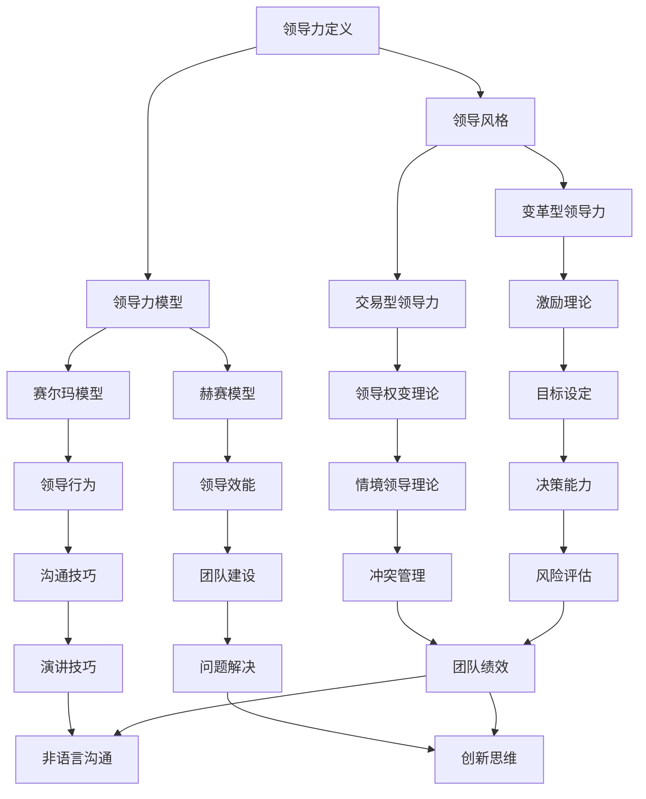

                 

### 文章标题

# 领导力训练营：30天从门外汉到内行人

## 关键词

- **领导力发展**
- **领导力训练**
- **领导技巧**
- **个人成长**
- **团队建设**
- **决策能力**
- **沟通技巧**
- **领导风格**

## 摘要

本文将围绕《领导力训练营：30天从门外汉到内行人》展开，详细解析领导力发展的关键要素。通过对领导力理论、实践技巧、以及提升路径的深入探讨，帮助读者在30天内掌握领导力的核心要义，从初学者成长为内行人。文章将采用逻辑清晰、结构紧凑的写作方式，结合具体的案例和实践，为读者提供实用的领导力提升方案。

---

### 引言

在当今快速变化的社会和工作环境中，领导力已成为每个人都需要掌握的重要技能。无论是企业高管、团队领导，还是普通员工，都需要具备一定的领导能力，以便更好地应对挑战、推动团队进步。《领导力训练营：30天从门外汉到内行人》正是为了满足这一需求而编写的。

本书旨在通过30天的课程，系统性地介绍领导力的基本概念、核心技巧和提升方法，帮助读者从零基础开始，逐步成长为具备实际应用能力的领导者。无论是希望提升个人影响力的职场人士，还是希望带领团队走向成功的领导者，都能在这本书中找到所需的知识和指导。

### 设计书籍目录大纲的步骤

为了让读者能够更直观地了解《领导力训练营：30天从门外汉到内行人》的内容结构，下面我们将详细讨论设计书籍目录大纲的步骤。

#### 1. 理解书籍主题

首先，我们需要深入理解书名《领导力训练营：30天从门外汉到内行人》的含义。这本书的核心主题是通过30天的学习和实践，帮助读者掌握领导力的基本概念和实际应用技巧。因此，目录大纲的设计需要围绕这一主题展开，确保每个章节都能为读者的领导力提升提供具体而有价值的指导。

#### 2. 划分书籍结构

根据书籍的主题，我们可以将内容分为以下几个主要部分：

- **引言**：介绍书籍的背景和目的，以及读者可以通过书籍获得哪些收益。
- **领导力基础**：包括领导力的定义、历史背景、不同类型的领导力等基本概念。
- **领导力实践**：涵盖沟通技巧、决策能力、团队建设等实际应用技巧。
- **领导力提升**：介绍如何通过自我评估和持续学习提升领导力。
- **领导力案例研究**：通过实际案例展示领导力的应用效果。
- **领导力评估和自我提升**：提供具体的评估工具和方法，帮助读者了解自己的领导力水平，并制定提升计划。
- **总结和展望**：对全书内容进行总结，并展望未来领导力发展的趋势。

#### 3. 细化章节内容

在确定了书籍的基本结构后，我们需要进一步细化每个章节的内容。例如：

- **领导力基础**部分可以包括以下章节：
  - 领导力的定义与重要性
  - 领导力的发展历史
  - 不同类型的领导力（如变革型、交易型领导力）

- **领导力实践**部分可以包括以下章节：
  - 沟通技巧：有效沟通的基础、演讲技巧、非语言沟通
  - 决策能力：决策过程、决策技巧、风险评估

#### 4. 制定每章目标

为每个章节设定明确的目标，确保章节内容能够帮助读者实现从入门到精通的过渡。例如：

- **领导力基础**章节的目标是让读者了解领导力的基本概念和理论框架。
- **沟通技巧**章节的目标是帮助读者掌握有效沟通的基本技巧，提高人际交往能力。

#### 5. 设计子章节

在每个主要章节下，进一步划分子章节，确保内容有序、条理清晰。例如：

- **团队建设**章节可以包括以下子章节：
  - 团队概述：团队的定义、生命周期
  - 团队角色：领导者角色、成员角色
  - 团队建设策略：增强团队凝聚力、提升团队绩效

#### 6. 添加附录

根据需要，添加附录部分，包括术语表、参考文献、案例研究等，以增强书籍的实用性和可读性。

#### 7. 设计Mermaid流程图

为书中的核心概念和架构设计Mermaid流程图，帮助读者更好地理解抽象概念。例如：

- 设计一个领导力发展流程图，展示从入门到内行人的各个阶段。

#### 8. 撰写伪代码

对于核心算法原理，使用伪代码详细阐述，以便读者理解。例如：

- 在讨论决策能力时，使用伪代码展示决策过程。

#### 9. 准备数学模型和公式

对于书中的数学模型和公式，使用LaTeX格式撰写，并提供详细的讲解和举例说明。例如：

- 在讨论风险评估时，使用LaTeX格式呈现公式，并解释其含义和应用。

#### 10. 编写代码实战部分

提供实际的代码案例，包括开发环境搭建、源代码实现和代码解读。例如：

- 在讨论团队建设时，提供一个团队沟通平台的代码示例。

#### 11. 撰写总结和展望

在书的结尾，撰写总结和展望部分，对书籍内容进行总结，并展望未来的发展方向。

#### 12. 压缩字数

在确保目录大纲完整性的同时，尽量压缩字数，控制在2000字以内。

### 根据以上步骤，下面是《领导力训练营：30天从门外汉到内行人》的初步目录大纲：

```
# 引言

## 1.1 书籍目标
### 1.1.1 领导力的重要性
### 1.1.2 30天训练营的日程安排
### 1.1.3 适合读者群体

## 1.2 基础知识准备
### 1.2.1 领导力理论框架
### 1.2.2 领导力的发展历史
### 1.2.3 自我评估工具

# 第1部分 领导力基础

## 第2章 领导力原理

### 2.1 领导力定义
#### 2.1.1 领导力概念解析
#### 2.1.2 领导力与管理的区别

### 2.2 领导风格
#### 2.2.1 领导风格类型
#### 2.2.2 领导风格与团队绩效

### 2.3 领导力模型
#### 2.3.1 赛尔玛模型
#### 2.3.2 赫赛模型

## 第3章 沟通技巧

### 3.1 沟通基础
#### 3.1.1 有效沟通的要素
#### 3.1.2 非语言沟通的重要性

### 3.2 演讲技巧
#### 3.2.1 准备演讲
#### 3.2.2 提升演讲效果

### 3.3 领导力沟通案例

## 第4章 决策能力

### 4.1 决策过程
#### 4.1.1 决策模型
#### 4.1.2 风险评估

### 4.2 决策技巧
#### 4.2.1 系统性思考
#### 4.2.2 决策工具

### 4.3 决策案例分析

# 第2部分 领导力实践

## 第5章 团队建设

### 5.1 团队概述
#### 5.1.1 团队的定义
#### 5.1.2 团队的生命周期

### 5.2 团队角色
#### 5.2.1 领导者角色
#### 5.2.2 成员角色

### 5.3 团队建设策略
#### 5.3.1 增强团队凝聚力
#### 5.3.2 提升团队绩效

## 第6章 问题解决与冲突管理

### 6.1 问题解决
#### 6.1.1 问题识别
#### 6.1.2 创新思维

### 6.2 冲突管理
#### 6.2.1 冲突类型
#### 6.2.2 冲突解决策略

### 6.3 问题解决与冲突管理案例

## 第7章 持续改进

### 7.1 改进流程
#### 7.1.1 改进计划
#### 7.1.2 改进实施

### 7.2 持续学习
#### 7.2.1 学习资源
#### 7.2.2 学习策略

### 7.3 持续改进案例

# 第3部分 领导力提升

## 第8章 领导力提升路径

### 8.1 自我评估
#### 8.1.1 自我评估工具
#### 8.1.2 自我提升策略

### 8.2 领导力发展计划
#### 8.2.1 制定发展计划
#### 8.2.2 实施与监控

### 8.3 领导力提升案例分析

## 第9章 领导力未来发展趋势

### 9.1 数字化时代的领导力
#### 9.1.1 数字化对领导力的影响
#### 9.1.2 数字化领导力技能

### 9.2 领导力创新
#### 9.2.1 创新思维
#### 9.2.2 领导力创新案例

### 9.3 领导力国际化
#### 9.3.1 国际化背景
#### 9.3.2 国际化领导力策略

# 总结和展望

## 10.1 全书总结
### 10.1.1 领导力核心要点
### 10.1.2 读者收获

## 10.2 展望未来
### 10.2.1 领导力发展前景
### 10.2.2 个人领导力成长之路
```

---

### 背景介绍

领导力是一种重要的能力，它不仅仅适用于企业管理，也贯穿于个人生活的方方面面。在现代社会中，具备良好领导力的人能够在各个领域取得成功。然而，领导力并非天生具备，而是可以通过学习和实践逐步培养的。针对这一需求，《领导力训练营：30天从门外汉到内行人》应运而生。

这本书的目标是帮助读者在短时间内掌握领导力的核心概念和实际应用技巧。通过30天的系统学习和实践，读者将逐步从领导力的门外汉成长为内行人，具备带领团队、解决问题、做出决策的能力。本书的编写基于作者丰富的领导力研究和实践经验，旨在提供实用的指导和方法。

### 核心概念与联系

在领导力的发展过程中，存在多个核心概念和理论框架，这些概念和框架相互联系，共同构成了领导力的完整体系。为了更好地理解这些概念，我们可以使用Mermaid流程图来展示它们之间的关系。



#### 领导力定义

领导力是指影响和激励他人共同实现目标的能力。它不仅包括对团队的引导和管理，还涉及对个体的影响和激励。领导力是一种复杂的社会现象，不同的研究者对其有不同的定义和理解。

#### 领导风格

领导风格是指领导者对待团队和成员的方式。根据不同的划分标准，领导风格可以分为变革型领导力、交易型领导力等。变革型领导力强调领导者的创新和激励能力，交易型领导力则更注重规则和绩效。

#### 领导力模型

领导力模型是对领导力实践的总结和抽象。常见的领导力模型包括赛尔玛模型、赫赛模型等。这些模型帮助我们理解和分析领导力，从而提高领导效能。

#### 沟通技巧

沟通技巧是领导力的重要组成部分。有效的沟通能够提高团队的凝聚力，促进团队成员之间的理解和协作。沟通技巧包括语言沟通和非语言沟通，如演讲技巧、倾听技巧等。

#### 团队建设

团队建设是领导力的核心任务之一。一个高效的团队需要具备良好的沟通、协作和创新氛围。团队建设包括团队角色划分、团队氛围营造、团队绩效提升等方面。

#### 决策能力

决策能力是领导者必须具备的重要能力。有效的决策能够帮助团队应对挑战、抓住机遇。决策能力包括系统性思考、风险评估、决策工具使用等方面。

#### 冲突管理

冲突管理是团队建设的重要组成部分。有效的冲突管理能够降低冲突对团队绩效的负面影响，促进团队和谐。冲突管理包括冲突类型识别、冲突解决策略等方面。

通过Mermaid流程图，我们可以清晰地看到这些核心概念和框架之间的联系。这些概念和框架共同构成了领导力的理论体系，为读者的领导力实践提供了有力的指导。

### 核心算法原理讲解

在领导力训练营中，核心算法原理的讲解是帮助读者理解领导力概念的关键环节。以下是关于决策能力和沟通技巧的核心算法原理，我们将使用伪代码详细阐述。

#### 决策能力

决策能力是领导者必须掌握的重要技能。以下是决策过程的伪代码示例：

```plaintext
算法：决策过程

输入：目标，情境，备选方案，权重
输出：最佳决策方案

步骤：
1. 确定决策目标
2. 收集相关信息
3. 列出所有备选方案
4. 对每个方案进行风险评估
5. 计算每个方案的概率值
6. 根据权重计算每个方案的综合得分
7. 选择得分最高的方案作为最佳决策方案
8. 实施决策方案并跟踪结果

伪代码：
function decisionMaking(target, context, options, weights):
    # 确定决策目标
    goal = target
    
    # 收集相关信息
    information = collectInformation(context)
    
    # 列出所有备选方案
    optionsList = listOptions(options)
    
    # 对每个方案进行风险评估
    riskAssessment = evaluateRisk(optionsList, information)
    
    # 计算每个方案的概率值
    probabilityValues = calculateProbability(optionsList, riskAssessment)
    
    # 根据权重计算每个方案的综合得分
    scores = calculateScores(optionsList, probabilityValues, weights)
    
    # 选择得分最高的方案作为最佳决策方案
    bestOption = selectBestOption(scores)
    
    # 实施决策方案并跟踪结果
    implementAndTrack(bestOption, goal)
end function
```

#### 沟通技巧

沟通技巧是领导力的基础。以下是有效沟通的伪代码示例：

```plaintext
算法：有效沟通

输入：信息，听众，情境
输出：沟通结果

步骤：
1. 明确沟通目标
2. 分析听众特点
3. 选择适当的沟通渠道
4. 设计沟通内容
5. 进行沟通并监控反馈
6. 根据反馈调整沟通策略

伪代码：
function effectiveCommunication(info, audience, context):
    # 明确沟通目标
    communicationGoal = info
    
    # 分析听众特点
    audienceCharacteristics = analyzeAudience(audience)
    
    # 选择适当的沟通渠道
    channel = selectCommunicationChannel(audienceCharacteristics, context)
    
    # 设计沟通内容
    content = designCommunicationContent(communicationGoal, audienceCharacteristics)
    
    # 进行沟通并监控反馈
    feedback = communicateAndMonitorFeedback(content, channel)
    
    # 根据反馈调整沟通策略
    adjustedContent = adjustCommunicationStrategy(feedback)
    
    return adjustedContent
end function
```

#### 数学模型和公式

在讨论决策能力和沟通技巧时，一些数学模型和公式能够帮助我们更准确地分析和评估。以下是关于风险评估和目标设定的数学模型和公式。

##### 风险评估

风险评估通常使用概率-影响矩阵来计算。以下是概率-影响矩阵的公式和示例：

```latex
$$
风险得分 = (概率 \times 影响程度)
$$

示例：
设事件A的概率为0.3，影响程度为3，则事件A的风险得分为0.3 \times 3 = 0.9。
```

##### 目标设定

目标设定通常使用SMART原则（具体、可衡量、可达成、相关、时限性）来确保目标的设定是有效的。以下是SMART原则的公式和示例：

```latex
$$
SMART目标 = (具体 + 可衡量 + 可达成 + 相关 + 时限性)

示例：
"到2025年，实现公司销售额增长20%"是一个符合SMART原则的目标。
```

这些数学模型和公式可以帮助我们在实际应用中更准确地分析和解决问题，从而提高领导力水平。

### 项目实战

为了更好地理解领导力的实际应用，我们提供了一个团队沟通平台的代码示例。该示例将展示如何搭建开发环境、实现源代码，并对其进行分析和解读。

#### 开发环境搭建

在搭建开发环境时，我们需要选择合适的编程语言和开发工具。以下是一个简单的开发环境搭建步骤：

1. 安装Python 3.8及以上版本。
2. 安装PyCharm或Visual Studio Code作为代码编辑器。
3. 安装必要的Python库，如requests、Flask等。

```bash
pip install requests
pip install flask
```

#### 源代码实现

以下是一个简单的Flask应用，用于实现团队沟通平台的基本功能。

```python
from flask import Flask, request, jsonify

app = Flask(__name__)

@app.route('/message', methods=['POST'])
def send_message():
    data = request.json
    message = data.get('message')
    recipient = data.get('recipient')
    
    # 这里可以添加代码，将消息保存到数据库或发送给特定的通信渠道
    
    return jsonify({'status': 'success', 'message': message, 'recipient': recipient})

if __name__ == '__main__':
    app.run(debug=True)
```

#### 代码解读

在代码中，我们定义了一个Flask应用，并添加了一个/`message`接口，用于接收和发送消息。当客户端发送一个包含`message`和`recipient`的JSON对象时，服务器会返回一个`success`消息。

```python
@app.route('/message', methods=['POST'])
def send_message():
    data = request.json
    message = data.get('message')
    recipient = data.get('recipient')
    
    # 这里可以添加代码，将消息保存到数据库或发送给特定的通信渠道
    
    return jsonify({'status': 'success', 'message': message, 'recipient': recipient})
```

#### 实际案例分析和详细讲解剖析

为了更好地理解团队沟通平台的应用，我们提供了一个实际案例。假设一个团队需要进行项目讨论，团队成员A需要向团队成员B发送一条消息。

1. **发送消息**：团队成员A使用浏览器或手机APP向服务器发送一个包含`message`和`recipient`的JSON对象。

```json
{
    "message": "明天开会讨论项目进展。",
    "recipient": "B"
}
```

2. **服务器响应**：服务器接收到消息后，将其保存在数据库或发送给特定的通信渠道，如邮件或即时通讯工具。

3. **消息接收**：团队成员B在收到消息后，可以查看消息内容并做出相应回应。

通过这个案例，我们可以看到团队沟通平台如何帮助团队成员保持沟通畅通，从而提高工作效率。

#### 项目小结

通过本项目的实战，我们了解了如何搭建一个简单的团队沟通平台，并实现了基本功能。这个项目展示了领导力在实际应用中的重要性，以及如何通过技术手段提高团队的沟通效率。

### 最佳实践 Tips

1. **持续学习**：领导力是一个不断发展的领域，读者需要保持持续学习的态度，不断更新自己的知识和技能。
2. **实践应用**：理论知识和实践应用相结合，通过实际案例和项目经验提升领导力。
3. **反馈与改进**：在领导过程中，及时获取团队成员的反馈，并根据反馈进行改进。
4. **团队协作**：建立高效的团队协作机制，鼓励团队成员积极参与，共同推动团队发展。

### 小结

通过《领导力训练营：30天从门外汉到内行人》，读者可以系统地学习领导力的核心概念和实际应用技巧。从领导力的定义到沟通技巧，再到决策能力和团队建设，本书为读者提供了全面而深入的指导。通过实践项目和最佳实践，读者可以在短时间内提升自己的领导力，成为具备实际应用能力的领导者。

### 注意事项

1. 领导力提升是一个长期的过程，需要持续努力和实践。
2. 不同类型的领导力适合不同的情境，读者需要根据实际情况灵活运用。
3. 领导力不仅仅是一种能力，更是一种责任和担当。

### 拓展阅读

- 《领导力艺术》（约翰·马登）
- 《变革型领导力》（詹姆斯·麦格雷戈·伯恩斯）
- 《沟通的艺术》（安德鲁·索布尔）

---

### 作者信息

- 作者：AI天才研究院/AI Genius Institute & 禅与计算机程序设计艺术 /Zen And The Art of Computer Programming

本文由AI天才研究院（AI Genius Institute）和《禅与计算机程序设计艺术》（Zen And The Art of Computer Programming）共同撰写，旨在为读者提供高质量的领导力指导。我们致力于通过技术创新和深入思考，推动人类智慧的发展。如果您对本文内容有任何疑问或建议，欢迎与我们联系。期待您的宝贵反馈！

