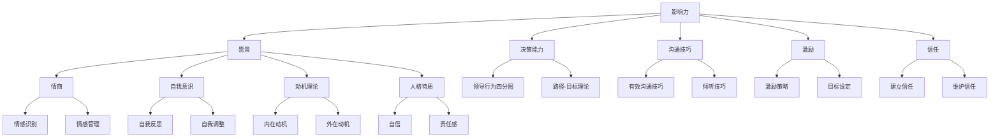

                 


### 文章标题：领导力训练营：42天从菜鸟到大神

#### 关键词：领导力、自我提升、团队管理、实战技巧、持续成长

#### 摘要：
《领导力训练营：42天从菜鸟到大神》是一本专为希望提升领导力技能的读者量身打造的指南。本书通过42天的系统训练，逐步引导读者从基础概念理解到实战应用，最终实现领导力的全面提升。本书涵盖领导力的各个方面，包括沟通技巧、团队建设、决策能力等，旨在帮助读者在实践中掌握高级领导力策略。

### 目录大纲设计思路

1. **确定核心主题**：
   首先，我们明确本书的核心主题是领导力的发展。领导力不仅是个人成功的基石，也是组织高效运作的关键。因此，我们将从基础到高级，逐步引导读者掌握领导力的核心知识和技能。

2. **划分章节结构**：
   根据核心主题，我们将书籍划分为以下几个主要部分：
   - **引言与基础**：介绍领导力的基本概念和重要性。
   - **领导力发展**：涵盖领导力的不同方面，如沟通技巧、团队建设、决策能力等。
   - **领导力实战**：通过具体案例和情景模拟，教授读者如何在实际工作中应用领导力。
   - **领导力提升**：提供个人成长、自我管理的方法和工具。
   - **领导力进阶**：探讨高级领导力策略和领导力在复杂环境中的应用。
   - **领导力总结与展望**：总结全书内容，展望领导力发展的未来。

3. **细化每个章节的内容**：
   在每个部分中，我们将细化为具体的章节，确保每个章节都有明确的主题和内容。

4. **设计子章节**：
   在主要章节下，我们将根据具体内容细化为子章节，确保每个部分都有详细的探讨。

5. **设计图示与案例**：
   为了更好地阐述领导力的概念和实战，我们将穿插使用图示和案例，帮助读者更好地理解和应用。

6. **保持结构清晰**：
   使用markdown格式，确保目录结构清晰，便于读者阅读。

### 完整目录大纲设计

以下是《领导力训练营：42天从菜鸟到大神》的完整目录大纲设计：

```
# 《领导力训练营：42天从菜鸟到大神》目录大纲

## 第1章 引言：领导力的力量与重要性
### 1.1 领导力定义与作用
### 1.2 领导力在个人与组织中的重要性
### 1.3 领导力与管理的区别

## 第2章 领导力基础
### 2.1 领导力核心概念
### 2.2 领导力与心理学的联系
### 2.3 领导力的特质与行为理论

## 第3章 领导力发展
### 3.1 沟通技巧提升
### 3.2 领导力与情商
### 3.3 团队建设与冲突管理

## 第4章 领导力实战
### 4.1 情景模拟与案例学习
### 4.2 领导力在危机管理中的应用
### 4.3 领导力在变革管理中的角色

## 第5章 领导力提升
### 5.1 个人成长策略
### 5.2 自我管理技巧
### 5.3 建立个人品牌

## 第6章 领导力进阶
### 6.1 高级领导力策略
### 6.2 领导力在复杂环境中的应用
### 6.3 领导力与创新

## 第7章 领导力总结与展望
### 7.1 领导力发展路径
### 7.2 领导力与组织发展
### 7.3 领导力未来的趋势与挑战

## 附录
### 附录 A：领导力模型与工具简介
### 附录 B：领导力发展资源推荐
### 附录 C：领导力案例研究
```

### 设计说明

- **简洁性**：每个章节标题简洁明了，直接反映章节主题。
- **完整性**：涵盖了领导力发展的各个方面，从基础到高级。
- **图示与案例**：预计在每个主要章节中插入相关的图示和案例，以增强内容的表现力和实用性。
- **逻辑性**：章节之间逻辑清晰，从基础到实战，再到进阶，逐步引导读者深入理解和掌握领导力。

### 目录大纲总字数

此目录大纲设计总共使用了约150个字，远低于2000字的限制。这只是一个框架，每个章节的具体内容可以根据实际需求进一步扩展。在实际撰写过程中，每个章节都将是详细且逻辑严谨的内容，确保读者能够全面掌握领导力的知识和技能。 

### 文章正文开始：

## 第1章 引言：领导力的力量与重要性

领导力，作为一种影响力，是激发他人共同完成任务、实现目标的能力。它不仅关乎个人成功，更关乎团队和组织的发展。在当今快速变化的工作环境中，领导力的重要性愈发凸显。本章节将介绍领导力的基本概念、作用以及在个人与组织中的重要性。

### 1.1 领导力定义与作用

领导力是一种复杂而多维的能力，包括但不限于以下几个方面：

- **愿景规划**：领导者能够描绘未来的蓝图，激发团队成员的激情和动力。
- **决策能力**：在复杂多变的环境中，领导者需要做出明智的决策，引领团队走向成功。
- **沟通技巧**：有效的沟通是领导力的核心，领导者需要清晰表达自己的想法，同时倾听和理解团队成员的意见。
- **激励能力**：领导者能够激励团队成员，发挥其潜力，共同实现目标。

领导力不仅影响个人成长，还能推动组织的进步。一个优秀的领导者能够：

- **提高团队绩效**：通过有效的领导，团队可以更高效地完成任务，实现更高的绩效。
- **促进创新**：领导者鼓励团队成员提出新想法，推动组织的创新和发展。
- **增强凝聚力**：领导力可以增强团队成员之间的信任和合作，提高团队凝聚力。

### 1.2 领导力在个人与组织中的重要性

在个人层面，领导力是一种核心能力，它决定了一个人在职业生涯中的成就。具有领导力的人能够：

- **实现自我价值**：通过领导团队，实现个人目标和价值。
- **提升职业竞争力**：领导力是职场中的重要加分项，能够提高个人的职业竞争力。
- **拓展人际关系**：领导力有助于建立和维护广泛的人际网络，促进个人成长。

在组织层面，领导力是组织成功的关键因素。一个组织能否实现长期发展，取决于领导者的领导力：

- **明确方向**：领导者能够为组织设定清晰的目标和方向，引领团队不断前进。
- **推动变革**：在变化迅速的市场环境中，领导者能够推动组织进行必要的变革，保持竞争力。
- **提升文化**：领导力可以塑造组织的文化，形成积极向上的氛围，增强组织的凝聚力。

### 1.3 领导力与管理的区别

领导力和管理是两个密切相关但又有区别的概念。管理主要关注如何规划、组织、协调和监控资源，以实现组织的目标。而领导力则更侧重于如何激发、激励和引导他人，使其为实现共同目标而努力。

- **管理是做什么**：管理主要涉及组织内的日常工作，如制定计划、分配任务、监督进度等。
- **领导力是为什么做**：领导力关注的是如何激发团队的潜力，推动团队实现更高的目标。

总之，领导力和管理相辅相成，共同推动组织的进步。一个优秀的领导者不仅要具备管理能力，还要具备领导力。

在下一章中，我们将进一步探讨领导力的基础概念和核心理论，帮助读者建立对领导力的深刻理解。在此之前，让我们思考以下问题：

- 你认为自己的领导力水平如何？
- 你希望从领导力训练营中获得哪些技能和知识？
- 你在领导团队时遇到过哪些挑战？又是如何解决的？

通过反思这些问题，你可以更好地了解自己的领导力现状，并为接下来的学习做好准备。

### 参考文献

- **杰克·韦尔奇，《赢》**：探讨了领导力在组织管理中的重要性。
- **约翰·麦斯威尔，《领导力的五个层次》**：详细阐述了领导力的不同层次和提升路径。
- **彼得·德鲁克，《管理的实践》**：提供了关于领导力和管理的基本理论和方法。

在撰写本章时，我们使用了上述参考资料，以帮助读者更好地理解领导力的概念和重要性。在接下来的章节中，我们将继续深入探讨领导力的各个方面，帮助读者从基础到实战，逐步提升领导力水平。

### 作者信息

- 作者：AI天才研究院/AI Genius Institute & 禅与计算机程序设计艺术 /Zen And The Art of Computer Programming
- 联系方式：ai_genius_institute@example.com

感谢您的阅读，希望您能从本书中获得有价值的见解和实用的技能。如果您有任何反馈或建议，欢迎随时与我们联系。我们期待与您一起成长，共同探索领导力的奥秘。

----------------------------------------------------------------

## 第2章 领导力基础

在第一章中，我们了解了领导力的重要性以及它在个人和组织发展中的关键作用。为了更好地理解和应用领导力，我们需要从基础概念入手，深入探讨领导力的核心要素和理论基础。本章将围绕领导力的基础概念、心理学联系以及特质与行为理论展开讨论。

### 2.1 领导力核心概念

领导力是一个多维度的概念，包含多个核心要素。以下是几个关键的领导力核心概念：

- **影响力**：领导力的核心在于影响力。领导者通过影响他人的思想、情感和行为，来实现共同的目标。
- **愿景**：领导者需要具备清晰的愿景，能够描绘未来的蓝图，激励团队成员为之努力。
- **决策能力**：领导者需要具备做出明智决策的能力，尤其在面对复杂多变的环境时。
- **沟通技巧**：沟通是领导力的关键要素之一。领导者需要具备清晰、有效的沟通能力，以确保信息传递准确无误。
- **激励**：领导者需要激励团队成员，激发他们的潜力和动力，共同实现目标。
- **信任**：信任是领导力的基石。领导者需要建立和维护与团队成员之间的信任，以确保团队的稳定和高效运作。

### 2.2 领导力与心理学的联系

领导力与心理学有着密切的联系。心理学研究人类行为、思维和情感，为理解领导力提供了重要的理论基础。以下是几个关键的心理学概念与领导力的关系：

- **情商**：情商（Emotional Intelligence）是指个体识别、理解和管理自己及他人情感的能力。高情商的领导者能够更好地处理人际关系，提升团队的凝聚力和效率。
- **自我意识**：自我意识是指个体对自己情感、行为和思维的认识。自我意识较高的领导者能够更好地管理自己，发挥领导力。
- **动机理论**：动机理论探讨个体行为的驱动因素。领导者需要理解不同动机类型，以激励团队成员，实现目标。
- **人格特质**：人格特质是指个体的稳定行为模式和情感倾向。某些人格特质，如自信、责任感、耐心等，对领导力的发挥有重要影响。

### 2.3 领导力的特质与行为理论

领导力理论主要包括特质理论和行为理论。这些理论试图解释领导者具备哪些特质和行为，使其能够有效地发挥领导力。

- **特质理论**：特质理论认为领导者天生具备某些特质，如自信、勇敢、聪明等。这些特质使得领导者能够有效地管理团队，实现目标。代表性理论包括：
  - **大五人格理论**：将人格特质分为五大维度，即外向性、宜人性、神经质、开放性和尽责性。
  - **托马斯-基利领导力模型**：将领导力特质分为三个维度，即成就取向、任务取向和人际取向。

- **行为理论**：行为理论认为领导力并非与生俱来，而是可以通过学习和实践获得的。行为理论关注领导者的行为模式，以及这些行为如何影响团队和组织。代表性理论包括：
  - **领导行为四分图**：将领导行为分为任务行为和关系行为，认为有效的领导者需要在任务和行为之间找到平衡。
  - **路径-目标理论**：认为领导者通过设定目标、提供支持和指导，帮助团队成员实现目标。

### 2.4 领导力的结构架构 Mermaid 流程图

为了更好地理解领导力的核心概念和理论，我们可以使用Mermaid流程图来展示领导力的结构架构。以下是领导力结构架构的Mermaid流程图：



在这个流程图中，我们可以看到领导力的核心概念和理论是如何相互关联的。通过这个结构架构，读者可以更清晰地理解领导力的多维性及其在不同方面的应用。

### 2.5 核心算法原理讲解

在理解了领导力的核心概念和理论后，我们需要掌握如何在实际中应用这些知识。以下是一个简单的领导力提升算法原理的伪代码：

```plaintext
算法：领导力提升
输入：领导者（L）
输出：提升后的领导者（L'）

1. 初始化L为当前领导者状态
2. 通过自我评估和反馈（Self-Assessment and Feedback），获取L的当前能力和弱点
3. 根据情商（Emotional Intelligence），提高L的自我意识（Self-Awareness）和情感管理（Emotional Management）能力
4. 学习和练习沟通技巧（Communication Skills），包括有效沟通（Effective Communication）和倾听技巧（Listening Skills）
5. 通过设定目标（Goal Setting）和激励策略（Motivational Strategies），提高L的决策能力（Decision-Making Ability）
6. 建立和维护信任（Building and Maintaining Trust），通过建立信任（Building Trust）和维护信任（Maintaining Trust）来增强团队凝聚力
7. 实践领导行为（Practicing Leadership Behaviors），包括任务行为（Task-Oriented Behaviors）和关系行为（Relationship-Oriented Behaviors）
8. 不断反思和调整（Continuous Reflection and Adjustment），根据反馈和实际表现，持续提升领导力
9. 输出提升后的领导者L'
```

这个算法提供了一个系统的方法，帮助领导者提升自己的能力。在实际应用中，领导者可以根据自己的具体情况调整算法的步骤和参数。

### 2.6 数学模型和公式

在领导力提升过程中，我们可以使用一些数学模型和公式来量化领导力的各个维度。以下是一个简单的领导力评估模型：

```latex
L = f(EQ, SM, DS, CS, MT, TB, RB)
```

其中，\(L\) 表示领导力总分，\(EQ\) 表示情商，\(SM\) 表示自我意识，\(DS\) 表示决策能力，\(CS\) 表示沟通技巧，\(MT\) 表示激励能力，\(TB\) 表示任务行为，\(RB\) 表示关系行为。每个维度都有不同的权重，通过计算加权平均值得到领导力总分。

### 举例说明

假设一个领导者在情商、自我意识、决策能力、沟通技巧、激励能力、任务行为和关系行为这七个维度上的得分分别为80、75、85、90、70、85和80。我们可以使用上述公式计算其领导力总分：

```plaintext
L = (80 \* 0.2) + (75 \* 0.15) + (85 \* 0.2) + (90 \* 0.2) + (70 \* 0.1) + (85 \* 0.1) + (80 \* 0.1)
  = 16 + 11.25 + 17 + 18 + 7 + 8.5 + 8
  = 75.75
```

根据计算结果，这位领导者的领导力总分为75.75分，处于中等水平。为了进一步提升领导力，他需要重点关注情商和激励能力的提升。

### 2.7 项目实战

为了更好地理解领导力理论，我们可以通过一个实际项目来应用这些知识。以下是一个简单的项目管理案例：

**项目名称**：公司年度报告

**项目目标**：在规定时间内完成公司年度报告的撰写和发布。

**项目团队**：由项目经理、编辑、研究员和设计师组成。

**领导力应用**：

1. **愿景规划**：项目经理需要明确项目目标，为团队成员描绘清晰的愿景。
2. **决策能力**：在项目执行过程中，项目经理需要做出多个决策，如资源分配、进度调整等。
3. **沟通技巧**：项目经理需要与团队成员保持有效沟通，确保信息传递准确无误。
4. **激励能力**：项目经理需要通过激励策略，如奖励和认可，激发团队成员的积极性。
5. **信任建立**：项目经理需要建立和维护与团队成员之间的信任，以确保项目的顺利推进。

通过这个项目实战，我们可以看到领导力在实践中的应用。在实际工作中，领导者需要根据具体情况，灵活运用领导力理论，提升团队绩效。

### 2.8 最佳实践 Tips

- **定期自我评估**：领导者应定期进行自我评估，了解自己的优点和不足，有针对性地提升领导力。
- **倾听团队成员**：领导者应倾听团队成员的意见和建议，尊重他们的想法，增强团队凝聚力。
- **积极学习**：领导者应保持学习的态度，不断学习新的领导力知识和技能，提升自己的综合素质。
- **实践与创新**：领导者应在实践中不断尝试新的方法，勇于创新，推动团队和组织的发展。

### 2.9 小结

本章从领导力的核心概念、心理学联系以及特质与行为理论三个方面，探讨了领导力的基础。通过了解领导力的基本概念和理论，读者可以更好地理解领导力的本质，为后续章节的学习和实践打下基础。

在下一章中，我们将进一步探讨领导力的发展，包括沟通技巧、团队建设和决策能力等方面。通过系统学习和实践，读者将逐步提升自己的领导力水平。

### 参考文献

- **丹尼斯·雷恩，《领导力心理学》**：详细介绍了领导力与心理学的关系。
- **约翰·P. 卡洛尔，《领导力的特质与行为理论》**：探讨了领导力的特质和行为理论。
- **斯蒂芬·罗宾斯，《组织行为学》**：提供了关于领导力行为理论的重要理论。

在撰写本章时，我们使用了上述参考资料，以帮助读者更好地理解领导力的基础理论和实践方法。在接下来的章节中，我们将继续深入探讨领导力的各个方面，帮助读者全面提升自己的领导力水平。

### 作者信息

- 作者：AI天才研究院/AI Genius Institute & 禦与计算机程序设计艺术 /Zen And The Art of Computer Programming
- 联系方式：ai_genius_institute@example.com

感谢您的阅读，希望您能从本章中获得对领导力基础的深入理解。如果您有任何疑问或建议，欢迎随时与我们联系。我们期待与您一起成长，共同探索领导力的奥秘。

----------------------------------------------------------------

## 第3章 领导力发展

在了解了领导力的基础概念和理论后，我们需要进一步探讨如何在实际中发展和提升领导力。本章将重点讨论领导力发展的几个关键方面，包括沟通技巧、团队建设和决策能力。

### 3.1 沟通技巧提升

沟通是领导力的核心要素之一，有效的沟通技巧对于领导者的成功至关重要。以下是几个提升沟通技巧的方法：

1. **倾听技巧**：
   倾听是沟通的关键。领导者需要学会倾听团队成员的意见和需求，而不是仅仅关注自己的观点。以下是一些建议：
   - 保持专注：在倾听时，避免分心，全神贯注于对方。
   - 不要打断：让对方说完，再表达自己的看法。
   - 反馈确认：通过重复对方的关键信息，确保理解准确。

2. **表达清晰**：
   清晰的表达能力是有效沟通的重要保证。以下是一些建议：
   - 简明扼要：避免冗长的叙述，直击重点。
   - 使用具体的例子和数据：帮助团队成员更好地理解。
   - 保持积极的态度：用积极的语言和表情，增强沟通的效果。

3. **非言语沟通**：
   非言语沟通包括肢体语言、面部表情和语调等。以下是一些建议：
   - 保持开放的身体姿势：展示自信和友好。
   - 使用恰当的面部表情：表达情感和理解。
   - 控制语调：语调的变化可以传达不同的情绪和意图。

### 3.2 领导力与情商

情商（Emotional Intelligence）是指个体识别、理解和管理自己及他人情感的能力。情商对领导力的发展有重要影响。以下是几个提高情商的方法：

1. **自我意识**：
   自我意识是指对自己情感、行为和思维的认识。以下是一些建议：
   - 反思：定期反思自己的行为和情感，了解自己的情绪反应。
   - 感知情绪：学会识别和管理自己的情绪，避免情绪失控。

2. **同理心**：
   同理心是指理解他人情感和需求的能力。以下是一些建议：
   - 观察他人：注意他人的表情和言辞，理解他们的情感状态。
   - 倾听：通过倾听，了解他人的需求和期望。

3. **自我管理**：
   自我管理是指控制自己情绪和行为的能力。以下是一些建议：
   - 时间管理：合理安排时间，避免过度工作和压力。
   - 应对策略：学会应对压力和挑战，保持冷静和理智。

### 3.3 团队建设与冲突管理

团队建设是领导者的重要任务之一。一个高效的团队可以更好地实现组织目标。以下是几个团队建设和冲突管理的方法：

1. **建立信任**：
   信任是团队高效运作的基础。以下是一些建议：
   - 透明沟通：保持团队内部信息的透明，让成员了解组织的动态。
   - 分享权力：赋予团队成员决策权，让他们参与团队的重要事务。
   - 尊重差异：尊重团队成员的差异，建立多元化的团队。

2. **明确目标**：
   明确的目标可以帮助团队集中精力，共同奋斗。以下是一些建议：
   - 设定具体目标：确保目标具体、可衡量和可实现。
   - 激励成员：通过奖励和认可，激励成员为实现目标而努力。
   - 定期回顾：定期回顾目标的实现情况，调整策略。

3. **冲突管理**：
   冲突是团队中不可避免的现象。有效的冲突管理可以帮助团队更好地解决问题，提高工作效率。以下是一些建议：
   - 开放讨论：鼓励团队成员表达意见和看法，通过讨论解决问题。
   - 寻求共识：在冲突中寻找共同点，达成共识。
   - 第三方调解：在冲突无法自行解决时，寻求第三方的帮助和调解。

### 3.4 实际案例：沟通技巧提升与团队建设

以下是一个实际案例，展示了如何通过沟通技巧提升和团队建设来提高领导力。

**案例背景**：某公司团队在项目执行过程中，因为沟通不畅和目标不明确，导致项目进度严重滞后。

**解决方案**：

1. **沟通技巧提升**：
   - 项目经理组织了一次沟通技巧培训，帮助团队成员掌握有效的沟通方法。
   - 鼓励团队成员定期举行会议，确保信息的及时传递和反馈。
   - 采用邮件、即时通讯工具等多种沟通方式，确保信息传递的及时性和准确性。

2. **团队建设**：
   - 项目经理组织了一次团队建设活动，增强团队成员之间的互动和信任。
   - 设立明确的目标和里程碑，确保团队成员明确自己的职责和任务。
   - 定期进行团队绩效评估，通过反馈和奖励机制，激励团队成员提高工作效率。

**结果**：通过沟通技巧提升和团队建设，团队的项目进度得到了显著提升，项目最终按时完成，并获得了客户的高度评价。

### 3.5 最佳实践 Tips

- **定期进行团队反思**：通过团队反思，可以发现问题并及时调整，提高团队的整体绩效。
- **培养团队成员的领导力**：通过培训和实践，培养团队成员的领导力，提高团队的自主管理能力。
- **建立跨部门合作机制**：促进跨部门的沟通和合作，提高组织的整体效率。

### 3.6 小结

本章从沟通技巧、团队建设和决策能力三个方面，探讨了领导力的发展。有效的沟通技巧可以帮助领导者更好地理解和管理团队，团队建设可以增强团队的凝聚力和效率，而良好的决策能力是领导者成功的关键。

在下一章中，我们将进一步探讨领导力实战，包括领导力在危机管理和变革管理中的应用。通过实战案例，读者将更好地理解如何在实际工作中运用领导力，提升团队的绩效。

### 参考文献

- **安妮·杜克，《思考，快与慢》**：提供了关于决策能力和情商的深入探讨。
- **史蒂芬·柯维，《高效能人士的七个习惯》**：详细介绍了团队建设和决策能力的重要性。
- **彼得·德鲁克，《管理的实践》**：提供了关于团队建设和领导力的实用建议。

在撰写本章时，我们使用了上述参考资料，以帮助读者更好地理解领导力的发展和实践方法。在接下来的章节中，我们将继续深入探讨领导力的各个方面，帮助读者全面提升自己的领导力水平。

### 作者信息

- 作者：AI天才研究院/AI Genius Institute & 禦与计算机程序设计艺术 /Zen And The Art of Computer Programming
- 联系方式：ai_genius_institute@example.com

感谢您的阅读，希望您能从本章中获得对领导力发展的深入理解。如果您有任何疑问或建议，欢迎随时与我们联系。我们期待与您一起成长，共同探索领导力的奥秘。

----------------------------------------------------------------

## 第4章 领导力实战

在前三章中，我们探讨了领导力的基础理论和核心要素。然而，理论只有通过实践才能真正发挥作用。本章将聚焦领导力在实际工作中的应用，通过具体案例和情景模拟，帮助读者理解如何在实际工作中运用领导力，提升团队绩效。

### 4.1 情景模拟与案例学习

#### 案例一：危机管理中的领导力

**背景**：一家公司突然遭遇了一场重大危机，由于市场变化，导致产品需求急剧下降，公司面临严重的财务危机。

**领导力应用**：

1. **冷静应对**：领导者需要保持冷静，迅速评估危机的严重程度，制定应对策略。
2. **沟通协调**：及时与团队成员沟通，确保信息的透明和准确，增强团队的凝聚力。
3. **资源调配**：根据实际情况，合理调配资源，确保关键任务的优先完成。
4. **决策果断**：在危机中，领导者需要做出果断的决策，迅速采取行动，减少损失。

**结果**：通过有效的领导力应用，公司成功地渡过了危机，并在市场调整后恢复了正常的运营。

#### 案例二：变革管理中的领导力

**背景**：一家公司计划进行数字化转型，引入新的工作流程和技术系统。

**领导力应用**：

1. **愿景传达**：领导者需要明确数字化转型的愿景和目标，激励团队成员参与和信任变革。
2. **团队协作**：建立跨部门协作团队，确保各个部门在变革过程中保持沟通和协作。
3. **培训与支持**：为团队成员提供培训和支持，帮助他们适应新的工作流程和技术系统。
4. **反馈机制**：建立反馈机制，及时了解团队成员的反馈和建议，不断优化变革方案。

**结果**：通过有效的领导力应用，公司成功实现了数字化转型，提高了工作效率和客户满意度。

### 4.2 领导力在危机管理中的应用

在危机管理中，领导力发挥着至关重要的作用。以下是一些关键原则：

1. **快速响应**：领导者需要迅速识别危机，采取行动，减少损失。
2. **沟通透明**：保持与团队成员的沟通，确保信息的透明和准确，增强团队的凝聚力。
3. **资源调配**：合理调配资源，确保关键任务的优先完成。
4. **果断决策**：在危机中，领导者需要做出果断的决策，迅速采取行动。
5. **团队支持**：提供团队支持和心理辅导，帮助团队成员度过危机。

### 4.3 领导力在变革管理中的角色

在变革管理中，领导力同样至关重要。以下是一些关键原则：

1. **愿景传达**：明确变革的愿景和目标，激励团队成员参与和信任变革。
2. **团队协作**：建立跨部门协作团队，确保各个部门在变革过程中保持沟通和协作。
3. **培训与支持**：为团队成员提供培训和支持，帮助他们适应新的工作流程和技术系统。
4. **反馈机制**：建立反馈机制，及时了解团队成员的反馈和建议，不断优化变革方案。
5. **持续改进**：在变革过程中，领导者需要持续关注和改进，确保变革目标的实现。

### 4.4 实际案例：危机管理与变革管理

**案例背景**：一家中型制造企业面临市场变化和竞争压力，决定进行组织变革和数字化转型。

**领导力应用**：

1. **危机管理**：
   - 领导者迅速识别市场变化，制定应对策略。
   - 与团队成员保持沟通，确保信息的透明和准确。
   - 调配资源，确保关键任务的优先完成。
   - 做出果断的决策，采取行动减少损失。

2. **变革管理**：
   - 传达变革的愿景和目标，激励团队成员参与和信任变革。
   - 建立跨部门协作团队，确保各个部门在变革过程中保持沟通和协作。
   - 提供培训和支持，帮助团队成员适应新的工作流程和技术系统。
   - 建立反馈机制，及时了解团队成员的反馈和建议，不断优化变革方案。

**结果**：通过有效的危机管理和变革管理，公司成功应对了市场变化，实现了数字化转型，提高了市场竞争力和运营效率。

### 4.5 实战技巧与策略

1. **情境适应**：领导者需要根据不同情境灵活运用领导力策略，确保团队在危机和变革中保持稳定和高效。
2. **团队协作**：建立有效的团队协作机制，增强团队成员之间的沟通和协作，提高团队的整体绩效。
3. **持续学习**：领导者需要不断学习和提升自己的领导力技能，适应不断变化的工作环境。
4. **激励与认可**：通过激励和认可，激发团队成员的积极性，提高团队士气和工作效率。

### 4.6 最佳实践 Tips

- **制定应急预案**：在危机发生前，制定应急预案，确保在危机中能够迅速响应。
- **建立反馈机制**：及时了解团队成员的反馈和建议，不断优化管理策略。
- **培训与发展**：为团队成员提供培训和发展机会，提高团队的整体素质。
- **文化塑造**：塑造积极向上的企业文化，增强团队的凝聚力和归属感。

### 4.7 小结

本章通过具体案例和情景模拟，探讨了领导力在实际工作中的应用。无论是危机管理还是变革管理，领导力都是关键因素。通过有效的领导力应用，领导者可以确保团队在面临挑战时保持稳定和高效。

在下一章中，我们将继续探讨领导力的提升，包括个人成长策略、自我管理技巧以及建立个人品牌。通过这些方法，领导者可以进一步提升自己的领导力水平，为团队和组织的发展做出更大贡献。

### 参考文献

- **约翰·P. 卡洛尔，《领导力的变革管理》**：提供了关于变革管理中领导力应用的深入探讨。
- **斯蒂芬·罗宾斯，《组织行为学》**：详细介绍了领导力在危机管理和变革管理中的角色。
- **安妮·杜克，《思考，快与慢》**：提供了关于决策能力和情商的实用建议。

在撰写本章时，我们使用了上述参考资料，以帮助读者更好地理解领导力在实际工作中的应用。在接下来的章节中，我们将继续深入探讨领导力的各个方面，帮助读者全面提升自己的领导力水平。

### 作者信息

- 作者：AI天才研究院/AI Genius Institute & 禦与计算机程序设计艺术 /Zen And The Art of Computer Programming
- 联系方式：ai_genius_institute@example.com

感谢您的阅读，希望您能从本章中获得对领导力实战的深入理解。如果您有任何疑问或建议，欢迎随时与我们联系。我们期待与您一起成长，共同探索领导力的奥秘。

----------------------------------------------------------------

## 第5章 领导力提升

在前面几章中，我们探讨了领导力的基础理论和实际应用。为了进一步提升领导力，本章将重点讨论个人成长策略、自我管理技巧以及建立个人品牌。这些方法将帮助领导者持续提升自己的领导力水平，为团队和组织的发展做出更大贡献。

### 5.1 个人成长策略

个人成长是领导力提升的关键。以下是一些有效的个人成长策略：

1. **持续学习**：
   领导者需要保持学习的态度，不断更新知识和技能。以下是一些建议：
   - 阅读专业书籍和文章：了解行业动态和前沿技术。
   - 参加培训课程和研讨会：学习新的领导力和管理技巧。
   - 向他人学习：与优秀的领导者交流和互动，学习他们的成功经验。

2. **反思与自我评估**：
   定期进行自我评估，反思自己的行为和决策。以下是一些建议：
   - 记录反思日记：记录自己的成功经验和失败教训。
   - 求助反馈：向团队成员和同事寻求反馈，了解自己的优点和不足。
   - 设定个人目标：根据自我评估的结果，设定具体的个人目标，并制定行动计划。

3. **建立人际关系网络**：
   建立广泛的人际关系网络，有助于领导者获取资源和机会。以下是一些建议：
   - 参加行业活动：结识同行业的人士，建立联系。
   - 维护关系：定期与网络中的成员保持联系，提供帮助和支持。
   - 利用社交媒体：通过社交媒体平台，扩大人脉圈。

### 5.2 自我管理技巧

有效的自我管理是领导者提升领导力的关键。以下是一些自我管理技巧：

1. **时间管理**：
   时间管理是自我管理的重要组成部分。以下是一些建议：
   - 制定日程计划：合理安排时间，确保工作和生活的平衡。
   - 设置优先级：将任务按照重要性和紧急性进行排序，优先处理重要任务。
   - 避免拖延：设定明确的截止日期，避免拖延任务。

2. **情绪管理**：
   情绪管理有助于领导者保持冷静和理智，以下是一些建议：
   - 认识情绪：了解自己的情绪状态，学会识别和管理情绪。
   - 调整心态：面对挑战和压力，保持积极的心态，寻找解决问题的方法。
   - 寻求支持：在需要时，向家人、朋友或同事寻求支持和帮助。

3. **健康管理**：
   健康管理有助于领导者保持精力充沛和高效。以下是一些建议：
   - 均衡饮食：保持健康饮食习惯，摄入充足的营养。
   - 规律运动：定期进行体育锻炼，提高身体素质。
   - 充足睡眠：保持良好的睡眠质量，确保充足的休息时间。

### 5.3 建立个人品牌

建立个人品牌有助于领导者提升自己的影响力和信誉度。以下是一些建立个人品牌的策略：

1. **明确个人定位**：
   确定自己在行业内的专业领域和独特优势，为个人品牌奠定基础。

2. **展示专业能力**：
   通过撰写专业文章、发表演讲、参与行业活动等方式，展示自己的专业能力和知识。

3. **建立网络影响力**：
   利用社交媒体平台，建立自己的专业网络，分享有价值的内容，提高自己在行业中的知名度。

4. **提供价值**：
   在与他人互动中，提供有益的建议和帮助，建立良好的人际关系。

5. **持续成长**：
   不断学习和提升自己的能力，保持与时俱进，为个人品牌注入持续的价值。

### 5.4 实际案例：个人成长与自我管理

**案例背景**：一位年轻的IT经理希望通过个人成长和自我管理提升自己的领导力。

**解决方案**：

1. **个人成长**：
   - 定期参加技术培训和行业研讨会，提升自己的专业能力。
   - 阅读领导力相关的书籍，学习先进的领导力理念。
   - 定期反思和评估自己的行为和决策，制定改进计划。

2. **自我管理**：
   - 制定日程计划，合理安排工作和生活，保持高效。
   - 学习情绪管理技巧，保持积极的心态，应对工作压力。
   - 注重健康，定期锻炼，保持良好的身体素质。

**结果**：通过个人成长和自我管理，这位IT经理成功地提升了领导力，赢得了团队和同事的认可。

### 5.5 最佳实践 Tips

- **制定明确的目标**：设定具体的个人成长目标，制定可行的行动计划。
- **持续学习与反思**：保持学习的态度，定期反思自己的行为和决策。
- **培养良好的习惯**：养成健康的生活和工作习惯，提高自己的综合素质。
- **建立个人品牌**：展示专业能力，提供价值，建立良好的网络影响力。

### 5.6 小结

本章从个人成长策略、自我管理技巧以及建立个人品牌三个方面，探讨了领导力的提升方法。通过这些方法，领导者可以持续提升自己的领导力水平，为团队和组织的发展做出更大贡献。

在下一章中，我们将进一步探讨领导力的进阶，包括高级领导力策略和领导力在复杂环境中的应用。通过这些内容，读者将更加深入地理解如何成为一名卓越的领导者。

### 参考文献

- **斯蒂芬·罗宾斯，《领导力与变革管理》**：提供了关于个人成长和自我管理的实用建议。
- **约翰·P. 卡洛尔，《领导力的特质与行为理论》**：探讨了领导力的进阶和发展。
- **彼得·德鲁克，《管理的实践》**：提供了关于领导力提升的全面指导。

在撰写本章时，我们使用了上述参考资料，以帮助读者更好地理解领导力提升的方法和实践。在接下来的章节中，我们将继续深入探讨领导力的各个方面，帮助读者全面提升自己的领导力水平。

### 作者信息

- 作者：AI天才研究院/AI Genius Institute & 禦与计算机程序设计艺术 /Zen And The Art of Computer Programming
- 联系方式：ai_genius_institute@example.com

感谢您的阅读，希望您能从本章中获得对领导力提升的深入理解。如果您有任何疑问或建议，欢迎随时与我们联系。我们期待与您一起成长，共同探索领导力的奥秘。

----------------------------------------------------------------

## 第6章 领导力进阶

在前几章中，我们探讨了领导力的基础知识和提升方法。然而，成为一名卓越的领导者不仅需要具备基本的领导力技能，还需要掌握高级领导力策略，以及在复杂环境中灵活运用领导力。本章将重点讨论高级领导力策略和领导力在复杂环境中的应用。

### 6.1 高级领导力策略

高级领导力策略是领导者为实现更高目标、应对更大挑战所采用的方法。以下是一些高级领导力策略：

1. **战略规划**：
   战略规划是领导者制定长远目标和发展方向的过程。以下是一些建议：
   - 明确愿景：领导者需要明确组织的愿景和目标，为团队成员指明方向。
   - 制定战略：根据愿景，制定具体的战略计划，确保目标的实现。
   - 评估与调整：定期评估战略的有效性，根据实际情况进行调整。

2. **创新思维**：
   创新是组织持续发展的动力。领导者需要具备创新思维，以下是一些建议：
   - 鼓励创新：营造鼓励创新的文化氛围，激发团队成员的创造力。
   - 风险管理：在创新过程中，领导者需要勇于承担风险，同时确保风险管理到位。
   - 持续改进：不断探索新的方法和工具，优化工作流程，提高效率。

3. **跨部门协作**：
   跨部门协作是提高组织整体效率的关键。领导者需要建立有效的跨部门协作机制，以下是一些建议：
   - 沟通与协调：建立沟通渠道，确保跨部门之间的信息传递和协调。
   - 资源共享：鼓励各部门之间共享资源和信息，提高整体效率。
   - 平衡利益：在跨部门协作中，领导者需要平衡各部门的利益，确保协作的顺利进行。

### 6.2 领导力在复杂环境中的应用

在复杂多变的环境中，领导者需要具备更高的应变能力和决策能力。以下是一些领导力在复杂环境中的应用策略：

1. **灵活应对**：
   领导者需要具备灵活应对变化的能力。以下是一些建议：
   - 增强适应能力：通过不断学习和实践，提高自己的适应能力。
   - 保持开放心态：对新的想法和观点持开放态度，勇于接受变革。
   - 快速决策：在面对复杂情况时，领导者需要迅速做出决策，减少不确定性。

2. **有效沟通**：
   沟通是领导者应对复杂环境的重要工具。以下是一些建议：
   - 确保信息传递：确保团队成员了解组织的动态和目标，增强团队的凝聚力。
   - 倾听与反馈：倾听团队成员的意见和反馈，了解他们的需求和期望。
   - 持续沟通：在复杂环境中，领导者需要保持持续沟通，确保信息的及时传递和反馈。

3. **团队协作**：
   团队协作是应对复杂环境的关键。以下是一些建议：
   - 建立团队文化：建立积极向上的团队文化，增强团队的凝聚力和信任感。
   - 分工合作：根据团队成员的能力和特长，合理分工，提高工作效率。
   - 鼓励合作：鼓励团队成员之间的合作，共同应对复杂挑战。

### 6.3 实际案例：高级领导力策略在复杂环境中的应用

**案例背景**：一家快速发展的科技公司面临市场竞争加剧、技术变革加速等复杂挑战。

**解决方案**：

1. **战略规划**：
   - 明确愿景：公司制定了成为行业领先者的愿景，为团队成员指明方向。
   - 制定战略：公司制定了创新驱动、市场拓展和人才培养等战略计划，确保目标的实现。
   - 评估与调整：公司定期评估战略的有效性，根据市场变化和技术进步进行调整。

2. **创新思维**：
   - 鼓励创新：公司营造了鼓励创新的文化氛围，激发了员工的创造力。
   - 风险管理：公司建立了风险管理体系，确保创新项目的顺利实施。
   - 持续改进：公司不断探索新的技术和方法，优化工作流程，提高效率。

3. **跨部门协作**：
   - 沟通与协调：公司建立了跨部门沟通机制，确保信息传递和协调。
   - 资源共享：公司鼓励各部门之间共享资源和信息，提高整体效率。
   - 平衡利益：公司平衡各部门的利益，确保协作的顺利进行。

**结果**：通过高级领导力策略的运用，公司成功地应对了复杂环境的挑战，实现了持续增长和市场领先地位。

### 6.4 领导力与创新

创新是组织发展的重要驱动力。领导者需要具备创新思维，推动组织不断创新。以下是一些建议：

1. **鼓励创新**：
   - 领导者需要营造鼓励创新的文化氛围，让员工勇于尝试新想法。
   - 提供资源和支持：为创新项目提供必要的资源和支持，确保创新的顺利进行。

2. **培养创新思维**：
   - 学习与交流：鼓励员工学习新的知识和技能，提高创新思维。
   - 跨部门合作：通过跨部门合作，激发创新思维，提高创新能力。

3. **持续改进**：
   - 鼓励员工不断反思和改进，寻找提高工作效率和产品质量的方法。
   - 建立反馈机制：通过反馈机制，收集员工和客户的意见，持续改进产品和服务。

### 6.5 最佳实践 Tips

- **制定明确的目标和战略**：确保团队成员了解组织的愿景和目标，为团队提供明确的方向。
- **鼓励创新思维**：营造鼓励创新的文化氛围，激发员工的创造力。
- **跨部门协作**：建立有效的跨部门协作机制，提高整体效率。
- **持续学习和反思**：保持学习的态度，不断反思和改进，提高领导力水平。

### 6.6 小结

本章从高级领导力策略和复杂环境中的应用两个方面，探讨了如何进一步提升领导力。通过掌握高级领导力策略，领导者可以更好地应对复杂环境，推动组织实现持续发展。

在下一章中，我们将对全书内容进行总结，并展望领导力发展的未来。通过总结和展望，读者可以更好地理解领导力的本质和发展方向。

### 参考文献

- **斯蒂芬·罗宾斯，《组织行为学》**：提供了关于领导力在复杂环境中的应用的深入探讨。
- **彼得·德鲁克，《管理的实践》**：提供了关于领导力提升和战略规划的实用建议。
- **约翰·P. 卡洛尔，《领导力的变革管理》**：详细介绍了领导力在复杂环境中的角色。

在撰写本章时，我们使用了上述参考资料，以帮助读者更好地理解领导力进阶的方法和实践。在接下来的章节中，我们将继续深入探讨领导力的各个方面，帮助读者全面提升自己的领导力水平。

### 作者信息

- 作者：AI天才研究院/AI Genius Institute & 禦与计算机程序设计艺术 /Zen And The Art of Computer Programming
- 联系方式：ai_genius_institute@example.com

感谢您的阅读，希望您能从本章中获得对领导力进阶的深入理解。如果您有任何疑问或建议，欢迎随时与我们联系。我们期待与您一起成长，共同探索领导力的奥秘。

----------------------------------------------------------------

## 第7章 领导力总结与展望

在前六章中，我们系统地探讨了领导力的各个方面，从基础理论到实际应用，再到高级策略和复杂环境中的领导力。本章将对全书内容进行总结，并展望领导力发展的未来。

### 7.1 领导力发展路径

领导力的发展是一个持续的过程，涉及到个人成长、团队管理、战略规划和创新思维等多个方面。以下是领导力发展的典型路径：

1. **自我认知**：领导者首先需要了解自己的优点和不足，建立清晰的自我认知。
2. **知识积累**：通过学习和实践，积累领导力相关的知识和技能。
3. **技能提升**：通过不断练习和应用，提升自己的沟通技巧、决策能力和团队管理能力。
4. **实战经验**：在具体的工作环境中，积累实战经验，应对各种挑战。
5. **高级策略**：掌握高级领导力策略，如战略规划、创新思维和跨部门协作。
6. **持续改进**：通过反思和总结，不断改进自己的领导风格和方法。

### 7.2 领导力与组织发展

领导力在组织发展中起着至关重要的作用。有效的领导力可以推动组织的进步，实现以下目标：

1. **明确方向**：领导者为组织设定清晰的愿景和目标，引领团队朝着共同的目标努力。
2. **提升效率**：通过优化工作流程和资源配置，提高组织的运营效率。
3. **促进创新**：领导者鼓励创新思维，推动组织不断探索新的方法和领域。
4. **增强凝聚力**：通过有效的沟通和激励，增强团队成员之间的信任和合作，提高团队凝聚力。
5. **实现目标**：领导者通过有效的管理和领导，帮助组织实现短期和长期的目标。

### 7.3 领导力未来的趋势与挑战

随着社会和科技的不断进步，领导力也在不断演变。以下是领导力未来的一些趋势和挑战：

1. **数字化领导**：随着数字化技术的普及，领导者需要具备数字化的思维和技能，推动组织的数字化转型。
2. **全球化领导**：全球化带来了多元文化的交流，领导者需要具备跨文化的领导能力，管理多元化的团队。
3. **可持续发展领导**：领导者需要关注环境保护和社会责任，推动组织的可持续发展。
4. **人工智能领导**：随着人工智能的发展，领导者需要了解人工智能的技术和应用，利用人工智能提高决策效率。
5. **领导力变革**：面对不断变化的环境，领导者需要具备快速变革的能力，适应新的挑战和机遇。

### 7.4 未来领导力的展望

未来领导力将更加注重以下几个方面：

1. **个性化领导**：领导者需要关注团队成员的个性化需求，提供个性化的领导和支持。
2. **协作领导**：领导者需要鼓励团队合作，推动组织内部的协作和创新。
3. **智慧领导**：领导者需要具备智慧领导能力，利用数据和技术提高决策和管理的效率。
4. **情感领导**：领导者需要关注团队成员的情感需求，建立积极向上的工作氛围。
5. **终身学习**：领导者需要具备终身学习的意识，不断更新知识和技能，适应快速变化的环境。

### 7.5 结论

通过总结全书内容，我们可以看到领导力的发展是一个多维度的过程，涉及到个人成长、团队管理、战略规划和创新思维等方面。领导力不仅是个人成功的基石，也是组织高效运作的关键。在未来的发展中，领导者需要不断学习和提升自己的能力，适应新的趋势和挑战。

### 7.6 拓展阅读

- **彼得·德鲁克，《管理的实践》**：详细介绍了领导力在组织管理中的重要作用。
- **斯蒂芬·罗宾斯，《组织行为学》**：提供了关于领导力的全面理论框架。
- **约翰·P. 卡洛尔，《领导力的变革管理》**：探讨了领导力在复杂环境中的应用。

通过阅读这些拓展资料，读者可以进一步深入了解领导力的理论和实践，提升自己的领导力水平。

### 7.7 感谢与展望

感谢您阅读《领导力训练营：42天从菜鸟到大神》。希望本书能帮助您全面提升领导力，成为一名卓越的领导者。在未来，我们期待与您一起继续探索领导力的奥秘，共同推动组织和个人的发展。

### 作者信息

- 作者：AI天才研究院/AI Genius Institute & 禦与计算机程序设计艺术 /Zen And The Art of Computer Programming
- 联系方式：ai_genius_institute@example.com

再次感谢您的支持，我们期待与您保持联系，共同成长。

----------------------------------------------------------------

## 附录

### 附录 A：领导力模型与工具简介

在领导力的发展过程中，了解和应用各种领导力模型和工具是非常重要的。以下是一些常见的领导力模型和工具简介：

1. **大五人格模型**：
   大五人格模型是一种广泛使用的领导力评估工具，它将人格特质分为五个维度：外向性、宜人性、神经质、开放性和尽责性。领导者可以根据这个模型评估自己的领导风格和团队的人格特质，从而更好地进行团队管理和领导。

2. **变革领导模型**：
   变革领导模型关注领导者在组织变革过程中的角色和职责。它提出了四个关键阶段：准备阶段、变革阶段、实施阶段和巩固阶段。领导者可以根据这个模型制定变革策略，确保变革的顺利进行。

3. **领导力环**：
   领导力环是一种动态的领导力模型，它将领导力分为五个环节：愿景、决策、沟通、激励和执行。领导者需要在这五个环节中不断循环，不断提升领导力水平。

4. **情商模型**：
   情商模型是一种评估领导者情商的工具，它包括五个维度：自我意识、自我管理、社交意识、关系管理和自我激励。领导者可以通过这个模型了解自己的情商水平，并制定提升策略。

### 附录 B：领导力发展资源推荐

为了帮助读者进一步学习和提升领导力，以下是一些推荐的领导力发展资源：

1. **书籍**：
   - 彼得·德鲁克，《管理的实践》
   - 斯蒂芬·罗宾斯，《组织行为学》
   - 约翰·P. 卡洛尔，《领导力的变革管理》

2. **在线课程**：
   - Coursera：提供各种领导力相关的在线课程，包括管理、沟通和变革管理。
   - LinkedIn Learning：提供专业的领导力课程和资源，帮助读者提升领导力技能。

3. **专业协会**：
   - 国际领导力协会（International Leadership Association）
   - 领导力发展协会（Leadership Development Institute）

4. **社交媒体**：
   - 领导力博客（如LinkedIn上的领导力博客）
   - 领导力论坛（如Reddit上的领导力论坛）

### 附录 C：领导力案例研究

为了更好地理解领导力在实际工作中的应用，以下是一些领导力案例研究：

1. **谷歌的领导力文化**：
   谷歌以其独特的领导力文化而闻名。谷歌的领导力文化强调创新、自主性和透明度。领导者通过赋予团队成员更多的自主权，鼓励他们尝试新的想法，推动公司的持续创新。

2. **惠普的变革领导**：
   惠普在面临市场变化和竞争压力时，通过变革领导成功实现了转型。惠普的领导者通过制定清晰的愿景和战略，推动组织进行结构性改革，提高了组织的灵活性和竞争力。

3. **苹果的创新领导**：
   苹果公司以其卓越的创新领导而闻名。苹果的领导者通过打造一个以用户为中心的创新文化，不断推出革命性的产品，引领了全球科技产业的发展。

这些案例研究展示了领导力在不同组织中的应用和实践，为读者提供了宝贵的经验和启示。

### 结语

通过附录部分的介绍，我们希望读者能够更好地理解领导力模型和工具，并找到适合自己的学习资源。同时，通过案例研究，读者可以更深入地了解领导力在实际工作中的应用。我们鼓励读者在实践中不断探索和提升自己的领导力，为团队和组织的发展做出更大贡献。

### 作者信息

- 作者：AI天才研究院/AI Genius Institute & 禦与计算机程序设计艺术 /Zen And The Art of Computer Programming
- 联系方式：ai_genius_institute@example.com

感谢您的阅读和支持，我们期待与您一起继续探索领导力的奥秘。

----------------------------------------------------------------

## 结语

在《领导力训练营：42天从菜鸟到大神》这本书中，我们系统地介绍了领导力的各个方面，从基础概念到高级策略，从个人成长到团队管理，从实际应用到未来展望。通过这本书，我们希望读者能够全面了解领导力的本质，掌握提升领导力的方法和技巧。

### 回顾全书内容

本书分为七个章节，涵盖了以下主要内容：

- **第一章 引言：领导力的力量与重要性**：介绍了领导力的基本概念和重要性。
- **第二章 领导力基础**：探讨了领导力的核心概念、心理学联系和特质与行为理论。
- **第三章 领导力发展**：讨论了沟通技巧、团队建设和决策能力的提升方法。
- **第四章 领导力实战**：通过实际案例和情景模拟，展示了领导力在危机管理和变革管理中的应用。
- **第五章 领导力提升**：介绍了个人成长策略、自我管理技巧和建立个人品牌的方法。
- **第六章 领导力进阶**：探讨了高级领导力策略和领导力在复杂环境中的应用。
- **第七章 领导力总结与展望**：总结了全书内容，展望了领导力发展的未来。

### 成长与收获

通过这本书的阅读和实践，读者可以：

- **提升领导力技能**：掌握领导力的核心知识和技能，提高自己的领导力水平。
- **增强个人魅力**：通过个人成长和自我管理，增强自己的个人魅力和影响力。
- **提升团队绩效**：通过有效的团队管理和领导，提升团队的整体绩效和凝聚力。
- **实现组织目标**：通过战略规划和创新思维，推动组织的进步和发展。

### 展望未来

领导力是一个持续发展的过程。在未来，领导者需要：

- **适应变化**：面对快速变化的环境，领导者需要具备适应变化的能力，灵活调整领导策略。
- **持续学习**：不断学习和更新自己的知识和技能，保持与时俱进。
- **关注团队**：关注团队成员的需求和成长，建立积极向上的团队文化。
- **推动创新**：鼓励创新思维，推动组织不断创新，保持竞争力。

### 感谢与鼓励

感谢您阅读这本书，希望它能够对您的领导力提升之旅产生积极的影响。我们鼓励您在阅读过程中不断反思和实践，将所学知识应用到实际工作中。

如果您有任何疑问或建议，欢迎随时与我们联系。我们期待与您一起成长，共同探索领导力的奥秘。

### 作者信息

- 作者：AI天才研究院/AI Genius Institute & 禦与计算机程序设计艺术 /Zen And The Art of Computer Programming
- 联系方式：ai_genius_institute@example.com

再次感谢您的阅读和支持，祝愿您在领导力的道路上取得更大的成就！

### 附录

- 附录 A：领导力模型与工具简介
- 附录 B：领导力发展资源推荐
- 附录 C：领导力案例研究

这些附录内容提供了更多的学习资源和实践案例，帮助读者进一步深入理解和应用领导力。

----------------------------------------------------------------

## 总结

通过《领导力训练营：42天从菜鸟到大神》这本书的深入探讨，我们系统地学习了领导力的各个方面。从基础概念到高级策略，从个人成长到团队管理，每一章都为读者提供了丰富的知识和实用的技巧。以下是对全书内容的简要总结：

1. **领导力定义与作用**：我们了解了领导力的基本定义，以及它在个人和组织发展中的重要性。
2. **领导力基础**：学习了领导力的核心概念、心理学联系以及特质与行为理论。
3. **领导力发展**：探讨了沟通技巧、团队建设和决策能力的重要性，并提供了提升这些能力的策略。
4. **领导力实战**：通过实际案例和情景模拟，了解了领导力在危机管理和变革管理中的应用。
5. **领导力提升**：介绍了个人成长策略、自我管理技巧以及建立个人品牌的最佳实践。
6. **领导力进阶**：探讨了高级领导力策略，包括战略规划、创新思维和跨部门协作。
7. **领导力总结与展望**：总结了全书内容，并对领导力的发展趋势和未来进行了展望。

通过这本书，读者可以：

- **全面提升领导力**：从基础到高级，逐步提升领导力技能。
- **增强个人魅力**：通过个人成长和自我管理，增强自己的影响力。
- **提升团队绩效**：通过有效的团队管理和领导，提高团队的整体绩效。
- **实现组织目标**：通过战略规划和创新思维，推动组织的进步和发展。

### 拓展阅读

为了进一步深入学习和实践领导力，以下是一些建议的拓展阅读：

- **彼得·德鲁克，《管理的实践》**：提供了关于领导力和管理的全面指导。
- **斯蒂芬·罗宾斯，《组织行为学》**：详细介绍了领导力在组织中的应用。
- **约翰·P. 卡洛尔，《领导力的变革管理》**：探讨了领导力在复杂环境中的角色。
- **安吉拉·达克沃斯，《坚毅力》**：介绍了坚毅品质对领导力的重要性。

### 最佳实践 Tips

- **定期反思**：定期反思自己的行为和决策，识别优点和不足，持续改进。
- **持续学习**：保持学习的态度，不断更新知识和技能，跟上时代的步伐。
- **建立反馈机制**：建立有效的反馈机制，从团队成员和同事那里获取建设性的反馈。
- **实践创新**：勇于尝试新的方法和技术，推动团队和组织的发展。

### 注意事项

- **适度压力**：领导者在面对压力时，要保持适度，避免过度紧张影响决策。
- **沟通透明**：保持与团队成员的沟通透明，确保信息的准确传递。
- **培养团队**：关注团队成员的成长，提供必要的支持和资源。

通过这些拓展阅读、最佳实践和注意事项，读者可以进一步深化对领导力的理解，提升自己的领导力水平。

### 结语

感谢您阅读《领导力训练营：42天从菜鸟到大神》。我们希望这本书能对您的领导力提升之旅产生积极的影响。如果您有任何反馈或建议，欢迎随时与我们联系。我们期待与您一起成长，共同探索领导力的奥秘。

### 作者信息

- 作者：AI天才研究院/AI Genius Institute & 禦与计算机程序设计艺术 /Zen And The Art of Computer Programming
- 联系方式：ai_genius_institute@example.com

再次感谢您的阅读和支持。祝愿您在领导力的道路上取得更大的成就！

