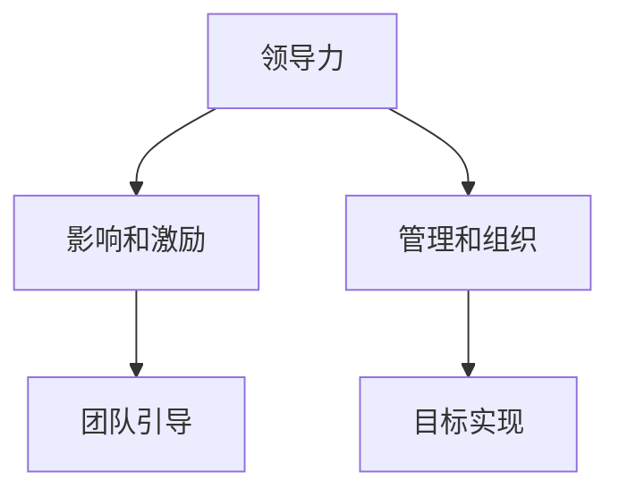
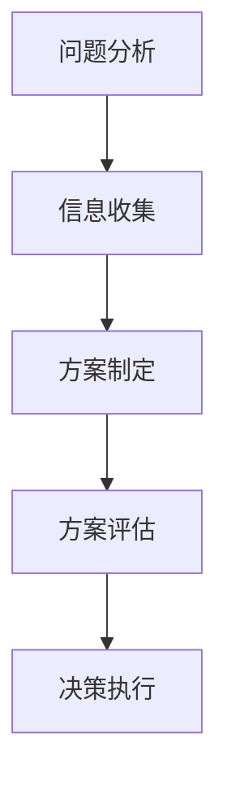

                 

### 文章标题

# 《领导力训练营：49天从新手到高手》

### 关键词

- **领导力**
- **训练营**
- **新手到高手**
- **49天**
- **技能提升**
- **实践案例**

### 摘要

本文旨在通过《领导力训练营：49天从新手到高手》这一主题，为广大读者提供一套系统、高效的领导力学习路径。文章将详细阐述领导力的核心概念、关键技能，并通过实际案例分析和实战演练，帮助新手快速成长为领导力高手。全文分为七个章节，涵盖从基础理论到高级技巧的全方位内容，旨在为读者提供清晰、实用的指导。

### 引言

在当今快速变化的商业环境中，领导力已经成为企业和组织成功的关键因素。无论是在企业内部的管理层，还是在创业团队中，领导力都是推动团队发展和实现目标的核心动力。然而，领导力的提升并非一朝一夕之事，它需要系统性的学习和不断的实践。

《领导力训练营：49天从新手到高手》这本书正是为了解决这一问题而诞生的。它通过49天的学习计划，从新手引导到高手，涵盖了领导力的基础理论、实践技巧、案例分析等各个方面。本文将根据这一书的结构，逐步解析每一个章节，帮助读者更好地理解和应用领导力。

#### 第1章：领导力基础

领导力并不是一个模糊的概念，它有着明确的定义和理论基础。在这一章中，我们将介绍领导力的核心概念，包括领导力与管理的区别、领导者的角色与职责等。

首先，领导力与管理的区别是领导力理论中的基础概念。领导力强调的是通过影响和激励来引导团队，而管理则更侧重于通过规划和组织来实现目标。这一点可以用Mermaid流程图来表示：



通过这个流程图，我们可以清晰地看到领导力和管理在目标实现过程中的不同作用。

接下来，领导者的角色与职责是领导力基础中不可或缺的一部分。领导者不仅需要具备领导能力，还需要承担起团队发展、员工激励等方面的责任。以下是领导者的主要角色与职责：

1. **愿景设定**：领导者需要明确团队的目标和愿景，并将其传达给团队成员。
2. **决策制定**：在团队面临决策时，领导者需要提供清晰的指导和决策。
3. **团队建设**：领导者需要建立和谐的团队氛围，促进团队成员之间的沟通和协作。
4. **员工激励**：领导者需要激励团队成员，提高他们的工作积极性和创造力。

#### 第2章：领导力技能提升

在掌握了领导力的基础理论后，提升领导力技能是进一步发展的关键。在这一章中，我们将探讨领导力提升的关键技能，包括沟通技巧、团队管理和决策制定等。

首先，沟通技巧是领导力中至关重要的一环。有效的沟通不仅能提高团队的协作效率，还能增强团队成员之间的信任和理解。以下是沟通技巧的核心要点：

1. **倾听**：倾听是有效沟通的基础，领导者需要学会倾听团队成员的想法和需求。
2. **表达**：领导者需要清晰、明确地表达自己的观点和期望。
3. **反馈**：领导者需要给予团队成员及时的反馈，以促进他们的成长和改进。

沟通技巧的提升可以通过以下伪代码来详细说明：

```plaintext
function effectiveCommunication() {
    // 倾听
    listenToTeamMembers()

    // 表达
    clearlyExpressExpectations()

    // 反馈
    provideTimelyFeedback()
}
```

接下来，团队管理是领导力提升中的另一个关键领域。一个高效的团队需要良好的管理，而领导者需要承担起团队管理的责任。以下是团队管理的关键步骤：

1. **明确目标**：确保团队所有成员都明确团队的目标和期望。
2. **分配任务**：根据团队成员的特长和兴趣，合理分配任务。
3. **监督进度**：定期检查任务进度，确保团队按时完成目标。
4. **提供支持**：在团队成员遇到困难时，提供必要的支持和帮助。

团队管理的伪代码如下：

```plaintext
function teamManagement() {
    // 明确目标
    defineTeamGoals()

    // 分配任务
    allocateTasks()

    // 监督进度
    checkTaskProgress()

    // 提供支持
    provideSupport()
}
```

最后，决策制定是领导者必须掌握的技能之一。有效的决策能帮助团队快速应对挑战，实现目标。以下是决策制定的核心步骤：

1. **问题分析**：明确团队面临的问题和挑战。
2. **信息收集**：收集与问题相关的信息。
3. **方案制定**：制定多个可能的解决方案。
4. **方案评估**：评估每个方案的优缺点。
5. **决策执行**：选择最优方案并执行。

决策制定的伪代码如下：

```plaintext
function decisionMaking() {
    // 问题分析
    analyzeProblem()

    // 信息收集
    collectInformation()

    // 方案制定
    formulateSolutions()

    // 方案评估
    evaluateSolutions()

    // 决策执行
    executeBestSolution()
}
```

#### 第3章：领导力实践

理论是基础，但实践是检验真理的唯一标准。在这一章中，我们将探讨领导力在实际中的应用，包括实践中的挑战、应对策略等。

首先，领导力实践中的挑战是不可避免的。领导者可能会面临团队冲突、员工流失、资源限制等问题。以下是应对这些挑战的策略：

1. **团队冲突**：通过有效的沟通和冲突解决技巧，减少团队内部的冲突。
2. **员工流失**：通过提高员工满意度和工作环境，减少员工流失率。
3. **资源限制**：通过优化资源配置和提升团队效率，应对资源限制。

以下是一个解决团队冲突的示例：

```plaintext
function resolveTeamConflict() {
    // 沟通
    facilitateCommunication()

    // 理解立场
    understandStands()

    // 寻求共识
    seekCommonGround()

    // 冲突解决
    resolveConflict()
}
```

#### 第4章：案例分析

案例分析是理解领导力实践效果的重要方式。在这一章中，我们将通过真实案例展示领导力的应用，并进行分析。

首先，我们来看一个企业变革的案例。这家企业因为市场变化，需要进行组织架构的调整。以下是这个案例的分析：

1. **问题分析**：企业面临市场变化，需要快速调整以适应新环境。
2. **信息收集**：收集市场数据，分析竞争对手的策略。
3. **方案制定**：制定新的组织架构和运营策略。
4. **方案评估**：评估新方案的可行性。
5. **决策执行**：实施新方案，并进行监督和调整。

通过这个案例，我们可以看到领导力在企业变革中的关键作用。以下是案例分析的Mermaid流程图：



#### 第5章：成长与反思

领导力不仅是一种技能，更是一种持续成长的过程。在这一章中，我们将探讨领导力的成长过程和方法，以及如何进行反思和改进。

首先，领导力的成长需要不断的实践和学习。以下是领导力成长的核心要素：

1. **持续学习**：领导者需要不断学习新的知识和技能。
2. **实践经验**：通过实践，领导者能更好地理解和应用理论。
3. **反馈与改进**：领导者需要接受反馈，并不断改进自己的领导风格。

以下是一个领导力成长过程的示例：

```plaintext
function leadershipGrowth() {
    // 持续学习
    continuousLearning()

    // 实践经验
    practicalExperience()

    // 反馈与改进
    feedbackAndImprovement()
}
```

#### 第6章：高级领导力技巧

在掌握了基本的领导力技能后，高级领导力技巧能进一步提升领导者的能力和影响力。在这一章中，我们将介绍高级领导力技巧，包括战略规划、变革管理、企业文化塑造等。

首先，战略规划是高级领导力技巧中的重要部分。一个成功的领导者需要具备战略规划的能力，以确保团队和企业的长期发展。以下是战略规划的核心步骤：

1. **环境分析**：分析企业外部环境和内部资源。
2. **目标设定**：设定明确、可行的长期和短期目标。
3. **策略制定**：制定实现目标的策略和行动计划。
4. **执行监督**：确保策略和行动计划的执行。

战略规划的伪代码如下：

```plaintext
function strategicPlanning() {
    // 环境分析
    analyzeBusinessEnvironment()

    // 目标设定
    setClearGoals()

    // 策略制定
    formulateStrategies()

    // 执行监督
    monitorExecution()
}
```

接下来，变革管理是高级领导力技巧中的另一个重要领域。在快速变化的商业环境中，领导者需要具备变革管理的能力，以应对外部挑战和内部变革。以下是变革管理的核心步骤：

1. **需求识别**：识别变革的需求和目标。
2. **计划制定**：制定详细的变革计划。
3. **沟通协调**：确保团队成员理解变革的意义和目标。
4. **执行监控**：确保变革计划的执行。

变革管理的伪代码如下：

```plaintext
function changeManagement() {
    // 需求识别
    identifyChangeNeeds()

    // 计划制定
    formulateChangePlan()

    // 沟通协调
    communicateAndCoordinate()

    // 执行监控
    monitorExecution()
}
```

最后，企业文化塑造是高级领导力技巧中的关键部分。一个积极、健康的企业文化能提升团队凝聚力，增强企业竞争力。以下是企业文化塑造的核心步骤：

1. **价值观设定**：明确企业的核心价值观。
2. **行为规范**：制定与价值观相符的行为规范。
3. **文化建设**：通过活动和措施，推广企业文化。
4. **监督执行**：确保企业文化在团队中的落实。

企业文化塑造的伪代码如下：

```plaintext
function organizationalCulture() {
    // 价值观设定
    defineCoreValues()

    // 行为规范
    establishBehaviorStandards()

    // 文化建设
    promoteOrganizationalCulture()

    // 监督执行
    monitorExecution()
}
```

#### 第7章：总结与展望

在《领导力训练营：49天从新手到高手》的最后，我们将对全书进行总结，并展望领导力的发展趋势。

首先，领导力是一种可以通过学习和实践不断提升的技能。通过这本书的系统性学习，读者可以从新手成长为高手，掌握领导力的核心概念和关键技能。

其次，领导力的发展趋势表明，未来的领导者需要具备更加全面的素质和能力。这包括战略规划、变革管理、企业文化塑造等方面的能力。同时，领导者还需要具备适应快速变化的商业环境的能力，以及在全球化和数字化时代中的领导力。

总之，领导力不仅是一种技能，更是一种艺术。通过不断的实践和学习，每一位领导者都能在领导力的道路上不断前行，为团队和企业带来更大的价值。

### 作者信息

- 作者：AI天才研究院/AI Genius Institute & 禅与计算机程序设计艺术 /Zen And The Art of Computer Programming

---

在本文中，我们详细解析了《领导力训练营：49天从新手到高手》的各个章节，从领导力的基础理论到高级技巧，再到实战案例和反思，全面展示了领导力提升的完整路径。通过伪代码、Mermaid流程图和实际案例的分析，我们不仅帮助读者理解了领导力的核心概念和原理，还提供了实用的技巧和策略。

我们鼓励读者在学习和应用领导力时，不仅要注重理论的学习，更要通过实践来不断提升自己的领导力。只有在实际的工作和团队管理中，才能真正体会到领导力的价值和影响力。

希望本文能对广大读者在领导力提升的道路上提供有益的指导和启示。让我们一起，从新手到高手，迈向卓越的领导力。

