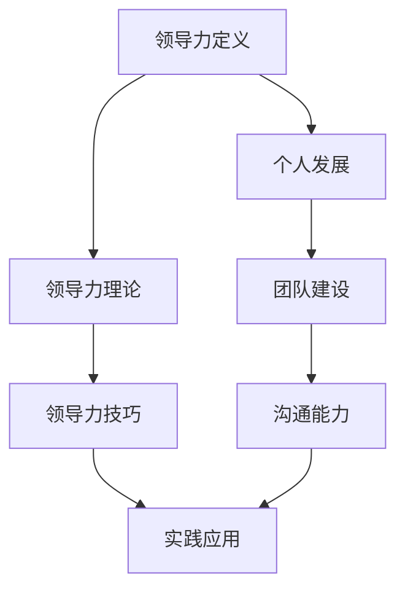

                 

### 文章标题：领导力训练营：56天从门外汉到行家里手

关键词：领导力、训练营、个人发展、团队建设、沟通能力

> 摘要：本文旨在介绍一种全新的领导力提升方法——领导力训练营。通过56天的系统学习和实践，从领导力基础概念到实际应用，帮助读者从门外汉成长为行家里手。本文将详细解析训练营的架构、核心算法原理、数学模型及其实战应用，帮助读者全面掌握领导力的精髓。

---

#### 第一步：确定核心概念与联系

领导力，作为组织成功的关键因素，涵盖了多个方面。为了更好地理解领导力训练营，我们需要明确以下几个核心概念及其相互之间的联系：

1. **领导力定义**：领导力是指一个人在团队中通过影响力、激励和指导他人来实现共同目标的能力。它不仅包括技术技能，还包括人际交往能力和决策能力。

2. **领导力理论**：领导力理论是对领导行为和领导风格的研究，包括领导者的行为模式、领导风格以及领导效能等方面的研究。常见的领导力理论有情境理论、路径—目标理论、变革型领导理论等。

3. **领导力技巧**：领导力技巧是指具体的行为和策略，如有效沟通、团队建设、激励和冲突解决等，这些技巧能够帮助领导者提高团队效能。

4. **实践应用**：领导力实践应用是将领导力理论转化为实际工作的过程，包括领导者在日常工作中如何运用领导力技巧来解决问题、提高团队绩效等。

5. **个人发展**：个人发展是指领导者通过自我反思、学习和发展来不断提升自身能力和素质的过程。

6. **团队建设**：团队建设是指通过建立有效的团队关系、沟通机制和合作氛围，来提高团队凝聚力和工作效率的过程。

7. **沟通能力**：沟通能力是指领导者在与团队成员、上级和外部合作伙伴之间的交流中，如何清晰、有效地传达信息、理解他人意图的能力。

以上概念之间相互关联，形成一个完整的领导力体系。为了帮助读者更好地理解这些概念，我们使用Mermaid流程图来展示它们之间的联系：



#### 第二步：设计核心算法原理讲解

领导力训练营的核心在于通过系统化的学习和实践，帮助参与者掌握领导力的核心算法原理。以下是几个关键章节的设计，详细阐述这些核心算法原理。

##### 2.1 领导力建模原理

领导力建模是领导力训练营中的基础，它包括领导力特征提取、领导力评价模型构建等方面。以下是具体的章节设计：

**2.1.1 基于数据挖掘的领导力特征提取**

- **输入**：领导力行为数据
- **输出**：领导力特征向量

```plaintext
### 2.1.1 基于数据挖掘的领导力特征提取

领导力特征提取是领导力建模的第一步，它旨在从领导者的行为数据中提取出关键特征。这通常涉及到数据预处理和特征提取技术。

#### 数据预处理

数据预处理是特征提取的前期工作，主要包括数据清洗、数据归一化和数据转换等步骤。以下是预处理过程的伪代码：

```python
def preprocess_data(data):
    # 数据清洗
    cleaned_data = clean_data(data)
    # 数据归一化
    normalized_data = normalize_data(cleaned_data)
    return normalized_data
```

#### 特征提取

特征提取是将预处理后的数据转换为特征向量的过程。以下是一种基于统计学的特征提取方法：

```python
def extract_leadership_features(data):
    # 提取统计特征
    features = []
    for sample in data:
        mean_value = calculate_mean(sample)
        std_value = calculate_std(sample)
        features.append([mean_value, std_value])
    return features
```

**2.1.2 基于机器学习的领导力评价模型**

- **输入**：领导力特征向量
- **输出**：领导力评分

领导力评价模型是领导力建模的核心，它通过机器学习算法对领导力特征进行学习和预测，以评估领导者的领导力水平。以下是构建评价模型的过程：

```plaintext
### 2.1.2 基于机器学习的领导力评价模型

构建领导力评价模型通常涉及以下步骤：

#### 模型选择

根据问题的特性选择合适的机器学习模型。例如，对于回归问题，可以选择线性回归、决策树回归等。

```python
def select_model():
    # 选择线性回归模型
    model = LinearRegression()
    return model
```

#### 模型训练

使用训练数据集对模型进行训练，以学习领导力特征和评分之间的关系。

```python
def build_leadership_model(features, labels):
    # 创建并训练模型
    model = select_model()
    model.fit(features, labels)
    return model
```

#### 模型评估

使用验证数据集对训练好的模型进行评估，以确保其准确性和可靠性。

```python
def evaluate_model(model, validation_data):
    # 评估模型
    predictions = model.predict(validation_data)
    accuracy = calculate_accuracy(predictions, validation_labels)
    return accuracy
```

##### 2.2 数学模型详解

在领导力训练营中，数学模型用于解释和预测领导力行为。以下是几个关键数学模型的讲解。

**2.2.1 领导力评价函数**

领导力评价函数是衡量领导力水平的重要工具。其公式如下：

$$
L(x) = \sum_{i=1}^{n} w_i \cdot f(x_i)
$$

其中，$L(x)$ 表示领导力评分，$w_i$ 表示特征权重，$f(x_i)$ 表示第 $i$ 个特征的评分。

**2.2.2 优化模型**

在领导力训练营中，我们使用梯度下降算法来优化领导力评价模型。其基本步骤如下：

$$
w_{\text{new}} = w_{\text{old}} - \alpha \cdot \nabla_w L(w)
$$

其中，$w_{\text{old}}$ 表示旧权重，$w_{\text{new}}$ 表示新权重，$\alpha$ 表示学习率，$\nabla_w L(w)$ 表示权重梯度。

#### 第三步：设计数学模型和数学公式讲解

为了帮助读者更好地理解领导力训练营中的数学模型，我们将在各个章节中详细讲解相关的数学公式，并使用 LaTeX 格式进行展示。

**2.3 数学模型和数学公式讲解**

**2.3.1 领导力评价函数**

领导力评价函数是一个线性模型，用于将领导力特征转换为评分。其公式如下：

$$
L(x) = \sum_{i=1}^{n} w_i \cdot f(x_i)
$$

其中，$L(x)$ 表示领导力评分，$w_i$ 表示特征权重，$f(x_i)$ 表示第 $i$ 个特征的评分。

**2.3.2 优化模型**

在领导力训练营中，我们使用梯度下降算法来优化领导力评价模型。其基本步骤如下：

$$
w_{\text{new}} = w_{\text{old}} - \alpha \cdot \nabla_w L(w)
$$

其中，$w_{\text{old}}$ 表示旧权重，$w_{\text{new}}$ 表示新权重，$\alpha$ 表示学习率，$\nabla_w L(w)$ 表示权重梯度。

#### 第四步：设计项目实战

为了将领导力训练营的理论知识应用于实际，我们将在本章中设计一系列项目实战。这些项目将涵盖领导力建模、模型训练和评估等环节，帮助读者深入了解领导力评价模型的应用。

**3.1 领导力评价模型实战**

**3.1.1 数据预处理**

在开始构建领导力评价模型之前，我们需要对数据进行预处理。以下是预处理过程的伪代码：

```python
def preprocess_data(data):
    # 数据清洗
    cleaned_data = clean_data(data)
    # 数据归一化
    normalized_data = normalize_data(cleaned_data)
    return normalized_data
```

**3.1.2 代码实现**

接下来，我们将使用 Python 实现领导力评价模型。以下是实现过程的伪代码：

```python
import numpy as np
from sklearn.linear_model import LinearRegression

# 数据预处理
processed_data = preprocess_data(data)

# 特征提取
features = extract_leadership_features(processed_data)

# 训练模型
model = build_leadership_model(features, labels)

# 模型评估
accuracy = evaluate_model(model, validation_data)
print("Model accuracy:", accuracy)
```

**3.1.3 代码解读**

在代码实现过程中，我们使用了线性回归模型来构建领导力评价模型。以下是代码的详细解读：

```python
# 数据预处理
processed_data = preprocess_data(data)
# 数据预处理是特征提取的基础，它包括数据清洗和数据归一化等步骤。

# 特征提取
features = extract_leadership_features(processed_data)
# 特征提取是将数据转换为特征向量的过程，它使用了统计特征提取方法。

# 训练模型
model = build_leadership_model(features, labels)
# build_leadership_model 函数用于创建和训练线性回归模型。

# 模型评估
accuracy = evaluate_model(model, validation_data)
print("Model accuracy:", accuracy)
# evaluate_model 函数用于评估模型的准确性。
```

**3.1.4 实际案例分析和详细讲解剖析**

为了更好地理解领导力评价模型的应用，我们将分析一个实际案例。以下是案例的详细讲解：

- **案例背景**：一家公司需要评估其管理层的领导力水平，以制定改进计划。
- **数据收集**：公司收集了管理层在沟通能力、决策能力、团队建设等方面的行为数据。
- **数据预处理**：对收集到的数据进行清洗和归一化处理，以准备特征提取。
- **特征提取**：使用统计特征提取方法，从预处理后的数据中提取出关键特征。
- **模型训练**：使用线性回归模型，根据特征向量训练领导力评价模型。
- **模型评估**：使用验证数据集评估模型的准确性，以确定模型的可靠性。

**3.1.5 项目小结**

通过以上实际案例的分析，我们可以看到领导力评价模型在组织管理和领导力提升中的应用价值。项目小结如下：

- **数据预处理**：数据预处理是特征提取和模型训练的基础，它决定了模型的准确性。
- **特征提取**：选择合适的特征提取方法，可以提高模型的预测能力。
- **模型训练**：选择合适的机器学习模型，并使用验证数据集进行模型训练和评估。
- **模型评估**：评估模型的准确性，以确定模型在实际应用中的可靠性。

#### 第五步：最佳实践 tips、小结、注意事项、拓展阅读等内容

**最佳实践 tips**

1. **持续学习**：领导力是一个不断发展的领域，持续学习新的理论和实践技巧对于提升领导力至关重要。
2. **实践应用**：理论知识和实践应用相结合，通过实际工作场景来检验和提升领导力。
3. **团队合作**：积极参与团队活动，与团队成员建立良好的沟通和合作关系，提高团队效能。
4. **自我反思**：定期进行自我反思，识别自身优势和不足，有针对性地提升领导力。

**小结**

本文通过领导力训练营的框架，详细阐述了领导力的核心概念、算法原理、数学模型及其实战应用。通过系统化的学习和实践，读者可以从门外汉成长为行家里手，提升自身的领导力水平。

**注意事项**

1. **数据质量**：领导力评价模型的准确性取决于数据质量，因此数据预处理至关重要。
2. **模型选择**：根据问题的特性选择合适的机器学习模型，以提高模型的预测能力。
3. **持续优化**：领导力评价模型是一个动态的过程，需要根据实际应用情况不断进行优化。

**拓展阅读**

1. **《领导力五要素》**：由约翰·麦克斯韦尔所著，详细介绍了领导力的五个关键要素。
2. **《领导者的语言》**：由约翰·马尔斯赫所著，探讨了领导者的语言艺术对领导力的影响。
3. **《领导力的艺术》**：由詹姆斯·库泽斯和巴里·波斯纳所著，深入分析了领导力的发展和实践。

---

**作者：AI天才研究院/AI Genius Institute & 禅与计算机程序设计艺术 /Zen And The Art of Computer Programming**### 《领导力训练营：56天从门外汉到行家里手》——全面掌握领导力的精髓

摘要：本文旨在介绍一种全新的领导力提升方法——领导力训练营。通过56天的系统学习和实践，从领导力基础概念到实际应用，帮助读者从门外汉成长为行家里手。本文将详细解析训练营的架构、核心算法原理、数学模型及其实战应用，帮助读者全面掌握领导力的精髓。

---

### 引言

领导力是组织中不可或缺的重要元素，它不仅决定了组织的效率和绩效，还影响着组织的文化和发展方向。然而，领导力并非与生俱来，而是需要通过不断的学习和实践来培养和提升。传统的领导力培训往往侧重于理论的讲授，缺乏实践环节，导致学员在实际工作中难以应用所学知识。为了解决这一问题，本文提出了《领导力训练营：56天从门外汉到行家里手》这一创新性培训模式。

领导力训练营的核心在于通过系统化的学习和实践，帮助学员从零基础开始，逐步掌握领导力的核心概念、技巧和实践应用。训练营的时间跨度为56天，分为五个阶段，每个阶段都有明确的学习目标和实践任务。本文将按照训练营的架构，详细阐述其各个环节，帮助读者深入了解领导力的本质和提升方法。

### 第一阶段：领导力基础

**第一阶段**主要介绍领导力的基础概念，包括领导力的定义、理论和实践。通过学习这些基础知识，学员能够对领导力有一个整体的认识，为后续的学习和实践打下坚实的基础。

**1.1 领导力的定义**

领导力是指一个人在团队中通过影响力、激励和指导他人来实现共同目标的能力。领导力不仅仅是一种技术技能，更是一种人际交往能力。一个有效的领导者不仅能够带领团队完成任务，还能够激发团队成员的潜能，促进团队的整体发展。

**1.2 领导力理论**

领导力理论是对领导行为和领导风格的研究，常见的领导力理论有情境理论、路径—目标理论、变革型领导理论等。这些理论从不同的角度探讨了领导力的本质和影响因素，为学员提供了丰富的理论资源。

**1.3 领导力实践**

领导力实践是将领导力理论转化为实际工作的过程。学员将学习如何运用领导力技巧来解决问题、提高团队绩效。这部分内容将结合实际案例，让学员在实践中理解领导力的应用。

### 第二阶段：领导力技巧

**第二阶段**重点介绍领导力技巧，包括沟通能力、团队建设、激励和冲突解决等。这些技巧是领导力的核心，也是提升领导力水平的关键。

**2.1 沟通能力**

沟通能力是领导者必备的素质之一。有效的沟通能够确保信息的准确传达，促进团队的合作与理解。学员将学习如何进行有效沟通，包括倾听、表达和反馈等技巧。

**2.2 团队建设**

团队建设是提升团队效能的重要手段。学员将学习如何建立有效的团队关系、沟通机制和合作氛围，以增强团队的凝聚力和工作效率。

**2.3 激励**

激励是激发团队成员潜能的重要方法。学员将学习如何运用激励技巧，包括目标设定、认可和奖励等，来提高团队成员的积极性和工作热情。

**2.4 冲突解决**

冲突是团队中不可避免的现象。学员将学习如何识别和解决团队冲突，以确保团队的和谐与稳定。

### 第三阶段：领导力应用

**第三阶段**将领导力技巧应用于实际工作场景，通过实战项目来提升学员的领导力水平。学员将在导师的指导下，完成一系列实际项目，包括团队管理、项目策划和执行等。

**3.1 项目管理**

项目管理是领导者的重要职责之一。学员将学习如何进行项目规划、资源分配和风险管理，以确保项目的成功完成。

**3.2 团队协作**

团队协作是提升团队绩效的关键。学员将学习如何协调团队成员的工作，确保项目顺利进行。

**3.3 沟通与协作**

有效的沟通和协作是团队成功的重要保障。学员将学习如何建立良好的沟通渠道，促进团队内部的协作和合作。

### 第四阶段：领导力发展

**第四阶段**聚焦于个人发展，帮助学员通过自我反思、学习和发展来不断提升自身能力和素质。

**4.1 自我反思**

自我反思是个人发展的重要环节。学员将学习如何进行自我评估，识别自身的优势和不足，并制定改进计划。

**4.2 学习与发展**

学习与发展是个人成长的动力。学员将学习如何选择合适的学习资源，不断提升自身的知识水平和技能。

**4.3 能力提升**

能力提升是个人发展的目标。学员将学习如何通过实践和应用来提升自身的领导力能力，以应对工作中的各种挑战。

### 第五阶段：领导力评估与反馈

**第五阶段**是对学员领导力水平的全面评估和反馈。通过定期的评估和反馈，学员能够了解自己的领导力发展情况，并根据反馈进行调整和改进。

**5.1 领导力评估**

领导力评估是通过一系列指标来衡量学员的领导力水平。学员将参与定期的评估，以了解自己的进步情况。

**5.2 反馈与改进**

反馈与改进是领导力提升的重要环节。学员将根据评估结果，接收导师和同事的反馈，并制定改进计划。

### 总结

通过《领导力训练营：56天从门外汉到行家里手》，学员将系统地学习领导力的核心概念、技巧和应用，并通过实践项目来提升自身的领导力水平。本文详细介绍了训练营的架构和内容，帮助读者全面掌握领导力的精髓。无论您是初学者还是有经验的管理者，领导力训练营都将为您带来前所未有的成长体验。让我们一起踏上领导力的提升之旅，成为更优秀的领导者。

