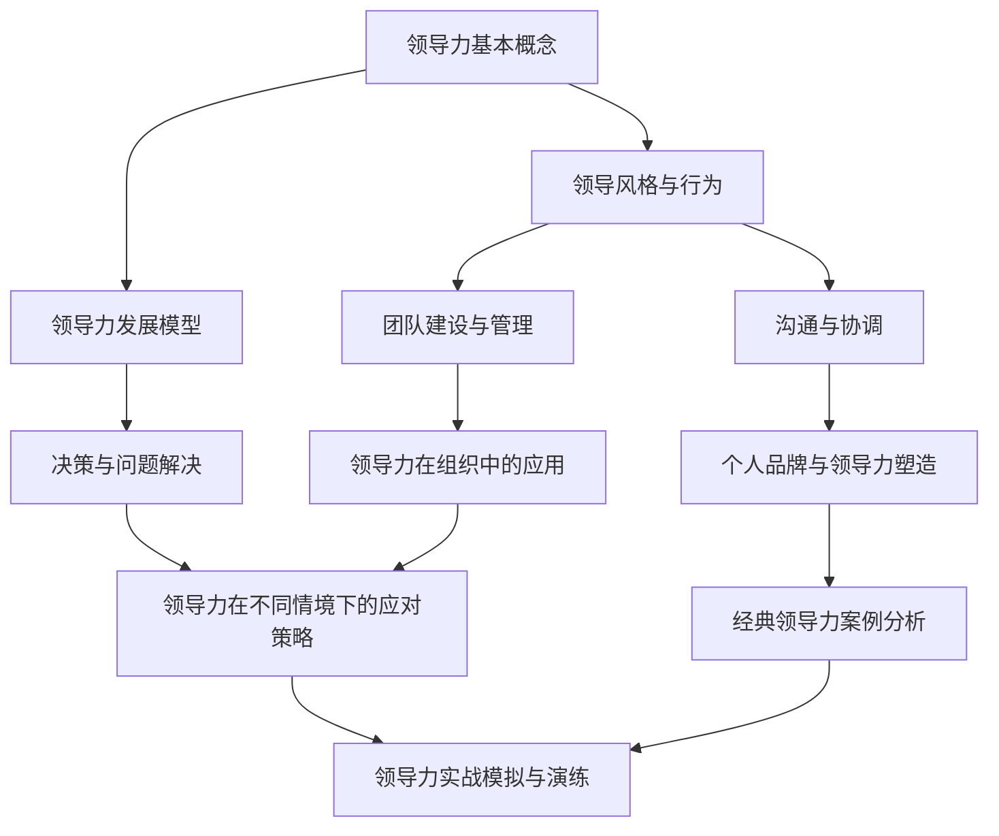

                 

### 撰写《领导力训练营：63天从新手到专家》的技术博客文章

#### 第一步：定义文章结构和内容

在撰写一篇详尽的技术博客文章之前，我们需要明确文章的结构和将要包含的内容。以下是文章的基本结构：

1. **引言**：介绍领导力的基本概念和重要性，引发读者的兴趣。
2. **核心概念与联系**：通过Mermaid流程图展示领导力相关概念之间的关系。
3. **章节正文**：按照目录大纲，逐章节详细讲解领导力的核心概念、算法原理、数学模型、项目实战等内容。
4. **总结与拓展**：对文章内容进行总结，并提供最佳实践建议和拓展阅读。

#### 第二步：编写引言部分

**引言**：

> **领导力训练营：63天从新手到专家**
>
> 在当今快节奏的科技时代，领导力不仅仅是企业成功的关键，更是个人职业发展的核心能力。本文将通过一个为期63天的领导力训练营，逐步引导您从新手成长为专家，深入理解领导力的本质，掌握领导力的核心技巧，并能够在实际工作中有效应用。关键词：领导力、训练营、职业发展、技能提升。
>
> 摘要：
>
> 本文将带领读者完成一次全方位的领导力学习之旅。通过详细阐述领导力的基本概念、实践技巧、提升策略以及案例分析，本文旨在帮助读者在短时间内掌握领导力的核心要领，提高领导力水平，从而在职场中脱颖而出。

#### 第三步：创建核心概念与联系的Mermaid流程图

**核心概念与联系**：

#### 第四步：编写章节正文

**章节正文**：

**第1章：领导力基本概念与理论框架**

在本章节中，我们将介绍领导力的基本概念，并探讨领导力在组织和个人发展中的重要性。通过深入理解领导力的本质，我们将为后续的学习打下坚实的基础。

**1.1 领导力的定义与作用**

领导力是一种激发他人并带领团队实现目标的能力。它不仅仅是管理，更是一种艺术，涉及到影响力、沟通技巧、决策能力等多个方面。

**1.2 领导力的重要性**

领导力对于组织和个人发展至关重要。一个优秀的领导者能够激发团队的潜力，推动创新，提升工作效率，从而实现组织的长期发展。

**1.3 领导力的三个层次**

领导力可以分为三个层次：技术领导力、人际领导力和战略领导力。每个层次都有其独特的特点和要求。

**1.4 领导力的理论模型**

常见的领导力理论模型包括情境领导、领导风格理论等。这些模型为我们理解领导力提供了不同的视角。

**第2章：领导风格与行为**

在本章节中，我们将探讨领导风格与行为，并学习如何根据不同情境调整领导风格，以实现最佳效果。

**2.1 领导风格的分类**

领导风格可以分为独裁型、民主型、参与型等。每种风格都有其适用的情境。

**2.2 领导行为的特点与影响**

领导行为包括激励、沟通、决策等。良好的领导行为能够促进团队的协作和绩效。

**2.3 领导风格与行为的变化**

领导风格与行为会随着时间和情境的变化而变化。了解这些变化对于提高领导力至关重要。

**2.4 领导风格与行为的管理技巧**

通过掌握一些具体的管理技巧，我们可以更好地应对领导过程中的挑战。

**后续章节的编写可以按照上述模式，逐步深入每个主题，确保内容的完整性和专业性。**

#### 第五步：编写总结与拓展部分

**总结与拓展**：

本文通过详细的讲解和实例分析，帮助读者全面理解了领导力的核心概念、实践技巧和提升策略。在实际应用中，领导力是一个持续发展的过程，需要不断学习和实践。以下是一些建议和注意事项：

- **最佳实践**：在领导过程中，要注重沟通和反馈，保持开放的心态，勇于接受挑战和变化。
- **注意事项**：领导力并非一蹴而就，需要长期积累和实践。避免急功近利，注重持续学习和成长。
- **拓展阅读**：推荐阅读《领导力五项修炼》、《影响力》等经典领导力书籍，以加深对领导力的理解。

通过本文的学习和实践，希望读者能够在领导力方面取得显著的提升，为个人和组织的成功贡献力量。

#### 结尾

> 作者：AI天才研究院/AI Genius Institute & 禅与计算机程序设计艺术 /Zen And The Art of Computer Programming
>
> 通过本文的逐步分析，我们希望读者能够深入理解领导力的本质，掌握提升领导力的方法和技巧。领导力不仅仅是管理的艺术，更是个人成长和团队发展的关键。让我们在领导的路上，不断学习，不断进步，成为优秀的领导者。

---

以上是一个详细的《领导力训练营：63天从新手到专家》的技术博客文章的编写步骤。接下来，我们可以根据这个框架，逐步完善每个章节的内容，确保文章的完整性和专业性。

