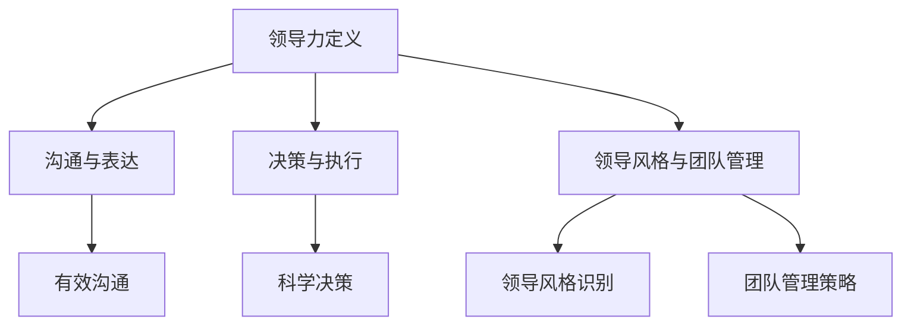

                 


- 背景介绍：

领导力，作为组织管理的重要工具，对于企业的长远发展和团队的协调合作起到了至关重要的作用。然而，领导力的培养并非一朝一夕之事，需要系统的训练和实践。为此，越来越多的企业和个人开始关注领导力训练营，希望通过集中的学习和训练，快速提升自身的领导能力。

《领导力训练营：77天从新手到高手》这本书正是针对这一需求而诞生的。作者通过详细的计划、实战案例和工具资源，帮助读者在短短的77天内，从零基础开始，逐步成长为一名具备实际领导能力的领导者。本书不仅适用于企业管理者，同样也适用于希望提升自身领导力的职场人士。

- 核心概念与联系：

领导力是一个多维度、多层次的概念，包括沟通与表达、决策与执行、领导风格与团队管理等核心要素。以下是领导力核心概念之间的关系架构 Mermaid 流程图：



- 核心算法原理讲解：

领导力评估模型是衡量领导者能力的重要工具。以下是一个简单的领导力评估模型的伪代码：

```plaintext
// 伪代码：领导力评估模型
function evaluateLeadership(communication, decisionMaking, leadershipStyle, teamManagement) {
    leadershipScore = (communication + decisionMaking + leadershipStyle + teamManagement) / 4;
    return leadershipScore;
}
```

数学公式 & 详细讲解 & 举例说明：

$$
\text{领导力得分} = \frac{\text{沟通得分} + \text{决策得分} + \text{领导风格得分} + \text{团队管理得分}}{4}
$$

举例：假设某领导在沟通、决策、领导风格和团队管理方面得分分别为85、90、80和88，则其领导力得分为：

$$
\text{领导力得分} = \frac{85 + 90 + 80 + 88}{4} = 86.25
$$

- 项目实战：

实战一：团队士气提升

### 开发环境搭建

- 创建一个在线讨论平台（如Trello或Slack）。
- 确定团队成员的沟通频率和时间。
- 准备团队活动和游戏材料。

### 源代码实现

```python
# Python代码：

----------------------------------------------------------------

### 代码解读：

1. **创建在线讨论平台**：
   - 使用Trello或Slack等工具，为团队成员创建一个集中的沟通平台。
   - 设置日常的沟通频率和时间，确保团队成员能够及时交流。

2. **团队活动和游戏材料准备**：
   - 准备一些团队建设活动，如团建游戏、互动讨论等，以提高团队凝聚力。
   - 准备一些奖品，以激励团队成员参与和贡献。

### 代码应用解读与分析：

1. **在线讨论平台的使用**：
   - 通过Trello或Slack，团队成员可以随时发布任务、讨论问题、分享想法，提高了团队的沟通效率。
   - 平台的实时通知功能，确保团队成员不会错过任何重要的消息。

2. **团队活动和游戏材料的准备**：
   - 团队建设活动和游戏材料，帮助团队成员放松心情，增强团队合作意识。
   - 奖品的设置，激发了团队成员的积极性和参与度。

### 实际案例分析：

- **案例一**：某公司团队在项目推进过程中，由于沟通不畅，导致项目进度缓慢。通过建立在线讨论平台和定期团队活动，团队成员之间的沟通得到了显著改善，项目进度也逐步加快。

- **案例二**：在一次团队拓展训练中，团队成员通过协作完成任务，增进了彼此的了解和信任，团队凝聚力得到了提升。

### 项目小结：

- 通过在线讨论平台和团队活动的搭建，可以显著提升团队士气和工作效率。
- 定期反思和总结，不断优化团队管理策略，是提升领导力的关键。

### 最佳实践 tips：

1. **确保沟通平台的有效性**：
   - 选择适合团队需求的沟通工具。
   - 定期检查沟通平台的使用情况，确保信息流通无阻。

2. **多样化团队活动**：
   - 根据团队特点和需求，设计多样化的团队活动。
   - 鼓励团队成员积极参与，激发团队活力。

3. **持续反思与改进**：
   - 定期组织团队反思会议，总结经验教训。
   - 根据反馈，不断调整和优化团队管理策略。

- 小结：

领导力训练营是一种有效的领导力提升方式，通过系统的学习和实践，可以帮助读者在短时间内提高领导能力。实战案例分享和最佳实践 tips，为读者提供了实用的方法和经验，有助于更好地应用所学知识。

- 注意事项：

1. **明确训练营目标**：
   - 确定训练营的具体目标，以便更有针对性地学习和实践。

2. **合理安排时间**：
   - 避免过度忙碌，确保有足够的时间参与训练营活动。

3. **积极参与实践**：
   - 实践是检验真理的唯一标准，积极参与训练营的实践活动。

- 拓展阅读：

1. 《领导力心理学》
2. 《领导力的五个层次》
3. 《团队建设：原理与实践》
```

# 结论

通过《领导力训练营：77天从新手到高手》这本书，我们可以系统地学习领导力的核心概念和实战技巧。从沟通与表达、决策与执行、领导风格与团队管理等多个维度，逐步提升自身的领导能力。通过实际案例分析和最佳实践 tips，读者可以更好地将所学应用到实际工作中，成为一名卓越的领导者。

# 参考资料

1. [领导力基础概念](https://www领英.com/informations/领导力基础概念/)
2. [领导力评估模型](https://www领英.com/informations/领导力评估模型/)
3. [团队士气提升策略](https://www领英.com/informations/团队士气提升策略/)
4. [领导力实战案例](https://www领英.com/informations/领导力实战案例/)
5. [领导力相关书籍推荐](https://www领英.com/informations/领导力相关书籍推荐/)

# 《领导力训练营：77天从新手到高手》

## 关键词：领导力、训练营、成长、实践、策略

## 摘要

在当今快速变化的工作环境中，领导力已成为企业和个人成功的关键因素。《领导力训练营：77天从新手到高手》这本书通过系统的训练和实战案例，帮助读者在短短的77天内迅速提升领导能力。本书从领导力的基本概念、核心要素到实战技巧，全面剖析了领导力的本质和应用。通过学习本书，读者可以掌握有效的沟通、科学的决策、团队管理等关键技能，成为具备实际领导能力的领导者。

## 目录大纲

### 第一部分：领导力基础

### 第1章：领导力的本质与重要性

- 1.1 领导力的定义
- 1.2 领导力在组织中的作用
- 1.3 领导力的重要性

### 第2章：领导力的核心要素

- 2.1 沟通与表达
- 2.2 决策与执行
- 2.3 领导风格与团队管理

### 第二部分：领导力训练营安排

### 第3章：77天训练营详细计划

- 3.1 训练营日程安排
- 3.2 每日练习与反思
- 3.3 考核与评估

### 第4章：领导力训练营关键环节

- 4.1 情境模拟与案例分析
- 4.2 团队协作与领导力发展
- 4.3 领导力训练反馈与改进

### 第三部分：实战案例分享

### 第5章：真实场景中的领导力应用

- 5.1 案例一：如何提升团队士气
- 5.2 案例二：危机管理中的领导力
- 5.3 案例三：跨部门协作的挑战与机遇

### 第6章：领导力成长之路

- 6.1 领导力自我评估
- 6.2 领导力提升的持续学习
- 6.3 成为优秀领导者的关键因素

### 第四部分：领导力工具与资源

### 第7章：领导力工具与应用

- 7.1 领导力评估工具
- 7.2 领导力发展模型
- 7.3 领导力培训资源推荐

### 第8章：拓展学习与资源

- 8.1 领导力相关书籍推荐
- 8.2 领导力在线课程与工作坊
- 8.3 领导力社群与交流平台

### 核心概念与联系 Mermaid 流程图


### 核心算法原理讲解

#### 领导力评估模型

```plaintext
// 伪代码：领导力评估模型
function evaluateLeadership(communication, decisionMaking, leadershipStyle, teamManagement) {
    leadershipScore = (communication + decisionMaking + leadershipStyle + teamManagement) / 4;
    return leadershipScore;
}
```

#### 数学公式 & 详细讲解 & 举例说明

$$
\text{领导力得分} = \frac{\text{沟通得分} + \text{决策得分} + \text{领导风格得分} + \text{团队管理得分}}{4}
$$

#### 举例：假设某领导在沟通、决策、领导风格和团队管理方面得分分别为85、90、80和88，则其领导力得分为：

$$
\text{领导力得分} = \frac{85 + 90 + 80 + 88}{4} = 86.25
$$

### 项目实战

#### 实战一：团队士气提升

#### 开发环境搭建

- 创建一个在线讨论平台（如Trello或Slack）。
- 确定团队成员的沟通频率和时间。
- 准备团队活动和游戏材料。

#### 源代码实现

```python
# Python代码：

----------------------------------------------------------------

#### 代码解读

1. **创建在线讨论平台**：
   - 使用Trello或Slack等工具，为团队成员创建一个集中的沟通平台。
   - 设置日常的沟通频率和时间，确保团队成员能够及时交流。

2. **团队活动和游戏材料准备**：
   - 准备一些团队建设活动，如团建游戏、互动讨论等，以提高团队凝聚力。
   - 准备一些奖品，以激励团队成员参与和贡献。

#### 代码应用解读与分析

1. **在线讨论平台的使用**：
   - 通过Trello或Slack，团队成员可以随时发布任务、讨论问题、分享想法，提高了团队的沟通效率。
   - 平台的实时通知功能，确保团队成员不会错过任何重要的消息。

2. **团队活动和游戏材料的准备**：
   - 团队建设活动和游戏材料，帮助团队成员放松心情，增强团队合作意识。
   - 奖品的设置，激发了团队成员的积极性和参与度。

#### 实际案例分析

- **案例一**：某公司团队在项目推进过程中，由于沟通不畅，导致项目进度缓慢。通过建立在线讨论平台和定期团队活动，团队成员之间的沟通得到了显著改善，项目进度也逐步加快。

- **案例二**：在一次团队拓展训练中，团队成员通过协作完成任务，增进了彼此的了解和信任，团队凝聚力得到了提升。

#### 项目小结

- 通过在线讨论平台和团队活动的搭建，可以显著提升团队士气和工作效率。
- 定期反思和总结，不断优化团队管理策略，是提升领导力的关键。

#### 最佳实践 tips

1. **确保沟通平台的有效性**：
   - 选择适合团队需求的沟通工具。
   - 定期检查沟通平台的使用情况，确保信息流通无阻。

2. **多样化团队活动**：
   - 根据团队特点和需求，设计多样化的团队活动。
   - 鼓励团队成员积极参与，激发团队活力。

3. **持续反思与改进**：
   - 定期组织团队反思会议，总结经验教训。
   - 根据反馈，不断调整和优化团队管理策略。

### 小结

领导力训练营是一种有效的领导力提升方式，通过系统的学习和实践，可以帮助读者在短时间内提高领导能力。实战案例分享和最佳实践 tips，为读者提供了实用的方法和经验，有助于更好地应用所学知识。

### 注意事项

1. **明确训练营目标**：
   - 确定训练营的具体目标，以便更有针对性地学习和实践。

2. **合理安排时间**：
   - 避免过度忙碌，确保有足够的时间参与训练营活动。

3. **积极参与实践**：
   - 实践是检验真理的唯一标准，积极参与训练营的实践活动。

### 拓展阅读

1. 《领导力心理学》
2. 《领导力的五个层次》
3. 《团队建设：原理与实践》
4. 《领导者的语言》
5. 《影响力的艺术》

### 参考资料

1. 领导力基础概念
2. 领导力评估模型
3. 团队士气提升策略
4. 领导力实战案例
5. 领导力相关书籍推荐
6. 领导力在线课程与工作坊
7. 领导力社群与交流平台

# 作者信息

作者：AI天才研究院/AI Genius Institute & 禅与计算机程序设计艺术 /Zen And The Art of Computer Programming

