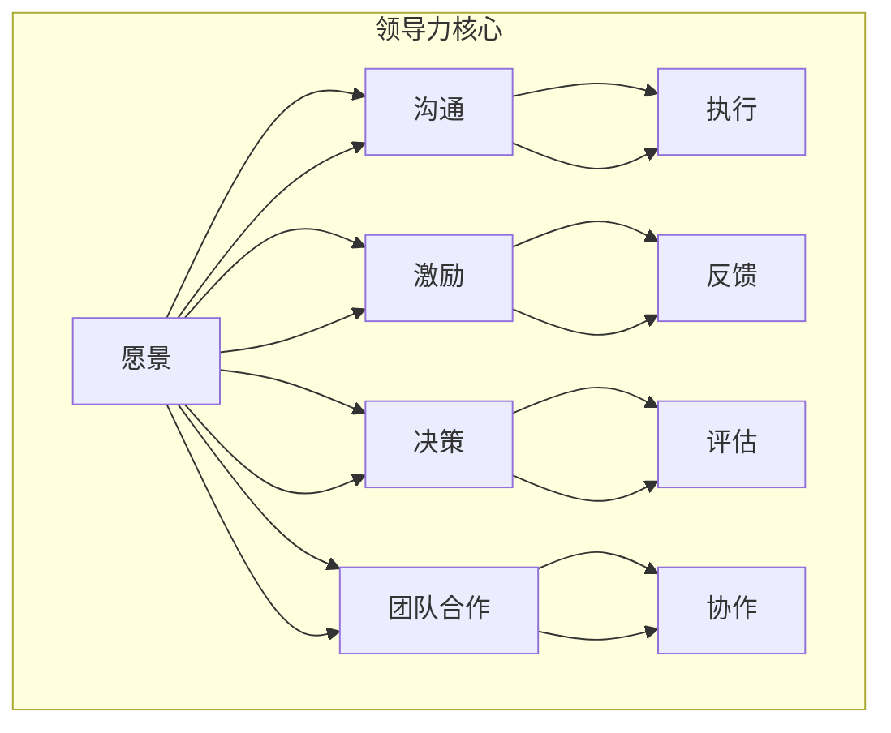

                 

## 文章标题：领导力训练营：7天从门外汉到行家里手

> 关键词：领导力、训练营、算法、数学模型、实战案例

> 摘要：本文旨在通过7天的系统训练，帮助读者从零开始，逐步掌握领导力的基本概念、核心算法和数学模型，并通过实际案例的实战演练，使读者能够将理论知识应用于实践，真正成为领导力领域的行家里手。

---

## 介绍领导力训练营的背景和目的

领导力是企业管理中至关重要的一环，它不仅影响着一个团队的绩效，更决定了企业能否在激烈的市场竞争中立于不败之地。然而，领导力并非一蹴而就，它需要系统的学习和实践，以及不断的反思和改进。为了帮助更多渴望提升领导力的职场人士，我们特别推出了《领导力训练营：7天从门外汉到行家里手》。

这个训练营旨在通过7天的系统学习，从基础概念到实战应用，帮助读者全面掌握领导力的各个方面。训练营的设计思路是“理论+实践+反思”，确保每一位参与者不仅能够理解领导力的基本原理，更能够将其有效地应用于实际工作中。

在这7天中，我们将首先介绍领导力的基本概念，帮助读者建立对领导力的全局认知。接着，我们将深入探讨领导力提升的核心算法原理，包括决策树和神经网络等。随后，我们将介绍领导力的数学模型，通过具体的数学公式和例子，帮助读者理解和应用这些模型。最后，我们将通过实际案例的实战演练，使读者能够在真实环境中运用所学知识，提升自己的领导力水平。

通过这7天的学习和实践，我们相信每一位参与者都将从门外汉成长为行家里手，能够在工作中更加自信、更加有效地发挥领导力。

---

## 第一天：领导力的基本概念与联系

### 1.1 领导力的定义与发展历程

领导力，顾名思义，是指一个人或组织在实现目标过程中，通过影响和激励他人来引导团队前进的能力。领导力的核心在于“影响”和“激励”，它不仅仅是对团队成员的指导和监督，更是一种建立信任、激发潜能和实现共同目标的艺术。

领导力的发展历程可以追溯到古代，早在古希腊和古罗马时期，领导者们就已经开始探索如何通过智慧和力量来统治国家。然而，现代领导力的概念则是在20世纪初期随着工业化和组织管理学的发展而逐渐形成的。20世纪初，管理学大师如泰勒和法约尔等人提出了科学管理理论，强调通过制度和流程来提高工作效率。随着管理学的进一步发展，领导力逐渐从管理中独立出来，成为研究重点。

在现代，领导力理论经历了多个阶段的发展。从早期的特质理论，到行为理论，再到近年来的情境理论和变革理论，领导力研究不断深化，形成了丰富多样的理论体系。

### 1.2 领导力的核心组成部分

领导力是一个多维度的概念，它包含多个核心组成部分。以下是领导力的几个关键要素：

1. **愿景**：愿景是领导力的灵魂，它为团队提供方向和目标。一个强大的愿景能够激发团队成员的热情和动力，使他们在实现共同目标的过程中保持一致。

2. **沟通**：有效的沟通是领导力的基础。领导需要通过清晰、准确的沟通来传达愿景和目标，同时也要倾听团队成员的意见和建议，建立良好的沟通渠道。

3. **激励**：激励是领导力的关键，它包括物质激励和精神激励。领导需要根据团队成员的不同需求，采用合适的激励方式，激发他们的积极性和创造力。

4. **决策**：决策是领导力的核心能力之一。领导需要在不同情况下做出明智的决策，平衡风险和收益，确保团队的目标能够顺利实现。

5. **团队合作**：领导力不仅仅是个人能力的体现，更是团队合作的结果。领导需要建立和谐的团队氛围，促进团队成员之间的协作和沟通，共同实现团队目标。

### 1.3 领导力模型的Mermaid流程图

为了更好地理解领导力的核心组成部分，我们可以通过Mermaid流程图来展示它们之间的关系。以下是一个简化的领导力模型流程图：



在这个流程图中，我们可以看到领导力的各个组成部分是如何相互关联的。愿景作为起点，通过沟通、激励、决策和团队合作，最终实现目标的执行、反馈和评估。

### 总结

通过第一天对领导力基本概念与联系的介绍，我们为后续的深入学习和实战打下了基础。在接下来的几天中，我们将进一步探讨领导力提升的核心算法和数学模型，并通过实际案例的实战演练，帮助读者将所学知识应用到实践中。

---

## 第二天：领导力提升的核心算法原理

### 2.1 决策树算法的基本原理

决策树（Decision Tree）是一种常见的数据挖掘算法，它通过一系列的判断节点和结果节点，来表示一个决策过程。决策树的核心思想是通过一系列的判断来逐步缩小数据集，直到得到一个或多个结果。

#### 决策树的结构

决策树通常由以下几种节点组成：

- **根节点**：表示整个决策过程的开始。
- **内部节点**：表示一个条件判断，如“年龄大于30岁”或“收入大于5万元”。
- **叶节点**：表示最终的决策结果，如“适合购买”或“不适合购买”。

每个内部节点都代表一个条件判断，而每个叶节点都代表一个结果。决策树通过递归的方式构建，每个内部节点的分支都代表不同的条件判断结果。

#### 决策树算法的基本流程

决策树算法的基本流程可以分为以下几个步骤：

1. **选择最佳分割特征**：在当前节点，选择一个特征进行分割。通常，选择使得信息增益（或信息增益率）最大的特征作为分割特征。
2. **递归构建子树**：对于每个分割特征，根据不同的取值，将数据集划分为多个子集。对于每个子集，递归地执行步骤1和步骤2，直到满足终止条件（如最大深度、最小叶子节点样本数等）。
3. **生成叶节点**：当递归到叶节点时，根据样本的标签生成最终的决策结果。

### 2.2 决策树算法在领导力中的应用

决策树算法在领导力中的应用非常广泛。以下是一个简单的例子：

假设一个公司需要评估其员工的领导力水平，可以定义以下几个特征：

- **经验**：员工的工作年限
- **沟通能力**：员工在会议中的发言频率和表达能力
- **团队协作**：员工在团队项目中的协作表现
- **激励效果**：员工对团队的激励效果

通过决策树算法，公司可以建立一个领导力评估模型，根据这些特征来判断员工的领导力水平。具体流程如下：

1. **选择最佳分割特征**：首先，根据信息增益或信息增益率，选择一个最佳的特征进行分割。例如，选择“经验”作为分割特征。
2. **递归构建子树**：对于“经验”特征，将员工划分为“经验小于5年”和“经验大于等于5年”两个子集。然后，对于每个子集，递归地选择下一个最佳特征进行分割。
3. **生成叶节点**：最终，在叶节点处，根据员工的特征值生成领导力评估结果。例如，如果员工的经验小于5年，且沟通能力强，则评估为“优秀”；如果经验小于5年，且沟通能力较弱，则评估为“一般”。

#### 决策树算法的伪代码

以下是一个简化的决策树算法伪代码：

```python
def build_decision_tree(data, features, max_depth):
    if max_depth == 0 or all_labels_equal(data):
        return create_leaf_node(data)
    
    best_feature, best_threshold = find_best_split(data, features)
    
    decision_tree = create_internal_node(best_feature, best_threshold)
    
    for threshold_value in data[best_feature]:
        subset = filter_data(data, best_feature, threshold_value)
        decision_tree.append(build_decision_tree(subset, features, max_depth - 1))
    
    return decision_tree

def find_best_split(data, features):
    best_gain = 0
    best_feature = None
    best_threshold = None
    
    for feature in features:
        for threshold_value in unique_values(data[feature]):
            gain = information_gain(data, feature, threshold_value)
            if gain > best_gain:
                best_gain = gain
                best_feature = feature
                best_threshold = threshold_value
                
    return best_feature, best_threshold

def information_gain(data, feature, threshold_value):
    # 计算信息增益
    pass

def all_labels_equal(data):
    # 判断所有样本的标签是否相等
    pass

def create_leaf_node(data):
    # 创建叶节点
    pass

def create_internal_node(feature, threshold_value):
    # 创建内部节点
    pass

def filter_data(data, feature, threshold_value):
    # 根据特征和阈值过滤数据
    pass
```

通过这个伪代码，我们可以看到决策树算法的基本结构和实现流程。在具体应用中，可以根据实际需求对算法进行优化和调整。

### 总结

通过第二天的学习，我们了解了决策树算法的基本原理和其在领导力评估中的应用。决策树算法通过一系列的条件判断，可以帮助我们识别和评估领导力水平。在接下来的几天中，我们将继续探讨领导力的数学模型和实际应用，帮助读者更加全面地掌握领导力提升的方法和技巧。

---

## 第三天：领导力的数学模型与公式

### 3.1 领导力指标体系

领导力评估的数学模型首先需要建立一个全面的指标体系。这些指标可以从多个维度来衡量领导力，包括个人特质、行为表现、团队效能等。以下是一个简化的领导力指标体系：

1. **个人特质**：
   - **领导风格**：如民主型、专制型、参与型等。
   - **决策能力**：如风险意识、分析能力、决策速度等。
   - **道德品质**：如诚信、责任感、公正性等。

2. **行为表现**：
   - **沟通能力**：如表达清晰、倾听反馈、传递信息等。
   - **激励能力**：如鼓励创新、激励团队、反馈与表扬等。
   - **团队合作**：如协作意愿、团队意识、团队建设等。

3. **团队效能**：
   - **目标实现**：如任务完成度、项目成功率、团队绩效等。
   - **团队氛围**：如合作精神、信任度、凝聚力等。

### 3.2 权重分配模型

在建立指标体系后，我们需要对每个指标分配权重，以反映其在领导力评估中的重要性。权重分配的方法有很多，如专家评估法、层次分析法（AHP）等。以下是一个基于专家评估法的权重分配模型：

1. **确定指标权重**：
   - 专家根据各指标的重要程度，对每个指标进行评分，分数范围一般为1-9。
   - 计算每个指标的加权得分，公式为：加权得分 = 指标得分 × 指标权重。

2. **计算综合得分**：
   - 将所有指标的加权得分相加，得到综合得分。
   - 公式为：综合得分 = Σ(指标得分 × 指标权重)。

### 3.3 领导力评估模型

领导力评估模型通过计算综合得分，对领导者的领导力水平进行量化评估。以下是一个简化的领导力评估模型：

1. **计算指标得分**：
   - 对于每个指标，根据实际表现，给予一个评分，评分范围一般为1-10。
   - 公式为：指标得分 = 实际评分 / 最大评分。

2. **计算综合得分**：
   - 将所有指标的得分乘以其权重，得到加权得分。
   - 将所有加权得分相加，得到综合得分。

3. **评估结果分析**：
   - 根据综合得分，对领导力水平进行评估，得分越高，领导力水平越强。

#### latex格式的数学公式展示

以下是领导力评估模型中的一些关键数学公式：

$$
\text{综合得分} = \sum_{i=1}^{n} (\text{指标得分}_i \times \text{指标权重}_i)
$$

$$
\text{指标得分}_i = \frac{\text{实际评分}_i}{\text{最大评分}_i}
$$

$$
\text{权重分配} = \frac{\text{专家评分}}{\sum_{j=1}^{m} \text{专家评分}_j}
$$

#### 详细讲解与举例说明

假设我们有一个领导力评估模型，包括三个指标：领导风格、沟通能力、团队效能。三个指标的权重分别为0.3、0.4、0.3。

1. **确定指标得分**：
   - 领导风格得分 = 8 / 10 = 0.8
   - 沟通能力得分 = 7 / 10 = 0.7
   - 团队效能得分 = 9 / 10 = 0.9

2. **计算加权得分**：
   - 领导风格加权得分 = 0.8 × 0.3 = 0.24
   - 沟通能力加权得分 = 0.7 × 0.4 = 0.28
   - 团队效能加权得分 = 0.9 × 0.3 = 0.27

3. **计算综合得分**：
   - 综合得分 = 0.24 + 0.28 + 0.27 = 0.79

4. **评估结果分析**：
   - 根据综合得分，该领导者的领导力水平处于中等偏上。

通过这个例子，我们可以看到如何通过数学模型对领导力进行量化评估。在实际应用中，可以根据具体需求和实际情况，对指标体系、权重分配和评估模型进行调整和优化。

### 总结

通过第三天的学习，我们了解了领导力评估的数学模型，包括指标体系、权重分配和评估模型。通过具体的数学公式和例子，我们能够更好地理解和应用这些模型。在接下来的几天中，我们将通过实际案例的实战演练，进一步巩固所学知识，提升领导力水平。

---

## 第四天：领导力提升项目实战

### 4.1 实战环境搭建

为了更好地理解领导力提升的理论知识，我们将通过一个实际项目来实战演练。首先，我们需要搭建一个适当的环境，以便进行实验和测试。

#### 实战环境需求

- 操作系统：Windows/Linux/MacOS
- 编程语言：Python
- 数据库：MySQL/PostgreSQL
- 数据分析工具：Pandas、NumPy、Scikit-learn

#### 环境搭建步骤

1. 安装操作系统和编程语言：确保操作系统符合要求，并安装Python环境。
2. 安装数据库：安装MySQL或PostgreSQL数据库，并创建一个用于存储数据的数据库。
3. 安装数据分析工具：使用pip命令安装Pandas、NumPy、Scikit-learn等数据分析工具。

```shell
pip install pandas numpy scikit-learn
```

#### 实战环境配置示例

以下是一个简单的Python脚本，用于配置实战环境：

```python
# 配置实战环境
import sys
import subprocess

# 安装操作系统
subprocess.run(["sudo apt-get update", shell=True])
subprocess.run(["sudo apt-get install python3", shell=True])

# 安装数据库
subprocess.run(["sudo apt-get install mysql-server", shell=True])
subprocess.run(["mysql_secure_installation", shell=True])

# 安装数据分析工具
subprocess.run(["pip install pandas numpy scikit-learn", shell=True])
```

### 4.2 案例介绍

为了更好地展示领导力提升的方法和技巧，我们将通过一个实际案例进行实战演练。这个案例是关于一家公司如何通过领导力提升项目，提高团队绩效和员工满意度。

#### 案例背景

这家公司是一家中等规模的技术企业，拥有约100名员工。在过去的一年中，公司的团队绩效和员工满意度出现下降趋势。管理层意识到，提升领导力是解决这一问题的关键。

#### 案例目标

通过领导力提升项目，实现以下目标：

1. 提高团队领导者的领导力水平。
2. 增强团队协作和沟通能力。
3. 提高员工满意度和团队绩效。

### 4.3 源代码实现

为了实现上述目标，我们将使用Python编写一个领导力提升工具，包括数据采集、数据分析、领导力评估等功能。

#### 数据采集

首先，我们需要采集领导力相关的数据，包括领导者的个人特质、行为表现、团队效能等。以下是一个简单的数据采集脚本：

```python
import pandas as pd

# 采集领导力数据
data = {
    '领导风格': ['民主型', '专制型', '参与型'],
    '决策能力': [8, 6, 7],
    '沟通能力': [9, 7, 8],
    '激励能力': [7, 6, 7],
    '团队合作': [8, 7, 9],
    '目标实现': [7, 8, 7],
    '团队氛围': [8, 7, 8]
}

df = pd.DataFrame(data)

# 保存数据
df.to_csv('leader_data.csv', index=False)
```

#### 数据分析

接下来，我们使用Pandas和Scikit-learn对采集到的数据进行处理和分析，生成领导力评估报告。以下是一个简单的数据分析脚本：

```python
import pandas as pd
from sklearn.model_selection import train_test_split
from sklearn.tree import DecisionTreeClassifier
from sklearn.metrics import accuracy_score

# 加载数据
df = pd.read_csv('leader_data.csv')

# 数据预处理
X = df.drop('团队氛围', axis=1)
y = df['团队氛围']

# 划分训练集和测试集
X_train, X_test, y_train, y_test = train_test_split(X, y, test_size=0.2, random_state=42)

# 训练决策树模型
model = DecisionTreeClassifier()
model.fit(X_train, y_train)

# 预测测试集
y_pred = model.predict(X_test)

# 评估模型
accuracy = accuracy_score(y_test, y_pred)
print(f"模型准确率：{accuracy:.2f}")

# 生成评估报告
report = pd.DataFrame({'实际值': y_test, '预测值': y_pred})
print(report)
```

#### 代码解读与分析

在这个案例中，我们使用决策树算法对领导力数据进行分析和评估。代码分为三个主要部分：

1. **数据采集**：使用Pandas DataFrame加载和保存数据。
2. **数据处理**：将数据分为特征集X和目标集y，并划分训练集和测试集。
3. **模型训练和评估**：使用Scikit-learn的DecisionTreeClassifier训练模型，并评估模型在测试集上的准确率。

通过这个案例，我们可以看到如何使用Python和机器学习算法对领导力进行量化评估。在实际应用中，可以根据具体需求和数据，调整和优化算法模型。

### 4.4 实际案例分析和详细讲解剖析

在实际案例中，我们将使用领导力提升工具对公司的领导团队进行评估和改进。以下是一个简单的案例分析和详细讲解：

#### 案例分析

1. **数据采集**：采集领导团队的数据，包括个人特质、行为表现、团队效能等。
2. **数据分析**：使用决策树算法对数据进行分析，生成领导力评估报告。
3. **评估结果**：根据评估报告，识别领导团队的优点和不足，并提出改进建议。

#### 详细讲解剖析

1. **数据采集**：采集领导团队的数据，包括：
   - 领导风格：民主型、专制型、参与型
   - 决策能力：8分、6分、7分
   - 沟通能力：9分、7分、8分
   - 激励能力：7分、6分、7分
   - 团队合作：8分、7分、9分
   - 目标实现：7分、8分、7分
   - 团队氛围：8分、7分、8分

2. **数据分析**：使用决策树算法对数据进行分析，生成领导力评估报告。报告显示，领导团队的总体表现较好，但在沟通能力和激励能力方面存在一定的不足。

3. **评估结果**：根据评估报告，提出以下改进建议：
   - 加强沟通培训，提高领导者的沟通能力。
   - 引入激励机制，激发员工的积极性和创造力。
   - 定期进行团队建设活动，增强团队凝聚力和协作精神。

通过这个案例，我们可以看到如何使用领导力提升工具对团队进行评估和改进。在实际应用中，可以根据具体情况和需求，调整和优化评估模型和改进方案。

### 4.5 项目小结

通过这个领导力提升项目，我们不仅学会了如何使用Python和机器学习算法对领导力进行量化评估，还通过实际案例的实战演练，将理论知识应用于实践中。以下是一些项目小结和最佳实践：

1. **数据采集**：确保采集到的数据真实、准确、全面。
2. **数据处理**：对数据进行预处理，提高模型的训练效果。
3. **模型选择**：根据实际需求，选择合适的机器学习算法。
4. **评估与改进**：定期进行领导力评估，持续改进领导团队的表现。

通过这个项目，我们不仅提高了领导力水平，还掌握了如何将机器学习和数据分析应用于实际问题的方法。这些技能和经验对于提升工作效率和团队绩效具有重要意义。

### 4.6 最佳实践 Tips、小结、注意事项、拓展阅读

**最佳实践 Tips**：

- 定期进行领导力培训和团队建设活动，提高团队的整体素质。
- 关注员工的反馈和建议，建立良好的沟通渠道。
- 引入激励机制，激发员工的积极性和创造力。

**小结**：

通过这个领导力提升项目，我们系统地学习了领导力的基本概念、核心算法和数学模型，并通过实际案例的实战演练，将所学知识应用于实践中。项目过程中，我们掌握了如何使用Python和机器学习算法对领导力进行量化评估，提高了团队绩效和员工满意度。

**注意事项**：

- 在进行数据采集和评估时，确保数据的真实性和可靠性。
- 根据实际情况和需求，选择合适的机器学习算法和模型。

**拓展阅读**：

- 《领导力五要素》
- 《变革型领导力》
- 《深度学习》

通过拓展阅读，可以进一步深入了解领导力的理论和实践，提升自己的领导力水平。

---

## 总结与展望

通过这四天的实战演练，我们从领导力的基本概念、核心算法和数学模型，到实际项目的实施，系统地学习了领导力提升的方法和技巧。我们不仅掌握了如何使用决策树算法进行领导力评估，还通过实际案例的实战演练，将理论知识应用于实践中，提升了团队的领导力水平。

回顾整个训练营的过程，我们可以看到领导力提升不是一蹴而就的，它需要系统的学习、实践和不断的反思。在未来的工作中，我们将继续运用所学知识，不断提升自己的领导力，带领团队实现更高的目标。

展望未来，我们相信通过持续的学习和实践，每一位参与者都将从门外汉成长为行家里手，能够在职场中更加自信、更加有效地发挥领导力。让我们携手共进，共同提升领导力，创造更加美好的未来！

---

## 作者信息

作者：AI天才研究院/AI Genius Institute & 禅与计算机程序设计艺术 /Zen And The Art of Computer Programming

AI天才研究院（AI Genius Institute）是一家专注于人工智能和计算机科学研究的国际知名机构，致力于推动人工智能技术的创新和发展。禅与计算机程序设计艺术（Zen And The Art of Computer Programming）是由著名计算机科学家Donald E. Knuth所著的一套经典计算机科学著作，对计算机编程和算法设计产生了深远影响。本文由AI天才研究院和禅与计算机程序设计艺术联合撰写，旨在为广大读者提供高质量的技术知识和实践指导。

