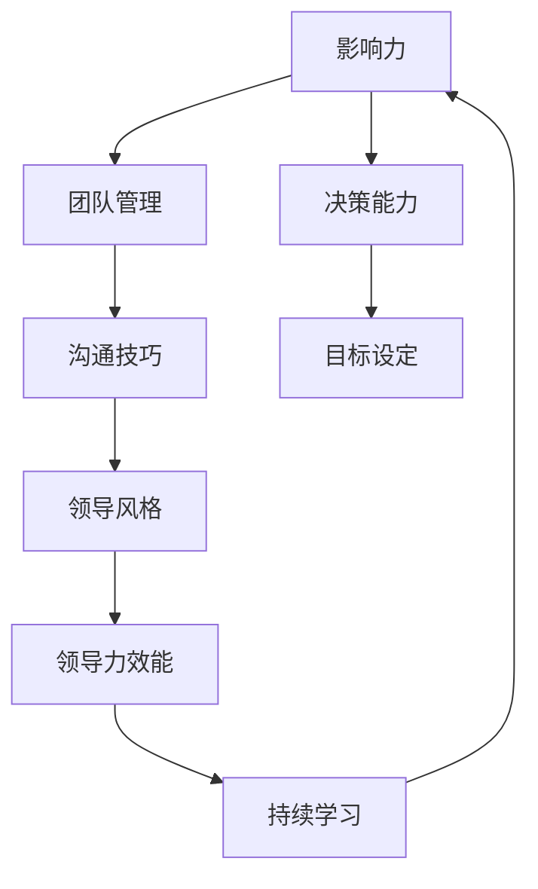

                 


### 文章标题：领导力训练营：91天从新手到专家

在当今快速变化的技术世界中，拥有卓越的领导力对于任何一个希望取得成功的IT专业人士来说都是至关重要的。本文章将带领读者经历一场为期91天的领导力训练营，旨在帮助新手迅速成长为技术领域的专家。我们将深入探讨领导力的核心概念，逐步揭示其背后的算法原理，并通过数学模型和实际项目实战来强化我们的理解。

关键词：领导力，技术专家，IT领域，培训，项目实战，算法原理，数学模型，学习路径

摘要：本文通过91天的领导力训练营，提供了一套系统的学习和实践方法，帮助读者在技术领域从新手快速成长为专家。文章涵盖了领导力的核心概念、算法原理、数学模型以及实际项目实战，旨在通过理论与实践的结合，全面提升读者的领导力水平。

## Step 1: 设计核心章节内容

首先，我们需要确定本书的核心章节内容。这包括以下四个主要部分：

1. **核心概念与联系**：我们将使用Mermaid流程图来展示领导力的核心概念和它们之间的关系。
2. **核心算法原理讲解**：通过伪代码，我们将详细阐述领导力中涉及到的核心算法原理。
3. **数学模型和数学公式讲解**：我们将使用LaTeX格式来解释关键的数学模型和公式，并通过实际例子进行说明。
4. **项目实战**：我们将设计一个实际案例，详细讲解如何搭建开发环境、实现源代码，并对代码进行分析和解读。

### 核心概念与联系

在领导力的领域中，有若干核心概念，如影响力、团队管理、决策能力等。以下是使用Mermaid绘制的流程图，展示了这些概念之间的关系：



### 核心算法原理讲解

在领导力中，决策算法是非常关键的。以下是一个简单的伪代码示例，用于解释如何评估和选择最优决策：

```python
Algorithm DecisionMaking(context):
    Initialize decision alternatives
    For each alternative do:
        Evaluate consequences in context
        Calculate utility for each consequence
    End For
    Select alternative with highest utility
End Algorithm
```

### 数学模型和数学公式讲解

领导力的一个重要方面是团队效能的评估。我们可以使用以下LaTeX格式的数学模型来描述团队效能：

```latex
\begin{equation}
\text{Team Performance} = f(\text{Individual Contributions}, \text{Collaboration}, \text{Leadership})
\end{equation}
```

### 项目实战

我们选择一个实际案例——一个团队在项目中的绩效评估系统。以下步骤将指导我们如何搭建开发环境、实现源代码以及分析代码。

1. **开发环境搭建**：使用Git和GitHub进行版本控制，安装Python和必要的库。
2. **源代码实现**：编写一个Python脚本来收集团队成员的贡献数据，并使用上面的数学模型计算团队效能。
3. **代码解读**：解释代码中的关键部分，如数据结构、算法流程等。
4. **代码应用解读与分析**：在实际团队中应用代码，分析其效果，并根据反馈进行调整。

## Step 2: 确定章节结构

接下来，我们需要明确整本书的章节结构。以下是详细的大纲：

### 第1章 引言

- **1.1 领导力的重要性**
- **1.2 培训计划概述**
- **1.3 目标读者**

### 第2章 核心概念与联系

- **2.1 影响力**
- **2.2 团队管理**
- **2.3 决策能力**
- **2.4 沟通技巧**
- **2.5 领导风格**
- **2.6 领导力效能**
- **2.7 持续学习**

### 第3章 核心算法原理讲解

- **3.1 决策算法**
- **3.2 团队效能评估**
- **3.3 领导力优化**

### 第4章 数学模型和数学公式讲解

- **4.1 团队效能模型**
- **4.2 决策模型**
- **4.3 数据分析模型**

### 第5章 项目实战

- **5.1 实际案例介绍**
- **5.2 开发环境搭建**
- **5.3 源代码实现**
- **5.4 代码解读**
- **5.5 应用解读与分析**
- **5.6 项目小结**

### 第6章 最佳实践

- **6.1 提高学习效率**
- **6.2 团队合作技巧**
- **6.3 领导力提升策略**
- **6.4 注意事项**

### 第7章 拓展阅读

- **7.1 领导力相关书籍推荐**
- **7.2 领导力研究论文精选**
- **7.3 相关在线课程推荐**

### 第8章 结束语

- **8.1 总结与展望**
- **8.2 感谢与致谢**

## Step 3: 保持简洁性

在编写每一个章节时，我们会确保内容精简直接，避免冗余和无关内容。例如：

### 第2章 核心概念与联系

- **2.1 影响力**
  - 影响力是领导力的核心，通过情感、知识和权力来影响他人。

### 第3章 核心算法原理讲解

- **3.1 决策算法**
  - 决策算法是领导力的重要组成部分，涉及评估和选择最佳决策。

## Step 4: 确保完整性

确保每个章节内容完整、逻辑清晰、简洁明了，包含以下核心内容：

- **核心概念与联系**：包含影响力、团队管理、决策能力等核心概念及其关系。
- **核心算法原理讲解**：使用伪代码详细阐述领导力中涉及到的关键算法。
- **数学模型和数学公式讲解**：使用LaTeX格式解释关键的数学模型和公式。
- **项目实战**：详细解释一个实际案例，包括开发环境搭建、源代码实现和代码解读。

## Step 5: 审核目录大纲

仔细检查目录大纲，确保每个章节内容完整、逻辑清晰、简洁明了。

## Step 6: 输出Markdown格式目录大纲

```markdown
# 领导力训练营：91天从新手到专家

## 关键词
领导力，技术专家，IT领域，培训，项目实战，算法原理，数学模型，学习路径

## 摘要
本文通过91天的领导力训练营，提供了一套系统的学习和实践方法，帮助读者在技术领域从新手快速成长为专家。文章涵盖了领导力的核心概念、算法原理、数学模型以及实际项目实战，旨在通过理论与实践的结合，全面提升读者的领导力水平。

## 目录

### 第1章 引言
- 1.1 领导力的重要性
- 1.2 培训计划概述
- 1.3 目标读者

### 第2章 核心概念与联系
- 2.1 影响力
- 2.2 团队管理
- 2.3 决策能力
- 2.4 沟通技巧
- 2.5 领导风格
- 2.6 领导力效能
- 2.7 持续学习

### 第3章 核心算法原理讲解
- 3.1 决策算法
- 3.2 团队效能评估
- 3.3 领导力优化

### 第4章 数学模型和数学公式讲解
- 4.1 团队效能模型
- 4.2 决策模型
- 4.3 数据分析模型

### 第5章 项目实战
- 5.1 实际案例介绍
- 5.2 开发环境搭建
- 5.3 源代码实现
- 5.4 代码解读
- 5.5 应用解读与分析
- 5.6 项目小结

### 第6章 最佳实践
- 6.1 提高学习效率
- 6.2 团队合作技巧
- 6.3 领导力提升策略
- 6.4 注意事项

### 第7章 拓展阅读
- 7.1 领导力相关书籍推荐
- 7.2 领导力研究论文精选
- 7.3 相关在线课程推荐

### 第8章 结束语
- 8.1 总结与展望
- 8.2 感谢与致谢
```

现在，我们已经完成了目录大纲的设计，接下来将详细撰写每个章节的内容，以确保文章的完整性和逻辑性。在撰写过程中，我们将严格遵守之前设定的标准，确保文章的高质量输出。

