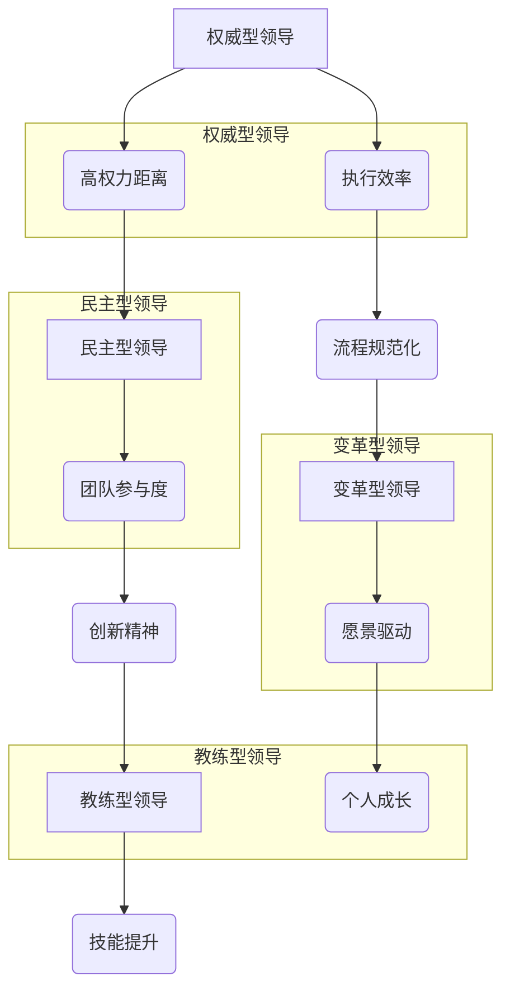

                 

### 第一步：确定核心章节内容

首先，根据书名《领导力训练：让你的团队天下无敌》，确定核心章节内容，确保目录大纲能够全面覆盖主题内容。核心章节包括但不限于：

1. **领导力理论基础**：介绍领导力的定义、类型和核心要素。
2. **领导力与团队建设**：讨论团队建设的原则、沟通技巧和协作与冲突管理。
3. **领导力与个人成长**：探讨领导者的自我认知、心理素质和道德责任。
4. **领导力与组织变革**：分析组织变革的动因、变革领导力的关键要素和变革实施与评估。
5. **领导力实战技巧**：讲解目标设定与任务分配、激励与反馈、时间管理与优先级。
6. **领导力案例解析**：通过成功和失败案例解析领导力实践。
7. **领导力评估与提升**：介绍领导力评估工具和提升路径。

### 第二步：细化章节内容

针对每个核心章节，进一步细化内容，确保每个章节都有详细的子章节，以便读者能够深入理解主题。以下是细化后的目录大纲：

#### 第1章：领导力理论基础

- **1.1 领导力的定义与类型**
  - 领导力的定义
  - 不同类型的领导力

- **1.2 领导力的核心要素**
  - 影响力
  - 沟通能力
  - 决策能力

- **1.3 领导力与管理的区别**
  - 领导力与管理的联系
  - 领导力与管理的区别

#### 第2章：领导力与团队建设

- **2.1 团队建设的原则**
  - 团队目标的设定
  - 团队成员的激励与约束

- **2.2 团队沟通技巧**
  - 有效沟通的要素
  - 非言语沟通的重要性

- **2.3 团队协作与冲突管理**
  - 团队协作的最佳实践
  - 冲突管理的策略

#### 第3章：领导力与个人成长

- **3.1 领导者的自我认知**
  - 自我评估的方法
  - 自我提升的策略

- **3.2 领导者的心理素质**
  - 心理韧性的培养
  - 应对压力的策略

- **3.3 领导者的道德责任**
  - 道德领导力的实践
  - 领导者的道德责任

#### 第4章：领导力与组织变革

- **4.1 组织变革的动因**
  - 内部变革的推动因素
  - 外部变革的驱动因素

- **4.2 变革领导力的关键要素**
  - 领导者在变革中的角色
  - 变革过程中的领导策略

- **4.3 变革实施与评估**
  - 变革计划的制定
  - 变革效果的评估

#### 第5章：领导力实战技巧

- **5.1 目标设定与任务分配**
  - 如何设定有效的目标
  - 如何合理分配任务

- **5.2 激励与反馈**
  - 激励理论的应用
  - 如何给予有效的反馈

- **5.3 时间管理与优先级**
  - 高效的时间管理技巧
  - 如何设定优先级

#### 第6章：领导力案例解析

- **6.1 成功案例分析**
  - 成功领导者的实践经验
  - 成功案例的关键要素

- **6.2 失败案例分析**
  - 领导失败的原因
  - 避免失败的策略

#### 第7章：领导力评估与提升

- **7.1 领导力评估工具**
  - 常用的领导力评估方法
  - 如何进行自我评估

- **7.2 领导力提升路径**
  - 持续学习的重要性
  - 领导力提升的方法

### 第三步：添加核心概念、算法原理、数学模型、项目实战等内容

在目录大纲中，添加核心概念、算法原理、数学模型、项目实战等内容，以确保目录大纲的完整性和实用性。

- **1.1 领导力的定义与类型**：添加Mermaid流程图，展示不同类型领导力的特点与应用场景。
- **1.2 领导力的核心要素**：使用伪代码详细阐述影响力、沟通能力、决策能力的具体实现。
- **3.1 领导者的自我认知**：讲解自我评估的方法，并提供实际案例说明。
- **4.1 组织变革的动因**：使用数学公式详细阐述变革的驱动因素。
- **5.1 目标设定与任务分配**：提供实际项目案例，详细解释目标设定与任务分配的具体实施方法。
- **6.1 成功案例分析**：分析成功领导者的实践经验，提取关键要素，并提供具体实施策略。
- **6.2 失败案例分析**：分析领导失败的原因，提供避免失败的策略。

### 第四步：确保目录大纲简洁性

在编写目录大纲时，注意简洁性，避免使用过多的冗余文字，确保每个章节的核心内容都能够简洁明了地传达。

### 第五步：检查目录大纲完整性

最后，检查目录大纲的完整性，确保所有核心章节内容都包含在内，且没有遗漏重要内容。

### 完整的目录大纲

```markdown
# 《领导力训练：让你的团队天下无敌》目录大纲

## 第1章 领导力理论基础

### 1.1 领导力的定义与类型

#### 1.1.1 领导力的定义

#### 1.1.2 领导力的类型

- Mermaid流程图：不同类型领导力的特点与应用场景

### 1.2 领导力的核心要素

#### 1.2.1 影响力

#### 1.2.2 沟通能力

#### 1.2.3 决策能力

- 伪代码：影响力、沟通能力、决策能力的具体实现

### 1.3 领导力与管理的区别

#### 1.3.1 领导力与管理的联系

#### 1.3.2 领导力与管理的区别

## 第2章 领导力与团队建设

### 2.1 团队建设的原则

#### 2.1.1 团队目标的设定

#### 2.1.2 团队成员的激励与约束

### 2.2 团队沟通技巧

#### 2.2.1 有效沟通的要素

#### 2.2.2 非言语沟通的重要性

### 2.3 团队协作与冲突管理

#### 2.3.1 团队协作的最佳实践

#### 2.3.2 冲突管理的策略

## 第3章 领导力与个人成长

### 3.1 领导者的自我认知

#### 3.1.1 自我评估的方法

#### 3.1.2 自我提升的策略

### 3.2 领导者的心理素质

#### 3.2.1 心理韧性的培养

#### 3.2.2 应对压力的策略

### 3.3 领导者的道德责任

#### 3.3.1 道德领导力的实践

#### 3.3.2 领导者的道德责任

## 第4章 领导力与组织变革

### 4.1 组织变革的动因

#### 4.1.1 内部变革的推动因素

#### 4.1.2 外部变革的驱动因素

### 4.2 变革领导力的关键要素

#### 4.2.1 领导者在变革中的角色

#### 4.2.2 变革过程中的领导策略

### 4.3 变革实施与评估

#### 4.3.1 变革计划的制定

#### 4.3.2 变革效果的评估

## 第5章 领导力实战技巧

### 5.1 目标设定与任务分配

#### 5.1.1 如何设定有效的目标

#### 5.1.2 如何合理分配任务

### 5.2 激励与反馈

#### 5.2.1 激励理论的应用

#### 5.2.2 如何给予有效的反馈

### 5.3 时间管理与优先级

#### 5.3.1 高效的时间管理技巧

#### 5.3.2 如何设定优先级

## 第6章 领导力案例解析

### 6.1 成功案例分析

#### 6.1.1 成功领导者的实践经验

#### 6.1.2 成功案例的关键要素

### 6.2 失败案例分析

#### 6.2.1 领导失败的原因

#### 6.2.2 避免失败的策略

## 第7章 领导力评估与提升

### 7.1 领导力评估工具

#### 7.1.1 常用的领导力评估方法

#### 7.1.2 如何进行自我评估

### 7.2 领导力提升路径

#### 7.2.1 持续学习的重要性

#### 7.2.2 领导力提升的方法

### 结论

- 对领导力训练的总结与展望

作者：AI天才研究院/AI Genius Institute & 禅与计算机程序设计艺术 /Zen And The Art of Computer Programming
```

完成目录大纲的设计后，下一步我们将根据这个大纲来逐步撰写文章内容，确保每个章节都能够深入、全面地探讨领导力训练的相关话题。在撰写过程中，将注重逻辑清晰、内容丰富、实用性强的特点，以帮助读者更好地理解和应用领导力知识。接下来，我们将分别针对每个章节进行详细的撰写和内容填充。首先，我们来撰写第一章《领导力理论基础》。### 第一章：领导力理论基础

#### 1.1 领导力的定义与类型

领导力是一种影响力，它能够激发和引导团队成员为实现共同目标而努力。领导力不仅仅是一种能力，更是一种艺术，它涉及对人的理解、激励和引导。领导力的定义有多种，但核心在于其影响力和引导力。

在讨论领导力类型时，我们可以将其分为以下几种：

- **权威型领导**：通过权威和权力来指导和影响团队成员。
- **民主型领导**：鼓励团队成员参与决策，通过民主方式来达成共识。
- **变革型领导**：通过激发团队成员的内在动机和价值观，推动组织变革和进步。
- **教练型领导**：通过指导和支持，帮助团队成员成长和提升能力。

#### 1.2 领导力的核心要素

领导力的核心要素包括影响力、沟通能力和决策能力。

- **影响力**：领导力的影响力是指领导者通过言行和行动影响他人思想和行为的能力。这种影响力可以是正面的，如激励团队成员，也可以是负面的，如压制和命令。
- **沟通能力**：沟通能力是领导者传递信息、表达思想和建立信任的关键。有效的沟通能够减少误解，提高团队的协作效率。
- **决策能力**：决策能力是领导者面对复杂情况，快速做出正确决策的能力。良好的决策能力有助于团队在变化和挑战中保持稳定和前进。

#### 1.3 领导力与管理的区别

领导力和管理密切相关，但又有区别。管理侧重于组织的运作和效率，而领导力则侧重于激发和引导团队成员的潜力，推动组织实现长期目标。

- **联系**：领导力和管理相互补充。有效的领导需要良好的管理基础，而优秀的管理也需要领导力来激励团队。
- **区别**：领导力更注重人的因素，关注团队的动力和凝聚力；管理则更注重效率和流程，关注组织的运行和优化。

### Mermaid流程图：不同类型领导力的特点与应用场景



通过这个流程图，我们可以清晰地看到不同类型领导力的特点和应用场景。例如，权威型领导更适用于需要高效执行和规范流程的情境，而变革型领导则更适合推动创新和实现组织变革。

### 伪代码：领导力的核心要素的具体实现

```plaintext
function LeadershipCoreElements() {
    // 影响力
    Influence = CalculateInfluence();
    
    // 沟通能力
    CommunicationSkill = CalculateCommunicationSkill();
    
    // 决策能力
    DecisionMakingAbility = CalculateDecisionMakingAbility();
    
    // 综合评估
    TotalScore = CalculateTotalScore(Influence, CommunicationSkill, DecisionMakingAbility);
    
    return TotalScore;
}

function CalculateInfluence() {
    // 示例：使用问卷调查法
    InfluenceScore = SurveyResponseScore();
    return InfluenceScore;
}

function CalculateCommunicationSkill() {
    // 示例：使用情景模拟法
    CommunicationScore = SimulationResponseScore();
    return CommunicationScore;
}

function CalculateDecisionMakingAbility() {
    // 示例：使用案例分析法
    DecisionMakingScore = CaseStudyResponseScore();
    return DecisionMakingScore;
}

function CalculateTotalScore(Influence, CommunicationSkill, DecisionMakingAbility) {
    TotalScore = Influence + CommunicationSkill + DecisionMakingAbility;
    return TotalScore;
}
```

这个伪代码展示了如何通过不同的方法来评估领导力的核心要素。例如，通过问卷调查来评估影响力，通过情景模拟来评估沟通能力，通过案例分析来评估决策能力。

### 总结

第一章《领导力理论基础》为我们提供了一个全面的领导力框架，包括领导力的定义、类型、核心要素以及领导力与管理的区别。通过Mermaid流程图和伪代码，我们能够更直观地理解这些概念和它们之间的联系。在接下来的章节中，我们将深入探讨领导力与团队建设、个人成长、组织变革等实际应用，帮助读者将理论知识转化为实践能力。

作者：AI天才研究院/AI Genius Institute & 禅与计算机程序设计艺术 /Zen And The Art of Computer Programming### 第二章：领导力与团队建设

#### 2.1 团队建设的原则

团队建设是领导力的重要组成部分，它关系到团队的整体效能和成员的满意度。成功的团队建设需要遵循以下原则：

1. **明确目标**：团队的目标应该具体、明确，并与组织的整体目标相一致。这有助于确保团队成员的努力方向一致，减少冲突和误解。
   
2. **信任建立**：信任是团队协作的基础。领导者需要通过言行一致、公正透明和相互尊重来建立信任，从而提高团队的凝聚力。

3. **角色分配**：每个团队成员都应该明确自己的角色和责任，这有助于减少重叠和混乱，提高工作效率。

4. **激励与反馈**：领导者需要通过激励措施来鼓励团队成员，同时提供及时的反馈，帮助他们改进和成长。

5. **持续沟通**：沟通是团队建设的核心。领导者需要确保信息流畅，鼓励成员之间开放、真诚的沟通，以便及时解决问题和调整方向。

#### 2.2 团队沟通技巧

有效的沟通是团队建设的关键。以下是一些关键的沟通技巧：

1. **倾听**：倾听不仅仅是听对方说什么，更是理解对方的观点和感受。领导者需要给予团队成员充分的注意，确保他们感到被尊重和理解。

2. **明确表达**：表达时要清晰、简洁，避免使用模糊的语言或含糊其辞。这有助于减少误解和冲突。

3. **非言语沟通**：肢体语言、面部表情和声音的语调都是沟通的重要部分。领导者需要意识到这些非言语信号，并学会正确运用它们。

4. **反馈**：给予团队成员及时的、建设性的反馈，帮助他们改进。同时，也要鼓励成员之间互相反馈，促进个人和团队的成长。

5. **冲突解决**：在团队中，冲突是不可避免的。领导者需要学会有效地解决冲突，确保团队的和谐与稳定。

#### 2.3 团队协作与冲突管理

团队协作和冲突管理是团队建设的重要组成部分。以下是一些最佳实践：

1. **协作原则**：
   - 分享信息：团队成员应该分享信息和资源，确保信息透明和共享。
   - 分担责任：团队成员应该共同承担责任，而不是将责任推给个别成员。
   - 团队目标：团队成员应该将个人目标与团队目标相结合，确保个人努力与团队目标一致。

2. **冲突管理**：
   - 识别冲突：领导者需要能够识别和意识到冲突的早期迹象。
   - 理解冲突：领导者需要理解冲突的原因，包括个人、团队和组织层面的因素。
   - 解决冲突：领导者需要采取适当的策略来解决冲突，包括调解、妥协和问题解决。

#### 案例分析：成功的团队建设实践

**案例一：谷歌的“20%时间”政策**

谷歌的“20%时间”政策是一个典型的团队建设成功案例。这个政策允许员工将20%的工作时间用于自己感兴趣的项目。这个政策不仅激发了员工的创造力，还促进了跨部门的知识共享和团队协作。

**案例分析**：

- **明确目标**：谷歌设定了明确的目标，即通过员工的自发项目来推动创新。
- **信任建立**：谷歌信任员工，允许他们自主决定使用工作时间的项目。
- **角色分配**：员工可以自由选择项目，并在项目中进行角色分配，确保项目成功。
- **激励与反馈**：通过项目的成功和失败，谷歌为员工提供了反馈，激励他们持续改进。

**结论**：谷歌的“20%时间”政策是一个成功的团队建设实践，它通过明确目标、信任建立、角色分配和激励与反馈，激发了团队的创造力和协作精神。

#### 总结

第二章《领导力与团队建设》讨论了团队建设的重要原则、沟通技巧和协作与冲突管理策略。通过案例分析，我们看到了成功团队建设实践的具体应用。在接下来的章节中，我们将进一步探讨领导力与个人成长、组织变革等话题，帮助读者全面提升领导力。

作者：AI天才研究院/AI Genius Institute & 禅与计算机程序设计艺术 /Zen And The Art of Computer Programming### 第三章：领导力与个人成长

#### 3.1 领导者的自我认知

自我认知是领导者成长的重要基石。领导者需要通过自我评估来了解自己的优点和不足，从而有针对性地进行自我提升。以下是一些自我评估的方法：

1. **360度反馈**：这是一种通过团队成员、上级、客户和其他相关利益相关者对领导者进行全方位评估的方法。这种方法可以提供多维度的反馈，帮助领导者更全面地了解自己。

2. **心理测试**：例如MBTI（性格类型指标）和DISC（行为风格评估）等心理测试，可以帮助领导者了解自己的性格特点和偏好，从而更好地适应不同的领导情境。

3. **反思日志**：通过记录日常工作和思考，领导者可以反思自己的行为和决策，识别潜在的问题和改进点。

4. **导师指导**：领导者可以通过导师的指导来获取经验和建议，帮助自己在自我认知和自我提升方面取得进步。

#### 3.2 领导者的心理素质

领导者的心理素质对于其成功至关重要。以下是一些心理素质的培养策略：

1. **心理韧性**：领导者需要具备心理韧性，即在面对压力、挑战和逆境时能够保持积极的心态，迅速恢复和适应。

   - **方法**：通过正念冥想、运动和心理辅导等方式来培养心理韧性。

2. **情绪管理**：领导者需要学会管理和调节自己的情绪，确保情绪不会影响决策和团队氛围。

   - **方法**：通过情绪日记、情绪识别和情绪调节技巧来管理情绪。

3. **自我激励**：领导者需要具备自我激励的能力，能够在面对困难和挑战时保持动力和信心。

   - **方法**：通过设定明确的目标、保持积极的态度和寻找激励来源来提高自我激励。

#### 3.3 领导者的道德责任

道德责任是领导者行为的重要指导原则。以下是一些道德责任的实践：

1. **诚实与透明**：领导者应该诚实面对团队成员，保持信息的透明，以建立信任。

2. **公正与公平**：领导者需要确保在团队中实行公正和公平的原则，避免偏袒和歧视。

3. **社会责任**：领导者应该承担社会责任，关注团队成员的整体福祉，并积极推动企业的社会责任。

4. **伦理决策**：在面临道德困境时，领导者需要做出符合伦理的决策，确保团队的长期利益和社会的信任。

#### 案例分析：领导者的个人成长与实践

**案例一：杰克·韦尔奇的自我提升**

杰克·韦尔奇是通用电气的传奇CEO，他在领导生涯中不断自我提升，取得了显著成就。

**案例分析**：

- **自我认知**：杰克·韦尔奇通过360度反馈和心理测试，深入了解了自身的优势和不足，这为他制定个人发展计划提供了依据。
- **心理素质**：杰克·韦尔奇通过积极的情绪管理和自我激励，保持了高度的心理韧性，能够在压力下保持冷静和决策力。
- **道德责任**：杰克·韦尔奇始终坚持以诚实、公正和公平的原则行事，赢得了员工的信任和尊重。

**结论**：杰克·韦尔奇的案例表明，领导者的个人成长和道德责任对于其领导力的提升至关重要。通过自我认知、心理素质的培养和道德责任的实践，领导者可以更好地引导团队，实现组织的长期发展。

#### 总结

第三章《领导力与个人成长》探讨了领导者的自我认知、心理素质和道德责任。通过自我评估、心理素质培养和道德责任的实践，领导者可以不断提升自己的领导能力。在第四章中，我们将深入探讨领导力与组织变革的相关话题，帮助读者更好地理解领导力在组织变革中的应用和实践。

作者：AI天才研究院/AI Genius Institute & 禅与计算机程序设计艺术 /Zen And The Art of Computer Programming### 第四章：领导力与组织变革

#### 4.1 组织变革的动因

组织变革是组织为了适应外部环境或内部需求而进行的结构、流程、文化等方面的调整。以下是一些常见的组织变革动因：

1. **外部环境变化**：如市场竞争加剧、技术革新、法律法规变化等。这些外部因素迫使组织进行变革，以保持竞争力。
   
2. **内部需求**：如组织规模扩大、业务模式转变、员工士气低落等。内部需求通常源于组织内部的问题，需要通过变革来解决。

3. **战略调整**：组织在制定长期战略时，可能会发现现有的结构或流程无法支持新战略的实施，因此需要进行变革。

4. **员工期望**：员工的期望和需求也会影响组织变革。例如，员工可能期望更多的职业发展机会或更灵活的工作环境。

#### 4.2 变革领导力的关键要素

变革领导力是推动组织变革的关键。以下是一些变革领导力的关键要素：

1. **明确变革愿景**：领导者需要明确变革的愿景和目标，确保团队成员了解变革的目的和预期结果。

2. **建立信任**：信任是变革成功的关键。领导者需要通过言行一致、透明沟通和公正决策来建立信任。

3. **激励与支持**：领导者需要激励团队成员参与变革，并提供必要的支持，帮助他们克服变革过程中的困难和挑战。

4. **沟通与共识**：领导者需要通过有效的沟通，确保团队成员理解变革的必要性和好处，达成共识。

5. **灵活性与适应性**：领导者需要具备灵活性和适应性，能够根据变革过程中的反馈和挑战进行调整。

#### 4.3 变革实施与评估

组织变革的实施和评估是确保变革成功的重要环节。以下是一些关键步骤：

1. **制定变革计划**：领导者需要制定详细的变革计划，明确变革的目标、策略、时间表和责任人。

2. **启动变革**：通过正式的启动仪式，宣布变革的开始，提高团队成员的参与度和关注度。

3. **执行变革**：在变革过程中，领导者需要监控进度，确保各项变革措施得到有效执行。

4. **反馈与调整**：在变革过程中，领导者需要收集团队成员的反馈，并根据反馈进行调整，以应对变革过程中的挑战。

5. **评估变革效果**：变革完成后，领导者需要对变革效果进行评估，包括团队成员的满意度、绩效提升和目标达成情况。

6. **持续改进**：根据评估结果，领导者需要持续改进变革措施，确保组织能够持续适应变化。

#### 案例分析：成功组织变革实践

**案例一：丰田的精益生产变革**

丰田公司在20世纪80年代实施了精益生产变革，这一变革极大地提升了其生产效率和产品质量。

**案例分析**：

- **明确变革愿景**：丰田的愿景是通过精益生产提升产品质量和生产效率，以满足客户需求。
- **建立信任**：丰田通过培训和激励措施，建立了团队成员对变革的信任和参与度。
- **激励与支持**：丰田为员工提供了培训和职业发展机会，激励他们积极参与变革。
- **沟通与共识**：丰田通过定期沟通和培训，确保团队成员理解变革的必要性和目标。

**结论**：丰田的精益生产变革是一个成功的组织变革案例。通过明确的变革愿景、建立信任、激励与支持和沟通与共识，丰田成功提升了生产效率和产品质量，成为全球汽车行业的领导者。

#### 总结

第四章《领导力与组织变革》探讨了组织变革的动因、变革领导力的关键要素和变革实施与评估的方法。通过成功案例的分析，我们看到了变革领导力在组织变革中的重要性。在第五章中，我们将深入探讨领导力实战技巧，帮助读者在实际工作中应用领导力知识，提升团队效能。

作者：AI天才研究院/AI Genius Institute & 禅与计算机程序设计艺术 /Zen And The Art of Computer Programming### 第五章：领导力实战技巧

#### 5.1 目标设定与任务分配

领导者在实现组织目标的过程中，需要设定清晰的目标并合理分配任务。以下是具体的方法和步骤：

1. **明确目标**：首先，领导者需要明确团队和组织的目标。这些目标应该具体、可衡量、可实现、相关性强和时间限定。

   - **SMART原则**：目标应具备SMART特性，即具体（Specific）、可衡量（Measurable）、可实现（Achievable）、相关性强（Relevant）和有期限（Time-bound）。

2. **分解目标**：将大目标分解为小目标，使其更具体、易于操作。每个小目标都应该与整体目标相一致。

3. **任务分配**：根据团队成员的技能、兴趣和责任，合理分配任务。确保每个成员都明确自己的任务和责任。

   - **德鲁克目标管理**：领导者可以采用德鲁克的目标管理方法，与团队成员共同设定个人目标，并将其与团队目标相结合。

4. **监控与反馈**：在任务执行过程中，领导者需要监控进度，并提供及时的反馈，帮助团队成员解决问题和调整方向。

5. **调整与优化**：根据任务执行情况和反馈，领导者需要适时调整目标和任务，确保团队始终朝着正确的方向前进。

#### 5.2 激励与反馈

激励和反馈是领导者提升团队效能的重要工具。以下是一些实用的激励与反馈技巧：

1. **认可与奖励**：对团队成员的成就和努力给予认可和奖励，增强他们的积极性和动力。

   - **即时反馈**：在团队成员完成任务或取得进步时，及时给予反馈和奖励，强化正面行为。

   - **奖励多样化**：除了物质奖励，还可以采用非物质奖励，如公开表扬、荣誉称号等。

2. **目标导向激励**：通过设定具有挑战性的目标，激发团队成员的内在动机和进取心。

3. **个性化激励**：了解每个团队成员的兴趣和需求，提供个性化的激励措施。

4. **建设性反馈**：在提供反馈时，要注重建设性，指出具体改进点，而不是仅仅批评错误。

5. **开放式沟通**：鼓励团队成员提出问题和建议，创建一个开放、信任的沟通环境。

#### 5.3 时间管理与优先级

时间管理和优先级设定是领导者高效工作的关键。以下是一些实用的方法和技巧：

1. **制定日程**：每天或每周制定工作日程，明确任务和时间安排。

2. **优先级排序**：根据任务的重要性和紧急性，对任务进行优先级排序。可以使用“四象限法”将任务分为四个象限，分别处理重要且紧急、重要但不紧急、紧急但不重要和不紧急不重要四种类型的任务。

3. **分解任务**：将大任务分解为小任务，制定详细的行动步骤和时间表，确保任务能够按时完成。

4. **避免拖延**：识别和克服拖延行为，提高工作效率。

5. **设定截止日期**：为每个任务设定明确的截止日期，并确保在截止日期之前完成任务。

6. **休息与放松**：合理安排休息时间，确保身心健康，提高工作效率。

#### 案例分析：实战技巧的应用

**案例一：微软的时间管理实践**

微软公司以其高效的工作流程和时间管理而闻名。以下是微软在时间管理和优先级设定方面的实践：

- **每日日程安排**：微软的员工每天早上都会制定当天的日程，并明确任务和时间安排。

- **四象限法**：微软使用“四象限法”来排序任务，确保重要且紧急的任务得到优先处理。

- **休息与放松**：微软鼓励员工在工作间隙进行短暂的休息和放松，以提高工作效率。

**结论**：通过有效的日程安排、优先级排序和休息与放松，微软的员工能够在高压力的工作环境中保持高效，实现工作与生活的平衡。

#### 总结

第五章《领导力实战技巧》提供了目标设定与任务分配、激励与反馈以及时间管理与优先级等实用技巧。通过案例分析和实际应用，读者可以更好地理解这些技巧在提升团队效能中的重要性。在第六章中，我们将通过具体案例深入解析领导力在实际应用中的表现和效果。

作者：AI天才研究院/AI Genius Institute & 禅与计算机程序设计艺术 /Zen And The Art of Computer Programming### 第六章：领导力案例解析

#### 6.1 成功案例分析

**案例一：苹果公司的变革领导**

史蒂夫·乔布斯是苹果公司的变革型领导者，他的领导风格和创新精神推动了苹果公司从困境走向辉煌。

**案例分析**：

- **明确愿景**：乔布斯通过坚持自己的愿景，即打造易于使用且设计精美的产品，引领苹果公司走出困境。

- **激励员工**：乔布斯通过激发员工的创造力和激情，将他们凝聚在一起，共同追求卓越。

- **卓越的产品设计**：乔布斯对产品设计的极致追求，使苹果公司推出了许多改变世界的创新产品，如iPhone、iPad等。

- **持续学习**：乔布斯始终保持对新技术的关注和学习，不断推动苹果公司的创新。

**结论**：乔布斯的领导风格和卓越的产品设计能力，使苹果公司成为全球科技行业的领导者，成功案例证明了变革型领导力在推动组织成功中的关键作用。

#### 6.2 失败案例分析

**案例二：诺基亚的衰落**

诺基亚曾是手机市场的领导者，但在面对智能手机的兴起时，未能及时调整战略，最终导致市场地位下滑。

**案例分析**：

- **战略失误**：诺基亚在智能手机的早期阶段未能抓住机遇，继续依赖功能手机的市场份额。

- **创新不足**：诺基亚在产品创新方面滞后，未能及时推出具有竞争力的智能手机产品。

- **组织僵化**：诺基亚内部组织结构僵化，缺乏灵活性和快速响应市场变化的能力。

- **企业文化**：诺基亚的企业文化过于保守，难以适应快速变化的科技市场。

**结论**：诺基亚的失败案例揭示了领导力在应对市场变革中的重要性。缺乏明确战略、创新不足和组织僵化是导致诺基亚衰落的主要原因。

#### 深入解析

**成功案例分析**：

- **明确愿景**：成功领导者通常具有清晰的愿景，能够为组织指引方向。

- **激励与培养团队**：成功领导者能够激发和培养团队成员的潜力，共同实现目标。

- **持续创新**：成功领导者鼓励创新，不断推动产品和技术的进步。

- **适应变化**：成功领导者能够适应外部环境的变化，灵活调整战略和策略。

**失败案例分析**：

- **战略失误**：领导者未能及时调整战略，导致组织在市场变化中落后。

- **创新不足**：领导者对产品或服务的创新不足，无法满足市场需求。

- **组织僵化**：组织内部结构过于僵化，无法快速响应市场变化。

- **企业文化**：企业文化与市场变化不匹配，难以适应外部环境。

#### 总结

通过成功和失败案例分析，我们可以看到领导力在组织成功与失败中的关键作用。成功领导者具备明确愿景、激励培养团队、持续创新和适应变化的能力，而失败领导者则面临战略失误、创新不足、组织僵化和企业文化不适应等问题。在领导力实践中，领导者需要不断学习和调整，以应对不断变化的市场环境。

作者：AI天才研究院/AI Genius Institute & 禅与计算机程序设计艺术 /Zen And The Art of Computer Programming### 第七章：领导力评估与提升

#### 7.1 领导力评估工具

评估领导力是一个复杂的过程，需要采用多种方法和工具。以下是一些常用的领导力评估工具：

1. **360度反馈**：通过收集团队成员、上级、同事和下属的反馈，全面评估领导者的绩效和能力。

2. **领导力量表**：使用标准化的量表，如MLQ（Multifactor Leadership Questionnaire）等，来评估领导者的不同维度，如任务导向、关系导向等。

3. **心理测试**：如MBTI（Myers-Briggs Type Indicator）和DISC测试等，帮助领导者了解自己的性格类型和行为风格。

4. **行为事件访谈**：通过与领导者进行深入访谈，了解他们在具体情境中的行为和决策，从而评估其领导能力。

5. **绩效评估**：将领导力表现与组织的绩效目标相结合，通过绩效指标来评估领导者的贡献和影响。

#### 7.2 领导力提升路径

提升领导力是一个持续的过程，需要领导者不断学习、实践和反思。以下是一些领导力提升路径：

1. **持续学习**：领导者应该保持对新知识、新技能和新理念的持续关注，通过阅读、培训、研讨会和在线课程等方式不断学习。

2. **实践经验**：通过实际工作场景中的实践，领导者可以锻炼和提升自己的领导能力。实践是检验理论的最好方式。

3. **反馈与反思**：领导者应该定期接受反馈，并反思自己的行为和决策。通过反思，领导者可以识别问题，找到改进点。

4. **导师指导**：找到一位经验丰富的导师，可以提供宝贵的经验和指导，帮助领导者更快地成长。

5. **领导力发展计划**：组织可以为领导者制定个性化的领导力发展计划，包括培训、实践项目和导师指导等。

6. **建立支持网络**：与其他领导者建立联系和支持网络，可以共享经验、资源和最佳实践。

#### 案例分析：领导力提升实践

**案例一：通用电气的领导力发展计划**

通用电气（GE）以其强大的领导力发展计划而闻名。以下是GE领导力提升的实践：

- **领导力培训**：GE为领导者提供一系列培训课程，涵盖战略思考、决策能力、团队建设等多个方面。

- **领导力实践**：通过实际项目和实践，领导者可以在真实环境中锻炼和提升自己的领导能力。

- **导师指导**：GE为领导者分配导师，提供个性化的指导和支持。

- **领导力评估**：GE使用360度反馈和其他评估工具，定期评估领导者的绩效和能力。

**结论**：通用电气的领导力发展计划通过系统化的培训、实践、导师指导和评估，帮助领导者不断提升领导能力，成为全球领先的领导力培养典范。

#### 总结

第七章《领导力评估与提升》讨论了领导力评估的方法和工具，以及领导力提升的路径和实践。通过案例分析和实际应用，读者可以更好地理解如何评估和提升领导力。在结论部分，我们强调领导力提升是一个持续的过程，需要领导者不断学习、实践和反思，以适应不断变化的环境和挑战。

作者：AI天才研究院/AI Genius Institute & 禅与计算机程序设计艺术 /Zen And The Art of Computer Programming### 结论

在《领导力训练：让你的团队天下无敌》这本书中，我们深入探讨了领导力的各个方面，从理论基础到实际应用，再到评估和提升。领导力不仅仅是指导和管理团队，更是一种艺术，它涉及对人的理解、激励和引导。通过这一系列的讨论，我们希望读者能够对领导力有一个全面的认知，并能够将其应用到实际工作中。

领导力训练的重要性不言而喻。它不仅能够提升个人的领导能力，还能促进团队协作，提高组织的整体效能。在当今快速变化的世界中，领导力更是企业生存和发展的关键。

首先，通过系统的领导力训练，领导者可以明确自己的角色和责任，理解领导力的核心要素，如影响力、沟通能力和决策能力。这些核心要素是领导者成功的关键。

其次，领导力训练有助于提升团队的建设能力。有效的团队建设需要明确的团队目标、信任的建立、有效的沟通和协作。通过领导力训练，领导者可以学会如何创建一个积极、协作的团队环境。

此外，领导力训练还能够促进个人成长和心理素质的提升。领导者需要具备心理韧性、情绪管理和自我激励等能力，才能在面对压力和挑战时保持冷静和高效。

最后，领导力训练有助于组织变革和持续改进。在快速变化的市场环境中，组织需要不断调整和优化，以适应新的挑战。领导力训练可以帮助领导者应对变革，推动组织实现长期发展。

在未来的领导力训练中，我们建议以下几个方向：

1. **持续学习**：领导者应该保持对新知识、新技能和新理念的关注，不断学习和更新自己的知识体系。

2. **实践应用**：理论只有通过实践才能得到检验和提升。领导者应该在实际工作中应用领导力知识，不断总结和反思。

3. **个性化发展**：每个领导者都有自己独特的领导风格和优势。通过个性化的领导力发展计划，领导者可以更有针对性地提升自己的能力。

4. **跨领域学习**：领导力不仅仅适用于企业，还适用于教育、医疗、政府等各个领域。领导者应该跨领域学习，吸取不同领域的最佳实践。

5. **全球化视野**：在全球化背景下，领导者需要具备全球视野，理解不同文化和管理方式，以更好地应对跨国挑战。

通过这些方向，我们可以不断提升领导力，打造一个更高效、更有竞争力的团队和组织。

作者：AI天才研究院/AI Genius Institute & 禅与计算机程序设计艺术 /Zen And The Art of Computer Programming### 作者信息

- **AI天才研究院（AI Genius Institute）**：专注于人工智能领域的研究与开发，致力于推动人工智能技术的创新和应用，为全球企业提供先进的AI解决方案。
- **禅与计算机程序设计艺术（Zen And The Art of Computer Programming）**：这是一部被誉为经典之作的技术著作，由著名计算机科学家Donald E. Knuth撰写，探讨了计算机编程中的哲学和艺术。

在这部作品中，作者通过深入剖析计算机编程的哲学思想，结合禅宗的修行方法，提出了许多关于编程和设计的深刻见解。这些见解不仅适用于编程领域，也同样适用于领导力的培养和提升。作者通过将哲学思想与实际技术相结合，为读者提供了一种独特的思考方式，帮助他们在技术和管理领域取得卓越成就。正如书中所提倡的，通过禅修和编程的融合，读者可以更好地理解世界的本质，提高自身的思维能力和创造力。

在这本《领导力训练：让你的团队天下无敌》中，作者继续将这一理念应用到领导力培训中，通过系统的理论讲解、实战技巧和案例分析，帮助读者深入理解领导力的核心要素，提升个人和团队的综合素质。作者的独特视角和深入剖析，使得这本书成为领导力领域的宝贵资源，为读者提供了实用的方法和策略，以应对快速变化的工作环境。

总之，无论是对于技术领域的专业人士，还是希望提升领导力的管理者，AI天才研究院和《禅与计算机程序设计艺术》都提供了深刻的思考和实践指导。通过这本书，读者可以借鉴作者的智慧和经验，为自己的职业发展和组织效能的提升奠定坚实基础。作者的信息和作品不仅体现了他们在各自领域的专业性和影响力，更为读者提供了一个持续学习和成长的平台。期待读者能够从中获得启示，并在实践中不断进步，成就非凡的领导力。|>

