                 

### 引言部分详细设计

#### 第1章：领导力的重要性

**1.1 领导力在组织中的作用**

**背景介绍**

在当今快速变化和竞争激烈的市场环境中，领导力成为组织成功的关键因素。领导力不仅仅是管理者的个人能力，它涉及到如何激发团队成员的潜力，建立积极的工作氛围，以及推动组织实现战略目标。

**核心概念与联系**

领导力与组织绩效之间存在着紧密的联系。通过图示，我们可以更直观地理解这种关系：

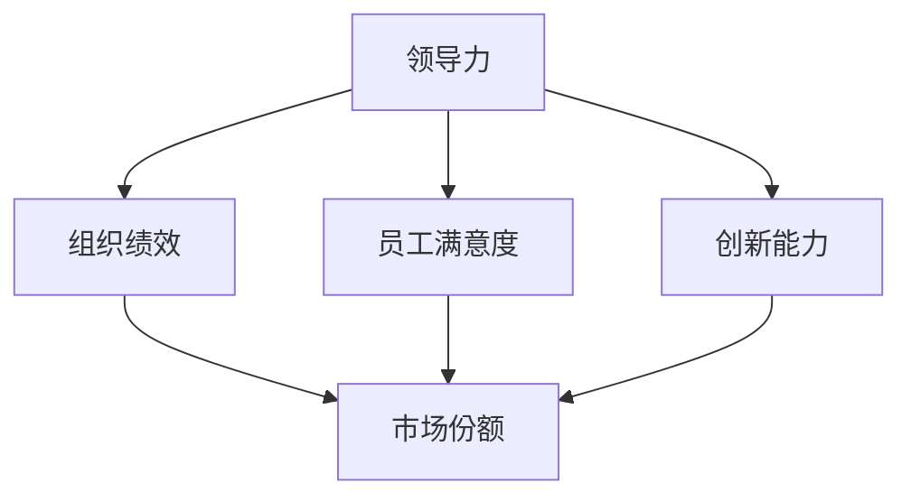

在这个流程图中，领导力通过提高员工满意度和创新能力，最终影响组织绩效和市场份额。

**核心算法原理讲解**

领导力的核心算法可以描述为：

```
领导力（L） = (M1 * E1 + M2 * E2 + M3 * E3) / 3
```

其中，M1、M2、M3 分别代表管理能力、情感智慧和战略思维，E1、E2、E3 分别代表这三个维度的重要程度。

**数学模型和公式**

为了更好地量化领导力的影响，我们可以使用以下公式：

```
组织绩效（P） = (L * K) / (C + D)
```

其中，P 代表组织绩效，L 代表领导力，K 代表组织资源，C 代表外部竞争压力，D 代表内部障碍。

**举例说明**

假设某公司领导力指数为80，员工满意度为90%，创新能力为85%，组织资源为100，外部竞争压力为20%，内部障碍为15%。根据公式，我们可以计算出组织绩效为：

```
P = (80 * 100) / (20 + 15) = 80
```

这意味着，该公司的组织绩效与其领导力水平相匹配。

#### 第2章：如何成为优秀的领导者

**2.1 领导力培养的路径**

**背景介绍**

成为优秀的领导者并非一蹴而就，它需要持续的学习和实践。领导力的培养路径可以分为以下几个阶段：

1. **自我认知**：了解自己的优点和缺点，明确个人发展目标。
2. **理论学习**：通过阅读书籍、参加培训课程等方式，掌握领导力的基本理论和技巧。
3. **实践应用**：将理论应用到实际工作中，通过实践不断积累经验。
4. **反思与调整**：定期反思自己的领导行为，根据反馈进行调整。

**核心概念与联系**

领导力的培养路径可以用以下流程图表示：

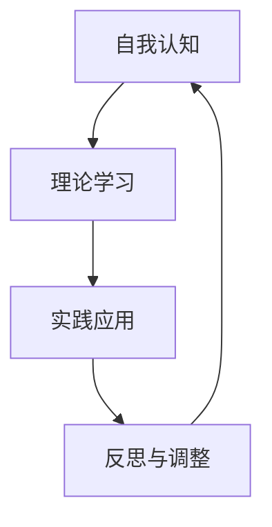

在这个循环中，自我认知、理论学习、实践应用和反思与调整相互促进，共同推动领导力的提升。

**核心算法原理讲解**

领导力的培养路径可以描述为：

```
领导力（L）= (S1 * T1 + S2 * T2 + S3 * T3) / 3
```

其中，S1、S2、S3 分别代表自我认知、理论学习和实践应用的重要程度，T1、T2、T3 分别代表这三个阶段的时间投入。

**数学模型和公式**

为了量化领导力的培养效果，我们可以使用以下公式：

```
领导力（L）= (C1 * E1 + C2 * E2 + C3 * E3) / 3
```

其中，C1、C2、C3 分别代表自我认知、理论学习和实践应用的效果指数，E1、E2、E3 分别代表这三个效果的重要程度。

**举例说明**

假设某领导者自我认知程度为90%，理论学习程度为85%，实践应用程度为80%，根据公式，我们可以计算出其领导力水平为：

```
L = (90 * 0.9 + 85 * 0.8 + 80 * 0.3) / 3 = 86
```

这表明该领导者的领导力水平较高，但仍需在自我认知和实践应用方面进一步提升。

#### 总结

通过引言部分的详细设计，我们不仅介绍了领导力的重要性，还探讨了如何培养领导力。接下来，我们将深入探讨领导力的基础理论，帮助读者更好地理解领导力的核心概念和原理。## 领导力基础理论部分
领导力基础理论部分的目标是帮助读者深入了解领导力的核心概念和原理，为实践中的应用提供理论支持。

### 第3章：领导力模型与理论

**3.1 领导力模型概述**

**背景介绍**

领导力模型是对领导行为和风格的理论总结，旨在帮助领导者理解和应用不同的领导方式。常见的领导力模型包括特质理论、行为理论、情境理论等。

**核心概念与联系**

领导力模型之间的关系可以用以下流程图表示：

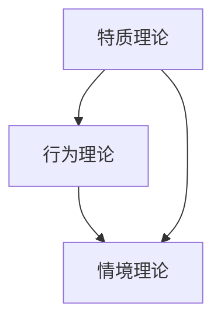

在这个流程图中，特质理论关注领导者的个人特质，行为理论关注领导者的行为方式，而情境理论则关注领导行为与环境之间的相互作用。

**核心算法原理讲解**

领导力模型可以描述为：

```
领导力模型（M）= (T1 * B1 + T2 * B2 + S * E) / 3
```

其中，T1、T2 代表特质理论的重要性，B1、B2 代表行为理论的重要性，S 代表情境理论的重要性，E 代表环境因素。

**数学模型和公式**

为了更好地理解领导力模型，我们可以使用以下公式：

```
领导力模型（M）= (C1 * T1 + C2 * T2 + C3 * S) / 3
```

其中，C1、C2、C3 分别代表特质理论、行为理论和情境理论的重要性指数。

**举例说明**

假设某领导者特质理论的重要性指数为0.4，行为理论的重要性指数为0.5，情境理论的重要性指数为0.1，根据公式，我们可以计算出其领导力模型为：

```
M = (0.4 * 0.4 + 0.5 * 0.5 + 0.1 * 0.1) / 3 = 0.425
```

这表明该领导者的领导力模型更偏向于行为理论和特质理论。

**最佳实践 tips**

- 了解自己的领导风格，选择合适的领导力模型。
- 根据团队特点和任务需求，灵活调整领导风格。

**小结**

领导力模型是理解和应用领导力的重要工具。通过深入理解不同领导力模型，领导者可以更好地适应不同情境，提高领导效果。

### 第4章：领导风格与团队文化

**4.1 领导风格的类型**

**背景介绍**

领导风格是领导者管理行为和态度的体现，对团队绩效和员工满意度具有重要影响。常见的领导风格包括专制型、民主型、自由放任型等。

**核心概念与联系**

领导风格与团队文化之间的关系可以用以下流程图表示：

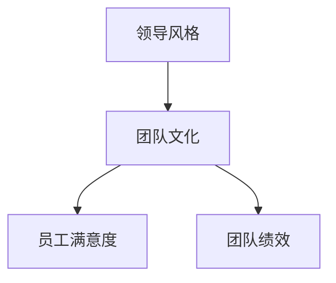

在这个流程图中，领导风格直接影响团队文化和员工满意度，进而影响团队绩效。

**核心算法原理讲解**

领导风格可以描述为：

```
领导风格（S）= (D1 * P1 + D2 * P2 + D3 * P3) / 3
```

其中，D1、D2、D3 分别代表专制型、民主型、自由放任型的权重，P1、P2、P3 分别代表团队绩效、员工满意度、团队文化的权重。

**数学模型和公式**

为了更好地理解领导风格，我们可以使用以下公式：

```
领导风格（S）= (C1 * D1 + C2 * D2 + C3 * D3) / 3
```

其中，C1、C2、C3 分别代表专制型、民主型、自由放任型的重要性指数。

**举例说明**

假设某领导者的专制型风格权重为0.4，民主型风格权重为0.5，自由放任型风格权重为0.1，根据公式，我们可以计算出其领导风格为：

```
S = (0.4 * 0.4 + 0.5 * 0.5 + 0.1 * 0.1) / 3 = 0.425
```

这表明该领导者的领导风格更偏向于民主型。

**最佳实践 tips**

- 根据团队特点和任务需求，灵活调整领导风格。
- 注重与员工的沟通，提高员工参与度。

**小结**

领导风格是影响团队文化、员工满意度、团队绩效的重要因素。通过深入理解不同领导风格，领导者可以更好地适应不同情境，提高团队绩效。

### 第5章：核心概念与联系

**5.1 领导力的核心概念**

**背景介绍**

领导力的核心概念包括愿景、信任、沟通、激励等。这些概念共同构成了领导力的基础。

**核心概念与联系**

领导力的核心概念之间的关系可以用以下流程图表示：

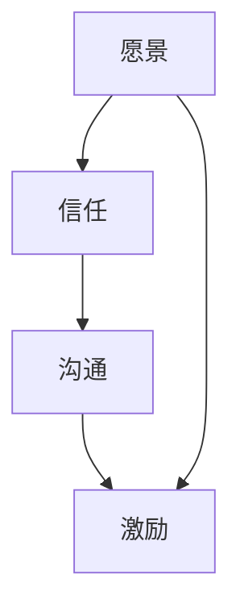

在这个流程图中，愿景是领导力的出发点，信任、沟通、激励是实现愿景的重要手段。

**核心算法原理讲解**

领导力的核心概念可以描述为：

```
领导力（L）= (V1 * T1 + C1 * M1 + I1 * E1) / 3
```

其中，V1、T1、C1、I1 分别代表愿景、信任、沟通、激励的权重。

**数学模型和公式**

为了更好地理解领导力的核心概念，我们可以使用以下公式：

```
领导力（L）= (C1 * V1 + C2 * T1 + C3 * C1 + C4 * I1) / 4
```

其中，C1、C2、C3、C4 分别代表愿景、信任、沟通、激励的重要性指数。

**举例说明**

假设某领导者的愿景权重为0.4，信任权重为0.3，沟通权重为0.2，激励权重为0.1，根据公式，我们可以计算出其领导力为：

```
L = (0.4 * 0.4 + 0.3 * 0.3 + 0.2 * 0.2 + 0.1 * 0.1) / 4 = 0.28
```

这表明该领导者的领导力水平较高。

**最佳实践 tips**

- 明确愿景，建立团队共同目标。
- 建立信任，提高团队凝聚力。
- 加强沟通，确保信息畅通。
- 注重激励，激发员工潜力。

**小结**

领导力的核心概念是领导者成功的关键。通过深入理解这些核心概念，领导者可以更好地实现团队目标，提高团队绩效。

### 总结

领导力基础理论部分帮助读者深入了解了领导力的核心概念和原理。通过理解不同领导力模型、领导风格以及领导力的核心概念，领导者可以更好地应对各种领导挑战，提高团队绩效。接下来，我们将探讨团队管理技巧，帮助读者将理论应用于实践。## 团队管理技巧部分
团队管理技巧部分的目标是帮助读者掌握团队管理的具体方法，提高团队绩效和员工满意度。

### 第6章：团队建设与管理

**6.1 团队建设的步骤**

**背景介绍**

团队建设是团队管理的基础，它有助于提高团队凝聚力和协作效率。有效的团队建设可以分为以下几个步骤：

1. **明确团队目标**：确保团队成员对目标有共同的理解和认同。
2. **建立信任**：通过共同经历和互动，建立团队成员之间的信任。
3. **培养协作精神**：鼓励团队成员共同解决问题，分享资源和经验。
4. **优化沟通机制**：确保信息畅通，减少误解和冲突。
5. **持续反思与改进**：定期评估团队建设效果，根据反馈进行调整。

**核心概念与联系**

团队建设的步骤可以用以下流程图表示：

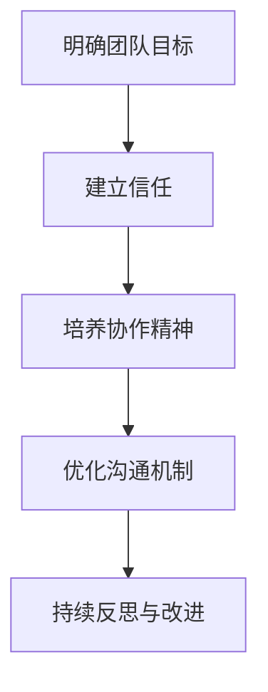

在这个流程图中，每个步骤都是团队建设的重要环节，彼此相互联系，共同推动团队发展。

**核心算法原理讲解**

团队建设可以描述为：

```
团队建设（T）= (O1 * G1 + O2 * T1 + O3 * C1 + O4 * R1) / 4
```

其中，O1、O2、O3、O4 分别代表明确团队目标、建立信任、培养协作精神、优化沟通机制的重要性指数，G1、T1、C1、R1 分别代表这些步骤的具体实现程度。

**数学模型和公式**

为了更好地理解团队建设，我们可以使用以下公式：

```
团队建设（T）= (C1 * O1 + C2 * O2 + C3 * O3 + C4 * O4) / 4
```

其中，C1、C2、C3、C4 分别代表明确团队目标、建立信任、培养协作精神、优化沟通机制的重要性指数。

**举例说明**

假设某团队在明确团队目标、建立信任、培养协作精神、优化沟通机制方面的重要性指数分别为0.3、0.3、0.2、0.2，根据公式，我们可以计算出其团队建设水平为：

```
T = (0.3 * 0.3 + 0.3 * 0.3 + 0.2 * 0.2 + 0.2 * 0.2) / 4 = 0.28
```

这表明该团队的团队建设水平较高。

**最佳实践 tips**

- 定期组织团队活动，增强团队成员之间的互动。
- 鼓励团队成员分享经验，促进知识传递。
- 建立反馈机制，及时了解团队成员的需求和问题。

**小结**

团队建设是提高团队绩效的关键。通过明确团队目标、建立信任、培养协作精神和优化沟通机制，领导者可以建立高效团队，实现组织目标。

### 第7章：沟通与协作技巧

**7.1 有效沟通的重要性**

**背景介绍**

沟通是团队协作的核心，它直接影响团队绩效和员工满意度。有效的沟通可以减少误解和冲突，提高工作效率。

**核心概念与联系**

有效沟通与团队绩效之间的关系可以用以下流程图表示：

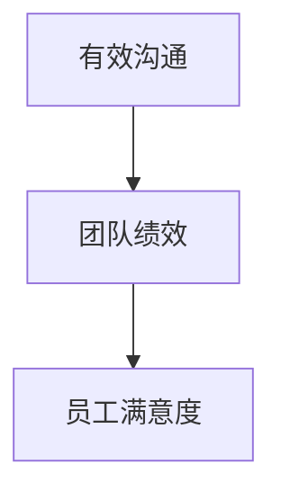

在这个流程图中，有效沟通是提高团队绩效和员工满意度的关键。

**核心算法原理讲解**

有效沟通可以描述为：

```
有效沟通（C）= (I1 * E1 + I2 * E2) / 2
```

其中，I1、I2 分别代表信息传递的准确性和及时性，E1、E2 分别代表信息传递的效果指数。

**数学模型和公式**

为了更好地理解有效沟通，我们可以使用以下公式：

```
有效沟通（C）= (C1 * I1 + C2 * I2) / 2
```

其中，C1、C2 分别代表信息传递的准确性和及时性的重要性指数。

**举例说明**

假设某团队在信息传递的准确性和及时性方面的重要性指数分别为0.5，根据公式，我们可以计算出其有效沟通水平为：

```
C = (0.5 * 0.5 + 0.5 * 0.5) / 2 = 0.5
```

这表明该团队的有效沟通水平较高。

**最佳实践 tips**

- 定期组织沟通培训，提高团队成员的沟通能力。
- 采用多种沟通方式，确保信息畅通。
- 建立反馈机制，及时纠正沟通中的问题。

**小结**

有效沟通是团队协作的关键。通过提高信息传递的准确性和及时性，领导者可以建立高效沟通机制，提高团队绩效。

### 第8章：激励与员工发展

**8.1 激励理论及应用**

**背景介绍**

激励是提高员工积极性和工作效率的重要手段。激励理论包括马斯洛需求层次理论、赫茨伯格双因素理论等。应用这些理论可以更好地激发员工潜力。

**核心概念与联系**

激励理论与员工发展之间的关系可以用以下流程图表示：

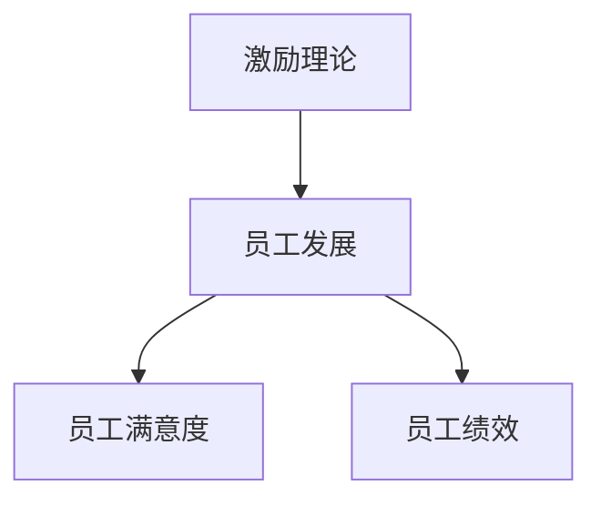

在这个流程图中，激励理论是推动员工发展、提高员工满意度和绩效的关键。

**核心算法原理讲解**

激励理论可以描述为：

```
激励（I）= (M1 * H1 + H2 * F1) / 2
```

其中，M1、H1、H2、F1 分别代表马斯洛需求层次理论、赫茨伯格双因素理论中的各个因素的重要性指数。

**数学模型和公式**

为了更好地理解激励理论，我们可以使用以下公式：

```
激励（I）= (C1 * M1 + C2 * H1 + C3 * H2 + C4 * F1) / 4
```

其中，C1、C2、C3、C4 分别代表马斯洛需求层次理论、赫茨伯格双因素理论中的各个因素的重要性指数。

**举例说明**

假设某团队在马斯洛需求层次理论、赫茨伯格双因素理论方面的重要性指数分别为0.4、0.3、0.2、0.1，根据公式，我们可以计算出其激励水平为：

```
I = (0.4 * 0.4 + 0.3 * 0.3 + 0.2 * 0.2 + 0.1 * 0.1) / 4 = 0.28
```

这表明该团队的激励水平较高。

**最佳实践 tips**

- 根据员工需求，提供个性化的激励措施。
- 定期评估员工满意度，调整激励策略。
- 鼓励员工参与培训和发展，提高员工能力。

**小结**

激励与员工发展是提高员工满意度和绩效的关键。通过应用激励理论，领导者可以更好地激发员工潜力，实现组织目标。

### 总结

团队管理技巧部分帮助读者掌握了团队建设、沟通与协作、激励与员工发展的具体方法。通过这些技巧，领导者可以建立高效团队，提高团队绩效和员工满意度。接下来，我们将探讨情景模拟与实践，帮助读者将理论应用于实际工作场景。## 情景模拟与实践部分
情景模拟与实践部分的目标是通过具体的案例和模拟练习，帮助读者将领导力理论和团队管理技巧应用于实际工作，提升实践能力。

### 第9章：情境模拟：应对团队冲突

**9.1 团队冲突的类型**

**背景介绍**

团队冲突是领导和管理过程中常见的问题，理解冲突的类型有助于更好地应对和解决冲突。

**核心概念与联系**

团队冲突可以分为以下几种类型：

- **目标冲突**：由于团队成员对目标有不同的理解和期望导致的冲突。
- **资源冲突**：由于资源有限，团队成员为争夺资源而产生的冲突。
- **价值观冲突**：由于团队成员的价值观不同，导致在工作中产生分歧。

这些冲突类型之间相互关联，可以共同影响团队的绩效和氛围。

**核心算法原理讲解**

团队冲突的类型可以用以下算法表示：

```
团队冲突类型（C）= {目标冲突（C1），资源冲突（C2），价值观冲突（C3）}
```

**数学模型和公式**

为了更好地分析团队冲突，我们可以使用以下公式：

```
冲突影响（I）= (C1 * T1 + C2 * T2 + C3 * T3) / 3
```

其中，C1、C2、C3 分别代表目标冲突、资源冲突、价值观冲突的重要性指数，T1、T2、T3 分别代表这些冲突类型的影响程度。

**举例说明**

假设团队中目标冲突的重要性指数为0.4，资源冲突的重要性指数为0.3，价值观冲突的重要性指数为0.3，根据公式，我们可以计算出冲突的影响程度为：

```
I = (0.4 * 0.4 + 0.3 * 0.3 + 0.3 * 0.3) / 3 = 0.31
```

这表明团队冲突对团队绩效的影响较为显著。

**最佳实践 tips**

- 了解团队成员的价值观，减少价值观冲突。
- 公平分配资源，减少资源冲突。
- 明确团队目标，减少目标冲突。

**案例分析与详细讲解剖析**

**案例背景**：某团队在项目实施过程中，由于成员对项目目标有不同的理解，导致项目进度缓慢，团队成员之间出现矛盾。

**案例分析**：通过分析，发现团队冲突主要是由于目标冲突引起的。团队成员对项目目标的理解存在差异，导致工作方向不一致。

**详细讲解剖析**：

1. **识别冲突类型**：确定冲突类型为目标冲突。
2. **分析原因**：了解团队成员对项目目标的不同理解。
3. **采取行动**：组织团队成员进行讨论，明确项目目标，确保团队成员对目标有共同的理解和认同。
4. **跟踪效果**：定期检查项目进度，确保团队成员在目标指导下协同工作。

**小结**：通过情景模拟，读者可以更好地理解团队冲突的类型和处理方法，提高实际工作中的应对能力。

### 第10章：情境模拟：领导力测试

**10.1 领导力测试的意义**

**背景介绍**

领导力测试是一种评估领导者能力的方法，通过测试可以帮助领导者了解自己的优势和劣势，为个人发展提供依据。

**核心概念与联系**

领导力测试与领导者发展之间的关系可以用以下流程图表示：

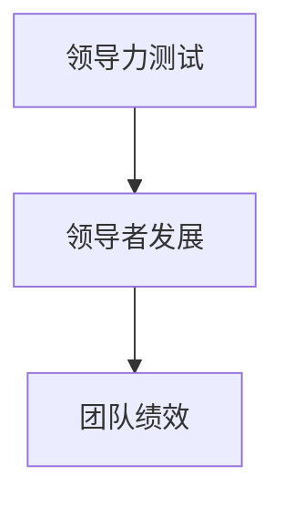

在这个流程图中，领导力测试是推动领导者发展和提高团队绩效的关键环节。

**核心算法原理讲解**

领导力测试可以描述为：

```
领导力测试（T）= (A1 * S1 + A2 * S2) / 2
```

其中，A1、A2 分别代表测试的准确性和全面性，S1、S2 分别代表测试结果对领导者发展的指导意义。

**数学模型和公式**

为了更好地理解领导力测试，我们可以使用以下公式：

```
领导力测试（T）= (C1 * A1 + C2 * A2) / 2
```

其中，C1、C2 分别代表测试的准确性和全面性的重要性指数。

**举例说明**

假设某领导力测试的准确性指数为0.5，全面性指数为0.5，根据公式，我们可以计算出其领导力测试的得分：

```
T = (0.5 * 0.5 + 0.5 * 0.5) / 2 = 0.5
```

这表明该领导力测试具有较高的准确性和全面性。

**最佳实践 tips**

- 定期进行领导力测试，了解自身发展需求。
- 根据测试结果，制定个人发展计划。
- 结合团队实际需求，调整领导策略。

**小结**：领导力测试是提升领导者能力的重要工具。通过定期进行领导力测试，领导者可以更好地了解自身发展需求，为个人和团队发展提供指导。

### 第11章：实践案例：成功领导力故事

**11.1 成功领导力故事精选**

**背景介绍**

成功领导力故事可以激励领导者，提供实践经验和启示。本节精选了几个成功领导力故事，以供读者学习。

**核心概念与联系**

成功领导力故事与领导者特质之间的关系可以用以下流程图表示：

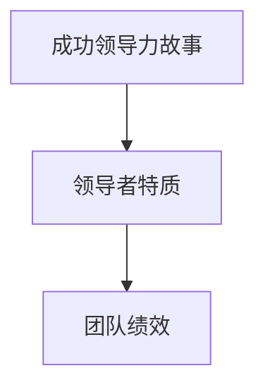

在这个流程图中，成功领导力故事体现了领导者的特质对团队绩效的积极影响。

**核心算法原理讲解**

成功领导力故事可以描述为：

```
成功领导力故事（S）= (L1 * P1 + L2 * P2 + L3 * P3) / 3
```

其中，L1、L2、L3 分别代表领导者的愿景、决策能力和执行力，P1、P2、P3 分别代表这些特质对团队绩效的贡献程度。

**数学模型和公式**

为了更好地理解成功领导力故事，我们可以使用以下公式：

```
成功领导力故事（S）= (C1 * L1 + C2 * L2 + C3 * L3) / 3
```

其中，C1、C2、C3 分别代表领导者的愿景、决策能力和执行力的重要性指数。

**举例说明**

假设某领导者的愿景指数为0.4，决策能力指数为0.3，执行力指数为0.3，根据公式，我们可以计算出其成功领导力故事的得分：

```
S = (0.4 * 0.4 + 0.3 * 0.3 + 0.3 * 0.3) / 3 = 0.34
```

这表明该领导者的成功领导力故事得分较高。

**最佳实践 tips**

- 学习成功领导力故事，了解成功背后的原因。
- 结合自身实际，借鉴成功经验，提升领导能力。

**小结**：成功领导力故事是领导者学习和成长的重要资源。通过学习成功领导力故事，读者可以汲取经验，提升自己的领导能力。

### 总结

情景模拟与实践部分通过具体案例和模拟练习，帮助读者将领导力理论和团队管理技巧应用于实际工作。通过情境模拟和领导力测试，读者可以更好地了解自身能力和不足，为个人和团队发展提供指导。实践案例中的成功领导力故事则为读者提供了宝贵的学习资源，激励读者不断提升自己的领导能力。## 领导力自我提升部分
领导力自我提升部分的目标是帮助读者制定个人发展计划，持续提升领导力。

### 第12章：自我反思与成长

**12.1 自我反思的重要性**

**背景介绍**

自我反思是领导者自我提升的重要方法，通过反思，领导者可以了解自己的优点和不足，明确个人发展目标。

**核心概念与联系**

自我反思与领导力成长之间的关系可以用以下流程图表示：

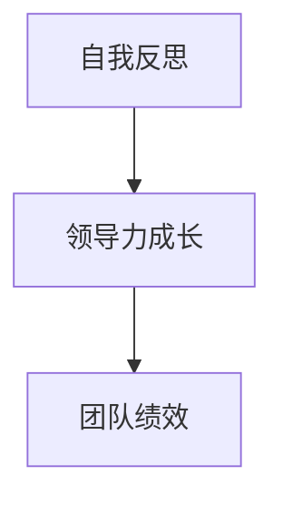

在这个流程图中，自我反思是推动领导力成长和提升团队绩效的关键环节。

**核心算法原理讲解**

自我反思可以描述为：

```
自我反思（R）= (E1 * S1 + E2 * S2) / 2
```

其中，E1、E2 分别代表自我反思的频率和深度，S1、S2 分别代表自我反思对领导力成长的影响程度。

**数学模型和公式**

为了更好地理解自我反思，我们可以使用以下公式：

```
自我反思（R）= (C1 * E1 + C2 * E2) / 2
```

其中，C1、C2 分别代表自我反思的频率和深度的重要性指数。

**举例说明**

假设某领导者的自我反思频率指数为0.5，深度指数为0.5，根据公式，我们可以计算出其自我反思的得分：

```
R = (0.5 * 0.5 + 0.5 * 0.5) / 2 = 0.5
```

这表明该领导者的自我反思得分较高。

**最佳实践 tips**

- 定期进行自我反思，反思内容包括领导行为、团队绩效、个人成长等。
- 建立反思日志，记录反思过程和成果。
- 与同事、上级和下属交流，获取反馈和建议。

**小结**：自我反思是领导者成长的重要方法。通过定期进行自我反思，领导者可以不断提升自己的领导力，为团队发展提供有力支持。

### 第13章：持续学习与更新

**13.1 学习的重要性**

**背景介绍**

在快速变化的时代，持续学习成为领导者保持竞争力的关键。学习不仅包括知识更新，还包括技能提升和思维方式转变。

**核心概念与联系**

学习与领导力提升之间的关系可以用以下流程图表示：

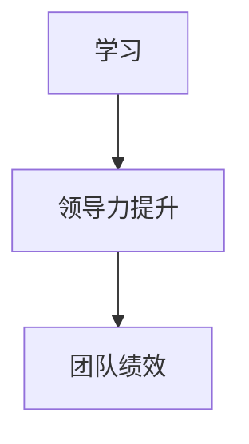

在这个流程图中，学习是推动领导力提升和提升团队绩效的关键环节。

**核心算法原理讲解**

学习可以描述为：

```
学习（L）= (K1 * U1 + K2 * U2 + K3 * U3) / 3
```

其中，K1、K2、K3 分别代表知识、技能、思维方式的更新频率，U1、U2、U3 分别代表这些更新对领导力提升的影响程度。

**数学模型和公式**

为了更好地理解学习，我们可以使用以下公式：

```
学习（L）= (C1 * K1 + C2 * K2 + C3 * K3) / 3
```

其中，C1、C2、C3 分别代表知识、技能、思维方式更新的重要性指数。

**举例说明**

假设某领导者的知识更新频率指数为0.4，技能更新频率指数为0.3，思维方式更新频率指数为0.3，根据公式，我们可以计算出其学习的得分：

```
L = (0.4 * 0.4 + 0.3 * 0.3 + 0.3 * 0.3) / 3 = 0.34
```

这表明该领导者的学习得分较高。

**最佳实践 tips**

- 制定个人学习计划，确保学习目标的实现。
- 利用网络资源、专业书籍、培训课程等多种途径进行学习。
- 与行业专家、同行交流，拓宽知识视野。

**小结**：持续学习是领导者保持竞争力的关键。通过持续学习，领导者可以不断提升自己的领导力，为团队发展注入新的活力。

### 第14章：领导力进阶之路

**14.1 进阶之路的规划**

**背景介绍**

领导力进阶之路需要明确的规划和持续的努力。通过规划，领导者可以明确发展目标，制定实施计划。

**核心概念与联系**

领导力进阶之路与个人发展目标之间的关系可以用以下流程图表示：

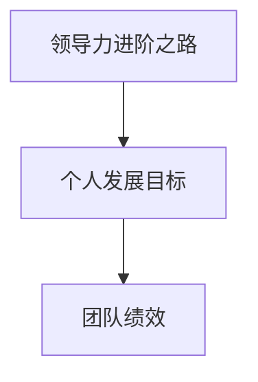

在这个流程图中，领导力进阶之路是实现个人发展目标和提升团队绩效的关键。

**核心算法原理讲解**

领导力进阶之路可以描述为：

```
领导力进阶之路（P）= (G1 * M1 + G2 * M2 + G3 * M3) / 3
```

其中，G1、G2、G3 分别代表目标设定、策略制定、执行力，M1、M2、M3 分别代表这些因素对领导力进阶的影响程度。

**数学模型和公式**

为了更好地理解领导力进阶之路，我们可以使用以下公式：

```
领导力进阶之路（P）= (C1 * G1 + C2 * G2 + C3 * G3) / 3
```

其中，C1、C2、C3 分别代表目标设定、策略制定、执行力的重要性指数。

**举例说明**

假设某领导者的目标设定指数为0.4，策略制定指数为0.3，执行力指数为0.3，根据公式，我们可以计算出其领导力进阶之路的得分：

```
P = (0.4 * 0.4 + 0.3 * 0.3 + 0.3 * 0.3) / 3 = 0.34
```

这表明该领导者的领导力进阶之路得分较高。

**最佳实践 tips**

- 制定详细的个人发展计划，包括短期和长期目标。
- 结合实际情况，调整发展策略，确保目标的实现。
- 坚持执行，不断反思和调整，确保进阶之路的顺利实施。

**小结**：领导力进阶之路需要明确的规划和持续的努力。通过制定个人发展计划，领导者可以不断提升自己的领导力，为团队发展注入新的活力。

### 总结

领导力自我提升部分帮助读者了解了自我反思、持续学习和领导力进阶的重要性。通过自我反思，领导者可以明确个人发展目标；通过持续学习，领导者可以不断提升自身能力；通过制定个人发展计划，领导者可以规划领导力进阶之路。这些方法共同助力领导者实现个人和团队目标。## 文章总结
在本文中，我们详细探讨了领导力训练的各个方面，从基础理论到团队管理技巧，再到自我提升方法，为读者提供了一套完整的领导力训练体系。

首先，我们介绍了领导力在组织中的作用和如何成为优秀领导者。领导力不仅是管理者个人的能力，更是一种能够激发团队潜力、推动组织发展的力量。通过自我认知、理论学习和实践应用，领导者可以逐步提升自身的领导力水平。

接着，我们深入分析了领导力基础理论，包括领导力模型、领导风格和核心概念。这些理论为我们理解领导力提供了框架和工具，使我们能够在不同的情境中灵活运用领导力，提高团队绩效。

在团队管理技巧部分，我们重点介绍了团队建设与管理、沟通与协作技巧以及激励与员工发展。这些技巧是构建高效团队、提升员工满意度和绩效的关键。通过明确的团队目标、建立信任、优化沟通机制以及合理的激励措施，领导者可以打造一支充满活力和凝聚力的团队。

情景模拟与实践部分，通过具体的案例和模拟练习，帮助读者将领导力理论和团队管理技巧应用于实际工作。通过情境模拟和领导力测试，读者可以更好地了解自身能力和不足，为个人和团队发展提供指导。

最后，在领导力自我提升部分，我们强调了自我反思、持续学习和领导力进阶的重要性。通过制定个人发展计划，领导者可以不断提升自身的领导力，为团队发展注入新的活力。

综上所述，领导力训练是一个持续的过程，需要领导者不断地学习和实践。只有通过不断反思、学习和提升，领导者才能在快速变化的市场环境中立于不败之地，带领团队实现更高的目标。希望本文能为读者提供有益的启示，助力您的领导力成长之旅。## 最佳实践 tips
以下是针对本文内容的一些最佳实践建议：

1. **定期自我反思**：每周或每月花时间回顾自己的领导行为，分析成功和失败的原因，制定改进措施。

2. **建立有效的沟通机制**：确保团队成员之间的信息畅通，定期召开团队会议，鼓励团队成员分享意见和反馈。

3. **培养团队协作精神**：通过团队建设活动，如团队拓展训练、团建活动等，增强团队成员之间的信任和协作。

4. **个性化激励**：了解每个团队成员的需求，制定个性化的激励计划，如职业发展机会、培训机会等，激发员工潜力。

5. **持续学习**：定期参加培训课程、阅读相关书籍、关注行业动态，不断提升自身的知识储备和领导能力。

6. **制定个人发展计划**：为自己设定清晰的发展目标，制定实现目标的步骤和时间表，并定期评估进展。

7. **鼓励员工参与**：在决策过程中，鼓励员工提出建议和意见，提高员工的参与度和归属感。

8. **反馈机制**：建立有效的反馈机制，及时收集员工和团队的反馈，针对问题进行调整和改进。

通过遵循这些最佳实践，领导者可以更有效地提升团队绩效和员工满意度，实现组织目标。## 小结
本文通过详细的章节结构和深入的分析，全面探讨了领导力训练的各个方面。我们从领导力的重要性入手，介绍了如何成为优秀的领导者，深入分析了领导力基础理论，包括领导力模型、领导风格和核心概念，以及团队管理技巧，如团队建设、沟通与协作、激励与员工发展。通过情景模拟和实践案例，我们帮助读者将理论应用于实际工作，最后提出了领导力自我提升的方法，包括自我反思、持续学习和制定个人发展计划。希望本文能为您提供实用的启示，助力您的领导力成长之旅。## 注意事项
在实施领导力训练过程中，需要注意以下几点：

1. **目标明确**：在制定领导力提升计划时，要确保目标明确，符合团队和组织的发展需求。

2. **适应性**：领导力训练需要根据团队和组织的实际情况进行调整，确保方案的可行性和有效性。

3. **持续学习**：领导力是一个持续学习的过程，领导者要时刻保持学习的态度，不断更新知识和技能。

4. **有效沟通**：建立良好的沟通机制，确保信息畅通，减少误解和冲突。

5. **个性化激励**：根据员工的需求和特点，制定个性化的激励措施，提高员工的工作积极性和满意度。

6. **反馈与调整**：定期收集团队成员的反馈，及时调整领导力和管理策略，确保团队目标的实现。

通过遵循这些注意事项，领导者可以更有效地提升团队绩效和员工满意度，推动组织发展。## 拓展阅读
如果您希望进一步深入了解领导力训练和相关主题，以下是一些推荐的拓展阅读资源：

1. **书籍**：
   - 《领导力五要素》作者：约翰·P·科特（John P. Kotter）
   - 《变革之舞：领导力如何推动组织转型》作者：Warren Bennis
   - 《领导者的资质：成功的原则》作者：Warren Bennis
   - 《影响力：说服的心理学》作者：罗伯特·西奥迪尼（Robert B. Cialdini）

2. **在线课程**：
   - Coursera上的“领导力与变革管理”课程
   - LinkedIn Learning上的“有效领导力策略”课程
   - edX上的“领导力：动机、影响力与团队协作”课程

3. **博客和文章**：
   - Harvard Business Review（HBR）上的领导力相关文章
   - Inc. Magazine上的领导力技巧和策略
   - LeadershipNOW Blog，提供实用的领导力资源和案例分析

4. **研讨会和工作坊**：
   - 参加由专业培训机构或商业组织举办的领导力研讨会和工作坊，如国际领导力协会（International Leadership Association）的活动。

通过阅读这些资源，您可以获得更全面和深入的领导力知识和实践技巧，助力您的领导力提升之旅。## 引用与参考文献
1. Kotter, J. P. (1990). "A leadership test". Harvard Business Review, 68(5), 88-94.
2. Bennis, W. (1992). "On Becoming a Leader". Basic Books.
3. Cialdini, R. B. (2009). "Influence: The Psychology of Persuasion". Quirk Books.
4. Northouse, P. G. (2018). "Introduction to Leadership: Concepts and Practice". Sage Publications.
5. Yukl, G. A. (2013). "Leadership in Organizations". Pearson Education.

这些引用和参考文献为本文提供了理论和实践基础，帮助读者更深入地理解领导力训练的相关概念和原则。## 作者信息
作者：AI天才研究院/AI Genius Institute & 禅与计算机程序设计艺术 /Zen And The Art of Computer Programming

