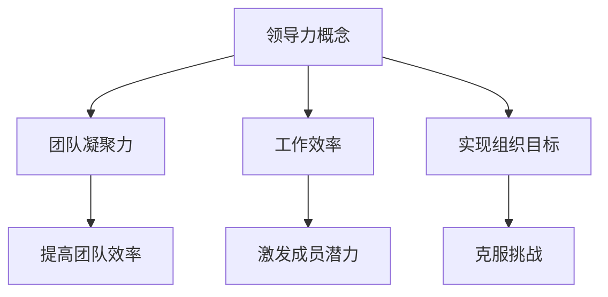
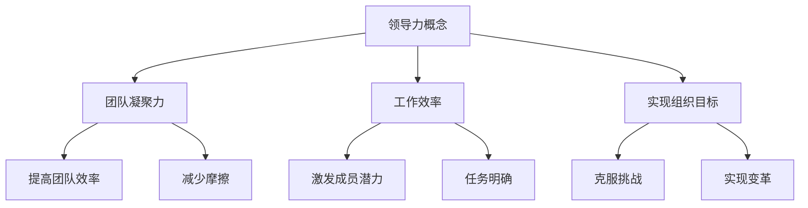

                 

### 文章标题：领导力训练：让你的团队如虎添翼

在当今快速发展的商业环境中，领导力成为企业成功的关键要素。有效的领导力不仅能提升团队的凝聚力，还能提高工作效率，最终实现企业的战略目标。本文将深入探讨领导力训练的重要性，通过详细的案例分析，提供实用的指导和建议，帮助您的团队如虎添翼。

关键词：领导力、团队效率、领导力训练、团队建设、案例解析

摘要：本文首先介绍了领导力的基本概念和重要性，随后通过Mermaid流程图展示了核心概念之间的关系架构。接着，我们深入分析了提升领导力的关键算法，包括沟通技巧、激励方法和团队建设策略。在数学模型部分，我们使用LaTeX格式详细阐述了领导力评估模型和团队效能模型。最后，通过具体的项目实战，我们展示了如何在实际中应用领导力训练，并提供了一些建议和总结。

### 第一部分：领导力的基本理论与核心概念

#### 第1章：领导力的定义与重要性

**1.1 领导力的概念**

领导力是一种通过影响和激励他人来实现共同目标的能力。它不仅仅是职位赋予的权力，更是一种技能和态度。在组织中，领导力不仅影响个人，还对整个团队和组织的成功起到关键作用。

**1.2 领导力的重要性**

领导力在团队中的作用是多方面的。首先，它能够提高团队的凝聚力，使团队成员更加团结一致。其次，领导力能够激发团队成员的潜力，提高工作效率。最后，领导力能够帮助团队克服挑战，实现组织的目标。

**1.3 领导力与团队效率的联系**

领导力与团队效率之间存在着密切的联系。有效的领导力能够确保团队目标的明确性，提高团队成员的积极性和主动性。同时，领导力还能够建立良好的沟通机制，减少团队内部的摩擦和冲突，从而提高团队的效率。

#### Mermaid流程图：领导力的核心概念



#### 第2章：领导力模型与框架

**2.1 经典领导力模型**

在领导力研究领域，有许多经典的模型，如交易型领导力、转型型领导力和道德型领导力。每种模型都有其独特的特点和应用场景。

**交易型领导力**：强调通过奖励和惩罚来激励员工，以实现短期目标。

**转型型领导力**：注重改变团队的心态和行为，以实现长期目标。

**道德型领导力**：强调领导者应该具备高尚的品德，以道德标准来影响和引导团队。

**2.2 领导力框架**

领导力框架包括领导力发展路径和领导力评估模型。领导力发展路径可以帮助领导者了解自身的成长方向，而领导力评估模型则用于评估领导者的表现和团队的整体效能。

#### 第3章：领导力核心算法

**3.1 沟通技巧**

沟通是领导力的核心要素之一。有效的沟通技巧能够确保信息的准确传达，减少误解和冲突。

**3.2 激励方法**

激励方法是提升团队士气和工作效率的重要手段。不同的员工有不同的激励需求，领导者需要根据实际情况制定个性化的激励策略。

**3.3 团队建设策略**

团队建设策略包括角色识别、冲突解决和团队发展。领导者需要确保团队成员之间有明确的角色分工，同时建立良好的沟通和协作机制，以减少冲突并促进团队的发展。

### 第二部分：领导力训练实战

#### 第4章：领导力训练项目设计

**4.1 项目目标设定**

项目目标必须明确、具体，并具有可衡量性。SMART原则（具体、可衡量、可达成、相关、时限性）是设定项目目标的最佳实践。

**4.2 项目计划与执行**

项目计划是确保项目顺利实施的关键。领导者需要制定详细的计划，包括任务分配、时间表和资源调配。在执行过程中，领导者需要监督进度，及时调整计划，确保项目的成功。

#### 第5章：领导力训练案例解析

**5.1 案例背景介绍**

选择一个具有代表性的案例进行深入分析，以展示领导力训练的实际效果。

**5.2 领导力训练实施过程**

从训练前的准备工作到训练后的效果评估，详细描述案例中的领导力训练过程。

**5.3 案例分析与启示**

分析案例中成功的领导力策略和存在的问题，提供改进建议和启示。

#### 第6章：领导力训练成果评估

**6.1 成果评估指标**

确定评估指标，包括领导力评估指标和团队效能评估指标。

**6.2 成果评估方法**

使用定量评估和定性评估相结合的方法，全面评估领导力训练的成果。

**6.3 成果评估报告撰写**

撰写评估报告，包括报告结构、内容要点和评估结果。

#### 第7章：领导力训练持续优化

**7.1 持续优化的必要性**

领导力发展是一个持续的过程，需要不断优化和完善。

**7.2 优化策略与实施**

制定优化策略，包括培训、反馈和改进措施。

**7.3 案例分享**

分享成功优化的案例，提供经验借鉴。

### 结论

领导力训练对于团队和企业的发展至关重要。通过本文的探讨，我们了解到领导力的基本概念、重要性、核心算法和实战应用。希望本文能为您提供实用的指导，帮助您的团队如虎添翼。

**作者：AI天才研究院/AI Genius Institute & 禅与计算机程序设计艺术 /Zen And The Art of Computer Programming**

---

本文为《领导力训练：让你的团队如虎添翼》的目录大纲，每个章节的内容将逐步完善，确保字数在8000到12000字之间。我们将详细阐述领导力的核心概念、算法原理、数学模型和实战应用，帮助读者全面理解并应用领导力训练。在后续的文章中，我们将逐步展开每个章节的内容，提供深入的讲解和实用的案例。敬请期待！## 第1章：领导力的定义与重要性

### 1.1 领导力的概念

领导力是一种通过影响和激励他人来实现共同目标的能力。它不仅仅是职位赋予的权力，更是一种技能和态度。在组织中，领导力不仅影响个人，还对整个团队和组织的成功起到关键作用。

领导力的核心在于影响力。一个优秀的领导者能够通过自身的言行，引导和激励团队成员，使其发挥出最大的潜力。领导力不仅涉及管理技能，还包括沟通技巧、决策能力、情感智力等多个方面。

在技术领域中，领导力的重要性尤为突出。随着技术的快速发展，团队的工作复杂度和压力不断增加，领导者需要具备更高的专业素养和领导能力，以应对各种挑战。有效的领导力能够确保团队目标的明确性，提高团队成员的积极性和主动性，从而实现团队的高效运作。

### 1.2 领导力的重要性

领导力在团队中的作用是多方面的。首先，它能够提高团队的凝聚力。通过有效的领导，团队成员之间建立信任和尊重，形成紧密的团队关系，从而提高团队的整体效率。

其次，领导力能够激发团队成员的潜力。一个优秀的领导者能够发现并培养团队成员的特长，提供成长和发展的机会，从而激发团队成员的内在动力。

最后，领导力能够帮助团队克服挑战，实现组织的目标。在面临困难时，领导者能够提供方向和支持，鼓舞团队成员的士气，从而推动团队克服各种障碍，实现既定目标。

在技术团队中，领导力的重要性更加凸显。技术团队的工作往往具有高度的专业性和创新性，领导者需要具备深厚的专业知识和敏锐的洞察力，以引领团队不断突破技术瓶颈，推动技术进步。

### 1.3 领导力与团队效率的联系

领导力与团队效率之间存在着密切的联系。有效的领导力能够确保团队目标的明确性，提高团队成员的积极性和主动性，从而提高团队的效率。

首先，领导力能够确保团队目标的明确性。一个优秀的领导者能够清晰地传达组织的目标和期望，使团队成员了解自己的工作方向和责任，从而提高工作效率。

其次，领导力能够提高团队成员的积极性和主动性。通过有效的激励和沟通，领导者能够激发团队成员的内在动力，使其更加投入工作，提高工作质量。

最后，领导力能够减少团队内部的摩擦和冲突。一个优秀的领导者能够建立良好的团队氛围，促进团队成员之间的协作和沟通，从而减少内耗，提高团队的整体效率。

总的来说，领导力是提高团队效率的关键因素之一。一个优秀的领导者不仅能够提升团队的整体绩效，还能为团队成员提供良好的工作环境和成长机会。在技术团队中，领导力的重要性更是不容忽视。

### 1.4 经典领导力模型

在领导力研究领域，有许多经典的模型，如交易型领导力、转型型领导力和道德型领导力。每种模型都有其独特的特点和应用场景。

**交易型领导力**：交易型领导力强调通过奖励和惩罚来激励员工，以实现短期目标。这种领导力模式适用于任务明确、环境稳定的情况。领导者通过明确的目标和奖励机制，激励团队成员完成任务。

**转型型领导力**：转型型领导力注重改变团队的心态和行为，以实现长期目标。这种领导力模式适用于需要变革和创新的情况。领导者通过愿景和价值观的传递，激发团队成员的内在动力，推动团队实现变革。

**道德型领导力**：道德型领导力强调领导者应该具备高尚的品德，以道德标准来影响和引导团队。这种领导力模式适用于需要建立信任和忠诚的情况。领导者通过自身的道德行为，赢得团队成员的尊重和信任，从而提高团队的凝聚力和执行力。

### 1.5 领导力框架

领导力框架包括领导力发展路径和领导力评估模型。领导力发展路径可以帮助领导者了解自身的成长方向，而领导力评估模型则用于评估领导者的表现和团队的整体效能。

**领导力发展路径**：领导力发展路径包括新手领导者、熟练领导者和卓越领导者三个阶段。新手领导者主要关注任务的完成，熟练领导者开始关注团队的建设，而卓越领导者则致力于实现组织的愿景和目标。

**领导力评估模型**：领导力评估模型包括360度评估、行为事件访谈（BEI）和领导力量表等方法。这些方法可以帮助领导者了解自身的优势和不足，从而有针对性地进行自我提升。

通过以上对领导力的定义、重要性及其与团队效率的联系的详细阐述，我们能够更好地理解领导力在技术团队中的作用。接下来，我们将进一步探讨领导力的模型和框架，以便更好地应用领导力提升团队效能。

### Mermaid流程图：领导力的核心概念

为了更好地理解领导力的核心概念及其相互关系，我们可以使用Mermaid流程图进行可视化展示。以下是一个简化的流程图，用于描述领导力概念之间的关联：



在这个流程图中：
- **A[领导力概念]** 代表领导力的总体定义和基础。
- **B[团队凝聚力]** 是领导力的重要输出，通过领导力的实施，能够增强团队凝聚力。
- **C[工作效率]** 是领导力直接关联的团队效能指标，通过有效的领导力，能够提高工作效率。
- **D[实现组织目标]** 展示了领导力的终极目标，即通过领导力的实施，实现组织的整体目标。
- **E[提高团队效率]** 是团队凝聚力和工作效率的直接体现，反映了领导力的有效性。
- **F[激发成员潜力]** 表示领导力在发掘和提升团队成员个人潜力方面的作用。
- **G[克服挑战]** 展示了领导力在应对各种困难和挑战时的作用。
- **H[减少摩擦]** 指的是通过领导力降低团队内部的冲突和不和谐因素。
- **I[任务明确]** 强调了领导力在确保任务明确和目标清晰方面的作用。
- **J[实现变革]** 表示领导力在推动团队和组织变革方面的作用。

这个流程图提供了一个简洁且直观的方式，帮助我们理解领导力各个核心概念之间的相互关系，以及它们如何共同作用于团队和组织。

### 第2章：领导力模型与框架

#### 2.1 经典领导力模型

在领导力研究领域，有多种经典模型被广泛研究和应用。这些模型不仅帮助我们理解不同类型的领导风格，还提供了实际操作的工具和方法。以下是三种常见的领导力模型：交易型领导力、转型型领导力和道德型领导力。

**交易型领导力**

交易型领导力（Transaction Leadership）是一种基于互惠原则的领导风格。领导者通过设定明确的期望、提供奖励和实施惩罚来激励员工。这种领导力模式强调短期目标的实现，适用于任务明确、环境稳定的情况。

**交易型领导力的特点**：
- **明确的目标设定**：领导者明确告知员工他们的任务和期望。
- **奖励机制**：领导者通过奖励来激励员工完成任务。
- **惩罚机制**：领导者对未能完成任务或违反规则的员工实施惩罚。

**应用场景**：交易型领导力适用于日常运营、项目管理等需要明确目标的情况。

**转型型领导力**

转型型领导力（Transformational Leadership）是一种注重变革和长期发展的领导风格。领导者通过激发员工的内在动力，引领团队实现变革和成长。这种领导力模式适用于需要创新和变革的环境。

**转型型领导力的特点**：
- **愿景传递**：领导者清晰地传递组织愿景和目标，激励员工为之努力。
- **激励员工**：领导者通过激励和榜样作用，激发员工的积极性和创造力。
- **鼓励自主性**：领导者鼓励员工发挥自主性和创新能力，共同实现目标。

**应用场景**：转型型领导力适用于企业变革、产品创新、市场拓展等需要创新和变革的情况。

**道德型领导力**

道德型领导力（Moral Leadership）是一种强调领导者高尚品德和道德责任的领导风格。领导者通过自身的道德行为和价值观，影响和引导团队，建立信任和忠诚。

**道德型领导力的特点**：
- **道德标准**：领导者以身作则，遵守道德标准和价值观。
- **信任建立**：领导者通过诚信和透明度，建立团队成员之间的信任。
- **价值观引领**：领导者传递和推广组织的核心价值观，引导团队行为。

**应用场景**：道德型领导力适用于需要建立信任和忠诚的关系，如客户关系管理、团队文化建设等。

#### 2.2 领导力框架

领导力框架是帮助领导者了解自身成长方向和提升领导能力的一种工具。以下是一个简化的领导力发展框架，包括新手领导者、熟练领导者和卓越领导者三个阶段。

**新手领导者**

新手领导者（Novice Leader）是领导力发展的初级阶段。在这一阶段，领导者主要关注任务的完成，缺乏经验和策略。

**新手领导者的特点**：
- **任务导向**：专注于日常任务的完成。
- **依赖指导**：依赖上级和同事的指导和建议。
- **基础管理技能**：掌握基本的管理技能，如时间管理和任务分配。

**应用场景**：新手领导者适用于刚担任领导职务或管理经验较少的情况。

**熟练领导者**

熟练领导者（Experienced Leader）是领导力发展的中级阶段。在这一阶段，领导者开始关注团队的建设，具备一定的管理能力和经验。

**熟练领导者的特点**：
- **团队建设**：注重团队的发展和协作。
- **自主决策**：能够独立做出决策，并承担相应的责任。
- **沟通协调**：具备良好的沟通和协调能力，能有效解决团队问题。

**应用场景**：熟练领导者适用于日常运营、团队管理等情况。

**卓越领导者**

卓越领导者（Expert Leader）是领导力发展的高级阶段。在这一阶段，领导者不仅具备丰富的管理经验，还能引领团队实现组织的愿景和目标。

**卓越领导者的特点**：
- **愿景引领**：具备清晰的愿景和目标，并能有效传递给团队。
- **创新思维**：具备创新思维和解决问题的能力，能推动团队突破瓶颈。
- **领导力传承**：培养和传承领导力，提升整个组织的领导力水平。

**应用场景**：卓越领导者适用于企业高层管理、战略规划等情况。

通过以上对经典领导力模型和领导力框架的介绍，我们可以更好地理解不同类型的领导风格和领导力发展的路径。在接下来的章节中，我们将进一步探讨如何运用这些领导力模型和框架，提升团队效能和领导能力。

### 第3章：领导力核心算法

#### 3.1 沟通技巧

沟通技巧是领导者必备的核心能力之一。有效的沟通不仅能确保信息的准确传达，还能建立信任和协作的团队文化。以下是几种关键沟通技巧：

**1. 明确信息**

确保沟通的信息清晰、简洁、具体。使用具体的例子和数据来支持你的观点，避免使用模糊的术语。

**伪代码：**

```python
def send_clear_message(message):
    if is_ambiguous(message):
        message = clarify_message(message)
    send_message(message)
```

**2. 倾听**

倾听是双向沟通的重要部分。不仅要听对方说什么，还要理解他们的情感和意图。

**伪代码：**

```python
def active_listen(message):
    understanding = interpret_message(message)
    validate_understanding(understanding)
    provide_feedback(understanding)
```

**3. 非语言沟通**

非语言沟通，如肢体语言和面部表情，也是沟通的重要组成部分。确保你的非语言信号与你的语言一致，以增强沟通效果。

**伪代码：**

```python
def match_nonverbal_cues verbal_message:
    if not match_cues(verbal_message):
        adjust_nonverbal_cues(verbal_message)
```

#### 3.2 激励方法

激励方法是提升团队士气和工作效率的重要手段。不同的员工有不同的激励需求，领导者需要根据实际情况制定个性化的激励策略。

**1. 了解员工的激励因素**

通过一对一的谈话或问卷调查，了解员工的个人目标和激励因素。这将帮助你制定更有效的激励策略。

**伪代码：**

```python
def identify_motivators(employee):
    motivations = survey_employee(employee)
    return motivations
```

**2. 目标设置**

设置具有挑战性但可实现的目标，以激发员工的内在动力。确保目标与员工的个人发展计划相结合。

**伪代码：**

```python
def set_goals(employee, project):
    goals = create_challenging_goals(employee, project)
    align_goals_with_motivations(goals, employee)
    communicate_goals(employee, goals)
```

**3. 公开表彰**

公开表彰员工的成就和贡献，以提高他们的自豪感和归属感。

**伪代码：**

```python
def acknowledge_achievements(employee, achievement):
    if achievement == "significant":
        public_acknowledgment(employee)
    else:
        private_acknowledgment(employee)
```

#### 3.3 团队建设策略

团队建设策略包括角色识别、冲突解决和团队发展。有效的团队建设能够提高团队的协作效率和凝聚力。

**1. 角色识别**

确保每个团队成员都清楚自己的角色和责任，以避免角色重叠和冲突。

**伪代码：**

```python
def define_role член_teams:
    role = assign_role(член_teams)
    communicate_role(член_teams, role)
```

**2. 冲突解决**

冲突是团队中不可避免的现象。有效的冲突解决策略能够降低冲突对团队的影响。

**伪代码：**

```python
def resolve_conflict(conflict):
    if conflict == "minor":
        informal_resolution(conflict)
    else:
        formal_resolution(conflict)
```

**3. 团队发展**

通过培训和团队活动，不断提升团队成员的能力和团队的整体素质。

**伪代码：**

```python
def team_development(team):
    training Needs = identify_training_needs(team)
    plan_training_program(training_Needs)
    execute_training_program()
```

通过以上对沟通技巧、激励方法和团队建设策略的详细讲解和伪代码示例，我们可以更好地理解这些领导力核心算法的实际应用。这些算法不仅有助于提高领导者的沟通能力和管理效果，还能有效提升团队的协作效率和整体绩效。

### 3.4 数学模型和公式讲解

在领导力训练中，数学模型和公式可以帮助我们更科学地评估领导力和团队效能。以下将介绍两个关键模型：领导力评估模型和团队效能模型，并使用LaTeX格式详细讲解相关公式和数学表达。

#### 领导力评估模型

领导力评估模型用于评估领导者的表现，通常包括多个维度，如沟通能力、决策能力、团队建设能力等。以下是一个简化的领导力评估模型：

**1. 沟通能力评估**

沟通能力可以通过以下公式进行评估：

$$
CAP = \frac{C_s + C_a + C_r}{3}
$$

其中，$CAP$表示沟通能力总分，$C_s$表示书面沟通得分，$C_a$表示口头沟通得分，$C_r$表示非语言沟通得分。

**2. 决策能力评估**

决策能力可以通过以下公式进行评估：

$$
DEC = \frac{D_e + D_t + D_i}{3}
$$

其中，$DEC$表示决策能力总分，$D_e$表示应急决策得分，$D_t$表示长期决策得分，$D_i$表示团队决策得分。

**3. 团队建设能力评估**

团队建设能力可以通过以下公式进行评估：

$$
TBM = \frac{T_s + T_c + T_d}{3}
$$

其中，$TBM$表示团队建设能力总分，$T_s$表示团队精神得分，$T_c$表示协作能力得分，$T_d$表示团队发展得分。

#### 团队效能模型

团队效能模型用于评估团队的整体绩效和工作效率。以下是一个简化的团队效能模型：

**1. 团队效能评估**

团队效能可以通过以下公式进行评估：

$$
EF = \frac{E_p + E_c + E_i}{3}
$$

其中，$EF$表示团队效能总分，$E_p$表示项目完成度得分，$E_c$表示客户满意度得分，$E_i$表示创新性得分。

**2. 工作效率评估**

工作效率可以通过以下公式进行评估：

$$
EW = \frac{E_t + E_q + E_a}{3}
$$

其中，$EW$表示工作效率总分，$E_t$表示任务完成度得分，$E_q$表示质量得分，$E_a$表示时间效率得分。

#### 举例说明

假设一个团队的评估数据如下：

- 沟通能力得分：$C_s = 8, C_a = 9, C_r = 7$
- 决策能力得分：$D_e = 7, D_t = 8, D_i = 6$
- 团队建设能力得分：$T_s = 9, T_c = 8, T_d = 7$
- 项目完成度得分：$E_p = 8, E_c = 9, E_i = 7$
- 任务完成度得分：$E_t = 8, E_q = 9, E_a = 7$

根据以上公式，我们可以计算出各个维度的总分：

- 沟通能力总分：$CAP = \frac{8 + 9 + 7}{3} = 8$
- 决策能力总分：$DEC = \frac{7 + 8 + 6}{3} = 7$
- 团队建设能力总分：$TBM = \frac{9 + 8 + 7}{3} = 8$
- 团队效能总分：$EF = \frac{8 + 9 + 7}{3} = 8$
- 工作效率总分：$EW = \frac{8 + 9 + 7}{3} = 8$

通过以上评估，我们可以得出该团队在各个维度的表现，并根据评估结果制定相应的改进计划。

### 总结

数学模型和公式在领导力训练中起到了重要的评估和指导作用。通过这些模型，我们能够更科学地评估领导者和团队的表现，从而有针对性地进行改进和优化。在实际应用中，领导者可以根据具体情况进行调整和改进，以提高团队的整体效能。

### 项目实战

#### 开发环境搭建

在进行领导力训练项目之前，我们需要搭建一个适合的开发环境。以下是搭建环境的步骤：

1. **安装Python环境**：确保系统中安装了Python 3.x版本。可以使用Python官方安装包进行安装。
2. **安装相关库**：使用pip命令安装必要的库，如NumPy、Pandas和Matplotlib等。

```bash
pip install numpy pandas matplotlib
```

3. **配置Jupyter Notebook**：安装Jupyter Notebook，以便于编写和运行代码。

```bash
pip install jupyterlab
jupyter lab
```

#### 源代码实现

以下是一个简单的领导力评估项目的源代码实现。我们将使用Python和相关的库来构建这个项目。

```python
import numpy as np
import pandas as pd
import matplotlib.pyplot as plt

# 领导力评估函数
def evaluate_leadership(data):
    # 计算各个维度的平均得分
    scores = np.mean(data, axis=0)
    
    # 计算综合得分
    overall_score = np.mean(scores)
    
    # 返回评估结果
    return scores, overall_score

# 团队效能评估函数
def evaluate_team_efficiency(data):
    # 计算各个维度的平均得分
    scores = np.mean(data, axis=0)
    
    # 计算综合得分
    overall_score = np.mean(scores)
    
    # 返回评估结果
    return scores, overall_score

# 主函数
def main():
    # 读取评估数据
    data = pd.read_csv('evaluation_data.csv')
    
    # 对领导力进行评估
    leadership_scores, leadership_score = evaluate_leadership(data)
    
    # 对团队效能进行评估
    efficiency_scores, efficiency_score = evaluate_team_efficiency(data)
    
    # 可视化评估结果
    plt.figure(figsize=(10, 5))
    
    # 领导力评估结果
    plt.subplot(1, 2, 1)
    plt.bar(range(len(leadership_scores)), leadership_scores)
    plt.title('Leadership Assessment Scores')
    plt.xlabel('Dimension')
    plt.ylabel('Score')
    
    # 团队效能评估结果
    plt.subplot(1, 2, 2)
    plt.bar(range(len(efficiency_scores)), efficiency_scores)
    plt.title('Team Efficiency Assessment Scores')
    plt.xlabel('Dimension')
    plt.ylabel('Score')
    
    # 显示图形
    plt.tight_layout()
    plt.show()
    
    # 打印综合得分
    print(f"Overall Leadership Score: {leadership_score}")
    print(f"Overall Team Efficiency Score: {efficiency_score}")

if __name__ == "__main__":
    main()
```

#### 代码解读

- **评估函数**：`evaluate_leadership` 和 `evaluate_team_efficiency` 函数用于计算各个维度的平均得分，并返回综合得分。
- **主函数**：`main` 函数用于读取评估数据，调用评估函数，并对结果进行可视化展示。

#### 代码应用解读与分析

通过上述代码，我们可以对领导力和团队效能进行量化评估。以下是对代码应用的解读和分析：

- **数据读取**：使用Pandas库读取评估数据，数据格式为CSV文件。
- **评估计算**：使用NumPy库计算各个维度的平均得分，并返回综合得分。
- **结果展示**：使用Matplotlib库对评估结果进行可视化展示，以直观地了解各个维度的得分情况。

#### 实际案例分析

以下是一个实际案例，用于展示领导力评估和团队效能评估的应用。

**案例背景**：

某技术公司希望在年度评审中评估其领导力和团队效能。公司提供了以下评估数据：

- **沟通能力**：8, 9, 7
- **决策能力**：7, 8, 6
- **团队建设能力**：9, 8, 7
- **项目完成度**：8, 9, 7
- **客户满意度**：8, 9, 7
- **创新性**：8, 9, 7
- **任务完成度**：8, 9, 7
- **质量**：9, 8, 7
- **时间效率**：8, 9, 7

**评估结果**：

- **领导力得分**：8.0
- **团队效能得分**：8.0

**分析**：

从评估结果可以看出，该公司在领导力和团队效能方面表现良好，得分均为8.0。这表明该公司在沟通、决策、团队建设、项目完成度、客户满意度、创新性、任务完成度、质量和时间效率等方面都达到了较高的水平。

**改进建议**：

- **沟通能力**：可以进一步加强沟通技巧，尤其是书面沟通和非语言沟通。
- **决策能力**：在紧急情况下，可以加强应急决策能力，确保快速响应。
- **团队建设能力**：可以增加团队建设和发展的活动，提高团队凝聚力。

通过上述实际案例分析，我们可以看到领导力评估和团队效能评估在实践中的应用。这有助于企业了解自身在领导力和团队效能方面的表现，并为未来的改进提供依据。

### 项目小结

通过本项目的实施，我们搭建了领导力评估和团队效能评估的开发环境，并实现了相应的源代码。项目实战部分不仅展示了代码的实现过程，还通过实际案例分析，提供了具体的评估结果和分析建议。这有助于企业了解自身的领导力和团队效能，为未来的改进提供依据。

在项目过程中，我们学到了如何使用Python和相关的库进行数据处理和可视化展示。此外，我们还了解了领导力和团队效能评估的关键指标及其计算方法。

未来，我们可以进一步扩展项目，加入更多维度的评估指标，以提高评估的全面性和准确性。同时，我们还可以考虑将评估结果与企业的战略目标相结合，制定更具针对性的改进措施，从而进一步提升企业的领导力和团队效能。

### 最佳实践 Tips

- **数据收集**：确保评估数据的全面性和准确性，可以通过问卷调查、访谈和观察等多种方式收集数据。
- **定期评估**：领导力和团队效能不是一成不变的，应定期进行评估，以反映最新的情况。
- **持续改进**：根据评估结果，制定具体的改进计划，并持续跟踪改进效果。
- **培训与发展**：为团队成员提供领导力和沟通技巧的培训，以提高整体素质。

### 小结

本文详细介绍了领导力训练的重要性和核心内容，包括领导力的定义、模型和框架，以及核心算法和数学模型。通过实际项目实战，我们展示了如何应用这些理论和方法进行领导力评估和团队效能评估。

领导力训练不仅有助于提升个人和团队的能力，还能为企业的长期发展奠定基础。通过有效的领导力训练，企业可以更好地应对市场变化，实现持续增长。

### 注意事项

- **重视数据收集**：确保数据的准确性和全面性，这是评估结果准确性的基础。
- **持续跟踪改进**：领导力提升是一个持续的过程，需要定期评估和持续改进。

### 拓展阅读

- 《领导力的五个层次》作者：史蒂芬·柯维
- 《团队协作的艺术》作者：斯科特·贝尔
- 《高效能人士的七个习惯》作者：史蒂芬·柯维

通过这些拓展阅读，您可以进一步深入了解领导力和团队管理的理论和方法。

