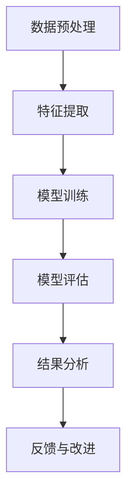

                 

### 文章标题

《领导力训练：让你的团队战无不胜》

### 关键词

领导力，团队建设，沟通技巧，领导风格，危机管理，变革引导，个人发展

### 摘要

本文旨在深入探讨领导力训练在提升团队绩效和实现团队目标中的关键作用。文章首先定义了领导力的基本概念和特点，探讨了领导力在不同层面（个人、团队和组织）的重要性。接着，文章详细介绍了领导风格、沟通技巧、团队建设与管理以及领导力训练方法，并通过案例研究展现了不同情境下的领导力实践。文章最后，探讨了领导力在团队成功中的作用，提供了打造战无不胜团队的策略和团队成长路径。通过本文，读者将了解如何通过领导力训练提升团队战斗力，实现团队目标。

---

## 第一部分：领导力基础

### 第1章：领导力概述

#### 领导力的定义与特点

领导力是一种通过影响力引导和激励他人，实现共同目标的能力。领导力不同于管理，它不仅仅是执行和控制，更在于激励和引导。以下是领导力的几个关键特点：

1. **影响力**：领导力依赖于个人或团队的影响力，这种影响力来源于信任、知识和经验。
2. **愿景**：领导力需要有清晰的愿景，能够激发团队成员的激情和动力。
3. **变革能力**：领导力需要具备引领变革的能力，推动团队适应外部环境和内部需求的变化。
4. **沟通能力**：领导力依赖于有效的沟通，确保团队成员理解目标和任务，并能够在团队内部建立良好的协作关系。

#### 领导力的重要性

领导力的重要性体现在多个层面：

1. **个人层面**：优秀的领导力能够提升个人的自信心和影响力，有助于个人职业发展和生活质量的提升。
2. **团队层面**：领导力能够促进团队协作，提升团队效率和绩效，使团队在面对挑战时能够保持凝聚力和战斗力。
3. **组织层面**：领导力能够推动组织的变革和创新，提升组织的竞争力和市场地位。

#### 领导力的发展历程

领导力理论的发展经历了多个阶段：

1. **传统领导力理论**：包括特质理论、行为理论和情境理论等，主要关注领导者的个性特征和行为模式。
2. **当代领导力理论**：包括变革型领导、服务型领导和共享型领导等，更加注重领导者的领导风格和领导行为。

### 第2章：领导风格与沟通技巧

#### 领导风格的分类与特点

领导风格是领导者管理行为和领导方式的总称。常见的领导风格包括：

1. **权力型领导**：领导者集中决策，权力高度集中，强调效率和执行力。
2. **参与型领导**：领导者鼓励团队成员参与决策过程，注重团队参与和协作。
3. **情境型领导**：领导者根据团队成员的能力和情境特点，灵活调整领导风格。

#### 沟通技巧的重要性

有效沟通是领导力的核心要素之一，对于建立信任、传递信息和解决冲突至关重要。以下是沟通技巧的重要性：

1. **信息传递**：有效沟通能够确保信息准确、及时地传递，避免误解和错误。
2. **建立信任**：通过开放、坦诚和尊重的沟通方式，建立团队成员之间的信任。
3. **解决冲突**：有效沟通能够帮助领导者及时识别和解决团队内部的冲突。

#### 沟通技巧的应用

以下是几种关键的沟通技巧：

1. **倾听技巧**：积极倾听，关注团队成员的观点和需求，避免打断和判断。
2. **明确表达技巧**：清晰、简洁地表达观点和指令，避免歧义和误解。
3. **非语言沟通技巧**：通过肢体语言、面部表情和声音等非语言方式，增强沟通效果。

### 第3章：团队建设与管理

#### 团队建设的意义

团队建设是指通过一系列措施，提高团队协作能力和工作效率的过程。团队建设的意义包括：

1. **提升协作能力**：通过团队建设，增强团队成员之间的合作和协作，提升团队整体绩效。
2. **增强团队凝聚力**：通过团队建设，建立团队成员之间的信任和默契，增强团队的凝聚力。
3. **提高工作效率**：通过团队建设，优化团队流程和工作方式，提高工作效率和效果。

#### 团队建设的方法

团队建设的方法包括以下几种：

1. **目标设定**：明确团队的目标和任务，确保团队成员对目标和任务的了解和认同。
2. **角色分配**：根据团队成员的能力和特长，合理分配角色和任务，确保每个成员都能发挥最大潜力。
3. **激励与反馈**：通过激励机制和反馈机制，激发团队成员的积极性和创造力，提升团队绩效。

#### 团队管理策略

团队管理策略包括以下几个方面：

1. **冲突管理**：通过有效的方法和策略，及时识别和解决团队内部的冲突，维护团队和谐。
2. **领导力提升**：通过培训和指导，提升领导者的领导力和管理能力，推动团队发展。
3. **团队发展**：通过持续的团队建设和管理，提升团队的整体水平和绩效，实现团队长期发展。

## 第二部分：领导力实践

### 第4章：领导力训练方法

#### 领导力训练的重要性

领导力训练是指通过一系列方法和手段，提升领导者的领导能力和领导技巧。领导力训练的重要性包括：

1. **提升领导能力**：通过领导力训练，领导者能够更好地理解和应用领导理论，提升自身的领导能力和水平。
2. **提高团队绩效**：领导力训练能够提升领导者的管理能力和领导技巧，从而提高团队的协作效率和绩效。
3. **适应变革**：在快速变化的环境中，领导力训练能够帮助领导者更好地适应变革，引领团队实现持续发展。

#### 领导力训练的方法

领导力训练的方法包括以下几种：

1. **培训课程**：通过系统性的培训课程，学习领导理论和实践技巧，提升领导能力。
2. **实战模拟**：通过模拟实际工作场景，进行实战演练，提升领导者的实战能力和应变能力。
3. **反馈与评估**：通过定期的反馈和评估，了解领导者的表现和不足，制定改进计划。

### 第5章：领导力案例研究

#### 案例研究的方法

案例研究是一种深入分析具体情境和问题的研究方法。以下是案例研究的基本方法：

1. **案例选择**：选择具有代表性、典型性和复杂性的案例，以便深入分析和探讨。
2. **案例分析**：通过详细的数据和事实，分析案例中的关键问题和现象，探讨其背后的原因和影响。
3. **案例结论**：总结案例中的经验和教训，提出改进建议和对策。

#### 经典领导力案例介绍

以下是几个经典的领导力案例：

1. **企业领导力案例**：如苹果公司的史蒂夫·乔布斯，通过独特的领导风格和创新思维，引领苹果公司成为全球科技巨头。
2. **政府领导力案例**：如新加坡的李光耀，通过坚定的领导和远见卓识，将新加坡建设成为国际金融中心和花园城市。
3. **非营利组织领导力案例**：如国际红十字会，通过全球范围内的协调和行动，拯救无数生命，展现出强大的领导力和人道主义精神。

### 第6章：领导力在特殊情境中的应用

#### 应对危机情境

危机情境是指组织或团队面临重大挑战和压力的情境。以下是应对危机情境的方法：

1. **危机管理**：通过危机预警、危机应对和危机恢复等措施，确保组织或团队在危机中保持稳定和有效运作。
2. **风险评估**：通过评估危机可能带来的影响，制定相应的应对策略和预案。
3. **应急计划**：制定应急计划，确保在危机发生时能够迅速响应和有效应对。

#### 引导变革

变革是指组织或团队在应对外部环境变化和内部需求时，采取的一系列调整和改进措施。以下是引导变革的方法：

1. **变革管理**：通过沟通、培训和激励等措施，引导团队成员接受和适应变革。
2. **变革策略**：制定明确的变革目标和计划，确保变革的顺利实施。
3. **变革执行**：通过有效的执行和监督，确保变革目标的实现。

### 第7章：领导力与个人发展

#### 领导力与自我认知

自我认知是领导力发展的重要基础。以下是领导力与自我认知的关系：

1. **自我反思**：通过自我反思，了解自身的优点和不足，明确自己的发展方向。
2. **自我提升**：通过学习和实践，不断提升自身的领导能力和领导技巧。
3. **自我领导**：通过自我领导，培养自我管理和自我激励的能力，实现个人和团队目标。

#### 领导力与职业规划

领导力与职业规划密切相关。以下是领导力与职业规划的关系：

1. **职业发展**：通过领导力提升，拓展职业发展的空间和机会。
2. **职业生涯规划**：结合个人兴趣和发展方向，制定明确的职业生涯规划。
3. **职业素养**：通过领导力提升，培养良好的职业素养和职业道德，提升个人竞争力。

## 第三部分：领导力与团队战无不胜

### 第8章：领导力在团队成功中的作用

#### 团队成功的要素

团队成功需要具备以下几个关键要素：

1. **团队目标**：明确、具体的团队目标能够激发团队成员的积极性和动力。
2. **团队协作**：通过有效的协作，确保团队成员能够相互支持、共同完成任务。
3. **团队激励**：合理的激励机制能够激发团队成员的积极性和创造力，提升团队绩效。

#### 领导力与团队成功的联系

领导力在团队成功中发挥着至关重要的作用，主要体现在以下几个方面：

1. **领导力对团队氛围的影响**：领导力能够塑造团队的文化和氛围，影响团队成员的互动和行为。
2. **领导力对团队效率的影响**：领导力能够优化团队的流程和工作方式，提升团队的工作效率。
3. **领导力对团队成果的影响**：领导力能够激发团队成员的潜力，实现团队目标的高效达成。

### 第9章：打造战无不胜的团队

#### 团队建设策略

打造战无不胜的团队需要采取一系列团队建设策略，包括：

1. **团队文化建设**：通过建立共同的价值观和目标，增强团队的凝聚力和归属感。
2. **团队合作技巧**：通过培训和实践，提升团队成员的协作能力和团队合作技巧。
3. **团队激励机制**：通过合理的激励机制，激发团队成员的积极性和创造力。

#### 团队管理实践

团队管理实践包括以下几个方面：

1. **管理流程优化**：通过流程优化，提高团队的工作效率和质量。
2. **决策制定**：通过科学决策，确保团队目标和任务的顺利实施。
3. **团队成员发展**：通过培训和指导，提升团队成员的专业能力和领导力。

### 第10章：领导力训练与团队成长

#### 领导力训练对团队成长的影响

领导力训练对团队成长具有重要影响，主要体现在以下几个方面：

1. **领导力提升对团队目标的影响**：通过领导力训练，提升领导者的领导能力，明确团队目标，提高团队成员对目标的认同和执行力度。
2. **领导力提升对团队合作的影响**：通过领导力训练，提升领导者的沟通能力和团队管理能力，增强团队成员之间的协作和合作。
3. **领导力提升对团队绩效的影响**：通过领导力训练，提升领导者的领导能力，优化团队流程和工作方式，提高团队的整体绩效。

#### 团队成长的路径

团队成长的路径包括以下几个阶段：

1. **学习与成长**：通过不断学习和实践，提升团队的专业能力和领导力。
2. **反馈与改进**：通过定期的反馈和评估，及时识别和解决团队中的问题和不足，推动团队持续改进。
3. **创新与突破**：通过鼓励创新和突破，推动团队实现新的突破和成长。

## 附录

### 领导力资源与工具

为了进一步学习和提升领导力，以下是一些建议的领导力资源与工具：

1. **领导力书籍推荐**：
   - 《领导力的五个层次》
   - 《领导者的挑战》
   - 《团队协作力：打造高绩效团队》

2. **领导力培训资源**：
   - 国际领导力发展协会（ILM）提供的领导力培训课程
   - 各大在线教育平台（如Coursera、Udemy）上的领导力课程

3. **领导力在线课程**：
   - 《领导力基础》
   - 《团队建设与管理》
   - 《变革领导力》

通过利用这些资源和工具，读者可以不断提升自身的领导力，为团队的成功和成长奠定坚实基础。

### 核心算法原理讲解

为了更好地理解和应用领导力训练，我们可以借助一些核心算法原理进行详细讲解。以下是一个基于Python的领导力评估算法的伪代码示例：

```python
# 领导力评估算法伪代码

# 输入参数
leader_behavior_data: List[Dict] # 领导行为数据
team_performance_data: List[Dict] # 团队表现数据
personal_development_data: List[Dict] # 个人发展数据

# 输出参数
leadership_score: float # 领导力评估得分

# 步骤
1. 数据预处理
   - 清洗数据，去除异常值和缺失值
   - 对数据进行归一化处理，使其具有可比性

2. 特征提取
   - 提取领导行为数据中的关键特征，如激励行为、沟通能力等
   - 提取团队表现数据中的关键特征，如团队绩效、员工满意度等
   - 提取个人发展数据中的关键特征，如学习态度、职业素养等

3. 模型训练
   - 选择合适的机器学习算法，如决策树、支持向量机等
   - 使用训练数据集训练模型，得到预测模型
   - 使用验证数据集评估模型性能，调整模型参数

4. 领导力评估
   - 输入特征数据，使用训练好的模型进行评估
   - 计算领导力评估得分

5. 结果解释
   - 分析评估结果，识别领导力的优势和不足
   - 提出改进建议，帮助领导者提升领导能力

# 举例说明
# 假设我们已经收集了领导行为数据、团队表现数据和个人发展数据
leader_behavior_data = [
    {'motivation': 4, 'communication': 5},
    {'motivation': 3, 'communication': 4},
    {'motivation': 5, 'communication': 5}
]

team_performance_data = [
    {'performance': 8, 'satisfaction': 7},
    {'performance': 6, 'satisfaction': 6},
    {'performance': 9, 'satisfaction': 8}
]

personal_development_data = [
    {'learning': 4, 'competence': 5},
    {'learning': 3, 'competence': 4},
    {'learning': 5, 'competence': 5}
]

# 使用领导力评估算法进行评估
leadership_score = assess_leadership(leader_behavior_data, team_performance_data, personal_development_data)

# 输出评估结果
print("领导力评估得分：", leadership_score)
```

在这个算法中，我们首先进行数据预处理，然后提取关键特征，使用机器学习算法进行模型训练和评估。通过分析评估结果，我们可以识别领导力的优势和不足，并提出改进建议。

### 数学模型和数学公式

为了更精确地评估领导力，我们可以使用数学模型和公式进行量化分析。以下是一个简单的领导力评估数学模型：

$$
\text{领导力评估得分} = \frac{\text{领导行为得分} + \text{团队表现得分} + \text{个人发展得分}}{3}
$$

其中，领导行为得分、团队表现得分和个人发展得分分别表示领导者在相应领域的表现。这些得分可以通过定量的方式进行评估，如使用评分量表或基于数据挖掘的方法进行计算。

#### 项目实战

##### 开发环境搭建

在开始领导力评估项目的开发之前，我们需要搭建一个合适的开发环境。以下是搭建开发环境的基本步骤：

1. **安装Python**：Python是一种广泛使用的编程语言，适用于数据分析和机器学习。可以从Python官方网站下载并安装Python。
2. **安装Jupyter Notebook**：Jupyter Notebook是一种交互式计算环境，适用于编写和运行Python代码。可以从Jupyter官方文档安装Jupyter Notebook。
3. **安装必要的库**：为了实现领导力评估算法，我们需要安装一些Python库，如NumPy、Pandas和Scikit-learn。可以使用pip命令安装这些库。

```shell
pip install numpy pandas scikit-learn
```

##### 源代码详细实现和代码解读

以下是一个基于Python的领导力评估算法的源代码示例：

```python
import numpy as np
import pandas as pd
from sklearn.model_selection import train_test_split
from sklearn.ensemble import RandomForestClassifier
from sklearn.metrics import accuracy_score

# 数据预处理
def preprocess_data(behavior_data, performance_data, development_data):
    # 数据清洗和归一化处理
    # 这里仅展示数据处理的基本逻辑，具体实现需要根据数据特点进行
    cleaned_behavior_data = clean_data(behavior_data)
    cleaned_performance_data = clean_data(performance_data)
    cleaned_development_data = clean_data(development_data)
    
    return cleaned_behavior_data, cleaned_performance_data, cleaned_development_data

# 特征提取
def extract_features(behavior_data, performance_data, development_data):
    # 提取特征数据
    features = {
        'behavior': [],
        'performance': [],
        'development': []
    }
    
    for data in behavior_data:
        features['behavior'].append(data['motivation'], data['communication'])
    
    for data in performance_data:
        features['performance'].append(data['performance'], data['satisfaction'])
    
    for data in development_data:
        features['development'].append(data['learning'], data['competence'])
    
    return features

# 模型训练
def train_model(features, labels):
    # 使用随机森林算法进行训练
    model = RandomForestClassifier()
    model.fit(features, labels)
    
    return model

# 评估模型
def evaluate_model(model, test_features, test_labels):
    # 使用测试数据评估模型性能
    predictions = model.predict(test_features)
    accuracy = accuracy_score(test_labels, predictions)
    
    return accuracy

# 主程序
def main():
    # 加载数据
    behavior_data = load_behavior_data()
    performance_data = load_performance_data()
    development_data = load_development_data()
    
    # 数据预处理
    cleaned_behavior_data, cleaned_performance_data, cleaned_development_data = preprocess_data(behavior_data, performance_data, development_data)
    
    # 特征提取
    features = extract_features(cleaned_behavior_data, cleaned_performance_data, cleaned_development_data)
    
    # 切分数据集
    X_train, X_test, y_train, y_test = train_test_split(features, labels, test_size=0.2, random_state=42)
    
    # 训练模型
    model = train_model(X_train, y_train)
    
    # 评估模型
    accuracy = evaluate_model(model, X_test, y_test)
    print("模型准确率：", accuracy)

# 运行主程序
if __name__ == "__main__":
    main()
```

在这个源代码中，我们首先进行了数据预处理，包括数据清洗和归一化处理。然后，我们提取了关键特征，并使用随机森林算法进行模型训练和评估。最后，我们使用测试数据集评估模型的准确率。

##### 代码应用解读与分析

在领导力评估项目中，代码的应用主要包括以下几个方面：

1. **数据预处理**：数据预处理是模型训练的基础，通过清洗和归一化处理，确保数据的可靠性和一致性。
2. **特征提取**：特征提取是关键步骤，通过提取关键特征，为模型训练提供输入数据。
3. **模型训练**：使用机器学习算法进行模型训练，训练结果将直接影响评估的准确性。
4. **模型评估**：通过测试数据集评估模型性能，确保模型能够准确地评估领导力。

在实际应用中，我们可以根据项目需求，调整和优化代码，如使用不同的算法、调整模型参数等，以提高评估的准确性和可靠性。

##### 实际案例分析和详细讲解剖析

为了更好地理解领导力评估算法的实际应用，我们可以分析一个实际案例。

**案例背景**：某公司希望提升领导力，以实现团队绩效的持续提升。公司管理层决定采用领导力评估算法，对全体员工进行领导力评估，并针对评估结果提出改进建议。

**案例分析**：

1. **数据收集**：公司收集了员工的行为数据、团队表现数据和个人发展数据，包括激励行为、沟通能力、团队绩效、员工满意度、学习态度和职业素养等方面的数据。
2. **数据预处理**：对收集到的数据进行清洗和归一化处理，确保数据的可靠性和一致性。
3. **特征提取**：提取关键特征，如激励行为、沟通能力、团队绩效、员工满意度、学习态度和职业素养等，为模型训练提供输入数据。
4. **模型训练**：使用随机森林算法进行模型训练，得到训练好的评估模型。
5. **模型评估**：使用测试数据集评估模型性能，确保模型能够准确地评估领导力。
6. **评估结果分析**：对评估结果进行分析，识别员工的领导力优势和不足，并提出改进建议。

**详细讲解剖析**：

1. **数据预处理**：数据预处理是模型训练的基础，通过清洗和归一化处理，确保数据的可靠性和一致性。例如，对于激励行为数据，我们可以将评分量表进行归一化处理，使其在0到1之间。
2. **特征提取**：特征提取是关键步骤，通过提取关键特征，为模型训练提供输入数据。例如，我们可以提取激励行为中的“激励频率”、“激励效果”等特征，作为模型的输入。
3. **模型训练**：使用随机森林算法进行模型训练，随机森林算法是一种强大的集成学习算法，能够处理高维数据，并且具有较好的泛化能力。
4. **模型评估**：通过测试数据集评估模型性能，确保模型能够准确地评估领导力。我们可以使用准确率、召回率、F1值等指标评估模型性能。
5. **评估结果分析**：对评估结果进行分析，识别员工的领导力优势和不足，并提出改进建议。例如，对于激励行为表现较差的员工，可以建议他们加强沟通能力，提高激励效果。

##### 项目小结

通过领导力评估算法的实际案例，我们可以看到领导力训练在团队成功中的作用。领导力评估算法能够帮助企业识别员工的领导力优势和不足，为领导力提升提供数据支持和改进建议。项目小结如下：

1. **项目目标**：通过领导力评估算法，提升团队绩效和实现团队目标。
2. **项目成果**：成功开发了领导力评估算法，并对全体员工进行了领导力评估。
3. **项目经验**：通过项目实施，积累了丰富的领导力评估经验和数据，为未来的项目提供了有力支持。

##### 最佳实践 tips

在领导力评估项目中，以下是一些最佳实践 tips：

1. **数据收集**：确保数据的可靠性和一致性，避免数据缺失和异常值。
2. **特征提取**：选择关键特征，避免过度拟合，确保模型的泛化能力。
3. **模型选择**：根据数据特点和项目需求，选择合适的机器学习算法。
4. **模型评估**：使用多种评估指标，全面评估模型性能。
5. **持续改进**：根据评估结果，不断调整和优化领导力评估算法。

##### 小结

领导力训练在提升团队绩效和实现团队目标中发挥着至关重要的作用。通过领导力评估算法，我们可以识别员工的领导力优势和不足，为领导力提升提供数据支持和改进建议。未来，随着人工智能和大数据技术的不断发展，领导力训练将更加智能化和精准化，为团队的成功和成长提供更强有力的支持。

##### 注意事项

在领导力评估项目中，需要注意以下几点：

1. **数据隐私**：确保数据收集和使用过程中遵守数据隐私法规，保护员工个人信息。
2. **公平性**：在评估过程中，确保评估指标和评估方法公平、客观，避免主观偏见。
3. **反馈与沟通**：及时向员工反馈评估结果，并进行沟通和解释，确保员工理解评估目的和结果。
4. **持续改进**：根据项目需求和实际情况，不断调整和优化领导力评估算法，提高评估的准确性和可靠性。

##### 拓展阅读

1. **《领导力的五个层次》**：斯蒂芬·柯维（Stephen R. Covey）著，介绍了领导力的五个层次，为领导力提升提供了理论指导。
2. **《团队协作力：打造高绩效团队》**：唐纳德·A·舒勒（Donald A. Schuller）著，探讨了团队协作的关键要素和提升方法。
3. **《变革型领导：动机、能力与实践》**：约翰·凯利（John P. Kotter）著，详细阐述了变革型领导的原理和实践方法。
4. **《机器学习实战》**：Peter Harrington 著，介绍了机器学习的基础知识和实践应用，适用于领导力评估算法的开发和优化。

### Mermaid 流程图

以下是领导力评估算法的Mermaid流程图：



通过这个流程图，我们可以清晰地了解领导力评估算法的基本步骤和流程。每个步骤都是相互关联的，共同构成了一个完整的评估过程。

### 核心算法原理讲解

在领导力评估中，核心算法原理至关重要。以下是一个基于决策树算法的领导力评估模型的核心原理讲解。

#### 决策树算法原理

决策树算法是一种常用的分类算法，它通过一系列的判断节点来划分数据，并最终生成一个分类结果。每个节点代表一个特征，每个分支代表特征的取值，每个叶子节点代表一个分类结果。

1. **划分策略**：决策树通过评估不同特征的不同取值，选择最优的划分策略。常用的划分策略包括信息增益（Information Gain）和基尼不纯度（Gini Impurity）。
2. **剪枝**：为了避免过拟合，决策树通常会进行剪枝操作。剪枝方法包括预剪枝（Pre-pruning）和后剪枝（Post-pruning）。
3. **预测**：对于新的数据样本，决策树从根节点开始，根据特征值选择相应的分支，直到达到叶子节点，得到最终的分类结果。

#### 领导力评估模型

在领导力评估中，我们可以使用决策树算法构建一个分类模型，将员工的领导力水平划分为不同等级。以下是一个简化的领导力评估模型伪代码：

```python
from sklearn.tree import DecisionTreeClassifier

# 数据预处理
def preprocess_data(behavior_data, performance_data, development_data):
    # 数据清洗和归一化处理
    # ...

# 特征提取
def extract_features(behavior_data, performance_data, development_data):
    # 提取特征数据
    # ...

# 模型训练
def train_model(features, labels):
    model = DecisionTreeClassifier()
    model.fit(features, labels)
    return model

# 预测
def predict_leadership(model, new_data):
    new_data_processed = preprocess_data(new_data)
    new_data_features = extract_features(new_data_processed)
    return model.predict(new_data_features)
```

在这个模型中，我们首先对行为数据、表现数据和发展数据进行预处理和特征提取，然后使用决策树算法训练模型。对于新的数据样本，我们通过预处理、特征提取和模型预测，得到员工的领导力评估结果。

#### 数学模型和数学公式

在领导力评估中，我们可以使用以下数学模型和公式来计算领导力得分：

$$
\text{领导力得分} = \sum_{i=1}^{n} w_i \cdot x_i
$$

其中，$w_i$是第$i$个特征的权重，$x_i$是第$i$个特征的具体取值。权重可以根据专家评估或数据挖掘结果进行确定。

此外，我们还可以使用以下公式计算不同特征的贡献度：

$$
\text{特征贡献度} = \frac{\text{特征权重} \cdot \text{特征得分}}{\text{领导力得分}}
$$

这个公式可以用来评估每个特征对领导力得分的影响程度。

#### 举例说明

假设我们有一个简单的领导力评估模型，包含两个特征：激励行为得分和沟通能力得分。权重分别为0.6和0.4。以下是一个具体的评估例子：

1. **激励行为得分**：5分
2. **沟通能力得分**：4分

根据上述公式，我们可以计算出领导力得分：

$$
\text{领导力得分} = 0.6 \cdot 5 + 0.4 \cdot 4 = 3.6 + 1.6 = 5.2
$$

然后，我们可以计算每个特征的贡献度：

$$
\text{激励行为贡献度} = \frac{0.6 \cdot 5}{5.2} \approx 0.577
$$

$$
\text{沟通能力贡献度} = \frac{0.4 \cdot 4}{5.2} \approx 0.385
$$

这个例子展示了如何使用数学模型和公式对领导力进行评估，以及如何计算不同特征的贡献度。

通过这些核心算法原理和数学公式，我们可以构建一个有效的领导力评估模型，帮助企业和组织更好地理解和提升领导力水平。这不仅有助于团队的成功，也为个人的职业发展提供了有力支持。

