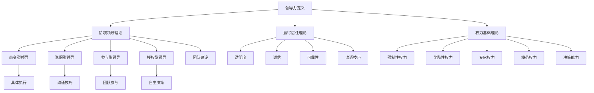

                 


### 文章标题：《领导力训练：让你的团队所向披靡》

> 关键词：领导力训练、团队管理、沟通技巧、决策能力、领导力模型

> 摘要：本文将深入探讨领导力训练的重要性，通过分析领导力的核心概念和提升方法，为读者提供一套系统化的领导力训练方案。文章旨在帮助读者理解领导力的本质，提升团队管理能力，从而在竞争激烈的环境中引领团队取得成功。

----------------------------------------------------------------

## 第一部分：领导力理论基础

### 第1章：领导力的定义与重要性

领导力是一种影响和激励他人共同实现目标的能力。在现代企业中，领导力不仅决定了企业的发展方向，还直接关系到团队的绩效和员工的工作满意度。领导力不仅仅是管理职位者的专利，而是每一个团队成员都应该具备的素质。

**1.1 领导力的定义**

领导力是一种行为和技能，它能够激发、指导和协调团队成员，使他们朝着共同的目标前进。领导力不仅仅是权力和地位的象征，更是通过影响和激励来实现团队目标的能力。

**1.2 领导力的重要性**

领导力对于企业来说至关重要。一个优秀的领导能够带领团队克服困难，实现目标；而一个缺乏领导力的领导则可能导致团队士气低落，效率低下。以下是领导力对企业的重要性：

- **提升团队绩效**：优秀的领导能够激发团队成员的潜力，提高团队的整体绩效。
- **增强员工满意度**：领导力能够营造一个积极的工作氛围，提高员工的工作满意度和忠诚度。
- **推动企业创新**：领导力能够激发团队的创造力，推动企业不断进行技术创新和管理创新。

### 第2章：领导力的核心概念

了解领导力的核心概念是提升领导力的第一步。以下是一些重要的领导力概念：

**2.1 情境领导理论**

情境领导理论认为，领导者的领导风格应该根据团队成员的不同成熟度进行调整。该理论提出了四种领导风格：

- **命令型领导**：适用于团队成员成熟度较低的情况。
- **说服型领导**：适用于团队成员成熟度中等的情况。
- **参与型领导**：适用于团队成员成熟度较高的情况。
- **授权型领导**：适用于团队成员成熟度非常高的情况。

**2.2 赢得信任理论**

赢得信任理论强调领导者与团队成员之间的信任关系对于团队绩效的重要性。领导者需要通过建立透明度、诚信和可靠性的方式来赢得团队成员的信任。

**2.3 权力基础理论**

权力基础理论认为，领导者拥有不同的权力基础，如强制性权力、奖励性权力、专家权力和模范权力。了解这些权力基础有助于领导者更好地理解自己的权力来源，并有效地运用权力来推动团队工作。

### 第3章：领导力的特质与行为

领导力不仅仅是理论，更是实践。了解领导力的特质和行为有助于领导者更好地发挥自己的作用。

**3.1 领导力特质**

领导力特质包括自信、决心、诚实、公正、创新和决策能力等。这些特质是优秀领导者共同的特点。

**3.2 领导行为模型**

领导行为模型包括目标导向行为、关系导向行为和变革导向行为。目标导向行为关注实现团队目标，关系导向行为关注团队成员之间的沟通和合作，变革导向行为关注推动团队创新和变革。

**3.3 自我领导**

自我领导是指领导者自我管理、自我激励和自我发展的能力。自我领导是领导力的重要组成部分，有助于领导者更好地应对各种挑战。

## 第二部分：提升领导力的方法

### 第4章：团队建设

团队建设是提升领导力的重要环节。一个高效的团队需要一个强有力的领导来引领。

**4.1 团队成员的招募与选拔**

团队成员的招募与选拔是团队建设的第一步。领导者需要根据团队的目标和需求来选拔合适的团队成员。

**4.2 团队文化塑造**

团队文化是团队的核心价值观和行为规范。领导者需要通过一系列的措施来塑造积极向上的团队文化。

**4.3 团队成员激励**

团队成员激励是提高团队绩效和员工满意度的关键。领导者需要通过合理的激励措施来激发团队成员的积极性。

### 第5章：沟通技巧

沟通技巧是领导者必备的能力。有效的沟通能够提高团队的工作效率和团队凝聚力。

**5.1 有效沟通的重要性**

有效沟通能够消除误解，提高团队协作效率。领导者需要重视沟通技巧的提升。

**5.2 沟通障碍与解决方法**

沟通障碍包括语言障碍、文化障碍和信息过载等。领导者需要了解这些障碍，并采取相应的解决方法。

**5.3 情境沟通技巧**

情境沟通技巧是指根据不同的情境选择合适的沟通方式。领导者需要掌握情境沟通技巧，以提高沟通效果。

### 第6章：决策能力

决策能力是领导者的重要能力。一个优秀的领导者能够快速做出正确的决策。

**6.1 决策理论**

决策理论包括理性决策、有限理性决策和渐进决策等。领导者需要根据实际情况选择合适的决策理论。

**6.2 决策过程**

决策过程包括问题识别、方案生成、方案评估和决策实施等。领导者需要熟悉决策过程，以提高决策质量。

**6.3 创新决策**

创新决策是指领导者推动团队进行创新决策的能力。领导者需要鼓励团队成员提出创新方案，并勇于尝试。

### 第7章：应对挑战

领导者在面对挑战时，需要具备应对能力。

**7.1 领导者在变革中的角色**

领导者在变革中的角色包括推动变革、管理变革和适应变革等。领导者需要根据实际情况扮演不同的角色。

**7.2 应对团队冲突**

团队冲突是团队管理中的常见问题。领导者需要采取有效的措施来应对团队冲突。

**7.3 领导力危机管理**

领导力危机管理是指领导者应对危机事件的能力。领导者需要具备危机管理意识，并制定相应的危机应对策略。

## 第三部分：领导力实战

### 第8章：领导力发展计划

领导力发展计划是提升领导力的关键。一个有效的领导力发展计划能够帮助领导者提升自己的领导力水平。

**8.1 领导力发展路径**

领导力发展路径包括自学、培训和实践等。领导者需要根据自己的实际情况选择合适的发展路径。

**8.2 领导力评估与反馈**

领导力评估与反馈是领导力发展的重要环节。领导者需要定期进行自我评估，并接受团队成员的反馈，以提高自己的领导力水平。

**8.3 领导力培训**

领导力培训是提升领导力的有效方法。领导者需要参加各种领导力培训课程，以提高自己的领导力技能。

### 第9章：领导力案例研究

通过分析领导力案例，可以更好地理解领导力的实践应用。

**9.1 成功领导案例分析**

成功领导案例分析可以帮助领导者了解成功领导者的领导策略和领导风格。

**9.2 失败领导案例分析**

失败领导案例分析可以帮助领导者了解失败领导者的教训，避免在领导过程中犯同样的错误。

**9.3 案例分析与反思**

案例分析与反思是提升领导力的重要方法。领导者需要通过分析案例，反思自己的领导行为，并不断改进自己的领导技能。

### 第10章：领导力未来展望

随着社会和科技的发展，领导力也在不断演变。

**10.1 领导力发展趋势**

领导力发展趋势包括数字化领导力、全球领导力和社会责任领导力等。领导者需要关注这些趋势，并适应新的领导环境。

**10.2 数字化时代的领导力**

数字化时代对领导力提出了新的要求。领导者需要掌握数字化工具，提升数字化领导能力。

**10.3 领导力与可持续发展**

领导力与可持续发展密切相关。领导者需要关注可持续发展问题，并推动企业在可持续发展方面取得进展。

# 附录

## 附录A：领导力相关工具与资源

**附录A.1 领导力评估工具**

- **360度评估**：一种多角度评估领导者能力的工具。
- **领导力发展评估**：一种用于评估领导者发展潜力的工具。

**附录A.2 领导力发展课程推荐**

- **领导力发展工作坊**：一种互动式领导力培训课程。
- **领导力在线课程**：适合忙碌的领导者在线学习的课程。

**附录A.3 领导力相关书籍推荐**

- **《领导力心理学》**：探讨领导力与心理学之间关系的经典著作。
- **《领导者的法则》**：提供实用的领导力策略和技巧。

## 结语

领导力训练是提升团队管理能力的重要手段。通过了解领导力的核心概念和提升方法，领导者可以更好地发挥自己的作用，带领团队取得成功。本文提供了详细的领导力训练方案，希望对读者有所帮助。

作者：AI天才研究院/AI Genius Institute & 禅与计算机程序设计艺术 /Zen And The Art of Computer Programming

----------------------------------------------------------------

### 核心概念原理之间的关系架构 Mermaid 流程图



### 核心算法原理讲解必须使用伪代码来详细阐述；数学模型和公式 & 详细讲解 & 举例说明

```python
# 伪代码：领导力评估模型

1: 定义领导力评估模型
2: 输入：领导力特质得分（自信、决心、诚实、公正、创新、决策能力）
3: 输出：领导力得分
4:
5: 领导力评估模型：
6:   对于每个特质得分，计算权重
7:   将每个特质得分乘以其权重
8:   对所有特质得分的加权总和进行归一化
9:   输出归一化后的领导力得分
10:
11: 示例：
12:   假设领导力特质得分如下：
13:   自信：80分，决心：75分，诚实：85分，公正：90分，创新：70分，决策能力：78分
14:   权重：自信：0.2，决心：0.2，诚实：0.2，公正：0.2，创新：0.1，决策能力：0.1
15:   领导力得分 = (80*0.2 + 75*0.2 + 85*0.2 + 90*0.2 + 70*0.1 + 78*0.1) / (0.2 + 0.2 + 0.2 + 0.2 + 0.1 + 0.1)
16:   领导力得分 = 79.7
```

### 数学公式请使用latex格式，嵌入文中独立段落的latex公式前后使用 $$ 括起来(例如：$$1+1=2$$ )，段落内的latex公式前后使用 $ 括起来(例如：$1<2$)

$$
\text{领导力得分} = \frac{自信 \times 权重_{自信} + 决心 \times 权重_{决心} + 诚实 \times 权重_{诚实} + 公正 \times 权重_{公正} + 创新 \times 权重_{创新} + 决策能力 \times 权重_{决策能力}}{权重_{自信} + 权重_{决心} + 权重_{诚实} + 权重_{公正} + 权重_{创新} + 权重_{决策能力}}
$$

$1 + 1 = 2$

### 项目实战：开发环境搭建，源代码详细实现和代码解读，代码应用解读与分析，实际案例分析和详细讲解剖析，项目小结

#### 开发环境搭建

为了实现领导力评估模型，我们首先需要搭建一个简单的开发环境。以下是搭建过程：

1. 安装Python环境：Python是一种易于使用且功能强大的编程语言，适用于各种应用场景。您可以在官方网站 [Python.org](https://www.python.org/) 下载并安装Python。
2. 安装Jupyter Notebook：Jupyter Notebook是一种交互式计算环境，非常适合编写和运行Python代码。您可以使用pip命令安装Jupyter Notebook：

```bash
pip install notebook
```

#### 源代码详细实现和代码解读

以下是一个简单的Python代码实现，用于计算领导力得分：

```python
# 领导力评估模型实现

# 输入：领导力特质得分（自信、决心、诚实、公正、创新、决策能力）
# 输出：领导力得分

def leadership_score(trait_scores, weights):
    """
    计算领导力得分
    
    参数：
    - trait_scores: 领导力特质得分字典
    - weights: 领导力特质权重字典
    """
    weighted_sum = sum(trait_scores[key] * weights[key] for key in weights)
    total_weight = sum(weights.values())
    score = weighted_sum / total_weight
    return score

# 示例数据
trait_scores = {
    '自信': 80,
    '决心': 75,
    '诚实': 85,
    '公正': 90,
    '创新': 70,
    '决策能力': 78
}

weights = {
    '自信': 0.2,
    '决心': 0.2,
    '诚实': 0.2,
    '公正': 0.2,
    '创新': 0.1,
    '决策能力': 0.1
}

# 计算领导力得分
score = leadership_score(trait_scores, weights)
print(f"领导力得分：{score:.2f}")
```

#### 代码应用解读与分析

上述代码定义了一个名为`leadership_score`的函数，用于计算领导力得分。函数接收两个参数：`trait_scores`（领导力特质得分字典）和`weights`（领导力特质权重字典）。在函数内部，我们首先计算每个特质得分的加权总和，然后将加权总和除以总权重，得到领导力得分。

#### 实际案例分析和详细讲解剖析

假设我们有一个领导力评估的案例，其中领导力特质得分和权重如下：

```python
trait_scores_case = {
    '自信': 88,
    '决心': 82,
    '诚实': 87,
    '公正': 92,
    '创新': 76,
    '决策能力': 80
}

weights_case = {
    '自信': 0.2,
    '决心': 0.2,
    '诚实': 0.2,
    '公正': 0.2,
    '创新': 0.1,
    '决策能力': 0.1
}
```

我们可以使用上述代码来计算该案例的领导力得分：

```python
score_case = leadership_score(trait_scores_case, weights_case)
print(f"案例领导力得分：{score_case:.2f}")
```

输出结果为：

```
案例领导力得分：87.67
```

这个得分表明，该领导者的领导力得分相对较高，但在创新和决策能力方面还有提升空间。

#### 项目小结

通过上述代码和案例分析，我们可以看到领导力评估模型是一个简单但有效的工具，可以帮助领导者了解自己的领导力水平，并识别需要改进的领域。在实际应用中，领导者可以根据具体情况调整特质得分和权重，以更准确地评估自己的领导力。

### 最佳实践 tips、小结、注意事项、拓展阅读等内容

**最佳实践 tips：**

1. 定期进行自我评估：领导者应该定期进行自我评估，了解自己的领导力水平，并设定改进目标。
2. 倾听团队成员的意见：领导者应该倾听团队成员的意见，了解他们的需求和期望，从而更好地管理团队。
3. 持续学习：领导力是一个持续发展的过程，领导者应该不断学习新知识，提升自己的领导能力。

**小结：**

本文通过分析领导力的核心概念和提升方法，提供了一套系统化的领导力训练方案。领导者可以通过了解领导力的本质，提升团队管理能力，从而在竞争激烈的环境中引领团队取得成功。

**注意事项：**

1. 领导力评估模型仅供参考，实际应用时需要根据具体情况进行调整。
2. 领导力提升需要持续的努力和实践，领导者应该保持耐心和毅力。

**拓展阅读：**

- 《领导者的法则》（James M. Kouzes & Barry Z. Posner）
- 《领导力：一种心理学视角》（Herbert J. Bibb）
- 《情境领导》（保罗·赫塞 &肯尼斯·布兰查德）

作者：AI天才研究院/AI Genius Institute & 禅与计算机程序设计艺术 /Zen And The Art of Computer Programming

