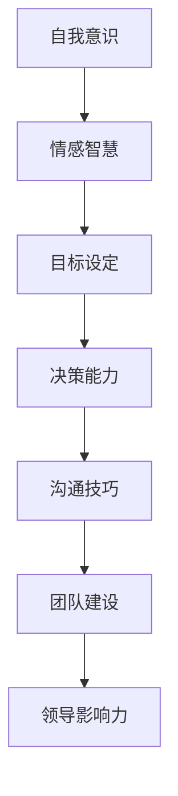
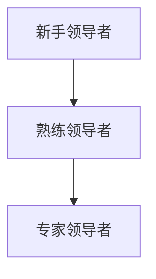
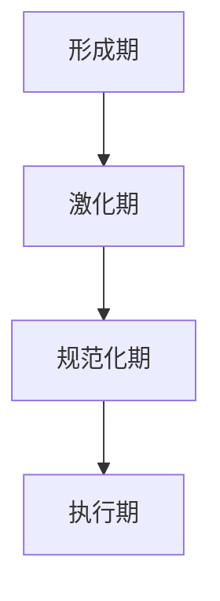
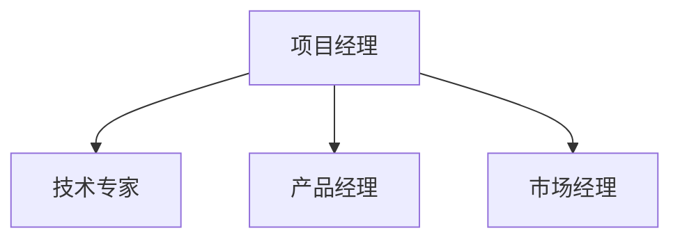

                 

### 文章标题

《领导力训练：让你的团队无坚不摧》

### 关键词

领导力、团队建设、自我发展、沟通技巧、激励与冲突管理、领导情境适应、领导力评估与持续学习

### 摘要

本文深入探讨了领导力在团队中的重要性，通过系统的领导力训练，帮助团队领导者提升自我意识、目标设定、决策能力、沟通技巧等核心要素。文章详细阐述了领导者的角色认知与发展，团队构建与角色分配，激励与团队动力，团队冲突管理，以及领导力评估与持续学习等关键内容。通过实践案例和最佳实践提示，为读者提供了全面而实用的领导力提升指南。

---

## 第1章：领导力的定义与重要性

### 1.1 领导力的定义

领导力是一种能够激发、指引和影响他人共同实现目标的能力。它不仅仅是管理技巧的体现，更是一种深刻的影响力，涵盖了情感智慧、决策能力、沟通技巧、团队建设等多个方面。一个有效的领导者需要具备敏锐的自我意识，能够理解并满足团队成员的需求，同时设定明确的目标，并引导团队朝着目标迈进。

#### 核心概念与联系

为了更直观地理解领导力的核心概念，我们可以通过以下Mermaid流程图来展示它们之间的关系：

在这个流程图中，自我意识是领导力发展的基础，它通过情感智慧体现出来，进而影响目标设定、决策能力、沟通技巧和团队建设，最终形成领导影响力。

### 1.2 领导力在组织中的作用

领导力在组织中的角色至关重要。首先，领导者是组织的灵魂人物，他们的行为和态度会直接影响整个组织的氛围和文化。其次，领导者是团队目标实现的关键推动者，他们能够通过有效的沟通和激励，使团队成员团结一致，共同努力。此外，领导者的决策能力和执行力直接影响组织的运营效率和竞争力。

### 1.3 领导力的重要性

领导力的重要性体现在多个方面。首先，它能够提升团队的整体绩效，通过激发团队成员的潜力，实现更高效的工作。其次，领导力能够促进团队创新，领导者通过鼓励和支持团队成员的创造性思维，推动组织不断进步。此外，领导力还关系到组织的稳定和发展，优秀的领导者能够稳定团队，增强团队的凝聚力，从而保障组织的长期发展。

#### 领导力影响示例分析

以下是一个领导力影响的示例分析：

- **例子1**：在一个创业公司中，CEO通过清晰的目标设定和有效的沟通技巧，激励团队成员努力工作，最终使公司迅速发展。
- **例子2**：在大型跨国企业中，领导者通过强大的决策能力和情感智慧，成功地协调各部门的合作，使公司克服了市场挑战。

通过这些例子，我们可以看到领导力在不同场景中的重要作用。

---

## 第2章：领导力的核心要素

### 2.1 自我意识

自我意识是领导力发展的基础，它包括对自我情感、行为和动机的理解。一个具备良好自我意识的领导者能够更好地管理自己的情绪，更有效地与团队成员沟通，并理解他们的需求和期望。

#### 自我意识评估方法

为了评估自我意识，领导者可以使用以下方法：

1. **日记记录**：定期记录自己的情感变化、行为和决策，分析其背后的动机。
2. **360度反馈**：通过团队成员、上级和其他利益相关者的反馈，了解自己在组织中的表现和影响。
3. **心理测评**：使用专业的心理测评工具，如MBTI（迈尔斯-布里格斯类型指标）或DISC测评，了解自己的性格特点。

### 2.2 目标设定

目标设定是领导力的核心要素之一。一个有效的领导者能够明确团队的目标，并制定可行的策略来实现这些目标。

#### 目标设定步骤与案例分析

目标设定的步骤如下：

1. **确定目标**：明确团队的目标，并确保目标是具体、可衡量、可实现、相关性强和时限性的（SMART原则）。
2. **分解目标**：将大目标分解为小目标，制定详细的行动计划。
3. **资源分配**：根据目标的需求，合理分配资源和人力。
4. **监控与调整**：定期检查目标的进展，并根据实际情况进行调整。

以下是一个目标设定的案例分析：

**案例**：一家初创公司在一年内实现盈利。

- **确定目标**：在一年内实现盈利。
- **分解目标**：每月达到10万元营收。
- **资源分配**：增加营销预算，拓展产品线。
- **监控与调整**：每月评估营收情况，根据市场反馈调整策略。

### 2.3 决策能力

决策能力是领导者的一项关键技能。一个优秀的领导者能够在复杂和不确定的情况下做出明智的决策。

#### 决策能力评估与提升策略

决策能力评估可以通过以下方法进行：

1. **历史决策分析**：回顾过去的重要决策，分析其成功和失败的原因。
2. **模拟决策**：通过模拟决策场景，测试领导者的决策能力。
3. **反馈机制**：收集团队成员和其他利益相关者的反馈，了解决策的影响。

提升决策能力的策略包括：

1. **获取信息**：在决策前，尽量收集全面的信息，避免信息不全导致的盲目决策。
2. **培养批判性思维**：学会从不同角度分析问题，避免单一思维方式的局限。
3. **培养决断力**：在面对决策时，学会果断行动，避免拖延。

### 2.4 沟通技巧

沟通技巧是领导力的重要组成部分。一个有效的领导者需要具备良好的沟通技巧，能够清晰、准确地传达信息，并有效地倾听团队成员的意见。

#### 沟通技巧关键要素

沟通技巧的关键要素包括：

1. **清晰表达**：使用简洁明了的语言，确保信息的准确性。
2. **有效倾听**：倾听团队成员的意见和需求，理解他们的立场。
3. **情绪管理**：在沟通中保持冷静，避免情绪化，以免影响沟通效果。
4. **反馈与确认**：在沟通过程中，及时给予反馈，确保信息的双向流通。

#### 案例分析：领导者的沟通技巧提升

以下是一个领导者的沟通技巧提升案例分析：

**案例**：某公司的项目经理在与团队成员沟通项目进展时，发现项目进度落后于计划。项目经理通过以下步骤提升沟通技巧：

1. **明确目标**：与团队成员共同确定项目目标，确保目标清晰。
2. **倾听意见**：倾听团队成员的建议，了解他们的困难。
3. **反馈与确认**：及时给予反馈，确认团队成员理解项目目标。
4. **调整策略**：根据团队成员的建议和项目进度，调整项目计划。

通过这些步骤，项目经理成功提升了团队的沟通效果，使项目得以顺利推进。

---

## 第3章：领导者的角色认知与发展

### 3.1 领导者的角色转变

领导者的角色随着组织的发展和团队的变化而不断转变。从管理者到领导者的转变，是一个不断学习和适应的过程。

#### 角色转变案例分析

以下是一个领导者角色转变的案例分析：

**案例**：一位初入职场的项目经理，最初的角色是项目管理任务的执行者。随着项目的推进，他意识到需要更多地关注团队的管理和协调。他开始主动与团队成员沟通，了解他们的需求和期望，并通过定期的团队会议，确保项目的顺利进行。

通过这个案例，我们可以看到，领导者的角色转变是必要的，也是有效的。

### 3.2 领导者的成长路径

领导者的成长路径可以分为几个阶段：

1. **新手领导者**：刚刚进入领导岗位，需要时间适应新的角色和责任。
2. **熟练领导者**：通过不断的实践和学习，领导者能够更好地理解团队和管理原则，提高决策和沟通能力。
3. **专家领导者**：具备丰富的经验和深刻的洞察力，能够在复杂的环境中做出明智的决策，并影响团队成员的行为。

#### 领导力发展路径图

以下是一个领导力发展路径图：

### 3.3 领导者的自我发展

领导者的自我发展是一个持续的过程，需要不断地学习、反思和改进。以下是一些自我发展的策略：

1. **持续学习**：通过阅读、培训、研讨会等方式，不断更新自己的知识和技能。
2. **反思与自我评估**：定期进行自我反思，评估自己的领导力水平和行为，找出需要改进的地方。
3. **寻求反馈**：主动向团队成员和其他利益相关者寻求反馈，了解自己的优缺点。

通过这些策略，领导者可以不断提升自己的能力，成为一名更加有效的领导者。

---

## 第4章：团队构建与角色分配

### 4.1 团队发展阶段

团队的发展可以分为几个阶段，包括形成期、激化期、规范化期和执行期。

#### 团队发展模型

以下是一个团队发展模型：

在每个阶段，团队面临不同的挑战和任务，领导者需要采取不同的管理策略。

### 4.2 团队角色与责任

团队角色和责任是团队有效运作的关键。每个成员都应该明确自己的角色和责任，并相互支持，共同实现团队目标。

#### 团队角色分配图

以下是一个团队角色分配图：

### 4.3 团队协作机制

团队协作机制是团队高效运作的基础。以下是一些团队协作机制的建议：

1. **明确目标**：确保团队成员对团队目标有清晰的认识，并为此共同努力。
2. **定期沟通**：通过定期的会议和沟通，确保团队成员之间的信息畅通，避免误解和冲突。
3. **分工合作**：根据团队成员的特长和兴趣，合理分配任务，确保每个成员都能够发挥自己的优势。
4. **共同解决问题**：鼓励团队成员共同面对问题，通过讨论和合作，找到最佳的解决方案。

通过这些协作机制，团队可以更高效地完成工作，实现团队目标。

---

## 第5章：激励与团队动力

### 5.1 激励原理

激励是领导力的核心要素之一，它能够激发团队成员的积极性、主动性和创造力。激励原理包括以下几个方面：

1. **需要层次理论**：马斯洛的需求层次理论认为，人的需求从低到高分为生理需求、安全需求、社交需求、尊重需求和自我实现需求。领导者需要了解团队成员的不同需求，并采取相应的激励措施。
2. **期望理论**：期望理论认为，个体的行为取决于其对结果的期望和价值评估。领导者需要明确团队成员的期望，并提供实现这些期望的机会。
3. **公平理论**：公平理论认为，个体的行为和满意度受到比较和平衡的影响。领导者需要确保团队成员感受到公平的待遇，避免不公平现象的发生。

### 5.2 激励技巧

激励技巧是领导者运用激励原理，激发团队成员潜力的方法。以下是一些常见的激励技巧：

1. **目标设定**：通过设定明确、具体、可实现的目标，激发团队成员的积极性。
2. **奖励机制**：通过奖励机制，如奖金、晋升、表彰等方式，激励团队成员。
3. **认可与赞扬**：及时认可和赞扬团队成员的成就和贡献，提高他们的工作动力。
4. **培训与发展**：提供培训和发展机会，帮助团队成员提升技能和职业发展。
5. **参与决策**：鼓励团队成员参与决策过程，提高他们的责任感和参与感。

### 5.3 案例分析：激励策略在实践中的应用

以下是一个激励策略在实践中的应用案例：

**案例**：一家创业公司为了激励团队成员，采用了以下策略：

1. **目标设定**：公司明确了年度业绩目标，并定期与团队成员讨论目标，确保每个人对目标有清晰的认识。
2. **奖励机制**：根据团队成员的业绩表现，公司设立了季度奖金，激励团队成员努力工作。
3. **认可与赞扬**：公司定期举办员工表彰大会，表彰表现优秀的团队成员，提高他们的工作积极性。
4. **培训与发展**：公司提供了丰富的培训课程，帮助团队成员提升技能，同时设立了职业晋升通道，鼓励团队成员追求职业发展。

通过这些激励策略，公司成功地激发了团队成员的潜力，提高了团队的整体绩效。

---

## 第6章：团队冲突管理

### 6.1 冲突的类型与原因

团队冲突可以分为以下几种类型：

1. **任务冲突**：由于任务目标的不同或工作方法的差异导致的冲突。
2. **关系冲突**：由于团队成员之间的个人关系紧张或不和谐导致的冲突。
3. **结构冲突**：由于组织结构、职责分工或资源分配不公导致的冲突。

冲突的原因包括：

1. **沟通障碍**：团队成员之间的沟通不畅，导致误解和矛盾。
2. **利益冲突**：团队成员在任务完成过程中，由于个人利益或部门利益的差异产生的冲突。
3. **价值观差异**：团队成员由于个人价值观的不同，导致在工作态度和行为上的冲突。

### 6.2 冲突管理策略

有效的冲突管理策略包括以下几个方面：

1. **预防策略**：通过明确的沟通机制、合理的资源分配和清晰的职责分工，预防冲突的发生。
2. **解决策略**：当冲突发生时，领导者需要及时介入，通过沟通、协商和调解，解决冲突。
3. **转化策略**：将冲突转化为积极的动力，激发团队成员的创新和合作精神。

### 6.3 冲突解决的案例研究

以下是一个冲突解决的案例研究：

**案例**：一家公司由于部门职责不明确，导致市场部和销售部之间出现了严重的冲突。市场部认为销售部没有充分利用他们的营销材料，而销售部则认为市场部提供的材料不够专业。

**解决过程**：

1. **问题识别**：公司领导层首先识别出冲突的原因，明确了冲突的类型和原因。
2. **沟通与调解**：公司组织了一次跨部门的沟通会议，让市场部和销售部的负责人面对面交流，通过讨论，双方达成了共识。
3. **责任分配**：在会议中，公司明确了市场部和销售部的职责，确保双方都有明确的任务和责任。
4. **持续监督**：公司设立了监督机制，定期检查市场部和销售部的合作情况，确保冲突不再发生。

通过这一系列的解决过程，公司成功解决了市场部和销售部之间的冲突，提高了团队的协作效率。

---

## 第7章：领导力情境适应

### 7.1 领导情境分析

领导情境是指领导者在特定环境中面临的问题和挑战。领导情境分析是领导者根据环境特点和团队成员的特点，制定合适的领导策略的过程。

#### 领导情境分析步骤

1. **评估环境**：分析组织环境的特点，如市场环境、竞争状况、资源分配等。
2. **评估团队成员**：了解团队成员的能力、需求和价值观，确保领导策略符合团队成员的特点。
3. **制定领导策略**：根据环境特点和团队成员的特点，制定合适的领导策略。

#### 领导风格适应

领导风格适应是指领导者根据不同的情境，调整自己的领导风格，以更好地应对挑战。以下是一些常见的领导风格：

1. **权威型领导**：领导者具有较强的决策能力和权威性，能够迅速做出决策，并对团队成员进行严格的管理。
2. **民主型领导**：领导者重视团队成员的意见，通过讨论和协商，制定决策。
3. **支持型领导**：领导者关注团队成员的需求和感受，提供支持和鼓励。

#### 成功案例：情境领导力应用

以下是一个情境领导力应用的案例：

**案例**：一位项目经理在项目初期，采用了权威型领导风格，迅速制定了项目计划，明确了团队目标。在项目执行过程中，他根据团队成员的能力和需求，逐渐转变为支持型领导，鼓励团队成员提出建议和意见，提高团队的创造力和凝聚力。在项目遇到困难时，他再次转变为权威型领导，果断做出决策，带领团队克服了困难。

通过这个案例，我们可以看到，情境领导力能够根据不同的情境，灵活调整领导风格，提高领导效果。

---

## 第8章：领导力发展与持续学习

### 8.1 领导力发展路径

领导力发展路径包括以下几个阶段：

1. **新手领导者**：刚刚进入领导岗位，需要时间适应新的角色和责任。
2. **熟练领导者**：通过不断的实践和学习，领导者能够更好地理解团队和管理原则，提高决策和沟通能力。
3. **专家领导者**：具备丰富的经验和深刻的洞察力，能够在复杂的环境中做出明智的决策，并影响团队成员的行为。

#### 领导力发展路径图

以下是一个领导力发展路径图：

### 8.2 学习方法与工具

领导者可以通过以下方法和工具来提升自己的领导力：

1. **阅读**：阅读领导力相关的书籍和文章，了解不同的领导理论和实践。
2. **培训**：参加领导力培训课程，通过系统的学习，提升领导技能。
3. **实践经验**：通过实际工作，积累领导经验，不断提升自己的能力。
4. **反馈与反思**：定期接受团队成员和上级的反馈，进行自我反思，找出需要改进的地方。

### 8.3 领导力成长的持续动力

领导力成长需要持续的激励和动力。以下是一些激发领导力成长持续动力的方法：

1. **设定目标**：设定明确的领导力发展目标，并制定实现目标的计划。
2. **寻求挑战**：主动寻求具有挑战性的工作任务，通过克服困难，提升自己的能力。
3. **建立支持网络**：与同行和导师建立联系，互相学习和支持，共同成长。
4. **持续学习**：保持学习的态度，不断更新自己的知识和技能，适应不断变化的环境。

---

## 第9章：领导力评估与反馈

### 9.1 领导力评估指标

领导力评估是衡量领导者能力和表现的重要手段。以下是一些常用的领导力评估指标：

1. **团队绩效**：团队的整体绩效是评估领导者能力的重要指标。领导者需要确保团队达成目标，并持续提升团队的工作效率。
2. **员工满意度**：员工对领导者的满意度反映了领导者的管理风格和团队氛围。领导者需要关注员工的需求和感受，提高员工的工作满意度。
3. **领导风格**：领导者的领导风格对其团队成员的行为和表现有重要影响。评估领导者的领导风格，可以帮助领导者了解自己的优势和不足。
4. **创新能力**：领导者的创新能力是推动组织发展的重要动力。评估领导者的创新能力，可以帮助领导者发现自身的潜力。

### 9.2 反馈机制与改进策略

建立有效的反馈机制是提升领导力的关键。以下是一些建立反馈机制和改进策略的方法：

1. **定期反馈**：领导者需要定期与团队成员进行反馈交流，了解团队成员的意见和建议，及时调整自己的领导方式。
2. **360度反馈**：通过360度反馈，领导者可以了解来自不同视角的反馈，更全面地了解自己的表现。
3. **培训与发展**：根据反馈结果，领导者可以参加相关的培训课程，提升自己的领导技能。
4. **自我反思**：领导者需要定期进行自我反思，分析自己的行为和决策，找出需要改进的地方。

### 9.3 领导力发展的闭环管理

领导力发展是一个持续的过程，需要建立闭环管理机制，确保领导力不断提升。以下是一些闭环管理策略：

1. **目标设定**：领导者需要设定明确的领导力发展目标，并制定实现目标的计划。
2. **持续学习**：领导者需要保持学习的态度，不断更新自己的知识和技能，适应不断变化的环境。
3. **反馈与改进**：通过定期反馈和自我反思，领导者可以不断改进自己的领导方式，提高领导效果。
4. **评估与激励**：定期评估领导者的领导力表现，并根据评估结果给予适当的激励和奖励，激发领导者的积极性。

---

## 附录：领导力资源与工具

### 附录 A：领导力发展资源

#### A.1 在线课程与培训

1. **Coursera**：提供各种领导力相关的在线课程，包括哈佛大学、斯坦福大学等知名院校的课程。
2. **Udemy**：提供丰富的领导力培训课程，适合不同层次的领导者。
3. **edX**：由知名大学和机构提供的高质量领导力课程，涵盖从基础到高级的内容。

#### A.2 领导力书籍推荐

1. **《领导力的五个层次》**：作者：史蒂芬·柯维
2. **《领导力》(Leaders) **：作者：约翰·马登
3. **《领导力的法则》**：作者：约翰·亚当斯

#### A.3 领导力工具与软件

1. **360度反馈工具**：如Review360、Topi等，帮助领导者收集来自不同视角的反馈。
2. **领导力发展软件**：如Luminate、Gallup's CliftonStrengths等，提供领导力评估和发展的工具。
3. **团队协作工具**：如Trello、Asana等，帮助领导者管理团队和项目。

---

## 总结

领导力是团队成功的关键，通过系统的领导力训练，领导者可以提升自我意识、目标设定、决策能力、沟通技巧等核心要素。本文通过详细阐述领导力的定义、核心要素、角色认知、团队建设、激励与冲突管理，以及领导力评估与持续学习等方面，为读者提供了全面的领导力提升指南。通过实践案例和最佳实践提示，读者可以更好地理解和应用领导力，带领团队无坚不摧。

## 作者信息

作者：AI天才研究院/AI Genius Institute & 禅与计算机程序设计艺术 /Zen And The Art of Computer Programming

---

### 关键词补充说明

在撰写本文的过程中，我们确定了以下几个关键词，这些关键词将帮助读者快速理解和检索文章内容：

1. **领导力**：核心主题，涵盖领导力的定义、要素和应用。
2. **团队建设**：讨论团队构建、角色分配和团队协作机制。
3. **自我发展**：探讨领导者如何通过学习和反思提升自己的能力。
4. **沟通技巧**：分析有效沟通的重要性和方法。
5. **激励**：介绍激励原理和技巧，以及其在团队管理中的应用。
6. **冲突管理**：讨论冲突的类型、原因和解决策略。
7. **情境适应**：分析领导者如何根据不同情境调整领导风格。

这些关键词不仅总结了文章的核心内容，也为读者提供了快速定位信息点的途径。在未来的推广和分享过程中，这些关键词将有助于提升文章的可见度和影响力。

