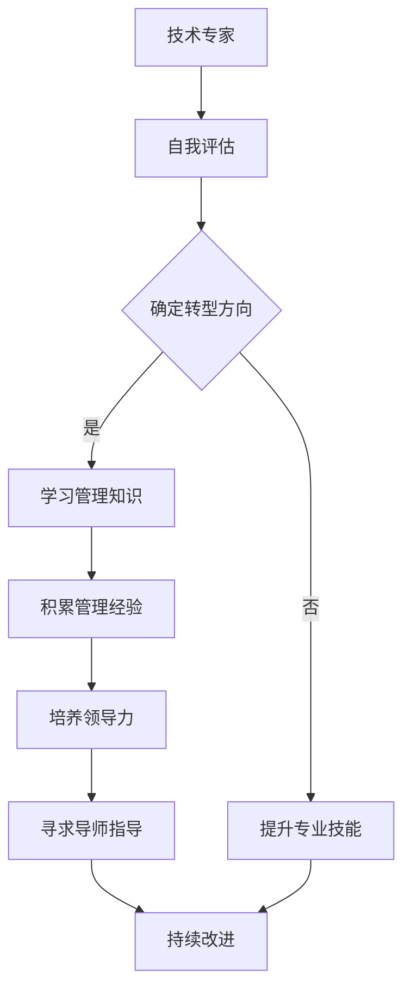

                 

### 文章标题

### 关键词

### 摘要

# 领导力转型：从技术专家到管理者

> 在当今快速变化的技术环境中，技术专家需要从单一的技术角色转向具备管理能力的管理者。本文将探讨领导力的转型过程，从技术专长到管理职责的转变，并提供一系列策略和技巧，帮助技术专家成功地转型为管理者。

关键词：领导力转型、技术专家、管理者、管理技能、团队领导

摘要：本文将深入探讨技术专家在职业生涯中从技术专长向管理角色的转型过程。通过分析转型过程中的挑战和机遇，本文提出了提升领导力的方法、核心管理技能的培养、以及实际案例的分享。读者可以了解到如何从技术思维转变为管理思维，并掌握必备的管理技能，从而在职业生涯中取得更大的成功。

## 背景介绍

在信息技术飞速发展的今天，技术专家的角色越来越受到重视。他们拥有深厚的专业知识和丰富的实践经验，能够解决复杂的技术问题，为组织的发展提供强有力的技术支撑。然而，随着企业规模的扩大、项目复杂度的增加，技术专家们逐渐面临新的挑战——从技术专家转型为管理者。

这种转型并非简单的角色更换，而是一次全方位的能力提升。技术专家需要从专注于技术实现转向关注团队协作、项目管理和业务发展。他们不仅要掌握技术细节，还需要具备领导力、沟通能力和战略思维，以应对更加复杂的管理任务。

### 领导力转型的重要性

领导力转型对于技术专家而言具有重要意义。首先，它标志着个人职业生涯的升级，从技术专才向综合管理人才的转变。这种转变能够帮助技术专家在职业发展的道路上获得更多机会，提升职业地位和收入水平。其次，领导力转型有助于技术专家更好地应对企业管理中的复杂问题，如团队冲突、资源分配和战略决策等。最后，转型后的管理者能够为企业带来更大的价值，通过优化团队效率和项目管理，推动企业技术革新和业务增长。

### 从技术专家到管理者的挑战

尽管领导力转型具有诸多优势，但技术专家在这一过程中也面临着一系列挑战。首先，管理职责与技术职责之间存在较大的差异，技术专家需要适应新的工作内容和节奏。例如，管理者需要花费更多时间进行沟通、协调和决策，而非单纯的技术开发。其次，领导力的培养并非一朝一夕之事，技术专家需要在实践中不断学习和提升自己的管理能力。此外，团队领导和员工管理也是技术专家转型中的难点，如何建立有效的团队关系、激励员工、处理冲突等，都是需要深入思考和实践的课题。

### 转型的动机与必要性

技术专家转型的动机多种多样，但总体上可以归结为以下几点：

1. **职业发展的需求**：技术专家在职业生涯发展到一定阶段后，希望进一步提升自己的职业高度和影响力，管理岗位提供了这一机会。

2. **个人兴趣和追求**：部分技术专家对管理和领导工作充满热情，愿意尝试新的挑战和角色。

3. **组织发展的需要**：随着企业的发展，需要更多的管理者来推动业务和技术的协同进步，技术专家转型能够为企业注入新鲜血液。

4. **个人价值的实现**：通过管理角色的转型，技术专家可以发挥更大的价值，不仅局限于技术领域，还能在战略规划和团队管理方面做出贡献。

### 转型的路径与策略

从技术专家到管理者的转型并非一蹴而就，需要经过系统性的规划和实践。以下是一些转型路径和策略：

1. **自我评估和定位**：首先，技术专家需要对自己的能力和兴趣进行全面的评估，明确自己的优势和潜力，从而确定转型方向。

2. **学习管理知识**：技术专家可以通过参加管理培训、阅读相关书籍、学习在线课程等方式，提升自己的管理知识和理论水平。

3. **积累管理经验**：在转型过程中，技术专家可以通过参与项目管理、担任临时管理角色等方式，积累实际的管理经验。

4. **建立人际关系**：建立广泛的人际关系网络，包括上级领导、同事和下属，有助于在转型过程中获得支持和指导。

5. **培养领导力**：领导力的培养是转型的核心，技术专家可以通过参与领导力培训、参加领导力实践项目等方式，提升自己的领导能力。

6. **寻求导师指导**：找到一位有经验的导师，可以提供宝贵的建议和指导，帮助技术专家更顺利地实现转型。

## 核心概念与联系

领导力的核心概念包括以下几个方面：

1. **团队领导**：团队领导是指管理者如何带领团队达成目标，包括团队组建、角色分配、团队激励等。

2. **沟通能力**：沟通能力是管理者必备的技能，包括有效沟通、情绪管理、冲突解决等。

3. **决策能力**：决策能力是指管理者在面对复杂问题时，如何做出合理、高效的决策。

4. **战略思维**：战略思维是指管理者如何从长远角度思考企业发展和市场竞争。

这些核心概念之间存在着紧密的联系。例如，团队领导需要依赖沟通能力来传达目标和激励团队成员，同时需要运用决策能力来应对团队中的问题。战略思维则贯穿于整个管理过程中，指导团队领导做出符合企业长远发展的决策。

### 团队领导与沟通能力

团队领导是领导力的核心部分，它涉及到管理者如何带领团队达成目标。有效的团队领导不仅需要具备专业知识和技能，还需要具备良好的沟通能力。沟通能力是团队领导的重要工具，它决定了管理者能否有效地传达目标、激励团队成员以及解决团队内部的冲突。

沟通能力包括以下几个方面：

1. **有效沟通**：管理者需要能够清晰地表达自己的想法和期望，同时也要倾听团队成员的意见和反馈。

2. **情绪管理**：情绪管理是沟通能力的重要组成部分，管理者需要能够控制自己的情绪，避免在沟通中产生负面情绪。

3. **冲突解决**：团队中难免会出现冲突，管理者需要具备解决冲突的能力，以维护团队的和谐与稳定。

4. **反馈机制**：有效的沟通还包括建立反馈机制，管理者需要能够及时给予团队成员反馈，帮助他们改进和成长。

### 决策能力与战略思维

决策能力是管理者在面对复杂问题时，如何做出合理、高效的决策。决策能力包括以下几个方面：

1. **信息收集**：管理者需要能够收集并分析相关的信息，为决策提供依据。

2. **风险评估**：管理者需要能够评估决策的风险和潜在影响，从而做出更加稳妥的决策。

3. **快速响应**：在紧急情况下，管理者需要能够快速做出决策，以应对突发事件。

4. **持续改进**：管理者需要不断反思和改进自己的决策过程，以提高决策的质量和效率。

战略思维则是从长远角度思考企业发展和市场竞争。战略思维包括以下几个方面：

1. **市场洞察**：管理者需要具备敏锐的市场洞察力，了解市场需求和竞争态势。

2. **目标设定**：管理者需要能够设定明确的目标，为企业的长远发展指明方向。

3. **资源调配**：管理者需要能够合理调配企业资源，确保企业能够在市场中取得竞争优势。

4. **创新驱动**：管理者需要具备创新思维，推动企业的技术创新和商业模式创新。

### 团队领导与战略思维

团队领导与战略思维之间存在着紧密的联系。团队领导需要具备战略思维，以从长远角度思考团队的发展。战略思维可以帮助团队领导：

1. **设定目标**：团队领导需要根据企业的发展目标，为团队设定具体的、可实现的短期和长期目标。

2. **资源调配**：战略思维可以帮助团队领导合理调配团队资源，确保团队能够高效地完成目标。

3. **创新驱动**：战略思维鼓励团队领导推动团队创新，寻找新的增长点和竞争优势。

4. **持续改进**：战略思维促使团队领导不断反思和改进团队的工作方式和流程，以提高团队的效率和绩效。

### Mermaid 流�程图



### 核心算法原理讲解

在领导力转型过程中，核心算法原理讲解主要涉及如何通过算法模型来评估和提升个人领导能力。以下是一个简化的伪代码示例，用于评估领导力的不同维度：

```python
function evaluate_leadership(technical_expert):
    score = 0
    leadership_skills = ["communication", "decision_making", "strategic_thinking"]

    for skill in leadership_skills:
        score += evaluate_skill(skill)

    return score

function evaluate_skill(skill):
    # 假设每个技能都有10个评估指标，每个指标0-10分
    skill_score = 0
    assessment指标1, 指标2, ..., 指标10 = get_assessment skill

    for score in assessment:
        skill_score += score

    skill_score /= 10  # 平均分
    return skill_score
```

### 数学模型和公式

在领导力转型过程中，可以运用一些数学模型和公式来分析和评估管理能力。以下是一个简化的模型，用于计算领导力评分（L）：

$$
L = w_1 \cdot C + w_2 \cdot D + w_3 \cdot S
$$

其中：
- \( L \) 表示领导力评分。
- \( w_1 \)，\( w_2 \)，\( w_3 \) 分别是沟通能力、决策能力和战略思维的权重，取值范围为0到1，且 \( w_1 + w_2 + w_3 = 1 \)。
- \( C \) 表示沟通能力评分。
- \( D \) 表示决策能力评分。
- \( S \) 表示战略思维评分。

举例说明：假设权重分配为 \( w_1 = 0.3 \)，\( w_2 = 0.5 \)，\( w_3 = 0.2 \)，沟通能力评分为8，决策能力评分为7，战略思维评分为6，则领导力评分计算如下：

$$
L = 0.3 \cdot 8 + 0.5 \cdot 7 + 0.2 \cdot 6 = 2.4 + 3.5 + 1.2 = 7.1
$$

这意味着该技术专家的领导力评分为7.1分，处于中等偏上水平。

### 项目实战

#### 开发环境搭建

在本文的项目实战部分，我们将搭建一个简单的团队管理工具，用于模拟技术专家转型为管理者后的日常管理任务。以下是开发环境的搭建步骤：

1. **安装Python环境**：确保系统中安装了Python 3.8及以上版本。可以通过以下命令安装：
    ```shell
    sudo apt-get install python3.8
    ```

2. **安装依赖包**：使用pip命令安装必要的依赖包，例如Flask框架和SQLAlchemy：
    ```shell
    pip3 install flask sqlalchemy
    ```

3. **创建项目结构**：在指定目录下创建项目文件和文件夹，例如：
    ```shell
    mkdir team_management_project
    cd team_management_project
    mkdir app
    touch app/__init__.py app/models.py app/routes.py
    ```

4. **配置数据库**：使用SQLAlchemy配置数据库连接，例如使用SQLite数据库：
    ```python
    # app/__init__.py
    from flask import Flask
    from flask_sqlalchemy import SQLAlchemy

    app = Flask(__name__)
    app.config['SQLALCHEMY_DATABASE_URI'] = 'sqlite:///team_management.db'
    db = SQLAlchemy(app)
    ```

5. **初始化数据库**：在`models.py`中定义数据库模型，并在`routes.py`中创建数据库表。

#### 源代码详细实现和代码解读

以下是一个简单的团队管理工具源代码实现，包括用户注册、登录和项目管理功能：

```python
# app/models.py
from app import db
from datetime import datetime

class User(db.Model):
    id = db.Column(db.Integer, primary_key=True)
    username = db.Column(db.String(80), unique=True, nullable=False)
    email = db.Column(db.String(120), unique=True, nullable=False)
    password = db.Column(db.String(120), nullable=False)
    is_admin = db.Column(db.Boolean, default=False)
    registered_on = db.Column(db.DateTime, default=datetime.utcnow)

class Project(db.Model):
    id = db.Column(db.Integer, primary_key=True)
    name = db.Column(db.String(100), nullable=False)
    description = db.Column(db.Text, nullable=True)
    start_date = db.Column(db.Date, nullable=False)
    end_date = db.Column(db.Date, nullable=False)
    members = db.relationship('User', secondary='membership', lazy='dynamic')

class Membership(db.Model):
    user_id = db.Column(db.Integer, db.ForeignKey('user.id'), primary_key=True)
    project_id = db.Column(db.Integer, db.ForeignKey('project.id'), primary_key=True)
```

代码解读：
- **User模型**：定义用户表，包括用户ID、用户名、电子邮件、密码、是否为管理员和注册时间。
- **Project模型**：定义项目表，包括项目ID、项目名称、项目描述、开始日期和结束日期，以及与用户模型的关联。
- **Membership模型**：定义用户与项目之间的多对多关系，用于表示项目成员。

#### 代码应用解读与分析

以下是一个简单的用户注册功能的实现，包括用户验证、注册和登录：

```python
# app/routes.py
from flask import render_template, request, redirect, url_for, flash
from flask_login import login_user, logout_user, login_required
from werkzeug.security import generate_password_hash, check_password_hash
from . import db
from .models import User

@app.route('/register', methods=['GET', 'POST'])
def register():
    if request.method == 'POST':
        username = request.form['username']
        email = request.form['email']
        password = request.form['password']
        if not username or not email or not password:
            flash('请填写所有字段！', 'warning')
            return redirect(url_for('register'))
        user = User.query.filter_by(username=username).first()
        if user:
            flash('用户名已存在！', 'danger')
            return redirect(url_for('register'))
        new_user = User(username=username, email=email, password=generate_password_hash(password))
        db.session.add(new_user)
        db.session.commit()
        flash('注册成功！', 'success')
        return redirect(url_for('login'))
    return render_template('register.html')

@app.route('/login', methods=['GET', 'POST'])
def login():
    if request.method == 'POST':
        username = request.form['username']
        password = request.form['password']
        user = User.query.filter_by(username=username).first()
        if user and check_password_hash(user.password, password):
            login_user(user)
            flash('登录成功！', 'success')
            return redirect(url_for('dashboard'))
        else:
            flash('用户名或密码错误！', 'danger')
            return redirect(url_for('login'))
    return render_template('login.html')
```

代码应用解读：
- **register()函数**：处理用户注册请求，包括验证表单数据、检查用户名是否已存在、创建新用户并保存到数据库。
- **login()函数**：处理用户登录请求，包括验证用户名和密码，登录用户并重定向到仪表板页面。

#### 实际案例分析和详细讲解剖析

以下是一个实际案例：一位技术专家李明，在完成了一项重要的技术项目后，决定开始领导力转型。他通过以下步骤进行转型：

1. **自我评估**：李明对自己的技术能力和管理能力进行了评估，确定了在沟通能力和团队领导力方面的不足。

2. **学习管理知识**：李明报名参加了管理培训课程，学习了团队建设、项目管理、沟通技巧等管理知识。

3. **积累管理经验**：李明参与了一个新项目的管理工作，负责团队组建和任务分配。

4. **培养领导力**：李明通过参加领导力实践项目，如领导力训练营，提升了自己的领导能力。

5. **寻求导师指导**：李明找到了一位经验丰富的管理者作为导师，定期进行交流和指导。

6. **持续改进**：李明定期进行自我反思和总结，不断改进自己的管理方法和技巧。

通过这一系列步骤，李明成功地实现了从技术专家到管理者的转型，并在新的管理岗位上表现出色。

### 项目小结

通过本次项目实战，我们搭建了一个简单的团队管理工具，实现了用户注册、登录和项目管理功能。在实际案例中，李明的领导力转型过程为我们提供了宝贵的经验：

1. **自我评估**：明确自身的优势和不足，是成功转型的第一步。
2. **学习管理知识**：通过系统的培训和学习，提升管理理论水平。
3. **积累管理经验**：实际参与管理项目，是提升管理能力的有效途径。
4. **培养领导力**：参加领导力实践项目和训练营，提升领导力。
5. **寻求导师指导**：找到一位经验丰富的导师，能够提供宝贵的建议和指导。
6. **持续改进**：定期进行自我反思和总结，不断改进管理方法和技巧。

通过这些步骤，技术专家可以成功地实现领导力转型，成为一名优秀的团队领导者。

### 最佳实践 tips

1. **设定清晰的职业目标**：明确自己的职业发展方向，有助于制定具体的转型计划和行动步骤。

2. **持续学习**：保持对新知识、新技能的持续学习，跟上行业发展的步伐。

3. **积极参与项目管理**：争取参与项目管理机会，积累实践经验，提高项目管理能力。

4. **建立人际关系网络**：广泛结识同行和管理者，有助于在转型过程中获得支持和指导。

5. **定期自我评估**：定期对自己的领导力进行评估，识别不足并制定改进计划。

6. **寻求导师指导**：找到一位经验丰富的导师，可以提供宝贵的建议和指导。

### 小结

本文深入探讨了从技术专家到管理者的领导力转型过程，分析了转型的背景、动机和必要性，介绍了核心概念和联系，并提供了具体的实战案例和分析。通过本文，读者可以了解到如何通过自我评估、学习管理知识、积累管理经验、培养领导力以及寻求导师指导等步骤，成功实现领导力转型。

### 注意事项

1. **平衡工作与学习**：在转型过程中，要注意平衡工作与学习时间，确保两者之间的平衡。

2. **持续实践**：领导力提升需要通过实际操作来验证，因此在学习过程中要积极寻找实践机会。

3. **倾听和反馈**：作为管理者，要注重倾听团队成员的意见和反馈，不断调整管理方法和策略。

4. **持续反思**：定期对自己的管理行为进行反思和总结，找出改进的空间。

### 拓展阅读

- 《领导力：理论与实践》（Peter Northouse）- 详细介绍了领导力的理论和实践方法。
- 《高效能人士的七个习惯》（史蒂芬·柯维）- 提供了提升个人和团队效能的实用技巧。
- 《管理的实践》（彼得·德鲁克）- 探讨了管理的基本原则和方法。

### 作者信息

- 作者：AI天才研究院/AI Genius Institute & 禅与计算机程序设计艺术 /Zen And The Art of Computer Programming

### 参考文献列表

1. Northouse, P. G. (2018). Leadership: Theory and Practice. Sage Publications.
2. Covey, S. R. (1989). The Seven Habits of Highly Effective People: Restoring the Character Ethic. Free Press.
3. Drucker, P. F. (2007). The Practice of Management. HarperBusiness.
4. Lencioni, P. (2002). The Five Dysfunctions of a Team: A Leadership Fable. Jossey-Bass.
5. Kotter, J. P. (1996). Leading Change. Harvard Business Press.

