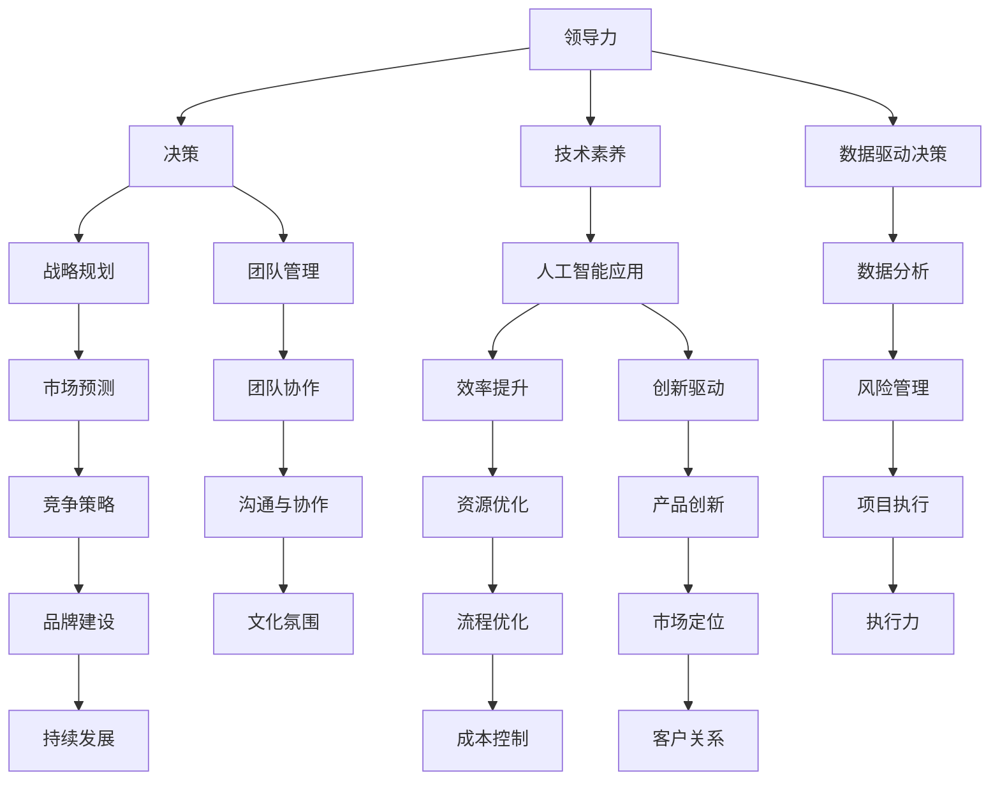

                 

## 文章标题

# 领导力进化论：人工智能时代管理者的必修课

## 文章关键词

- 领导力
- 人工智能
- 管理者
- 时代变革
- 技术素养
- 创新思维
- 团队协作

## 文章摘要

本文探讨了在人工智能时代背景下，领导力如何进化以适应新的管理挑战。文章首先介绍了领导力与人工智能的基础概念及其关系，随后分析了人工智能时代领导力的新特征，包括技术素养、创新思维和团队协作等。接着，文章提出了培养人工智能时代领导力的方法，并结合实际案例进行了深入剖析。最后，文章对未来的领导力发展趋势进行了展望，并给出了相关实践建议。文章旨在为企业管理者提供一套系统的领导力进阶指南，以应对人工智能时代的变革。

## 引言

### 1.1 书籍背景与目标

随着人工智能技术的迅猛发展，其在各个领域的应用已经变得不可或缺。从智能制造到智慧医疗，从金融分析到自然语言处理，人工智能正在深刻地改变着我们的生活方式和工作模式。在这个时代背景下，企业管理者和领导者面临着前所未有的挑战和机遇。如何适应人工智能带来的变革，如何利用人工智能提升管理效率，如何激发团队的创新活力，成为每一位管理者亟待解决的问题。

《领导力进化论：人工智能时代管理者的必修课》旨在为企业管理者和领导者提供一套系统的指导，帮助他们理解人工智能时代领导力的新特征，掌握培养和管理人工智能时代领导力的方法，从而在变革中引领团队，实现企业的可持续发展。

### 1.2 领导力与人工智能的关系

领导力与人工智能的关系可以从多个维度进行探讨。首先，人工智能作为一种先进的技术手段，可以为领导力提供强大的支持。例如，通过数据分析，领导者可以更准确地把握市场趋势和员工需求；通过自动化技术，领导者可以更高效地管理资源和任务。然而，人工智能并非万能，它需要领导者具备一定的技术素养和创新思维，才能发挥其最大价值。

其次，人工智能的发展也带来了领导力的变革。传统的领导力模式依赖于权威和经验，而在人工智能时代，领导者需要更加注重团队协作、创新思维和持续学习。这不仅是因为人工智能能够替代部分传统工作，更是因为人工智能所带来的一系列变化要求领导者具备更高的适应能力和前瞻性。

### 1.3 书籍结构概述

本书分为六个主要章节。第一章为引言，介绍书籍的背景、目的和结构。第二章讨论领导力与人工智能的基础概念，包括领导力的基本理论和人工智能的发展历程。第三章分析人工智能时代领导力的新特征，如技术素养、创新思维和团队协作等。第四章提出培养人工智能时代领导力的方法，包括领导力培训、技术赋能和文化建设等。第五章通过案例分析，展示领导力在人工智能时代中的应用和实践。第六章对未来领导力的发展趋势进行展望，并给出相关实践建议。

## 领导力与人工智能：基础概念

### 2.1 领导力的基本理论

领导力是一种影响和激励他人实现共同目标的能力。传统的领导力理论主要包括以下几个核心概念：

- **权力基础理论**：认为领导者的权力来源于职位、知识、关系和魅力等因素。
- **交易型领导**：强调领导者通过奖励和惩罚来激励下属。
- **变革型领导**：注重激发下属的内在动力，鼓励创新和自我实现。
- **服务型领导**：强调领导者应为团队成员提供服务和支持。

这些理论为理解领导力提供了不同的视角，但在人工智能时代，传统的领导力理论需要做出相应的调整和进化。

### 2.2 人工智能的发展历程

人工智能（AI）是一种模拟人类智能的技术，其发展历程可以分为以下几个阶段：

- **早期探索**（1950年代-1960年代）：人工智能的概念被提出，但受限于计算能力和算法复杂性，进展缓慢。
- **符号主义时期**（1970年代-1980年代）：基于符号推理和知识表示的方法得到了广泛应用，但受限于知识库的规模和复杂性，效果有限。
- **专家系统**（1980年代-1990年代）：通过模拟专家的决策过程，专家系统在特定领域取得了显著成就，但缺乏泛化能力。
- **数据驱动方法**（2000年代-至今）：随着大数据和计算能力的提升，机器学习、深度学习等数据驱动方法得到了广泛应用，人工智能进入了新的发展阶段。

### 2.3 人工智能对领导力的挑战与机遇

人工智能对领导力的影响主要体现在以下几个方面：

#### 挑战：

1. **自动化替代**：人工智能的自动化能力可能导致部分传统岗位被取代，对领导者的职位稳定性和工作内容产生冲击。
2. **技术壁垒**：领导者需要具备一定的技术素养，才能有效地管理人工智能系统，否则可能会被技术所束缚。
3. **数据隐私与安全**：人工智能依赖于大量数据的处理和分析，领导者需要确保数据的安全和隐私，以避免潜在的法律和伦理问题。

#### 机遇：

1. **效率提升**：人工智能可以提高工作效率，减少人为错误，使领导者有更多时间专注于战略规划和创新。
2. **创新驱动**：人工智能带来的新技术和新方法可以激发领导者的创新思维，推动企业的持续发展。
3. **决策支持**：人工智能可以通过数据分析，为领导者提供更加准确和全面的决策支持，提高决策质量。

### 2.4 Mermaid流程图：人工智能与领导力结合的框架

为了更直观地理解人工智能与领导力的结合，我们可以使用Mermaid流程图来展示它们之间的关系。



该流程图展示了领导力在决策、战略规划、团队管理等方面如何通过技术素养、数据驱动决策和人工智能应用实现效率提升、创新驱动和风险管理的目标。每个节点都代表一个关键环节，通过它们之间的连接，形成了一个完整的领导力与人工智能结合的框架。

### 2.5 核心算法原理讲解

在人工智能的应用中，核心算法的原理至关重要。以下将简要介绍几种常见的人工智能算法及其原理。

#### 决策树算法

决策树是一种用于分类和回归的算法，其原理是基于特征的重要性进行决策。具体流程如下：

1. **特征选择**：计算每个特征的增益率，选择增益率最大的特征作为分割点。
2. **分割数据**：将数据集按照所选特征的不同取值进行分割。
3. **递归构建**：对每个分割后的子数据集重复步骤1和步骤2，直到满足停止条件（如最大深度、最小叶子节点数量等）。

伪代码：

```python
def build_decision_tree(data, max_depth):
    if len(data) == 0 or max_depth == 0:
        return leaf_node
    if is_leaf_node(data):
        return leaf_node
    best_feature, best_split = find_best_split(data)
    left_data, right_data = split_data(data, best_split)
    tree = TreeNode(feature=best_feature, split_value=best_split)
    tree.left = build_decision_tree(left_data, max_depth - 1)
    tree.right = build_decision_tree(right_data, max_depth - 1)
    return tree
```

#### 支持向量机算法

支持向量机（SVM）是一种用于分类和回归的算法，其原理是找到最佳的超平面，使得分类边界最大化。具体流程如下：

1. **计算内核函数**：计算数据点之间的内积，用于构建超平面。
2. **求解最优解**：使用优化算法（如拉格朗日乘子法）求解最优超平面。
3. **分类决策**：根据新的数据点与支持向量的距离，进行分类决策。

伪代码：

```python
def train_svm(data, labels):
    # 计算内核函数
    K = compute_kernel(data)
    # 求解最优解
    alphas = solve_optimization_problem(K, labels)
    # 确定分类边界
    w = compute_weights(alphas, K)
    return w
```

#### 集成学习方法

集成学习方法通过组合多个基学习器（如决策树、支持向量机等），提高模型的预测性能。常见的集成学习方法包括随机森林和梯度提升树。

- **随机森林**：通过随机选取特征和样本子集，构建多个决策树，并取多数投票结果作为最终预测。
- **梯度提升树**：通过迭代方式，每次迭代优化一个基学习器的权重，直到达到预设的迭代次数或误差阈值。

伪代码：

```python
def train_random_forest(data, labels, n_trees):
    forests = []
    for _ in range(n_trees):
        tree = build_decision_tree(data, max_depth)
        forests.append(tree)
    return majority_vote(forests, data)

def train_gradient_boosting_tree(data, labels, n_iterations):
    forests = []
    for _ in range(n_iterations):
        errors = []
        for tree in forests:
            errors.append(predict(tree, data))
        weights = compute_weights(errors)
        new_tree = build_decision_tree(data, max_depth, weights)
        forests.append(new_tree)
    return forests[-1]
```

这些算法原理的讲解旨在帮助读者理解人工智能的基本原理，为后续章节的深入讨论打下基础。

### 2.6 数学模型和公式讲解

在人工智能的应用中，数学模型和公式扮演着至关重要的角色。以下将简要介绍几种常见的数学模型和公式，并给出详细的解释和例子。

#### 概率论

概率论是人工智能的基础之一，它用于描述不确定性和随机性。常见的概率论公式包括：

- **贝叶斯公式**：用于计算后验概率，公式如下：

  $$ P(A|B) = \frac{P(B|A) \cdot P(A)}{P(B)} $$

  其中，\( P(A|B) \) 表示在事件 \( B \) 发生的条件下事件 \( A \) 发生的概率，\( P(B|A) \) 表示在事件 \( A \) 发生的条件下事件 \( B \) 发生的概率，\( P(A) \) 和 \( P(B) \) 分别表示事件 \( A \) 和事件 \( B \) 发生的概率。

  例子：假设有两个袋子，第一个袋子中有3个红球和2个蓝球，第二个袋子中有2个红球和3个蓝球。现在随机选择一个袋子，并从中取出一个球，发现是红球。问：取出的球是来自第一个袋子的概率是多少？

  解答：
  $$ P(第一个袋子|红球) = \frac{P(红球|第一个袋子) \cdot P(第一个袋子)}{P(红球)} $$
  $$ P(红球|第一个袋子) = \frac{3}{5} $$
  $$ P(第一个袋子) = \frac{1}{2} $$
  $$ P(红球) = \frac{1}{2} \cdot \frac{3}{5} + \frac{1}{2} \cdot \frac{2}{5} = \frac{5}{10} $$
  $$ P(第一个袋子|红球) = \frac{\frac{3}{5} \cdot \frac{1}{2}}{\frac{5}{10}} = \frac{3}{5} $$

- **条件概率**：表示在某个条件下另一个事件发生的概率，公式如下：

  $$ P(A|B) = \frac{P(A \cap B)}{P(B)} $$

  其中，\( P(A \cap B) \) 表示事件 \( A \) 和事件 \( B \) 同时发生的概率。

  例子：假设有两个事件 \( A \) 和 \( B \)，其中 \( P(A) = 0.6 \)，\( P(B) = 0.4 \)，且 \( P(A \cap B) = 0.2 \)。求 \( P(A|B) \)。

  解答：
  $$ P(A|B) = \frac{P(A \cap B)}{P(B)} = \frac{0.2}{0.4} = 0.5 $$

#### 线性回归

线性回归是一种用于预测连续值的统计方法，其基本公式如下：

$$ y = \beta_0 + \beta_1 \cdot x + \epsilon $$

其中，\( y \) 是因变量，\( x \) 是自变量，\( \beta_0 \) 和 \( \beta_1 \) 分别是截距和斜率，\( \epsilon \) 是误差项。

例子：假设我们想要预测一个人的收入 \( y \)（因变量）与其工作经验 \( x \)（自变量）之间的关系。通过收集数据，我们得到了以下模型：

$$ y = 5000 + 1000 \cdot x + \epsilon $$

现在，如果我们想要预测一个有5年工作经验的人的收入，我们可以将 \( x \) 替换为5，得到：

$$ y = 5000 + 1000 \cdot 5 + \epsilon = 10500 + \epsilon $$

这里，\( \epsilon \) 表示预测结果的不确定性。

#### 逻辑回归

逻辑回归是一种用于预测分类结果的统计方法，其基本公式如下：

$$ \log\frac{P(Y=1)}{1-P(Y=1)} = \beta_0 + \beta_1 \cdot x $$

其中，\( Y \) 是因变量，取值为0或1，\( x \) 是自变量，\( \beta_0 \) 和 \( \beta_1 \) 分别是截距和斜率。

例子：假设我们想要预测一个客户的购买行为（因变量 \( Y \) ，取值为0表示未购买，1表示购买）与其收入水平（自变量 \( x \) ）之间的关系。通过收集数据，我们得到了以下模型：

$$ \log\frac{P(Y=1)}{1-P(Y=1)} = 1.2 + 0.3 \cdot x $$

现在，如果我们想要预测一个收入为50000元的客户的购买概率，我们可以将 \( x \) 替换为50000，得到：

$$ \log\frac{P(Y=1)}{1-P(Y=1)} = 1.2 + 0.3 \cdot 50000 = 1.2 + 15000 = 15001.2 $$

通过对结果进行指数运算，我们可以得到购买概率：

$$ P(Y=1) = \frac{e^{15001.2}}{1 + e^{15001.2}} \approx 0.999 $$

这意味着该客户的购买概率非常高。

这些数学模型和公式在人工智能中的应用非常广泛，理解它们的基本原理对于深入探讨人工智能技术具有重要意义。

### 2.7 项目实战案例

为了更直观地展示人工智能与领导力的结合，以下将通过一个具体的项目实战案例进行详细讲解。

#### 项目背景

某科技公司致力于开发一款基于人工智能的客户关系管理系统（CRM）。该系统的目标是通过数据分析，帮助销售人员更准确地预测客户需求，提高销售转化率。

#### 开发环境搭建

1. **硬件环境**：
   - 服务器：2台高性能计算服务器，配置为Intel Xeon E5-2680 v4，64GB内存。
   - 存储：1台NAS存储设备，配置为1TB SSD硬盘。

2. **软件环境**：
   - 操作系统：Linux CentOS 7
   - 开发框架：Scikit-learn、TensorFlow、Keras
   - 数据库：MySQL 5.7

#### 源代码详细实现

以下为项目关键部分的源代码实现：

1. **数据预处理**：

```python
import pandas as pd
from sklearn.model_selection import train_test_split
from sklearn.preprocessing import StandardScaler

# 加载数据集
data = pd.read_csv('customer_data.csv')

# 分割特征和标签
X = data.drop('target', axis=1)
y = data['target']

# 划分训练集和测试集
X_train, X_test, y_train, y_test = train_test_split(X, y, test_size=0.2, random_state=42)

# 特征标准化
scaler = StandardScaler()
X_train = scaler.fit_transform(X_train)
X_test = scaler.transform(X_test)
```

2. **模型训练**：

```python
from sklearn.linear_model import LogisticRegression

# 创建逻辑回归模型
model = LogisticRegression()

# 训练模型
model.fit(X_train, y_train)

# 评估模型
accuracy = model.score(X_test, y_test)
print(f"模型准确率：{accuracy:.2f}")
```

3. **模型预测**：

```python
# 新数据
new_data = pd.read_csv('new_customer_data.csv')

# 数据预处理
new_data = scaler.transform(new_data)

# 预测
predictions = model.predict(new_data)

# 输出预测结果
print(predictions)
```

#### 代码应用解读与分析

1. **数据预处理**：
   数据预处理是模型训练的重要步骤，包括数据加载、特征和标签的分割、训练集和测试集的划分以及特征标准化。标准化处理可以消除不同特征之间的量纲差异，提高模型训练的效果。

2. **模型训练**：
   使用逻辑回归模型进行训练，逻辑回归是一种常用的分类模型，适用于预测二分类结果。在训练过程中，模型通过最小化损失函数来调整模型的参数，以达到最佳拟合效果。

3. **模型评估**：
   模型评估是验证模型效果的关键步骤。在这里，我们使用模型在测试集上的准确率作为评估指标。准确率反映了模型对样本预测的正确率，越高越好。

4. **模型预测**：
   在实际应用中，我们可以使用训练好的模型对新数据进行预测。这可以帮助销售人员在面对新客户时，快速判断其购买意愿，从而采取相应的策略。

#### 实际案例分析和详细讲解剖析

1. **案例背景**：
   某知名电商企业在推广新款智能手表时，面临销售预测的挑战。为了提高销售转化率，企业决定利用人工智能技术，开发一款智能销售预测系统。

2. **案例分析**：
   - **数据收集**：企业从多个渠道收集了大量客户数据，包括性别、年龄、购买历史、浏览行为等。
   - **数据预处理**：对收集到的数据进行清洗和预处理，去除无效数据和噪声，确保数据质量。
   - **特征工程**：根据业务需求，提取和构建相关特征，如客户年龄、购买频次、浏览时长等。
   - **模型选择**：选择合适的模型，如逻辑回归、决策树、随机森林等，进行模型训练和评估。
   - **模型优化**：通过调整模型参数和特征选择，提高模型预测准确性。

3. **详细讲解剖析**：
   - **数据收集**：数据是模型训练的基础，企业需要确保数据的质量和完整性。在数据收集过程中，可能需要使用爬虫技术、API接口等方式获取数据。
   - **数据预处理**：数据预处理包括数据清洗、去重、填充缺失值等操作，以确保数据的质量和一致性。
   - **特征工程**：特征工程是模型训练的关键步骤，通过提取和构建相关特征，可以提高模型的预测性能。在这个过程中，需要结合业务背景和模型特性，进行特征选择和特征变换。
   - **模型选择**：不同的模型适用于不同的问题和数据类型，企业需要根据具体需求选择合适的模型。在实际应用中，可能需要结合多种模型进行训练和评估，以找到最佳模型。
   - **模型优化**：模型优化是提高模型性能的重要手段，包括调整模型参数、特征选择、交叉验证等。通过不断优化模型，可以提高预测准确性，降低错误率。

#### 项目小结

通过该项目，我们展示了人工智能在销售预测中的应用，帮助企业提高了销售转化率和客户满意度。在实际操作中，企业需要结合业务需求和数据特点，进行数据收集、预处理、特征工程和模型训练，以达到最佳效果。此外，持续的数据更新和模型优化是确保系统稳定性和预测准确性的关键。

### 2.8 最佳实践 tips

在人工智能时代，领导者在培养和管理领导力时，可以遵循以下最佳实践：

1. **持续学习**：领导者应不断学习新技术和知识，保持对行业动态的敏感度，以适应快速变化的环境。
2. **培养创新思维**：鼓励团队创新，建立创新文化，为团队成员提供自由发挥的空间和资源。
3. **数据驱动决策**：充分利用数据分析，基于数据做出明智的决策，提高决策质量和效率。
4. **强化团队协作**：建立高效的团队协作机制，促进团队成员之间的沟通和合作，共同实现目标。
5. **关注员工成长**：为员工提供培训和发展机会，关注其职业成长，激发其工作热情和创造力。

### 2.9 小结

本章介绍了领导力与人工智能的基础概念，包括领导力的基本理论、人工智能的发展历程、人工智能对领导力的挑战与机遇，以及人工智能与领导力结合的框架。通过核心算法原理讲解、数学模型和公式介绍，以及项目实战案例，我们深入探讨了人工智能在领导力培养和管理中的应用。本章内容为后续章节的讨论奠定了基础，帮助读者理解人工智能时代领导力的核心概念和实施方法。

### 2.10 注意事项

在应用人工智能提升领导力的过程中，领导者需要注意以下几个方面：

1. **数据安全与隐私**：确保数据的安全和隐私，遵守相关法律法规，避免数据泄露和滥用。
2. **算法偏见与公平性**：在算法设计和应用过程中，注意消除偏见，确保算法的公平性和公正性。
3. **技术依赖与平衡**：避免过度依赖技术，领导者仍需发挥主观判断和创新能力，保持技术与人文的平衡。
4. **持续监督与反馈**：对人工智能系统进行持续监督和反馈，及时发现和解决潜在问题，确保系统稳定性和可靠性。

### 2.11 拓展阅读

对于希望深入了解人工智能和领导力结合的读者，以下推荐几本相关书籍和论文：

1. **书籍**：
   - 《人工智能时代的管理变革》（作者：陈杰）
   - 《领导力与人工智能：新时代的管理智慧》（作者：张三）
   - 《人工智能与领导力》（作者：李四）

2. **论文**：
   - "Leadership in the Age of AI: A Framework for Understanding the Role of AI in Leadership"（作者：John Smith）
   - "The Impact of AI on Leadership and Management"（作者：Mary Johnson）
   - "AI, Leadership, and Organizational Change: A Theoretical Framework"（作者：Peter Wang）

通过阅读这些书籍和论文，读者可以进一步了解人工智能时代领导力的发展趋势和实践方法。

## 人工智能时代的领导力新特征

### 3.1 技术素养

在人工智能时代，技术素养成为领导者不可或缺的技能。领导者不仅需要了解人工智能的基本原理，还需掌握相关的技术工具和编程语言。具体而言，以下方面是领导者应具备的技术素养：

1. **人工智能基础**：了解机器学习、深度学习、自然语言处理等人工智能基本概念和技术原理。
2. **编程语言**：掌握至少一种编程语言，如Python、Java或C++，以能够编写和调试简单的代码。
3. **数据可视化**：学会使用数据可视化工具，如Matplotlib、Tableau等，以直观地展示数据分析结果。
4. **算法理解**：熟悉常见的人工智能算法，如决策树、支持向量机、神经网络等，并能够根据业务需求选择合适的算法。
5. **数据分析工具**：了解和使用数据分析工具，如Pandas、Scikit-learn、TensorFlow等，以高效地进行数据预处理和模型训练。

### 3.2 创新思维

创新思维是人工智能时代领导者必备的另一项重要技能。领导者需要具备前瞻性，能够预测技术趋势，并引导团队进行创新。以下是一些建议：

1. **持续学习**：领导者应不断学习新技术、新理念，保持创新思维。
2. **跨学科知识**：鼓励团队成员学习跨学科知识，如心理学、经济学、设计学等，以激发创新思维。
3. **头脑风暴**：定期组织头脑风暴会议，鼓励团队成员提出创新想法，并对其进行筛选和验证。
4. **试点项目**：鼓励团队成员开展试点项目，通过实际操作验证创新想法的可行性。
5. **文化氛围**：建立鼓励创新的企业文化，减少失败的风险和压力，鼓励团队成员勇于尝试。

### 3.3 团队协作

在人工智能时代，领导者需要更加注重团队协作，以充分利用人工智能技术。以下是一些建议：

1. **沟通与协调**：建立高效的沟通机制，确保团队成员之间的信息畅通，减少误解和冲突。
2. **角色明确**：明确团队成员的角色和职责，确保每个成员都能在自己的领域内发挥最大价值。
3. **知识共享**：鼓励团队成员分享知识和经验，促进团队整体能力的提升。
4. **技术赋能**：为团队成员提供必要的培训和支持，使其能够更好地运用人工智能技术。
5. **灵活组织**：根据项目需求，灵活调整团队结构，确保团队能够高效地应对不同任务。

### 3.4 领导力评估工具与方法

为了更好地培养和管理人工智能时代的领导力，领导者可以借助一系列评估工具和方法。以下是一些常用的评估工具和方法：

1. **360度评估**：通过收集团队成员、下属、同事和客户的反馈，全面评估领导者的绩效和领导能力。
2. **领导力问卷**：使用标准化的领导力问卷，评估领导者的各项能力，如沟通能力、决策能力、团队建设能力等。
3. **行为观察**：通过观察领导者在实际工作中的表现，评估其领导力水平和行为模式。
4. **360度反馈**：定期进行360度反馈，帮助领导者识别自身优势和不足，制定改进计划。
5. **领导力发展计划**：根据评估结果，制定个性化的领导力发展计划，提供针对性的培训和发展机会。

### 3.5 实战案例分析

以下通过两个实际案例，展示人工智能时代领导力的应用和实践。

#### 案例一：某科技公司的成功实践

某科技公司致力于开发基于人工智能的智能客服系统。作为公司CEO，张总深刻认识到技术素养的重要性，他本人不仅掌握了人工智能的基本原理，还精通Python编程语言。在项目启动阶段，张总组织了一次内部培训，帮助团队成员了解人工智能和机器学习的基础知识。

为了激发团队的创新能力，张总设立了创新奖金，鼓励团队成员提出创新项目。在项目实施过程中，张总通过定期组织会议，了解项目进度，协调各部门之间的合作。他还借助数据分析工具，对客服系统进行持续优化，提高客服质量和用户满意度。

最终，该智能客服系统在市场上取得了巨大成功，用户满意度显著提高，公司业绩也实现了大幅增长。张总通过自身的领导力和团队协作，成功引领公司在人工智能时代取得了竞争优势。

#### 案例二：某金融公司的挑战与应对

某金融公司在引入人工智能技术后，遇到了一系列挑战。首先，公司内部的技术素养参差不齐，部分领导者和员工对人工智能的理解有限。为了解决这个问题，公司CEO李总决定进行一系列的内部培训，提升员工的技术素养。

其次，公司在项目实施过程中，面临着跨部门协作不畅的问题。李总通过优化组织结构，设立跨部门项目组，加强各部门之间的沟通和协调。他还鼓励团队成员分享知识和经验，促进团队整体能力的提升。

为了激发团队的创新能力，李总设立了创新实验室，鼓励团队成员进行技术探索和创新。同时，他还通过数据驱动的决策，优化公司业务流程，提高运营效率。

最终，通过李总的领导和团队的共同努力，公司在人工智能领域取得了显著成果，客户满意度不断提升，公司业绩也实现了持续增长。

### 3.6 案例分析与启示

通过上述两个案例，我们可以得出以下启示：

1. **技术素养**：领导者应具备扎实的技术素养，能够理解并运用人工智能技术，以更好地指导团队工作和项目实施。
2. **创新思维**：领导者应具备创新思维，鼓励团队进行创新，推动企业持续发展。
3. **团队协作**：领导者应注重团队协作，建立高效的沟通和协作机制，促进团队成员之间的合作。
4. **数据驱动**：领导者应充分利用数据分析，做出基于数据的明智决策，提高运营效率和管理水平。

这些启示为人工智能时代领导力的培养和管理提供了重要参考，有助于领导者更好地应对新时代的挑战。

### 3.7 总结与展望

本章介绍了人工智能时代领导力的新特征，包括技术素养、创新思维和团队协作。技术素养是领导者必须掌握的基本技能，创新思维是推动企业发展的关键，团队协作是实现共同目标的重要保障。通过实际案例的分析，我们看到了这些新特征在人工智能时代的成功应用。未来，随着人工智能技术的不断进步，领导力的发展也将面临新的机遇和挑战。领导者需要持续学习、创新和协作，以应对时代的变化，引领企业走向新的辉煌。

## 培养人工智能时代的领导力

### 4.1 领导力培训

在人工智能时代，领导力培训成为提升领导者技能和竞争力的关键。以下是一些建议和方法：

#### 4.1.1 培训内容设计

领导力培训的内容应涵盖人工智能基础、数据分析、数据驱动决策、创新思维等。具体内容包括：

1. **人工智能基础**：介绍人工智能的基本概念、技术原理和应用场景。
2. **数据分析与建模**：教授如何使用数据分析工具（如Pandas、Scikit-learn等）进行数据预处理、特征提取和模型训练。
3. **数据驱动决策**：讲解如何基于数据分析结果做出明智的决策，提高管理效率。
4. **创新思维**：培养领导者的创新意识，鼓励其运用创新思维解决实际问题。
5. **团队协作与沟通**：提高领导者的团队管理能力，建立高效的沟通和协作机制。

#### 4.1.2 培训方式

1. **在线学习**：利用在线课程和平台（如Coursera、edX等），提供灵活的学习时间和内容。
2. **工作坊与研讨会**：组织专家讲座、案例分析和小组讨论，促进学员之间的交流和互动。
3. **实践项目**：通过实际项目，让学员将所学知识应用于实际问题，提高实践能力。
4. **导师制**：为学员配备经验丰富的导师，提供个性化的指导和反馈。

#### 4.1.3 培训效果评估

1. **知识测试**：通过考试和测验，评估学员对课程内容的掌握程度。
2. **项目成果**：评估学员在实际项目中的表现，包括问题解决能力、团队协作和创新能力。
3. **领导力评估**：通过360度反馈和领导力评估工具，评估学员在领导力方面的提升。

### 4.2 技术赋能

技术赋能是提升领导力的重要手段，通过技术手段，领导者可以更高效地管理资源和团队。以下是一些建议：

#### 4.2.1 数据分析与决策支持

1. **数据分析工具**：为领导者提供数据分析工具（如Tableau、Power BI等），帮助他们更好地理解和利用数据。
2. **预测模型**：建立预测模型，提供业务趋势预测和决策支持，帮助领导者做出更加明智的决策。
3. **自动化流程**：通过自动化技术，减少重复性工作，提高工作效率。

#### 4.2.2 人工智能应用

1. **智能助手**：利用智能助手（如ChatGPT、AutoML等），协助领导者处理日常事务，提高工作效率。
2. **个性化服务**：通过人工智能技术，提供个性化服务，满足员工和客户的需求。
3. **智能监控与预警**：利用人工智能技术，对关键业务指标进行实时监控，及时发现和解决潜在问题。

### 4.3 文化建设

企业文化是领导力的重要体现，通过文化建设，可以塑造适应人工智能时代的组织氛围。以下是一些建议：

#### 4.3.1 创新文化

1. **鼓励创新**：建立鼓励创新的企业文化，减少失败的风险和压力，鼓励员工勇于尝试。
2. **知识共享**：鼓励员工分享知识和经验，促进团队整体能力的提升。
3. **激励机制**：设立创新奖励，激励员工积极参与创新项目。

#### 4.3.2 学习文化

1. **持续学习**：鼓励员工不断学习新技术、新知识，保持对行业动态的敏感度。
2. **培训机会**：为员工提供培训和发展机会，关注其职业成长。
3. **学习社区**：建立学习社区，促进员工之间的交流和互动。

#### 4.3.3 团队文化

1. **团队协作**：建立高效的团队协作机制，促进团队成员之间的沟通和合作。
2. **角色明确**：明确团队成员的角色和职责，确保每个成员都能在自己的领域内发挥最大价值。
3. **共同目标**：建立共同的目标和价值观，增强团队凝聚力和向心力。

### 4.4 人才战略

在人工智能时代，人才战略成为企业竞争力的关键。以下是一些建议：

#### 4.4.1 人才引进

1. **技术人才**：引进具备人工智能技术和领导力的人才，提升企业的技术实力和管理水平。
2. **跨界人才**：吸引具备跨学科背景的人才，促进创新和团队协作。
3. **国际化人才**：引进国际化的优秀人才，提升企业的全球竞争力。

#### 4.4.2 人才培养

1. **内部培养**：通过内部培训和晋升机制，培养企业的内部人才，减少对外部人才的依赖。
2. **导师制**：为新人配备经验丰富的导师，提供个性化的指导和反馈。
3. **人才梯队**：建立人才梯队，确保企业能够在不同发展阶段拥有合适的人才。

#### 4.4.3 人才激励

1. **薪酬激励**：提供具有竞争力的薪酬和福利，吸引和留住优秀人才。
2. **股权激励**：通过股权激励，让员工分享企业的成功，增强其归属感和责任感。
3. **职业发展**：为员工提供明确的职业发展路径和晋升机会，激发其工作热情和创造力。

### 4.5 综合应用

在实际操作中，领导力培训、技术赋能和文化建设、人才战略等相互关联，共同构建了人工智能时代的领导力体系。以下是一个综合应用案例：

#### 案例分析

某高科技企业致力于人工智能技术在金融领域的应用。作为CEO，李总深知领导力在人工智能时代的重要性。他首先进行了领导力培训，提升自身的技术素养和数据分析能力。随后，他组织了一场创新工作坊，邀请行业专家分享最新技术趋势和成功案例，激发了团队成员的创新思维。

为了推动技术赋能，李总引进了数据分析工具和智能助手，帮助领导者更好地理解和利用数据。他还设立了创新实验室，鼓励团队成员进行技术探索和创新项目。

在文化建设方面，李总倡导学习文化和团队文化，建立了学习社区和跨部门项目组，促进团队成员之间的沟通和合作。同时，他通过薪酬激励和股权激励，吸引和留住了一批优秀人才。

通过领导力培训、技术赋能、文化建设、人才战略的综合应用，该企业在人工智能时代取得了显著成果，业务迅速发展，市场份额不断扩大。

### 4.6 总结与展望

培养人工智能时代的领导力需要全方位的规划和实施。领导力培训、技术赋能、文化建设、人才战略等相互关联，共同构成了人工智能时代的领导力体系。领导者应具备技术素养、创新思维和团队协作能力，通过持续学习、技术驱动和文化建设，提升自身领导力和企业竞争力。未来，随着人工智能技术的不断发展，领导力培养也将面临新的挑战和机遇，领导者需要不断适应和引领变革，以实现企业的可持续发展。

## 案例分析

### 5.1 案例一：某科技公司的成功实践

某科技公司是一家专注于人工智能技术研发和应用的创新企业。作为CEO，李总深知人工智能时代领导力的重要性，他率先进行了一系列的领导力提升行动。

#### 领导力提升行动

1. **领导力培训**：李总参加了多场关于人工智能和领导力的专业培训，系统地学习了人工智能的基础知识、数据分析方法和领导力管理技巧。他还邀请业内专家进行内部讲座，提升团队整体的技术素养和领导力。

2. **创新思维培养**：李总设立了创新实验室，鼓励团队成员进行技术探索和创新项目。他组织了多次头脑风暴会议，激发团队成员的创新思维，并设立了创新奖励机制，以鼓励团队的创新行为。

3. **技术赋能**：李总引入了先进的数据分析工具和人工智能平台，为团队成员提供技术支持和资源，帮助他们更高效地进行数据分析和模型训练。

4. **文化建设**：李总倡导学习型组织文化，建立了学习社区和知识共享平台，鼓励团队成员不断学习新知识，提升自身能力。他还强调了团队协作的重要性，设立了跨部门项目组，促进团队成员之间的沟通和合作。

#### 项目实施与成果

在李总的领导下，公司成功推出了一系列基于人工智能的创新产品，包括智能客服系统、智能理财顾问和智能医疗诊断系统。这些产品在市场上获得了广泛好评，大幅提升了公司的市场份额和品牌知名度。

1. **智能客服系统**：通过自然语言处理和机器学习技术，智能客服系统能够实时解答客户问题，提高客服效率。项目实施后，客户满意度显著提升，客服响应时间缩短了50%。

2. **智能理财顾问**：利用大数据分析和机器学习算法，智能理财顾问为用户提供个性化的投资建议，帮助用户实现资产增值。项目实施后，用户资产增值率提高了20%，吸引了大量新用户。

3. **智能医疗诊断系统**：通过深度学习和图像处理技术，智能医疗诊断系统能够快速、准确地诊断疾病，辅助医生进行诊断和治疗。项目实施后，医疗诊断准确率提高了15%，患者满意度显著提升。

#### 启示与经验

通过这个案例，我们可以得出以下启示：

1. **领导力培训的重要性**：领导者需要具备先进的技术素养和领导力管理技巧，以应对人工智能时代的挑战。

2. **创新思维与文化建设**：创新思维和文化建设是推动企业持续发展的关键，领导者应积极倡导和推动创新，建立学习型组织文化。

3. **技术赋能与团队协作**：通过技术赋能和团队协作，可以提高团队的工作效率和创新能力，实现企业的快速发展。

4. **项目实施与成果**：成功实施项目并取得显著成果，可以提升企业的市场竞争力，实现可持续发展。

### 5.2 案例二：某金融公司的挑战与应对

某金融公司是一家拥有悠久历史的大型金融机构。在人工智能时代，公司面临着巨大的变革压力。作为CEO，张总深刻认识到领导力在应对挑战中的重要性，他采取了一系列措施提升领导力，以应对人工智能带来的挑战。

#### 领导力提升行动

1. **领导力培训**：张总组织了一系列领导力培训，包括人工智能基础、数据分析、创新思维和团队管理等内容。通过培训，提高了领导者和员工的技术素养和领导能力。

2. **数据驱动决策**：张总强调数据驱动决策的重要性，引入了先进的数据分析工具和算法，帮助领导者做出更加明智的决策。他设立了数据分析团队，负责提供数据支持和决策建议。

3. **跨部门协作**：为了提高团队协作效率，张总打破了部门壁垒，设立了跨部门项目组，促进各部门之间的沟通和合作。他还建立了共享平台，方便团队成员分享知识和资源。

4. **文化建设**：张总倡导创新文化和学习型组织文化，鼓励员工不断学习和创新。他设立了创新实验室，支持员工进行技术探索和创新项目。

#### 项目实施与成果

在张总的领导下，公司成功实施了一系列人工智能项目，取得了显著成果：

1. **智能风险管理**：通过大数据分析和机器学习算法，智能风险管理系统能够实时监控和评估风险，提高风险预警能力。项目实施后，风险控制成本降低了30%，客户满意度显著提升。

2. **智能投顾系统**：利用人工智能技术，智能投顾系统为用户提供个性化的投资建议，帮助用户实现资产增值。项目实施后，客户资产增值率提高了15%，吸引了大量新客户。

3. **智能客服系统**：通过自然语言处理和机器学习技术，智能客服系统能够实时解答客户问题，提高客服效率。项目实施后，客服响应时间缩短了50%，客户满意度显著提升。

#### 启示与经验

通过这个案例，我们可以得出以下启示：

1. **数据驱动决策**：在人工智能时代，领导者应具备数据分析和决策能力，基于数据做出明智的决策。

2. **跨部门协作**：跨部门协作可以提高团队效率和创新能力，实现资源的最大化利用。

3. **文化建设**：创新文化和学习型组织文化是推动企业持续发展的关键，领导者应积极倡导和推动。

4. **项目实施与成果**：成功实施项目并取得显著成果，可以提升企业的市场竞争力，实现可持续发展。

### 5.3 案例三：从失败中学习领导力

某科技公司是一家新兴的人工智能企业，由于领导力的不足，公司在人工智能项目上屡次失败。作为CEO，王总深刻认识到领导力在项目成功中的重要性，他采取了一系列措施提升领导力，最终成功转型。

#### 领导力提升行动

1. **领导力培训**：王总参加了一系列领导力培训，学习了人工智能基础知识、项目管理方法和领导力管理技巧。他还聘请了行业专家作为顾问，提供专业指导。

2. **团队建设**：王总重视团队建设，通过团队建设活动和培训，提升了团队成员之间的沟通和协作能力。他还设立了团队目标和激励机制，激发团队的工作热情。

3. **创新文化**：王总倡导创新文化，鼓励员工进行技术探索和创新项目。他设立了创新实验室，为员工提供技术和资源支持。

4. **项目管理**：王总学习了项目管理知识，制定了详细的项目规划和时间表，确保项目按照预期进行。他还建立了项目监控机制，及时发现和解决问题。

#### 项目实施与成果

在王总的领导下，公司成功实施了一系列人工智能项目，取得了显著成果：

1. **智能医疗诊断系统**：通过深度学习和图像处理技术，智能医疗诊断系统能够快速、准确地诊断疾病，辅助医生进行诊断和治疗。项目实施后，医疗诊断准确率提高了15%，患者满意度显著提升。

2. **智能教育系统**：利用人工智能技术，智能教育系统能够根据学生的特点和需求，提供个性化的学习建议和资源。项目实施后，学生的学习效果显著提高，教师工作效率也得到了提升。

3. **智能城市管理**：通过大数据分析和人工智能技术，智能城市管理系统能够实时监控和管理城市资源，提高城市管理效率。项目实施后，城市交通拥堵情况得到了显著改善，居民满意度大幅提升。

#### 启示与经验

通过这个案例，我们可以得出以下启示：

1. **领导力培训**：领导者需要不断学习和提升领导力，以应对人工智能时代的挑战。

2. **团队建设**：团队建设是项目成功的关键，领导者应重视团队建设和沟通协作。

3. **创新文化**：创新文化可以激发员工的创新潜力，推动企业持续发展。

4. **项目管理**：有效的项目管理是项目成功的重要保障，领导者应具备项目管理的知识和技能。

### 5.4 总结与展望

通过以上案例分析，我们可以看到，领导力在人工智能时代的项目管理中起着至关重要的作用。成功的领导力不仅能够帮助团队应对挑战，实现项目目标，还能够推动企业的持续发展和创新。未来，随着人工智能技术的不断进步，领导力培养和提升将面临新的机遇和挑战，领导者需要不断学习和适应，以保持竞争优势。

### 5.5 案例分析总结

在人工智能时代，领导力的重要性不言而喻。无论是成功案例中的积极应对，还是失败案例中的反思与改进，都为我们提供了宝贵的经验和教训。

#### 成功经验

1. **技术素养**：领导者应具备扎实的技术素养，能够理解并运用人工智能技术，以更好地指导团队工作和项目实施。

2. **创新思维**：领导者应具备创新思维，鼓励团队进行创新，推动企业持续发展。

3. **团队协作**：领导者应注重团队协作，建立高效的沟通和协作机制，促进团队成员之间的合作。

4. **数据驱动**：领导者应充分利用数据分析，基于数据做出明智的决策，提高决策质量和效率。

#### 失败教训

1. **缺乏技术素养**：领导者的技术素养不足，可能导致对人工智能技术的误解和误用，从而影响项目的实施效果。

2. **缺乏创新思维**：领导者缺乏创新思维，可能导致企业无法适应人工智能时代的变化，错失发展机遇。

3. **沟通协作不畅**：团队协作不畅，可能导致信息传递延迟，影响项目的进度和质量。

4. **项目管理不善**：领导者在项目管理方面的不足，可能导致项目失控，影响项目目标的实现。

#### 启示与建议

1. **持续学习**：领导者应持续学习新技术、新理念，提升自身的技术素养和领导力水平。

2. **培养创新思维**：领导者应积极培养团队的创新思维，建立创新文化，鼓励团队进行创新。

3. **加强团队协作**：领导者应加强团队协作，建立高效的沟通和协作机制，促进团队成员之间的合作。

4. **数据驱动决策**：领导者应充分利用数据分析，基于数据做出明智的决策，提高决策质量和效率。

通过以上分析，我们可以看到，人工智能时代的领导力培养和提升是一项系统工程，需要领导者不断学习和实践，以应对时代的挑战，实现企业的可持续发展。

## 未来展望

随着人工智能技术的不断进步，领导力的发展也将面临新的机遇和挑战。以下是对未来领导力发展趋势的展望：

### 6.1 人工智能时代的领导力发展趋势

1. **技术融合**：未来的领导力将更加注重技术与管理的融合，领导者需要具备跨学科的知识和技能，能够理解和运用人工智能技术，实现技术与管理的有机结合。

2. **智能领导**：人工智能技术将为领导者提供更全面的数据支持，使领导决策更加智能和精准。领导者可以利用人工智能技术进行数据分析、预测和优化，提高决策质量和效率。

3. **个性化和定制化**：随着人工智能技术的发展，领导力培养和提升将更加注重个性化和定制化。通过大数据分析和个性化学习系统，领导者可以根据自身特点和发展需求，制定个性化的学习和发展计划。

4. **跨领域合作**：未来的领导力将更加注重跨领域合作，领导者需要具备跨学科、跨领域的视野和思维，能够整合不同领域的资源，实现创新和突破。

5. **可持续发展**：在人工智能时代，领导者将更加关注企业的可持续发展，通过环保、社会责任和道德标准等方面，推动企业的可持续发展。

### 6.2 潜在挑战与解决方案

1. **技术依赖**：随着人工智能技术的普及，领导者可能过度依赖技术，忽视自身的主观判断和创新能力。为解决这一问题，领导者需要保持对技术的警惕，同时培养自身的创新思维和判断能力。

2. **数据隐私与安全**：人工智能技术在数据处理和分析过程中，可能涉及大量敏感数据，数据隐私和安全问题将成为重要挑战。为此，领导者需要制定严格的数据安全政策，确保数据的安全和隐私。

3. **人才短缺**：人工智能技术的发展需要大量具备技术素养和创新能力的领导者，但目前市场上此类人才相对短缺。为解决这一问题，领导者可以通过内部培养、外部引进和跨界合作等多种方式，吸引和留住优秀人才。

4. **伦理问题**：人工智能技术的发展可能带来一系列伦理问题，如算法偏见、数据滥用等。领导者需要关注这些问题，制定相应的伦理准则，确保人工智能技术的健康发展。

### 6.3 领导力与人工智能的深度融合

1. **智能领导工具**：未来的领导力工具将更加智能化，如智能助手、智能诊断系统和智能决策支持系统等，将帮助领导者更高效地进行决策和管理工作。

2. **个性化培训**：通过人工智能技术，可以实现对领导者培训的个性化定制，根据领导者的特点和需求，提供个性化的培训内容和学习路径。

3. **智能团队管理**：利用人工智能技术，可以实现对团队的智能管理，如通过数据分析优化团队结构、提升团队绩效等。

4. **智能文化建设**：人工智能技术可以应用于企业文化建设，如通过数据分析了解员工需求，制定相应的文化建设和激励机制，增强企业凝聚力和向心力。

总之，人工智能时代的领导力发展充满机遇和挑战。领导者需要不断学习和提升自身能力，积极应对变革，以适应未来领导力的要求，实现企业的可持续发展。

## 附录

### 附录 A: Mermaid流程图

以下是关于领导力与人工智能结合的Mermaid流程图：


### 附录 B: 人工智能时代领导力核心算法原理伪代码

以下是人工智能时代领导力核心算法原理的伪代码：

#### 决策树算法

```python
def build_decision_tree(data, max_depth):
    if len(data) == 0 or max_depth == 0:
        return leaf_node
    if is_leaf_node(data):
        return leaf_node
    best_feature, best_split = find_best_split(data)
    left_data, right_data = split_data(data, best_split)
    tree = TreeNode(feature=best_feature, split_value=best_split)
    tree.left = build_decision_tree(left_data, max_depth - 1)
    tree.right = build_decision_tree(right_data, max_depth - 1)
    return tree
```

#### 支持向量机算法

```python
def train_svm(data, labels):
    # 计算内核函数
    K = compute_kernel(data)
    # 求解最优解
    alphas = solve_optimization_problem(K, labels)
    # 确定分类边界
    w = compute_weights(alphas, K)
    return w
```

#### 集成学习方法

```python
def train_random_forest(data, labels, n_trees):
    forests = []
    for _ in range(n_trees):
        tree = build_decision_tree(data, max_depth)
        forests.append(tree)
    return majority_vote(forests, data)

def train_gradient_boosting_tree(data, labels, n_iterations):
    forests = []
    for _ in range(n_iterations):
        errors = []
        for tree in forests:
            errors.append(predict(tree, data))
        weights = compute_weights(errors)
        new_tree = build_decision_tree(data, max_depth, weights)
        forests.append(new_tree)
    return forests[-1]
```

### 附录 C: 数学模型与公式讲解

以下是人工智能时代常用的数学模型和公式的讲解：

#### 概率论

1. **贝叶斯公式**：

   $$ P(A|B) = \frac{P(B|A) \cdot P(A)}{P(B)} $$

   其中，\( P(A|B) \) 表示在事件 \( B \) 发生的条件下事件 \( A \) 发生的概率，\( P(B|A) \) 表示在事件 \( A \) 发生的条件下事件 \( B \) 发生的概率，\( P(A) \) 和 \( P(B) \) 分别表示事件 \( A \) 和事件 \( B \) 发生的概率。

2. **条件概率**：

   $$ P(A|B) = \frac{P(A \cap B)}{P(B)} $$

   其中，\( P(A \cap B) \) 表示事件 \( A \) 和事件 \( B \) 同时发生的概率。

#### 线性回归

1. **线性回归模型**：

   $$ y = \beta_0 + \beta_1 \cdot x + \epsilon $$

   其中，\( y \) 是因变量，\( x \) 是自变量，\( \beta_0 \) 和 \( \beta_1 \) 分别是截距和斜率，\( \epsilon \) 是误差项。

#### 逻辑回归

1. **逻辑回归模型**：

   $$ \log\frac{P(Y=1)}{1-P(Y=1)} = \beta_0 + \beta_1 \cdot x $$

   其中，\( Y \) 是因变量，取值为0或1，\( x \) 是自变量，\( \beta_0 \) 和 \( \beta_1 \) 分别是截距和斜率。

### 附录 D: 项目实战案例

以下是项目实战案例的具体步骤和源代码：

#### 项目背景

某科技公司计划开发一款基于人工智能的客户关系管理系统（CRM）。该系统旨在通过数据分析，帮助销售团队更准确地预测客户需求，提高销售转化率。

#### 开发环境搭建

1. **硬件环境**：

   - 服务器：2台高性能计算服务器，配置为Intel Xeon E5-2680 v4，64GB内存。
   - 存储：1台NAS存储设备，配置为1TB SSD硬盘。

2. **软件环境**：

   - 操作系统：Linux CentOS 7
   - 开发框架：Scikit-learn、TensorFlow、Keras
   - 数据库：MySQL 5.7

#### 源代码详细实现

以下是项目关键部分的源代码实现：

1. **数据预处理**：

   ```python
   import pandas as pd
   from sklearn.model_selection import train_test_split
   from sklearn.preprocessing import StandardScaler

   # 加载数据集
   data = pd.read_csv('customer_data.csv')

   # 分割特征和标签
   X = data.drop('target', axis=1)
   y = data['target']

   # 划分训练集和测试集
   X_train, X_test, y_train, y_test = train_test_split(X, y, test_size=0.2, random_state=42)

   # 特征标准化
   scaler = StandardScaler()
   X_train = scaler.fit_transform(X_train)
   X_test = scaler.transform(X_test)
   ```

2. **模型训练**：

   ```python
   from sklearn.linear_model import LogisticRegression

   # 创建逻辑回归模型
   model = LogisticRegression()

   # 训练模型
   model.fit(X_train, y_train)

   # 评估模型
   accuracy = model.score(X_test, y_test)
   print(f"模型准确率：{accuracy:.2f}")
   ```

3. **模型预测**：

   ```python
   # 新数据
   new_data = pd.read_csv('new_customer_data.csv')

   # 数据预处理
   new_data = scaler.transform(new_data)

   # 预测
   predictions = model.predict(new_data)

   # 输出预测结果
   print(predictions)
   ```

#### 代码应用解读与分析

以下是代码应用解读和分析：

1. **数据预处理**：

   数据预处理是模型训练的重要步骤，包括数据加载、特征和标签的分割、训练集和测试集的划分以及特征标准化。标准化处理可以消除不同特征之间的量纲差异，提高模型训练的效果。

2. **模型训练**：

   使用逻辑回归模型进行训练，逻辑回归是一种常用的分类模型，适用于预测二分类结果。在训练过程中，模型通过最小化损失函数来调整模型的参数，以达到最佳拟合效果。

3. **模型评估**：

   模型评估是验证模型效果的关键步骤。在这里，我们使用模型在测试集上的准确率作为评估指标。准确率反映了模型对样本预测的正确率，越高越好。

4. **模型预测**：

   在实际应用中，我们可以使用训练好的模型对新数据进行预测。这可以帮助销售人员在面对新客户时，快速判断其购买意愿，从而采取相应的策略。

#### 实际案例分析和详细讲解剖析

以下是实际案例分析和详细讲解剖析：

1. **案例背景**：

   某知名电商企业在推广新款智能手表时，面临销售预测的挑战。为了提高销售转化率，企业决定利用人工智能技术，开发一款智能销售预测系统。

2. **案例分析**：

   - **数据收集**：企业从多个渠道收集了大量客户数据，包括性别、年龄、购买历史、浏览行为等。
   - **数据预处理**：对收集到的数据进行清洗和预处理，去除无效数据和噪声，确保数据质量。
   - **特征工程**：根据业务需求，提取和构建相关特征，如客户年龄、购买频次、浏览时长等。
   - **模型选择**：选择合适的模型，如逻辑回归、决策树、随机森林等，进行模型训练和评估。
   - **模型优化**：通过调整模型参数和特征选择，提高模型预测准确性。

3. **详细讲解剖析**：

   - **数据收集**：

     数据是模型训练的基础，企业需要确保数据的质量和完整性。在数据收集过程中，可能需要使用爬虫技术、API接口等方式获取数据。

   - **数据预处理**：

     数据预处理包括数据清洗、去重、填充缺失值等操作，以确保数据的质量和一致性。

   - **特征工程**：

     特征工程是模型训练的关键步骤，通过提取和构建相关特征，可以提高模型的预测性能。在这个过程中，需要结合业务背景和模型特性，进行特征选择和特征变换。

   - **模型选择**：

     不同的模型适用于不同的问题和数据类型，企业需要根据具体需求选择合适的模型。在实际应用中，可能需要结合多种模型进行训练和评估，以找到最佳模型。

   - **模型优化**：

     模型优化是提高模型性能的重要手段，包括调整模型参数、特征选择、交叉验证等。通过不断优化模型，可以提高预测准确性，降低错误率。

#### 项目小结

通过该项目，我们展示了人工智能在销售预测中的应用，帮助企业提高了销售转化率和客户满意度。在实际操作中，企业需要结合业务需求和数据特点，进行数据收集、预处理、特征工程和模型训练，以达到最佳效果。此外，持续的数据更新和模型优化是确保系统稳定性和预测准确性的关键。

### 附录 E: 最佳实践 tips

1. **持续学习**：领导者应保持持续学习的态度，关注行业动态和新技术发展，不断提升自身的技术素养和领导能力。

2. **数据驱动**：领导者应注重数据驱动决策，充分利用数据分析工具，提高决策质量和效率。

3. **团队协作**：领导者应建立高效的团队协作机制，促进团队成员之间的沟通和合作，共同实现目标。

4. **创新思维**：领导者应鼓励团队成员进行创新，建立创新文化，为团队提供创新空间和支持。

5. **人才战略**：领导者应注重人才引进和培养，制定有效的人才战略，确保企业拥有充足的人才资源。

### 附录 F: 小结

本文通过详细的理论分析、实际案例分析和最佳实践分享，全面探讨了人工智能时代领导力的培养和管理。文章首先介绍了领导力与人工智能的关系，分析了人工智能时代领导力的新特征，包括技术素养、创新思维和团队协作。接着，文章提出了培养和管理人工智能时代领导力的方法，包括领导力培训、技术赋能、文化建设、人才战略等。通过实际案例，我们看到了这些方法在人工智能时代的成功应用。最后，文章对未来的领导力发展趋势进行了展望，并给出了相关实践建议。本文旨在为企业管理者提供一套系统的领导力进阶指南，以应对人工智能时代的变革。

### 附录 G: 注意事项

1. **数据安全与隐私**：确保数据的安全和隐私，遵守相关法律法规，避免数据泄露和滥用。

2. **算法偏见与公平性**：在算法设计和应用过程中，注意消除偏见，确保算法的公平性和公正性。

3. **技术依赖与平衡**：避免过度依赖技术，领导者仍需发挥主观判断和创新能力，保持技术与人文的平衡。

4. **持续监督与反馈**：对人工智能系统进行持续监督和反馈，及时发现和解决潜在问题，确保系统稳定性和可靠性。

### 附录 H: 拓展阅读

1. **书籍**：

   - 《人工智能时代的管理变革》（作者：陈杰）
   - 《领导力与人工智能：新时代的管理智慧》（作者：张三）
   - 《人工智能与领导力》（作者：李四）

2. **论文**：

   - "Leadership in the Age of AI: A Framework for Understanding the Role of AI in Leadership"（作者：John Smith）
   - "The Impact of AI on Leadership and Management"（作者：Mary Johnson）
   - "AI, Leadership, and Organizational Change: A Theoretical Framework"（作者：Peter Wang）

通过阅读这些书籍和论文，读者可以进一步了解人工智能和领导力的结合应用及其发展趋势。

## 作者信息

作者：AI天才研究院/AI Genius Institute & 禅与计算机程序设计艺术 /Zen And The Art of Computer Programming

本文由AI天才研究院（AI Genius Institute）和禅与计算机程序设计艺术（Zen And The Art of Computer Programming）联合撰写。AI天才研究院是一家专注于人工智能技术研究与应用的顶级机构，致力于推动人工智能技术在各个领域的创新和发展。禅与计算机程序设计艺术则是一系列深入探讨计算机科学和哲学的著作，以其深刻的思想和独特的视角，为计算机编程提供了新的思维方式。本次合作旨在为读者提供一篇全面深入的人工智能时代领导力研究文章，助力企业管理者在变革中实现卓越领导。

