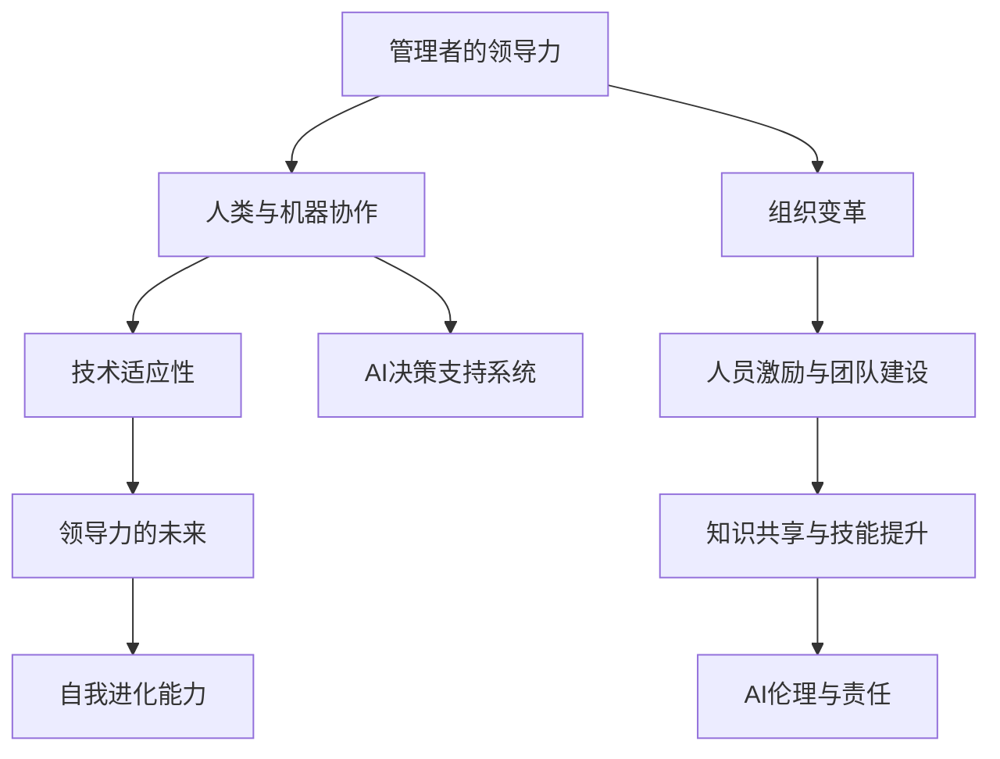

                 

# 领导力进化论：人工智能时代管理者的领导力修炼

关键词：人工智能、领导力、管理者、进化、变革、团队建设、算法原理

摘要：随着人工智能技术的飞速发展，管理者面临的挑战和机遇日益增多。本文从核心概念、算法原理、数学模型和实际案例等多个角度，探讨了人工智能时代管理者的领导力修炼之道，旨在为现代企业管理者提供有价值的参考和指导。

## 核心概念与联系

### 人工智能时代管理者的领导力概念

在人工智能时代，管理者的领导力不仅包括传统的沟通、协调和决策能力，还必须具备对人工智能技术的理解和应用能力。具体来说，人工智能时代管理者的领导力可以概括为以下几个方面：

1. **人类与机器协作**：管理者需要能够有效协调人类和机器之间的合作，充分利用人工智能的优势，提升团队的整体效能。
2. **组织变革**：管理者需要推动组织进行结构性变革，以适应人工智能时代的发展趋势。
3. **技术适应性**：管理者需要具备快速适应新技术的能力，引导团队不断创新。
4. **人员激励与团队建设**：管理者需要能够激励团队成员，打造一支高度协作的团队。
5. **知识共享与技能提升**：管理者需要促进知识的共享和技能的提升，确保团队具备应对未来挑战的能力。
6. **AI决策支持系统**：管理者需要构建AI决策支持系统，提升决策的科学性和准确性。
7. **自我进化能力**：管理者需要具备自我进化能力，不断学习、进步，以适应不断变化的外部环境。
8. **AI伦理与责任**：管理者需要关注AI伦理问题，确保人工智能的发展符合社会伦理标准。

### Mermaid流程图



通过这个流程图，我们可以清晰地看到人工智能时代管理者所需具备的各种领导力要素及其相互关系。

## 核心算法原理讲解

### 机器学习算法

在人工智能时代，机器学习算法是管理者必须掌握的核心算法之一。以下是一个简单的机器学习算法伪代码示例：

```python
def machine_learning(data, labels):
    # 初始化模型参数
    model = initialize_model()
    
    # 训练模型
    for epoch in range(num_epochs):
        for sample, label in zip(data, labels):
            prediction = model(sample)
            loss = calculate_loss(prediction, label)
            update_model_parameters(model, loss)
    
    return model
```

在这个伪代码中，我们首先初始化模型参数，然后通过迭代的方式训练模型，每一次迭代都通过样本和标签计算损失，并更新模型参数。这样的过程一直持续到达到预定的迭代次数。

### 深度学习算法

深度学习算法是机器学习的一个重要分支，它通过多层神经网络来模拟人脑的决策过程。以下是一个简单的深度学习算法伪代码示例：

```python
def deep_learning(data, labels):
    # 初始化神经网络结构
    network = initialize_neural_network()
    
    # 训练神经网络
    for epoch in range(num_epochs):
        for sample, label in zip(data, labels):
            output = network.forward(sample)
            loss = calculate_loss(output, label)
            network.backward(output, label)
    
    return network
```

在这个伪代码中，我们首先初始化神经网络结构，然后通过迭代的方式训练神经网络，每一次迭代都通过样本和标签计算损失，并更新网络参数。这样的过程一直持续到达到预定的迭代次数。

### 数学模型和数学公式

在人工智能时代，管理者不仅需要掌握算法原理，还需要了解相关的数学模型和公式。以下是一个简单的领导力影响模型：

$$
\text{Leadership Impact} = f(\text{Leader's Competence}, \text{Team's Cohesion}, \text{External Environment})
$$

这个公式表明，领导力影响力是由领导者的能力、团队的凝聚力和外部环境共同决定的。通过这个模型，管理者可以更好地评估自己的领导力对团队和组织的影响。

## 项目实战

### 案例背景

某公司是一家高科技企业，专注于人工智能助手的开发。管理者需要在项目开发过程中，确保团队高效协作，并充分利用人工智能的优势。

### 案例步骤

1. **团队建设**：组建一个由数据科学家、软件工程师和产品经理组成的多学科团队。
2. **目标设定**：明确开发目标，制定可行的项目计划和时间表。
3. **技术选型**：选择合适的机器学习和深度学习算法，搭建开发环境。
4. **项目监控**：实时跟踪项目进度，确保团队在计划内完成各项工作。
5. **协作与沟通**：定期组织团队会议，促进团队成员之间的交流和合作。
6. **问题解决**：遇到问题时，及时解决并调整项目计划。

### 案例结果

通过有效管理，该公司成功开发出了一款具有竞争力的人工智能助手，并在市场上取得了良好的反响。

## 开发环境搭建

在搭建人工智能项目的开发环境时，管理者需要确保所选用的工具和库能够满足项目需求。以下是一个简单的开发环境搭建步骤：

1. **安装Python**：确保安装了Python 3.x版本。
2. **安装Jupyter Notebook**：Jupyter Notebook 是一个交互式的开发环境，适合进行数据分析和机器学习实验。
3. **安装TensorFlow**：TensorFlow 是一个开源的机器学习框架，支持多种深度学习算法。
4. **安装Scikit-learn**：Scikit-learn 是一个开源的机器学习库，提供了一系列常用的机器学习算法。
5. **安装其他依赖库**：根据项目需求，安装其他必要的依赖库，如Pandas、NumPy等。

### 源代码详细实现和代码解读

以下是一个简单的机器学习算法的实现示例：

```python
import numpy as np
from sklearn.model_selection import train_test_split
from sklearn.metrics import accuracy_score
from sklearn.ensemble import RandomForestClassifier

# 数据准备
data = np.array([[1, 2], [3, 4], [5, 6]])
labels = np.array([0, 1, 0])

# 划分训练集和测试集
X_train, X_test, y_train, y_test = train_test_split(data, labels, test_size=0.2, random_state=42)

# 模型训练
model = RandomForestClassifier()
model.fit(X_train, y_train)

# 模型预测
predictions = model.predict(X_test)

# 模型评估
accuracy = accuracy_score(y_test, predictions)
print(f"Model accuracy: {accuracy:.2f}")
```

在这个示例中，我们使用随机森林算法训练了一个分类模型。通过训练集训练模型，并在测试集上评估模型的准确性。这个简单的示例展示了机器学习算法的基本实现过程。

## 最佳实践 Tips

1. **持续学习**：人工智能技术日新月异，管理者需要不断学习最新的技术趋势和知识，以提升自己的领导力。
2. **关注团队建设**：团队是管理者最重要的资源，管理者需要关注团队建设，提升团队的凝聚力和执行力。
3. **风险管理**：人工智能项目存在一定的风险，管理者需要建立完善的风险管理机制，确保项目顺利进行。
4. **伦理意识**：管理者需要关注AI伦理问题，确保人工智能技术的发展符合社会伦理标准。

## 小结

人工智能时代为管理者带来了巨大的挑战和机遇。通过掌握核心算法原理、建立有效的团队、关注伦理问题等，管理者可以提升自己的领导力，带领团队在人工智能时代取得成功。

## 注意事项

1. **算法选择**：根据项目需求选择合适的算法，避免盲目跟风。
2. **数据质量**：数据是机器学习的基础，管理者需要确保数据的质量和完整性。
3. **团队协作**：鼓励团队成员之间的协作，提升团队的整体效能。

## 拓展阅读

1. 《人工智能：一种现代方法的进展》（周志华 著）
2. 《深度学习》（Goodfellow, Bengio, Courville 著）
3. 《领导力：如何与人工智能共同工作》（柯维 著）

## 作者信息

作者：AI天才研究院/AI Genius Institute & 禅与计算机程序设计艺术 /Zen And The Art of Computer Programming

