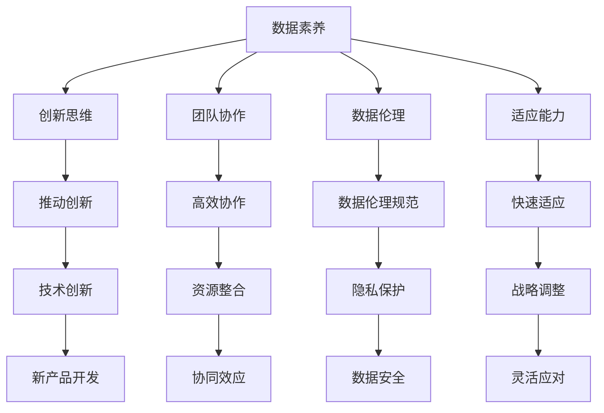

                 

### 引言

在当今社会，大数据技术已经成为企业竞争的重要武器，它不仅改变了企业的运营方式，也对管理者的领导力提出了新的挑战。面对海量数据的处理和分析，管理者需要具备全新的视角和技能，才能有效地引导团队，实现企业目标。因此，探讨大数据时代领导力的进化，成为当前企业管理研究的一个热点话题。

本书旨在深入探讨大数据时代领导力的演变，分析领导力在大数据背景下的新特点，并探讨管理者如何适应这一变化，从而提高领导效果。书中将围绕以下几个核心问题展开：

1. 领导力在大数据时代下的定义和内涵是什么？
2. 大数据对企业管理和领导力产生了哪些影响？
3. 领导力进化论如何指导大数据时代的领导实践？
4. 管理者在大数据时代应掌握哪些新技能和策略？

本书结构紧凑，分为七个章节。首先，在第一章引言中，我们将介绍书的主题、目的和结构，并阐明本文的研究意义。接下来，第二章将回顾领导力的基本概念和历史演变，为后续讨论奠定理论基础。第三章将详细探讨大数据时代的特征，为理解领导力进化提供背景信息。第四章将引入领导力进化论的概念，分析大数据时代下领导力的新特点。第五章将讨论管理者在大数据时代需要掌握的技能和策略。第六章将通过实际案例展示领导力在大数据时代中的应用。最后，在第七章总结与展望中，我们将总结书的主要观点，并对未来领导力的发展趋势进行展望。

通过本书的阅读，读者将能够全面了解大数据时代领导力的特点，掌握应对大数据挑战的领导策略，从而提升自身的领导力，为企业的发展贡献力量。

### 领导力的基本概念

领导力是一个广泛而复杂的概念，涵盖了领导者的影响力、决策能力、人际交往技巧等多个方面。从广义上讲，领导力指的是一种通过影响和激励他人来实现共同目标的能力。它不仅仅关注领导者的个人特质，还包括领导行为、团队动态和组织环境等多方面因素。

领导力的定义有多种不同的观点，但可以归纳为以下几点核心要素：

首先，领导力是一种影响力。领导者通过自己的言行和决策影响他人，激发团队成员的积极性和创造力。这种影响力不仅体现在直接的领导行为中，还包括通过价值观、愿景和目标引导团队的方向。

其次，领导力是一种持续的过程。领导不仅仅是在特定情况下做出的决策，更是一个动态的、不断发展的过程。领导者需要不断地与团队成员沟通、协调，适应环境变化，推动组织向前发展。

再次，领导力是一种能力。这种能力不仅仅包括技术层面的知识和技能，还涉及到情感智慧、人际交往能力和战略思维等多个方面。领导者需要具备分析问题、解决问题的能力，同时也要懂得如何与他人合作，共同实现目标。

领导力的历史演变

领导力的概念和理论经历了数千年的发展。从古代的统治模式到现代的领导理论，领导力在不同历史时期有着不同的表现形式。

在古代，领导力主要依赖于权力和权威。领导者通过强制手段和制度来维持秩序，确保社会稳定。例如，古代帝王通过法律和军队来维护统治，实施集权化管理。

随着工业革命的到来，领导力开始向科学管理方向发展。泰勒的科学管理理论强调通过标准化和流程优化来提高生产效率。在这一时期，领导者更多地关注组织内部的管理和控制，通过制度化的方式来提升组织效能。

进入20世纪，领导力理论进一步丰富和发展。行为科学派的领导理论强调领导者的行为对团队的影响，提出了领导风格、领导行为和领导效能等概念。此后，权变理论、情境理论以及变革型领导理论等相继提出，丰富了领导力理论体系。

领导力与大数据时代的关系

大数据时代的到来，为领导力带来了新的挑战和机遇。首先，大数据提供了丰富的信息资源，使领导者能够更全面、准确地了解企业内外部环境，做出更科学的决策。其次，大数据技术促进了数据分析和预测技术的发展，使领导者能够更好地预测市场趋势和客户需求，从而制定更具前瞻性的战略。

然而，大数据时代也对领导力提出了新的要求。领导者需要具备更强的数据分析和处理能力，能够理解和使用大数据工具来支持决策。此外，领导者还需要具备创新思维和快速学习能力，以应对快速变化的市场环境。

总之，大数据时代为领导力带来了新的内涵和挑战。领导者不仅需要掌握传统的领导技能，还需要适应大数据时代的新要求，不断提升自身的领导力，以应对未来复杂多变的环境。

### 大数据时代的特征

大数据时代的到来，不仅改变了企业的运营模式，也对领导力产生了深远的影响。了解大数据时代的特征，是理解领导力进化的关键。以下是大数据时代的几个核心特征：

**1. 数据量的爆炸性增长**

大数据的第一个显著特征是其数据量的爆炸性增长。随着互联网、物联网和传感器技术的广泛应用，企业能够收集到海量的数据。这些数据包括结构化数据（如数据库记录）、半结构化数据（如网页、文档）和非结构化数据（如图像、音频和视频）。传统的数据存储和处理方法已经无法满足大数据的需求，这促使了大数据处理技术的不断发展和创新。

**2. 数据类型的多样化**

大数据不仅量大，而且类型繁多。除了传统的文本和数字数据外，大数据还包括地理空间数据、时间序列数据、网络社交数据等。这种多样化的数据类型使得数据分析更加复杂和多样化，同时也为领导者提供了更多维度的信息资源，帮助他们更全面地了解业务环境。

**3. 数据处理的实时性**

在传统数据处理模式中，数据分析通常是一个离线的过程，需要一定时间来完成。然而，大数据时代的特征之一是实时性。企业需要快速处理和分析数据，以便及时做出响应。例如，金融行业的实时风险管理、电商平台的实时推荐系统等，都要求数据处理具有高速和实时性。

**4. 数据分析的重要性**

大数据的价值在于其能够提供深入洞察和预测能力。通过对大量数据的分析，企业可以识别趋势、发现模式，从而做出更明智的决策。数据分析已经成为企业竞争的重要手段，领导者需要具备数据分析和解读的能力，以利用大数据的优势来提升企业绩效。

**5. 数据隐私和安全问题**

随着数据的爆炸性增长，数据隐私和安全问题也日益凸显。大数据时代下，企业收集和处理的数据量庞大，这增加了数据泄露和滥用的风险。领导者需要关注数据隐私和安全，确保企业遵守相关法律法规，并采取有效措施保护用户数据的安全。

**6. 数据资源的共享和开放**

大数据时代的一个趋势是数据资源的共享和开放。企业通过共享数据，可以实现数据资源的最大化利用，提高数据分析的效率和准确性。例如，公共数据平台、行业数据共享等，都为数据资源整合提供了新的途径。领导者需要理解这一趋势，并积极推动数据资源的共享和开放，以提升企业的数据利用效率。

**7. 数据驱动的决策模式**

大数据时代的另一个显著特征是数据驱动决策模式的兴起。传统的决策模式更多依赖于经验和直觉，而大数据时代则强调基于数据的决策。领导者需要建立数据驱动的决策体系，利用大数据分析结果来指导业务决策，提高决策的科学性和有效性。

总之，大数据时代的特征对企业管理和领导力提出了新的要求。领导者不仅需要具备数据管理和分析的能力，还需要适应快速变化的环境，不断学习和创新，以应对大数据时代的挑战。

### 领导力进化论的概念

领导力进化论是一种新兴的领导理论，旨在探讨领导力在大数据时代背景下的演变和变革。这一理论的核心观点是，领导力不仅是静态的，而且是一个动态的、不断进化的过程。领导力进化论认为，随着环境的变化和技术的发展，领导力需要不断地适应和创新，以应对新的挑战和机遇。

**领导力进化论的框架**

领导力进化论的框架可以概括为以下几个方面：

1. **环境适应**：领导力进化论强调领导者需要具备快速适应环境变化的能力。这包括对市场趋势、技术进步、社会文化等多方面因素的关注，以及在这些因素变化时灵活调整领导策略。

2. **数据驱动**：在大数据时代，数据成为企业决策的重要依据。领导力进化论主张领导者应具备数据分析和解读的能力，利用大数据来支持决策，提高决策的准确性和科学性。

3. **创新思维**：领导力进化论强调领导者需要具备创新思维，能够推动组织在技术、管理和战略上的持续创新。这包括鼓励团队创新、建立创新文化和机制，以及领导者自身不断学习和更新知识。

4. **团队协作**：领导力进化论认为，领导者的成功离不开团队成员的支持和协作。领导者需要建立高效的团队协作机制，激发团队成员的潜力，实现团队目标。

5. **价值观引导**：领导力进化论强调领导者需要在团队中树立正确的价值观，通过价值观的引导来凝聚团队，推动企业文化的建设。

**领导力进化论的主要观点**

1. **领导力的动态性**：领导力不是一个固定不变的概念，而是一个随着时间和环境变化而不断进化的过程。领导者需要根据不同的环境和情境，灵活调整自己的领导风格和策略。

2. **数据能力的提升**：在大数据时代，领导者需要具备数据意识和数据素养，能够利用数据分析来支持决策，提高组织的运营效率。

3. **领导力的综合素养**：领导力进化论认为，领导者需要具备多方面的素养，包括技术能力、管理能力、沟通能力和创新能力等。这些素养共同构成了领导力的核心。

4. **组织文化的塑造**：领导力进化论强调，领导者需要通过塑造组织文化来提升团队的凝聚力和执行力。一个积极向上的组织文化能够激发员工的潜能，推动企业的长期发展。

**领导力进化论与大数据时代的联系**

大数据时代为领导力进化提供了新的动力和方向。首先，大数据提供了丰富的信息和资源，使领导者能够更全面地了解企业内外部环境，做出更科学的决策。其次，大数据技术促进了数据分析和预测技术的发展，使领导者能够更好地预测市场趋势和客户需求，从而制定更具前瞻性的战略。

此外，大数据时代对领导力提出了新的挑战。领导者需要具备更强的数据分析和处理能力，能够理解和使用大数据工具来支持决策。同时，领导者还需要具备创新思维和快速学习能力，以应对快速变化的市场环境。

总之，领导力进化论是一种适应大数据时代的新兴领导理论，它强调领导力的动态性、数据驱动和综合素养。领导者需要不断学习和适应，提升自身的领导力，以应对大数据时代带来的挑战和机遇。

### 大数据时代下领导力的新特点

大数据时代的到来，不仅改变了企业运营的模式，也对领导力提出了新的要求。在这一背景下，领导力表现出了一些新的特点，这些特点对管理者的能力提出了更高的要求。

**1. 数据驱动的决策**

在大数据时代，数据成为决策的重要依据。领导者需要具备数据意识和数据素养，能够从海量数据中提取有价值的信息，并将其应用于决策过程中。传统的基于经验和直觉的决策模式已经无法满足大数据时代的要求。领导者需要通过数据分析和预测，做出更科学、更准确的决策。

**核心概念与联系**

- **数据分析**：通过统计分析和数据挖掘，从大量数据中提取有价值的信息。
- **预测分析**：利用历史数据和模型预测未来趋势和可能发生的事件。
- **数据驱动决策**：基于数据分析和预测结果进行决策，提高决策的科学性和准确性。

**2. 快速适应和灵活性**

大数据时代的市场变化迅速，领导者需要具备快速适应和灵活调整的能力。这意味着领导者需要能够迅速捕捉市场变化，灵活调整战略和策略，以应对不确定性。同时，领导者还需要鼓励团队具备快速学习和适应的能力，形成动态调整的机制。

**核心概念与联系**

- **快速适应**：及时响应环境变化，调整战略和策略。
- **灵活性**：具备灵活的运营模式和组织结构，快速适应变化。
- **动态调整机制**：建立灵活的决策和执行机制，以应对不确定性。

**3. 创新思维和创造力**

大数据时代为创新提供了丰富的资源，领导者需要具备创新思维和创造力，能够利用大数据推动组织的创新和发展。这包括鼓励团队创新、建立创新文化和机制，以及领导者自身不断学习和更新知识。

**核心概念与联系**

- **创新思维**：开放思维，勇于尝试新的想法和方法。
- **创造力**：具备创造新价值的能力，推动组织在技术、产品和业务模式上的创新。
- **创新文化**：建立鼓励创新的组织氛围和文化，激发员工的创造力。

**4. 团队协作和沟通**

大数据时代的工作往往需要跨部门、跨领域的协作。领导者需要具备高效的团队协作和沟通能力，能够激发团队成员的潜力，形成协同效应。此外，领导者还需要建立透明的沟通机制，确保信息的快速传递和共享。

**核心概念与联系**

- **团队协作**：形成高效的团队合作，实现资源整合和优势互补。
- **沟通能力**：有效传递信息，确保团队成员对目标和任务的理解一致。
- **协同效应**：通过团队合作，实现整体效能大于个体效能之和。

**5. 数据伦理和隐私**

随着数据规模的扩大和数据类型的多样化，数据伦理和隐私问题也日益突出。领导者需要具备数据伦理意识，确保企业遵守相关法律法规，尊重用户隐私。同时，领导者还需要建立数据安全和隐私保护机制，防范数据泄露和滥用。

**核心概念与联系**

- **数据伦理**：遵循道德规范，确保数据使用合法合规。
- **隐私保护**：采取有效措施保护用户数据，防止数据泄露和滥用。
- **数据安全**：建立数据安全管理体系，防范数据风险。

**总结**

大数据时代对领导力提出了新的挑战和机遇。领导者需要具备数据驱动的决策能力、快速适应和灵活性、创新思维和创造力、团队协作和沟通能力，以及数据伦理和隐私意识。通过不断提升这些能力，领导者能够更好地应对大数据时代的挑战，实现企业的长期发展。

### 领导力进化论的框架与模型

为了更好地理解和应用领导力进化论，我们需要构建一个系统的框架和模型，这个框架和模型应包括核心要素、关系和互动机制，以便领导者在大数据时代背景下能够更有效地进行管理和领导。以下是领导力进化论的框架与模型详细描述。

**核心要素**

1. **数据素养**：数据素养是领导力进化论的基础，包括数据意识、数据分析和解读能力等。领导者需要能够理解和运用数据，从海量数据中提取有价值的信息，支持决策和战略制定。

2. **创新思维**：创新思维是领导力进化论的关键要素，它要求领导者具备开放、前瞻的思维方式，能够推动组织在技术、产品和业务模式上的持续创新。

3. **团队协作**：团队协作是领导力进化论的重要支撑，领导者需要建立高效的团队合作机制，激发团队成员的潜力，实现资源的整合和优势互补。

4. **数据伦理**：数据伦理是领导力进化论的道德保障，领导者需要具备数据伦理意识，确保数据的使用合法合规，尊重用户隐私，防范数据泄露和滥用。

5. **适应能力**：适应能力是领导力进化论的动态特征，领导者需要具备快速适应环境变化的能力，灵活调整战略和策略，以应对不确定性。

**关系架构 Mermaid 流程图**



**互动机制**

1. **数据驱动决策**：领导者通过数据素养，运用数据分析工具和模型，支持决策过程，实现数据驱动的决策模式。这一机制使决策更加科学、准确，提高了组织的运营效率。

2. **创新驱动发展**：领导者通过创新思维，推动组织在技术、产品和业务模式上的创新。这一机制促进了组织的持续发展和竞争优势。

3. **团队协作实现目标**：领导者通过团队协作机制，激发团队成员的潜力，实现资源的整合和优势互补，共同实现组织目标。这一机制增强了团队的凝聚力和执行力。

4. **数据伦理保障合规**：领导者通过数据伦理，确保企业的数据使用合法合规，建立数据安全和隐私保护机制。这一机制保护了用户隐私，防范了数据风险，提升了企业的社会责任形象。

5. **适应能力应对变化**：领导者通过适应能力，快速捕捉市场变化，灵活调整战略和策略，以应对不确定性。这一机制使企业能够快速响应市场变化，保持竞争优势。

**总结**

领导力进化论的框架与模型通过数据素养、创新思维、团队协作、数据伦理和适应能力等核心要素，以及数据驱动决策、创新驱动发展、团队协作实现目标、数据伦理保障合规和适应能力应对变化等互动机制，形成了一个系统的领导力进化体系。领导者通过这一框架和模型，能够更好地应对大数据时代的挑战，实现组织的持续发展和竞争优势。

### 大数据时代的领导技能

在大数据时代，领导者的技能要求发生了显著变化。传统领导技能已不足以应对复杂多变的市场环境，领导者需要具备一系列新技能和策略，以适应这一时代的需求。以下是大数据时代领导者应掌握的几项关键技能：

**1. 数据分析能力**

数据分析能力是大数据时代领导者必备的核心技能。领导者需要能够理解和运用数据分析工具，从海量数据中提取有价值的信息，支持决策过程。具体技能包括：

- **数据清洗**：处理数据中的噪声和不一致，确保数据的准确性和一致性。
- **数据可视化**：通过图表和图形展示数据，使数据更容易理解和分析。
- **统计分析**：运用统计学方法对数据进行分析，发现数据中的规律和趋势。
- **预测分析**：利用历史数据和模型，预测未来的趋势和可能发生的事件。

**核心算法原理讲解与伪代码**

数据分析的核心算法主要包括回归分析、聚类分析和时间序列分析等。以下是回归分析的一种常见实现方法——线性回归的伪代码：

```
# 线性回归伪代码
function linear_regression(X, y):
    # X为特征矩阵，y为标签向量
    # 计算特征矩阵的转置和特征矩阵与标签向量的乘积
    X_trans = transpose(X)
    Xy = X_trans * X
    
    # 计算特征矩阵的逆矩阵
    X_inv = inverse(Xy)
    
    # 计算回归系数
    theta = X_inv * X_trans * y
    
    return theta
```

**2. 创新思维和创造力**

大数据时代要求领导者具备创新思维和创造力，能够推动组织在技术、产品和业务模式上的持续创新。具体技能包括：

- **系统思维**：能够从整体视角理解问题，找到创新解决方案。
- **跨界思维**：能够跨越不同领域，融合多种知识，创造新的价值。
- **快速迭代**：能够快速试错，不断优化创新方案。

**3. 数据伦理和隐私保护意识**

随着数据规模的扩大和数据类型的多样化，数据伦理和隐私保护问题日益突出。领导者需要具备数据伦理和隐私保护意识，确保企业的数据使用合法合规，保护用户隐私。具体技能包括：

- **数据伦理原则**：了解和遵循数据伦理原则，如尊重隐私、数据最小化和透明度等。
- **隐私保护策略**：采取有效措施保护用户数据，如加密技术、访问控制和数据去识别化等。
- **合规管理**：确保企业遵守相关法律法规，如《通用数据保护条例》（GDPR）和《加州消费者隐私法案》（CCPA）等。

**4. 团队协作和沟通能力**

大数据时代的工作往往需要跨部门、跨领域的协作。领导者需要具备高效的团队协作和沟通能力，确保团队成员对目标和任务的理解一致，形成协同效应。具体技能包括：

- **沟通技巧**：能够清晰、准确地传达信息，确保信息传递的准确性和效率。
- **协调能力**：能够协调不同部门和团队之间的工作，解决冲突和矛盾。
- **领导力**：能够激发团队成员的潜力，建立高效的团队合作机制。

**5. 快速学习和适应能力**

大数据时代变化迅速，领导者需要具备快速学习和适应能力，及时捕捉市场变化，灵活调整战略和策略，以应对不确定性。具体技能包括：

- **学习意识**：保持持续学习的态度，不断提升自身的知识和技能。
- **适应能力**：能够快速适应环境变化，调整思维和行为方式。
- **敏捷管理**：建立敏捷的管理机制，快速响应市场变化。

通过掌握这些大数据时代的领导技能，领导者能够更有效地应对挑战，推动企业的持续发展和创新。

### 管理策略的创新与变革

在大数据时代，管理策略的创新与变革成为企业保持竞争优势的关键。领导者需要摒弃传统管理模式的束缚，积极探索新的管理方法，以适应快速变化的市场环境。以下是大数据时代管理者应掌握的一些创新管理策略和变革方法：

**1. 数据驱动决策**

数据驱动决策是大数据时代管理策略的核心。通过分析海量数据，管理者可以更准确地了解市场动态、客户需求和业务表现，从而做出更科学的决策。具体方法包括：

- **建立数据仓库**：收集和整合企业内外部数据，建立统一的数据仓库，为数据分析和决策提供基础。
- **数据可视化**：运用数据可视化工具，将复杂的数据转化为直观的图表和图形，帮助管理者快速理解和分析数据。
- **预测分析**：利用历史数据和预测模型，预测未来趋势和可能发生的事件，为决策提供依据。

**2. 智能自动化**

智能自动化是大数据时代管理策略的重要方向。通过引入自动化工具和算法，管理者可以减少人工干预，提高工作效率和准确性。具体方法包括：

- **流程自动化**：利用机器人流程自动化（RPA）技术，自动化处理重复性的工作流程，提高工作效率。
- **智能优化**：运用算法和优化技术，自动调整生产计划、库存管理、物流配送等，提高资源利用效率。
- **人工智能辅助决策**：利用人工智能技术，辅助管理者进行复杂决策，提供实时、准确的建议。

**3. 人才管理创新**

大数据时代要求企业具备灵活的人才结构和强大的学习能力。管理者需要创新人才管理策略，吸引、培养和留住优秀人才。具体方法包括：

- **多元化招聘**：打破传统招聘模式，吸引具有不同背景和技能的人才，促进创新和协作。
- **持续培训**：建立持续培训机制，不断提升员工的知识和技能，以适应快速变化的市场需求。
- **绩效管理**：采用基于数据和绩效指标的管理方法，客观评估员工的表现，激励员工不断进步。

**4. 企业文化建设**

大数据时代的企业文化需要强调创新、协作和学习，以适应快速变化的环境。管理者需要通过文化建设，激发员工的积极性和创造力。具体方法包括：

- **建立创新文化**：鼓励员工提出创新想法，建立实验性的项目机制，支持员工尝试新事物。
- **建立协作文化**：促进跨部门、跨领域的协作，建立开放、透明的沟通机制，提高团队协作效率。
- **建立学习文化**：鼓励员工持续学习和成长，提供多样化的学习资源和机会，提升员工的综合素质。

**5. 供应链管理变革**

大数据时代下，供应链管理面临更多挑战和机遇。管理者需要通过变革，提高供应链的灵活性和响应速度。具体方法包括：

- **供应链可视化**：运用大数据技术，实现供应链各环节的实时监控和数据共享，提高供应链的透明度。
- **需求预测**：利用数据分析技术，准确预测市场需求，优化库存管理和生产计划。
- **供应链优化**：通过数据分析和算法优化，提高供应链的效率和成本效益。

通过以上创新管理策略和变革方法，管理者可以更好地应对大数据时代的挑战，推动企业的持续发展和创新。

### 领导者如何适应大数据时代

在大数据时代，领导者不仅需要具备传统领导技能，还需要适应这一新时代的特殊要求。以下是领导者如何适应大数据时代的几个关键策略：

**1. 数据素养的提升**

首先，领导者需要提升自己的数据素养。这包括理解数据的来源、处理方法和分析工具，能够运用数据分析来支持决策。具体措施如下：

- **数据培训**：参加数据分析相关的培训课程，掌握基本的数据分析技能。
- **数据实践**：通过实际项目，积累数据分析和处理的经验，提高实战能力。
- **数据分享**：定期分享数据分析案例和心得，促进团队成员的数据素养提升。

**2. 创新思维的培养**

大数据时代，领导者需要具备创新思维，能够推动组织在技术、产品和业务模式上的持续创新。以下是一些培养创新思维的策略：

- **思维训练**：通过阅读创新书籍、参加创新课程和参加思维训练活动，提升创新思维能力。
- **跨界合作**：与其他领域的专家合作，吸收不同领域的知识和经验，促进创新思维的碰撞。
- **实验文化**：鼓励团队进行实验性项目，不断尝试新想法，从失败中吸取教训，积累成功经验。

**3. 快速学习与适应能力**

大数据时代变化迅速，领导者需要具备快速学习和适应能力，及时捕捉市场变化，调整战略和策略。以下是一些建议：

- **终身学习**：保持持续学习的态度，通过在线课程、研讨会和行业会议等方式，不断更新知识和技能。
- **敏捷管理**：建立敏捷的管理机制，提高组织的响应速度和灵活性，适应快速变化的市场环境。
- **数据洞察力**：通过数据分析，深入了解市场趋势和客户需求，快速做出反应。

**4. 数据伦理与隐私保护**

随着数据规模的扩大和类型的多样化，数据伦理和隐私保护问题日益突出。领导者需要具备数据伦理意识，确保企业的数据使用合法合规，保护用户隐私。以下是一些具体措施：

- **数据伦理培训**：组织数据伦理培训，使员工了解数据伦理的基本原则和相关规定。
- **隐私保护机制**：建立数据隐私保护机制，采取加密、访问控制等技术措施，防止数据泄露和滥用。
- **合规管理**：确保企业遵守相关法律法规，如《通用数据保护条例》（GDPR）和《加州消费者隐私法案》（CCPA）等。

**5. 团队协作与沟通**

大数据时代的工作往往需要跨部门、跨领域的协作。领导者需要具备高效的团队协作和沟通能力，确保团队成员对目标和任务的理解一致，形成协同效应。以下是一些建议：

- **建立沟通机制**：建立透明的沟通机制，确保信息的快速传递和共享。
- **团队建设**：通过团队建设活动，增强团队的凝聚力和协作能力。
- **跨部门合作**：促进跨部门的沟通和合作，打破信息壁垒，实现资源整合和优势互补。

通过以上策略，领导者可以更好地适应大数据时代的要求，提升自身的领导力，推动企业的持续发展和创新。

### 实战案例：领导力进化论在实践中的应用

为了更好地理解领导力进化论在大数据时代的实际应用，以下将通过两个真实案例，展示领导力进化论在企业管理中的具体实施和效果。

**案例一：阿里巴巴的电商大数据领导**

阿里巴巴集团是一家以电商为核心的大型互联网企业，其成功离不开大数据时代的领导力进化。阿里巴巴的创始人马云及其团队，通过数据驱动的决策，实现了从传统零售到电商巨头的转变。

1. **背景介绍**：阿里巴巴在成立初期，面临着市场变化快、竞争激烈的挑战。为了应对这一挑战，马云及其团队认识到数据的重要性，开始积极构建电商大数据平台。

2. **核心概念与联系**：领导力进化论中的数据素养和创新思维在阿里巴巴得到了充分体现。马云及其团队具备高度的数据素养，能够从海量数据中提取有价值的信息，支持决策和战略制定。同时，他们具备创新思维，不断推动企业在技术、产品和业务模式上的创新。

3. **具体实施**：
   - **数据驱动决策**：阿里巴巴通过大数据分析，了解消费者行为和市场趋势，优化产品推荐和营销策略。例如，通过数据分析，阿里巴巴成功推出了个性化推荐系统，提高了用户的购物体验和满意度。
   - **创新驱动发展**：阿里巴巴不断投资新技术，如云计算和人工智能，提升数据处理和分析能力。通过技术创新，阿里巴巴推出了多种电商服务，如淘宝、天猫、支付宝等，形成了完整的电商生态系统。

4. **效果与启示**：阿里巴巴通过数据驱动和创新驱动，实现了从传统零售到电商巨头的转变，成为全球最大的电商平台之一。这一案例表明，领导力进化论在大数据时代的应用，能够帮助企业在激烈的市场竞争中脱颖而出。

**案例二：华为公司的国际化战略**

华为是全球领先的通信技术和智能设备供应商，其国际化战略的成功离不开大数据时代的领导力进化。华为的创始人任正非及其团队，通过数据驱动的领导力，实现了企业的全球化布局。

1. **背景介绍**：华为在成立初期，主要服务于中国市场。随着全球化进程的加速，华为需要面对更加复杂和多元化的市场环境，为了实现国际化战略，任正非及其团队开始重视大数据的运用。

2. **核心概念与联系**：领导力进化论中的数据素养、团队协作和快速适应能力在华为得到了充分体现。任正非及其团队具备高度的数据素养，能够从全球数据中提取有价值的信息，支持国际化战略的制定和实施。同时，他们注重团队协作，通过跨部门、跨文化的团队合作，实现全球资源的整合和优化。此外，他们具备快速适应能力，能够快速响应市场变化，调整战略和策略。

3. **具体实施**：
   - **数据驱动决策**：华为通过大数据分析，了解全球市场趋势和客户需求，制定针对性的市场策略。例如，通过数据分析，华为成功预测了5G技术的市场需求，提前布局5G设备研发和销售。
   - **团队协作**：华为建立全球化的研发、生产和销售网络，通过跨部门的团队合作，实现全球资源的优化配置。例如，华为的“全球研发中心”战略，通过全球范围内的研发合作，提升技术创新能力和产品竞争力。
   - **快速适应能力**：华为具备快速适应市场变化的能力，通过敏捷的战略调整和灵活的运营模式，实现了全球业务的快速增长。例如，在面对全球贸易保护主义政策时，华为迅速调整战略，加大对欧洲等地区的投资，保持了业务的稳定增长。

4. **效果与启示**：华为通过数据驱动、团队协作和快速适应能力，成功实现了国际化战略，成为全球领先的通信技术和智能设备供应商。这一案例表明，领导力进化论在大数据时代的应用，能够帮助企业在全球范围内实现持续发展和竞争优势。

通过以上两个案例，我们可以看到领导力进化论在大数据时代的实际应用，不仅提升了企业的决策效率和创新能力，还增强了团队的协作能力和快速适应能力，为企业的发展提供了有力支持。

### 总结与展望

在大数据时代，领导力的进化成为管理者和企业成功的关键。本书从领导力基础、大数据时代特征、领导力进化论的概念及其框架、大数据时代下的领导技能、管理策略创新等多个方面，详细探讨了领导力在大数据时代下的新特点和要求。以下是本书的核心观点和未来展望：

**核心观点**

1. **数据素养至关重要**：在大数据时代，领导者需要具备数据素养，能够运用数据分析工具和模型，从海量数据中提取有价值的信息，支持科学决策。
2. **创新思维和创造力**：大数据时代为领导者提供了丰富的创新资源，领导者需要具备创新思维和创造力，推动组织在技术、产品和业务模式上的持续创新。
3. **团队协作和沟通**：大数据时代的工作往往需要跨部门、跨领域的协作。领导者需要具备高效的团队协作和沟通能力，确保团队成员对目标和任务的理解一致，形成协同效应。
4. **数据伦理和隐私保护**：随着数据规模的扩大和数据类型的多样化，数据伦理和隐私保护问题日益突出。领导者需要具备数据伦理意识，确保企业的数据使用合法合规，保护用户隐私。
5. **快速适应和灵活应变**：大数据时代变化迅速，领导者需要具备快速适应和灵活应变的能力，及时捕捉市场变化，调整战略和策略，以应对不确定性。

**未来展望**

1. **领导力教育的变革**：随着大数据技术的发展，未来领导力教育将更加注重数据素养和创新思维的培养，以适应大数据时代的挑战。
2. **数据驱动决策的普及**：越来越多的企业将采用数据驱动的决策模式，通过数据分析和预测，提高决策的准确性和科学性。
3. **跨领域协作的深化**：大数据时代将推动跨领域协作的深化，不同领域的知识和技术将融合，促进创新和发展的新趋势。
4. **数据伦理和隐私保护的法律完善**：未来将会有更多关于数据伦理和隐私保护的法律和政策出台，企业需要更加重视数据伦理和隐私保护，遵守相关法律法规。

**对管理者的建议**

1. **提升数据素养**：通过参加数据分析培训、实践项目等方式，不断提升自己的数据素养，掌握数据分析工具和模型。
2. **培养创新思维**：鼓励团队成员提出新想法，建立创新文化，推动组织在技术、产品和业务模式上的创新。
3. **加强团队协作和沟通**：建立高效的团队合作机制，确保信息的快速传递和共享，形成协同效应。
4. **关注数据伦理和隐私保护**：遵守相关法律法规，采取有效措施保护用户隐私，确保企业的数据使用合法合规。
5. **保持学习和适应能力**：保持终身学习的态度，不断更新知识和技能，提升快速适应和灵活应变的能力。

通过以上建议，管理者可以更好地应对大数据时代的挑战，提升领导力，推动企业的持续发展和创新。

### 附录

#### A.1 大数据与领导力相关资源

为了帮助读者深入了解大数据和领导力的相关知识，以下列出了一些推荐的书籍、文章和在线资源：

1. **书籍推荐**：
   - 《大数据时代》——涂子沛
   - 《数据之巅》——希勒尔·普列斯伯格
   - 《大数据架构师实战》——张凯峰
   - 《领导力进化论》——余世维

2. **文章推荐**：
   - 《如何利用大数据提升企业竞争力》——张瑞敏
   - 《数据驱动的领导力：变革企业战略的新思维》——约翰·霍金斯

3. **在线资源**：
   - Coursera上的《大数据分析》课程
   - edX上的《数据科学与大数据技术》课程
   - Kaggle数据科学竞赛平台

#### A.2 领导力进化论工具与方法

为了更好地理解和应用领导力进化论，以下介绍几种常用的工具和方法：

1. **数据可视化工具**：
   - Tableau：用于数据可视化，帮助领导者更好地理解和传达数据信息。
   - Power BI：微软推出的商业智能工具，支持数据整合、分析和可视化。

2. **数据分析工具**：
   - Python：一种广泛应用于数据分析和机器学习的编程语言。
   - R语言：专门用于统计分析、数据挖掘和图形表示的编程语言。

3. **创新思维工具**：
   - 六顶思考帽：爱德华·德·波诺提出的一种思考工具，帮助团队成员进行多角度、全方位的思考。
   - 设计思考方法：一种以用户为中心的创新方法，强调通过用户研究和原型设计来推动产品创新。

4. **团队协作工具**：
   - Slack：用于团队沟通和协作的即时通讯工具。
   - Trello：一款任务管理工具，帮助团队更好地规划和跟踪项目进度。

#### A.3 推荐阅读

为了进一步拓展对大数据和领导力相关主题的理解，以下推荐一些深度阅读材料：

1. **深度阅读**：
   - 《智能时代：大数据与未来生活》——周鸿祎
   - 《领导力的五大核心原则》——吉姆·柯林斯
   - 《数据治理：构建企业数据资产的完整指南》——汤姆·凯利

2. **拓展阅读**：
   - 《大数据战略：数据驱动型企业的实践指南》——理查德·福斯特
   - 《数据思维：大数据时代解读世界的新方式》——陈皓

通过这些资源和阅读材料，读者可以更深入地了解大数据时代领导力的发展趋势和实际应用，从而提升自身的领导力和管理能力。

### 最佳实践 tips

在大数据时代，领导者需要不断提升自身的领导力，以应对快速变化的市场环境。以下是几个最佳实践 tips，供读者参考：

1. **定期进行数据培训**：领导者应定期参加数据分析相关的培训课程，掌握基本的数据分析技能，提高数据素养。

2. **培养创新思维**：鼓励团队成员提出创新想法，建立创新文化，推动组织在技术、产品和业务模式上的持续创新。

3. **加强团队协作和沟通**：建立高效的团队合作机制，确保信息的快速传递和共享，形成协同效应。

4. **关注数据伦理和隐私保护**：遵守相关法律法规，采取有效措施保护用户隐私，确保企业的数据使用合法合规。

5. **保持学习和适应能力**：保持终身学习的态度，不断更新知识和技能，提升快速适应和灵活应变的能力。

通过遵循这些最佳实践，领导者可以更好地应对大数据时代的挑战，提升自身的领导力，推动企业的持续发展和创新。

### 小结

本文通过详细探讨大数据时代领导力的进化，提出了领导力进化论的概念和框架，并分析了大数据时代下领导力的新特点和管理者应掌握的技能和策略。我们强调了数据素养、创新思维、团队协作、数据伦理和快速适应能力在领导力进化中的重要性，并通过实战案例展示了这些理论的实际应用。

总之，大数据时代的到来为领导力带来了新的机遇和挑战。领导者需要不断提升自身的领导力，适应这一时代的变革，以实现企业的持续发展和创新。希望本文能对读者在理解和应用领导力进化论方面有所启发和帮助。

### 注意事项

在应用领导力进化论时，管理者需要注意以下几点：

1. **数据安全**：确保数据的安全性和隐私保护，遵守相关法律法规，防范数据泄露和滥用。
2. **文化适应性**：不同企业的文化背景和管理风格各异，领导力策略应结合企业文化进行调整。
3. **持续学习**：大数据时代变化迅速，领导者需要不断学习和更新知识，以保持竞争力。
4. **团队协作**：重视团队协作和沟通，确保信息传递畅通，避免因沟通不畅导致的误解和冲突。

通过关注这些注意事项，管理者可以更有效地应用领导力进化论，提升领导力和管理效能。

### 拓展阅读

对于希望进一步深入了解大数据时代领导力发展的读者，以下推荐几本相关书籍：

1. **《领导力思维：大数据时代的决策指南》——乔纳森·贝尔**
   - 本书详细探讨了大数据时代领导力的思维方式，包括数据驱动的决策、创新思维和战略规划等。

2. **《大数据时代的管理智慧》——菲利普·库克**
   - 本书从管理实践的角度出发，阐述了大数据对企业管理和领导力的影响，以及如何利用大数据提升管理效能。

3. **《大数据领导力：转型企业的新视角》——马丁·莱文**
   - 本书深入分析了大数据时代领导力的转型路径，包括领导者的角色转变、团队协作和战略创新等。

4. **《数据驱动的领导力：构建企业数据资产的完整指南》——汤姆·凯利**
   - 本书从数据资产的角度出发，介绍了如何通过数据驱动的方法提升企业的领导力和竞争力。

通过阅读这些书籍，读者可以更全面地了解大数据时代领导力的发展趋势和实践方法，进一步提升自身的领导力和管理能力。

