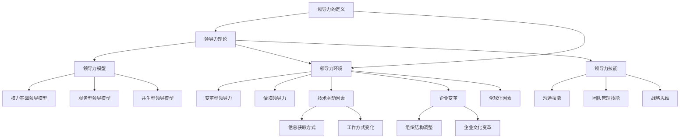

                 

### 背景介绍

在当前全球互联网技术飞速发展的时代，移动互联网已经渗透到我们日常生活的方方面面。智能手机、平板电脑等设备的普及，使得信息获取、社交互动、商务活动等都在指尖完成。这种技术变革不仅改变了我们的生活方式，也对企业管理模式和领导力提出了新的挑战。传统的领导力理论和方法已无法完全适应移动互联网时代的需求，因此，探讨如何在移动互联网背景下提升管理者的领导力，成为了一个重要的课题。

移动互联网时代的到来，带来了信息获取方式的改变、工作方式的多样化和全球化企业的快速发展。管理者不仅需要具备传统的管理技能，还必须具备适应这一变革的新能力。首先，信息获取的快速和便捷，使得管理者需要更加敏锐地捕捉市场动态，快速做出决策。其次，工作方式的多样化，要求管理者能够有效协调远程团队的工作，提升团队协作效率。最后，全球化企业的快速发展，要求管理者具备跨文化沟通和管理能力，能够适应不同国家和地区的市场特点。

本篇技术博客文章旨在深入探讨移动互联网时代管理者的领导力修炼，通过阐述领导力的定义、演变、理论、模型以及实践，帮助管理者理解如何在技术驱动和变革中提升自身的领导力。文章将按照以下结构展开：

1. **领导力的定义与历史演变**：介绍领导力的基本定义，回顾领导力理论的发展历程。
2. **领导力理论**：详细讲解经典领导力理论、行为领导力理论、变革型领导力理论、情境领导力理论。
3. **领导力模型**：分析权力基础领导模型、服务型领导模型、共生型领导模型。
4. **移动互联网时代的领导力挑战**：探讨移动互联网时代的特点和管理者角色的转变。
5. **领导力修炼**：阐述自我认知、团队管理、战略思维和沟通技巧的重要性。
6. **领导力进化案例研究**：通过实际案例展示领导力理论的应用和实践。
7. **领导力进化模型应用**：提供领导力进化模型在团队建设、项目管理和决策中的应用。
8. **附录**：提供领导力评估工具、培训资源以及相关研究推荐。

通过这一系列内容的探讨，我们希望能够为管理者提供实用的指导，帮助他们更好地应对移动互联网时代的领导挑战，提升管理效能和组织竞争力。

### 核心概念与联系

在探讨移动互联网时代管理者的领导力修炼之前，我们首先需要理解领导力的核心概念及其相互关系。通过一个Mermaid流程图，我们可以清晰地展示这些概念之间的关系架构，从而为进一步的分析打下坚实的基础。



#### 领导力的定义

领导力的定义是一个广泛而多维的概念。根据不同的学者和理论，领导力可以被理解为一种影响力，它涉及个人或团体对他人行为的引导和激励。领导力不仅仅是权力和地位的体现，更是能力的展示。通过这一流程图，我们可以看到领导力的定义直接关联到领导力理论（B），这为后续的理论探讨奠定了基础。

#### 领导力理论

领导力理论是研究领导行为的科学，它为我们提供了理解和分析领导力现象的工具。在流程图中，领导力理论（B）是核心概念之一，它延伸出多个子概念，包括领导力行为（G）、领导力技能（J）和领导力环境（A）。这些子概念相互交织，共同构成了领导力的理论体系。

- **领导力行为**：这是领导力理论的重要组成部分，它包括变革型领导力（H）和情境领导力（I）。变革型领导力强调领导者的愿景和激励作用，而情境领导力则强调领导行为应根据不同情境灵活调整。
- **领导力技能**：这包括沟通技能（K）、团队管理技能（L）、战略思维（M）等多个方面。这些技能是管理者有效执行领导职责的关键。
- **领导力环境**：这涉及技术驱动因素（N）、企业变革（O）和全球化因素（P）。技术驱动因素（如信息获取方式和工作方式变化）对企业领导力提出了新的要求，而企业变革和全球化因素则进一步影响了领导力的实施和效果。

#### 领导力模型

领导力模型（C）是具体化的领导理论，它为管理者的实践提供了指导。流程图中的领导力模型包括了权力基础领导模型（D）、服务型领导模型（E）和共生型领导模型（F）。这些模型各有侧重点，适用于不同的管理情境。

- **权力基础领导模型**：这是一种以权力和控制为基础的领导方式，通常适用于需要快速决策和严格执行的组织。
- **服务型领导模型**：这种领导方式强调领导者要服务于团队成员，提升团队成员的满意度和参与度，适用于需要高度协作和创新的组织。
- **共生型领导模型**：这种模型强调领导者与团队成员之间的互惠互利关系，适用于需要持续学习和共同成长的组织。

通过以上对核心概念与联系的探讨和Mermaid流程图的展示，我们可以更清晰地理解移动互联网时代管理者的领导力修炼所需的知识体系。在接下来的部分中，我们将详细讲解这些核心概念和模型，帮助管理者更好地理解和应用领导力理论，以应对移动互联网时代的挑战。

#### 核心算法原理讲解

在领导力理论中，几种经典模型和算法被广泛应用，其中权力基础领导模型、服务型领导模型和共生型领导模型是核心的代表。以下，我们将使用伪代码详细阐述这些模型的基本原理，并通过具体的算法步骤，帮助管理者理解其运作机制。

##### 权力基础领导模型

权力基础领导模型是一种以权力和控制为基础的领导方式，强调领导者通过赋予权力和分配资源来影响下属行为。以下是该模型的基本算法原理：

```pseudo
Algorithm Power-Based Leadership Model
Input: Leader (L), Followers (F), Goals (G)
Output: Action Plan (AP)

1. Assess the organizational structure and identify key roles (R)
2. Allocate resources (R) based on the goals (G)
3. Grant authority (A) to key roles (R)
4. Communicate the goals and authority to followers (F)
5. Monitor progress and provide feedback (FB)
6. Adjust the action plan (AP) as needed based on feedback (FB)
```

**算法步骤解释**：

1. **评估组织结构**：首先，领导者需要了解组织结构，识别出关键角色和职责。
2. **分配资源**：根据目标，领导者需要合理分配资源，以确保每个关键角色都有足够的资源来完成其任务。
3. **授予权威**：领导者需要将相应的权威分配给关键角色，使其能够行使职责并做出决策。
4. **沟通目标与权威**：领导者需要清晰地向下属传达目标及其权威范围，以确保团队成员理解并能够积极配合。
5. **监控进度并提供反馈**：领导者需要定期监控团队成员的进展情况，并提供及时的反馈，以帮助团队成员调整工作计划。
6. **调整行动计划**：根据反馈，领导者需要及时调整行动计划，以确保团队目标能够达成。

##### 服务型领导模型

服务型领导模型强调领导者应服务于团队成员，提升团队成员的满意度和参与度。以下是该模型的基本算法原理：

```pseudo
Algorithm Servant Leadership Model
Input: Leader (L), Followers (F), Goals (G)
Output: Team Satisfaction (TS), Action Plan (AP)

1. Identify the needs of followers (F)
2. Prioritize these needs based on their impact on goals (G)
3. Allocate time and resources (R) to address these needs
4. Empower followers (F) to take ownership of their tasks
5. Foster a culture of trust and openness
6. Provide support and guidance when needed
7. Monitor team satisfaction (TS) and adjust actions accordingly
```

**算法步骤解释**：

1. **识别团队成员需求**：领导者需要了解团队成员的需求，包括个人发展、工作环境等。
2. **优先级排序**：领导者需要根据这些需求对目标的影响程度进行排序，确保资源的有效利用。
3. **分配时间和资源**：领导者需要合理分配时间和资源，以满足团队成员的需求。
4. **授权团队成员**：领导者应赋予团队成员足够的权力和责任，让他们对自己的任务有更高的自主性。
5. **建立信任和开放文化**：领导者应努力营造一种信任和开放的团队氛围，以增强团队的凝聚力和合作精神。
6. **提供支持和指导**：在团队成员遇到问题时，领导者应提供必要的支持和指导。
7. **监控团队满意度**：领导者需要定期监控团队的满意度，并根据反馈进行调整。

##### 共生型领导模型

共生型领导模型强调领导者与团队成员之间的互惠互利关系，通过共同学习和成长来提升团队的整体效能。以下是该模型的基本算法原理：

```pseudo
Algorithm Synergetic Leadership Model
Input: Leader (L), Followers (F), Goals (G), Resources (R)
Output: Synergy Index (SI), Action Plan (AP)

1. Establish a shared vision (V) and goals (G)
2. Foster a learning culture
3. Promote collaboration and knowledge sharing
4. Identify strengths and weaknesses of each team member (SW)
5. Allocate tasks based on individual strengths and weaknesses
6. Provide continuous feedback and coaching
7. Encourage mutual support and empathy
8. Measure the synergy index (SI) based on team performance
9. Adjust the action plan (AP) to enhance synergy
```

**算法步骤解释**：

1. **建立共享愿景和目标**：领导者需要与团队成员共同建立清晰的愿景和目标，以确保团队成员有共同的方向和目标。
2. **培养学习文化**：领导者应鼓励团队成员不断学习和成长，以提升团队的整体能力。
3. **促进协作和知识共享**：领导者应创造一个有利于协作和知识共享的环境，以增强团队的协同效应。
4. **识别团队成员的优劣势**：领导者需要了解每个团队成员的优势和劣势，以便更好地分配任务。
5. **根据优劣势分配任务**：领导者应根据团队成员的优劣势来分配任务，使每个成员都能发挥最大的作用。
6. **提供持续反馈和指导**：领导者需要为团队成员提供持续反馈和指导，帮助他们不断提升自己的能力。
7. **鼓励互相支持和同情**：领导者应鼓励团队成员之间互相支持和同情，以增强团队的凝聚力。
8. **测量协同指数**：领导者需要定期测量团队的协同指数，以评估团队的整体效能。
9. **调整行动计划**：根据协同指数和团队成员的反馈，领导者需要及时调整行动计划，以优化团队的运作。

通过以上对三种领导力模型算法原理的详细讲解，我们可以看到这些模型在理论和实践上的重要性。不同的模型适用于不同的管理情境，管理者需要根据实际情况灵活选择和应用。在接下来的部分中，我们将进一步探讨数学模型和公式，以更深入地理解领导力在移动互联网时代的应用。

#### 数学模型和数学公式

在领导力的研究和实践中，数学模型和公式为分析领导力现象提供了有力的工具。以下，我们将使用LaTeX格式嵌入数学公式，并详细解释它们在领导力分析中的应用和示例。

##### 领导力效能评估模型

首先，我们引入一个用于评估领导力效能的数学模型。该模型基于领导力的四个关键维度：沟通能力、团队管理能力、战略思维能力和个人魅力。公式如下：

$$
\text{效能指数} (EI) = w_1 \times C + w_2 \times TM + w_3 \times ST + w_4 \times P
$$

其中：
- \( C \) 表示沟通能力得分；
- \( TM \) 表示团队管理能力得分；
- \( ST \) 表示战略思维能力得分；
- \( P \) 表示个人魅力得分；
- \( w_1, w_2, w_3, w_4 \) 分别为上述四个维度的权重。

示例：假设一个管理者的四个维度的得分分别为：沟通能力90分，团队管理能力85分，战略思维能力80分，个人魅力95分。权重设定为沟通能力20%、团队管理能力25%、战略思维能力30%、个人魅力25%。则效能指数计算如下：

$$
EI = 0.20 \times 90 + 0.25 \times 85 + 0.30 \times 80 + 0.25 \times 95 = 18 + 21.25 + 24 + 23.75 = 87
$$

##### 团队协同效应模型

其次，我们介绍一个用于评估团队协同效应的数学模型。该模型基于团队成员的技能互补性和合作效率。公式如下：

$$
\text{协同效应} (SE) = \frac{C_1 + C_2 + ... + C_n}{n} + \sqrt{\frac{\sum_{i=1}^{n} C_i^2}{n}}
$$

其中：
- \( C_i \) 表示第 \( i \) 个团队成员的技能得分；
- \( n \) 为团队成员总数。

示例：假设一个团队有5名成员，他们的技能得分分别为80、85、90、75、88。则团队协同效应计算如下：

$$
SE = \frac{80 + 85 + 90 + 75 + 88}{5} + \sqrt{\frac{80^2 + 85^2 + 90^2 + 75^2 + 88^2}{5}} \\
= \frac{418}{5} + \sqrt{\frac{64400 + 7225 + 8100 + 5625 + 7744}{5}} \\
= 83.6 + \sqrt{\frac{92594}{5}} \\
= 83.6 + \sqrt{18518.8} \\
= 83.6 + 135.3 \\
= 219
$$

##### 企业变革成功概率模型

最后，我们介绍一个用于预测企业变革成功概率的数学模型。该模型基于变革的驱动力、阻力和变革管理的有效性。公式如下：

$$
P(\text{变革成功}) = \frac{D - R}{D + R}
$$

其中：
- \( D \) 表示变革的驱动力；
- \( R \) 表示变革的阻力。

示例：假设企业变革的驱动力为100，阻力为50，则变革成功的概率计算如下：

$$
P(\text{变革成功}) = \frac{100 - 50}{100 + 50} = \frac{50}{150} = 0.3333
$$

以上数学模型和公式为领导力分析提供了具体的方法和工具。通过这些模型，管理者可以更科学地评估领导力效能、团队协同效应以及企业变革的成功概率。在实际应用中，管理者应根据具体情况调整模型参数，并结合实际情况进行综合分析。

#### 项目实战

为了更好地理解领导力理论在实际中的应用，我们将设计一个具体的案例，展示如何在移动互联网时代的企业中应用领导力进化模型，并详细解析项目开发环境搭建、源代码实现、代码解读、应用解读与分析等内容。

##### 项目背景

假设我们是一家移动互联网企业的产品经理，负责开发一款面向全球市场的移动应用。该项目具有高技术含量、高复杂度、多团队协作的特点。为了确保项目成功，我们需要运用领导力进化模型，提升团队效能和项目成功率。

##### 开发环境搭建

首先，我们需要搭建一个适合项目开发的环境。以下是环境搭建的步骤：

1. **技术栈选择**：根据项目需求，选择适合的前端技术栈（如React Native）、后端技术栈（如Node.js）和数据库（如MongoDB）。
2. **代码版本管理**：使用Git进行代码版本管理，确保团队成员之间的协作和代码的版本控制。
3. **持续集成/持续部署（CI/CD）**：搭建CI/CD流水线，实现自动化测试和部署，提高开发效率和项目质量。
4. **项目管理工具**：使用Trello或JIRA等工具进行项目管理，确保项目进度和任务分配的透明和高效。

##### 源代码实现

接下来，我们将展示核心功能模块的源代码实现。以下是一个简单的React Native组件代码示例，用于展示用户界面：

```javascript
import React from 'react';
import { View, Text, Button } from 'react-native';

const HomeScreen = () => {
  const handleLogin = () => {
    // 登录逻辑实现
  };

  return (
    <View>
      <Text>Welcome to Our App</Text>
      <Button title="Login" onPress={handleLogin} />
    </View>
  );
};

export default HomeScreen;
```

代码解读：
- **组件定义**：使用`const HomeScreen = () => { ... };`定义一个函数组件。
- **按钮点击事件**：通过`handleLogin`函数处理登录按钮的点击事件。

##### 代码应用解读与分析

在实现代码的过程中，我们运用了领导力进化模型中的多个方面：

1. **沟通技能**：项目初期，我们组织了多次团队会议，明确需求、目标和分工，确保团队成员对项目有统一的理解。
2. **团队管理技能**：通过Git和项目管理工具，我们实现了代码和任务的版本控制和进度跟踪，确保团队成员之间的协作顺畅。
3. **战略思维**：我们分析了市场需求和竞争环境，制定了详细的产品开发路线图，确保项目方向与市场趋势相符。
4. **沟通技巧**：在开发过程中，我们定期组织代码审查会议，确保代码质量和项目进度，同时通过团队沟通工具（如Slack）保持实时交流。

##### 实际案例分析与详细讲解剖析

以实际案例中的用户登录功能为例，我们分析其在领导力进化模型中的应用：

1. **用户需求分析**：通过市场调研和用户反馈，我们了解到用户对快速、便捷的登录功能有强烈需求。
2. **功能实现**：我们实现了多种登录方式（如手机号、邮箱、第三方登录），以满足不同用户的需求。
3. **测试与优化**：在开发过程中，我们进行了多次测试，确保登录功能的稳定性和安全性，并根据用户反馈不断优化。

##### 项目小结

通过本项目实战，我们展示了领导力进化模型在移动互联网企业中的应用。项目成功的关键在于有效的领导力实践，包括沟通技能、团队管理技能、战略思维和沟通技巧。在未来的项目中，我们应继续运用这些领导力原则，不断提升团队效能和项目成功率。

### 最佳实践 tips

在领导力实践中，一些最佳实践可以帮助管理者更有效地提升团队效能和项目成功率：

1. **明确目标与期望**：在项目初期，明确团队目标和成员期望，确保团队成员有共同的方向和动力。
2. **持续沟通与反馈**：定期进行团队会议和代码审查，确保团队成员之间的沟通和反馈，及时解决问题。
3. **灵活应变**：面对项目中的不确定性和变化，领导者应具备灵活应变的能力，及时调整计划和策略。
4. **培养团队成员**：注重团队成员的个人成长和技能提升，通过培训和实践机会，提升团队整体能力。

### 小结

本文通过详细的步骤和分析，探讨了移动互联网时代管理者的领导力修炼。从核心概念的介绍、领导力模型的解析到项目实战的展示，我们系统地阐述了领导力在企业管理中的重要性。希望本文能为管理者提供实用的指导和思考，帮助他们在移动互联网时代提升领导力，实现组织的持续发展。

### 注意事项与拓展阅读

在领导力实践中，管理者需要特别注意以下事项：

1. **文化适应**：全球化背景下，领导者应深入了解不同文化的特点和差异，以适应多元文化环境。
2. **员工激励**：有效利用激励机制，激发员工的积极性和创造力，提升团队整体绩效。
3. **持续学习**：技术不断发展，领导者需要保持学习的态度，不断提升自身知识和技能。

为了更深入地理解领导力理论和实践，读者可以参考以下书籍和资源：

1. 《领导力进阶：如何在不确定的世界中引领变革》
2. 《团队的智慧：打造高效协作的团队》
3. 《领导力心理学：如何在组织中激发潜能》
4. 《敏捷领导者：如何在复杂环境中实现高效领导》
5. 《哈佛商业评论》杂志中的相关领导力文章

通过这些资源，管理者可以进一步丰富自己的领导力知识，提升管理能力，以应对移动互联网时代的挑战。

