                 

## 领导力进阶：成为优秀管理者的必经之路

### 关键词：领导力、管理者、核心技能、实战应用、心理学、可持续发展

> 摘要：领导力不仅是企业成功的关键，更是个人职业发展的核心竞争力。本文将从领导力的基础、核心技能、实战应用及进阶等方面，逐步探讨如何成为一位优秀的管理者。通过深入分析领导力的多维度理解、核心技能以及实际应用，旨在帮助读者掌握提升领导力的必经之路。

### 第一部分：领导力基础

#### 1.1 领导力的定义与重要性

##### 1.1.1 领导力的多维度理解

领导力是一个复杂且多维度的概念，它不仅仅关乎于个人魅力或权威，还包括了领导艺术、团队协作、决策能力等多个方面。在技术领域，领导力同样至关重要，它涉及如何带领团队实现技术目标、推动创新以及解决复杂问题。

**核心概念与联系：**

领导力的多维度可以通过以下Mermaid流程图来展示：

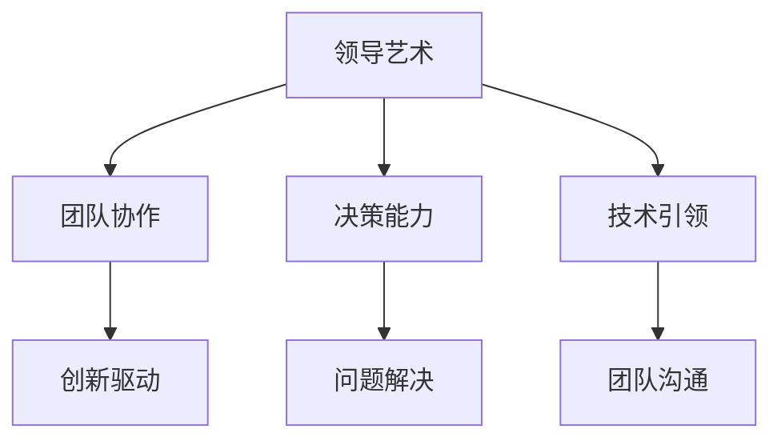

##### 1.1.2 领导力与管理的区别

虽然领导力和管理密切相关，但两者有本质的区别。管理更多地关注于流程、目标和效率，而领导力则侧重于激励、愿景和变革。

**核心概念与联系：**

领导力与管理的区别可以用以下Mermaid流程图来表示：

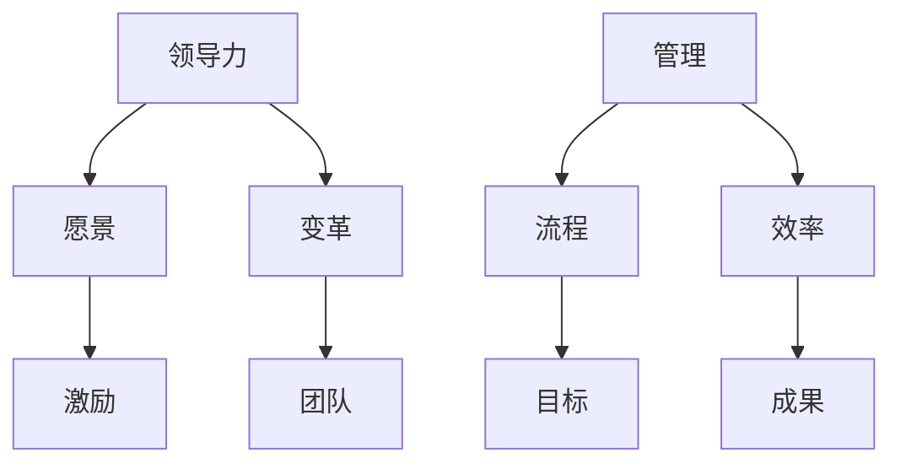

##### 1.1.3 领导力在现代组织中的角色

在现代组织中，领导力扮演着至关重要的角色。它不仅影响团队的工作效率和创新能力，还直接关系到企业的长远发展。

**核心算法原理讲解：**

现代组织中领导力的角色可以通过以下伪代码来描述：

```plaintext
function leadership_in_organizations(organization):
    if organization.needs_innovation:
        leadership_influence_innovation(organization)
    if organization.encounters_issues:
        leadership_solve_issues(organization)
    if organization.needs_growth:
        leadership_drive_growth(organization)
    return organization
```

### 1.2 领导力发展的必经之路

##### 1.2.1 领导力发展的四个阶段

领导力发展通常分为四个阶段：自我认知、角色认知、技能提升和影响力扩展。每个阶段都有其特定的目标和挑战。

**核心概念与联系：**

领导力发展的四个阶段可以用以下Mermaid流程图来表示：

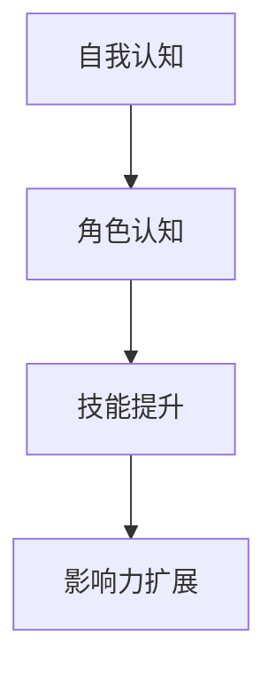

##### 1.2.2 自我认知与领导力的提升

自我认知是领导力发展的基础。了解自己的性格、价值观、优势与弱点，有助于制定个性化的提升策略。

**核心概念与联系：**

自我认知与领导力提升的关系可以用以下Mermaid流程图来表示：

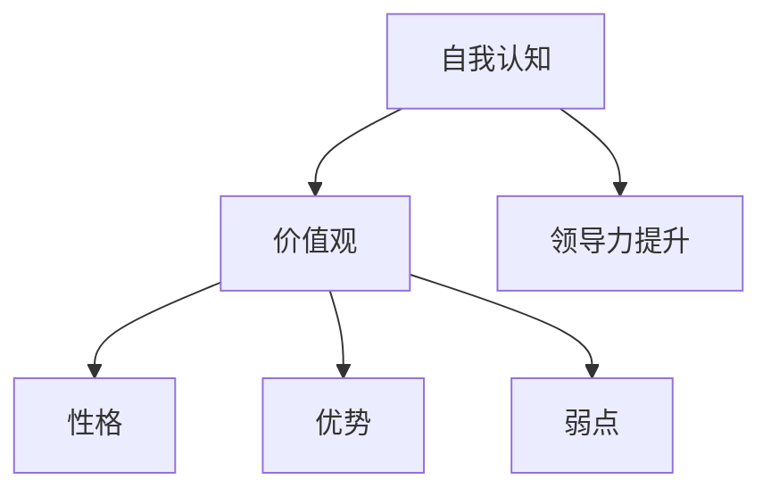

##### 1.2.3 情绪管理与领导风格

情绪管理是领导力的关键组成部分。有效的情绪管理不仅能提升个人效能，还能改善团队氛围。

**核心概念与联系：**

情绪管理与领导风格的关系可以用以下Mermaid流程图来表示：

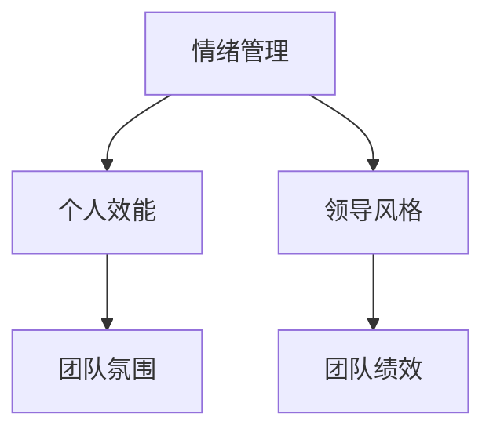

### 第二部分：领导力核心技能

#### 2.1 沟通能力

##### 2.1.1 有效沟通的基本原则

有效沟通是领导力的核心技能之一。理解基本沟通原则，如清晰、简洁和尊重，有助于建立信任和促进合作。

**核心概念与联系：**

有效沟通的基本原则可以用以下Mermaid流程图来表示：

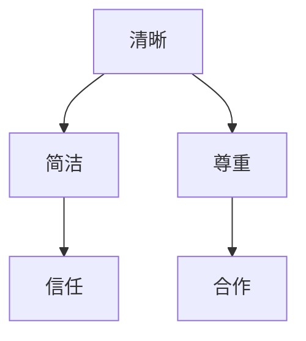

##### 2.1.2 沟通障碍及解决策略

沟通障碍是有效沟通的主要障碍，包括语言障碍、文化差异、信息过载等。解决策略包括倾听、反馈和明确目标。

**核心概念与联系：**

沟通障碍及解决策略可以用以下Mermaid流程图来表示：

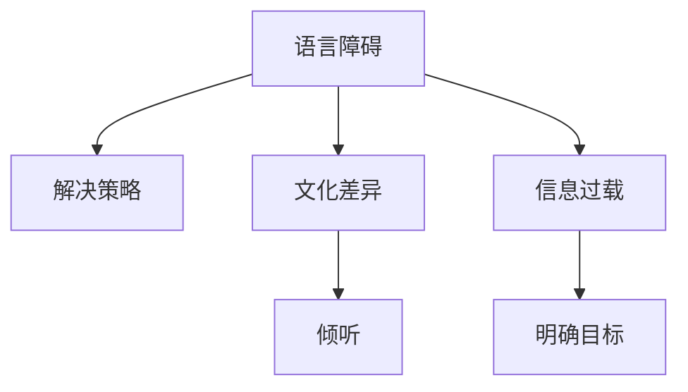

##### 2.1.3 领导者如何进行有效反馈

有效反馈是领导者的一项关键任务。它不仅有助于改进团队成员的表现，还能增强团队凝聚力。

**核心概念与联系：**

领导者如何进行有效反馈可以用以下Mermaid流程图来表示：

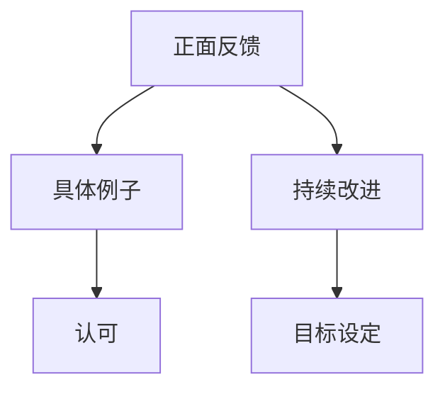

#### 2.2 决策能力

##### 2.2.1 决策的类型与过程

决策是领导力的重要组成部分。了解不同类型的决策以及决策过程，有助于领导者做出更明智的决策。

**核心概念与联系：**

决策的类型与过程可以用以下Mermaid流程图来表示：

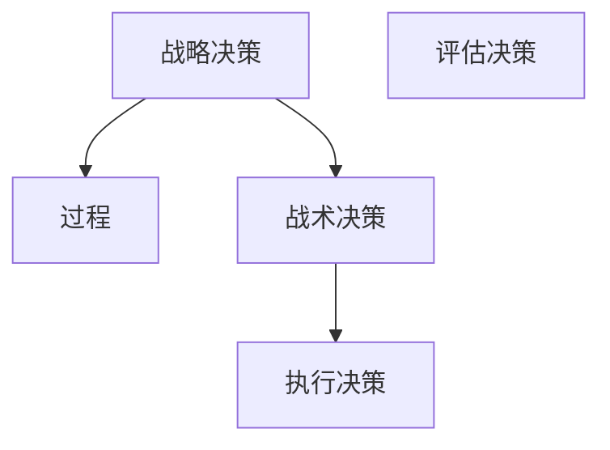

##### 2.2.2 决策中常见的误区

决策中常见的误区包括过度依赖数据、忽视风险和缺乏灵活性。避免这些误区有助于提高决策质量。

**核心概念与联系：**

决策中常见的误区及其避免方法可以用以下Mermaid流程图来表示：

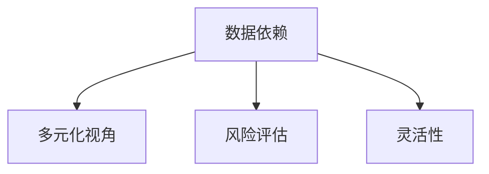

##### 2.2.3 增强决策能力的方法

增强决策能力的方法包括培训、实践和反思。通过不断学习与实践，领导者可以提高决策能力。

**核心概念与联系：**

增强决策能力的方法可以用以下Mermaid流程图来表示：

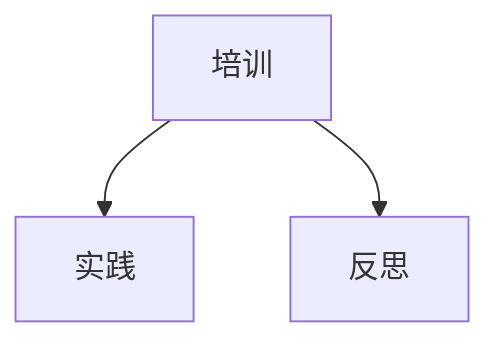

#### 2.3 团队建设

##### 2.3.1 团队建设的核心要素

团队建设是领导力的重要方面。了解核心要素，如信任、协作和目标一致性，有助于构建高效团队。

**核心概念与联系：**

团队建设的核心要素可以用以下Mermaid流程图来表示：

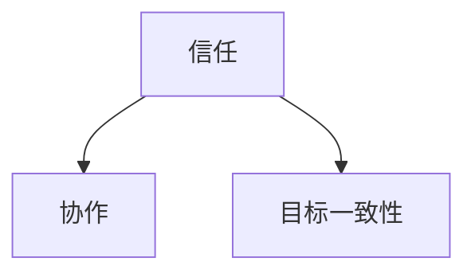

##### 2.3.2 团队冲突的管理与解决

团队冲突是团队建设中的常见问题。有效的冲突管理有助于提高团队效率和绩效。

**核心概念与联系：**

团队冲突的管理与解决可以用以下Mermaid流程图来表示：

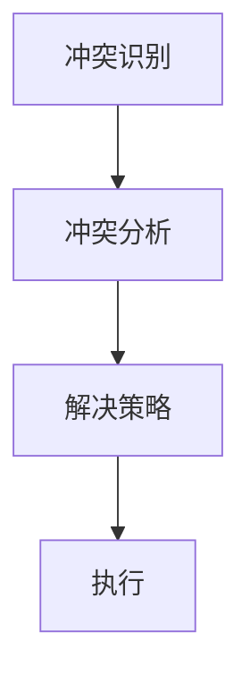

##### 2.3.3 领导者如何激励团队

领导者通过设定目标、提供支持和鼓励创新等方式激励团队，以提高团队士气和绩效。

**核心概念与联系：**

领导者如何激励团队可以用以下Mermaid流程图来表示：

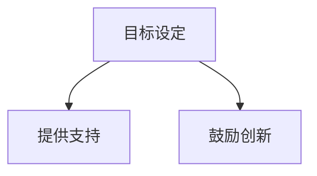

### 第三部分：领导力实战应用

#### 3.1 领导力在团队管理中的应用

##### 3.1.1 团队目标设定与分解

团队目标设定与分解是团队管理的重要环节。通过明确目标，确保团队成员共同奋斗的方向。

**核心概念与联系：**

团队目标设定与分解可以用以下Mermaid流程图来表示：

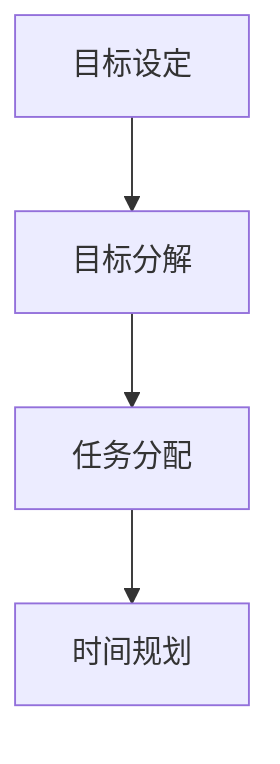

##### 3.1.2 团队成员的角色定位与能力提升

团队成员的角色定位与能力提升有助于提高团队整体效能。领导者应关注团队成员的专业成长和技能提升。

**核心概念与联系：**

团队成员的角色定位与能力提升可以用以下Mermaid流程图来表示：

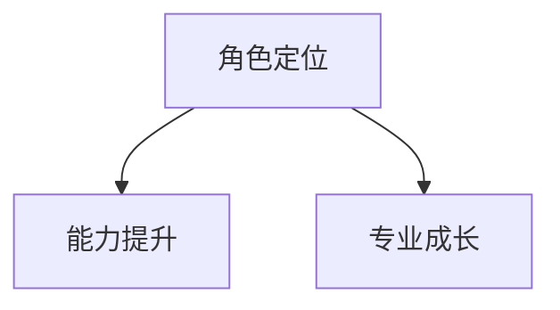

##### 3.1.3 团队绩效评估与反馈机制

团队绩效评估与反馈机制是团队管理的重要环节。通过定期评估和反馈，帮助团队成员不断改进。

**核心概念与联系：**

团队绩效评估与反馈机制可以用以下Mermaid流程图来表示：

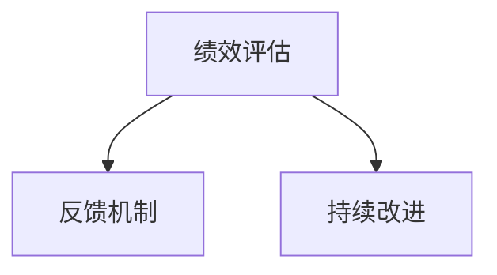

#### 3.2 领导力在组织变革中的应用

##### 3.2.1 变革的类型与过程

组织变革是企业发展的重要驱动力。了解变革的类型与过程，有助于领导者有效推动变革。

**核心概念与联系：**

变革的类型与过程可以用以下Mermaid流程图来表示：

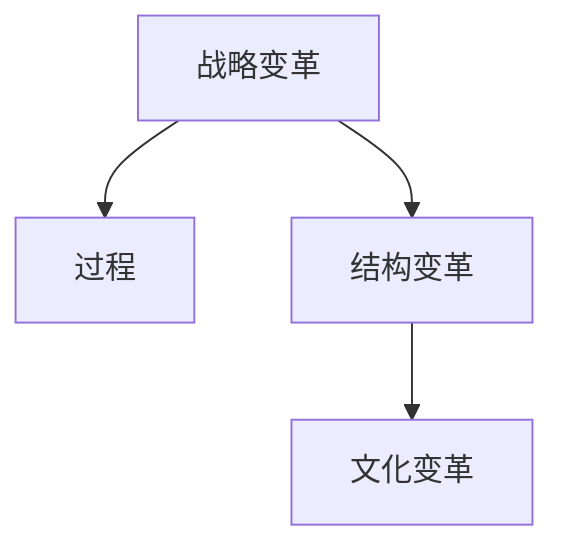

##### 3.2.2 变革中的领导力挑战

变革中的领导力挑战包括沟通障碍、团队抵触和资源限制等。领导者需要应对这些挑战，确保变革成功。

**核心概念与联系：**

变革中的领导力挑战及其应对策略可以用以下Mermaid流程图来表示：

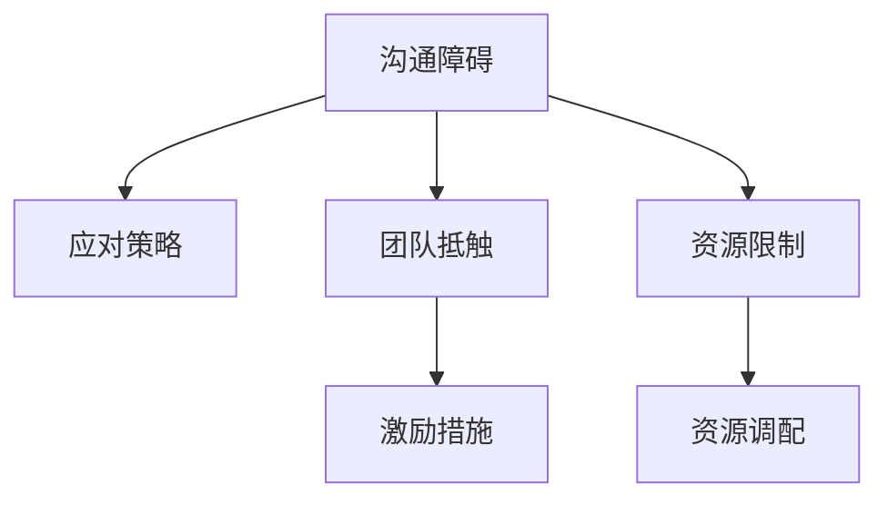

##### 3.2.3 提升变革领导力的策略

提升变革领导力需要领导者不断学习、实践和反思。通过以下策略，领导者可以更好地推动组织变革。

**核心概念与联系：**

提升变革领导力的策略可以用以下Mermaid流程图来表示：

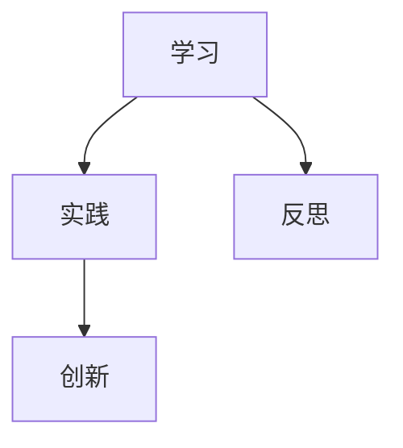

#### 3.3 领导力在个人职业发展中的应用

##### 3.3.1 领导力对职业发展的推动作用

领导力是个人职业发展的重要推动力。掌握领导力技能，有助于在职场中取得更高的成就。

**核心概念与联系：**

领导力对职业发展的推动作用可以用以下Mermaid流程图来表示：

```mermaid
graph TD
    A[领导力技能] --> B[职业发展]
    B --> C[成就]
```

##### 3.3.2 个人品牌建设与领导力提升

个人品牌建设与领导力提升密不可分。通过塑造个人品牌，领导者可以增强影响力和职业竞争力。

**核心概念与联系：**

个人品牌建设与领导力提升的关系可以用以下Mermaid流程图来表示：

```mermaid
graph TD
    A[个人品牌] --> B[领导力]
    B --> C[影响力]
    C --> D[职业竞争力]
```

##### 3.3.3 领导力在职场晋升中的应用

领导力在职场晋升中起着关键作用。掌握领导力技能，有助于在职场中获得更多的晋升机会。

**核心概念与联系：**

领导力在职场晋升中的应用可以用以下Mermaid流程图来表示：

```mermaid
graph TD
    A[领导力技能] --> B[职场晋升]
    B --> C[机会]
```

### 第四部分：领导力进阶

#### 4.1 领导力与心理学

##### 4.1.1 心理学在领导力发展中的应用

心理学在领导力发展中的应用非常广泛。通过理解心理学原理，领导者可以更好地应对管理挑战。

**核心概念与联系：**

心理学在领导力发展中的应用可以用以下Mermaid流程图来表示：

```mermaid
graph TD
    A[心理学原理] --> B[领导力技能]
    A --> C[团队管理]
    A --> D[员工激励]
```

##### 4.1.2 领导力心理学理论概述

领导力心理学理论包括动机理论、领导风格理论、团队动力理论等。理解这些理论有助于提升领导力水平。

**核心概念与联系：**

领导力心理学理论的概述可以用以下Mermaid流程图来表示：

```mermaid
graph TD
    A[动机理论] --> B[领导风格理论]
    A --> C[团队动力理论]
```

##### 4.1.3 应用心理学提升领导力

应用心理学提升领导力，可以通过以下方法：了解员工需求、提升自我认知、改善沟通技巧等。

**核心概念与联系：**

应用心理学提升领导力的方法可以用以下Mermaid流程图来表示：

```mermaid
graph TD
    A[了解员工需求] --> B[提升自我认知]
    A --> C[改善沟通技巧]
```

#### 4.2 领导力与创新

##### 4.2.1 创新在领导力中的角色

创新是领导力的关键组成部分。领导者应积极推动创新，以适应快速变化的市场环境。

**核心概念与联系：**

创新在领导力中的角色可以用以下Mermaid流程图来表示：

```mermaid
graph TD
    A[创新] --> B[领导力]
    A --> C[市场适应]
    A --> D[持续发展]
```

##### 4.2.2 创新领导力的核心要素

创新领导力的核心要素包括创新思维、跨部门合作和风险承担。这些要素有助于推动创新。

**核心概念与联系：**

创新领导力的核心要素可以用以下Mermaid流程图来表示：

```mermaid
graph TD
    A[创新思维] --> B[跨部门合作]
    A --> C[风险承担]
```

##### 4.2.3 如何成为创新型领导者

成为创新型领导者需要不断学习和实践。以下方法可以帮助领导者提升创新能力：

**核心概念与联系：**

如何成为创新型领导者可以用以下Mermaid流程图来表示：

```mermaid
graph TD
    A[持续学习] --> B[实践创新]
    A --> C[培养团队创新]
```

#### 4.3 领导力与可持续发展

##### 4.3.1 可持续发展的领导力原则

可持续发展的领导力原则包括社会责任、环境保护和长期规划。这些原则有助于企业实现可持续发展。

**核心概念与联系：**

可持续发展的领导力原则可以用以下Mermaid流程图来表示：

```mermaid
graph TD
    A[社会责任] --> B[环境保护]
    A --> C[长期规划]
```

##### 4.3.2 领导力在推动可持续发展中的作用

领导力在推动可持续发展中发挥着重要作用。领导者应积极倡导可持续发展理念，推动企业战略调整。

**核心概念与联系：**

领导力在推动可持续发展中的作用可以用以下Mermaid流程图来表示：

```mermaid
graph TD
    A[理念倡导] --> B[战略调整]
    A --> C[员工参与]
```

##### 4.3.3 实践可持续发展领导力的案例

以下是一些实践可持续发展领导力的成功案例，可以帮助领导者更好地理解和应用可持续发展理念：

**核心概念与联系：**

实践可持续发展领导力的案例可以用以下Mermaid流程图来表示：

```mermaid
graph TD
    A[案例一] --> B[环保措施]
    A --> C[社会责任]
    B --> D[员工培训]
    C --> E[可持续发展战略]
```

### 附录：领导力相关工具与资源

#### A.1 领导力评估工具

以下是一些常用的领导力评估工具：

- **360度反馈评估**：通过收集来自团队成员、上级和下属的反馈，全面了解领导力状况。
- **领导力量表评估**：通过量化的指标评估领导力各个方面的表现。

#### A.2 领导力发展资源

以下是一些领导力发展的资源：

- **领导力培训课程**：包括线上和线下课程，帮助领导者提升技能。
- **领导力读物**：包括经典著作和最新研究成果，提供丰富的理论知识和实战经验。

### 结语

领导力不仅是企业成功的关键，更是个人职业发展的核心竞争力。通过本文的逐步分析，我们了解了领导力的定义、核心技能、实战应用以及进阶方法。希望读者能够结合自身实际情况，不断学习和提升领导力，成为优秀的管理者。

**作者：AI天才研究院/AI Genius Institute & 禅与计算机程序设计艺术 /Zen And The Art of Computer Programming**

