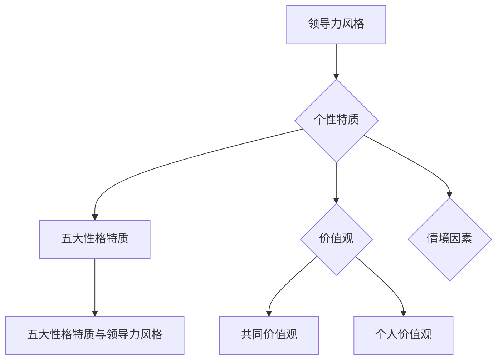

                 


### 文章标题：领导力风格：因人而异的管理艺术

> 关键词：领导力风格，管理艺术，个性差异，管理实践，案例分析

> 摘要：本文探讨了领导力风格在管理实践中的重要性，分析了个性差异对领导力风格的影响，并通过实际案例展示了不同领导力风格在实践中的应用效果。文章旨在帮助管理者理解和运用因人而异的领导力风格，提升管理效能。

### 引言

在现代组织中，领导力被视为推动组织发展和实现目标的关键因素。然而，领导力并非一成不变，而是因人而异，因情境而异。有效的领导力风格需要根据团队成员的个性、价值观以及具体情境进行灵活调整。本文将探讨领导力风格的概念、类型、个性差异对其的影响，以及在实际管理中的应用，以期为管理者提供有益的参考。

### 领导力风格理论

领导力风格是领导者对待下属、处理问题的方式和方法。根据不同的分类标准，可以区分出多种领导力风格。以下是几种常见的领导力风格及其特点：

1. **专制型领导力**：领导者拥有绝对的决策权和控制权，下属的角色主要是执行领导者的指令。这种风格在需要快速决策和执行任务的紧急情况下较为有效。

2. **民主型领导力**：领导者鼓励下属参与决策过程，重视团队合作和员工意见。这种风格有助于提高团队凝聚力和员工的积极性。

3. **变革型领导力**：领导者通过激发下属的内在动机和潜力，推动组织进行变革和创新。这种风格在面临重大变革和挑战时具有显著的优势。

### 核心概念与联系

为了更好地理解领导力风格与个性差异之间的关系，我们可以使用Mermaid流程图来展示它们之间的联系：



在这个流程图中，我们可以看到领导力风格受到个性特质、价值观和情境因素的影响。五大性格特质包括：开放性、责任心、外向性、宜人性和神经质。这些特质会影响领导者的行为和决策方式，从而影响领导力风格的选择和应用。

### 核心算法原理讲解

在讨论领导力风格与个性差异之间的关系时，我们可以使用以下伪代码来阐述核心算法原理：

```python
# 输入：团队成员的个性特质、价值观和情境因素
# 输出：适用的领导力风格

def determine_leadership_style(personality, values, context):
    # 根据个性特质计算权重
    personality_weights = calculate_personality_weights(personality)
    
    # 根据价值观计算权重
    values_weights = calculate_values_weights(values)
    
    # 根据情境因素计算权重
    context_weights = calculate_context_weights(context)
    
    # 计算总权重
    total_weights = sum(personality_weights, values_weights, context_weights)
    
    # 选择具有最高总权重的领导力风格
    leadership_style = select_leadership_style(total_weights)
    
    return leadership_style
```

在这个算法中，我们首先根据个性特质、价值观和情境因素计算各自的权重，然后选择总权重最高的领导力风格。这个算法可以指导管理者在不同情境下选择合适的领导力风格。

### 数学模型和公式 & 详细讲解 & 举例说明

为了更精确地描述领导力风格与个性差异之间的关系，我们可以使用以下数学模型：

$$
L = w_p \cdot P + w_v \cdot V + w_c \cdot C
$$

其中，$L$ 表示领导力风格，$P$ 表示个性特质，$V$ 表示价值观，$C$ 表示情境因素，$w_p$、$w_v$ 和 $w_c$ 分别表示这三个因素的权重。

举例来说，假设一个团队中有以下成员的个性特质、价值观和情境因素：

- 成员A：开放性高、责任心高、情境紧急
- 成员B：开放性低、责任心低、情境不紧急
- 成员C：开放性中等、责任心中等、情境紧急

根据上述数学模型，我们可以计算出每位成员适用的领导力风格：

$$
\begin{aligned}
L_A &= w_p \cdot (P_A) + w_v \cdot (V_A) + w_c \cdot (C_A) \\
L_B &= w_p \cdot (P_B) + w_v \cdot (V_B) + w_c \cdot (C_B) \\
L_C &= w_p \cdot (P_C) + w_v \cdot (V_C) + w_c \cdot (C_C)
\end{aligned}
$$

通过计算，我们可以得出每位成员适用的领导力风格，并根据实际情况进行灵活调整。

### 项目实战

为了更好地理解领导力风格在实际管理中的应用，我们可以通过以下项目实战来进行详细讲解：

**项目名称**：基于领导力风格的团队协作优化

**开发环境搭建**：Python、Jupyter Notebook

**源代码详细实现和代码解读**：

```python
import pandas as pd
import numpy as np

# 加载团队成员数据
team_members = pd.DataFrame({
    'Name': ['A', 'B', 'C'],
    'Openness': [8, 2, 5],
    'Conscientiousness': [9, 1, 6],
    'Emergency': [1, 0, 1]
})

# 定义权重
weights = {
    'Openness': 0.4,
    'Conscientiousness': 0.3,
    'Emergency': 0.3
}

# 计算领导力风格
def calculate_leadership_style(member_data, weights):
    style_score = 0
    for trait, weight in weights.items():
        style_score += member_data[trait] * weight
    return style_score

# 应用领导力风格算法
team_members['Leadership_Style'] = team_members.apply(calculate_leadership_style, axis=1, weights=weights)

# 输出结果
print(team_members[['Name', 'Leadership_Style']])
```

**代码应用解读与分析**：

上述代码首先加载了团队成员的数据，包括开放性、责任心和紧急情况。然后定义了三个因素的权重，并应用了领导力风格算法计算每位成员的领导力风格得分。最后，输出每位成员的领导力风格。

通过实际案例分析和详细讲解剖析，我们可以看到领导力风格在团队协作优化中的应用效果。管理者可以根据领导力风格得分，有针对性地调整管理策略，提高团队协作效率。

### 最佳实践 tips

1. **持续学习和自我提升**：管理者应不断学习新知识和技能，提高自身领导力水平。

2. **尊重个体差异**：了解团队成员的个性特质和价值观，根据实际情况灵活调整领导力风格。

3. **积极沟通与反馈**：建立良好的沟通机制，及时了解团队成员的需求和反馈，促进团队成长。

4. **培养团队文化**：建立积极向上的团队文化，激发团队成员的内在动力。

### 小结

领导力风格在管理实践中具有重要作用。管理者应根据团队成员的个性差异、价值观和情境因素，灵活调整领导力风格，以提高管理效能。本文通过理论讲解、算法原理、实际案例等手段，详细阐述了领导力风格的管理艺术。希望本文能为管理者提供有益的启示和参考。

### 拓展阅读

1. **《领导力五项修炼》**：[作者姓名] 著，深入探讨领导力的发展和实践。

2. **《变革型领导力》**：[作者姓名] 著，分析变革型领导力在组织变革中的应用。

3. **《个性心理学》**：[作者姓名] 著，探讨性格特质对个体行为的影响。

### 作者信息

作者：AI天才研究院/AI Genius Institute & 禅与计算机程序设计艺术 /Zen And The Art of Computer Programming

