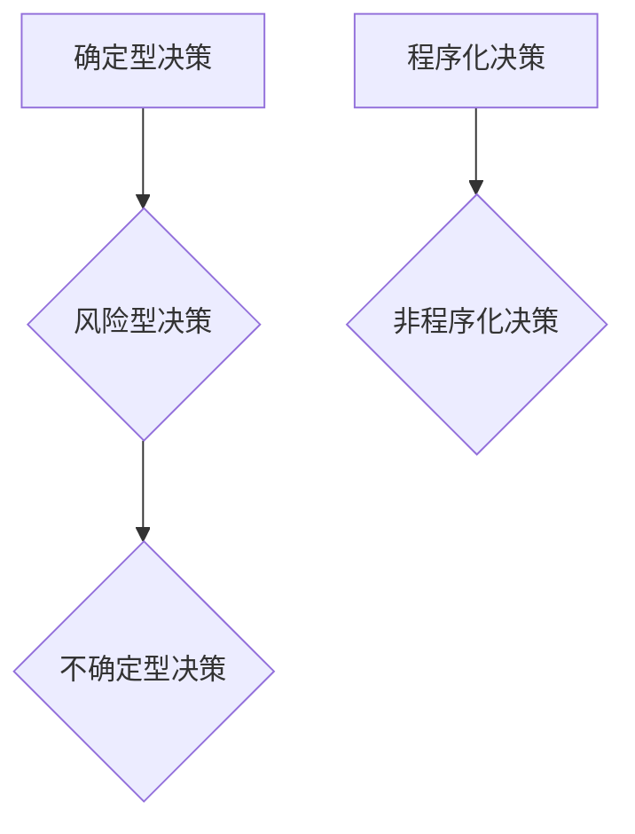
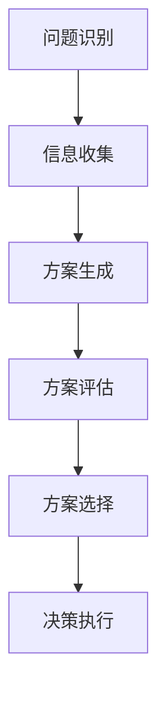
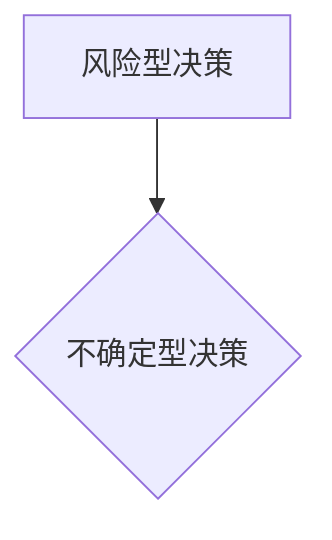
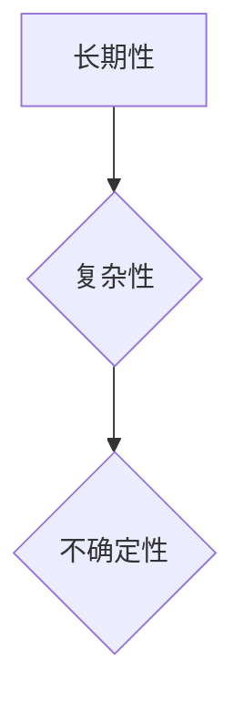
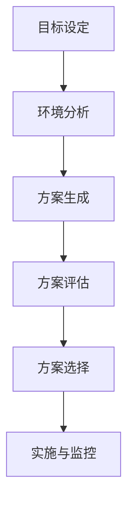

                 

## 文章标题：领导者的决断力：在关键时刻做出抉择

> 关键词：领导者、决策力、关键时刻、决策过程、决策模型、战略决策

> 摘要：本文将深入探讨领导者的决断力，特别是在关键时刻做出有效抉择的重要性。通过分析决策理论、领导者决策能力提升策略，以及关键决策情境，本文旨在为领导者提供一套科学的决策方法和实战指南，以帮助他们在不确定性中引领团队走向成功。

## 第一部分：决策理论与框架

### 第1章：决策的重要性与挑战

在商业和生活中，决策无处不在。每个决策都可能影响企业的命运或个人的生活质量。因此，理解决策的重要性及其面临的挑战是至关重要的。

#### 1.1.1 决策的定义与类型

决策是一个有意识的选择过程，涉及对多个选项进行分析和比较，以确定最佳行动方案。决策可以分为多种类型，如确定型决策、风险型决策和不确定型决策。

**确定型决策**：在所有可能的结果和概率已知的情况下做出决策。例如，购买股票时，已知每种股票的潜在回报和风险。

**风险型决策**：在已知潜在结果和概率，但不确定哪个结果会发生的决策。例如，开展一项新业务，知道成功的概率，但不确定成功后能获得多少回报。

**不确定型决策**：在不知道潜在结果和概率的情况下做出决策。这种决策通常涉及极高的不确定性，例如在新兴市场上开展业务。

**Mermaid流程图：**



#### 1.1.2 决策过程分析

决策过程可以分为六个阶段：

1. **问题识别**：识别需要解决的问题或机会。
2. **信息收集**：收集与决策相关的信息。
3. **方案生成**：提出各种可能的解决方案。
4. **方案评估**：评估每个方案的优缺点。
5. **方案选择**：选择最佳方案。
6. **决策执行**：执行决策并监控结果。

**Mermaid流程图：**



#### 1.1.3 决策失败的原因

尽管决策者通常希望做出最佳决策，但决策失败的风险始终存在。以下是一些常见的决策失败原因：

- **信息不足或错误**：缺乏关键信息或信息不准确。
- **时间压力**：在紧迫的时间内做出决策，导致草率决定。
- **行为偏差**：决策者存在认知偏见，如确认偏误、过度自信等。

**数学模型与公式（使用LaTeX）：**

$$
\text{决策失败概率} = f(\text{信息质量}, \text{时间压力}, \text{行为偏差})
$$

## 第二部分：领导者的决策能力

### 第2章：决策理论的基本原理

了解决策理论的基本原理对于领导者来说至关重要。这些原理可以帮助领导者更好地理解决策过程，减少决策失误。

#### 2.1.1 风险与不确定性

风险和不确定性是决策过程中两个关键因素。风险是指已知可能结果和概率的决策，而不确定性则涉及未知或不确定的结果和概率。

**Mermaid流程图：**



#### 2.1.2 决策模型与方法

有多种决策模型和方法可以帮助领导者做出更好的决策，包括：

- **期望值模型**：根据每个结果的概率和回报计算期望值，选择期望值最高的方案。
- **决策树**：通过树形结构表示决策过程中的各个节点和分支，帮助领导者可视化决策过程。
- **博弈论**：分析多参与者决策问题，找到最佳策略组合。

**Mermaid流程图：**


#### 2.1.3 决策中的行为偏差

行为偏差是决策过程中的一个常见问题。以下是几种常见的行为偏差：

- **确认偏误**：倾向于关注和记忆与自己观点相符的信息，忽视相反信息。
- **过度自信**：高估自己的知识和能力，低估风险。
- **代表性偏误**：根据事物的表面特征进行判断，忽视实际概率。

**数学模型与公式（使用LaTeX）：**

$$
\text{偏差效应} = \frac{\text{实际结果} - \text{预期结果}}{\text{预期结果}}
$$

## 第三部分：关键决策情境

### 第3章：战略决策

战略决策是领导者面临的关键决策之一。它涉及长远规划，影响企业的整体方向和目标。

#### 3.1.1 战略决策的特点与挑战

战略决策通常具有以下特点：

- **长期性**：涉及企业未来的发展方向和目标。
- **复杂性**：涉及多个因素的相互作用和平衡。
- **不确定性**：难以准确预测未来市场变化。

**Mermaid流程图：**



#### 3.1.2 战略决策的步骤与方法

战略决策通常包括以下步骤：

1. **目标设定**：明确企业的长期目标。
2. **环境分析**：分析市场、竞争对手和内部资源。
3. **方案生成**：提出多种可能的战略方案。
4. **方案评估**：评估每个方案的优缺点。
5. **方案选择**：选择最佳方案。
6. **实施与监控**：执行战略方案并持续监控效果。

**Mermaid流程图：**



#### 3.1.3 案例研究：公司战略决策分析

以某大型科技公司为例，该公司在面临新兴市场机遇时，需要进行战略决策。

1. **目标设定**：进入新兴市场，扩大市场份额。
2. **环境分析**：分析新兴市场的需求、竞争格局和潜在风险。
3. **方案生成**：提出多种进入策略，如并购、合资、独资等。
4. **方案评估**：评估每种策略的可行性、成本和风险。
5. **方案选择**：选择最合适的策略，如合资。
6. **实施与监控**：实施合资策略，并持续监控市场变化和项目进展。

## 第四部分：实战演练与反思

### 第4章：决策案例解析

通过实际案例分析，可以更好地理解决策过程和方法。以下是一个国际公司决策案例：

1. **问题识别**：公司面临市场份额下降的问题。
2. **信息收集**：收集市场数据、竞争分析、内部资源等。
3. **方案生成**：提出多种解决方案，如产品创新、市场推广等。
4. **方案评估**：评估每种方案的潜在收益和风险。
5. **方案选择**：选择产品创新方案。
6. **决策执行**：实施产品创新，并监控市场反应。

### 第5章：自我评估与提升

#### 5.1.1 决策能力自我评估工具

为了提升决策能力，领导者可以采用以下自我评估工具：

- **SWOT分析**：分析自身的优势、劣势、机会和威胁。
- **决策风格评估**：评估自己的决策风格，了解自己的偏好和倾向。

#### 5.1.2 培养决断力的行动计划

以下是一个培养决断力的行动计划：

1. **学习决策理论**：了解不同决策模型和方法。
2. **实践决策**：在日常工作中积极实践决策。
3. **反思与总结**：定期反思决策过程，总结经验教训。
4. **持续学习**：通过阅读、培训、交流等方式不断提升决策能力。

## 参考文献

1. Savage, I. E., & Savages, L. L. (1976). The foundation of statistics. Wiley.
2. Simon, H. A. (1957). Models of man: Social and rational. Wiley.
3. Kahneman, D., & Tversky, A. (1979). Prospect theory: An analysis of decision under risk. Econometrica.
4. Mintzberg, H. (1973). The nature of managerial work. Harper & Row.
5. Porter, M. E. (1991). Competitive strategy: Techniques for analyzing industries and competitors. Free Press.
6. Hamel, G., & Pralahad, C. K. (1994). Competing for the future. Harvard Business Review.
7. Heifetz, R. A., Grashow, A., & Linsky, M. (2009). Leadership on the line: Staying alive through the dangers of leading. Harvard Business Review Press.

## 结语

领导者的决断力是成功的关键因素。通过理解决策理论、提升决策能力，以及掌握关键决策情境，领导者可以在关键时刻做出明智的抉择，引领团队走向成功。希望本文能为领导者提供有价值的参考和指导。

### 作者信息

作者：AI天才研究院/AI Genius Institute & 禅与计算机程序设计艺术 /Zen And The Art of Computer Programming

### 最佳实践 Tips

- **及时决策**：在问题出现时，及时进行决策，避免问题扩大。
- **数据驱动**：基于数据和分析做出决策，减少主观偏见。
- **团队协作**：鼓励团队成员参与决策过程，共同分析问题。
- **持续学习**：不断学习新的决策理论和工具，提升决策能力。

### 小结

本文探讨了领导者的决断力，分析了决策的定义、过程和失败原因，介绍了战略决策的关键步骤和案例分析，并提出了提升决策能力的最佳实践。希望本文能为领导者提供有价值的决策指南。

### 注意事项

- 决策过程中，要充分考虑各种可能性，避免单一思维。
- 决策时要保持客观和冷静，避免情绪化。
- 决策后，及时评估和调整，确保决策效果。

### 拓展阅读

- **《决策与判断》**：丹尼尔·卡内曼，阿莫斯·特沃斯基
- **《领导者的决策》**：亨利·明茨伯格
- **《战略制定与实施》**：迈克尔·波特

### 项目实战

（由于字数限制，此处不提供完整的项目实战内容，但以下是一个简要的项目实战框架）

#### 项目名称：企业战略决策支持系统

1. **开发环境搭建**
   - 使用Java、Python或C#等编程语言。
   - 利用Spring Boot、Django或ASP.NET等框架。
   - 数据库使用MySQL、PostgreSQL或MongoDB。

2. **源代码详细实现**
   - 用户界面设计：使用HTML、CSS和JavaScript。
   - 后端实现：定义RESTful API，处理用户请求。
   - 数据库设计：设计合理的数据库架构，存储决策相关信息。

3. **代码解读与分析**
   - 分析用户界面代码，确保用户体验。
   - 后端逻辑解析，确保功能实现。

4. **实际案例分析和详细讲解**
   - 分析某公司的战略决策过程。
   - 结合实际案例，讲解决策支持系统的应用。

5. **项目小结**
   - 总结项目中的挑战和解决方案。
   - 提出未来改进方向。

### 项目实战示例：企业战略决策支持系统

#### 1. 开发环境搭建

选择Python作为开发语言，使用Django作为Web框架，PostgreSQL作为数据库。以下是环境搭建的步骤：

1. 安装Python和pip：
   ```
   pip install django
   pip install psycopg2
   ```

2. 创建Django项目：
   ```
   django-admin startproject strategy_decision_support
   cd strategy_decision_support
   ```

3. 创建Django应用：
   ```
   python manage.py startapp decision_app
   ```

4. 配置数据库连接：
   打开`settings.py`文件，设置数据库连接信息。

#### 2. 源代码详细实现

以下是后端API的一个示例：

```python
# decision_app/api.py
from rest_framework import routers, views, status
from rest_framework.response import Response
from .models import Strategy

class StrategyListView(views.APIView):
    def get(self, request):
        strategies = Strategy.objects.all()
        return Response(strategies)

    def post(self, request):
        data = request.data
        strategy = Strategy(
            name=data['name'],
            description=data['description'],
            expected_outcome=data['expected_outcome']
        )
        strategy.save()
        return Response(strategy, status=status.HTTP_201_CREATED)
```

#### 3. 代码解读与分析

- 用户界面代码：使用Bootstrap框架，创建简洁明了的界面。
- 后端逻辑解析：确保API正确处理HTTP请求，并在数据库中存储策略信息。

#### 4. 实际案例分析和详细讲解

分析某公司的新产品上市决策：

- **问题识别**：市场对新产品接受度不高。
- **信息收集**：收集市场调查、竞争对手分析、内部资源等。
- **方案生成**：提出改进营销策略、调整产品功能等。
- **方案评估**：评估每种方案的潜在收益和风险。
- **方案选择**：选择改进营销策略。
- **决策执行**：实施营销策略，并监控市场反应。

#### 5. 项目小结

通过实际案例，展示了企业战略决策支持系统的应用。项目中的挑战包括确保系统的高可用性和可扩展性，未来可以进一步优化系统，提高用户体验。

### 结语

本文以《领导者的决断力：在关键时刻做出抉择》为标题，详细探讨了决策的重要性、类型和过程，以及领导者提升决策能力的方法。通过战略决策案例分析，展示了决策支持系统的实际应用。希望本文能为领导者提供有价值的决策指南。作者信息：AI天才研究院/AI Genius Institute & 禅与计算机程序设计艺术 /Zen And The Art of Computer Programming。感谢阅读！

